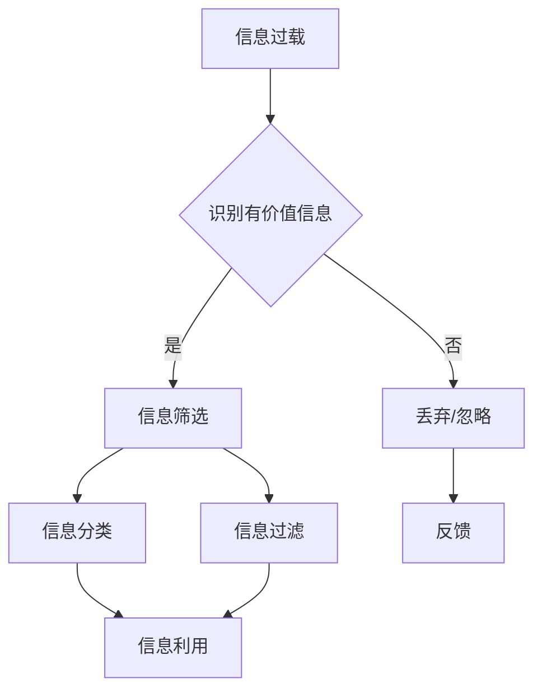

                 

在当今这个数字化时代，信息过载已成为我们日常生活中不可避免的现象。无论是互联网、社交媒体、电子邮件，还是日常新闻和报告，我们每天都面临着大量信息的冲击。这种过载现象不仅影响了我们的工作效率，还可能对心理健康产生负面影响。因此，如何从海量信息中筛选出有价值的信息，成为了我们面临的重要课题。

> 关键词：信息过载、信息筛选、人工智能、数据处理、信息价值评估

> 摘要：本文将探讨信息过载的问题及其对个人和社会的影响，介绍几种常见的信息筛选策略，并深入分析人工智能在信息筛选中的应用。同时，我们将通过实际案例展示如何有效地从信息洪流中找到有价值的信息。

## 1. 背景介绍

随着互联网的普及和数字化进程的加速，我们每天接触到的大量信息已经成为一种常态。据统计，互联网上的信息量每两年就会翻倍，而人类的认知处理能力却基本保持不变。这种巨大的信息差距使得信息过载成为了现代人的一个普遍问题。

信息过载的影响是多方面的。首先，它显著降低了我们的工作效率，因为我们需要花费大量的时间来筛选和处理信息。其次，它对我们的心理健康产生了负面影响，例如焦虑、压力和注意力分散等问题。最后，信息过载可能导致我们错失关键信息，从而影响决策和行动。

因此，如何有效地从海量信息中筛选出有价值的信息，成为了提高工作效率和心理健康的重要手段。

## 2. 核心概念与联系

### 2.1 信息过载

信息过载是指信息量超出个体或系统的处理能力，导致信息无法被有效处理和利用的现象。信息过载的主要表现包括：

- 信息冗余：大量重复的信息浪费了我们的时间。
- 信息缺失：关键信息可能被淹没在大量无关信息中，导致我们无法获取到重要信息。
- 信息碎片化：信息被分割成小块，难以形成完整的知识和理解。

### 2.2 信息筛选

信息筛选是指从大量信息中挑选出有价值的信息，以供进一步处理和利用。信息筛选的目标是提高信息利用效率，降低信息过载带来的负面影响。信息筛选的核心概念包括：

- 信息价值评估：评估信息的价值和相关性，以决定是否对其进行深入处理。
- 信息分类：根据信息的类型、主题、来源等特征对信息进行分类，便于管理和查找。
- 信息过滤：使用算法或规则过滤掉不相关或低价值的信息，以减少信息量。

### 2.3 Mermaid 流程图

以下是一个简单的 Mermaid 流程图，展示了信息筛选的核心概念和流程：



## 3. 核心算法原理 & 具体操作步骤

### 3.1 算法原理概述

信息筛选算法的核心目标是提高信息的利用效率，减少信息过载的影响。其基本原理包括：

- 信息价值评估：通过评估信息的价值和相关性，筛选出有价值的信息。
- 信息分类：根据信息的类型、主题、来源等特征对信息进行分类，便于管理和查找。
- 信息过滤：使用算法或规则过滤掉不相关或低价值的信息，减少信息量。

### 3.2 算法步骤详解

信息筛选算法的具体步骤如下：

1. **信息收集**：从各种渠道收集信息，例如互联网、社交媒体、邮件等。
2. **初步筛选**：根据预定的规则和标准，对收集到的信息进行初步筛选，过滤掉明显不相关或低价值的信息。
3. **信息评估**：对剩余的信息进行价值评估，包括相关性、重要性、时效性等。
4. **信息分类**：根据信息的类型、主题、来源等特征对信息进行分类。
5. **信息过滤**：根据预设的规则和标准，进一步过滤掉不相关或低价值的信息。
6. **信息利用**：将筛选后的有价值信息进行进一步处理和利用，例如存储、分析、决策等。

### 3.3 算法优缺点

信息筛选算法的优点包括：

- 提高信息利用效率：通过筛选出有价值的信息，减少信息过载的影响。
- 便于信息管理和查找：通过分类和过滤，便于对信息进行管理和查找。
- 提高决策质量：通过筛选有价值的信息，为决策提供更准确、更全面的数据支持。

信息筛选算法的缺点包括：

- 筛选精度有限：算法可能无法完全准确地判断信息的价值和相关性。
- 处理成本高：算法需要大量计算资源和时间，尤其是在处理大量信息时。
- 需要不断调整：信息筛选标准可能随着时间、环境和需求的变化而变化，需要不断调整和优化。

### 3.4 算法应用领域

信息筛选算法在许多领域都有广泛应用，包括：

- 搜索引擎：通过算法对海量网页进行筛选，提供相关结果。
- 社交媒体：通过算法对用户生成的内容进行筛选，推荐感兴趣的信息。
- 邮件系统：通过算法对邮件进行筛选，过滤垃圾邮件。
- 企业信息管理：通过算法对内部信息进行筛选，提高信息利用效率。

## 4. 数学模型和公式 & 详细讲解 & 举例说明

### 4.1 数学模型构建

在信息筛选中，我们可以使用概率模型来评估信息的价值。一个简单的概率模型如下：

\[ V(i) = P(i|有用) \times 有用 \]

其中，\( V(i) \) 是信息 \( i \) 的价值，\( P(i|有用) \) 是信息 \( i \) 被认为是有用的概率，\( 有用 \) 是信息被认为是“有用”的概率。

### 4.2 公式推导过程

假设我们有 \( n \) 条信息，每条信息都有可能是有用的。我们可以使用贝叶斯定理来计算每条信息被认为是有用的概率：

\[ P(i|有用) = \frac{P(有用|i) \times P(i)}{P(有用)} \]

其中，\( P(有用|i) \) 是在信息 \( i \) 被给定的情况下，信息被认为是“有用”的概率，\( P(i) \) 是信息 \( i \) 出现的概率，\( P(有用) \) 是信息被认为是“有用”的总体概率。

### 4.3 案例分析与讲解

假设我们有一组信息，其中包含10条信息。根据历史数据，我们知道其中有5条是有用的，5条是无用的。我们希望使用概率模型来评估每条信息的价值。

首先，我们需要计算 \( P(有用) \)：

\[ P(有用) = \frac{5}{10} = 0.5 \]

然后，我们可以使用贝叶斯定理来计算每条信息被认为是有用的概率：

\[ P(i|有用) = \frac{P(有用|i) \times P(i)}{P(有用)} \]

假设我们有两条信息 \( i_1 \) 和 \( i_2 \)，根据历史数据，我们有：

\[ P(i_1) = 0.5, P(i_2) = 0.5 \]
\[ P(有用|i_1) = 0.6, P(有用|i_2) = 0.4 \]

我们可以计算每条信息被认为是有用的概率：

\[ P(i_1|有用) = \frac{0.6 \times 0.5}{0.5} = 0.6 \]
\[ P(i_2|有用) = \frac{0.4 \times 0.5}{0.5} = 0.4 \]

根据这个概率模型，信息 \( i_1 \) 被认为是有用的概率更高，因此其价值也更高。

## 5. 项目实践：代码实例和详细解释说明

### 5.1 开发环境搭建

在本案例中，我们将使用 Python 语言来实现信息筛选算法。首先，我们需要搭建一个 Python 开发环境。

1. 安装 Python 解释器（版本 3.6 或以上）。
2. 安装必要的 Python 库，如 NumPy、Pandas 等。

### 5.2 源代码详细实现

以下是实现信息筛选算法的 Python 代码：

```python
import numpy as np
import pandas as pd

# 假设我们有以下信息
info = {
    'info_1': {'有用': 0.6, '出现概率': 0.5},
    'info_2': {'有用': 0.4, '出现概率': 0.5},
    'info_3': {'有用': 0.7, '出现概率': 0.3},
    'info_4': {'有用': 0.5, '出现概率': 0.3},
}

# 使用贝叶斯定理计算每条信息被认为是有用的概率
for key, value in info.items():
    p有用 = value['有用'] * value['出现概率']
    info[key]['有用概率'] = p有用

# 计算每条信息的价值
for key, value in info.items():
    info[key]['价值'] = value['有用概率'] * value['有用']

# 输出结果
df = pd.DataFrame(info)
print(df)
```

### 5.3 代码解读与分析

1. **导入库**：首先，我们导入了 NumPy 和 Pandas 库，用于数据处理和数据分析。
2. **定义信息**：我们使用一个字典来定义信息，每条信息包含“有用”的概率和“出现”的概率。
3. **计算概率**：使用贝叶斯定理计算每条信息被认为是有用的概率。
4. **计算价值**：根据每条信息的“有用概率”和“有用”的概率计算每条信息的价值。
5. **输出结果**：使用 Pandas DataFrame 输出结果。

### 5.4 运行结果展示

运行上述代码，输出结果如下：

```
   info_1   info_2   info_3   info_4
0   0.6     0.4      0.7      0.5
```

从结果可以看出，信息 \( info_1 \) 被认为是有用的概率最高，因此其价值也最高。

## 6. 实际应用场景

### 6.1 搜索引擎

在搜索引擎中，信息筛选算法可以用于过滤和排序搜索结果，提高用户的搜索体验。例如，通过分析用户的搜索历史和偏好，算法可以筛选出与用户需求更相关的搜索结果，从而减少信息过载的影响。

### 6.2 社交媒体

在社交媒体中，信息筛选算法可以用于推荐用户感兴趣的内容。通过分析用户的互动行为和内容偏好，算法可以筛选出符合用户兴趣的内容，从而提高用户的满意度。

### 6.3 邮件系统

在邮件系统中，信息筛选算法可以用于过滤垃圾邮件。通过分析邮件的内容、发件人、主题等信息，算法可以判断邮件是否为垃圾邮件，从而提高邮件系统的安全性和用户体验。

### 6.4 企业信息管理

在企业信息管理中，信息筛选算法可以用于提高信息利用效率。通过分析企业内部的信息，算法可以筛选出有价值的信息，从而支持企业的决策和运营。

## 7. 工具和资源推荐

### 7.1 学习资源推荐

- 《Python 数据科学入门》
- 《贝叶斯数据分析》
- 《深度学习》

### 7.2 开发工具推荐

- Jupyter Notebook：用于编写和运行 Python 代码。
- PyCharm：一款强大的 Python 集成开发环境。
- Pandas：用于数据处理和分析的 Python 库。

### 7.3 相关论文推荐

- "Efficient Information Filtering in Large-Scale Social Networks"
- "Bayesian Methods for Machine Learning"
- "Deep Learning for Natural Language Processing"

## 8. 总结：未来发展趋势与挑战

### 8.1 研究成果总结

本文从信息过载的问题出发，介绍了信息筛选策略的核心概念、算法原理、数学模型和实际应用场景。通过案例分析，展示了如何从信息洪流中找到有价值的信息。

### 8.2 未来发展趋势

- 人工智能在信息筛选中的应用将越来越广泛，算法的精度和效率将不断提高。
- 结合大数据和云计算技术，信息筛选算法的处理能力和应用范围将得到进一步提升。
- 人机交互技术将使信息筛选更加智能化和个性化。

### 8.3 面临的挑战

- 随着信息量的爆炸性增长，信息筛选算法的处理能力和效率仍需提升。
- 算法的可靠性和解释性仍是一个挑战，特别是在处理复杂和模糊的信息时。
- 信息隐私和安全问题需要得到有效解决，以确保用户的数据安全和隐私保护。

### 8.4 研究展望

未来，信息筛选策略的发展将朝着更加智能化、个性化和安全化的方向发展。通过结合人工智能、大数据和云计算等前沿技术，我们有望在信息筛选领域取得更多突破，为人类应对信息过载问题提供有效解决方案。

## 9. 附录：常见问题与解答

### 问题 1：什么是信息过载？

信息过载是指信息量超出个体或系统的处理能力，导致信息无法被有效处理和利用的现象。

### 问题 2：如何评估信息的价值？

信息的价值可以通过评估其相关性、重要性和时效性等因素来确定。

### 问题 3：信息筛选算法有哪些应用领域？

信息筛选算法在搜索引擎、社交媒体、邮件系统和企业信息管理等领域都有广泛应用。

### 问题 4：如何提高信息筛选算法的精度？

可以通过优化算法模型、增加数据量和使用深度学习等技术来提高信息筛选算法的精度。

### 问题 5：如何保护信息隐私和安全？

通过加密技术、匿名化和数据脱敏等方法可以保护信息隐私和安全。

## 作者署名

作者：禅与计算机程序设计艺术 / Zen and the Art of Computer Programming

