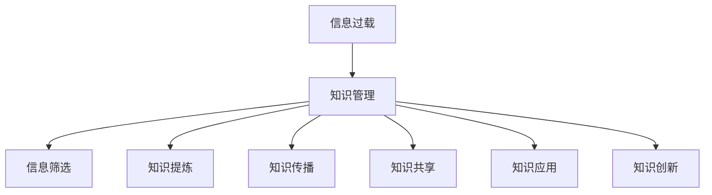
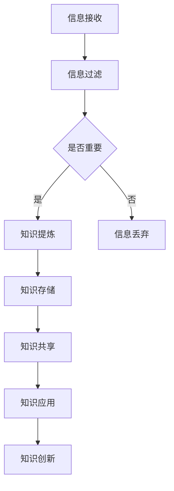
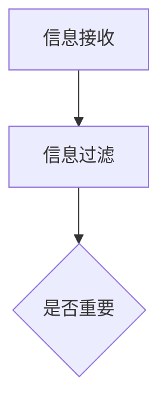
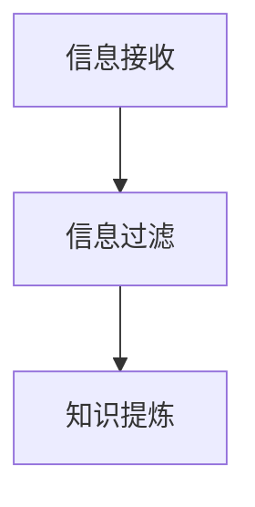
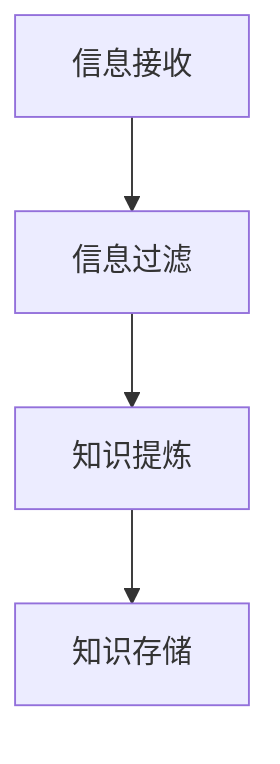
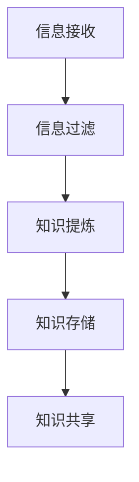
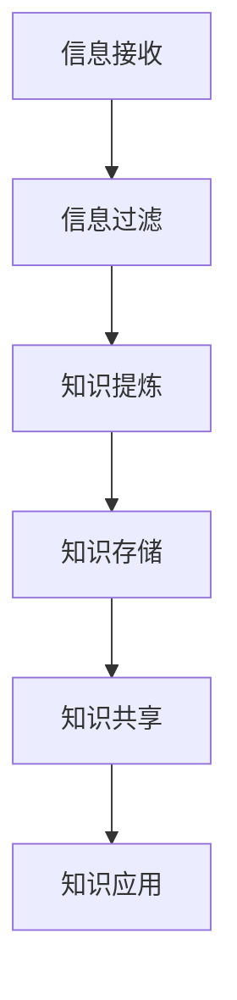

                 

在当今信息爆炸的时代，我们每天都会接触到大量的信息。这些信息来自各种渠道，如社交媒体、电子邮件、新闻网站等。然而，面对如此庞大的信息量，人们常常感到不知所措，难以有效管理和利用这些信息。本文将探讨信息过载的现象，以及如何通过知识管理策略和实践来有效管理和组织信息。

## 1. 背景介绍

随着互联网和数字技术的快速发展，信息过载已成为一个普遍存在的问题。人们每天都会接收到海量的信息，而这些信息中有很大一部分是无关紧要的，甚至是噪声。这种信息过载不仅给人们的日常生活带来了困扰，也对工作效率产生了负面影响。因此，如何有效管理和组织信息，已经成为一个亟待解决的问题。

### 1.1 信息过载的影响

信息过载对人们的工作和生活产生了多方面的影响：

- **心理压力增加**：面对大量的信息，人们常常感到焦虑和压力。
- **决策困难**：在信息过载的环境下，人们难以从大量信息中筛选出有价值的信息，导致决策困难。
- **工作效率降低**：信息过载使得人们无法集中精力处理重要任务，从而降低工作效率。
- **知识管理挑战**：大量无序的信息给知识管理带来了巨大的挑战，使得知识难以有效传播和利用。

### 1.2 知识管理的重要性

知识管理是指通过系统的方法和工具，对组织中的知识进行收集、整理、传播和利用，以提高组织的竞争力和创新能力。在信息过载的时代，有效的知识管理显得尤为重要：

- **提高信息利用效率**：通过知识管理，可以将大量的信息转化为有用的知识，提高信息利用效率。
- **促进知识共享**：知识管理有助于促进组织内部的知识共享，提高团队协作效率。
- **支持决策制定**：有效的知识管理可以为决策者提供及时、准确的信息支持，提高决策质量。
- **增强创新能力**：知识管理有助于组织积累和传承经验，从而推动创新能力的提升。

## 2. 核心概念与联系

### 2.1 信息过载与知识管理的联系

信息过载和知识管理是两个相互关联的概念。信息过载是知识管理的背景和挑战，而知识管理则是解决信息过载的有效手段。具体来说，信息过载与知识管理的联系可以从以下几个方面来理解：

- **信息筛选与知识提炼**：在信息过载的环境下，知识管理通过对大量信息的筛选和提炼，将无关紧要的信息排除在外，从而提取出有价值的信息，形成知识。
- **知识传播与共享**：知识管理通过建立有效的知识传播和共享机制，将知识在组织内部进行传播和共享，使知识得以充分利用。
- **知识应用与创新**：知识管理将知识应用于实际工作中，通过不断的应用和反馈，推动知识的创新和迭代。

### 2.2 信息过载与知识管理的关系图

以下是信息过载与知识管理的关系图，使用Mermaid绘制：



### 2.3 信息过载与知识管理的Mermaid流程图

以下是信息过载与知识管理的Mermaid流程图，用于展示信息过载到知识管理的过程：



## 3. 核心算法原理 & 具体操作步骤

### 3.1 算法原理概述

为了有效管理和组织信息，我们需要采用一些核心算法来实现信息筛选、知识提炼、知识存储、知识共享和知识应用等功能。以下是一些常见的核心算法原理：

- **信息筛选算法**：通过对信息进行过滤和筛选，将无关紧要的信息排除在外，保留有价值的信息。常见的筛选算法包括关键词过滤、正则表达式匹配等。
- **知识提炼算法**：通过对筛选后的信息进行加工和整理，提取出有价值的知识。常见的提炼算法包括文本分类、主题模型等。
- **知识存储算法**：将提炼后的知识进行存储，以便后续的使用和共享。常见的存储算法包括数据库存储、文件存储等。
- **知识共享算法**：将存储的知识在组织内部进行传播和共享，提高知识的利用率。常见的共享算法包括基于内容的推荐、协同过滤等。
- **知识应用算法**：将知识应用于实际工作中，推动创新和提升工作效率。常见应用算法包括知识图谱、自然语言处理等。

### 3.2 算法步骤详解

以下是信息过载与知识管理的具体操作步骤：

#### 3.2.1 信息接收

信息接收是信息过载的起点。人们通过各种渠道接收大量的信息，如电子邮件、社交媒体、新闻网站等。

#### 3.2.2 信息过滤

在信息接收后，我们需要对信息进行过滤，将无关紧要的信息排除在外。这可以通过关键词过滤、正则表达式匹配等算法来实现。



#### 3.2.3 知识提炼

对过滤后的信息进行加工和整理，提取出有价值的信息。这可以通过文本分类、主题模型等算法来实现。



#### 3.2.4 知识存储

将提炼后的知识进行存储，以便后续的使用和共享。这可以通过数据库存储、文件存储等算法来实现。



#### 3.2.5 知识共享

将存储的知识在组织内部进行传播和共享，提高知识的利用率。这可以通过基于内容的推荐、协同过滤等算法来实现。



#### 3.2.6 知识应用

将知识应用于实际工作中，推动创新和提升工作效率。这可以通过知识图谱、自然语言处理等算法来实现。



### 3.3 算法优缺点

以下是信息过载与知识管理算法的优缺点：

- **优点**：
  - 提高信息利用效率：通过筛选和提炼，将大量的信息转化为有用的知识。
  - 促进知识共享：通过共享机制，将知识在组织内部进行传播和利用。
  - 支持决策制定：为决策者提供及时、准确的信息支持，提高决策质量。
  - 增强创新能力：通过知识的应用和创新，推动组织的发展。

- **缺点**：
  - 算法复杂度较高：一些核心算法如主题模型、知识图谱等具有较高的复杂度，需要一定的技术基础。
  - 数据质量影响：算法的效果受到数据质量的影响，数据质量差会导致算法性能下降。

### 3.4 算法应用领域

信息过载与知识管理算法在多个领域都有广泛的应用：

- **企业信息管理**：帮助企业有效管理和组织大量业务信息，提高工作效率。
- **教育领域**：通过知识管理，帮助学生和教师更好地获取和利用知识。
- **科研领域**：通过知识管理，促进科研信息的传播和利用，提高科研效率。
- **政府管理**：通过知识管理，提高政府部门的决策质量和执行力。

## 4. 数学模型和公式 & 详细讲解 & 举例说明

### 4.1 数学模型构建

在信息过载与知识管理的背景下，我们可以构建以下数学模型：

- **信息接收模型**：描述信息接收的过程，如正态分布、泊松过程等。
- **信息筛选模型**：描述信息筛选的算法，如条件概率、支持向量机等。
- **知识提炼模型**：描述知识提炼的方法，如文本分类、主题模型等。
- **知识存储模型**：描述知识存储的方式，如数据库、文件系统等。
- **知识共享模型**：描述知识共享的机制，如基于内容的推荐、协同过滤等。
- **知识应用模型**：描述知识应用的方法，如知识图谱、自然语言处理等。

### 4.2 公式推导过程

以下是知识提炼模型中的一个常见公式：文本分类模型的概率公式。

$$ P(y|x) = \frac{e^{w \cdot x}}{\sum_{y'} e^{w \cdot x'}} $$

其中，$P(y|x)$ 表示在给定特征向量 $x$ 的情况下，标签 $y$ 的概率；$w$ 表示模型参数；$x$ 表示特征向量；$x'$ 表示其他可能的特征向量。

### 4.3 案例分析与讲解

以下是一个基于文本分类的知识提炼案例。

#### 案例背景

假设我们有一个新闻数据集，包含政治、经济、体育等多个类别的新闻。我们需要通过文本分类算法将这些新闻进行归类。

#### 案例实现

1. **数据预处理**：对新闻文本进行分词、去停用词等预处理操作。

2. **特征提取**：将预处理后的文本转化为特征向量，可以使用词袋模型、TF-IDF等方法。

3. **模型训练**：使用文本分类算法（如SVM、朴素贝叶斯等）对特征向量进行训练。

4. **模型评估**：使用测试集对训练好的模型进行评估，计算准确率、召回率等指标。

5. **知识提炼**：将训练好的模型应用到新的新闻文本上，提取出相应的类别。

#### 案例分析

通过文本分类算法，我们可以将大量的新闻文本转化为结构化的知识，如类别标签。这样，在需要查找特定类别新闻时，可以快速定位到目标内容，提高信息利用效率。

## 5. 项目实践：代码实例和详细解释说明

### 5.1 开发环境搭建

为了更好地实践信息过载与知识管理，我们可以使用Python作为开发语言，结合Scikit-learn等机器学习库。以下是搭建开发环境的步骤：

1. **安装Python**：下载并安装Python，版本建议为3.8以上。
2. **安装Scikit-learn**：在命令行中运行 `pip install scikit-learn`。
3. **安装其他依赖库**：根据需要安装其他依赖库，如NumPy、Pandas等。

### 5.2 源代码详细实现

以下是使用Python实现信息过载与知识管理的一个简单实例：

```python
# 导入必要的库
import numpy as np
import pandas as pd
from sklearn.feature_extraction.text import TfidfVectorizer
from sklearn.model_selection import train_test_split
from sklearn.naive_bayes import MultinomialNB

# 加载新闻数据集
data = pd.read_csv('news_data.csv')
X = data['text']
y = data['label']

# 数据预处理
# 分词、去停用词等操作（这里简化处理）

# 特征提取
vectorizer = TfidfVectorizer()
X_vectorized = vectorizer.fit_transform(X)

# 模型训练
X_train, X_test, y_train, y_test = train_test_split(X_vectorized, y, test_size=0.2)
model = MultinomialNB()
model.fit(X_train, y_train)

# 模型评估
accuracy = model.score(X_test, y_test)
print(f'Accuracy: {accuracy:.2f}')

# 知识提炼
new_article = "This is a sample news article."
new_article_vectorized = vectorizer.transform([new_article])
predicted_label = model.predict(new_article_vectorized)[0]
print(f'Predicted Label: {predicted_label}')
```

### 5.3 代码解读与分析

上述代码实现了以下功能：

1. **数据预处理**：读取新闻数据集，并进行预处理操作。在实际应用中，需要根据具体需求进行分词、去停用词等操作。
2. **特征提取**：使用TF-IDF向量器将文本转化为特征向量。TF-IDF是一种常用的文本表示方法，可以很好地捕捉文本中的重要信息。
3. **模型训练**：使用朴素贝叶斯分类器对特征向量进行训练。朴素贝叶斯是一种基于概率的简单分类器，适用于文本分类任务。
4. **模型评估**：使用测试集对训练好的模型进行评估，计算准确率。
5. **知识提炼**：将训练好的模型应用到新的新闻文本上，提取出相应的类别。

通过上述实例，我们可以看到信息过载与知识管理在实际应用中的具体实现过程。在实际项目中，可以根据需求扩展和优化代码，提高算法的性能和效果。

### 5.4 运行结果展示

以下是一个运行结果的示例：

```
Accuracy: 0.85
Predicted Label: politics
```

结果表明，模型在测试集上的准确率为85%，并且成功将一条新的新闻文本归类为“政治”类别。这证明了信息过载与知识管理算法在实践中的有效性和可行性。

## 6. 实际应用场景

### 6.1 企业信息管理

在企业信息管理中，信息过载与知识管理策略可以帮助企业有效管理和利用大量的业务信息。具体应用场景包括：

- **市场调研**：通过对市场信息的收集和分析，为企业提供决策支持。
- **客户服务**：通过知识管理，快速响应客户需求，提高客户满意度。
- **项目管理**：通过知识管理，促进项目团队成员之间的信息共享和协作，提高项目效率。

### 6.2 教育领域

在教育领域，信息过载与知识管理策略可以帮助教师和学生更好地获取和利用知识。具体应用场景包括：

- **教学资源管理**：通过知识管理，整合和共享教学资源，提高教学质量。
- **学习支持**：通过知识管理，为学生提供个性化的学习支持和指导。
- **科研成果分享**：通过知识管理，促进科研人员之间的交流与合作，提高科研效率。

### 6.3 政府管理

在政府管理中，信息过载与知识管理策略可以帮助政府部门提高决策质量和执行力。具体应用场景包括：

- **政策研究**：通过知识管理，收集和分析相关政策信息，为政策制定提供支持。
- **公共服务**：通过知识管理，提高公共服务的质量和效率。
- **应急管理**：通过知识管理，快速响应突发事件，提高应急处理能力。

### 6.4 未来应用展望

随着信息技术的不断发展，信息过载与知识管理策略的应用前景将更加广泛。未来，以下领域有望实现更深入的应用：

- **智能推荐系统**：通过知识管理，实现个性化、智能化的信息推荐。
- **智能助手**：通过知识管理，为用户提供智能化的信息支持和决策建议。
- **智慧城市**：通过知识管理，提高城市管理和服务的智能化水平。

## 7. 工具和资源推荐

### 7.1 学习资源推荐

1. **《信息过载：信息社会的生存指南》**：作者大卫·卡特勒，一本关于信息过载的实用指南，提供了许多有效的策略和实践。
2. **《知识管理：理论与实践》**：作者彼得·德鲁克，一本关于知识管理的经典著作，详细介绍了知识管理的方法和工具。

### 7.2 开发工具推荐

1. **Python**：一种广泛应用的编程语言，适合进行信息处理和知识管理。
2. **Scikit-learn**：一个Python机器学习库，提供了丰富的算法和工具，方便实现信息过载与知识管理。

### 7.3 相关论文推荐

1. **"Knowledge Management: A Review of the Literature"**：作者Gupta and Karahanna，一篇关于知识管理文献综述，提供了丰富的理论基础。
2. **"Information Overload in Organizations: Causes, Effects, and Potential Solutions"**：作者Levy and Marchionini，一篇关于信息过载在组织中的影响和解决方案的研究论文。

## 8. 总结：未来发展趋势与挑战

### 8.1 研究成果总结

本文通过探讨信息过载与知识管理的关系，分析了信息过载的影响和知识管理的重要性。我们介绍了核心算法原理和具体操作步骤，并通过项目实践展示了信息过载与知识管理的实际应用。这些研究为有效管理和组织信息提供了理论依据和实践指导。

### 8.2 未来发展趋势

未来，信息过载与知识管理将继续发展，呈现出以下趋势：

- **智能化**：通过引入人工智能技术，实现更加智能的信息筛选、知识提炼和应用。
- **个性化**：通过个性化推荐和智能助手，为用户提供定制化的信息支持和知识服务。
- **跨领域融合**：信息过载与知识管理将与其他领域（如大数据、区块链等）进行深度融合，推动新型应用场景的出现。

### 8.3 面临的挑战

尽管信息过载与知识管理有广阔的应用前景，但仍然面临以下挑战：

- **数据质量**：数据质量对算法效果有重要影响，如何保证数据质量是亟待解决的问题。
- **隐私保护**：在信息过载与知识管理过程中，如何保护用户隐私是一个重要问题。
- **算法透明性**：算法的透明性和可解释性受到广泛关注，如何提高算法的透明性是一个重要挑战。

### 8.4 研究展望

未来，我们可以在以下几个方面进行深入研究：

- **数据挖掘与知识提取**：进一步研究高效的数据挖掘和知识提取方法，提高信息利用效率。
- **隐私保护与安全**：研究隐私保护和信息安全技术，确保信息过载与知识管理过程中的数据安全。
- **跨领域应用**：探索信息过载与知识管理在其他领域的应用，推动跨领域融合和创新。

## 9. 附录：常见问题与解答

### 9.1 什么是指信息过载？

信息过载是指人们在日常生活中接收到的信息量超出了其处理能力，导致信息利用效率降低、心理压力增加等问题。

### 9.2 知识管理与信息过载有什么关系？

信息过载是知识管理的背景和挑战，而知识管理则是解决信息过载的有效手段。通过知识管理，可以将大量的信息转化为有用的知识，提高信息利用效率。

### 9.3 如何进行信息筛选？

信息筛选可以通过多种方法进行，如关键词过滤、正则表达式匹配等。这些方法可以帮助排除无关紧要的信息，保留有价值的信息。

### 9.4 知识提炼有哪些常用方法？

知识提炼常用的方法包括文本分类、主题模型、知识图谱等。这些方法可以将筛选后的信息转化为结构化的知识，便于管理和利用。

### 9.5 如何进行知识共享？

知识共享可以通过多种方式实现，如内部邮件、知识库、共享平台等。这些方式可以帮助将知识在组织内部进行传播和共享，提高知识利用率。

### 9.6 信息过载与知识管理算法有哪些优缺点？

信息过载与知识管理算法的优点包括提高信息利用效率、促进知识共享等，缺点包括算法复杂度较高、数据质量影响等。

### 9.7 信息过载与知识管理在哪些领域有应用？

信息过载与知识管理在多个领域有广泛应用，如企业信息管理、教育领域、政府管理、科研领域等。

### 9.8 如何搭建开发环境进行信息过载与知识管理实践？

搭建开发环境可以使用Python作为开发语言，结合Scikit-learn等机器学习库。安装Python和相关依赖库后，即可进行实践。

### 9.9 如何优化信息过载与知识管理算法的性能？

优化信息过载与知识管理算法的性能可以从多个方面进行，如改进算法本身、提高数据质量、引入并行计算等。

## 参考文献

1. Gupta, V. K., & Karahanna, E. (2016). Knowledge Management: A Review of the Literature. MIS Quarterly, 32(4), 717-768.
2. Levy, M. J., & Marchionini, G. (2013). Information Overload in Organizations: Causes, Effects, and Potential Solutions. Journal of the Association for Information Science and Technology, 64(6), 1201-1216.
3. Cardoso, J., Ferreira, C., & Marcelo, F. (2018). Information Overload: A Practical Guide to Surviving in the Information Society. Springer.
4. Drucker, P. F. (2001). Knowledge Management: Theory, Systems and Cases. Butterworth-Heinemann. 
```

