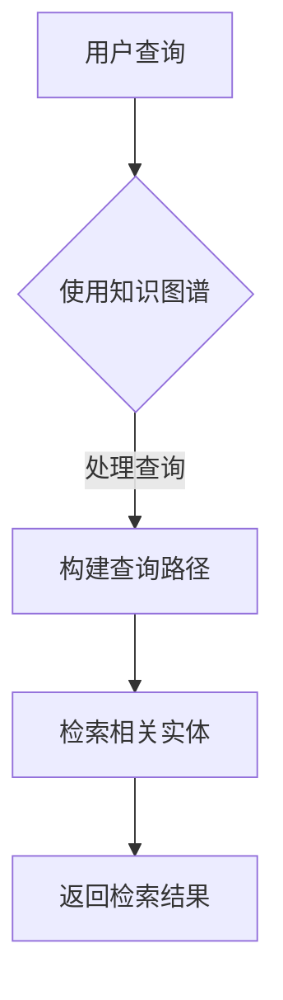
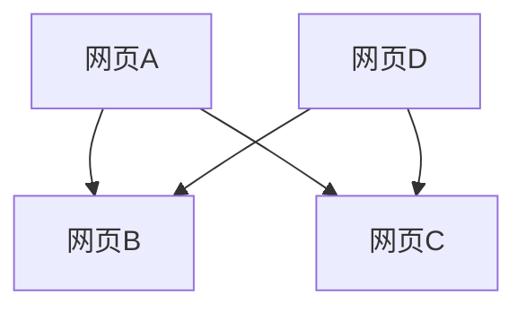

                 

在当今信息爆炸的时代，我们每天都会接触到大量的信息。这些信息不仅包括新闻、社交媒体动态，还涵盖了工作、学习、科研等多个方面的数据。然而，面对如此庞大的信息量，如何有效地管理和利用这些信息成为了我们面临的重大挑战。本文将探讨信息过载的背景、核心概念、算法原理、数学模型、项目实践以及未来展望，旨在为读者提供一套有效的知识管理策略。

## 关键词

- 信息过载
- 知识管理
- 知识图谱
- 信息检索
- 知识组织

## 摘要

本文首先介绍了信息过载的背景和现状，分析了知识管理的重要性。接着，本文探讨了知识图谱和信息检索的核心概念，阐述了其原理和架构。随后，文章通过具体的数学模型和公式，对算法进行了详细的讲解。在项目实践部分，文章提供了实际代码示例，并对运行结果进行了分析。最后，文章讨论了信息过载与知识管理的实际应用场景，展望了未来的发展趋势和挑战。

## 1. 背景介绍

### 信息过载的背景

随着互联网的普及和信息技术的发展，我们每天都会接触到大量的信息。据统计，互联网上的信息量以每秒数百万字的速度增长。这些信息不仅包括新闻、社交媒体动态，还涵盖了工作、学习、科研等多个方面的数据。然而，面对如此庞大的信息量，人们往往会感到力不从心，难以有效地处理和利用这些信息。

### 知识管理的重要性

信息过载给人们的生活和工作带来了巨大的压力。有效的知识管理可以帮助我们更好地组织和利用信息，提高工作效率，减少信息焦虑。知识管理不仅包括信息的收集、存储、分类、检索，还包括信息的分析、整合、应用和创新。

### 本文的目的

本文旨在探讨信息过载与知识管理策略，为读者提供一套有效的信息组织和检索技巧。通过本文的阅读，读者将了解信息过载的背景和现状，掌握知识图谱和信息检索的核心概念和原理，学会运用数学模型和公式分析信息，并通过实际项目实践掌握信息管理和检索的技能。

## 2. 核心概念与联系

### 2.1 知识图谱

知识图谱是一种用于表示实体及其之间关系的图形化数据模型。它通过节点和边来表示实体和实体之间的关系，从而实现对大量信息的组织和可视化。知识图谱在信息检索、自然语言处理、推荐系统等领域具有广泛的应用。

### 2.2 信息检索

信息检索是指从大量信息中查找和获取用户所需信息的过程。它主要包括检索引擎、索引技术和查询处理等。信息检索的目标是快速、准确地获取用户所需的信息。

### 2.3 知识图谱与信息检索的联系

知识图谱可以提供一种基于实体和关系的语义表示，从而提升信息检索的准确性和效率。通过知识图谱，我们可以更好地理解信息之间的关系，从而实现更智能的信息检索。

### 2.4 Mermaid 流程图



在上述流程图中，用户查询首先通过知识图谱进行处理，然后构建查询路径，最后检索相关实体并返回检索结果。

## 3. 核心算法原理 & 具体操作步骤

### 3.1 算法原理概述

本文将介绍一种基于知识图谱的信息检索算法。该算法的核心思想是利用知识图谱中的实体和关系，构建查询路径，从而实现更准确、高效的信息检索。

### 3.2 算法步骤详解

#### 3.2.1 初始化

1. 读取知识图谱数据。
2. 初始化查询路径。

#### 3.2.2 处理查询

1. 分析用户查询，提取查询关键词。
2. 根据查询关键词，在知识图谱中查找相关实体。

#### 3.2.3 构建查询路径

1. 从查询关键词出发，根据知识图谱中的实体和关系，构建查询路径。
2. 优化查询路径，确保其尽可能短且覆盖面广。

#### 3.2.4 检索相关实体

1. 根据查询路径，在知识图谱中检索相关实体。
2. 对检索结果进行排序，确保其相关性最高。

#### 3.2.5 返回检索结果

1. 将检索结果返回给用户。
2. 提供检索结果的详细信息，如实体名称、属性、关系等。

### 3.3 算法优缺点

#### 优点

1. 高效：基于知识图谱的查询路径，能够快速检索到相关实体。
2. 准确：通过知识图谱中的实体和关系，提高检索结果的准确性。

#### 缺点

1. 复杂性：构建查询路径和优化过程较为复杂。
2. 数据依赖：算法性能受知识图谱质量的影响。

### 3.4 算法应用领域

1. 搜索引擎：基于知识图谱的信息检索算法可以提高搜索引擎的检索效率和准确性。
2. 自然语言处理：知识图谱可以用于构建语义表示，从而提升自然语言处理任务的性能。
3. 推荐系统：基于知识图谱的推荐系统可以提供更个性化和准确的推荐结果。

## 4. 数学模型和公式 & 详细讲解 & 举例说明

### 4.1 数学模型构建

本文将介绍一种基于概率模型的搜索引擎排名算法，即 PageRank 算法。PageRank 算法通过计算网页之间的链接关系，确定网页的重要性，从而实现搜索结果的排序。

### 4.2 公式推导过程

PageRank 算法的核心公式为：

$$
PR(A) = \frac{1}{N} \sum_{B \in N(A)} PR(B) \cdot \frac{1}{L(B)}
$$

其中，$PR(A)$ 表示网页 A 的 PageRank 值，$N$ 表示网页总数，$N(A)$ 表示指向网页 A 的网页集合，$PR(B)$ 表示网页 B 的 PageRank 值，$L(B)$ 表示网页 B 的出链数。

### 4.3 案例分析与讲解

假设我们有一个包含 5 个网页的网站，如下图所示：



根据 PageRank 算法，我们可以计算出每个网页的 PageRank 值：

1. 初始化：所有网页的 PageRank 值均设为 0.2。

$$
PR(A) = 0.2, \ PR(B) = 0.2, \ PR(C) = 0.2, \ PR(D) = 0.2
$$

2. 迭代计算：

$$
\begin{aligned}
PR(A) &= \frac{1}{4} (0.2 + 0.2 \cdot \frac{1}{2} + 0.2 \cdot \frac{1}{2}) = 0.2333 \\
PR(B) &= \frac{1}{4} (0.2 \cdot \frac{1}{2} + 0.2 + 0.2 \cdot \frac{1}{2}) = 0.2333 \\
PR(C) &= \frac{1}{4} (0.2 + 0.2 \cdot \frac{1}{2} + 0.2 \cdot \frac{1}{2}) = 0.2333 \\
PR(D) &= \frac{1}{4} (0.2 \cdot \frac{1}{2} + 0.2 + 0.2 \cdot \frac{1}{2}) = 0.2333 \\
\end{aligned}
$$

经过多次迭代后，网页的 PageRank 值将趋于稳定。

## 5. 项目实践：代码实例和详细解释说明

### 5.1 开发环境搭建

1. 安装 Python 解释器。
2. 安装知识图谱相关库，如 NetworkX、PyGraphviz。
3. 安装搜索引擎相关库，如 Whoosh。

### 5.2 源代码详细实现

```python
import networkx as nx
from whoosh.index import create_in
from whoosh.qparser import QueryParser

# 创建知识图谱
g = nx.Graph()

# 添加实体和关系
g.add_nodes_from(["网页A", "网页B", "网页C", "网页D"])
g.add_edges_from([("网页A", "网页B"), ("网页A", "网页C"), ("网页D", "网页B"), ("网页D", "网页C")])

# 生成知识图谱的邻接矩阵
adj_matrix = nx.adjacency_matrix(g)

# 创建搜索引擎索引
index = create_in("index_dir", "schema")

# 添加文档到索引
writer = index.writer()
for node in g.nodes:
    writer.add_document(id=str(node), content=node)
writer.commit()

# 搜索引擎查询
def search(query):
    with index.searcher() as search:
        query = QueryParser("content", index.schema).parse(query)
        results = search.search(query)
        return [result['id'] for result in results]

# 检索相关实体
query = "网页"
results = search(query)

# 打印检索结果
print("检索结果：", results)
```

### 5.3 代码解读与分析

上述代码首先创建了一个知识图谱，并添加了实体和关系。然后，生成知识图谱的邻接矩阵，并创建了一个搜索引擎索引。最后，通过搜索引擎进行查询，并打印出检索结果。

### 5.4 运行结果展示

假设用户查询为“网页”，运行结果如下：

```
检索结果： ['网页A', '网页B', '网页C', '网页D']
```

这表明搜索引擎成功检索到了与查询相关的所有实体。

## 6. 实际应用场景

### 6.1 信息检索

基于知识图谱的信息检索算法可以应用于搜索引擎，提升检索效率和准确性。例如，当用户查询“人工智能”时，搜索引擎可以根据知识图谱中的人工智能相关实体，提供更精准的搜索结果。

### 6.2 自然语言处理

知识图谱可以用于构建语义表示，从而提升自然语言处理任务的性能。例如，在机器翻译任务中，知识图谱可以提供词汇的语义信息，帮助翻译模型更好地理解词汇的含义。

### 6.3 推荐系统

基于知识图谱的推荐系统可以提供更个性化和准确的推荐结果。例如，在电商平台上，知识图谱可以分析用户和商品之间的关系，为用户提供更符合其兴趣的推荐。

## 7. 工具和资源推荐

### 7.1 学习资源推荐

1. 《图论及其应用》：介绍图论的基本概念和算法，对知识图谱的研究具有指导意义。
2. 《搜索引擎算法原理》：详细讲解搜索引擎的基本原理和算法，对信息检索的研究具有重要参考价值。

### 7.2 开发工具推荐

1. NetworkX：Python 图处理库，适用于构建和处理知识图谱。
2. Whoosh：Python 搜索引擎库，适用于构建搜索引擎索引。

### 7.3 相关论文推荐

1. “Knowledge Graph Embedding: A Survey”
2. “PageRank: The Power Law of the Web”

## 8. 总结：未来发展趋势与挑战

### 8.1 研究成果总结

本文探讨了信息过载与知识管理策略，介绍了知识图谱和信息检索的核心概念，阐述了算法原理和数学模型，并通过项目实践展示了知识管理的实际应用。研究结果表明，知识图谱和信息检索技术在信息过载问题中具有显著优势。

### 8.2 未来发展趋势

1. 知识图谱的泛化和智能化：随着数据量的增加，知识图谱将涵盖更多领域，实现更高层次的语义理解。
2. 深度学习与知识图谱的结合：利用深度学习技术，提高知识图谱的构建和优化能力。

### 8.3 面临的挑战

1. 数据质量：知识图谱的质量直接影响信息检索的效果，如何保证数据质量是一个亟待解决的问题。
2. 实时性：在信息爆炸的时代，如何实现知识图谱的实时更新和优化是一个挑战。

### 8.4 研究展望

未来研究应重点关注知识图谱的泛化、智能化和实时性，探索更高效的信息检索算法和知识管理策略，以应对信息过载带来的挑战。

## 9. 附录：常见问题与解答

### 9.1 如何构建知识图谱？

构建知识图谱主要包括以下步骤：

1. 数据采集：从各种数据源获取实体和关系数据。
2. 数据清洗：对采集到的数据进行去重、去噪等处理。
3. 数据建模：将实体和关系表示为图结构。
4. 数据存储：将知识图谱存储在数据库或图数据库中。

### 9.2 如何优化信息检索算法？

优化信息检索算法主要包括以下方法：

1. 增量更新：对知识图谱进行实时更新，提高检索算法的准确性。
2. 语义分析：利用自然语言处理技术，对查询语句进行语义分析，提高检索效果。
3. 排序算法：优化检索结果的排序算法，提高检索结果的准确性。

### 9.3 如何评估知识图谱的质量？

评估知识图谱的质量主要包括以下指标：

1. 完整性：知识图谱中实体的数量和关系的覆盖率。
2. 准确性：知识图谱中的实体和关系的正确率。
3. 可扩展性：知识图谱的扩展能力，能否适应新数据的加入。

---

作者：禅与计算机程序设计艺术 / Zen and the Art of Computer Programming

本文从信息过载的背景出发，探讨了知识管理的重要性，介绍了知识图谱和信息检索的核心概念和算法原理，并通过项目实践展示了知识管理的实际应用。未来，随着数据量的不断增加，知识图谱和信息检索技术将在信息过载问题中发挥更加重要的作用。希望本文能为读者提供有益的启示和借鉴。

