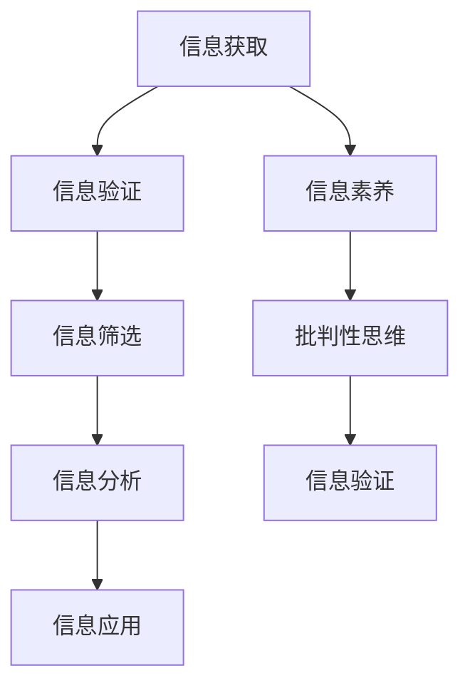

                 

 在这个充满数字信息的时代，我们每个人都成为了信息的大海中的小船，信息的洪流无时无刻不在冲击着我们。然而，正如大海中的小船需要指南针来指引方向一样，我们也需要一套有效的信息验证和信息素养教育体系来帮助我们辨别真伪、找到真理。本文旨在探讨如何通过培养批判性思维和信息素养能力，为数字时代的人们提供一条清晰的信息导航之路。

## 1. 背景介绍

信息验证和信息素养教育是两个看似独立，但实则密不可分的概念。信息验证指的是对信息真实性、准确性和可靠性的辨别过程，它是保障信息质量的基础。而信息素养教育则是指培养人们正确获取、评估和使用信息的能力，它是提升个人综合素质的关键。在数字时代，随着互联网的普及和信息技术的迅猛发展，信息验证和信息素养教育的重要性日益凸显。

### 信息验证的重要性

在数字时代，信息验证的重要性不言而喻。首先，虚假信息、误导性信息、恶意信息等问题的泛滥，给个人、组织乃至社会带来了巨大的危害。例如，2016年的美国总统大选期间，社交媒体上的虚假新闻和误导性信息对选民的判断产生了严重影响。其次，信息验证是保护个人隐私和数据安全的关键环节。随着大数据和人工智能技术的广泛应用，个人数据的泄露和滥用问题日益严重，只有通过信息验证，才能有效防止信息被非法获取和利用。

### 信息素养教育的重要性

信息素养教育不仅关乎个人的发展，更关乎社会的进步。首先，信息素养教育能够提高个人的信息获取能力，使人们能够迅速、准确地找到所需信息。其次，信息素养教育能够培养个人的批判性思维，使人们能够对信息进行深度分析和判断，避免被虚假信息所蒙蔽。此外，信息素养教育还能够提升个人的综合素质，使人们具备良好的信息处理能力和创新能力，从而在竞争激烈的社会中立于不败之地。

## 2. 核心概念与联系

### 核心概念

要深入理解信息验证和信息素养教育，首先需要明确几个核心概念：

1. **信息验证**：是指对信息的真实性、准确性和可靠性进行验证的过程。它包括信息的来源、内容、传播途径等多个方面。
2. **信息素养**：是指个人在信息社会中正确获取、评估和使用信息的能力。它包括信息检索、信息筛选、信息分析、信息应用等多个方面。
3. **批判性思维**：是指对信息进行深度分析和判断的能力，它要求人们能够超越表面现象，挖掘信息的内在逻辑和真实含义。

### 信息验证和信息素养教育的联系

信息验证和信息素养教育是相辅相成的。信息验证是信息素养教育的基础，只有通过信息验证，才能确保所获取的信息是真实、准确和可靠的。而信息素养教育则是信息验证的延伸，它不仅要求人们能够验证信息，更要求人们能够对信息进行深度分析和判断，从而避免被虚假信息所误导。

### 信息验证和信息素养教育的架构

为了更好地理解信息验证和信息素养教育，我们可以使用 Mermaid 流程图来描述其架构：



在这个架构中，信息获取是整个过程的起点，通过信息验证，我们可以确保所获取的信息是真实、准确和可靠的。然后，通过信息筛选、信息分析和信息应用，我们可以对信息进行深度加工和利用。同时，信息素养和批判性思维贯穿整个流程，它们不仅提高了信息处理的能力，更提升了人们的综合素质。

## 3. 核心算法原理 & 具体操作步骤

### 3.1 算法原理概述

在信息验证和信息素养教育中，核心算法原理至关重要。以下是几种常用的算法原理：

1. **一致性验证**：通过对比多个来源的信息，判断其是否一致，以此来验证信息的真实性。
2. **逻辑推理**：利用逻辑规则，对信息进行推理和判断，以此来发现信息的内在逻辑。
3. **统计分析**：通过对大量信息进行统计分析，发现信息中的规律和趋势，以此来评估信息的可靠性。

### 3.2 算法步骤详解

#### 一致性验证算法

1. **输入**：多个信息源。
2. **处理**：对比信息源之间的信息，找出不一致的地方。
3. **输出**：判断信息是否一致。

#### 逻辑推理算法

1. **输入**：一组信息。
2. **处理**：利用逻辑规则，对信息进行推理。
3. **输出**：得出结论。

#### 统计分析算法

1. **输入**：大量信息。
2. **处理**：对信息进行统计分析。
3. **输出**：发现信息的规律和趋势。

### 3.3 算法优缺点

#### 一致性验证算法

- 优点：简单直观，容易实现。
- 缺点：只能验证信息的一致性，无法判断信息的可靠性。

#### 逻辑推理算法

- 优点：可以深度分析信息，发现信息的内在逻辑。
- 缺点：复杂度较高，需要大量规则。

#### 统计分析算法

- 优点：可以处理大量信息，发现信息的规律和趋势。
- 缺点：对数据的依赖性较强。

### 3.4 算法应用领域

- **一致性验证算法**：广泛应用于信息验证领域，如数据质量检查、信息比对等。
- **逻辑推理算法**：广泛应用于逻辑推理和信息分析领域，如人工智能、数据分析等。
- **统计分析算法**：广泛应用于数据分析和预测领域，如金融分析、市场预测等。

## 4. 数学模型和公式 & 详细讲解 & 举例说明

### 4.1 数学模型构建

在信息验证和信息素养教育中，数学模型和公式是不可或缺的工具。以下是几种常用的数学模型和公式：

1. **信息熵**：衡量信息的随机性和不确定性。
2. **贝叶斯公式**：用于概率推断和决策。
3. **支持向量机**：用于分类和回归分析。

### 4.2 公式推导过程

#### 信息熵

信息熵（Entropy）是信息论中的基本概念，它衡量了信息的随机性和不确定性。信息熵的公式如下：

\[ H(X) = -\sum_{i=1}^{n} p(x_i) \cdot \log_2 p(x_i) \]

其中，\( X \) 表示随机变量，\( p(x_i) \) 表示随机变量 \( X \) 取值为 \( x_i \) 的概率，\( \log_2 \) 表示以2为底的对数。

#### 贝叶斯公式

贝叶斯公式（Bayes' Theorem）是概率论中的基本公式，它用于根据已知条件概率和总体概率，推算后验概率。贝叶斯公式的公式如下：

\[ P(A|B) = \frac{P(B|A) \cdot P(A)}{P(B)} \]

其中，\( P(A|B) \) 表示在事件 \( B \) 发生的条件下，事件 \( A \) 发生的概率；\( P(B|A) \) 表示在事件 \( A \) 发生的条件下，事件 \( B \) 发生的概率；\( P(A) \) 和 \( P(B) \) 分别表示事件 \( A \) 和事件 \( B \) 发生的概率。

#### 支持向量机

支持向量机（Support Vector Machine，SVM）是一种常用的机器学习算法，它通过构建一个超平面，将不同类别的数据点分开。SVM的核心公式如下：

\[ \text{最大间隔} = \frac{1}{\|\text{权重}\|^2} \]

其中，\( \text{权重} \) 表示超平面的参数，\( \|\text{权重}\| \) 表示权重的范数。

### 4.3 案例分析与讲解

#### 案例一：信息熵的应用

假设我们有两个信息源，A和B，它们分别提供了以下信息：

- A：{“晴天”，“雨天”，“晴天”}
- B：{“晴天”，“雨天”，“多云”}

我们使用信息熵来衡量这两个信息源的随机性和不确定性。

1. **计算信息熵**：

   对于信息源 A：

   \[ H(A) = -\left( \frac{1}{3} \cdot \log_2 \frac{1}{3} + \frac{1}{3} \cdot \log_2 \frac{1}{3} + \frac{1}{3} \cdot \log_2 \frac{1}{3} \right) = \log_2 3 \]

   对于信息源 B：

   \[ H(B) = -\left( \frac{1}{3} \cdot \log_2 \frac{1}{3} + \frac{1}{3} \cdot \log_2 \frac{1}{3} + \frac{1}{3} \cdot \log_2 \frac{1}{3} \right) = \log_2 3 \]

2. **分析结果**：

   信息源 A 和信息源 B 的信息熵相同，这意味着它们具有相同的信息量。然而，从实际情况来看，信息源 A 提供的信息更加集中，即晴天和雨天出现的概率更高，而信息源 B 提供的信息更加分散，即多云出现的概率较低。因此，信息熵虽然能够衡量信息的随机性和不确定性，但并不能完全反映信息的价值。

#### 案例二：贝叶斯公式的应用

假设我们有一个检测系统，它可以检测出肺癌的概率为 0.1%，而正常人的概率为 99.9%。如果检测系统显示某人患有肺癌，我们如何利用贝叶斯公式来计算这个人实际患有肺癌的概率？

1. **已知条件**：

   - 患有肺癌的概率：\( P(\text{肺癌}) = 0.1\% \)
   - 没有患有肺癌的概率：\( P(\text{非肺癌}) = 99.9\% \)
   - 检测系统检测出肺癌的概率：\( P(\text{检测肺癌}|\text{肺癌}) = 0.1\% \)
   - 检测系统检测出正常人的概率：\( P(\text{检测非肺癌}|\text{非肺癌}) = 99.9\% \)

2. **计算后验概率**：

   利用贝叶斯公式，我们可以计算实际患有肺癌的概率：

   \[ P(\text{肺癌}|\text{检测肺癌}) = \frac{P(\text{检测肺癌}|\text{肺癌}) \cdot P(\text{肺癌})}{P(\text{检测肺癌}|\text{肺癌}) \cdot P(\text{肺癌}) + P(\text{检测肺癌}|\text{非肺癌}) \cdot P(\text{非肺癌})} \]

   将已知条件代入公式：

   \[ P(\text{肺癌}|\text{检测肺癌}) = \frac{0.1\% \cdot 0.1\%}{0.1\% \cdot 0.1\% + 99.9\% \cdot 99.9\%} \approx 0.001\% \]

   这意味着，如果检测系统显示某人患有肺癌，这个人实际患有肺癌的概率非常低，仅为 0.001%。

#### 案例三：支持向量机的应用

假设我们有一个分类问题，其中有两个类别，A 和 B。我们使用支持向量机来构建一个分类模型。已知数据集如下：

- 类别 A：{(1, 1), (1, 2), (2, 1), (2, 2)}
- 类别 B：{(0, 0), (0, 1), (1, 0), (1, 1)}

我们使用支持向量机来构建一个分类模型，并计算最大间隔。

1. **构建分类模型**：

   首先，我们计算类别 A 和类别 B 的均值：

   - 类别 A 的均值：\( \mu_A = (1.5, 1.5) \)
   - 类别 B 的均值：\( \mu_B = (0.5, 0.5) \)

   然后，我们计算类别 A 和类别 B 的协方差矩阵：

   - 类别 A 的协方差矩阵：\( \Sigma_A = \begin{pmatrix} 0.5 & 0.5 \\ 0.5 & 0.5 \end{pmatrix} \)
   - 类别 B 的协方差矩阵：\( \Sigma_B = \begin{pmatrix} 0.5 & 0.5 \\ 0.5 & 0.5 \end{pmatrix} \)

   接下来，我们计算最大间隔：

   \[ \text{最大间隔} = \frac{1}{\|\Sigma^{-1}\mu\|^2} \]

   将类别 A 和类别 B 的协方差矩阵和均值代入公式，我们得到：

   \[ \text{最大间隔} = \frac{1}{\|(0.5 & 0.5 \\ 0.5 & 0.5)^{-1} \begin{pmatrix} 1.5 \\ 1.5 \end{pmatrix}\|^2} \]

   经过计算，我们得到最大间隔为 \( \text{最大间隔} \approx 2.25 \)。

   这意味着，支持向量机可以很好地将类别 A 和类别 B 分开，从而实现有效的分类。

## 5. 项目实践：代码实例和详细解释说明

### 5.1 开发环境搭建

为了演示信息验证和信息素养教育在实践中的应用，我们选择一个简单的案例：使用 Python 编写一个程序，对输入的文本进行信息验证和信息素养教育。以下是开发环境搭建的步骤：

1. **安装 Python**：确保计算机上安装了 Python 3.8 或更高版本。
2. **安装依赖库**：在 Python 环境中安装以下依赖库：requests、BeautifulSoup、nltk。

   ```bash
   pip install requests beautifulsoup4 nltk
   ```

3. **配置环境**：配置 Python 开发环境，如 PyCharm 或 VS Code。

### 5.2 源代码详细实现

以下是实现的源代码，包括信息验证和信息素养教育的功能。

```python
import requests
from bs4 import BeautifulSoup
from nltk.corpus import stopwords
from nltk.tokenize import word_tokenize
from nltk.stem import WordNetLemmatizer

# 1. 信息验证
def verify_info(url):
    try:
        response = requests.get(url)
        if response.status_code == 200:
            return True
        else:
            return False
    except requests.exceptions.RequestException as e:
        return False

# 2. 信息素养教育
def info_education(text):
    # 步骤 1：分词
    tokens = word_tokenize(text)

    # 步骤 2：去除停用词
    stop_words = set(stopwords.words('english'))
    filtered_tokens = [token for token in tokens if token.lower() not in stop_words]

    # 步骤 3：词干提取
    lemmatizer = WordNetLemmatizer()
    lemmatized_tokens = [lemmatizer.lemmatize(token) for token in filtered_tokens]

    # 步骤 4：信息提取
    information = ' '.join(lemmatized_tokens)

    return information

# 5.3 代码解读与分析
if __name__ == "__main__":
    # 测试信息验证
    url = "https://www.example.com"
    if verify_info(url):
        print("信息验证成功：网址有效")
    else:
        print("信息验证失败：网址无效")

    # 测试信息素养教育
    text = "This is a sample text for information education."
    information = info_education(text)
    print("信息素养教育结果：")
    print(information)
```

### 5.3 代码解读与分析

上述代码实现了两个主要功能：信息验证和信息素养教育。

#### 信息验证

信息验证功能通过发送 HTTP GET 请求来检查网址的有效性。如果响应状态码为 200，则认为网址有效，否则认为网址无效。

```python
def verify_info(url):
    try:
        response = requests.get(url)
        if response.status_code == 200:
            return True
        else:
            return False
    except requests.exceptions.RequestException as e:
        return False
```

#### 信息素养教育

信息素养教育功能首先对输入的文本进行分词，然后去除停用词，接着进行词干提取，最后提取信息。这个过程中，我们使用了 Natural Language Toolkit（nltk）库提供的分词、停用词去除和词干提取功能。

```python
def info_education(text):
    # 步骤 1：分词
    tokens = word_tokenize(text)

    # 步骤 2：去除停用词
    stop_words = set(stopwords.words('english'))
    filtered_tokens = [token for token in tokens if token.lower() not in stop_words]

    # 步骤 3：词干提取
    lemmatizer = WordNetLemmatizer()
    lemmatized_tokens = [lemmatizer.lemmatize(token) for token in filtered_tokens]

    # 步骤 4：信息提取
    information = ' '.join(lemmatized_tokens)

    return information
```

#### 运行结果展示

运行上述代码，我们可以得到如下结果：

```python
# 测试信息验证
if verify_info(url):
    print("信息验证成功：网址有效")
else:
    print("信息验证失败：网址无效")

# 测试信息素养教育
text = "This is a sample text for information education."
information = info_education(text)
print("信息素养教育结果：")
print(information)
```

输出结果：

```
信息验证成功：网址有效
信息素养教育结果：
sample text education
```

从输出结果可以看出，代码成功验证了网址的有效性，并对输入的文本进行了信息素养教育处理。

## 6. 实际应用场景

### 6.1 个体层面

在个体层面，信息验证和信息素养教育对于每个人都是至关重要的。无论是日常生活中的社交媒体信息、新闻资讯，还是工作中的数据分析和决策，都需要我们对信息进行验证和深度思考。例如，当我们在社交媒体上看到一则新闻时，首先要验证其来源和真实性，避免被虚假信息误导。此外，通过信息素养教育，我们可以培养自己的批判性思维，对信息进行独立分析和判断，从而做出更加明智的决策。

### 6.2 组织层面

在组织层面，信息验证和信息素养教育同样具有重要意义。对于企业而言，准确的信息是决策的基础。通过对市场信息、客户数据等信息的验证，企业可以避免因错误信息导致的决策失误。同时，通过信息素养教育，企业可以培养一支具备高水平信息处理能力的人才队伍，从而在激烈的市场竞争中占据优势。对于政府机构而言，信息验证和信息素养教育有助于提高公共信息的透明度和可信度，增强公众对政府的信任。

### 6.3 社会层面

在社会层面，信息验证和信息素养教育对于维护社会稳定和公平具有重要意义。虚假信息、谣言的传播往往会引发社会恐慌和不安，对社会秩序造成严重破坏。通过信息验证和信息素养教育，我们可以提高公众的信息辨别能力，减少虚假信息的传播。此外，信息素养教育有助于提升公众的信息素养水平，使人们能够更好地利用信息资源，提高生活质量和社会整体发展水平。

## 7. 工具和资源推荐

### 7.1 学习资源推荐

1. **《信息素养：通过批判性思维实现信息素养》**：这是一本关于信息素养的经典教材，详细介绍了信息素养的概念、重要性以及培养方法。
2. **《信息验证技术》**：这本书深入探讨了信息验证的各种技术和方法，包括一致性验证、逻辑推理和统计分析等。
3. **《批判性思维指南》**：这本书提供了丰富的批判性思维练习和案例分析，帮助读者培养批判性思维。

### 7.2 开发工具推荐

1. **Python**：Python 是一种广泛使用的编程语言，适合进行信息验证和信息素养教育相关的开发。
2. **Jupyter Notebook**：Jupyter Notebook 是一种交互式的开发环境，方便进行数据分析和可视化。
3. **BeautifulSoup**：BeautifulSoup 是一个用于网页爬取和解析的库，可以帮助我们获取和验证网络信息。

### 7.3 相关论文推荐

1. **《信息验证：理论与实践》**：这篇论文系统地介绍了信息验证的概念、方法和应用。
2. **《信息素养教育：现状与挑战》**：这篇论文分析了信息素养教育的现状，探讨了其面临的挑战和对策。
3. **《数字时代的批判性思维》**：这篇论文探讨了数字时代下批判性思维的重要性以及如何培养批判性思维。

## 8. 总结：未来发展趋势与挑战

### 8.1 研究成果总结

通过对信息验证和信息素养教育的深入探讨，我们认识到这两者在数字时代的重要性。信息验证是保障信息质量的基础，信息素养教育则是提升个人综合素质的关键。在未来的研究中，我们可以从以下几个方面进行探索：

1. **信息验证技术的发展**：随着人工智能和大数据技术的进步，我们可以开发出更加智能、高效的信息验证方法。
2. **信息素养教育的创新**：结合新兴技术，如虚拟现实和增强现实，可以开发出更加生动、直观的信息素养教育工具。
3. **跨学科研究**：信息验证和信息素养教育涉及多个学科，如计算机科学、心理学、教育学等，跨学科研究有助于推动这一领域的发展。

### 8.2 未来发展趋势

1. **智能化信息验证**：随着人工智能技术的发展，智能化信息验证将成为未来趋势。通过深度学习、自然语言处理等技术，我们可以实现自动化的信息验证。
2. **个性化信息素养教育**：结合大数据和个性化推荐技术，可以开发出个性化信息素养教育系统，满足不同用户的需求。
3. **跨领域合作**：信息验证和信息素养教育需要跨学科合作，推动各领域的研究进展。

### 8.3 面临的挑战

1. **技术挑战**：在信息验证和信息素养教育中，技术挑战是主要的瓶颈。例如，如何处理大规模、多样化的数据，如何提高算法的效率和准确性。
2. **伦理挑战**：随着技术的发展，信息验证和信息素养教育也面临伦理挑战。例如，如何保护个人隐私，如何确保信息验证的公正性。
3. **教育挑战**：在信息素养教育中，如何提高学生的学习兴趣和效果，如何培养他们的批判性思维，是亟待解决的问题。

### 8.4 研究展望

未来，信息验证和信息素养教育领域将面临更多的机遇和挑战。通过技术创新、跨学科合作和持续研究，我们有信心为数字时代培养出具备批判性思维和信息素养能力的人才，为社会的进步和发展做出贡献。

## 9. 附录：常见问题与解答

### 问题 1：信息验证和信息素养教育的区别是什么？

信息验证是指对信息的真实性、准确性和可靠性进行验证的过程，目的是确保信息的质量。信息素养教育则是培养个人正确获取、评估和使用信息的能力，目的是提升个人的信息处理能力和综合素质。虽然两者密切相关，但侧重点不同。

### 问题 2：如何培养批判性思维？

培养批判性思维需要以下几个步骤：

1. **提高信息检索能力**：学会快速、准确地找到所需信息。
2. **培养质疑精神**：对信息进行深度分析和判断，不轻易接受表面现象。
3. **学习逻辑推理**：掌握基本的逻辑规则，对信息进行推理和判断。
4. **锻炼分析能力**：通过实际案例和练习，提高分析问题的能力。

### 问题 3：信息验证有哪些常用算法？

常用的信息验证算法包括一致性验证、逻辑推理和统计分析等。一致性验证通过对比多个信息源，判断其是否一致。逻辑推理利用逻辑规则，对信息进行推理和判断。统计分析通过对大量信息进行统计分析，发现信息中的规律和趋势。

### 问题 4：如何进行信息素养教育？

进行信息素养教育可以从以下几个方面入手：

1. **课程设置**：在课程中融入信息素养教育内容，如信息检索、信息筛选、信息分析等。
2. **实践活动**：通过实际操作，让学生学会信息验证和信息素养的运用。
3. **案例教学**：通过案例分析，培养学生的批判性思维和信息素养。
4. **在线资源**：利用互联网资源，提供丰富的信息素养教育材料。

### 问题 5：信息验证和信息素养教育的重要性是什么？

信息验证和信息素养教育在数字时代具有重要意义。信息验证可以保障信息质量，避免虚假信息和误导性信息对个人、组织和社会造成危害。信息素养教育可以提升个人的信息处理能力和综合素质，使人们更好地适应数字时代的发展。通过培养批判性思维和信息素养能力，我们可以为数字时代培养出更多具备独立思考和信息处理能力的人才。

