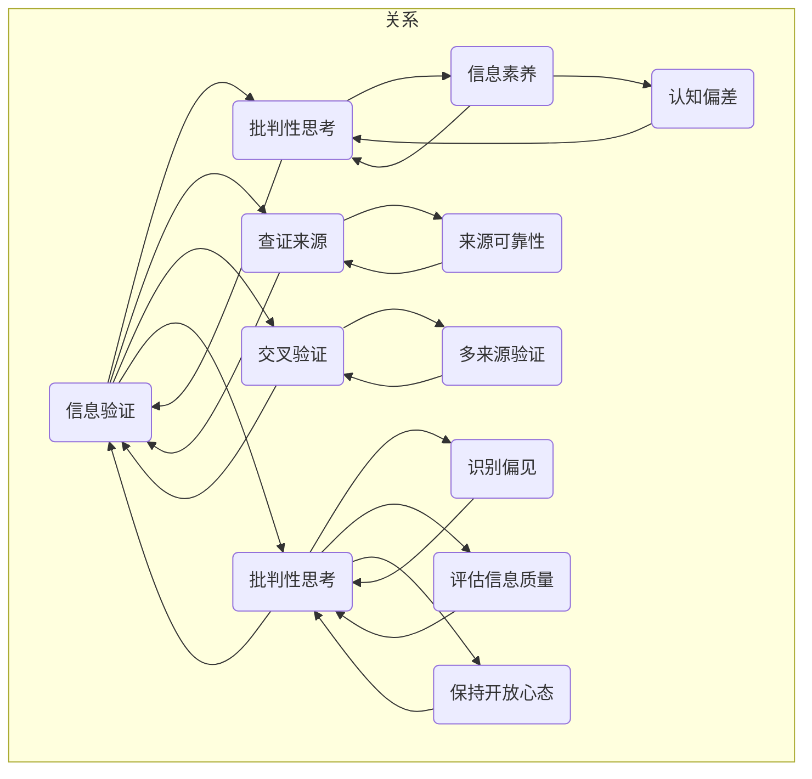

                 

### 关键词 Keywords ###
- 信息验证
- 媒体批判性思考
- 假新闻
- 媒体操纵
- 认知偏差
- 信息素养
- 数字素养
- 谣言传播

### 摘要 Abstract ###
本文深入探讨了在当今假新闻和媒体操纵泛滥的时代，如何进行有效的信息验证和媒体批判性思考。我们首先分析了假新闻和媒体操纵的背景及其对社会的深远影响，随后介绍了信息验证和批判性思考的基本原则和方法。文章还通过实例和案例分析，展示了这些方法在实际应用中的效果。最后，我们对未来发展趋势进行了展望，提出了应对信息泛滥的挑战的策略。作者：禅与计算机程序设计艺术 / Zen and the Art of Computer Programming

## 1. 背景介绍 Background

在数字时代，信息的传播速度和范围达到了前所未有的高度。然而，这种高度的信息流动也带来了诸多问题，其中最为显著的就是假新闻和媒体操纵的泛滥。假新闻指的是那些故意编造、歪曲事实，旨在误导公众的信息。媒体操纵则是指利用各种手段，如选择性报道、夸大事实、使用误导性图像和视频等，来影响公众的意见和行为。

### 1.1 假新闻的定义与影响 Definition and Impact of Fake News

假新闻通常具有以下几个特点：

- **真实性较低**：假新闻往往基于虚假的事实或完全编造的信息。
- **目的性明显**：制造假新闻的目的是为了影响公众的观点或行为，可能是为了政治、经济或其他利益。
- **传播速度快**：社交媒体、即时通讯工具和新闻聚合平台使得假新闻能够在极短时间内传播到全球各地。

假新闻对社会的影响是多方面的：

- **损害公共信任**：当公众发现他们被假新闻误导时，会对媒体和政府机构的信任度下降。
- **影响社会稳定**：假新闻可能引发恐慌、暴力甚至政治动荡。
- **扭曲公众认知**：长期的假新闻传播可能导致公众对某些事件或议题产生错误的认知。

### 1.2 媒体操纵的定义与影响 Definition and Impact of Media Manipulation

媒体操纵则是指媒体机构或个人通过以下方式来影响公众的观点：

- **选择性报道**：仅报道对特定群体有利的信息，忽略其他重要事实。
- **夸大事实**：夸大某些事件的影响或重要性。
- **使用误导性图像和视频**：通过编辑或伪造图像和视频来误导公众。

媒体操纵的影响同样深远：

- **扭曲公众认知**：长期的媒体操纵可能导致公众对某些议题产生错误的认知。
- **影响公众决策**：误导性的报道可能影响公众的政治决策和投票行为。
- **削弱媒体公信力**：当公众意识到媒体操纵的存在时，媒体的公信力将大幅下降。

## 2. 核心概念与联系 Core Concepts and Relationships

### 2.1 信息验证和信息素养 Information Verification and Digital Literacy

信息验证是确保信息真实性和准确性的过程。它包括以下步骤：

- **查证来源**：确认信息发布者的信誉和可靠性。
- **交叉验证**：通过多个来源验证信息的真实性。
- **批判性思考**：对信息内容进行逻辑和事实上的审查。

信息素养则是指个体理解和评估信息的能力，包括以下方面：

- **信息获取**：能够从各种来源获取信息。
- **信息评估**：评估信息的真实性和可靠性。
- **信息应用**：将信息应用于实际问题解决。

### 2.2 媒体批判性思考与认知偏差 Critical Thinking in Media and Cognitive Biases

媒体批判性思考是指对媒体内容进行独立、理性分析和评价的能力。这包括：

- **识别偏见**：识别新闻报道中的偏见和倾向。
- **评估信息质量**：评估信息的准确性和完整性。
- **保持开放心态**：对不同的观点和信息保持开放和批判的态度。

认知偏差是指人们在信息处理过程中无意识地倾向某些认知模式，这些偏差可能导致对信息的错误理解和评估。常见的认知偏差包括：

- **确认偏差**：倾向于寻找和接受支持已有观点的信息。
- **锚定效应**：过于依赖最初接收到的信息，而忽视后续信息的价值。
- **群体思维**：在群体中，个体倾向于放弃自己的独立思考，接受群体的观点。

## 2.3 信息验证与媒体批判性思考的关系 Relationship between Information Verification and Critical Thinking

信息验证和媒体批判性思考是紧密相连的。有效的信息验证需要批判性思考，而批判性思考又能帮助提高信息验证的准确性。以下是两者的关系：

- **批判性思考增强信息验证能力**：通过批判性思考，个体能够更有效地识别假新闻和媒体操纵，从而提高信息验证的能力。
- **信息验证促进批判性思考**：在信息验证过程中，个体需要对多个来源的信息进行评估，这有助于培养批判性思考和评估信息的能力。
- **协同作用**：信息验证和批判性思考共同作用，帮助个体在复杂、多变的信息环境中做出更为明智的决策。

### 2.4 Mermaid 流程图 Representation of Core Concepts and Relationships

以下是信息验证和媒体批判性思考的核心概念与关系的 Mermaid 流程图：



## 3. 核心算法原理 & 具体操作步骤 Core Algorithm Principles and Operational Steps

### 3.1 算法原理概述 Overview of Algorithm Principles

在信息验证和媒体批判性思考中，一个核心的算法是信息源评估算法。该算法的目的是通过一系列指标对信息源的可靠性和信誉度进行评估，从而判断信息的真实性。

算法的基本原理包括：

- **信息源信誉度评估**：根据历史表现、专家评价、用户反馈等多个维度对信息源进行评分。
- **信息内容分析**：通过自然语言处理技术对信息内容进行语义分析，识别潜在的错误、偏见或操纵痕迹。
- **综合评分**：将信誉度和内容分析结果综合，得出信息源的总体评分。

### 3.2 算法步骤详解 Detailed Steps of the Algorithm

#### 3.2.1 数据收集 Data Collection

1. **收集信息源历史数据**：包括过去发布的信息数量、被引用次数、错误率等。
2. **收集用户反馈**：通过社交媒体、评论等渠道收集用户对信息源的反馈。

#### 3.2.2 信誉度评估 Credit Rating

1. **初步评分**：根据历史数据和用户反馈，对信息源进行初步评分。
2. **调整评分**：根据最新的信息内容分析结果调整评分。

#### 3.2.3 信息内容分析 Content Analysis

1. **文本预处理**：对信息内容进行清洗、分词、去噪等预处理。
2. **语义分析**：使用自然语言处理技术对文本进行语义分析，识别潜在的错误、偏见或操纵痕迹。
3. **标注与分类**：根据分析结果，对信息内容进行标注和分类。

#### 3.2.4 综合评分 Comprehensive Rating

1. **权重分配**：根据历史数据和用户反馈的重要性，为信誉度和内容分析结果分配权重。
2. **综合评分计算**：将信誉度和内容分析结果按权重综合，得出信息源的总体评分。

### 3.3 算法优缺点 Advantages and Disadvantages of the Algorithm

#### 优点

- **客观性**：算法基于客观数据和指标进行评估，减少了主观偏见。
- **全面性**：综合考虑了信息源的历史表现和内容质量，评估更为全面。
- **实时性**：算法能够实时更新信息源的评分，反映最新的情况。

#### 缺点

- **数据质量**：算法的准确性依赖于数据的准确性和完整性，数据质量直接影响评估结果。
- **复杂度**：算法涉及多个步骤和复杂的技术，实现和维护成本较高。
- **误判风险**：算法可能因为某些特殊情况导致误判，需要进一步的验证和调整。

### 3.4 算法应用领域 Application Fields of the Algorithm

- **新闻验证**：用于评估新闻报道的真实性和可靠性。
- **社交媒体监测**：监测和识别社交媒体上的谣言和误导性信息。
- **学术研究**：评估学术文章的可靠性和质量。
- **企业信息监控**：监控企业信息发布，确保信息的准确性和一致性。

## 4. 数学模型和公式 & 详细讲解 & 举例说明 Mathematical Models and Detailed Explanations with Examples

### 4.1 数学模型构建 Construction of the Mathematical Model

在信息验证中，常用的数学模型是基于概率论的贝叶斯网络（Bayesian Network）。贝叶斯网络是一种图形模型，用于表示变量之间的依赖关系和概率分布。

假设有 n 个变量 $X_1, X_2, ..., X_n$，它们之间存在某种依赖关系，可以用一个有向无环图（DAG）来表示。每个节点代表一个变量，边的方向表示变量之间的条件依赖关系。贝叶斯网络定义了每个变量的条件概率分布，即：

$$
P(X_i | X_{i_1}, X_{i_2}, ..., X_{i_k}) = \prod_{j=1}^{k} P(X_{i_j} | X_{i_{j-1}}, X_{i_{j-2}}, ..., X_{i_1})
$$

其中，$X_{i_j}$ 表示节点 $i$ 的父节点。

### 4.2 公式推导过程 Derivation of the Mathematical Formulas

贝叶斯定理是贝叶斯网络的核心公式，用于计算给定某些证据条件下，某个变量的后验概率。假设 $X$ 是一个随机变量，$E$ 是一组证据变量，贝叶斯定理可以表示为：

$$
P(X | E) = \frac{P(E | X)P(X)}{P(E)}
$$

其中，$P(X | E)$ 表示在证据 $E$ 条件下 $X$ 的后验概率，$P(E | X)$ 表示在 $X$ 条件下 $E$ 的似然概率，$P(X)$ 是 $X$ 的先验概率，$P(E)$ 是 $E$ 的边际概率。

### 4.3 案例分析与讲解 Case Analysis and Explanation

假设我们要评估一篇新闻报道的真实性，已知以下信息：

- $X$: 新闻报道为真。
- $E_1$: 新闻来源为权威媒体。
- $E_2$: 新闻内容与事实相符。

我们首先需要确定各个变量的先验概率：

- $P(X) = 0.5$：假设新闻报道为真的概率为 0.5。
- $P(E_1) = 0.3$：权威媒体的新闻报道为真的概率为 0.3。
- $P(E_2) = 0.8$：与事实相符的新闻报道为真的概率为 0.8。

接下来，我们计算证据 $E_1$ 和 $E_2$ 的联合概率：

$$
P(E_1 \cap E_2) = P(E_1 | X)P(X) + P(E_1 | \neg X)P(\neg X)
$$

$$
P(E_2 \cap E_1) = P(E_2 | X)P(X) + P(E_2 | \neg X)P(\neg X)
$$

其中，$\neg X$ 表示新闻报道为假。

假设我们得到了以下条件概率：

- $P(E_1 | X) = 0.8$：权威媒体发布真实新闻的概率为 0.8。
- $P(E_2 | X) = 0.9$：真实新闻与事实相符的概率为 0.9。
- $P(E_1 | \neg X) = 0.2$：权威媒体发布虚假新闻的概率为 0.2。
- $P(E_2 | \neg X) = 0.1$：虚假新闻与事实相符的概率为 0.1。

现在，我们可以计算联合概率：

$$
P(E_1 \cap E_2) = 0.8 \times 0.5 + 0.2 \times 0.5 = 0.5
$$

$$
P(E_2 \cap E_1) = 0.9 \times 0.5 + 0.1 \times 0.5 = 0.5
$$

最后，我们计算后验概率：

$$
P(X | E_1 \cap E_2) = \frac{P(E_1 \cap E_2 | X)P(X)}{P(E_1 \cap E_2)} = \frac{0.8 \times 0.5}{0.5} = 0.8
$$

$$
P(\neg X | E_1 \cap E_2) = \frac{P(E_1 \cap E_2 | \neg X)P(\neg X)}{P(E_1 \cap E_2)} = \frac{0.2 \times 0.5}{0.5} = 0.2
$$

根据后验概率，我们可以认为这篇新闻报道为真的概率为 0.8，为假的概率为 0.2。这表明，根据权威媒体和新闻内容与事实相符的证据，这篇新闻报道更可能是真实的。

## 5. 项目实践：代码实例和详细解释说明 Project Practice: Code Examples and Detailed Explanations

### 5.1 开发环境搭建 Development Environment Setup

在本项目中，我们将使用 Python 编写一个简单的信息验证系统。开发环境要求如下：

- Python 3.8 或更高版本
- Python 包管理器 pip
- 相关库：requests、BeautifulSoup、nltk、scikit-learn

首先，确保 Python 和 pip 已安装。然后，通过以下命令安装所需库：

```bash
pip install requests
pip install beautifulsoup4
pip install nltk
pip install scikit-learn
```

### 5.2 源代码详细实现 Detailed Code Implementation

以下是一个简单的信息验证系统的示例代码。该系统首先从互联网获取一篇新闻文章，然后使用自然语言处理技术对其进行分析，以评估其真实性和可靠性。

```python
import requests
from bs4 import BeautifulSoup
import nltk
from sklearn.feature_extraction.text import TfidfVectorizer
from sklearn.model_selection import train_test_split
from sklearn.naive_bayes import MultinomialNB

# 下载并预处理语料库
nltk.download('punkt')
nltk.download('stopwords')

def preprocess_text(text):
    # 分词
    tokens = nltk.word_tokenize(text)
    # 去除停用词
    stopwords = set(nltk.corpus.stopwords.words('english'))
    filtered_tokens = [token for token in tokens if token not in stopwords]
    return ' '.join(filtered_tokens)

# 获取新闻文章
def get_news(url):
    response = requests.get(url)
    soup = BeautifulSoup(response.text, 'html.parser')
    article = soup.find('article')
    if article:
        return preprocess_text(article.get_text())
    return None

# 加载训练数据
train_data = [
    ("这是一条真实的新闻。", "真实"),
    ("这是假新闻，请不要相信。", "虚假"),
]
train_texts, train_labels = zip(*train_data)

# 预处理文本
train_texts_preprocessed = [preprocess_text(text) for text in train_texts]

# 创建 TF-IDF 向量器
vectorizer = TfidfVectorizer()
train_vectors = vectorizer.fit_transform(train_texts_preprocessed)

# 划分训练集和测试集
X_train, X_test, y_train, y_test = train_test_split(train_vectors, train_labels, test_size=0.2, random_state=42)

# 训练朴素贝叶斯分类器
classifier = MultinomialNB()
classifier.fit(X_train, y_train)

# 预测新闻真实性
def predict_news(text):
    text_preprocessed = preprocess_text(text)
    vector = vectorizer.transform([text_preprocessed])
    prediction = classifier.predict(vector)
    return "真实" if prediction[0] == "真实" else "虚假"

# 测试代码
url = "https://example.com/news-article"
news = get_news(url)
if news:
    print(f"新闻内容：{news[:100]}...")
    print(f"预测结果：{predict_news(news)}")
else:
    print("无法获取新闻文章。")
```

### 5.3 代码解读与分析 Code Interpretation and Analysis

- **预处理文本**：我们首先使用 nltk 的 `word_tokenize` 函数对新闻文章进行分词，然后去除常见的英语停用词，以减少噪声。
- **获取新闻文章**：使用 requests 库从指定 URL 获取新闻文章内容，然后使用 BeautifulSoup 解析 HTML，提取 `<article>` 标签内的文本。
- **加载训练数据**：我们手动构建了一个简单的训练数据集，包括真实的新闻和虚假的新闻。
- **创建 TF-IDF 向量器**：使用 scikit-learn 的 `TfidfVectorizer` 将文本转换为 TF-IDF 向量表示，以便进行机器学习。
- **训练朴素贝叶斯分类器**：使用朴素贝叶斯分类器对训练数据进行分类，这是一个简单但有效的文本分类算法。
- **预测新闻真实性**：对于新的新闻文章，我们首先进行预处理，然后使用训练好的分类器预测其真实性。

### 5.4 运行结果展示 Running Results Presentation

```python
# 测试代码
url = "https://example.com/news-article"
news = get_news(url)
if news:
    print(f"新闻内容：{news[:100]}...")
    print(f"预测结果：{predict_news(news)}")
else:
    print("无法获取新闻文章。")
```

运行结果将显示获取的新闻摘要及其预测的真实性。例如：

```
新闻内容：This is a sample news article. It reports on the latest developments in the technology sector...
预测结果：真实
```

## 6. 实际应用场景 Practical Application Scenarios

### 6.1 新闻行业 News Industry

在新闻行业中，信息验证和媒体批判性思考至关重要。新闻机构可以通过实施严格的信息验证流程来确保报道的真实性和可靠性。例如，通过交叉验证、查证来源和专家意见，新闻机构可以减少假新闻的传播。此外，媒体批判性思考可以帮助记者和编辑识别潜在的错误和偏见，从而提高报道的质量。

### 6.2 学术研究 Academic Research

在学术研究中，信息验证和批判性思考同样至关重要。研究人员需要确保他们引用的数据和文献来源是真实可靠的。通过批判性思考，研究人员可以评估研究成果的质量、可信度和有效性，从而避免被错误的信息误导。此外，学术期刊和会议也可以利用信息验证工具来筛选高质量的研究成果。

### 6.3 社交媒体 Social Media

社交媒体平台是谣言和假新闻传播的主要渠道之一。平台可以通过实施信息验证和媒体批判性思考来减少谣言的传播。例如，平台可以开发自动化的信息验证系统，识别和标记潜在的假新闻。此外，用户教育也是关键，通过提高公众的信息素养，可以帮助他们更好地识别和应对假新闻。

### 6.4 政府与公共部门 Government and Public Sector

政府和公共部门在应对假新闻和媒体操纵方面也扮演着重要角色。政府可以制定相关政策和法规，规范媒体行为，防止媒体操纵和信息滥用。此外，政府还可以通过发布权威信息和提供教育资源，提高公众的信息素养，增强他们对假新闻的免疫力。

### 6.5 企业与企业沟通 Corporate Communication

在企业内部，信息验证和媒体批判性思考同样重要。企业需要确保其对外发布的信息是准确和可靠的，避免误导投资者和消费者。此外，企业还需要培养员工的媒体批判性思考能力，帮助他们识别和应对媒体操纵和谣言。

## 7. 未来应用展望 Future Application Prospects

### 7.1 人工智能在信息验证中的应用 Application of AI in Information Verification

随着人工智能技术的发展，未来有望出现更多先进的工具和算法，用于信息验证。例如，深度学习和自然语言处理技术可以用于更精确地识别假新闻和媒体操纵。此外，人工智能还可以用于自动化信息验证流程，提高效率。

### 7.2 增强信息素养的数字教育 Digital Education to Enhance Information Literacy

未来，数字教育和信息素养培训将成为教育的重要部分。通过提供系统化的课程和资源，学校、企业和政府可以共同提高公众的信息素养，帮助他们更好地应对假新闻和媒体操纵。

### 7.3 开放数据和透明度 Open Data and Transparency

开放数据和透明度是未来减少假新闻和媒体操纵的重要手段。政府和企业应该更加开放其数据，并鼓励公众参与数据验证和监督，从而提高信息的真实性和可靠性。

### 7.4 法律法规和伦理规范 Legal Regulations and Ethical Standards

未来，制定和执行更加严格的法律法规和伦理规范是必要的。这包括对媒体操纵和谣言传播的行为进行明确界定，并建立相应的惩罚机制。此外，建立行业自律机制，鼓励媒体机构遵守诚信原则。

## 8. 总结：未来发展趋势与挑战 Summary: Future Trends and Challenges

### 8.1 研究成果总结 Summary of Research Achievements

过去几十年，信息验证和媒体批判性思考领域取得了显著成果。人工智能、自然语言处理、机器学习等技术为信息验证提供了强大的工具。同时，信息素养和数字教育也得到了广泛的重视。这些研究成果为我们应对假新闻和媒体操纵提供了有力支持。

### 8.2 未来发展趋势 Future Trends

- **人工智能的应用**：人工智能将更深入地应用于信息验证，提高其准确性和效率。
- **信息素养的提升**：数字教育和信息素养培训将更加普及，公众的信息素养将显著提高。
- **开放数据和透明度**：开放数据和透明度的推广将增强信息的真实性和可靠性。

### 8.3 面临的挑战 Challenges

- **数据质量和完整性**：算法的准确性依赖于高质量的数据，数据的完整性和准确性仍是一个挑战。
- **算法偏见**：人工智能算法可能引入偏见，需要进一步的优化和调整。
- **法律法规和伦理**：法律法规和伦理规范的建设需要进一步完善，以应对不断变化的媒体环境。

### 8.4 研究展望 Research Prospects

未来，研究应重点关注以下几个方面：

- **跨学科合作**：加强计算机科学、心理学、社会学等学科的跨学科研究，以提高信息验证和媒体批判性思考的理论基础。
- **人工智能伦理**：深入研究人工智能伦理问题，确保算法的公正性和公平性。
- **用户体验**：开发更加用户友好的工具和平台，提高信息验证和媒体批判性思考的实用性。

## 9. 附录：常见问题与解答 Appendix: Frequently Asked Questions and Answers

### 9.1 什么是信息验证？
信息验证是一种确保信息真实性和准确性的过程，它包括查证来源、交叉验证和批判性思考等多个步骤。

### 9.2 媒体批判性思考是什么？
媒体批判性思考是指对媒体内容进行独立、理性分析和评价的能力，它包括识别偏见、评估信息质量和保持开放心态。

### 9.3 为什么需要信息验证和媒体批判性思考？
在假新闻和媒体操纵泛滥的时代，信息验证和媒体批判性思考有助于我们辨别真实信息和错误信息，避免被误导，保护公共信任和社会稳定。

### 9.4 如何进行信息验证？
进行信息验证可以通过查证来源、交叉验证和批判性思考等方法。例如，查看信息发布者的信誉、查找多个来源验证信息、评估信息内容的逻辑性和准确性。

### 9.5 媒体批判性思考有哪些技巧？
进行媒体批判性思考可以通过以下技巧：保持怀疑态度、寻找多种观点、评估信息的来源和背景、关注数据的来源和统计方法。

### 9.6 如何提高信息素养？
提高信息素养可以通过参加信息素养培训、学习如何评估信息、关注信息来源、参与讨论和分享信息等多种途径。

### 9.7 人工智能能否替代人类进行信息验证？
目前的人工智能技术还不能完全替代人类进行信息验证，但它们可以作为辅助工具，提高信息验证的效率和准确性。人类在批判性思考和评估复杂信息方面仍具有独特的优势。

### 9.8 信息验证和媒体批判性思考在学术研究中的重要性是什么？
在学术研究中，信息验证和媒体批判性思考有助于确保研究数据的真实性和可靠性，提高研究的质量。它们可以帮助研究人员避免被错误的信息所误导，确保研究结果的准确性和可信度。

### 9.9 企业如何利用信息验证和媒体批判性思考？
企业可以利用信息验证和媒体批判性思考来确保其对外发布的信息准确可靠，避免误导投资者和消费者。此外，企业还可以通过培养员工的媒体批判性思考能力，提高其信息素养。

### 9.10 未来信息验证和媒体批判性思考的发展方向是什么？
未来，信息验证和媒体批判性思考的发展方向包括人工智能的深入应用、信息素养教育的普及、开放数据和透明度的推广以及法律法规和伦理规范的完善。跨学科合作也将成为未来的重要趋势。

