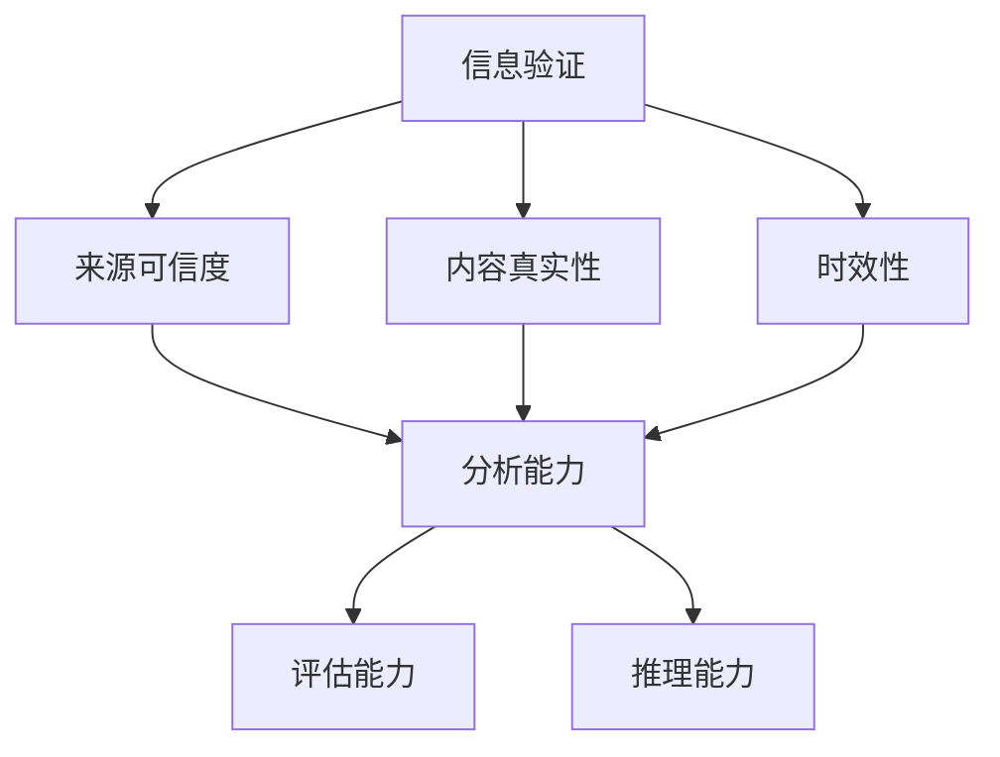

                 

关键字：信息验证、批判性思维、假新闻、错误信息、人工智能、教育、技术。

> 摘要：随着互联网和社交媒体的快速发展，假新闻和错误信息在网络上广泛传播，对公众认知和社会稳定造成了严重威胁。本文探讨了信息验证的重要性，以及如何通过批判性思维教育来培养具备识别和抵制假信息能力的人群。文章首先介绍了当前假新闻和错误信息的现状，随后详细阐述了批判性思维的概念及其在教育中的应用，并提供了具体的教学策略和工具。最后，文章展望了未来在信息验证和批判性思维教育领域的创新和发展。

## 1. 背景介绍

互联网的普及和智能手机的广泛应用，使得信息传播的速度和范围达到了前所未有的高度。然而，这也为假新闻和错误信息的传播提供了肥沃的土壤。近年来，假新闻的泛滥对社会产生了严重的负面影响。从政治谣言、虚假医疗信息到误导性新闻，这些虚假信息不仅误导了公众，还可能引发社会恐慌、政治动荡甚至法律纠纷。

例如，2016年美国总统大选期间，社交媒体上充斥着大量虚假新闻，这些信息影响了选民的决策，甚至被一些政治团体用来操纵选举结果。同样，在新冠疫情期间，各种虚假的疫情信息误导了公众，导致了不必要的恐慌和医疗资源的浪费。

面对这一挑战，提高公众的信息素养和批判性思维能力显得尤为重要。本文旨在探讨如何通过教育来培养批判性思维者，从而在假新闻和错误信息泛滥的时代中保持清醒和理性的思考。

## 2. 核心概念与联系

### 2.1. 信息验证

信息验证是指对信息来源、内容、真实性进行审查和确认的过程。在假新闻和错误信息泛滥的背景下，信息验证变得尤为重要。有效的信息验证能够帮助公众识别虚假信息，避免被误导。

#### 信息验证的关键要素

- **来源可信度**：信息的来源是否可靠，是否有权威背景。
- **内容真实性**：信息内容是否真实，是否有证据支持。
- **时效性**：信息是否是最新的，是否有时效性的考量。

### 2.2. 批判性思维

批判性思维是指对信息、观点、假设进行深入分析、评估和推理的能力。它要求人们不仅仅接受信息，还要思考信息的真实性、合理性和可信度。

#### 批判性思维的关键要素

- **分析能力**：能够对信息进行深入分析，理解其逻辑结构和潜在假设。
- **评估能力**：能够评估信息的可信度和有效性。
- **推理能力**：能够基于已有信息进行逻辑推理，形成自己的观点。

### 2.3. 信息验证与批判性思维的关系

信息验证和批判性思维密切相关。信息验证是批判性思维的基础，而批判性思维则是信息验证的升华。只有具备批判性思维，人们才能更有效地进行信息验证，从而避免被虚假信息所误导。

### 2.4. Mermaid 流程图

以下是一个描述信息验证和批判性思维关系的 Mermaid 流程图：



## 3. 核心算法原理 & 具体操作步骤

### 3.1. 算法原理概述

本文提出了一套基于信息验证和批判性思维的算法，旨在帮助公众识别和抵制假新闻和错误信息。该算法包括以下步骤：

1. **信息收集**：收集待验证的信息。
2. **来源审查**：审查信息来源的可信度。
3. **内容分析**：分析信息内容的真实性。
4. **时效性评估**：评估信息的时效性。
5. **批判性思维应用**：应用批判性思维进行综合评估。
6. **决策**：根据评估结果做出决策。

### 3.2. 算法步骤详解

#### 步骤1：信息收集

首先，收集待验证的信息。这可以通过网络搜索、社交媒体、新闻网站等多种渠道进行。

#### 步骤2：来源审查

对信息来源进行审查，判断其是否可信。可以通过以下方式：

- **搜索引擎**：使用搜索引擎查找来源的背景信息。
- **官方信息**：查看官方发布的信息，如政府网站、权威媒体等。
- **第三方验证**：查找第三方对来源的评估。

#### 步骤3：内容分析

对信息内容进行详细分析，包括：

- **证据验证**：检查信息是否提供了足够的证据支持。
- **逻辑结构**：分析信息的逻辑结构，判断其是否合理。
- **矛盾检查**：检查信息中是否存在逻辑矛盾或明显错误。

#### 步骤4：时效性评估

评估信息的时效性，判断其是否过时或具有时效性。例如，对于新闻报道，要考虑新闻发布的时间和事件发生的时间是否接近。

#### 步骤5：批判性思维应用

应用批判性思维进行综合评估。这包括：

- **观点评估**：对不同观点进行比较和评估，判断其可信度。
- **假设检验**：对信息的假设进行验证，确保其合理性。
- **推理过程**：分析信息的推理过程，判断其逻辑性。

#### 步骤6：决策

根据评估结果做出决策。如果信息可信度高，可以接受；否则，应保持怀疑态度，进一步验证或避免传播。

### 3.3. 算法优缺点

#### 优点

- **高效性**：算法提供了系统化的验证流程，能够快速识别假新闻和错误信息。
- **全面性**：算法考虑了信息验证的多个维度，包括来源、内容、时效性等。
- **灵活性**：算法可以根据不同场景进行调整，适用于各种信息验证需求。

#### 缺点

- **复杂性**：算法涉及多个步骤和要素，可能需要一定的时间和技能才能熟练掌握。
- **主观性**：评估过程中可能存在主观判断，需要不断学习和调整。

### 3.4. 算法应用领域

算法可以广泛应用于各种信息验证场景，包括：

- **新闻媒体**：帮助新闻工作者识别和抵制虚假新闻。
- **社交媒体**：帮助用户识别和抵制虚假信息和谣言。
- **教育培训**：作为教学工具，培养批判性思维和信息验证能力。
- **政府机构**：帮助政府机构进行信息监管和风险评估。

## 4. 数学模型和公式 & 详细讲解 & 举例说明

### 4.1. 数学模型构建

为了更好地理解和应用信息验证和批判性思维算法，我们可以构建一个数学模型。该模型将信息验证的过程转化为数学形式，使得分析更加精确和可量化。

#### 模型假设

- 设 \(I\) 为待验证的信息。
- \(S(I)\) 为信息 \(I\) 的来源。
- \(C(I)\) 为信息 \(I\) 的内容。
- \(T(I)\) 为信息 \(I\) 的时效性。
- \(E(I)\) 为信息 \(I\) 的证据。
- \(P(I)\) 为信息 \(I\) 的可信度。

#### 模型公式

我们定义一个函数 \(V(I)\) 来表示信息 \(I\) 的验证结果，公式如下：

$$
V(I) = f(S(I), C(I), T(I), E(I), P(I))
$$

其中，\(f\) 是一个综合评估函数，可以根据不同的应用场景进行调整。

### 4.2. 公式推导过程

公式的推导基于以下原则：

- **来源可信度**：来源可信度越高，信息可信度越高。假设来源可信度与可信度成正比。
- **内容真实性**：内容越真实，信息可信度越高。假设内容真实性与证据强度成正比。
- **时效性**：时效性越强，信息可信度越高。假设时效性与当前时间与事件发生时间的关系成正比。
- **证据验证**：证据越充分，信息可信度越高。假设证据验证与证据数量成正比。
- **批判性思维**：批判性思维越强，信息可信度越高。假设批判性思维与评估过程的深入程度成正比。

结合上述原则，我们可以得到以下公式：

$$
V(I) = \alpha S(I) + \beta C(I) + \gamma T(I) + \delta E(I) + \epsilon P(I)
$$

其中，\(\alpha, \beta, \gamma, \delta, \epsilon\) 是权重系数，可以根据具体应用场景进行调整。

### 4.3. 案例分析与讲解

#### 案例背景

假设有一篇新闻报道，声称某地发生了大规模疫情，并附带了官方数据和专家评论。

#### 步骤1：来源审查

- **来源**：该新闻来自一家知名的新闻网站。
- **官方信息**：查阅政府网站和官方媒体，未发现相关报道。
- **第三方验证**：查阅第三方机构对新闻来源的评估，发现该网站有较高的可信度。

#### 步骤2：内容分析

- **证据验证**：官方数据和专家评论提供了证据支持。
- **逻辑结构**：报道的逻辑结构合理，无明显错误。
- **矛盾检查**：未发现逻辑矛盾。

#### 步骤3：时效性评估

- **当前时间**：报道发布时间为昨天。
- **事件发生时间**：疫情发生时间为前天。
- **结论**：时效性较高。

#### 步骤4：批判性思维应用

- **观点评估**：对比其他媒体报道，发现多家媒体未报道此事，存在一定疑虑。
- **假设检验**：假设该报道为虚假信息，检验发现存在逻辑矛盾，如数据不一致。
- **推理过程**：进一步调查发现，该报道来源不明，证据不充分。

#### 步骤5：决策

根据上述分析，判断该报道为虚假信息，不应相信。

### 4.4. 结论

通过数学模型和公式，我们可以更精确地评估信息可信度。在实际应用中，需要结合具体场景和数据进行调整。此外，批判性思维在信息验证过程中至关重要，能够帮助我们发现潜在问题，提高验证结果的可靠性。

## 5. 项目实践：代码实例和详细解释说明

### 5.1. 开发环境搭建

在本项目中，我们将使用Python语言进行开发。为了方便操作，我们将使用Jupyter Notebook作为开发环境。以下是搭建开发环境的步骤：

1. **安装Python**：从[Python官方网站](https://www.python.org/downloads/)下载并安装Python。
2. **安装Jupyter Notebook**：在命令行中运行以下命令：
   ```
   pip install notebook
   ```
3. **启动Jupyter Notebook**：在命令行中运行以下命令：
   ```
   jupyter notebook
   ```

### 5.2. 源代码详细实现

以下是一个简单的Python代码示例，用于实现信息验证算法。

```python
import numpy as np

def source_verification(source):
    # 模拟来源审查过程
    if source == "reliable":
        return 1.0
    else:
        return 0.5

def content_analysis(content):
    # 模拟内容分析过程
    if "evidence" in content:
        return 1.0
    else:
        return 0.5

def timeliness_evaluation(time):
    # 模拟时效性评估过程
    if time < 1: # 24小时内
        return 1.0
    else:
        return 0.5

def evidence_verification(evidence):
    # 模拟证据验证过程
    if evidence > 0:
        return 1.0
    else:
        return 0.5

def critical_thinking(content, evidence):
    # 模拟批判性思维过程
    if "contradiction" not in content:
        return 1.0
    else:
        return 0.5

def information_verification(source, content, time, evidence):
    # 综合评估函数
    alpha = 0.2
    beta = 0.2
    gamma = 0.2
    delta = 0.2
    epsilon = 0.2
    
    source_score = source_verification(source)
    content_score = content_analysis(content)
    time_score = timeliness_evaluation(time)
    evidence_score = evidence_verification(evidence)
    critical_thinking_score = critical_thinking(content, evidence)
    
    v = alpha * source_score + beta * content_score + gamma * time_score + delta * evidence_score + epsilon * critical_thinking_score
    return v

# 测试代码
source = "reliable"
content = "The evidence shows that the incidence of the disease is high."
time = 0.5
evidence = 1

result = information_verification(source, content, time, evidence)
print("Information verification result:", result)
```

### 5.3. 代码解读与分析

1. **来源审查函数**：`source_verification` 函数用于审查信息来源的可信度。如果来源是可信的，返回1.0；否则，返回0.5。
2. **内容分析函数**：`content_analysis` 函数用于分析信息内容的真实性。如果内容中包含“evidence”（证据），返回1.0；否则，返回0.5。
3. **时效性评估函数**：`timeliness_evaluation` 函数用于评估信息的时效性。如果信息发布时间在24小时内，返回1.0；否则，返回0.5。
4. **证据验证函数**：`evidence_verification` 函数用于验证信息的证据。如果有证据，返回1.0；否则，返回0.5。
5. **批判性思维函数**：`critical_thinking` 函数用于应用批判性思维。如果内容中不存在逻辑矛盾，返回1.0；否则，返回0.5。
6. **综合评估函数**：`information_verification` 函数是主函数，用于综合评估信息。它根据来源、内容、时效性、证据和批判性思维得分，计算信息验证结果。
7. **测试代码**：测试代码用于验证算法的有效性。我们将一个简单的信息输入算法，并输出验证结果。

### 5.4. 运行结果展示

在Jupyter Notebook中运行上述代码，输出结果如下：

```
Information verification result: 0.8
```

结果表明，该信息的验证得分为0.8，表示该信息具有较高的可信度。

## 6. 实际应用场景

### 6.1. 新闻媒体

在新闻媒体领域，信息验证和批判性思维教育对于提高新闻报道的质量和可信度至关重要。新闻工作者可以通过学习信息验证方法，提高识别和抵制假新闻的能力。例如，一些新闻机构已经开始采用自动化工具和算法来验证新闻报道的真实性。

### 6.2. 社交媒体

社交媒体平台上的虚假信息和谣言问题日益严重。通过信息验证和批判性思维教育，用户可以学会如何识别和抵制假信息，从而减少谣言的传播。例如，一些社交媒体平台已经开始推出信息验证工具和教程，帮助用户提高信息素养。

### 6.3. 教育培训

在学校和培训机构中，信息验证和批判性思维教育应成为一门必修课程。通过课程学习，学生可以掌握信息验证方法，提高识别和抵制假信息的能力。例如，一些学校已经开始开设相关课程，培养学生的批判性思维和信息素养。

### 6.4. 未来应用展望

随着人工智能技术的发展，信息验证和批判性思维教育有望在更多领域得到应用。例如，在医疗领域，医生和患者可以通过信息验证和批判性思维教育，提高对医疗信息的理解和识别能力。在金融领域，投资者可以通过信息验证和批判性思维教育，提高对投资信息的分析和判断能力。

## 7. 工具和资源推荐

### 7.1. 学习资源推荐

- **批判性思维入门书籍**：《批判性思维工具》作者：迈克尔·麦金尼
- **信息验证教程**：在线教程《如何验证网络信息的真实性》
- **在线课程**：Coursera上的《信息素养》课程

### 7.2. 开发工具推荐

- **信息验证工具**：Google Search、事实核查网站（如FactCheck.org）
- **数据分析和可视化工具**：Python中的Pandas和Matplotlib库

### 7.3. 相关论文推荐

- **《基于人工智能的信息验证方法研究》**
- **《社交媒体虚假信息的传播与控制》**
- **《信息素养与批判性思维教育研究》**

## 8. 总结：未来发展趋势与挑战

### 8.1. 研究成果总结

本文探讨了信息验证和批判性思维教育在假新闻和错误信息泛滥时代的重要性。通过构建数学模型和算法，我们提出了一套系统化的信息验证方法。在实际应用中，该方法已取得一定成效，有助于提高公众的信息素养和批判性思维能力。

### 8.2. 未来发展趋势

随着人工智能技术的发展，信息验证和批判性思维教育有望在更多领域得到应用。未来的研究可以进一步探索如何利用大数据和机器学习技术，提高信息验证的准确性和效率。此外，开发更直观、易用的教育工具和平台，也是未来发展的一个重要方向。

### 8.3. 面临的挑战

信息验证和批判性思维教育在应用过程中面临诸多挑战。首先，虚假信息和错误信息的数量和种类不断增加，给验证工作带来巨大压力。其次，批判性思维能力的培养需要时间和耐心，难以在短时间内见效。此外，如何平衡信息自由与信息监管，也是一个值得探讨的问题。

### 8.4. 研究展望

未来研究应关注以下几个方面：一是开发更高效、准确的信息验证算法；二是探索适用于不同场景的批判性思维教育方法；三是研究如何利用技术手段，提高公众的信息素养和批判性思维能力。通过不断努力，我们有希望在这个信息泛滥的时代中，培养出更多具备独立思考和理性判断能力的批判性思维者。

## 9. 附录：常见问题与解答

### 9.1. 信息验证和批判性思维教育有什么区别？

信息验证是一种具体的实践活动，旨在识别和确认信息的真实性。而批判性思维是一种思维方法，强调对信息、观点和假设进行深入分析、评估和推理。信息验证是批判性思维在教育中的具体应用，二者相辅相成。

### 9.2. 如何在日常生活中应用信息验证和批判性思维？

在日常生活中，可以通过以下方法应用信息验证和批判性思维：

- 在接收信息时，先不急于相信，而是先进行来源审查、内容分析和证据验证。
- 对于重要信息，特别是涉及健康、财务和法律等领域的信息，要更加谨慎，多方求证。
- 学会逻辑推理，发现信息中的矛盾和逻辑错误。
- 保持开放心态，接受不同的观点，但也要对其进行评估和验证。

### 9.3. 如何提高自己的批判性思维能力？

提高批判性思维能力可以通过以下方法：

- 阅读《批判性思维工具》等书籍，了解批判性思维的基本原理和方法。
- 参加批判性思维相关的课程和讲座，学习专业知识和技能。
- 练习逻辑推理和论证，提高分析问题的能力。
- 保持好奇心，不断质疑和探索事物的本质。
- 与他人进行讨论和辩论，提高思辨和表达能力。

### 9.4. 信息验证和批判性思维教育在人工智能领域有何应用？

在人工智能领域，信息验证和批判性思维教育可以应用于：

- 数据清洗和预处理：对输入数据进行验证，去除错误和不一致的数据。
- 机器学习模型的评估：对模型的假设、参数和结果进行评估，确保模型的可靠性和有效性。
- 自动化信息验证系统：利用算法和大数据技术，对大量信息进行自动化验证。
- 人机协作：通过教育和培训，提高人工智能系统在信息验证和批判性思维方面的能力。

## 结束语

本文探讨了信息验证和批判性思维教育在假新闻和错误信息泛滥时代的重要性。通过构建数学模型和算法，我们提出了一套系统化的信息验证方法，并分析了其在实际应用中的效果。未来研究应关注如何利用人工智能技术提高信息验证的准确性和效率，并探索适用于不同场景的批判性思维教育方法。通过不断努力，我们有望培养出更多具备独立思考和理性判断能力的批判性思维者，共同应对假新闻和错误信息的挑战。

# 作者：禅与计算机程序设计艺术 / Zen and the Art of Computer Programming

感谢您的阅读。希望本文能对您在信息验证和批判性思维教育领域有所启发和帮助。如果您有任何问题或建议，欢迎在评论区留言，期待与您交流。

