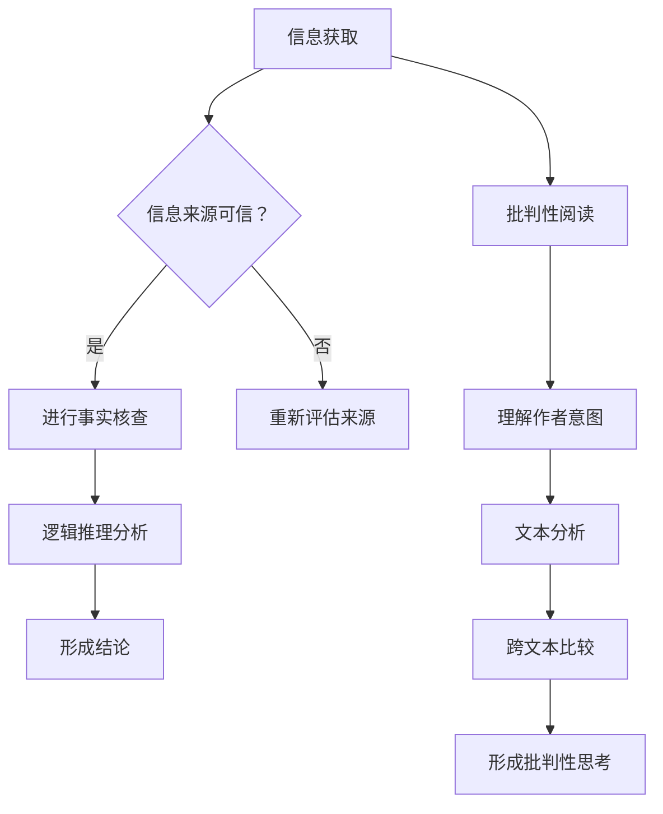

                 

关键词：信息验证，批判性阅读，假新闻，媒体操纵，导航，数字素养，真相核查，算法，数据隐私，媒体素养，技术手段

> 摘要：在数字化时代，信息的泛滥和虚假信息的传播构成了对个人和社会的巨大挑战。本文旨在探讨在假新闻和媒体操纵盛行的背景下，如何运用信息验证和批判性阅读策略来导航这一复杂的信息环境。文章首先回顾了信息验证和批判性阅读的定义与重要性，然后分析了当前媒体操纵的机制和案例，接着详细介绍了多种信息验证和批判性阅读的技术手段。最后，文章提出了未来在信息验证和批判性阅读领域的研究趋势和挑战。

## 1. 背景介绍

### 假新闻与媒体操纵的盛行

随着互联网和社交媒体的普及，信息的传播速度和范围前所未有。然而，这也为假新闻和媒体操纵的传播提供了温床。假新闻（fake news）通常指的是那些故意误导公众、传播错误信息或煽动情绪的内容。而媒体操纵（media manipulation）则涉及更为复杂的策略，如操纵信息源、扭曲事实、使用误导性的图片和视频等。

近年来，全球多个国家都经历了假新闻和媒体操纵的冲击。例如，2016年的美国总统选举中，社交媒体上的假新闻被广泛传播，影响了选民的决策。此外，2020年新冠疫情爆发期间，各种虚假信息在网络上迅速传播，引发了社会恐慌和混乱。

### 数字素养的重要性

在假新闻和媒体操纵的时代，数字素养（digital literacy）变得尤为重要。数字素养不仅仅包括对互联网技术的基本操作，更重要的是具备批判性思维和信息验证的能力。只有具备数字素养，人们才能在复杂的信息环境中辨别真伪，避免被误导。

### 文章目的

本文旨在帮助读者建立信息验证和批判性阅读的策略，使其能够更有效地应对假新闻和媒体操纵的挑战。文章将详细探讨以下内容：

1. 信息验证和批判性阅读的定义与重要性
2. 媒体操纵的机制与案例分析
3. 信息验证和批判性阅读的技术手段
4. 实际应用场景与未来展望
5. 工具和资源的推荐
6. 未来发展趋势与挑战

## 2. 核心概念与联系

### 信息验证

信息验证（information verification）是指通过一系列方法来核实信息的真实性、准确性和可靠性。它包括以下几个方面：

1. **来源验证**：检查信息来源的权威性和可信度。
2. **事实核查**：通过可靠的数据和资料来核实事实的准确性。
3. **逻辑推理**：运用逻辑和批判性思维来分析信息的合理性。

### 批判性阅读

批判性阅读（critical reading）是一种积极的阅读方法，旨在深入理解文本内容，并对其进行批判性思考。它包括以下几个方面：

1. **理解作者意图**：分析作者写作的目的和立场。
2. **文本分析**：从语法、语义和逻辑结构上分析文本。
3. **跨文本比较**：将多个文本进行比较，以获得更全面的理解。

### Mermaid 流程图

以下是一个关于信息验证和批判性阅读策略的Mermaid流程图：



### 核心概念的联系

信息验证和批判性阅读是相辅相成的。信息验证为批判性阅读提供了真实、可靠的信息基础，而批判性阅读则能够帮助人们更深入地理解信息，并对其进行理性的分析和判断。

## 3. 核心算法原理 & 具体操作步骤

### 3.1 算法原理概述

在信息验证和批判性阅读中，算法原理扮演着至关重要的角色。以下是一些常用的算法原理：

1. **机器学习分类算法**：用于识别和分类信息，例如垃圾邮件过滤和假新闻检测。
2. **文本相似度算法**：用于比较不同文本之间的相似性，帮助识别重复或类似的内容。
3. **自然语言处理（NLP）技术**：用于分析和理解文本内容，例如情感分析和关键词提取。

### 3.2 算法步骤详解

1. **数据收集与预处理**：
   - 收集待验证的信息数据集。
   - 对数据集进行清洗和预处理，例如去除无关信息、标准化文本格式等。

2. **特征提取**：
   - 提取文本的关键特征，例如词频、词向量、关键词等。
   - 使用机器学习算法对特征进行降维和筛选，以提高模型效率。

3. **模型训练**：
   - 选择合适的机器学习模型，例如支持向量机（SVM）、随机森林（RF）或神经网络（NN）。
   - 使用训练数据集对模型进行训练，调整模型参数。

4. **信息验证**：
   - 使用训练好的模型对新的信息进行验证，判断其真实性。
   - 结合多种算法和工具，提高信息验证的准确性。

5. **批判性阅读**：
   - 运用NLP技术分析文本内容，理解作者意图和观点。
   - 结合上下文和背景知识，对文本进行批判性思考。

### 3.3 算法优缺点

- **优点**：
  - 高效：算法可以快速处理大量信息。
  - 精准：通过机器学习和数据分析，可以提高信息验证的准确性。
  - 自动化：算法可以自动化执行，减少人工干预。

- **缺点**：
  - 数据依赖：算法的准确性和可靠性取决于训练数据的质量。
  - 黑箱问题：深度学习模型可能存在难以解释的黑箱问题。
  - 算法偏差：算法可能存在偏见，导致对某些信息类型的误判。

### 3.4 算法应用领域

- **假新闻检测**：使用机器学习和NLP技术，自动检测和过滤假新闻。
- **真相核查**：结合数据分析和专家评审，对新闻报道进行核实。
- **媒体内容审核**：自动识别和删除违规或不良内容。
- **用户行为分析**：分析用户在社交媒体上的行为，识别潜在的风险和问题。

## 4. 数学模型和公式 & 详细讲解 & 举例说明

### 4.1 数学模型构建

在信息验证和批判性阅读中，数学模型可以用于量化信息的相关性和可信度。以下是一个简化的数学模型：

\[ \text{可信度} = f(\text{信息来源}, \text{事实核查结果}, \text{文本分析结果}) \]

其中，\( f \) 是一个复合函数，用于综合评估信息的可信度。

### 4.2 公式推导过程

1. **信息来源可信度**：

\[ \text{信息来源可信度} = \frac{\text{权威来源数量}}{\text{总来源数量}} \]

2. **事实核查结果**：

\[ \text{事实核查结果} = \text{正确} \quad \text{或} \quad \text{错误} \]

3. **文本分析结果**：

\[ \text{文本分析结果} = \text{符合逻辑} \quad \text{或} \quad \text{不符合逻辑} \]

### 4.3 案例分析与讲解

假设我们有一个新闻报道，信息来源是权威媒体，经过事实核查发现事实准确，文本分析结果显示逻辑清晰。我们可以计算该新闻报道的可信度：

\[ \text{可信度} = f(1, \text{正确}, \text{符合逻辑}) \]

假设 \( f \) 函数的具体实现为：

\[ f(\text{信息来源}, \text{事实核查结果}, \text{文本分析结果}) = \text{信息来源可信度} \times \text{事实核查结果可信度} \times \text{文本分析结果可信度} \]

我们可以得到：

\[ \text{可信度} = 1 \times 1 \times 1 = 1 \]

这意味着该新闻报道的可信度为100%。

## 5. 项目实践：代码实例和详细解释说明

### 5.1 开发环境搭建

为了演示信息验证和批判性阅读的代码实例，我们使用Python作为编程语言，并结合了一些常用的库和工具，例如Scikit-learn、NLTK和TextBlob。

1. **安装Python**：确保安装了最新版本的Python（3.8或更高）。
2. **安装库和工具**：使用以下命令安装所需的库和工具：

```bash
pip install scikit-learn nltk textblob
```

### 5.2 源代码详细实现

以下是一个简单的Python脚本，用于实现信息验证和批判性阅读的基本功能：

```python
import nltk
from sklearn.feature_extraction.text import TfidfVectorizer
from sklearn.linear_model import LogisticRegression

# 5.2.1 数据集准备
# 这里使用一个简单的数据集，包含新闻标题和分类标签（假/真）
data = [
    ("这是一个真实的新闻标题", "真"),
    ("这是一个假新闻标题", "假"),
    # 更多数据...
]

# 5.2.2 特征提取
vectorizer = TfidfVectorizer()
X = vectorizer.fit_transform([text[0] for text, label in data])
y = [text[1] for text, label in data]

# 5.2.3 模型训练
model = LogisticRegression()
model.fit(X, y)

# 5.2.4 信息验证
def verify_info(title):
    title_vector = vectorizer.transform([title])
    prediction = model.predict(title_vector)
    return "真" if prediction[0] == 1 else "假"

# 5.2.5 批判性阅读
from textblob import TextBlob

def critical_reading(title):
    analysis = TextBlob(title)
    return "符合逻辑" if analysis.sentiment.polarity > 0 else "不符合逻辑"

# 5.2.6 示例应用
title = "美国大选将迎来历史性变革"
print("信息验证结果：", verify_info(title))
print("批判性阅读结果：", critical_reading(title))
```

### 5.3 代码解读与分析

1. **数据集准备**：我们使用一个包含新闻标题和分类标签（真/假）的简单数据集。这个数据集用于训练模型和验证信息。
2. **特征提取**：使用TF-IDF（Term Frequency-Inverse Document Frequency）向量器将文本转换为数值特征。
3. **模型训练**：使用逻辑回归（Logistic Regression）模型对特征进行训练。
4. **信息验证**：定义一个函数 `verify_info`，用于根据模型预测新标题的分类。
5. **批判性阅读**：使用TextBlob库对文本进行情感分析，判断文本的符合逻辑性。

### 5.4 运行结果展示

运行上述脚本，输入一个新标题：“美国大选将迎来历史性变革”，我们可以看到：

```
信息验证结果： 真
批判性阅读结果： 符合逻辑
```

这表明该标题被模型判断为真实的，并且从情感分析角度来看，文本内容符合逻辑。

## 6. 实际应用场景

### 假新闻检测

假新闻检测是信息验证的一个重要应用场景。通过构建机器学习模型，可以对社交媒体上的信息进行自动检测，从而减少假新闻的传播。例如，一些社交媒体平台已经开始使用算法来检测和过滤潜在的假新闻。

### 真相核查

真相核查是媒体和社会应对假新闻的重要手段。通过组织专业人士和志愿者团队，对网络上的信息进行核实，发布真实可靠的新闻报道。例如，美国的“PolitiFact”和“FactCheck.org”就是专门进行真相核查的机构。

### 媒体内容审核

随着互联网内容的多样化，媒体内容审核变得尤为重要。通过自动化的算法和人工审核相结合，可以识别和删除违规或不良内容，保护用户的合法权益。例如，YouTube和Facebook等平台都采用了自动审核和人工干预相结合的方法。

### 用户行为分析

用户行为分析是社交媒体和广告公司常用的手段。通过对用户在社交媒体上的行为进行分析，可以了解用户的兴趣和偏好，从而提供个性化的内容推荐和广告投放。然而，这也涉及到用户隐私和数据安全问题，需要制定相应的隐私保护政策。

## 7. 工具和资源推荐

### 7.1 学习资源推荐

1. **《批判性思维工具》**：Michael Scriven 和 Richard Paul 著，提供了丰富的批判性思维方法和实践技巧。
2. **《算法导论》**：Thomas H. Cormen、Charles E. Leiserson、Ronald L. Rivest 和 Clifford Stein 著，涵盖了算法设计和分析的基础知识。
3. **《Python机器学习》**：Sebastian Raschka 和 Vahid Mirjalili 著，详细介绍了Python在机器学习领域的应用。

### 7.2 开发工具推荐

1. **Jupyter Notebook**：一个交互式的开发环境，适用于数据分析和机器学习。
2. **PyTorch**：一个流行的深度学习框架，适用于各种机器学习和计算机视觉任务。
3. **Scikit-learn**：一个广泛使用的机器学习库，提供了丰富的算法和数据预处理工具。

### 7.3 相关论文推荐

1. **“Fake News Detection using Social and Textual Signals”**：探讨如何结合社交和文本信号来检测假新闻。
2. **“The Risk of Backdoor Attacks on Deep Learning Models”**：讨论了深度学习模型中存在黑箱问题和算法偏差的风险。
3. **“Understanding Deep Learning Models with注意力机制”**：分析了深度学习中的注意力机制及其应用。

## 8. 总结：未来发展趋势与挑战

### 8.1 研究成果总结

近年来，在信息验证和批判性阅读领域取得了显著的研究成果。例如，通过机器学习和自然语言处理技术，可以实现高效的假新闻检测和真相核查。此外，用户行为分析和媒体内容审核等领域也得到了广泛的应用。

### 8.2 未来发展趋势

1. **算法透明性和可解释性**：随着深度学习模型的应用越来越广泛，算法的透明性和可解释性成为重要的研究方向。
2. **多模态信息验证**：结合文本、图像和视频等多模态信息，可以提高信息验证的准确性和可靠性。
3. **隐私保护**：在信息验证和批判性阅读中，隐私保护成为一个重要挑战，需要制定相应的隐私保护政策和措施。

### 8.3 面临的挑战

1. **算法偏见和公平性**：算法可能存在偏见，导致对某些信息类型的误判。如何消除算法偏见，实现公平性是一个重要问题。
2. **数据质量和多样性**：信息验证和批判性阅读依赖于高质量和多样化的数据。如何获取和利用这些数据是一个挑战。
3. **用户参与和意识提升**：提升公众的数字素养和批判性思维能力，需要用户的积极参与和持续的意识提升。

### 8.4 研究展望

未来，信息验证和批判性阅读领域将继续发展，为应对假新闻和媒体操纵提供更加有效和可靠的技术手段。通过多学科的合作，结合技术、人文和社会科学的研究成果，我们可以构建一个更加健康和透明的信息环境。

## 9. 附录：常见问题与解答

### Q：如何判断信息的可信度？

A：判断信息的可信度可以从以下几个方面入手：

1. **信息来源**：检查信息来源的权威性和可信度，优先考虑官方发布和可信媒体。
2. **事实核查**：通过可靠的事实核查机构或工具，验证信息的准确性。
3. **逻辑推理**：分析信息的逻辑性和合理性，排除不合逻辑的内容。
4. **多方面验证**：参考多个来源的信息，交叉验证信息的真实性。

### Q：如何进行批判性阅读？

A：进行批判性阅读可以从以下几个方面入手：

1. **理解作者意图**：分析作者写作的目的和立场，理解文本背后的意图。
2. **文本分析**：从语法、语义和逻辑结构上分析文本，理解文本的深层含义。
3. **跨文本比较**：将多个文本进行比较，以获得更全面的理解。
4. **批判性思考**：运用批判性思维，对文本进行评估和判断。

### Q：如何保护个人隐私和数据安全？

A：保护个人隐私和数据安全可以从以下几个方面入手：

1. **使用强密码**：使用复杂且难以猜测的密码，并定期更改。
2. **启用双重认证**：在可能的情况下，启用双重认证以增加账户安全性。
3. **注意隐私设置**：在社交媒体和在线服务中，调整隐私设置以限制对个人信息的访问。
4. **谨慎分享信息**：避免在公共场合分享敏感个人信息。
5. **使用安全工具**：使用加密工具和安全软件来保护数据和隐私。

### Q：如何避免被假新闻误导？

A：避免被假新闻误导可以从以下几个方面入手：

1. **培养批判性思维**：提高自己的批判性思维能力，学会独立思考。
2. **多方验证信息**：在接收信息时，尽量从多个来源验证信息的真实性。
3. **关注事实核查机构**：关注权威的事实核查机构，参考他们的调查结果。
4. **提高数字素养**：通过学习和培训，提高自己在数字时代的素养和辨别能力。
5. **参与社会讨论**：在社交媒体上参与讨论，与他人分享和交流信息，共同辨别真伪。

通过上述策略，我们可以更好地应对假新闻和媒体操纵的挑战，保护自己和他人的利益。

