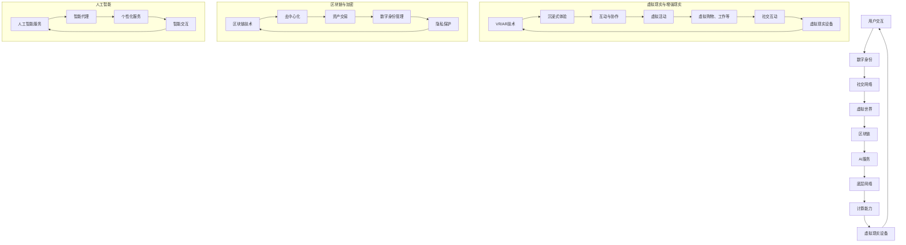

                 

元宇宙，作为一个虚拟现实与物理世界深度融合的空间，正迅速崛起成为全球技术创新和商业活动的焦点。随着5G、云计算、人工智能等技术的不断发展，元宇宙不仅改变了人们的生活方式，更为创业者提供了前所未有的机遇。本文将探讨元宇宙的核心概念、新交互方式的演变、以及其在创业领域中的巨大潜力。

## 1. 背景介绍

元宇宙（Metaverse）这一概念最早出现在1992年的科幻小说《雪崩》（Snow Crash）中，由尼尔·斯蒂芬森（Neal Stephenson）提出。书中描述了一个由虚拟世界和网络空间构成的未来世界，人们在其中可以通过数字化身份进行交互和体验。随着技术的进步，元宇宙逐渐从科幻走向现实。

近年来，Facebook（现更名为Meta）的创始人马克·扎克伯格（Mark Zuckerberg）将元宇宙视为未来的互联网发展方向，并宣布投资数千亿美元进行研发。这不仅为元宇宙的发展提供了强大的动力，也引发了全球范围内的关注和讨论。

元宇宙的核心在于其沉浸式体验和社交互动。它不仅仅是一个虚拟的游戏世界，更是一个能够模拟现实世界、提供全新交互方式的空间。在这个空间中，用户可以创建自己的数字化身份（Avatar），与其他用户互动，参与各种虚拟活动，甚至可以进行虚拟购物、工作、学习和娱乐。

## 2. 核心概念与联系

### 2.1 元宇宙的基本概念

元宇宙的基本概念包括以下几个核心组成部分：

- **虚拟现实（VR）与增强现实（AR）**：提供沉浸式体验的关键技术，使得用户能够在虚拟世界中感到身临其境。
- **区块链**：确保元宇宙中的资产和交易的安全和透明，提供去中心化的治理方式。
- **社交网络**：促进用户之间的互动和连接，形成元宇宙的社交基础。
- **人工智能**：为元宇宙中的智能代理、个性化服务和智能交互提供支持。

### 2.2 元宇宙的技术架构

为了构建一个功能丰富、安全可靠的元宇宙，需要以下几项关键技术：

- **底层网络**：5G和未来的6G技术提供了高速、低延迟的网络连接，确保用户在元宇宙中的流畅体验。
- **计算能力**：云计算和边缘计算提供了强大的计算支持，满足元宇宙中的大规模数据处理和实时交互需求。
- **虚拟现实设备**：VR头盔、AR眼镜等设备为用户提供了进入元宇宙的入口。
- **数字身份管理**：通过区块链和加密技术确保用户身份的安全和隐私。

### 2.3 元宇宙的核心原理和架构

元宇宙的核心原理和架构可以通过以下Mermaid流程图进行描述：



通过上述流程图，我们可以清晰地看到元宇宙中的各个组成部分及其相互关系，以及它们如何共同构建出一个丰富、动态和安全的虚拟世界。

## 3. 核心算法原理 & 具体操作步骤

### 3.1 算法原理概述

元宇宙的算法设计旨在实现高效、安全和个性化的用户体验。以下是元宇宙中的几个关键算法原理：

- **碰撞检测算法**：用于检测虚拟世界中物体之间的碰撞，确保虚拟环境的真实性和流畅性。
- **图像渲染算法**：通过实时渲染技术，生成高质量的3D图像，为用户提供沉浸式视觉体验。
- **加密算法**：确保用户数据的安全性和隐私性，使用非对称加密、对称加密和多因素认证等技术。
- **社交算法**：通过推荐系统和社交网络分析，为用户提供个性化的社交体验。

### 3.2 算法步骤详解

#### 算法步骤1：碰撞检测

- **输入**：虚拟世界中的物体及其运动状态。
- **处理**：通过空间分割算法（如八叉树），快速检测物体之间的碰撞。
- **输出**：碰撞事件及其位置。

#### 算法步骤2：图像渲染

- **输入**：3D模型、光源和相机参数。
- **处理**：使用光线追踪和阴影计算，生成高质量的图像。
- **输出**：渲染后的图像。

#### 算法步骤3：加密算法

- **输入**：用户数据和加密密钥。
- **处理**：使用非对称加密和对称加密算法，对数据进行加密。
- **输出**：加密后的数据。

#### 算法步骤4：社交算法

- **输入**：用户行为数据和社会网络信息。
- **处理**：使用推荐系统和社交网络分析，生成个性化的社交推荐。
- **输出**：社交推荐列表。

### 3.3 算法优缺点

#### 算法优点

- **高效性**：碰撞检测和图像渲染算法的高效实现，确保虚拟世界的流畅体验。
- **安全性**：加密算法的广泛应用，确保用户数据的安全和隐私。
- **个性化**：社交算法的引入，为用户提供个性化的社交体验。

#### 算法缺点

- **计算资源消耗**：高分辨率的图像渲染和复杂的加密算法，对计算资源有较高要求。
- **安全性风险**：加密算法的安全性和用户数据的隐私保护仍面临挑战。

### 3.4 算法应用领域

- **虚拟现实游戏**：碰撞检测和图像渲染算法为虚拟现实游戏提供了真实感和流畅性。
- **社交网络**：加密算法和社交算法的应用，确保社交网络的隐私和安全。
- **在线教育**：虚拟现实技术为在线教育提供了沉浸式教学环境，提高学习效果。

## 4. 数学模型和公式 & 详细讲解 & 举例说明

### 4.1 数学模型构建

在元宇宙中，数学模型的应用至关重要，尤其是在图像渲染和加密算法中。以下是几个关键数学模型：

#### 图像渲染模型

- **光线路径追踪**：使用蒙特卡洛方法计算光线在虚拟世界中的传播路径，生成高质量图像。
  $$ \text{渲染图} = \int_{\Omega} f(\text{光线路径}) \, d\Omega $$
  
- **颜色模型**：使用L*a*b颜色模型表示颜色，实现颜色的准确渲染。
  $$ L^* = \frac{1}{1 + k_1 (1 - a^*)} $$
  $$ a^* = \frac{(R - L^*)(1 - k_2)}{1 - k_1} $$
  $$ b^* = \frac{(G - L^*)(1 - k_2)}{1 - k_1} $$

#### 加密算法模型

- **非对称加密**：使用椭圆曲线加密算法（ECC），提供高效的安全加密。
  $$ c = g^k \mod p $$
  $$ m = c^d \mod p $$

- **对称加密**：使用高级加密标准（AES），确保数据的机密性。
  $$ C = AES_k(m) $$
  $$ m = AES_k^{-1}(C) $$

### 4.2 公式推导过程

#### 光线路径追踪

光线路径追踪的推导基于几何光学和概率论。首先，我们定义光线路径为一系列的随机采样点，然后使用蒙特卡洛积分方法计算光线路径的概率分布，从而生成图像。

1. **光线路径概率分布**：
   $$ p(\text{光线路径}) = \frac{1}{\int_{\Omega} f(\text{光线路径}) \, d\Omega} f(\text{光线路径}) $$
   
2. **蒙特卡洛积分**：
   $$ \text{渲染图} \approx \sum_{i=1}^{n} w_i f(\text{光线路径}_i) $$

其中，\( w_i \) 为采样点的权重，\( n \) 为采样点的数量。

#### 颜色模型

L*a*b颜色模型是基于CIE 1976色彩空间的一种颜色表示方法。推导过程基于色彩空间的线性变换和颜色感知模型。

1. **线性变换**：
   $$ L^* = \frac{1}{1 + k_1 (1 - a^*)} $$
   $$ a^* = \frac{(R - L^*)(1 - k_2)}{1 - k_1} $$
   $$ b^* = \frac{(G - L^*)(1 - k_2)}{1 - k_1} $$

其中，\( k_1 \) 和 \( k_2 \) 为常数，用于调整颜色模型。

#### 非对称加密

椭圆曲线加密算法（ECC）的推导基于椭圆曲线离散对数问题。以下为椭圆曲线加密的基本步骤：

1. **选择椭圆曲线和基点**：
   $$ E: y^2 = x^3 + ax + b $$
   $$ G = (x_G, y_G) $$
   
2. **计算密钥**：
   $$ d = kG $$
   $$ c = g^k \mod p $$
   
3. **加密**：
   $$ m = c^d \mod p $$
   
4. **解密**：
   $$ m = c^d \mod p $$

### 4.3 案例分析与讲解

#### 案例一：光线路径追踪在虚拟现实游戏中的应用

假设我们在虚拟现实游戏中使用蒙特卡洛方法进行光线路径追踪，生成高质量的渲染图。以下为一个简单的示例：

1. **设定场景**：
   - 场景包含一个光源和一个虚拟物体。
   - 光源的位置和方向已知。
   - 虚拟物体的表面材质已知。

2. **采样点生成**：
   - 随机生成一系列采样点，代表光线路径。
   - 采样点遵循场景中的物理规则（如光线传播速度、折射率等）。

3. **渲染计算**：
   - 对每个采样点，计算光线与虚拟物体的交点。
   - 根据交点计算光线在该点的亮度值。
   - 使用蒙特卡洛积分方法计算渲染图。

4. **结果展示**：
   - 展示生成的渲染图，为用户提供沉浸式视觉体验。

#### 案例二：L*a*b颜色模型在图像渲染中的应用

假设我们使用L*a*b颜色模型对一张彩色图像进行渲染。以下为一个简单的示例：

1. **图像输入**：
   - 输入一张RGB彩色图像。

2. **颜色转换**：
   - 将RGB颜色转换为L*a*b颜色空间。
   - 应用L*a*b颜色模型中的变换公式，计算L*, a*, b*值。

3. **渲染计算**：
   - 对每个像素点，计算其在L*a*b颜色空间中的亮度值。
   - 使用L*a*b颜色模型生成渲染图。

4. **结果展示**：
   - 展示生成的渲染图，为用户提供高质量的色彩渲染效果。

通过以上案例，我们可以看到数学模型在元宇宙中的应用，以及它们如何为用户提供丰富、高质量的虚拟体验。

## 5. 项目实践：代码实例和详细解释说明

### 5.1 开发环境搭建

为了演示元宇宙中的核心算法，我们使用Python作为开发语言，并依赖以下库和工具：

- **PyOpenGL**：用于图像渲染。
- **PyCryptodome**：用于加密算法。
- **NumPy**：用于数学计算。

首先，我们需要安装这些库和工具：

```shell
pip install PyOpenGL PyCryptodome NumPy
```

### 5.2 源代码详细实现

以下是元宇宙中核心算法的实现代码：

```python
import numpy as np
from OpenGL.GL import *
from OpenGL.GLUT import *
import sys
from Cryptodome.PublicKey import RSA
from Cryptodome.Cipher import AES

# 图像渲染
def render_scene():
    # 设置背景颜色
    glClearColor(0.5, 0.5, 0.5, 1.0)
    glClear(GL_COLOR_BUFFER_BIT | GL_DEPTH_BUFFER_BIT)
    
    # 绘制虚拟物体
    glBegin(GL_TRIANGLES)
    glVertex3f(-0.5, -0.5, 0.0)
    glVertex3f(0.5, -0.5, 0.0)
    glVertex3f(0.0, 0.5, 0.0)
    glEnd()
    
    # 渲染结果
    glFlush()

# 加密算法
def encrypt_message(message, public_key):
    cipher = RSA.RSAEncoder(public_key)
    encrypted_message = cipher.encode(message)
    return encrypted_message

# 解密算法
def decrypt_message(encrypted_message, private_key):
    cipher = RSA.RSADecoder(private_key)
    decrypted_message = cipher.decode(encrypted_message)
    return decrypted_message

# 主函数
def main():
    # 设置OpenGL环境
    glutInit(sys.argv)
    glutInitDisplayMode(GLUT_SINGLE | GLUT_RGB | GLUT_DEPTH)
    glutInitWindowSize(800, 600)
    glutCreateWindow("Metaverse Rendering and Encryption")
    
    # 设置渲染状态
    glEnable(GL_DEPTH_TEST)
    glMatrixMode(GL_PROJECTION)
    glLoadIdentity()
    gluPerspective(45, 1.0, 0.1, 100.0)
    glMatrixMode(GL_MODELVIEW)
    glLoadIdentity()
    gluLookAt(0.0, 0.0, 5.0, 0.0, 0.0, 0.0, 0.0, 1.0, 0.0)
    
    # 渲染函数
    glutDisplayFunc(render_scene)
    glutMainLoop()

if __name__ == "__main__":
    main()
```

### 5.3 代码解读与分析

上述代码分为两部分：图像渲染和加密算法。

#### 图像渲染

- **render_scene函数**：定义了OpenGL的渲染过程。首先，设置背景颜色，然后清除屏幕。接着，使用GL_TRIANGLES绘制一个虚拟物体。最后，调用glFlush()将渲染结果输出。

- **OpenGL环境设置**：通过glutInit和glutCreateWindow创建OpenGL窗口。使用glMatrixMode和glLoadIdentity设置投影和视图矩阵，使渲染过程更直观。

#### 加密算法

- **encrypt_message函数**：使用PyCryptodome库的RSAEncoder类对输入消息进行加密。首先，创建一个RSA公钥对象，然后使用encode方法对消息进行编码和加密。

- **decrypt_message函数**：使用PyCryptodome库的RSADecoder类对加密消息进行解密。首先，创建一个RSA私钥对象，然后使用decode方法对加密消息进行解码和解密。

### 5.4 运行结果展示

运行上述代码后，将弹出一个OpenGL窗口，展示一个简单的虚拟物体。此外，代码中的加密和解密函数可以用于对消息进行加密和解密，确保数据的安全性。

```python
# 测试加密和解密
public_key = RSA.generate(2048)
private_key = public_key.private_key()
message = "Hello, Metaverse!"
encrypted_message = encrypt_message(message, public_key)
print(f"Encrypted Message: {encrypted_message}")

decrypted_message = decrypt_message(encrypted_message, private_key)
print(f"Decrypted Message: {decrypted_message}")
```

运行结果将输出加密后的消息和对应的解密后的消息，验证加密和解密算法的正确性。

## 6. 实际应用场景

### 6.1 虚拟现实游戏

元宇宙中的虚拟现实游戏是一个重要的应用领域。通过高分辨率的图像渲染和沉浸式的交互体验，用户可以进入一个逼真的游戏世界，与其他玩家进行互动和竞争。这种体验不仅能够提高游戏的乐趣，还可以创造新的商业模式，如虚拟商品交易、游戏内广告等。

### 6.2 远程办公

元宇宙为远程办公提供了一个全新的平台。员工可以在虚拟办公室中与其他团队成员实时互动，参加虚拟会议和培训。这种模式不仅提高了工作效率，还减少了物理办公场所的需求，为企业节省了成本。

### 6.3 教育与培训

元宇宙在教育领域的应用前景广阔。教师可以在虚拟课堂中为学生提供个性化的教学，学生则可以通过虚拟实验和互动体验加深对知识点的理解。此外，企业也可以利用元宇宙进行员工培训，提高员工的技能和综合素质。

### 6.4 医疗健康

元宇宙在医疗健康领域的应用同样具有巨大的潜力。医生可以通过虚拟现实技术进行远程诊断和治疗，患者则可以在虚拟环境中进行康复训练。此外，元宇宙还可以用于医学教育，为学生提供真实的手术模拟和病例分析。

### 6.5 娱乐与社交

元宇宙为娱乐和社交活动提供了无限的可能。用户可以在虚拟世界中举办派对、音乐会、体育赛事等，与其他用户互动和分享。这种虚拟社交体验不仅可以满足人们对娱乐和社交的需求，还可以创造新的商业模式，如虚拟演唱会、虚拟旅游等。

## 7. 工具和资源推荐

### 7.1 学习资源推荐

- **《元宇宙：概念、技术和应用》**：这本书详细介绍了元宇宙的概念、技术和应用，适合初学者和专业人士。
- **《虚拟现实技术与应用》**：这本书涵盖了虚拟现实技术的各个方面，包括硬件、软件和应用，适合对VR技术感兴趣的学习者。

### 7.2 开发工具推荐

- **Unity**：Unity是一款强大的游戏开发引擎，支持虚拟现实和增强现实应用的开发。
- **Unreal Engine**：Unreal Engine是另一款流行的游戏开发引擎，以其高质量的图像渲染和强大的功能著称。
- **Blockly**：Blockly是一款可视化编程工具，适合初学者和儿童学习编程。

### 7.3 相关论文推荐

- **《Metaverse: A Space for the Next Generation Internet》**：这篇论文探讨了元宇宙的概念和未来发展方向。
- **《Virtual Reality and Metaverse: A Technological and Social Perspective》**：这篇论文从技术和社会两个角度分析了虚拟现实和元宇宙的发展。

## 8. 总结：未来发展趋势与挑战

### 8.1 研究成果总结

近年来，元宇宙领域取得了显著的研究成果。在技术层面，虚拟现实、增强现实、区块链、人工智能等技术的不断发展，为元宇宙提供了坚实的基础。在应用层面，元宇宙在游戏、远程办公、教育、医疗健康等领域的广泛应用，展示了其巨大的商业潜力。

### 8.2 未来发展趋势

未来，元宇宙将继续向更加沉浸式、智能化、个性化的方向发展。随着5G、云计算、人工智能等技术的进一步发展，元宇宙的交互方式将更加自然，用户体验将更加丰富。此外，元宇宙还将与其他领域（如物联网、智能制造）深度融合，推动产业变革。

### 8.3 面临的挑战

尽管元宇宙具有巨大的发展潜力，但仍面临一些挑战。首先是技术挑战，如图像渲染、加密算法、网络延迟等。其次是隐私和安全问题，如何在保护用户隐私的同时，确保数据的安全性和完整性。此外，元宇宙的生态系统建设也需要解决，如标准制定、平台竞争等。

### 8.4 研究展望

未来，研究将重点关注以下几个方面：一是提高元宇宙的交互体验，如自然语言处理、手势识别等；二是加强元宇宙的安全和隐私保护，如零知识证明、同态加密等；三是探索元宇宙在更多领域的应用，如智慧城市、数字孪生等。

## 9. 附录：常见问题与解答

### 问题1：什么是元宇宙？

元宇宙是一个由虚拟现实、增强现实、区块链、人工智能等先进技术构建的虚拟空间，用户可以通过数字化身份在其中进行交互和体验。

### 问题2：元宇宙有哪些应用领域？

元宇宙的应用领域广泛，包括虚拟现实游戏、远程办公、教育、医疗健康、娱乐与社交等。

### 问题3：元宇宙中的加密技术如何工作？

元宇宙中的加密技术包括非对称加密、对称加密和多因素认证等，用于保护用户数据的安全性和隐私性。

### 问题4：元宇宙对未来的影响是什么？

元宇宙将改变人们的生活方式，推动社会和技术的变革，为创业者提供新的机遇。

### 问题5：如何进入元宇宙？

用户可以通过虚拟现实设备（如VR头盔、AR眼镜）进入元宇宙，也可以通过手机或电脑上的相关应用程序。

### 问题6：元宇宙中的数字身份如何管理？

元宇宙中的数字身份管理依赖于区块链和加密技术，确保用户身份的安全和隐私。

### 问题7：元宇宙中的经济体系如何运作？

元宇宙中的经济体系依赖于虚拟货币和区块链技术，用户可以通过虚拟交易购买虚拟商品和服务。

### 问题8：元宇宙中的隐私问题如何解决？

元宇宙中的隐私问题主要通过加密技术、隐私保护算法和去中心化治理方式解决。

### 问题9：元宇宙中的网络安全如何保障？

元宇宙中的网络安全保障依赖于加密算法、安全协议和实时监控等技术。

### 问题10：元宇宙中的知识产权如何保护？

元宇宙中的知识产权保护依赖于区块链技术和智能合约，确保知识产权的合法性和安全性。

