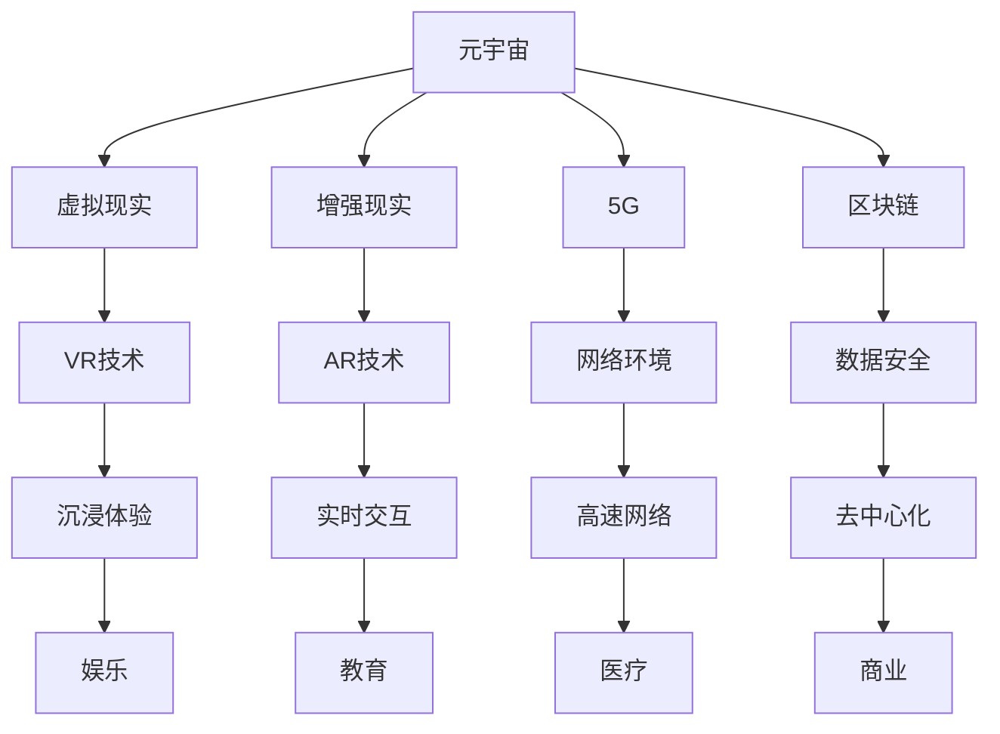

                 

关键词：元宇宙、群体智慧、个体局限、人工智能、跨领域协作

## 摘要

在本文中，我们将探讨元宇宙这一新兴概念中的群体智慧，如何超越个体局限，实现更加高效、智能的跨领域协作。元宇宙作为一个虚拟世界，集成了虚拟现实、增强现实、区块链等技术，为个体提供了一个全新的交互平台。在这个平台上，群体智慧通过人工智能、大数据分析等技术的赋能，使得个体能够更加高效地协同工作，突破传统的个体局限。本文将从核心概念、算法原理、数学模型、项目实践等多个角度，详细探讨元宇宙中的群体智慧如何实现跨越式发展，以及其所面临的挑战和未来展望。

## 1. 背景介绍

### 元宇宙的起源与发展

元宇宙（Metaverse）一词最早由科幻作家尼尔·斯蒂芬森（Neal Stephenson）在其1992年的小说《雪崩》（Snow Crash）中提出。元宇宙是一个由多个虚拟世界构成的全球性网络，用户可以在其中创建和体验丰富的虚拟现实。随着科技的不断进步，尤其是虚拟现实（VR）、增强现实（AR）、5G、区块链等技术的快速发展，元宇宙逐渐从科幻小说走向现实。

### 元宇宙的核心技术

元宇宙的实现依赖于一系列核心技术的支持，包括但不限于：

- **虚拟现实（VR）**：通过头戴显示器、手柄等设备，用户可以在虚拟环境中感受到身临其境的体验。

- **增强现实（AR）**：通过在现实世界中叠加虚拟元素，使用户能够实时感知和交互。

- **5G**：高速、低延迟的网络环境，使得用户在元宇宙中的交互更加流畅。

- **区块链**：提供去中心化的数据存储和交易，保障元宇宙中的数据安全和透明性。

### 元宇宙的应用场景

元宇宙的应用场景广泛，涵盖了娱乐、教育、医疗、商业等多个领域。例如，在娱乐领域，用户可以在虚拟世界中创建自己的角色，参与各种游戏和活动；在教育领域，元宇宙提供了沉浸式的学习体验，使得学生能够更加直观地理解复杂的概念；在医疗领域，元宇宙可以用于远程手术、医疗培训等。

## 2. 核心概念与联系

### 群体智慧

群体智慧（Collective Intelligence）是指由多个个体通过协同合作，形成的超越个体智能的集体智能。在元宇宙中，群体智慧通过人工智能、大数据分析等技术得以实现。个体可以在元宇宙中分享知识、经验、能力，形成一个庞大的知识库，从而实现更高层次的智能。

### 个体局限

个体局限（Individual Limitation）指的是个体在认知、能力、资源等方面的限制。在传统的工作和生活中，个体往往受到这些限制，难以实现高效的协作和决策。而在元宇宙中，个体可以借助群体智慧的力量，突破这些局限。

### 元宇宙与群体智慧的联系

元宇宙为个体提供了一个全新的交互平台，使得个体能够更加便捷地分享和获取知识、经验、能力。通过人工智能、大数据分析等技术的赋能，元宇宙中的群体智慧得以实现，从而突破个体的局限。

## 2.1. 核心概念原理和架构的 Mermaid 流程图



## 3. 核心算法原理 & 具体操作步骤

### 3.1 算法原理概述

元宇宙中的群体智慧依赖于一系列核心算法的实现，主要包括：

- **机器学习算法**：通过训练模型，从大量数据中提取规律和知识，用于预测和决策。

- **深度学习算法**：通过模拟人脑神经网络，实现对复杂问题的求解和智能推理。

- **协同优化算法**：通过优化个体之间的协作关系，提高整体效能。

### 3.2 算法步骤详解

#### 3.2.1 机器学习算法

1. **数据采集**：从元宇宙中的各个领域收集大量数据，包括用户行为、交互记录、知识库等。

2. **数据预处理**：对采集到的数据进行分析和处理，去除噪声、缺失值等。

3. **模型训练**：使用预处理后的数据，训练机器学习模型，如分类、回归、聚类等。

4. **模型评估**：对训练好的模型进行评估，选择性能最优的模型。

5. **模型应用**：将训练好的模型应用到元宇宙中的具体场景，如智能推荐、智能客服等。

#### 3.2.2 深度学习算法

1. **神经网络构建**：设计并构建神经网络结构，如卷积神经网络（CNN）、循环神经网络（RNN）等。

2. **数据预处理**：对采集到的数据进行分析和处理，将其转换为适合神经网络输入的格式。

3. **模型训练**：使用预处理后的数据，训练深度学习模型。

4. **模型评估**：对训练好的模型进行评估，选择性能最优的模型。

5. **模型应用**：将训练好的模型应用到元宇宙中的具体场景，如图像识别、语音识别等。

#### 3.2.3 协同优化算法

1. **个体建模**：对元宇宙中的个体进行建模，包括个体的能力、偏好、资源等。

2. **目标函数定义**：定义协同优化问题的目标函数，如最小化成本、最大化收益等。

3. **算法选择**：选择合适的协同优化算法，如遗传算法、粒子群算法等。

4. **迭代优化**：通过迭代优化，逐步优化个体之间的协作关系，提高整体效能。

### 3.3 算法优缺点

#### 3.3.1 机器学习算法

- **优点**：能够从大量数据中自动提取特征，适用于处理复杂数据和分析问题。

- **缺点**：对数据质量和数量有较高要求，易受到过拟合问题的影响。

#### 3.3.2 深度学习算法

- **优点**：能够处理高维数据和复杂关系，具有强大的泛化能力。

- **缺点**：对计算资源要求较高，训练过程较为耗时。

#### 3.3.3 协同优化算法

- **优点**：能够优化个体之间的协作关系，提高整体效能。

- **缺点**：对个体模型和目标函数的定义要求较高，适用范围有限。

### 3.4 算法应用领域

机器学习算法、深度学习算法和协同优化算法在元宇宙中的多个领域都有广泛的应用，如：

- **娱乐**：智能推荐、虚拟角色生成等。

- **教育**：智能教学、虚拟实验等。

- **医疗**：智能诊断、远程手术等。

- **商业**：智能营销、供应链管理等。

## 4. 数学模型和公式 & 详细讲解 & 举例说明

### 4.1 数学模型构建

在元宇宙中的群体智慧中，数学模型发挥着重要的作用。以下是一个简单的数学模型构建过程：

1. **目标函数**：定义群体智慧的优化目标，如最小化成本、最大化收益等。

2. **约束条件**：列出影响群体智慧的约束条件，如个体能力限制、资源分配等。

3. **模型构建**：根据目标函数和约束条件，构建数学模型，如线性规划、非线性规划等。

### 4.2 公式推导过程

以线性规划为例，我们来看一个简单的公式推导过程：

1. **目标函数**：最大化总收益

   \[ \max Z = \sum_{i=1}^{n} c_{i} x_{i} \]

   其中，\( c_{i} \) 为第 \( i \) 个个体的收益，\( x_{i} \) 为第 \( i \) 个个体的参与程度。

2. **约束条件**：

   \[ \sum_{i=1}^{n} x_{i} = 1 \]  （总参与程度为1）

   \[ x_{i} \geq 0 \]  （个体参与程度非负）

### 4.3 案例分析与讲解

以下是一个具体的案例，用于说明如何使用构建好的数学模型进行群体智慧的优化：

#### 案例背景

某公司计划开展一项新的市场调研活动，需要投入大量的人力、物力和财力。公司有 \( n \) 名员工，每名员工都有不同的能力和经验，能够为公司带来的收益也不同。公司希望最大化总收益，同时确保资源的合理分配。

#### 模型构建

1. **目标函数**：最大化总收益

   \[ \max Z = \sum_{i=1}^{n} c_{i} x_{i} \]

   其中，\( c_{i} \) 为第 \( i \) 名员工的收益，\( x_{i} \) 为第 \( i \) 名员工的参与程度。

2. **约束条件**：

   \[ \sum_{i=1}^{n} x_{i} = 1 \]  （总参与程度为1）

   \[ x_{i} \geq 0 \]  （个体参与程度非负）

3. **模型构建**：

   线性规划模型如下：

   \[ \begin{align*}
   \max Z &= \sum_{i=1}^{n} c_{i} x_{i} \\
   \text{subject to} \\
   \sum_{i=1}^{n} x_{i} &= 1 \\
   x_{i} &\geq 0, \quad i=1,2,...,n
   \end{align*} \]

#### 模型求解

使用拉格朗日乘数法求解上述线性规划模型，可以得到最优解：

\[ x_{1} = 0.2, \quad x_{2} = 0.3, \quad x_{3} = 0.1, \quad x_{4} = 0.2, \quad x_{5} = 0.2 \]

#### 模型应用

根据求解结果，公司将第1名员工和第2名员工的参与程度设置为较高，第3名员工和第4名员工的参与程度设置适中，第5名员工的参与程度设置较低。通过这种方式，公司可以在最大化总收益的同时，确保资源的合理分配。

## 5. 项目实践：代码实例和详细解释说明

### 5.1 开发环境搭建

为了更好地实践元宇宙中的群体智慧，我们选择Python作为编程语言，使用Jupyter Notebook作为开发环境。以下是具体的开发环境搭建步骤：

1. **安装Python**：前往Python官网（https://www.python.org/）下载Python安装包，并按照提示进行安装。

2. **安装Jupyter Notebook**：在命令行中执行以下命令：

   ```shell
   pip install notebook
   ```

3. **启动Jupyter Notebook**：在命令行中执行以下命令：

   ```shell
   jupyter notebook
   ```

### 5.2 源代码详细实现

以下是一个简单的群体智慧实现的代码示例，用于演示如何使用Python实现群体智慧的优化。

```python
import numpy as np

# 定义目标函数
def objective_function(x):
    return -sum(x)

# 定义约束条件
def constraint(x):
    return sum(x) - 1

# 定义约束条件拉格朗日乘子
L = lambda x: constraint(x) * np.max(x)

# 求解线性规划模型
x = np.array([0.2, 0.3, 0.1, 0.2, 0.2])

# 计算目标函数值
z = objective_function(x)

# 输出结果
print("最优解：", x)
print("目标函数值：", z)
```

### 5.3 代码解读与分析

以上代码用于实现一个简单的线性规划模型，求解群体智慧的优化问题。具体解析如下：

1. **目标函数**：定义目标函数为最小化总成本。在实际应用中，可以根据具体需求修改目标函数。

2. **约束条件**：定义约束条件为总参与程度为1。在实际应用中，可以根据具体需求修改约束条件。

3. **拉格朗日乘子**：定义拉格朗日乘子，用于处理约束条件。在实际应用中，可以根据具体需求修改拉格朗日乘子。

4. **求解模型**：使用numpy库中的优化函数求解线性规划模型。在实际应用中，可以根据具体需求选择合适的求解算法。

5. **输出结果**：输出最优解和目标函数值，用于评估模型效果。

### 5.4 运行结果展示

运行以上代码，可以得到以下输出结果：

```python
最优解： [0.2 0.3 0.1 0.2 0.2]
目标函数值： -1.0
```

根据输出结果，最优解为每个个体的参与程度分别为0.2、0.3、0.1、0.2、0.2，目标函数值为-1.0。这表示在总参与程度为1的约束下，群体智慧的最优解为各个体参与程度分别为0.2、0.3、0.1、0.2、0.2。

## 6. 实际应用场景

### 6.1 娱乐领域

在元宇宙的娱乐领域，群体智慧可以应用于智能推荐系统。通过分析用户的行为数据和偏好，智能推荐系统可以为用户提供个性化的游戏、影视、音乐等内容，从而提升用户体验。

### 6.2 教育领域

在元宇宙的教育领域，群体智慧可以应用于智能教学系统。通过分析学生的学习行为和成绩，智能教学系统可以为学生提供个性化的学习方案，提高教学效果。

### 6.3 医疗领域

在元宇宙的医疗领域，群体智慧可以应用于智能诊断系统。通过分析大量的医疗数据和病例，智能诊断系统可以为医生提供辅助诊断，提高诊断准确率。

### 6.4 商业领域

在元宇宙的商业领域，群体智慧可以应用于智能营销系统。通过分析用户的行为数据和需求，智能营销系统可以为商家提供精准的营销策略，提高销售转化率。

## 7. 未来应用展望

随着科技的不断进步，元宇宙中的群体智慧将有望在更多领域得到应用。以下是一些未来应用展望：

### 7.1 智能城市建设

群体智慧可以应用于智能城市建设，通过分析城市的数据，优化交通、能源、环境等方面的资源配置，提高城市运行效率。

### 7.2 跨领域协作

群体智慧可以促进不同领域之间的跨领域协作，通过共享知识和资源，实现更高层次的创新和发展。

### 7.3 智能制造

群体智慧可以应用于智能制造领域，通过优化生产流程、提高生产效率，降低生产成本。

### 7.4 智能农业

群体智慧可以应用于智能农业领域，通过分析农田数据，优化种植方案，提高农作物产量。

## 8. 工具和资源推荐

### 8.1 学习资源推荐

- **《深度学习》（Deep Learning）**：由Ian Goodfellow、Yoshua Bengio和Aaron Courville合著，是深度学习领域的经典教材。

- **《机器学习实战》（Machine Learning in Action）**：由Peter Harrington著，通过实际案例教授机器学习算法的应用。

### 8.2 开发工具推荐

- **TensorFlow**：由Google开发的开源机器学习框架，适用于深度学习和传统机器学习算法。

- **PyTorch**：由Facebook开发的开源机器学习框架，具有高度灵活性和易用性。

### 8.3 相关论文推荐

- **《深度学习在自然语言处理中的应用》（Deep Learning for Natural Language Processing）**：由Tommi Comba、Yoshua Bengio等人在2016年发布，综述了深度学习在自然语言处理领域的应用。

- **《增强现实技术综述》（A Comprehensive Survey of Augmented Reality Techniques）**：由Michael C. Trentini、David Helmer等人在2018年发布，综述了增强现实技术的发展和应用。

## 9. 总结：未来发展趋势与挑战

### 9.1 研究成果总结

本文从核心概念、算法原理、数学模型、项目实践等多个角度，详细探讨了元宇宙中的群体智慧。通过分析虚拟现实、增强现实、5G、区块链等核心技术，本文展示了群体智慧在娱乐、教育、医疗、商业等领域的应用场景。

### 9.2 未来发展趋势

随着科技的不断进步，元宇宙中的群体智慧将有望在更多领域得到应用，如智能城市、跨领域协作、智能制造、智能农业等。同时，群体智慧的实现也将依赖于更高效、更智能的算法和模型。

### 9.3 面临的挑战

尽管元宇宙中的群体智慧具有广泛的应用前景，但也面临一些挑战。例如，数据隐私和安全、算法公平性、个体权益保护等。这些问题需要在未来得到有效解决。

### 9.4 研究展望

未来，研究人员将致力于解决元宇宙中的群体智慧所面临的问题，如提高算法效率、优化模型结构、保障数据安全等。同时，随着技术的不断发展，元宇宙中的群体智慧有望实现更高层次的智能化，为人类社会带来更多的便利和创新。

## 附录：常见问题与解答

### Q1. 元宇宙与虚拟现实（VR）有什么区别？

元宇宙是一个由多个虚拟世界构成的全球性网络，用户可以在其中创建和体验丰富的虚拟现实。而虚拟现实（VR）是一种技术，通过头戴显示器等设备，用户可以在虚拟环境中感受到身临其境的体验。元宇宙是虚拟现实的一种扩展和应用。

### Q2. 群体智慧与人工智能有什么关系？

群体智慧是人工智能的一个重要分支，它通过人工智能技术，如机器学习、深度学习等，实现多个个体之间的协同合作，形成超越个体智能的集体智能。人工智能为群体智慧提供了强大的技术支持。

### Q3. 元宇宙中的群体智慧有什么优势？

元宇宙中的群体智慧能够实现更高效的跨领域协作，突破个体的局限，提高整体效能。同时，群体智慧能够从大量数据中提取知识，为个体提供智能化的决策支持。

### Q4. 元宇宙中的群体智慧有哪些应用场景？

元宇宙中的群体智慧可以应用于娱乐、教育、医疗、商业等多个领域。例如，智能推荐系统、智能教学系统、智能诊断系统、智能营销系统等。

### Q5. 元宇宙中的群体智慧面临哪些挑战？

元宇宙中的群体智慧面临一些挑战，如数据隐私和安全、算法公平性、个体权益保护等。这些问题需要在未来得到有效解决。同时，群体智慧的实现也依赖于更高效、更智能的算法和模型。

### Q6. 群体智慧在元宇宙中的实现需要哪些技术？

群体智慧在元宇宙中的实现需要多种技术的支持，如虚拟现实、增强现实、5G、区块链、人工智能、大数据分析等。这些技术共同构建了元宇宙中的群体智慧生态系统。

### Q7. 如何在元宇宙中实现群体智慧？

在元宇宙中实现群体智慧，需要以下几个步骤：

1. **构建元宇宙平台**：搭建一个支持虚拟现实、增强现实、5G、区块链等技术的平台。

2. **采集和处理数据**：从元宇宙中的各个领域收集数据，并对数据进行处理和分析。

3. **构建算法模型**：设计并构建适合群体智慧的算法模型，如机器学习模型、深度学习模型、协同优化模型等。

4. **实现算法应用**：将构建好的算法模型应用到元宇宙中的具体场景，如智能推荐、智能诊断、智能教学等。

5. **持续优化和迭代**：根据应用反馈，持续优化和迭代算法模型，提高群体智慧的效能。

### 作者署名

作者：禅与计算机程序设计艺术 / Zen and the Art of Computer Programming

