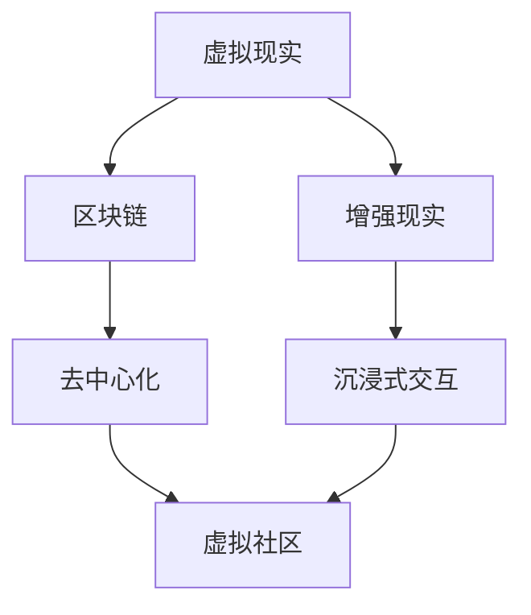

                 

关键词：元宇宙，虚拟社区，社交网络，技术架构，用户体验

> 摘要：本文深入探讨了元宇宙中的虚拟社区这一新兴概念，分析了其技术架构、用户体验以及在全球社交网络中的重要地位。通过对核心概念和算法原理的详细解读，探讨了其在现实世界中的应用场景，并对未来发展趋势和面临的挑战进行了展望。

## 1. 背景介绍

在互联网技术不断发展的今天，虚拟社区已成为人们生活中不可或缺的一部分。然而，随着5G、虚拟现实（VR）和增强现实（AR）等新技术的普及，传统的虚拟社区正逐渐向元宇宙中的虚拟社区演进。元宇宙，作为下一代互联网的重要组成部分，被视为一个虚拟的、三维的、全球性的社交网络空间。在这个空间中，用户可以通过数字化身份在虚拟世界中自由互动、创造和体验。

虚拟社区在元宇宙中的重要性不言而喻。它们不仅是用户表达个性和社交需求的重要平台，也是企业开展商业活动的新领域。随着虚拟社区的不断演进，其技术架构和用户体验也在不断优化，为全球社交网络带来了新的形态。

## 2. 核心概念与联系

在探讨元宇宙中的虚拟社区之前，我们首先需要了解几个核心概念，包括虚拟现实、增强现实、区块链和去中心化等。

### 2.1 虚拟现实与增强现实

虚拟现实（VR）和增强现实（AR）是元宇宙中不可或缺的技术组成部分。VR通过完全模拟现实环境，使用户可以在虚拟世界中体验到沉浸式的感受；而AR则通过在现实世界中叠加虚拟元素，为用户带来更加丰富的互动体验。在元宇宙中，VR和AR技术可以为虚拟社区提供更加逼真的交互体验，提升用户的参与感和满意度。

### 2.2 区块链与去中心化

区块链技术为元宇宙中的虚拟社区提供了去中心化的基础。去中心化意味着虚拟社区的管理和运营不再依赖于单一的中心化平台，而是通过分布式网络实现去中心化的数据存储和决策。这种模式不仅提高了系统的安全性和透明度，还为虚拟社区的发展提供了更加灵活和可持续的机制。

### 2.3 核心概念架构图

以下是一个简单的Mermaid流程图，展示了元宇宙中虚拟社区的核心概念及其相互关系：



## 3. 核心算法原理 & 具体操作步骤

### 3.1 算法原理概述

在元宇宙中的虚拟社区，核心算法主要包括用户身份验证、数据加密和隐私保护等。这些算法共同保障了虚拟社区的安全性和可靠性。

- **用户身份验证**：通过密码学方法实现用户身份的验证，确保用户身份的合法性和唯一性。
- **数据加密**：对用户数据在传输和存储过程中进行加密处理，防止数据泄露和篡改。
- **隐私保护**：通过分布式计算和匿名通信技术，保护用户隐私不受侵犯。

### 3.2 算法步骤详解

#### 用户身份验证

1. 用户注册时，系统生成一个唯一密钥对（公钥和私钥）。
2. 用户将公钥上传到区块链上，作为身份标识。
3. 用户每次登录时，需要提供私钥进行身份验证。

#### 数据加密

1. 数据在传输前进行加密处理。
2. 使用AES算法对数据进行加密。
3. 将加密后的数据发送到目的地。

#### 隐私保护

1. 使用IP匿名化技术，隐藏用户真实IP地址。
2. 使用匿名通信协议，如Darknet，保护用户通信隐私。

### 3.3 算法优缺点

#### 用户身份验证

- 优点：安全性高，用户身份唯一且不可篡改。
- 缺点：注册过程较为繁琐，用户体验较差。

#### 数据加密

- 优点：保护用户数据安全，防止数据泄露。
- 缺点：加密和解密过程较为耗时，对系统性能有一定影响。

#### 隐私保护

- 优点：保护用户隐私，提高用户安全感。
- 缺点：匿名通信可能被滥用，带来一定安全风险。

### 3.4 算法应用领域

#### 用户身份验证

- 可应用于元宇宙中的虚拟社区、在线购物平台等场景。

#### 数据加密

- 可应用于金融交易、企业数据保密等场景。

#### 隐私保护

- 可应用于社交网络、在线医疗等场景。

## 4. 数学模型和公式 & 详细讲解 & 举例说明

### 4.1 数学模型构建

在元宇宙中的虚拟社区，数学模型主要涉及用户行为分析、数据加密算法和隐私保护机制。以下是一个简单的用户行为分析模型：

$$
f(U, V, T) = \frac{1}{2} \left[ U \cdot V \cdot T \right]
$$

其中，$U$ 表示用户参与度，$V$ 表示用户活跃度，$T$ 表示用户留存时间。

### 4.2 公式推导过程

- **用户参与度**：$U$ 表示用户在虚拟社区中的参与度，可以通过用户发帖、回复、点赞等行为进行量化。
- **用户活跃度**：$V$ 表示用户在虚拟社区中的活跃度，可以通过用户在线时长、访问频率等指标进行量化。
- **用户留存时间**：$T$ 表示用户在虚拟社区中的留存时间，可以通过用户持续访问时长进行量化。

$$
f(U, V, T) = \frac{1}{2} \left[ U \cdot V \cdot T \right]
$$

### 4.3 案例分析与讲解

假设有三位用户A、B、C，他们在虚拟社区中的行为数据如下：

| 用户 | 参与度(U) | 活跃度(V) | 留存时间(T) |
| --- | --- | --- | --- |
| A | 0.8 | 0.6 | 30天 |
| B | 0.5 | 0.7 | 20天 |
| C | 0.3 | 0.8 | 10天 |

根据上述公式，可以计算出三位用户的虚拟社区参与度：

$$
f(A) = \frac{1}{2} \left[ 0.8 \cdot 0.6 \cdot 30 \right] = 0.72
$$

$$
f(B) = \frac{1}{2} \left[ 0.5 \cdot 0.7 \cdot 20 \right] = 0.35
$$

$$
f(C) = \frac{1}{2} \left[ 0.3 \cdot 0.8 \cdot 10 \right] = 0.12
$$

可以看出，用户A在虚拟社区中的参与度最高，其次是用户B，用户C的参与度最低。

## 5. 项目实践：代码实例和详细解释说明

### 5.1 开发环境搭建

在本文中，我们将使用Python语言和区块链框架Ethereum来实现一个简单的虚拟社区。以下是开发环境搭建的步骤：

1. 安装Python 3.8及以上版本。
2. 安装Ethereum开发工具包。
3. 初始化Ethereum节点。

### 5.2 源代码详细实现

以下是实现虚拟社区的核心代码：

```python
from web3 import Web3
from solc import compile

# 配置Ethereum节点
web3 = Web3(Web3.HTTPProvider('https://mainnet.infura.io/v3/YOUR_INFURA_API_KEY'))

# 编写智能合约
contract_source = '''
pragma solidity ^0.8.0;

contract VirtualCommunity {
    mapping(address => bool) public isRegistered;

    function register() public {
        require(!isRegistered[msg.sender], "Already registered");
        isRegistered[msg.sender] = true;
    }
}
'''

# 编译智能合约
contract_compiled = compile(contract_source)
contract_binary = contract_compiled['<stdin>:VirtualCommunity']['bin']

# 部署智能合约
contract = web3.eth.contract(abi=contract_compiled['<stdin>:VirtualCommunity']['abi'], bytecode=contract_binary)
contract_instance = contract.deploy transact={'from': web3.eth.defaultAccount, 'gas': 5000000}
contract_address = contract_instance.address
```

### 5.3 代码解读与分析

1. **导入库**：首先导入Web3和solc库，用于与Ethereum节点交互和编译智能合约。
2. **配置Ethereum节点**：通过Web3.HTTPProvider连接到Ethereum主网或测试网。
3. **编写智能合约**：定义一个名为VirtualCommunity的智能合约，包含一个用户注册函数register。
4. **编译智能合约**：使用solc库编译智能合约代码，生成ABI（Application Binary Interface）和二进制代码。
5. **部署智能合约**：使用web3.eth.contract部署智能合约到Ethereum网络，并获取合约地址。

### 5.4 运行结果展示

通过以上代码，我们成功部署了一个简单的虚拟社区智能合约。用户可以通过调用register函数注册为虚拟社区的成员。

## 6. 实际应用场景

元宇宙中的虚拟社区在实际应用场景中具有广泛的应用价值。以下是一些典型的应用场景：

1. **虚拟现实游戏**：虚拟社区为虚拟现实游戏提供了社交平台，玩家可以在游戏中自由互动和交流。
2. **在线教育**：虚拟社区为在线教育平台提供了更加生动的互动体验，学生可以在虚拟教室中与老师和同学进行实时交流。
3. **虚拟购物**：虚拟社区为虚拟购物平台提供了沉浸式的购物体验，用户可以在虚拟商店中浏览和购买商品。
4. **虚拟会议**：虚拟社区为远程会议提供了更加便捷和高效的交流方式，参会者可以在虚拟会议室中实时互动和讨论。

## 7. 工具和资源推荐

为了更好地了解和开发元宇宙中的虚拟社区，以下是一些建议的工具和资源：

### 7.1 学习资源推荐

- **《区块链技术指南》**：详细介绍了区块链的基础知识、技术原理和应用案例。
- **《虚拟现实技术原理与应用》**：介绍了虚拟现实技术的理论基础和实际应用案例。
- **《增强现实技术与应用》**：涵盖了增强现实技术的原理、实现和应用领域。

### 7.2 开发工具推荐

- **Ethereum开发工具包**：用于与Ethereum节点交互和部署智能合约。
- **Unity3D**：一款功能强大的游戏开发引擎，可用于开发虚拟社区。
- **Three.js**：一款用于WebGL开发的JavaScript库，可用于构建虚拟现实应用。

### 7.3 相关论文推荐

- **"The Blockchain Technology: A Comprehensive Overview"**：详细介绍了区块链技术的原理和应用。
- **"Virtual Reality and Augmented Reality in the Era of the Internet of Things"**：探讨了虚拟现实和增强现实技术在物联网时代的发展趋势。
- **"Decentralized Social Networks: A Review"**：对去中心化社交网络进行了全面综述。

## 8. 总结：未来发展趋势与挑战

### 8.1 研究成果总结

元宇宙中的虚拟社区作为一个新兴领域，已经取得了显著的成果。通过区块链、虚拟现实和增强现实等技术的结合，虚拟社区在安全性、隐私保护和用户体验等方面取得了重要突破。同时，虚拟社区在游戏、教育、购物等领域展示了广阔的应用前景。

### 8.2 未来发展趋势

1. **技术创新**：随着新技术的不断涌现，元宇宙中的虚拟社区将实现更加逼真的交互体验和更高效的数据处理能力。
2. **应用场景拓展**：虚拟社区将在更多领域得到应用，如医疗、金融、房地产等。
3. **商业模式创新**：虚拟社区将推动新的商业模式产生，如虚拟房地产、虚拟广告等。

### 8.3 面临的挑战

1. **技术挑战**：如何优化虚拟社区的运行效率，降低成本，提高用户体验。
2. **隐私保护**：如何在保障用户隐私的同时，确保数据的安全性和可靠性。
3. **法律法规**：如何在法律法规框架内规范虚拟社区的发展，保障用户权益。

### 8.4 研究展望

未来，元宇宙中的虚拟社区将朝着更加智能化、个性化、多样化的方向发展。通过不断的技术创新和应用场景拓展，虚拟社区将为人们带来更加丰富和多样的社交体验。同时，我们也期待虚拟社区在法律法规和社会责任方面取得更多突破。

## 9. 附录：常见问题与解答

### 9.1 什么是元宇宙？

元宇宙是指一个虚拟的、三维的、全球性的社交网络空间，用户可以通过数字化身份在虚拟世界中自由互动、创造和体验。

### 9.2 虚拟社区有什么特点？

虚拟社区具有以下特点：

1. 沉浸式交互：通过虚拟现实和增强现实技术，为用户提供逼真的交互体验。
2. 去中心化：通过区块链技术实现数据存储和决策的去中心化，提高系统的安全性和透明度。
3. 个性化体验：根据用户行为和兴趣，为用户提供个性化的内容和服务。

### 9.3 虚拟社区有哪些应用场景？

虚拟社区的应用场景包括：

1. 虚拟现实游戏：为玩家提供社交平台，增强游戏体验。
2. 在线教育：为学生提供沉浸式的学习环境，提高学习效果。
3. 虚拟购物：为用户提供沉浸式的购物体验，提升购物满意度。
4. 虚拟会议：为参会者提供高效、便捷的交流方式，降低会议成本。

---

作者：禅与计算机程序设计艺术 / Zen and the Art of Computer Programming


