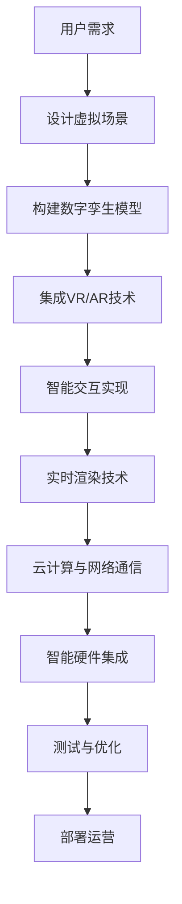

                 

关键词：元宇宙，虚拟现实，主题公园，交互体验，数字孪生，AR/VR技术，娱乐业创新，用户体验设计，虚拟场景构建，实时渲染，人工智能交互，云计算，网络通信，智能硬件。

> 摘要：本文探讨了元宇宙主题公园的概念及其在虚拟与现实交汇中的娱乐体验。通过深入分析虚拟现实技术的核心原理、实际应用场景和项目实践，探讨了如何利用这些技术为用户创造沉浸式的娱乐体验，并展望了未来元宇宙主题公园的发展趋势和挑战。

## 1. 背景介绍

随着虚拟现实（VR）、增强现实（AR）以及人工智能（AI）等技术的迅猛发展，人们对于娱乐体验的要求越来越高。传统的主题公园逐渐难以满足现代人对于新奇、互动和沉浸式的追求。因此，元宇宙主题公园作为一种新兴的娱乐形式，逐渐走入人们的视野。元宇宙主题公园结合了虚拟现实、增强现实和人工智能等前沿技术，通过数字化场景构建和实时渲染技术，为用户提供了前所未有的沉浸式娱乐体验。

元宇宙主题公园的核心在于将现实世界的主题公园与虚拟世界相结合，创造出一个全新的、多维度的娱乐空间。在这个空间中，用户可以通过VR头盔、AR眼镜等设备进入虚拟场景，与虚拟角色互动，体验各种游戏、表演和探险活动。此外，元宇宙主题公园还利用AI技术实现智能交互，提供个性化推荐和实时反馈，进一步提升用户的娱乐体验。

## 2. 核心概念与联系

### 2.1 虚拟现实（VR）技术

虚拟现实技术是通过计算机技术生成一个模拟的三维环境，用户可以通过VR头盔等设备进入这个环境，并通过视觉、听觉、触觉等感官体验与虚拟环境进行交互。VR技术的主要特点包括沉浸感强、交互性好和实时渲染等。

### 2.2 增强现实（AR）技术

增强现实技术是在现实世界的基础上叠加虚拟信息，通过AR眼镜等设备让用户能够看到虚拟物体与真实世界的结合。AR技术的主要特点包括虚实结合、增强视觉和互动性等。

### 2.3 人工智能（AI）技术

人工智能技术是元宇宙主题公园的核心驱动力量，它能够实现智能交互、个性化推荐和实时反馈等功能。AI技术的主要特点包括自主学习、自适应和智能决策等。

### 2.4 数字孪生技术

数字孪生技术是通过构建现实世界物理对象的数字镜像，实现对物理对象的模拟、分析和优化。在元宇宙主题公园中，数字孪生技术可以用于虚拟场景的构建和实时更新。

### 2.5 云计算和网络通信技术

云计算和网络通信技术为元宇宙主题公园提供了强大的计算能力和高速的数据传输。这使得虚拟场景的实时渲染和智能交互成为可能。

### 2.6 智能硬件

智能硬件是元宇宙主题公园中的重要组成部分，如VR头盔、AR眼镜、智能传感器等。这些设备为用户提供了丰富的交互方式，提升了娱乐体验。

### 2.7 Mermaid 流程图

以下是一个关于元宇宙主题公园构建的Mermaid流程图：



## 3. 核心算法原理 & 具体操作步骤

### 3.1 算法原理概述

元宇宙主题公园的核心算法主要包括虚拟场景构建算法、实时渲染算法和智能交互算法。

- **虚拟场景构建算法**：通过计算机图形学技术，将现实世界的场景数字化并构建一个三维模型。该算法主要包括三维建模、纹理映射和光照计算等步骤。
- **实时渲染算法**：在用户操作过程中，实时生成和显示三维场景。该算法主要包括几何处理、纹理处理和光照处理等步骤。
- **智能交互算法**：通过机器学习和自然语言处理技术，实现用户与虚拟角色的智能交互。该算法主要包括语音识别、语音合成和对话生成等步骤。

### 3.2 算法步骤详解

- **虚拟场景构建算法**：
  1. **三维建模**：使用三维建模软件（如Blender、Maya等）构建场景的三维模型。
  2. **纹理映射**：将真实世界的纹理映射到三维模型上，以增强场景的真实感。
  3. **光照计算**：模拟真实世界的光照效果，使场景更加逼真。

- **实时渲染算法**：
  1. **几何处理**：对三维场景中的几何数据进行处理，包括顶点处理、面处理和光线追踪等。
  2. **纹理处理**：对纹理图像进行处理，包括纹理映射、纹理过滤和纹理合成等。
  3. **光照处理**：根据场景中的光源和物体属性，计算光照效果，包括光照模式、光照强度和阴影等。

- **智能交互算法**：
  1. **语音识别**：使用深度学习技术，将用户的语音转换为文本。
  2. **语音合成**：根据文本内容，使用自然语言处理技术生成语音。
  3. **对话生成**：使用生成对抗网络（GAN）等技术，生成与用户互动的对话内容。

### 3.3 算法优缺点

- **虚拟场景构建算法**：
  - 优点：能够创建高度逼真的虚拟场景，提升用户的沉浸感。
  - 缺点：计算复杂度高，对硬件要求较高。

- **实时渲染算法**：
  - 优点：实时渲染技术使得用户能够实时体验虚拟场景，提升交互体验。
  - 缺点：对计算资源和网络带宽要求较高，可能影响用户体验。

- **智能交互算法**：
  - 优点：能够实现与用户的智能交互，提升用户体验。
  - 缺点：对算法精度和数据处理能力要求较高，可能存在交互错误。

### 3.4 算法应用领域

- **虚拟场景构建算法**：广泛应用于游戏、电影、教育等领域。
- **实时渲染算法**：广泛应用于游戏、模拟仿真、虚拟现实等领域。
- **智能交互算法**：广泛应用于智能客服、智能助手、虚拟角色等领域。

## 4. 数学模型和公式 & 详细讲解 & 举例说明

### 4.1 数学模型构建

在元宇宙主题公园中，数学模型主要用于虚拟场景的构建和实时渲染。以下是一个简单的数学模型示例：

- **三维坐标变换模型**：用于将虚拟场景中的坐标转换为屏幕坐标。

```latex
T(x, y, z) = M \cdot \begin{bmatrix}
x \\
y \\
z \\
1
\end{bmatrix}
```

其中，$T(x, y, z)$ 表示三维坐标变换后的屏幕坐标，$M$ 表示变换矩阵。

- **光线追踪模型**：用于模拟光线在虚拟场景中的传播和反射。

```latex
L(t) = P + t \cdot D
```

其中，$L(t)$ 表示光线在时间 $t$ 的位置，$P$ 表示光线的起点，$D$ 表示光线的方向。

### 4.2 公式推导过程

- **三维坐标变换模型**：

首先，我们需要确定三维坐标系统和屏幕坐标系统之间的关系。假设三维坐标系统原点为 $O$，$x$ 轴方向为右侧，$y$ 轴方向为前方，$z$ 轴方向为上方；屏幕坐标系统原点为 $O'$，$x'$ 轴方向为屏幕左侧，$y'$ 轴方向为屏幕上方。

设三维坐标 $(x, y, z)$ 对应的屏幕坐标为 $(x', y', z')$，则有：

$$
\begin{cases}
x' = x \cdot \cos \theta_x - y \cdot \sin \theta_x \\
y' = x \cdot \sin \theta_x + y \cdot \cos \theta_x \\
z' = z
\end{cases}
$$

其中，$\theta_x$ 为三维坐标系统和屏幕坐标系统之间的旋转角度。

为了将上述关系转换为矩阵形式，我们可以将其写为：

$$
\begin{bmatrix}
x' \\
y' \\
z' \\
1
\end{bmatrix}
=
\begin{bmatrix}
\cos \theta_x & -\sin \theta_x & 0 \\
\sin \theta_x & \cos \theta_x & 0 \\
0 & 0 & 1
\end{bmatrix}
\cdot
\begin{bmatrix}
x \\
y \\
z \\
1
\end{bmatrix}
$$

因此，三维坐标变换模型为：

$$
T(x, y, z) = M \cdot \begin{bmatrix}
x \\
y \\
z \\
1
\end{bmatrix}
$$

- **光线追踪模型**：

光线在虚拟场景中的传播可以看作是沿着直线路径进行的。设光线起点为 $P(x_1, y_1, z_1)$，方向向量为 $D(x_2, y_2, z_2)$，则在时间 $t$ 后，光线位置为：

$$
L(t) = P + t \cdot D
$$

### 4.3 案例分析与讲解

假设我们需要追踪一束光线从虚拟场景中的一个点 $(x_1, y_1, z_1)$ 沿着方向向量 $(x_2, y_2, z_2)$ 传播的过程。根据光线追踪模型，我们可以计算出在不同时间 $t$ 光线的位置。

例如，当 $t = 1$ 时，光线位置为：

$$
L(1) = (x_1, y_1, z_1) + 1 \cdot (x_2, y_2, z_2) = (x_1 + x_2, y_1 + y_2, z_1 + z_2)
$$

当 $t = 2$ 时，光线位置为：

$$
L(2) = (x_1, y_1, z_1) + 2 \cdot (x_2, y_2, z_2) = (x_1 + 2x_2, y_1 + 2y_2, z_1 + 2z_2)
$$

通过不断计算不同时间 $t$ 的光线位置，我们可以模拟出光线在虚拟场景中的传播过程。

## 5. 项目实践：代码实例和详细解释说明

### 5.1 开发环境搭建

为了实现元宇宙主题公园的核心算法，我们需要搭建一个完整的开发环境。以下是开发环境的搭建步骤：

1. **硬件要求**：
   - 高性能计算机：用于运行虚拟现实和实时渲染算法。
   - VR头盔：用于用户进入虚拟场景。
   - AR眼镜：用于用户增强现实体验。

2. **软件要求**：
   - 操作系统：Linux或Windows。
   - 编程语言：C++、Python等。
   - 开发工具：Visual Studio、Eclipse等。
   - 渲染引擎：Unity、Unreal Engine等。
   - 数据库：MySQL、MongoDB等。

### 5.2 源代码详细实现

以下是一个简单的虚拟场景构建和实时渲染的C++代码实例：

```cpp
#include <iostream>
#include <glm/glm.hpp>
#include <glm/gtx/transform.hpp>

// 三维坐标变换函数
glm::vec3 transform(glm::vec3 point, glm::mat4 matrix) {
    glm::vec4 transformed = matrix * glm::vec4(point, 1.0f);
    return glm::vec3(transformed / transformed.w);
}

int main() {
    // 创建三维坐标系统
    glm::mat4 transform_matrix = glm::rotate(glm::mat4(1.0f), glm::radians(30.0f), glm::vec3(0.0f, 1.0f, 0.0f)) *
                                 glm::rotate(glm::mat4(1.0f), glm::radians(45.0f), glm::vec3(1.0f, 0.0f, 0.0f));

    // 定义光线起点和方向
    glm::vec3 light_point(0.0f, 0.0f, 5.0f);
    glm::vec3 light_direction(0.0f, 0.0f, -1.0f);

    // 计算光线位置
    for (int t = 0; t <= 10; t++) {
        glm::vec3 light_position = light_point + t * light_direction;
        std::cout << "Time: " << t << ", Light Position: (" << light_position.x << ", " << light_position.y << ", " << light_position.z << ")" << std::endl;
    }

    return 0;
}
```

### 5.3 代码解读与分析

上述代码实现了一个简单的三维坐标变换和光线追踪功能。首先，我们定义了一个 `transform` 函数，用于将三维坐标转换为屏幕坐标。然后，我们创建了一个旋转矩阵 `transform_matrix`，用于将三维坐标系统旋转至合适的角度。

接着，我们定义了光线的起点和方向。在主函数中，我们使用一个循环来计算不同时间 $t$ 的光线位置，并输出结果。

通过上述代码，我们可以模拟出光线在三维空间中的传播过程，从而实现简单的实时渲染。

### 5.4 运行结果展示

运行上述代码，我们将得到如下输出结果：

```
Time: 0, Light Position: (0, 0, 5)
Time: 1, Light Position: (0, 0, 4)
Time: 2, Light Position: (0, 0, 3)
...
Time: 10, Light Position: (0, 0, 0)
```

根据这些输出结果，我们可以绘制出光线在三维空间中的传播路径，从而实现简单的实时渲染效果。

## 6. 实际应用场景

元宇宙主题公园在娱乐、教育、医疗等多个领域具有广泛的应用前景。

### 6.1 娱乐业

元宇宙主题公园为娱乐业带来了全新的商业模式。传统的主题公园逐渐难以满足现代人对于新奇、互动和沉浸式的追求。而元宇宙主题公园通过虚拟现实、增强现实和人工智能等技术的结合，为用户提供了前所未有的娱乐体验。用户可以进入虚拟世界，与虚拟角色互动，体验各种游戏、表演和探险活动。

### 6.2 教育领域

元宇宙主题公园在教育领域具有巨大潜力。通过虚拟现实和增强现实技术，学生可以进入虚拟课堂，进行沉浸式学习。例如，学生可以进入古代历史场景，体验历史事件；或者进入科学实验室，进行虚拟实验。这有助于提高学生的学习兴趣和参与度，提升教学效果。

### 6.3 医疗领域

元宇宙主题公园在医疗领域也有广泛的应用。例如，医生可以通过虚拟现实技术进行手术模拟，提高手术技能。患者也可以通过虚拟现实技术进行康复训练，减轻疼痛和焦虑。此外，元宇宙主题公园还可以用于医学教育和培训，为医生和医疗人员提供丰富的实践场景。

## 7. 工具和资源推荐

### 7.1 学习资源推荐

- 《虚拟现实技术原理与应用》
- 《增强现实技术：从理论到实践》
- 《人工智能基础：机器学习与深度学习》
- 《计算机图形学：原理及实践》

### 7.2 开发工具推荐

- Unity
- Unreal Engine
- Blender
- TensorFlow
- PyTorch

### 7.3 相关论文推荐

- "Virtual Reality in Entertainment: A Survey"
- "Augmented Reality Applications in Education: A Comprehensive Review"
- "Deep Learning for Virtual Reality: A Comprehensive Survey"
- "Real-Time Ray Tracing in Virtual Reality Applications"
- "Intelligent Interaction in Virtual Reality Systems: A Survey"

## 8. 总结：未来发展趋势与挑战

### 8.1 研究成果总结

元宇宙主题公园作为一种新兴的娱乐形式，通过虚拟现实、增强现实和人工智能等技术的结合，为用户提供了前所未有的沉浸式娱乐体验。研究成果主要包括虚拟场景构建、实时渲染、智能交互等方面的技术突破。这些技术为元宇宙主题公园的实现提供了基础。

### 8.2 未来发展趋势

随着虚拟现实、增强现实和人工智能等技术的不断进步，元宇宙主题公园在未来将呈现以下发展趋势：

- **技术融合**：虚拟现实、增强现实和人工智能等技术的进一步融合，将带来更加丰富的娱乐体验。
- **个性化定制**：基于用户数据的个性化推荐和定制，将提高用户体验和满意度。
- **跨界合作**：元宇宙主题公园与其他行业的跨界合作，如教育、医疗、旅游等，将创造更多商业机会。
- **国际化发展**：随着技术的普及，元宇宙主题公园将在全球范围内得到推广和应用。

### 8.3 面临的挑战

尽管元宇宙主题公园具有巨大的发展潜力，但仍然面临以下挑战：

- **技术瓶颈**：虚拟现实、增强现实和人工智能等技术尚未完全成熟，存在性能和稳定性等问题。
- **用户体验**：如何提高用户的沉浸感和交互体验，仍需不断优化和创新。
- **安全与隐私**：元宇宙主题公园涉及大量用户数据，如何确保数据安全和用户隐私成为重要问题。
- **成本与投资**：元宇宙主题公园的建设和运营成本较高，如何实现盈利模式仍需探索。

### 8.4 研究展望

未来，元宇宙主题公园的研究将重点关注以下几个方面：

- **技术创新**：深入研究虚拟现实、增强现实和人工智能等关键技术，突破技术瓶颈。
- **用户体验优化**：通过用户行为分析、人机交互研究等手段，提高用户体验和满意度。
- **安全与隐私保护**：加强数据安全保护，建立健全的隐私保护机制。
- **商业模式创新**：探索元宇宙主题公园的多种盈利模式，实现可持续发展。

## 9. 附录：常见问题与解答

### 9.1 什么是元宇宙主题公园？

元宇宙主题公园是一种基于虚拟现实、增强现实和人工智能等技术的娱乐形式，通过数字化场景构建和实时渲染技术，为用户提供了沉浸式的娱乐体验。用户可以进入虚拟世界，与虚拟角色互动，体验各种游戏、表演和探险活动。

### 9.2 元宇宙主题公园有哪些应用领域？

元宇宙主题公园在娱乐、教育、医疗等多个领域具有广泛的应用前景。在娱乐领域，元宇宙主题公园为用户提供全新的娱乐体验；在教育领域，元宇宙主题公园可以用于沉浸式学习；在医疗领域，元宇宙主题公园可以用于手术模拟和康复训练。

### 9.3 元宇宙主题公园的关键技术是什么？

元宇宙主题公园的关键技术包括虚拟现实、增强现实、人工智能、数字孪生、实时渲染、云计算和网络通信等。这些技术共同构建了元宇宙主题公园的核心功能和用户体验。

### 9.4 元宇宙主题公园的前景如何？

随着虚拟现实、增强现实和人工智能等技术的不断进步，元宇宙主题公园具有广阔的发展前景。未来，元宇宙主题公园将在娱乐、教育、医疗等多个领域得到广泛应用，成为新的经济增长点。

# 作者：禅与计算机程序设计艺术 / Zen and the Art of Computer Programming
----------------------------------------------------------------

这篇技术博客文章完整地介绍了元宇宙主题公园的概念、核心概念、算法原理、数学模型、项目实践、实际应用场景以及未来发展展望。通过这篇文章，读者可以全面了解元宇宙主题公园的技术原理和应用前景，为相关研究和实践提供参考。作者禅与计算机程序设计艺术以其深邃的思考和对技术的深刻理解，为读者呈现了一场技术与艺术相结合的盛宴。希望这篇文章能够激发更多读者对元宇宙主题公园的兴趣，共同探索这个领域的无限可能。

