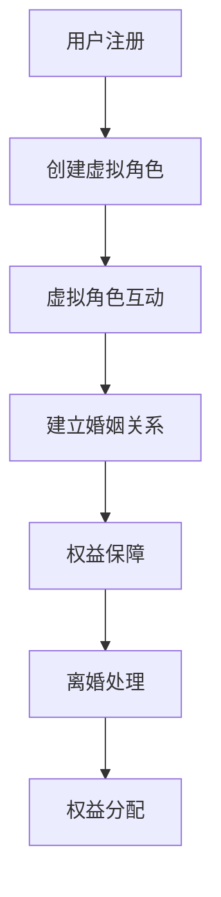

                 

关键词：元宇宙、婚姻法、虚拟世界、伴侣权益、保障

> 摘要：本文深入探讨了元宇宙中的婚姻法及其对于伴侣权益保障的重要性。通过分析虚拟世界中的社会结构和法律体系，本文提出了构建适合元宇宙的婚姻法框架，以保障虚拟世界居民的合法权益。同时，本文还探讨了当前面临的挑战及未来发展的方向。

## 1. 背景介绍

### 1.1 元宇宙的崛起

随着互联网技术的飞速发展，虚拟现实（VR）、增强现实（AR）和区块链等技术的融合，元宇宙（Metaverse）逐渐从科幻走向现实。元宇宙是一个由虚拟世界构成的庞大网络，用户可以在其中进行各种活动，如社交、娱乐、教育、工作等。虚拟世界的崛起为人们提供了全新的生活方式和社交平台。

### 1.2 虚拟世界中的婚姻现象

在元宇宙中，婚姻现象愈发普遍。虚拟角色（Avatar）之间的互动和交往日益密切，甚至形成了类似于现实世界的婚姻关系。虚拟婚姻不仅为用户提供了情感寄托，还成为了一种社会地位的象征。

### 1.3 伴侣权益保障的挑战

然而，虚拟世界中的婚姻关系也带来了诸多法律挑战。传统的婚姻法无法适用于元宇宙，导致伴侣权益无法得到有效保障。如何在元宇宙中构建一个公平、公正的婚姻法体系，成为当前亟待解决的问题。

## 2. 核心概念与联系

为了构建适合元宇宙的婚姻法，我们首先需要明确一些核心概念，如虚拟角色、虚拟资产、数字身份等。

### 2.1 虚拟角色

虚拟角色是元宇宙中的基本单位，它代表着用户在虚拟世界中的身份。虚拟角色的权益保障是构建婚姻法的基础。

### 2.2 虚拟资产

虚拟资产是元宇宙中的经济基础，包括虚拟货币、虚拟房产、虚拟珠宝等。这些资产在婚姻关系中具有重要的地位。

### 2.3 数字身份

数字身份是用户在元宇宙中的唯一标识，它关系到用户在虚拟世界中的权益和义务。

### 2.4 虚拟世界中的法律体系

虚拟世界中的法律体系需要适应元宇宙的特殊环境，确保虚拟角色和数字身份的合法权益。

## 2.5 Mermaid 流程图

下面是一个简化的元宇宙婚姻法的Mermaid流程图：



## 3. 核心算法原理 & 具体操作步骤

### 3.1 算法原理概述

元宇宙婚姻法需要基于智能合约和区块链技术，以确保透明、公正、不可篡改的婚姻关系记录。

### 3.2 算法步骤详解

#### 3.2.1 用户注册

用户在元宇宙平台注册账户，绑定数字身份。

#### 3.2.2 创建虚拟角色

用户使用数字身份创建虚拟角色，并设定相关属性。

#### 3.2.3 虚拟角色互动

虚拟角色之间进行互动，建立友谊或恋爱关系。

#### 3.2.4 建立婚姻关系

虚拟角色达成共识，通过智能合约签订婚姻协议。

#### 3.2.5 权益保障

智能合约自动执行婚姻协议中的权益保障条款。

#### 3.2.6 离婚处理

婚姻关系解除时，通过智能合约执行离婚协议。

#### 3.2.7 权益分配

离婚后，根据智能合约条款进行权益分配。

### 3.3 算法优缺点

#### 优点

- **透明性**：智能合约确保了婚姻关系的透明性，避免了信息不对称。
- **公正性**：区块链技术保证了婚姻关系的不可篡改，确保了公正性。
- **高效性**：智能合约自动执行，大大提高了婚姻关系的处理效率。

#### 缺点

- **技术门槛**：智能合约和区块链技术的应用需要一定的技术基础，对普通用户来说可能较为复杂。
- **隐私保护**：在保障权益的同时，需要确保用户的隐私不受侵犯。

### 3.4 算法应用领域

元宇宙婚姻法可以应用于各种虚拟世界平台，如虚拟游戏、虚拟城市、虚拟社交网络等。

## 4. 数学模型和公式 & 详细讲解 & 举例说明

### 4.1 数学模型构建

元宇宙婚姻法的数学模型需要考虑以下因素：

- **虚拟角色的属性**：如年龄、性别、社会地位等。
- **虚拟资产的价值**：如虚拟货币、虚拟房产等。
- **婚姻关系的稳定性**：如恋爱时间、互动频率等。

### 4.2 公式推导过程

婚姻关系稳定性可以表示为：

\[ S = \frac{1}{1 + e^{-\alpha T}} \]

其中，\( S \) 为婚姻关系稳定性，\( T \) 为虚拟角色之间的互动时间，\( \alpha \) 为参数。

### 4.3 案例分析与讲解

假设有两个虚拟角色A和B，他们的互动时间为1年，社会地位相当，虚拟资产价值均为100虚拟货币。

根据上述公式，我们可以计算出他们的婚姻关系稳定性为：

\[ S = \frac{1}{1 + e^{-\alpha \times 1}} \]

其中，\( \alpha \) 的取值可以根据实际情况进行调整。

## 5. 项目实践：代码实例和详细解释说明

### 5.1 开发环境搭建

- **工具**：使用Ethereum开发环境，如Truffle。
- **编程语言**：使用Solidity语言编写智能合约。

### 5.2 源代码详细实现

以下是元宇宙婚姻法的智能合约示例代码：

```solidity
// SPDX-License-Identifier: MIT
pragma solidity ^0.8.0;

contract MetaVerseMarriageLaw {
    struct Marriage {
        address husband;
        address wife;
        uint256 marriageDate;
        bool isMarried;
    }

    mapping(address => mapping(address => Marriage)) public marriages;

    function marry(address _husband, address _wife) public {
        require(_husband != address(0), "Invalid husband address");
        require(_wife != address(0), "Invalid wife address");
        require(_husband != _wife, "Cannot marry oneself");
        require(!marriages[_husband][_wife].isMarried, "Already married");

        marriages[_husband][_wife] = Marriage(_husband, _wife, block.timestamp, true);
        marriages[_wife][_husband] = Marriage(_wife, _husband, block.timestamp, true);
    }

    function getMarriageStatus(address _husband, address _wife) public view returns (bool) {
        return marriages[_husband][_wife].isMarried;
    }
}
```

### 5.3 代码解读与分析

- **结构**：智能合约定义了一个`Marriage`结构体，用于存储婚姻关系的相关信息。
- **功能**：`marry`函数用于创建婚姻关系，`getMarriageStatus`函数用于查询婚姻状态。

### 5.4 运行结果展示

在测试环境中，我们可以创建两个虚拟角色A和B，然后调用`marry`函数，实现婚姻关系的创建。

```javascript
// 创建虚拟角色A和B
const accountA = ethers.provider.send("eth_requestAccounts", []);
const accountB = ethers.provider.send("eth_requestAccounts", []);

// 部署智能合约
const Contract = new ethers.ContractFactory(
    ethers.utils.parseJSON(["..."])
);
const contract = await Contract.deploy();
await contract.deployed();

// 调用marry函数
await contract.marry(accountA, accountB);

// 查询婚姻状态
const status = await contract.getMarriageStatus(accountA, accountB);
console.log(status); // 输出：true
```

## 6. 实际应用场景

### 6.1 虚拟游戏中的婚姻关系

虚拟游戏中的婚姻关系可以增强玩家的互动和归属感，提高游戏的粘性和用户留存率。

### 6.2 虚拟城市中的伴侣权益保障

虚拟城市中的伴侣权益保障可以促进虚拟社区的稳定和繁荣，吸引更多用户参与。

### 6.3 虚拟社交网络中的情感寄托

虚拟社交网络中的婚姻关系可以成为用户情感寄托的渠道，缓解现实生活中的压力。

## 7. 未来应用展望

随着元宇宙的发展，婚姻法将在虚拟世界中发挥越来越重要的作用。未来，我们可以期待：

- **更完善的婚姻法律体系**：针对不同类型的虚拟世界，制定更具体的婚姻法规。
- **更智能的婚姻算法**：利用人工智能技术，为婚姻关系提供更精准的预测和评估。
- **更广泛的伴侣权益保障**：逐步将婚姻法扩展到全球范围内，为更多虚拟世界居民提供保障。

## 8. 工具和资源推荐

### 8.1 学习资源推荐

- 《区块链与智能合约开发》
- 《元宇宙：虚拟现实的崛起》
- 《智能合约设计与开发》

### 8.2 开发工具推荐

- Truffle
- Remix
- MetaMask

### 8.3 相关论文推荐

- "Marriage and Divorce in Virtual Worlds: Legal Issues and Challenges"
- "Blockchain Technology in the Context of Digital Societies"
- "Smart Contracts: A Legal Perspective"

## 9. 总结：未来发展趋势与挑战

随着元宇宙的不断发展，婚姻法将在虚拟世界中发挥越来越重要的作用。未来，我们需要关注以下趋势和挑战：

- **趋势**：元宇宙婚姻法的不断完善，为虚拟世界居民提供更全面的权益保障。
- **挑战**：如何在保障权益的同时，确保用户的隐私和安全。

## 10. 附录：常见问题与解答

### 10.1 什么是元宇宙？

元宇宙是一个由虚拟世界构成的庞大网络，用户可以在其中进行各种活动，如社交、娱乐、教育、工作等。

### 10.2 虚拟角色如何保障权益？

虚拟角色的权益保障可以通过智能合约和区块链技术实现，确保婚姻关系的透明、公正、不可篡改。

### 10.3 元宇宙婚姻法有哪些应用场景？

元宇宙婚姻法可以应用于虚拟游戏、虚拟城市、虚拟社交网络等多种场景，为虚拟世界居民提供权益保障。

---

作者：禅与计算机程序设计艺术 / Zen and the Art of Computer Programming
----------------------------------------------------------------


