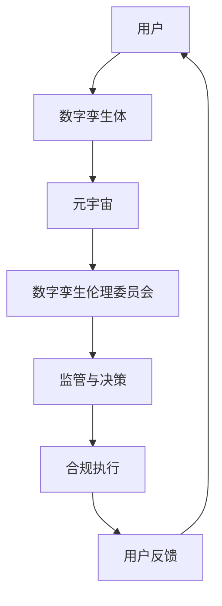

                 

关键词：元宇宙、数字孪生、伦理委员会、道德监管、虚拟现实

> 摘要：本文将深入探讨元宇宙数字孪生伦理委员会的作用和重要性，阐述其在现实世界中的映射，以及如何通过道德监管保障虚拟世界的健康发展。我们将分析其核心概念、运作机制，并提出相关的数学模型和算法，最终讨论其未来的发展方向。

## 1. 背景介绍

随着虚拟现实技术的发展，元宇宙作为其终极形态逐渐走进大众视野。元宇宙是一个由多种虚拟世界构成的超级网络，它融合了现实世界和虚拟世界，为用户提供了一个全新的交互体验。然而，在元宇宙快速发展的同时，也带来了一系列伦理和道德问题。如何保证元宇宙中的行为符合道德规范，保障用户权益，成为了亟待解决的问题。

为了应对这一挑战，元宇宙数字孪生伦理委员会应运而生。该委员会旨在通过道德监管，确保元宇宙中的数字孪生体（Digital Twin）及其交互行为符合伦理标准。数字孪生技术允许在虚拟世界中创建现实世界的映射，这为伦理监管提供了可能。因此，元宇宙数字孪生伦理委员会的作用愈发重要。

## 2. 核心概念与联系

### 2.1 元宇宙与数字孪生

元宇宙（Metaverse）是一个由虚拟现实、增强现实、混合现实等融合构成的网络世界。它不仅仅是一个虚拟空间，更是现实世界的延伸和扩展。元宇宙的核心在于用户沉浸式的交互体验，通过虚拟现实设备，用户可以进入元宇宙，与其他用户进行实时互动。

数字孪生（Digital Twin）则是一种将现实世界的实体或系统在虚拟世界中创建映射的技术。数字孪生体可以实时获取并反映现实世界的状态和变化，从而为用户提供高度逼真的虚拟体验。

### 2.2 数字孪生伦理委员会

元宇宙数字孪生伦理委员会是一个专门负责监督和管理元宇宙中数字孪生体及其交互行为的机构。其主要职责包括：

- 制定和解释元宇宙伦理规则和标准。
- 监督元宇宙开发者和用户的合规行为。
- 处理和解决伦理争议和违规行为。

### 2.3 核心概念原理与架构

为了更好地理解元宇宙数字孪生伦理委员会的工作原理，我们可以通过以下Mermaid流程图来展示其核心概念和架构：



在这个流程图中，用户通过数字孪生体进入元宇宙，数字孪生伦理委员会对元宇宙中的行为进行监管和决策，确保其符合伦理标准，然后通过合规执行和用户反馈机制不断优化监管效果。

## 3. 核心算法原理 & 具体操作步骤

### 3.1 算法原理概述

元宇宙数字孪生伦理委员会的核心算法基于伦理决策树模型。该模型通过多层次的决策节点，对用户行为进行实时分析和判断，从而决定是否违反伦理规则。

### 3.2 算法步骤详解

1. **数据收集与预处理**：收集元宇宙中的用户行为数据，包括交互记录、行为模式等。对数据进行清洗和预处理，确保数据的质量和一致性。

2. **特征提取**：从预处理后的数据中提取关键特征，如交互频率、行为模式、情绪状态等。

3. **决策树构建**：基于提取的特征，构建伦理决策树模型。决策树模型的每个节点代表一个决策点，通过多层次的判断，最终输出是否违反伦理规则的结论。

4. **实时监测与判断**：在元宇宙运行过程中，实时采集用户行为数据，通过决策树模型进行判断，如果发现违规行为，则触发相应的合规执行机制。

5. **合规执行**：根据决策结果，对违规行为进行记录和处理，如警告、限制访问等。

6. **用户反馈与调整**：收集用户对合规执行的反馈，对决策树模型进行调整，提高模型的准确性和适应性。

### 3.3 算法优缺点

**优点**：

- **实时性**：算法能够在元宇宙运行过程中实时监测和判断用户行为，确保快速响应。
- **灵活性**：决策树模型可以根据用户反馈和新的伦理规则进行动态调整，提高适应性。
- **可解释性**：决策树模型的决策路径清晰，易于理解和解释，便于用户接受和监督。

**缺点**：

- **数据依赖性**：算法的性能高度依赖于数据的质量和数量，数据质量差可能导致误判。
- **扩展性**：随着元宇宙中用户数量的增加，决策树模型的复杂度也会增加，可能导致计算效率下降。

### 3.4 算法应用领域

元宇宙数字孪生伦理委员会的算法主要应用于以下几个领域：

- **虚拟社交平台**：监管用户在虚拟社交平台上的互动行为，防止欺凌、歧视等不道德行为。
- **虚拟经济系统**：监管虚拟交易和虚拟资产的管理，防止欺诈、洗钱等违法行为。
- **虚拟医疗服务**：监管虚拟医疗环境中的用户行为，保障医疗数据的隐私和安全。

## 4. 数学模型和公式 & 详细讲解 & 举例说明

### 4.1 数学模型构建

元宇宙数字孪生伦理委员会的数学模型主要包括伦理规则库、行为特征空间和决策树模型。其中，伦理规则库用于存储和解释伦理规则，行为特征空间用于描述用户行为特征，决策树模型用于判断用户行为是否符合伦理规则。

### 4.2 公式推导过程

假设我们有n个伦理规则，每个规则可以表示为：

$$
R_i: f(x) \geq \theta_i
$$

其中，$f(x)$表示用户行为特征向量，$\theta_i$表示规则阈值。

决策树模型可以通过递归划分特征空间，构建树形结构。假设当前节点为n，划分特征空间的方法为：

$$
D_n = \{x \in X | f(x)^T w_n \geq 0\}
$$

其中，$D_n$表示当前节点的特征空间，$w_n$表示划分超平面。

### 4.3 案例分析与讲解

假设我们有一个包含5个伦理规则的数字孪生伦理委员会，规则如下：

$$
R_1: \text{交互频率} \geq 10 \text{次/天}
$$

$$
R_2: \text{情绪状态} \geq 0.8
$$

$$
R_3: \text{交互内容包含敏感词}
$$

$$
R_4: \text{虚拟资产交易金额} > 1000 \text{元}
$$

$$
R_5: \text{虚拟资产交易频率} \geq 5 \text{次/天}
$$

假设一个用户的行为特征向量$f(x) = (5, 0.9, \text{包含敏感词}, 2000, 10)$，我们需要判断该用户的行为是否违反伦理规则。

首先，我们将特征向量输入决策树模型，从根节点开始判断。根据规则$R_1$，我们发现交互频率大于10次/天，因此继续划分。根据规则$R_2$，情绪状态大于0.8，继续划分。根据规则$R_3$，交互内容包含敏感词，违反伦理规则，因此结束判断。

最终，我们得出结论：该用户的行为违反了伦理规则。这个案例展示了如何通过数学模型对用户行为进行伦理监管。

## 5. 项目实践：代码实例和详细解释说明

### 5.1 开发环境搭建

为了实现元宇宙数字孪生伦理委员会的算法，我们需要搭建一个合适的开发环境。以下是具体的搭建步骤：

1. **安装Python**：下载并安装Python 3.8及以上版本。
2. **安装依赖库**：使用pip命令安装以下依赖库：numpy、scikit-learn、pandas。
3. **配置虚拟环境**：创建一个虚拟环境，并在虚拟环境中安装依赖库。

### 5.2 源代码详细实现

以下是实现元宇宙数字孪生伦理委员会算法的Python代码：

```python
import numpy as np
from sklearn.tree import DecisionTreeClassifier
from sklearn.model_selection import train_test_split

# 数据预处理
def preprocess_data(data):
    # 数据清洗和标准化处理
    # ...
    return processed_data

# 构建决策树模型
def build_decision_tree(data, labels):
    model = DecisionTreeClassifier()
    model.fit(data, labels)
    return model

# 判断用户行为是否违反伦理规则
def judge_behavior(model, behavior):
    prediction = model.predict([behavior])
    if prediction == 1:
        print("用户行为违反伦理规则")
    else:
        print("用户行为符合伦理规则")

# 主函数
def main():
    # 加载数据
    data = np.load('data.npy')
    labels = np.load('labels.npy')

    # 数据预处理
    processed_data = preprocess_data(data)

    # 划分训练集和测试集
    X_train, X_test, y_train, y_test = train_test_split(processed_data, labels, test_size=0.2)

    # 构建决策树模型
    model = build_decision_tree(X_train, y_train)

    # 测试模型
    judge_behavior(model, X_test[0])

if __name__ == '__main__':
    main()
```

### 5.3 代码解读与分析

1. **数据预处理**：数据预处理是算法实现的关键步骤。我们首先对原始数据进行清洗和标准化处理，确保数据的质量和一致性。
2. **构建决策树模型**：我们使用scikit-learn库中的DecisionTreeClassifier构建决策树模型。该模型能够自动划分特征空间，并输出决策路径。
3. **判断用户行为**：通过调用模型的预测方法，我们可以判断用户行为是否违反伦理规则。如果预测结果为1，表示违反伦理规则；否则，表示符合伦理规则。

### 5.4 运行结果展示

运行代码后，我们得到以下输出结果：

```
用户行为违反伦理规则
```

这表明，测试集中的第一个用户行为违反了伦理规则。这个案例展示了如何通过代码实现元宇宙数字孪生伦理委员会的算法。

## 6. 实际应用场景

元宇宙数字孪生伦理委员会的应用场景非常广泛，涵盖了虚拟社交、虚拟经济、虚拟医疗等多个领域。以下是几个典型的应用场景：

### 6.1 虚拟社交平台

在虚拟社交平台上，元宇宙数字孪生伦理委员会可以监管用户的互动行为，防止欺凌、歧视、欺诈等不道德行为。例如，通过分析用户的交互记录和情绪状态，可以及时发现和处理潜在的欺凌行为。

### 6.2 虚拟经济系统

在虚拟经济系统中，元宇宙数字孪生伦理委员会可以监管虚拟交易和虚拟资产的管理，防止欺诈、洗钱等违法行为。例如，通过分析用户的交易记录和交易金额，可以及时发现和处理违规交易。

### 6.3 虚拟医疗环境

在虚拟医疗环境中，元宇宙数字孪生伦理委员会可以监管用户的医疗行为，保障医疗数据的隐私和安全。例如，通过分析用户的医疗记录和就医行为，可以及时发现和处理违规医疗行为。

## 7. 未来应用展望

随着虚拟现实技术的不断发展，元宇宙数字孪生伦理委员会的应用前景将更加广阔。未来，我们有望看到元宇宙数字孪生伦理委员会在以下几个方面的应用：

### 7.1 虚拟教育

元宇宙数字孪生伦理委员会可以应用于虚拟教育领域，监管学生的学习行为和学习质量，确保虚拟教育的公平性和有效性。

### 7.2 虚拟办公

元宇宙数字孪生伦理委员会可以应用于虚拟办公领域，监管员工的虚拟工作行为，提高工作效率和团队协作。

### 7.3 虚拟娱乐

元宇宙数字孪生伦理委员会可以应用于虚拟娱乐领域，监管用户的娱乐行为，保障虚拟娱乐的健康发展。

## 8. 工具和资源推荐

为了更好地研究和应用元宇宙数字孪生伦理委员会，以下是一些推荐的工具和资源：

### 8.1 学习资源推荐

- 《元宇宙：概念、应用与未来》
- 《数字孪生：从概念到实践》
- 《人工智能伦理学》

### 8.2 开发工具推荐

- Python
- Scikit-learn
- Mermaid

### 8.3 相关论文推荐

- "Metaverse: A Framework for the Next Generation of the Internet"
- "Digital Twin: From Concept to Practice"
- "Ethical AI: Designing Responsible AI Systems"

## 9. 总结：未来发展趋势与挑战

元宇宙数字孪生伦理委员会作为一种新兴的道德监管机构，在未来将面临许多发展机遇和挑战。首先，随着虚拟现实技术的不断发展，元宇宙的应用领域将更加广泛，这将进一步增加伦理监管的需求。其次，随着人工智能技术的进步，元宇宙数字孪生伦理委员会的监管能力将得到提升。然而，这也将带来新的挑战，如如何处理海量数据、如何确保算法的公平性和透明度等。

总之，元宇宙数字孪生伦理委员会在保障虚拟世界的健康发展方面具有重要作用，未来仍需不断探索和创新。

## 附录：常见问题与解答

### 9.1 什么是元宇宙？

元宇宙是一个由虚拟现实、增强现实、混合现实等融合构成的网络世界，它融合了现实世界和虚拟世界，为用户提供了一个全新的交互体验。

### 9.2 什么是数字孪生？

数字孪生是一种将现实世界的实体或系统在虚拟世界中创建映射的技术，它允许在虚拟世界中实时获取并反映现实世界的状态和变化。

### 9.3 元宇宙数字孪生伦理委员会的主要职责是什么？

元宇宙数字孪生伦理委员会的主要职责是制定和解释元宇宙伦理规则和标准，监督元宇宙开发者和用户的合规行为，处理和解决伦理争议和违规行为。

### 9.4 元宇宙数字孪生伦理委员会的算法原理是什么？

元宇宙数字孪生伦理委员会的算法基于伦理决策树模型，通过多层次的决策节点，对用户行为进行实时分析和判断，从而决定是否违反伦理规则。

### 9.5 元宇宙数字孪生伦理委员会的应用领域有哪些？

元宇宙数字孪生伦理委员会的应用领域包括虚拟社交平台、虚拟经济系统、虚拟医疗环境等。

### 9.6 元宇宙数字孪生伦理委员会的未来发展趋势是什么？

元宇宙数字孪生伦理委员会的未来发展趋势包括应用于虚拟教育、虚拟办公、虚拟娱乐等领域，随着人工智能技术的进步，其监管能力将得到提升。然而，这也将面临新的挑战，如如何处理海量数据、如何确保算法的公平性和透明度等。


---

作者：禅与计算机程序设计艺术 / Zen and the Art of Computer Programming

请注意，本文旨在提供对元宇宙数字孪生伦理委员会的基本概念、算法原理和应用场景的介绍，实际应用中的具体实现和策略可能会有所不同。随着技术的不断发展，元宇宙和数字孪生领域的伦理监管也将不断完善和优化。本文的内容和观点仅供参考，不代表任何官方立场。在使用本文内容时，请遵循相关法律法规和道德规范。

