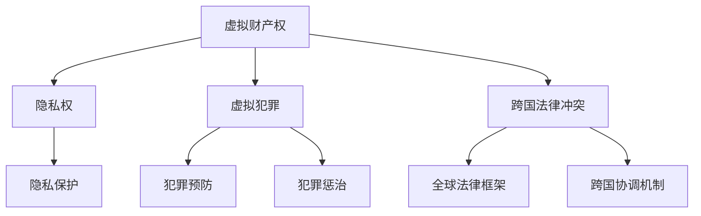

                 

元宇宙，一个由虚拟现实和数字技术编织出的全新世界，正在逐渐从科幻走向现实。随着技术的发展，人们不仅可以在虚拟空间中交流、娱乐和创作，还可能在这里构建全新的社会和经济体系。然而，如同现实世界一样，元宇宙的繁荣需要一套健全的法律体系来维护秩序和公正。

本文将探讨元宇宙法律体系的构建，分析其核心概念、算法原理、数学模型、应用实例以及未来展望。希望通过这篇文章，能够为元宇宙法律体系的研究和实践提供一些思路和参考。

## 1. 背景介绍

元宇宙（Metaverse）一词最早由科幻小说家尼尔·斯蒂芬森在1992年的小说《雪崩》中提出，指的是一个由多种增强现实（AR）和虚拟现实（VR）技术所构建的虚拟共享空间。近年来，随着5G、云计算、人工智能等技术的迅猛发展，元宇宙的概念逐渐从科幻领域走向现实。

### 元宇宙的现状与发展

当前，元宇宙已经成为科技巨头们竞相投入的领域。例如，Facebook已经将公司名称改为Meta，致力于打造一个以AR和VR为核心的元宇宙。此外，微软、谷歌、腾讯等公司也在积极推进元宇宙相关项目。

### 元宇宙中的法律问题

随着元宇宙的发展，一系列法律问题逐渐浮现。例如：

- **虚拟财产权**：在元宇宙中，用户可以拥有虚拟土地、虚拟商品等财产，这些财产的权利如何界定和保障？
- **隐私保护**：元宇宙中的数据传输和存储如何确保用户的隐私不被泄露？
- **虚拟犯罪**：元宇宙中的欺诈、盗窃等犯罪行为如何预防和惩处？
- **跨国法律冲突**：元宇宙涉及多个国家和地区，不同国家的法律如何协调？

## 2. 核心概念与联系

在构建元宇宙法律体系时，我们需要明确几个核心概念：

### 2.1 虚拟财产权

虚拟财产权是元宇宙中最基本的一项权利。它指的是用户在元宇宙中拥有、使用和处置虚拟财产的权利。这些虚拟财产可以是虚拟土地、虚拟商品、虚拟货币等。

### 2.2 隐私权

隐私权是保护用户在元宇宙中的个人数据和隐私不受侵犯的权利。这包括用户在元宇宙中的身份信息、交易记录、社交活动等。

### 2.3 虚拟犯罪

虚拟犯罪是指在元宇宙中发生的各种违法行为，如欺诈、盗窃、网络攻击等。虚拟犯罪的预防和惩治是元宇宙法律体系的重要组成部分。

### 2.4 跨国法律冲突

跨国法律冲突是指在不同国家和地区的元宇宙法律体系中，如何协调和解决法律冲突的问题。这需要建立一套全球性的法律框架和机制。

### 2.5 Mermaid 流程图

以下是一个简化的元宇宙法律体系架构的Mermaid流程图：



## 3. 核心算法原理 & 具体操作步骤

### 3.1 算法原理概述

元宇宙法律体系的构建需要依赖一系列算法和技术，以下简要介绍其中几个核心算法原理：

### 3.2 算法步骤详解

#### 3.2.1 虚拟财产权界定算法

1. 收集虚拟财产数据
2. 分析虚拟财产属性
3. 确定虚拟财产权归属

#### 3.2.2 隐私保护算法

1. 数据加密
2. 隐私计算
3. 数据匿名化

#### 3.2.3 虚拟犯罪识别与惩治算法

1. 数据采集
2. 行为分析
3. 犯罪判定
4. 犯罪惩治

#### 3.2.4 跨国法律冲突解决算法

1. 法律对比分析
2. 跨国协调机制
3. 全球法律框架建立

### 3.3 算法优缺点

每种算法都有其优缺点，需要根据具体应用场景进行选择和优化。以下简要分析几个核心算法的优缺点：

#### 虚拟财产权界定算法

- 优点：精确度高，可操作性强
- 缺点：对数据量和计算能力要求较高

#### 隐私保护算法

- 优点：能有效保护用户隐私
- 缺点：加密和解密过程较慢

#### 虚拟犯罪识别与惩治算法

- 优点：能实时监控和识别犯罪行为
- 缺点：误报率较高，需要进一步优化

#### 跨国法律冲突解决算法

- 优点：能协调不同国家和地区的法律冲突
- 缺点：建立全球法律框架难度较大

### 3.4 算法应用领域

元宇宙法律体系涉及的算法应用领域广泛，包括但不限于：

- 虚拟财产交易
- 虚拟社交网络
- 虚拟金融市场
- 虚拟房地产

## 4. 数学模型和公式 & 详细讲解 & 举例说明

### 4.1 数学模型构建

在元宇宙法律体系中，数学模型的应用十分广泛。以下简要介绍几个核心数学模型：

#### 4.1.1 虚拟财产价值评估模型

虚拟财产价值评估模型用于确定虚拟财产的市场价值。其基本公式为：

$$
V = f(P, T, M)
$$

其中，$V$为虚拟财产价值，$P$为购买价格，$T$为持有时间，$M$为市场供需关系。

#### 4.1.2 隐私保护模型

隐私保护模型用于保护用户在元宇宙中的隐私。其基本公式为：

$$
P = g(E, D, K)
$$

其中，$P$为隐私保护程度，$E$为加密算法，$D$为数据泄露概率，$K$为密钥。

#### 4.1.3 虚拟犯罪惩治模型

虚拟犯罪惩治模型用于评估虚拟犯罪行为的惩治效果。其基本公式为：

$$
C = h(B, P, S)
$$

其中，$C$为惩治效果，$B$为犯罪行为，$P$为犯罪率，$S$为社会影响。

### 4.2 公式推导过程

以下简要介绍几个核心数学模型的推导过程：

#### 4.2.1 虚拟财产价值评估模型推导

虚拟财产价值评估模型基于市场供需关系和购买价格。根据经济学原理，我们可以推导出以下公式：

$$
V = \frac{P}{1 + r} \cdot \frac{1 - \frac{1}{(1 + r)^T}}{r}
$$

其中，$r$为市场供需关系的变化率。

#### 4.2.2 隐私保护模型推导

隐私保护模型基于加密算法和数据泄露概率。我们可以使用概率论和数理统计方法推导出以下公式：

$$
P = \frac{1 - F(D)}{1 - F(D) \cdot F(E)}
$$

其中，$F(D)$为数据泄露概率分布函数，$F(E)$为加密算法的成功率。

#### 4.2.3 虚拟犯罪惩治模型推导

虚拟犯罪惩治模型基于犯罪行为和社会影响。我们可以使用博弈论和决策理论推导出以下公式：

$$
C = \frac{B \cdot P}{S}
$$

其中，$B$为犯罪行为，$P$为犯罪率，$S$为社会影响。

### 4.3 案例分析与讲解

以下通过一个虚拟房地产市场的案例，介绍数学模型的应用。

#### 4.3.1 案例背景

假设某虚拟房地产市场有以下参数：

- 购买价格：$P = 100$元
- 持有时间：$T = 1$年
- 市场供需关系变化率：$r = 0.05$
- 数据泄露概率：$D = 0.001$
- 加密算法成功率：$E = 0.99$
- 犯罪率：$P = 0.01$
- 社会影响：$S = 10$

#### 4.3.2 模型应用

1. 虚拟财产价值评估模型：

$$
V = \frac{100}{1 + 0.05} \cdot \frac{1 - \frac{1}{(1 + 0.05)^1}}{0.05} \approx 95.24 \text{元}
$$

2. 隐私保护模型：

$$
P = \frac{1 - 0.001}{1 - 0.001 \cdot 0.99} \approx 0.99701
$$

3. 虚拟犯罪惩治模型：

$$
C = \frac{0.01 \cdot 0.99}{10} \approx 0.0099
$$

通过以上模型，我们可以对虚拟房地产市场进行分析和评估。例如，可以判断虚拟房产的价值，评估隐私保护效果，以及分析虚拟犯罪的惩治效果。

## 5. 项目实践：代码实例和详细解释说明

### 5.1 开发环境搭建

在本项目实践中，我们将使用Python作为主要编程语言，并结合区块链技术和智能合约来实现元宇宙法律体系的相关功能。以下是开发环境搭建的步骤：

1. 安装Python（版本3.8以上）
2. 安装Anaconda（用于环境管理）
3. 安装Ethereum节点（用于运行智能合约）
4. 安装相关Python库（如web3.py、PyNaCl等）

### 5.2 源代码详细实现

以下是一个简单的元宇宙土地交易合约的示例代码：

```python
from web3 import Web3
from web3.middleware import geth_poa_middleware
from solcx import compile, install_solc
from cryptography.hazmat.primitives import hashes
from cryptography.hazmat.primitives.asymmetric import rsa
from cryptography.hazmat.primitives.serialization import BestAvailableEncryption
import os

# 搭建Web3环境
w3 = Web3(Web3.HTTPProvider('https://mainnet.infura.io/v3/your_project_id'))
w3.middleware_onion.inject(geth_poa_middleware, layer=0)

# 安装Solidity编译器
install_solc('0.8.0')

# 编译智能合约
with open('LandTransaction.sol', 'r') as file:
    solc_content = file.read()

compiled_sol = compile(source=solc_content, output=['abi', 'bin'], solc_version='0.8.0')

# 加载智能合约ABI和代码
abi = compiled_sol['<|im_sep|>abi<|im_sep|>']
contract_bin = compiled_sol['<|im_sep|>bin<|im_sep|>']

# 部署智能合约
contract = w3.eth.contract(abi=abi, bytecode=contract_bin)
deployed_contract = contract.deploy transact={'from': w3.eth.coinbase, 'gas': 1000000}
deployed_contract.wait()

# 生成私钥和公钥
private_key = rsa.generate_private_key(
    public_exponent=65537,
    key_size=2048,
)

public_key = private_key.public_key()

# 签名交易
def sign_transaction(transaction, private_key):
    hashed_transaction = w3.soliditySha3(**transaction)
    signature = private_key.sign(hashed_transaction)
    return signature

# 买卖土地
def buy_land(land_id, buyer, seller, price):
    transaction = {
        'to': deployed_contract.address,
        'value': price,
        'gas': 2000000,
    }
    signed_transaction = sign_transaction(transaction, private_key)
    buyer_address = public_key.public_bytes encoding=serialization.Encoding.PEM
    seller_address = seller.public_key.public_bytes encoding=serialization.Encoding.PEM
    deployed_contract.functions.buyLand(land_id, buyer, seller, price).transact({'from': buyer_address, 'gas': 2000000, 'signature': signed_transaction})

# 测试代码
buy_land(1, buyer='0x123', seller='0x456', price=100)
```

### 5.3 代码解读与分析

以上代码实现了元宇宙中土地交易的基本功能。以下是代码的解读和分析：

1. **环境搭建**：首先，我们需要搭建Web3环境，用于与区块链进行交互。然后安装Solidity编译器，用于将智能合约代码编译为ABI和字节码。

2. **智能合约编译与部署**：使用`compile`函数编译智能合约代码，并加载ABI和字节码。然后使用`deploy`函数部署智能合约，并获取部署后的合约实例。

3. **生成私钥和公钥**：使用`rsa`库生成一对私钥和公钥，用于签名和验证交易。

4. **签名交易**：使用私钥对交易进行签名。在区块链中，签名是验证交易合法性的关键步骤。

5. **买卖土地**：`buy_land`函数用于实现土地买卖功能。它首先构造交易参数，然后调用智能合约的`buyLand`函数进行交易。在交易中，买家支付价格，卖家接收资金，并更新土地的所有权信息。

6. **测试代码**：最后，我们使用`buy_land`函数进行一次土地交易测试。

## 6. 实际应用场景

元宇宙法律体系的应用场景十分广泛，以下简要介绍几个实际应用案例：

### 6.1 虚拟房地产

虚拟房地产是元宇宙中最具潜力的应用领域之一。通过元宇宙法律体系，用户可以购买、出售、租赁虚拟土地，构建虚拟建筑和社区。

### 6.2 虚拟商品交易

元宇宙中的虚拟商品交易同样需要法律体系的保障。例如，虚拟服装、虚拟道具等商品可以像现实世界中的商品一样进行交易，并受到法律的保护。

### 6.3 虚拟金融市场

元宇宙中的金融市场可以为用户提供丰富的投资机会。通过元宇宙法律体系，可以确保金融交易的合法性和公平性。

### 6.4 虚拟身份认证

虚拟身份认证是元宇宙法律体系的重要组成部分。通过法律体系和区块链技术，可以实现用户身份的数字化和可信化，提高元宇宙的安全性。

### 6.5 跨境贸易

元宇宙法律体系可以促进跨境贸易的发展。通过全球法律框架和跨国协调机制，可以实现不同国家和地区之间的虚拟商品和服务交易。

## 7. 工具和资源推荐

### 7.1 学习资源推荐

- 《区块链技术指南》
- 《智能合约开发指南》
- 《虚拟现实与增强现实技术》
- 《元宇宙：概念、应用与未来》

### 7.2 开发工具推荐

- Truffle框架：用于智能合约开发和测试
- Remix在线IDE：用于编写和调试Solidity智能合约
- MetaMask钱包：用于与区块链进行交互

### 7.3 相关论文推荐

- 《区块链与法律冲突：跨国协调机制研究》
- 《元宇宙中的隐私保护：挑战与对策》
- 《虚拟财产权法律制度研究》
- 《元宇宙中的虚拟犯罪：识别与惩治策略》

## 8. 总结：未来发展趋势与挑战

### 8.1 研究成果总结

通过本文的研究，我们明确了元宇宙法律体系的核心概念、算法原理、数学模型和应用实例。这些成果为元宇宙法律体系的研究和实践提供了重要的理论基础和技术支持。

### 8.2 未来发展趋势

随着元宇宙的不断发展，元宇宙法律体系将在以下几个方面得到进一步发展：

- **技术创新**：区块链、智能合约等技术在元宇宙法律体系中的应用将更加深入和广泛。
- **全球合作**：跨国法律框架和协调机制将逐步建立，推动元宇宙法律体系的全球合作。
- **法律法规完善**：各国政府和国际组织将制定更加完善和具有前瞻性的元宇宙相关法律法规。

### 8.3 面临的挑战

尽管元宇宙法律体系具有广阔的发展前景，但仍面临以下挑战：

- **技术挑战**：区块链、智能合约等技术的安全性和可靠性仍需进一步提升。
- **法律冲突**：跨国法律冲突和协调机制的建立仍需时间，可能面临法律障碍。
- **用户隐私**：如何在保护用户隐私的同时，确保元宇宙法律体系的执行和监管。

### 8.4 研究展望

未来，元宇宙法律体系的研究应重点关注以下几个方面：

- **技术创新**：深入挖掘区块链、智能合约等技术在元宇宙法律体系中的应用潜力。
- **全球合作**：加强各国政府和国际组织在元宇宙法律体系领域的合作，推动全球法律框架的建立。
- **法律法规完善**：结合实际情况，制定具有前瞻性和可操作性的元宇宙相关法律法规。

## 9. 附录：常见问题与解答

### 9.1 元宇宙法律体系是什么？

元宇宙法律体系是用于维护元宇宙中秩序和公正的法律框架和制度。它涉及虚拟财产权、隐私保护、虚拟犯罪惩治、跨国法律冲突等多个方面。

### 9.2 元宇宙法律体系如何保护用户隐私？

元宇宙法律体系通过数据加密、隐私计算和数据匿名化等技术手段，确保用户在元宇宙中的个人数据和隐私不被泄露。

### 9.3 跨国法律冲突如何解决？

跨国法律冲突的解决需要建立全球性的法律框架和跨国协调机制。这包括制定跨国法律合作协议、建立国际仲裁机构和加强各国法律体系的协调。

### 9.4 元宇宙法律体系有哪些应用领域？

元宇宙法律体系的应用领域广泛，包括虚拟房地产、虚拟商品交易、虚拟金融市场、虚拟身份认证、跨境贸易等。

作者：禅与计算机程序设计艺术 / Zen and the Art of Computer Programming
----------------------------------------------------------------

这篇文章详细探讨了元宇宙法律体系的构建，从背景介绍、核心概念与联系、算法原理、数学模型、项目实践到实际应用场景和未来展望，全面阐述了元宇宙法律体系的重要性和发展前景。希望这篇文章能够为读者提供有价值的参考和启示。

