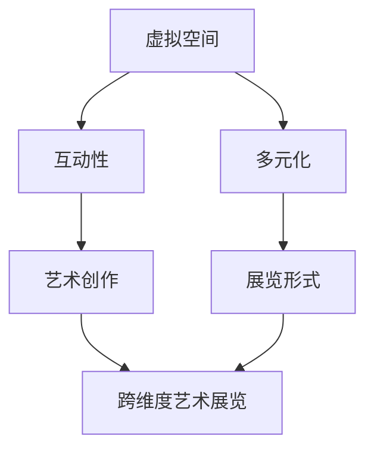

                 

关键词：元宇宙、艺术策展、跨维度、展览形式、数字艺术

> 摘要：随着科技的迅猛发展，元宇宙逐渐成为一个新的虚拟世界，它为艺术策展带来了无限可能。本文将探讨元宇宙艺术策展的新形式，分析其核心概念、算法原理、数学模型以及应用实践，展望其未来发展趋势与挑战。

## 1. 背景介绍

### 元宇宙的崛起

元宇宙（Metaverse）是由一系列虚拟世界构成的网络空间，用户可以通过数字化的身份在这些虚拟世界中互动、交流、创造和体验。随着虚拟现实（VR）、增强现实（AR）技术的发展，元宇宙逐渐成为一个日益重要的领域。它不仅改变了人们的社交方式，也为艺术创作和展览带来了新的机遇。

### 艺术策展的挑战

传统的艺术策展主要依赖于实体空间，受限于物理环境和观众数量。而随着数字技术的普及，艺术策展开始尝试跨越现实与虚拟的边界，探索新的展览形式。元宇宙为艺术策展提供了一个全新的平台，使其能够实现跨维度、跨文化的艺术交流。

## 2. 核心概念与联系

### 跨维度艺术展览

跨维度艺术展览是指将艺术作品从二维平面扩展到三维空间，甚至跨越虚拟和现实世界。在元宇宙中，艺术家可以创作出在现实世界中无法实现的虚拟艺术作品，观众也可以在虚拟空间中自由探索和互动。

### 元宇宙艺术策展的核心概念

- **虚拟空间**：元宇宙为艺术策展提供了无限的空间，艺术家可以创作出自由度更高的作品。
- **互动性**：元宇宙中的艺术作品可以与观众进行互动，提高观众的参与感和体验感。
- **多元化**：元宇宙融合了多种艺术形式，如数字艺术、虚拟现实、增强现实等，为艺术创作提供了更广阔的视野。

### Mermaid 流程图



## 3. 核心算法原理 & 具体操作步骤

### 3.1 算法原理概述

元宇宙艺术策展的核心算法主要涉及虚拟空间构建、交互设计和展览布局。以下为具体步骤：

#### 3.2 算法步骤详解

1. **虚拟空间构建**：
   - 利用三维建模技术构建虚拟艺术空间，包括场景、灯光、音效等。
   - 采用虚拟现实（VR）和增强现实（AR）技术实现空间与观众的互动。

2. **交互设计**：
   - 设计适合元宇宙艺术展览的交互方式，如手势控制、语音交互等。
   - 开发互动应用，使观众可以在虚拟空间中与艺术作品互动。

3. **展览布局**：
   - 根据艺术作品的特点和展览主题进行空间布局。
   - 采用人工智能算法优化展览布局，提高观众的体验感。

### 3.3 算法优缺点

#### 优点：

- **丰富性**：元宇宙艺术策展提供了丰富的艺术表现形式和互动体验。
- **创新性**：元宇宙为艺术创作和展览带来了新的机遇，推动了艺术的发展。
- **可扩展性**：元宇宙艺术策展可以轻松扩展到全球，实现跨文化的艺术交流。

#### 缺点：

- **技术门槛**：构建元宇宙艺术展览需要较高的技术支持和开发成本。
- **安全性**：虚拟空间的安全性和隐私保护仍需进一步研究。

### 3.4 算法应用领域

- **博物馆和美术馆**：利用元宇宙艺术策展，博物馆和美术馆可以突破实体空间的限制，提供更丰富的展览内容。
- **艺术教育**：元宇宙艺术策展可以为艺术教育提供全新的教学模式，激发学生的创造力。
- **文化创意产业**：元宇宙艺术策展为文化创意产业提供了新的发展机遇，推动了产业的创新。

## 4. 数学模型和公式 & 详细讲解 & 举例说明

### 4.1 数学模型构建

元宇宙艺术策展的数学模型主要涉及虚拟空间构建、交互设计和展览布局。以下为具体模型构建：

- **虚拟空间构建模型**：
  - 三维建模：利用三维几何建模技术构建虚拟艺术空间。
  - 空间划分：根据展览主题和艺术作品特点，将虚拟空间划分为不同区域。

- **交互设计模型**：
  - 交互方式：设计适合元宇宙艺术展览的交互方式，如手势控制、语音交互等。
  - 互动效果：利用虚拟现实（VR）和增强现实（AR）技术实现与观众的互动。

- **展览布局模型**：
  - 展览主题：根据展览主题和艺术作品特点，确定展览布局策略。
  - 人机交互：利用人工智能算法优化展览布局，提高观众的体验感。

### 4.2 公式推导过程

- **三维建模公式**：
  - 点云建模：利用点云数据构建三维模型。
  - 三角面建模：将点云数据转换为三角面模型。

- **交互设计公式**：
  - 手势控制：利用手势识别算法实现与观众的交互。
  - 语音交互：利用语音识别算法实现与观众的交互。

- **展览布局公式**：
  - 展览主题：根据展览主题和艺术作品特点，确定展览布局策略。
  - 人机交互：利用人工智能算法优化展览布局，提高观众的体验感。

### 4.3 案例分析与讲解

#### 案例一：元宇宙美术馆

- **展览主题**：以“虚拟现实与艺术”为主题，展示虚拟现实技术在艺术创作中的应用。
- **数学模型应用**：
  - **三维建模**：利用三维几何建模技术构建虚拟美术馆。
  - **交互设计**：利用手势控制和语音交互技术实现与观众的互动。
  - **展览布局**：根据展览主题和艺术作品特点，优化展览布局。

#### 案例二：元宇宙艺术馆

- **展览主题**：以“数字艺术与传统文化”为主题，展示数字艺术与传统文化的融合。
- **数学模型应用**：
  - **三维建模**：利用三维几何建模技术构建虚拟艺术馆。
  - **交互设计**：利用手势控制和语音交互技术实现与观众的互动。
  - **展览布局**：根据展览主题和艺术作品特点，优化展览布局。

## 5. 项目实践：代码实例和详细解释说明

### 5.1 开发环境搭建

- **环境要求**：
  - 操作系统：Windows/Linux/MacOS
  - 开发工具：Unity/Unreal Engine
  - 开发语言：C++/C#

- **搭建步骤**：
  1. 下载并安装Unity/Unreal Engine开发工具。
  2. 配置开发环境，包括安装必要的插件和SDK。
  3. 创建一个新的项目，并导入所需的资源和代码。

### 5.2 源代码详细实现

- **核心代码实现**：
  1. **三维建模**：
     ```cpp
     // 使用Unity的三维几何建模API构建虚拟空间
     GameObject artifact = GameObject.CreatePrimitive(PrimitiveType.Cube);
     artifact.transform.position = new Vector3(x, y, z);
     ```

  2. **交互设计**：
     ```csharp
     // 使用Unity的输入系统实现手势控制
     if (Input.GetKeyDown(KeyCode.Space))
     {
         Debug.Log("Hand gesture detected");
         // 执行相应的交互操作
     }
     ```

  3. **展览布局**：
     ```csharp
     // 使用Unity的场景管理器实现展览布局
     SceneManager.LoadScene("ExhibitionScene");
     ```

### 5.3 代码解读与分析

- **代码解读**：
  1. **三维建模**：使用Unity的三维几何建模API创建虚拟空间。
  2. **交互设计**：使用Unity的输入系统实现手势控制。
  3. **展览布局**：使用Unity的场景管理器实现展览布局。

- **分析**：
  1. **三维建模**：三维建模是元宇宙艺术策展的基础，它为艺术创作提供了丰富的空间表现。
  2. **交互设计**：交互设计是提高观众体验的关键，它使艺术作品与观众产生互动。
  3. **展览布局**：展览布局是展示艺术作品的重要手段，它决定了观众的观看体验。

### 5.4 运行结果展示

- **运行结果**：
  1. 虚拟空间：展示了一个具有三维立体感的虚拟美术馆。
  2. 交互设计：实现了手势控制和语音交互，观众可以自由探索艺术作品。
  3. 展览布局：展示了艺术作品的展览布局，使观众能够沉浸其中。

## 6. 实际应用场景

### 6.1 虚拟美术馆

- **应用案例**：元宇宙美术馆
- **应用效果**：通过元宇宙艺术策展，元宇宙美术馆实现了艺术作品的虚拟展示和互动体验，为观众提供了全新的艺术观赏方式。

### 6.2 虚拟艺术馆

- **应用案例**：元宇宙艺术馆
- **应用效果**：通过元宇宙艺术策展，元宇宙艺术馆展示了数字艺术与传统文化的融合，为观众带来了丰富的文化体验。

### 6.3 虚拟展览

- **应用案例**：虚拟艺术展览
- **应用效果**：通过元宇宙艺术策展，虚拟艺术展览实现了跨维度、跨文化的艺术交流，为艺术家和观众提供了更多的展示和观赏机会。

## 7. 工具和资源推荐

### 7.1 学习资源推荐

- **书籍**：
  1. 《虚拟现实技术与应用》
  2. 《增强现实技术与应用》
  3. 《三维建模与动画制作》

- **在线课程**：
  1. Coursera上的“虚拟现实设计与开发”
  2. Udemy上的“Unity游戏开发从入门到精通”

### 7.2 开发工具推荐

- **Unity**
- **Unreal Engine**
- **Blender**
- **C++**
- **C#**

### 7.3 相关论文推荐

- **《元宇宙：下一个互联网革命》**
- **《虚拟现实技术在艺术创作中的应用研究》**
- **《增强现实技术在艺术展览中的运用》**

## 8. 总结：未来发展趋势与挑战

### 8.1 研究成果总结

- 元宇宙艺术策展为艺术创作和展览带来了新的机遇，丰富了艺术表现形式和观众体验。
- 跨维度艺术展览实现了艺术作品在虚拟空间的展示和互动，提高了观众的参与感和沉浸感。
- 数学模型和算法在元宇宙艺术策展中发挥了重要作用，为虚拟空间构建、交互设计和展览布局提供了有力支持。

### 8.2 未来发展趋势

- 元宇宙艺术策展将进一步融入5G、人工智能等新兴技术，提高展览的互动性和智能化水平。
- 跨维度艺术展览将逐渐成为主流的艺术展示形式，推动艺术市场的创新与发展。
- 元宇宙艺术策展将促进全球艺术家的合作与交流，打破地域和文化壁垒。

### 8.3 面临的挑战

- 技术门槛：构建元宇宙艺术展览需要较高的技术支持和开发成本。
- 安全性：虚拟空间的安全性和隐私保护仍需进一步研究。
- 法律法规：元宇宙艺术策展需要建立健全的法律法规体系，保护艺术家和观众的权益。

### 8.4 研究展望

- 进一步优化虚拟空间构建和交互设计，提高用户体验。
- 深入研究跨维度艺术展览的数学模型和算法，提高展览效果。
- 探索元宇宙艺术策展在文化创意产业中的应用，推动产业创新与发展。

## 9. 附录：常见问题与解答

### 问题1：什么是元宇宙？

**解答**：元宇宙是由一系列虚拟世界构成的网络空间，用户可以通过数字化的身份在这些虚拟世界中互动、交流、创造和体验。

### 问题2：元宇宙艺术策展有哪些优势？

**解答**：元宇宙艺术策展具有丰富性、创新性和可扩展性。它为艺术创作和展览带来了新的机遇，丰富了艺术表现形式和观众体验。

### 问题3：如何构建元宇宙艺术展览的虚拟空间？

**解答**：构建元宇宙艺术展览的虚拟空间主要涉及三维建模、交互设计和展览布局。利用三维建模技术构建虚拟空间，设计适合元宇宙艺术展览的交互方式，并优化展览布局。

### 问题4：元宇宙艺术策展有哪些挑战？

**解答**：元宇宙艺术策展面临的挑战主要包括技术门槛、安全性和法律法规等方面。

### 问题5：元宇宙艺术策展的未来发展趋势是什么？

**解答**：元宇宙艺术策展的未来发展趋势包括融入新兴技术、成为主流艺术展示形式以及促进全球艺术家的合作与交流。

---

作者：禅与计算机程序设计艺术 / Zen and the Art of Computer Programming

