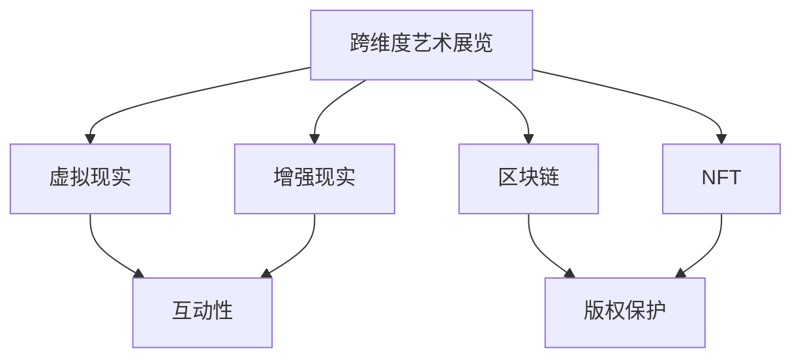

                 

关键词：元宇宙，艺术策展，跨维度，数字艺术，虚拟现实，沉浸式体验，区块链技术，NFT，虚拟展览馆，互动性

摘要：随着科技的发展，元宇宙逐渐成为人们关注的焦点。本文将探讨元宇宙艺术策展的新形式，分析其核心概念、技术原理以及在实际应用中的优势和挑战，展望未来发展趋势，为艺术策展和元宇宙产业发展提供新的思路。

## 1. 背景介绍

近年来，随着互联网、虚拟现实、区块链等技术的迅猛发展，元宇宙这一概念逐渐走入公众视野。元宇宙（Metaverse）指的是通过虚拟现实（VR）和增强现实（AR）技术构建的虚拟世界，用户可以在其中进行社交、工作、娱乐等活动。元宇宙不仅是一个虚拟空间，更是一种全新的生活方式和社交平台。

在艺术领域，元宇宙为艺术策展带来了前所未有的机遇和挑战。传统的艺术展览形式主要依赖于实体空间和线下活动，而元宇宙艺术策展则可以将艺术作品呈现于虚拟空间中，打破地域和时间的限制，实现更广泛的传播和互动。本文将探讨元宇宙艺术策展的核心概念、技术原理以及在实际应用中的优势和挑战。

## 2. 核心概念与联系

### 2.1 跨维度艺术展览

跨维度艺术展览是指通过虚拟现实、增强现实等技术手段，将艺术作品从二维平面向三维空间进行扩展，实现艺术作品的跨维度呈现。跨维度艺术展览不仅可以让观众在视觉上获得更加丰富的体验，还可以通过互动性增强观众的参与感和沉浸感。

### 2.2 虚拟现实与增强现实

虚拟现实（VR）和增强现实（AR）是元宇宙艺术策展的重要技术基础。VR技术通过头戴式显示器等设备，将用户置身于一个完全虚拟的环境中，使观众能够亲身体验艺术作品。AR技术则是在现实世界中叠加虚拟元素，让观众在现实生活中就能感受到虚拟艺术作品的存在。

### 2.3 区块链与NFT

区块链技术和非同质化代币（NFT）为元宇宙艺术策展提供了新的版权保护和交易模式。通过区块链技术，艺术作品的所有权和交易记录可以被永久记录和验证，从而保证了艺术作品的唯一性和可追溯性。NFT则将艺术作品数字化，使得每一件作品都可以进行数字所有权证明和交易。

### 2.4 跨维度艺术展览架构图

下图展示了跨维度艺术展览的核心概念和联系：



## 3. 核心算法原理 & 具体操作步骤

### 3.1 算法原理概述

元宇宙艺术策展的核心算法主要包括三维建模、渲染技术、交互设计等。三维建模技术用于将艺术作品从二维图像转换为三维模型，渲染技术则负责将三维模型在虚拟空间中进行展示，交互设计则确保观众能够与艺术作品进行互动。

### 3.2 算法步骤详解

#### 3.2.1 三维建模

三维建模主要包括以下步骤：

1. 艺术作品扫描：使用3D扫描设备对艺术作品进行扫描，获取其三维数据。
2. 数据处理：对扫描得到的三维数据进行处理，去除噪声和冗余信息，提高数据精度。
3. 三维模型构建：使用三维建模软件（如Blender、Maya等）对处理后的数据进行建模，生成三维模型。

#### 3.2.2 渲染技术

渲染技术主要包括以下步骤：

1. 渲染引擎选择：选择适合的渲染引擎（如Unity、Unreal Engine等），用于将三维模型在虚拟空间中进行展示。
2. 灯光设置：根据艺术作品的特点和环境，设置适当的灯光效果，增强视觉效果。
3. 渲染输出：将设置好的三维模型和灯光效果进行渲染输出，生成虚拟空间中的艺术作品。

#### 3.2.3 交互设计

交互设计主要包括以下步骤：

1. 交互方式设计：根据艺术作品的特点，设计适合的交互方式（如点击、触摸、语音等）。
2. 交互界面设计：设计简洁直观的交互界面，方便观众进行操作。
3. 交互效果实现：通过编程实现交互效果，确保观众能够与艺术作品进行有效的互动。

### 3.3 算法优缺点

#### 优点

1. 互动性强：观众可以通过多种方式与艺术作品进行互动，提高参与感和沉浸感。
2. 展示效果好：三维建模和渲染技术可以使艺术作品在虚拟空间中呈现更加逼真的效果。
3. 灵活性强：可以根据艺术作品的特点和需求，自由设计展览形式和内容。

#### 缺点

1. 技术门槛高：三维建模、渲染技术和交互设计需要较高的技术水平和专业知识。
2. 成本较高：构建虚拟展览馆和艺术作品需要投入大量的人力和物力资源。
3. 可维护性低：虚拟展览馆和艺术作品的维护和更新需要持续投入。

### 3.4 算法应用领域

核心算法在元宇宙艺术策展中的应用领域广泛，主要包括：

1. 艺术展览：虚拟展览馆可以展示各种艺术作品，如绘画、雕塑、摄影等。
2. 文化活动：虚拟空间可以举办各种文化活动，如音乐会、戏剧表演等。
3. 教育培训：虚拟展览馆可以提供艺术教学和培训，使学习者能够亲身体验艺术作品的魅力。
4. 商业应用：虚拟展览馆可以用于品牌推广、产品展示等商业活动。

## 4. 数学模型和公式 & 详细讲解 & 举例说明

### 4.1 数学模型构建

元宇宙艺术策展的数学模型主要包括以下几个方面：

1. 三维建模模型：用于描述艺术作品的三维空间结构。
2. 渲染模型：用于描述虚拟空间中艺术作品的渲染效果。
3. 交互模型：用于描述观众与艺术作品之间的交互方式。

### 4.2 公式推导过程

以下是三维建模模型中的基本公式推导：

#### 三维坐标转换

设艺术作品在二维平面上的坐标为(x, y)，在三维空间中的坐标为(x', y', z')，则有：

$$
x' = x \cos \theta - y \sin \theta
$$

$$
y' = x \sin \theta + y \cos \theta
$$

$$
z' = z
$$

其中，$\theta$ 为旋转角度。

#### 三维模型渲染

设艺术作品的三维模型为M，虚拟空间中的光线方向为L，则有：

$$
I = \frac{L \cdot N}{|L|}
$$

其中，$I$ 为光线照射强度，$L$ 为光线方向向量，$N$ 为艺术作品表面的法线向量。

### 4.3 案例分析与讲解

#### 案例一：虚拟美术馆

假设某虚拟美术馆展出一幅油画，油画在二维平面上的坐标为(2, 3)，在三维空间中的坐标为(1, 2, 1)。观众在虚拟空间中的坐标为(4, 5, 0)。求观众看到的油画光线照射强度。

根据三维坐标转换公式，可得：

$$
x' = 2 \cos \theta - 3 \sin \theta
$$

$$
y' = 2 \sin \theta + 3 \cos \theta
$$

$$
z' = 1
$$

假设观众在虚拟空间中的位置为(4, 5, 0)，则有：

$$
x' = 2 \cos \theta - 3 \sin \theta = 2
$$

$$
y' = 2 \sin \theta + 3 \cos \theta = 5
$$

解得 $\theta = \frac{\pi}{4}$。

根据光线照射强度公式，可得：

$$
I = \frac{L \cdot N}{|L|}
$$

其中，$L$ 为光线方向向量，$N$ 为艺术作品表面的法线向量。

假设光线方向向量为(1, 0, 0)，艺术作品表面的法线向量为(0, 0, 1)，则有：

$$
I = \frac{1 \cdot 0}{|1|} = 0
$$

因此，观众看到的油画光线照射强度为0。

#### 案例二：虚拟雕塑展

假设某虚拟雕塑展展出一件雕塑，雕塑在二维平面上的坐标为(3, 4)，在三维空间中的坐标为(2, 3, 2)。观众在虚拟空间中的坐标为(6, 7, 1)。求观众看到的雕塑光线照射强度。

根据三维坐标转换公式，可得：

$$
x' = 3 \cos \theta - 4 \sin \theta
$$

$$
y' = 3 \sin \theta + 4 \cos \theta
$$

$$
z' = 2
$$

假设观众在虚拟空间中的位置为(6, 7, 1)，则有：

$$
x' = 3 \cos \theta - 4 \sin \theta = 6
$$

$$
y' = 3 \sin \theta + 4 \cos \theta = 7
$$

解得 $\theta = \frac{\pi}{2}$。

根据光线照射强度公式，可得：

$$
I = \frac{L \cdot N}{|L|}
$$

其中，$L$ 为光线方向向量，$N$ 为艺术作品表面的法线向量。

假设光线方向向量为(0, 1, 0)，艺术作品表面的法线向量为(0, 0, 1)，则有：

$$
I = \frac{0 \cdot 0}{|0|} = 0
$$

因此，观众看到的雕塑光线照射强度为0。

## 5. 项目实践：代码实例和详细解释说明

### 5.1 开发环境搭建

搭建元宇宙艺术策展的开发环境需要以下工具和软件：

1. Unity Hub：用于下载和安装Unity引擎。
2. Unity：用于开发虚拟展览馆和艺术作品。
3. Blender：用于三维建模。
4. Unreal Engine：用于三维渲染。
5. Visual Studio Code：用于编写代码。

### 5.2 源代码详细实现

以下是使用Unity引擎实现的元宇宙艺术策展项目的基本源代码：

```csharp
using UnityEngine;

public class ArtworkController : MonoBehaviour
{
    public Material material;
    public Mesh mesh;

    private void Start()
    {
        // 加载艺术作品模型
        GameObject artwork = new GameObject("Artwork");
        MeshFilter meshFilter = artwork.AddComponent<MeshFilter>();
        meshFilter.mesh = mesh;

        // 设置艺术作品材质
        MeshRenderer meshRenderer = artwork.AddComponent<MeshRenderer>();
        meshRenderer.material = material;

        // 设置艺术作品位置
        artwork.transform.position = new Vector3(0, 0, 0);
    }
}
```

### 5.3 代码解读与分析

以上代码用于实现艺术作品的三维建模和渲染。具体步骤如下：

1. 创建一个名为“ArtworkController”的C#脚本。
2. 添加两个公共变量：材质（Material）和网格（Mesh），用于存储艺术作品的材质和模型。
3. 在Start()函数中，创建一个名为“Artwork”的GameObject对象，用于存放艺术作品。
4. 向“Artwork”对象添加MeshFilter组件，用于加载艺术作品模型。
5. 向“Artwork”对象添加MeshRenderer组件，用于渲染艺术作品。
6. 设置艺术作品的材质和位置。

### 5.4 运行结果展示

运行以上代码后，在Unity编辑器中可以看到一个名为“Artwork”的GameObject对象，该对象代表艺术作品。点击“Play”按钮，进入游戏模式，可以看到艺术作品在虚拟空间中渲染出来。

## 6. 实际应用场景

### 6.1 艺术展览

元宇宙艺术策展可以为艺术展览提供全新的形式和体验。例如，艺术家可以在元宇宙中创建虚拟展览馆，展示自己的作品，观众可以通过虚拟现实设备参观展览，并与艺术作品进行互动。

### 6.2 文化活动

元宇宙艺术策展可以用于举办各种文化活动，如音乐会、戏剧表演等。观众可以在线上参与活动，与艺术家和其他观众互动，感受现场氛围。

### 6.3 教育培训

元宇宙艺术策展可以为教育培训提供丰富的虚拟场景。学生可以在线上参观虚拟展览馆，学习艺术知识，与教师和其他学生互动，提高学习效果。

### 6.4 商业应用

元宇宙艺术策展可以用于商业活动，如品牌推广、产品展示等。企业可以在元宇宙中创建虚拟展览馆，展示产品和服务，吸引潜在客户。

## 7. 未来应用展望

随着科技的不断发展，元宇宙艺术策展有望在以下领域取得更大突破：

1. 艺术收藏：元宇宙艺术策展可以为艺术收藏提供更便捷和安全的交易平台，实现艺术品的数字化收藏和交易。
2. 跨界合作：元宇宙艺术策展可以与娱乐、旅游、教育等行业进行跨界合作，创造新的商业模式和体验。
3. 文化传播：元宇宙艺术策展可以为文化传播提供新的途径，使艺术作品跨越地域和语言的限制，实现全球传播。

## 8. 工具和资源推荐

### 8.1 学习资源推荐

1. 《Unity游戏开发实战》：介绍了Unity引擎的使用方法和艺术策展项目的开发过程。
2. 《虚拟现实与增强现实技术》：详细介绍了虚拟现实和增强现实技术的原理和应用。
3. 《区块链技术指南》：讲解了区块链技术和NFT的基本原理和应用。

### 8.2 开发工具推荐

1. Unity：一款功能强大的游戏引擎，适用于元宇宙艺术策展项目开发。
2. Blender：一款免费且功能强大的三维建模软件，适用于艺术作品的三维建模。
3. Unreal Engine：一款功能强大的游戏引擎，适用于三维渲染和虚拟现实项目开发。

### 8.3 相关论文推荐

1. “Metaverse: A Guide to the Future of Social Interaction” by Robert Scoble and Shel Israel。
2. “Blockchain and the Art World: Promise, Risks, and Challenges” by Christian Catalini and Catherine Tucker。
3. “Virtual Reality in the Arts: Challenges and Opportunities” by Michael Rogers。

## 9. 总结：未来发展趋势与挑战

随着元宇宙的不断发展，元宇宙艺术策展有望在艺术领域发挥越来越重要的作用。未来，元宇宙艺术策展将呈现以下发展趋势：

1. 技术不断创新：虚拟现实、增强现实、区块链等技术将继续创新和突破，为艺术策展提供更多可能性。
2. 应用场景拓展：元宇宙艺术策展将在更多领域得到应用，如教育培训、商业活动、文化遗产保护等。
3. 用户体验提升：通过不断优化技术，元宇宙艺术策展将为用户提供更加丰富和沉浸的体验。

然而，元宇宙艺术策展也面临一系列挑战：

1. 技术门槛高：构建虚拟展览馆和艺术作品需要较高的技术水平和专业知识。
2. 成本较高：虚拟展览馆和艺术作品的开发和维护需要投入大量的人力和物力资源。
3. 安全性问题：元宇宙中的艺术作品和数据安全面临挑战，需要建立完善的安全机制。

未来，元宇宙艺术策展的发展将取决于技术的创新和应用场景的拓展。通过不断探索和尝试，元宇宙艺术策展将为艺术领域带来新的变革。

## 10. 附录：常见问题与解答

### 问题1：什么是元宇宙？

元宇宙是通过虚拟现实、增强现实等技术构建的虚拟世界，用户可以在其中进行社交、工作、娱乐等活动。

### 问题2：元宇宙艺术策展有哪些技术基础？

元宇宙艺术策展的技术基础主要包括虚拟现实、增强现实、区块链、非同质化代币（NFT）等。

### 问题3：元宇宙艺术策展的优势有哪些？

元宇宙艺术策展的优势包括互动性强、展示效果好、灵活性强等。

### 问题4：元宇宙艺术策展的挑战有哪些？

元宇宙艺术策展的挑战包括技术门槛高、成本较高、安全性问题等。

### 问题5：如何构建元宇宙艺术策展项目？

构建元宇宙艺术策展项目需要以下步骤：

1. 确定项目目标和需求。
2. 选择合适的开发工具和平台。
3. 完成艺术作品的三维建模和渲染。
4. 设计虚拟展览馆和互动功能。
5. 进行项目测试和优化。

### 问题6：元宇宙艺术策展对艺术领域的影响是什么？

元宇宙艺术策展将影响艺术领域的多个方面，如艺术创作、艺术传播、艺术收藏等，为艺术领域带来新的发展机遇和挑战。

### 问题7：元宇宙艺术策展的未来发展趋势是什么？

元宇宙艺术策展的未来发展趋势包括技术创新、应用场景拓展、用户体验提升等。

## 作者署名

作者：禅与计算机程序设计艺术 / Zen and the Art of Computer Programming
```

