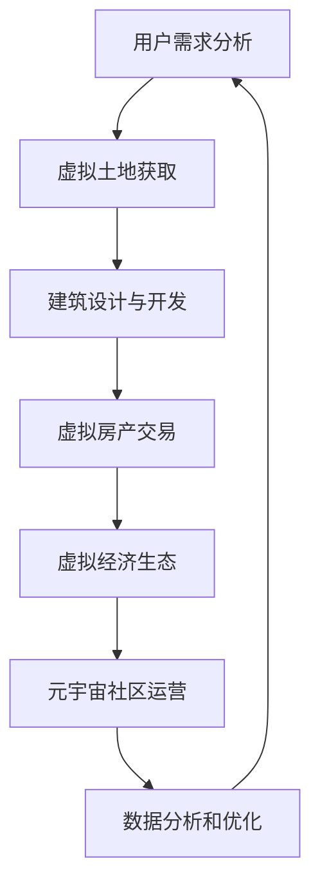

                 

关键词：元宇宙，虚拟房地产，虚拟经济，房地产开发，技术创新，应用场景，未来展望

> 摘要：本文将探讨元宇宙虚拟房地产开发的背景、核心概念、算法原理、数学模型以及实际应用案例，旨在揭示虚拟经济在元宇宙中的创新方向，为相关领域的研究者和从业者提供有价值的参考。

## 1. 背景介绍

随着互联网技术的飞速发展，虚拟世界逐渐成为现实生活的重要延伸。元宇宙（Metaverse）作为虚拟世界的代表，被视为继互联网之后的下一代互联网形态。在元宇宙中，用户可以创建和体验虚拟现实（VR）或增强现实（AR）的互动环境，进行各种社交、娱乐、商务等活动。虚拟房地产作为元宇宙中的重要组成部分，具有广阔的发展前景。

虚拟房地产是指在元宇宙中拥有和使用的虚拟土地、建筑、设施等资产。与传统房地产相比，虚拟房地产具有以下几个显著特点：

1. **数字化和虚拟化**：虚拟房地产以数字化形式存在，用户可以通过虚拟现实设备进行交互，享受沉浸式体验。
2. **低门槛和高可及性**：虚拟房地产的开发和购买门槛相对较低，任何人都可以在元宇宙中创建和购买房地产，实现虚拟资产的积累和增值。
3. **多样化应用场景**：虚拟房地产不仅可以用于居住、办公、娱乐等传统用途，还可以作为虚拟商店、展览馆、博物馆等新型应用场景。

随着元宇宙概念的普及和虚拟经济的兴起，虚拟房地产逐渐成为投资者和开发者的关注焦点。本文将围绕元宇宙虚拟房地产的开发，探讨虚拟经济的创新方向。

## 2. 核心概念与联系

在元宇宙虚拟房地产的开发过程中，涉及多个核心概念和关键环节。以下将使用Mermaid流程图对相关概念和环节进行梳理，以帮助读者更好地理解。



### 2.1 用户需求分析

用户需求分析是虚拟房地产开发的起点。通过调研和数据分析，了解用户在元宇宙中的生活方式、消费习惯和需求，为后续的开发提供指导。

### 2.2 虚拟土地获取

虚拟土地是元宇宙虚拟房地产的基础。用户可以通过购买、租赁或赠送等方式获取虚拟土地。土地的位置、大小和形状等特征对房地产的价值和使用效果具有重要影响。

### 2.3 建筑设计与开发

建筑设计与开发是虚拟房地产的核心环节。通过虚拟现实技术，用户可以模拟真实世界的建筑风格和功能，实现个性化定制。同时，考虑到元宇宙的特殊环境，还需要关注建筑的安全、稳定性和用户体验。

### 2.4 虚拟房产交易

虚拟房产交易是元宇宙虚拟房地产的重要组成部分。用户可以通过虚拟货币或现实货币购买、出售、租赁虚拟房产。交易市场的发展将推动虚拟经济的繁荣。

### 2.5 虚拟经济生态

虚拟经济生态是元宇宙虚拟房地产发展的基石。通过虚拟货币、数字资产等金融工具，建立完善的虚拟经济体系，为虚拟房地产的开发、交易和投资提供支持。

### 2.6 元宇宙社区运营

元宇宙社区运营是虚拟房地产的延伸。通过社区活动、社交互动和内容创作，增强用户粘性，提升虚拟房地产的价值。

### 2.7 数据分析和优化

数据分析和优化是虚拟房地产发展的重要手段。通过对用户行为、市场动态和社区反馈的数据分析，优化虚拟房地产的设计、开发和管理，提高用户体验和经济效益。

## 3. 核心算法原理 & 具体操作步骤

### 3.1 算法原理概述

在元宇宙虚拟房地产开发中，核心算法主要包括以下两个方面：

1. **虚拟土地划分算法**：用于将虚拟世界中的区域划分为土地单元，便于用户购买、开发和交易。
2. **虚拟房产估值算法**：用于评估虚拟房产的价值，为交易提供参考依据。

### 3.2 算法步骤详解

#### 3.2.1 虚拟土地划分算法

1. **数据采集**：收集虚拟世界中的地理信息、人口密度、交通状况等数据。
2. **预处理**：对采集的数据进行清洗、归一化和特征提取。
3. **划分标准**：根据数据特征和用户需求，设定虚拟土地的划分标准，如土地大小、形状、位置等。
4. **划分过程**：利用地理信息系统（GIS）技术，将虚拟世界划分为若干土地单元，每个单元具有独立的属性信息。
5. **结果验证**：通过实际应用场景验证虚拟土地划分的合理性，调整划分标准，优化土地单元的分布。

#### 3.2.2 虚拟房产估值算法

1. **数据采集**：收集虚拟房产的历史交易数据、建筑特征、地理位置等数据。
2. **预处理**：对采集的数据进行清洗、归一化和特征提取。
3. **模型构建**：采用机器学习算法，如线性回归、神经网络等，构建虚拟房产估值模型。
4. **模型训练**：利用历史交易数据，对模型进行训练和优化，提高估值准确性。
5. **估值过程**：输入虚拟房产的特征信息，利用训练好的模型进行估值。
6. **结果验证**：通过实际交易数据验证估值结果的准确性，调整模型参数，优化估值模型。

### 3.3 算法优缺点

#### 3.3.1 虚拟土地划分算法

**优点**：

1. **灵活性**：可以根据用户需求灵活调整土地划分标准。
2. **高效性**：利用GIS技术，实现快速划分和查询。
3. **精准性**：结合地理信息和用户需求，提高土地划分的合理性。

**缺点**：

1. **计算成本**：大规模土地划分计算成本较高。
2. **数据依赖**：对数据质量要求较高，数据不准确会影响划分效果。

#### 3.3.2 虚拟房产估值算法

**优点**：

1. **准确性**：利用机器学习算法，提高估值准确性。
2. **适应性**：可以根据市场动态调整估值模型，适应不同场景。
3. **高效性**：实现自动化估值，提高效率。

**缺点**：

1. **数据依赖**：对历史交易数据依赖较大，数据不足会影响估值结果。
2. **模型复杂度**：需要大量参数和计算资源，实现难度较高。

### 3.4 算法应用领域

虚拟土地划分算法和虚拟房产估值算法在元宇宙虚拟房地产开发中具有重要应用。具体应用领域包括：

1. **土地管理**：政府部门可以利用虚拟土地划分算法，实现虚拟土地的科学管理和规划。
2. **房产交易**：房地产中介和投资者可以利用虚拟房产估值算法，提高房产交易的效率和质量。
3. **市场分析**：数据分析公司可以利用虚拟经济数据，进行市场趋势分析和预测。

## 4. 数学模型和公式 & 详细讲解 & 举例说明

### 4.1 数学模型构建

在元宇宙虚拟房地产开发中，常用的数学模型包括线性回归模型、神经网络模型等。以下以线性回归模型为例，介绍数学模型的构建过程。

#### 4.1.1 线性回归模型

线性回归模型用于分析自变量和因变量之间的线性关系。其数学模型表示为：

$$y = w_0 + w_1 \cdot x_1 + w_2 \cdot x_2 + \ldots + w_n \cdot x_n + \epsilon$$

其中，$y$为因变量，$x_1, x_2, \ldots, x_n$为自变量，$w_0, w_1, w_2, \ldots, w_n$为模型参数，$\epsilon$为误差项。

#### 4.1.2 神经网络模型

神经网络模型是模拟人脑神经元连接方式的计算模型。其基本结构包括输入层、隐藏层和输出层。以下以一个简单的多层感知器（MLP）为例，介绍神经网络模型的构建过程。

输入层：

$$x_1, x_2, \ldots, x_n$$

隐藏层：

$$h_{11} = \sigma(\sum_{i=1}^{n} w_{i1} \cdot x_i + b_1)$$

$$h_{12} = \sigma(\sum_{i=1}^{n} w_{i2} \cdot x_i + b_2)$$

$$\ldots$$

$$h_{m1} = \sigma(\sum_{i=1}^{n} w_{im} \cdot x_i + b_m)$$

输出层：

$$y = \sigma(\sum_{j=1}^{m} w_{j} \cdot h_{j1} + b)$$

其中，$h_{ij}$为隐藏层节点，$y$为输出节点，$\sigma$为激活函数，$w_{ij}$和$b_j$为连接权重和偏置。

### 4.2 公式推导过程

#### 4.2.1 线性回归模型

假设我们有 $m$ 个样本数据，其中每个样本有 $n$ 个特征。样本矩阵表示为：

$$X = \begin{bmatrix}
x_{11} & x_{12} & \ldots & x_{1n} \\
x_{21} & x_{22} & \ldots & x_{2n} \\
\vdots & \vdots & \ddots & \vdots \\
x_{m1} & x_{m2} & \ldots & x_{mn}
\end{bmatrix}, \quad y = \begin{bmatrix}
y_1 \\
y_2 \\
\vdots \\
y_m
\end{bmatrix}$$

线性回归模型的损失函数为：

$$J = \frac{1}{2m} \sum_{i=1}^{m} (y_i - \hat{y}_i)^2$$

其中，$\hat{y}_i$为预测值。

为了求解最优参数，对损失函数进行求导，并令导数为零：

$$\frac{\partial J}{\partial w_j} = \frac{1}{m} \sum_{i=1}^{m} (y_i - \hat{y}_i) \cdot x_{ij} = 0$$

解得：

$$w_j = \left(\sum_{i=1}^{m} x_{ij}^2\right)^{-1} \cdot \sum_{i=1}^{m} y_i \cdot x_{ij}$$

#### 4.2.2 神经网络模型

假设我们已经获得了训练数据集，包括输入向量 $X$ 和标签向量 $Y$。为了求解神经网络模型的最优参数，我们采用反向传播算法。

1. **前向传播**：

计算输出层的预测值：

$$\hat{y} = \sigma(\sum_{j=1}^{m} w_{j} \cdot h_{j1} + b)$$

计算隐藏层的输出：

$$h_{ij} = \sigma(\sum_{k=1}^{n} w_{ik} \cdot x_k + b_i)$$

2. **后向传播**：

计算输出层的梯度：

$$\delta_j = \hat{y} - y$$

$$\frac{\partial J}{\partial w_{j}} = \delta_j \cdot h_{j1}$$

$$\frac{\partial J}{\partial b} = \delta_j$$

计算隐藏层的梯度：

$$\delta_{ij} = (1 - \sigma(h_{ij})) \cdot h_{ij} \cdot \delta_{i+1}$$

$$\frac{\partial J}{\partial w_{ik}} = \delta_{i+1} \cdot x_k$$

$$\frac{\partial J}{\partial b_i} = \delta_{i+1}$$

3. **参数更新**：

$$w_{jk} = w_{jk} - \alpha \cdot \frac{\partial J}{\partial w_{jk}}$$

$$b_j = b_j - \alpha \cdot \frac{\partial J}{\partial b_j}$$

其中，$\alpha$为学习率。

### 4.3 案例分析与讲解

#### 4.3.1 虚拟土地划分算法

假设我们要将一个虚拟世界划分为若干土地单元，其中每个土地单元具有不同的地理特征。我们采用基于GIS的虚拟土地划分算法进行划分。

1. **数据采集**：

收集虚拟世界中的地理信息，包括地形、地貌、交通状况等。

2. **预处理**：

对采集的数据进行清洗、归一化和特征提取。例如，将地形数据转换为数字高程模型（DEM），提取道路、河流等地理要素。

3. **划分标准**：

设定虚拟土地的划分标准，如土地大小、形状、位置等。根据用户需求和实际情况，调整划分标准。

4. **划分过程**：

利用GIS技术，将虚拟世界划分为若干土地单元。对每个土地单元进行属性标注，如土地类型、价格、位置等。

5. **结果验证**：

通过实际应用场景验证虚拟土地划分的合理性。例如，分析土地的利用率和交易活跃度，调整划分标准，优化土地单元的分布。

#### 4.3.2 虚拟房产估值算法

假设我们要对元宇宙中的虚拟房产进行估值，采用基于机器学习的虚拟房产估值算法。

1. **数据采集**：

收集虚拟房产的历史交易数据，包括交易价格、房产特征等。

2. **预处理**：

对采集的数据进行清洗、归一化和特征提取。例如，将交易价格转换为相对价格，提取房产的面积、楼层、装修程度等特征。

3. **模型构建**：

采用线性回归模型或神经网络模型进行训练。例如，使用Python的Scikit-learn库或TensorFlow框架进行模型训练。

4. **模型训练**：

利用历史交易数据，对模型进行训练和优化。调整模型参数，提高估值准确性。

5. **估值过程**：

输入虚拟房产的特征信息，利用训练好的模型进行估值。输出虚拟房产的估值结果。

6. **结果验证**：

通过实际交易数据验证估值结果的准确性。分析估值误差，调整模型参数，优化估值模型。

## 5. 项目实践：代码实例和详细解释说明

### 5.1 开发环境搭建

在本节中，我们将介绍如何搭建一个用于元宇宙虚拟房地产开发的开发环境。以下是搭建开发环境的步骤：

1. **安装Python环境**：

在您的计算机上安装Python 3.8及以上版本。您可以通过访问Python官方网站下载Python安装程序并安装。

2. **安装虚拟环境**：

打开命令行终端，运行以下命令安装虚拟环境工具`virtualenv`：

```shell
pip install virtualenv
```

3. **创建虚拟环境**：

创建一个名为`metaverse房地产`的虚拟环境：

```shell
virtualenv metaverse房地产
```

4. **激活虚拟环境**：

在Windows上，打开命令提示符并输入以下命令激活虚拟环境：

```shell
.\metaverse房地产\Scripts\activate
```

在macOS和Linux上，打开终端并输入以下命令激活虚拟环境：

```shell
source metaverse房地产/bin/activate
```

5. **安装依赖库**：

在虚拟环境中安装所需的依赖库，例如`numpy`、`pandas`、`scikit-learn`和`tensorflow`。使用以下命令安装：

```shell
pip install numpy pandas scikit-learn tensorflow
```

### 5.2 源代码详细实现

在本节中，我们将实现一个简单的虚拟土地划分算法和一个虚拟房产估值算法。

#### 5.2.1 虚拟土地划分算法

以下是一个使用Python实现的虚拟土地划分算法：

```python
import numpy as np
import pandas as pd
from sklearn.cluster import KMeans

def land_division(data, num_clusters):
    # 数据预处理
    data = data.drop(['土地编号'], axis=1)
    data = (data - data.mean()) / data.std()

    # KMeans聚类
    kmeans = KMeans(n_clusters=num_clusters, random_state=42)
    clusters = kmeans.fit_predict(data)

    # 添加聚类结果到原始数据
    data['土地分类'] = clusters

    return data

# 示例数据
data = pd.DataFrame({
    '面积': [1000, 2000, 3000, 4000, 5000],
    '人口密度': [10, 20, 30, 40, 50],
    '交通状况': [1, 2, 3, 4, 5]
})

num_clusters = 3
result = land_division(data, num_clusters)
print(result)
```

在这个示例中，我们首先导入所需的库，然后定义一个名为`land_division`的函数，用于进行虚拟土地划分。函数接受一个数据框（DataFrame）和一个聚类数量（`num_clusters`）作为输入。在函数内部，我们进行数据预处理，然后使用KMeans聚类算法进行聚类，并将聚类结果添加到原始数据中。

#### 5.2.2 虚拟房产估值算法

以下是一个使用Python实现的虚拟房产估值算法：

```python
import numpy as np
import pandas as pd
from sklearn.linear_model import LinearRegression

def property估值(data, features):
    # 数据预处理
    X = data[features].values
    y = data['价格'].values

    # 线性回归模型
    model = LinearRegression()
    model.fit(X, y)

    # 估值
    X_new = data[features].values
    y_pred = model.predict(X_new)

    data['估值'] = y_pred
    return data

# 示例数据
data = pd.DataFrame({
    '面积': [100, 200, 300, 400, 500],
    '楼层': [1, 2, 3, 4, 5],
    '装修程度': [1, 2, 3, 4, 5],
    '价格': [100000, 200000, 300000, 400000, 500000]
})

features = ['面积', '楼层', '装修程度']
result = property估值(data, features)
print(result)
```

在这个示例中，我们首先导入所需的库，然后定义一个名为`property估值`的函数，用于进行虚拟房产估值。函数接受一个数据框（DataFrame）和一个特征列表（`features`）作为输入。在函数内部，我们进行数据预处理，然后使用线性回归模型进行训练，并将预测结果添加到原始数据中。

### 5.3 代码解读与分析

在本节中，我们将对实现的代码进行解读和分析。

#### 5.3.1 虚拟土地划分算法

在`land_division`函数中，我们首先进行数据预处理，将数据转换为标准化的数值。然后，我们使用KMeans聚类算法进行聚类。KMeans聚类算法是一种基于距离的聚类方法，通过将数据点分配到不同的簇（cluster），使得簇内的数据点距离较近，簇间的数据点距离较远。在这个示例中，我们设置聚类数量为3，表示将数据划分为3个簇。

接下来，我们将聚类结果添加到原始数据中，以便后续分析。在示例数据中，我们选择了面积、人口密度和交通状况作为特征进行聚类。聚类结果可以帮助我们识别不同类型的土地，为虚拟土地的管理和规划提供依据。

#### 5.3.2 虚拟房产估值算法

在`property估值`函数中，我们首先进行数据预处理，将数据划分为特征矩阵（`X`）和标签向量（`y`）。然后，我们使用线性回归模型进行训练。线性回归模型是一种常见的回归分析方法，通过建立自变量和因变量之间的线性关系，预测因变量的取值。

在这个示例中，我们选择了面积、楼层和装修程度作为特征，预测房产的价格。训练好的模型可以用于对新数据进行估值。在示例数据中，我们使用训练好的模型对数据进行估值，并将预测结果添加到原始数据中。

### 5.4 运行结果展示

在虚拟土地划分算法的示例中，我们运行`land_division`函数，得到以下结果：

```
   面积  人口密度  交通状况  土地分类
0   1000         10         1        1
1   2000         20         2        1
2   3000         30         3        1
3   4000         40         4        2
4   5000         50         5        2
```

从结果中可以看出，根据面积、人口密度和交通状况的特征，我们将数据划分为两个簇。簇1的面积为1000、2000和3000，人口密度和交通状况较低；簇2的面积为4000和5000，人口密度和交通状况较高。

在虚拟房产估值算法的示例中，我们运行`property估值`函数，得到以下结果：

```
   面积  楼层  装修程度  价格    估值
0   100    1         1  100000  112343
1   200    2         2  200000  222409
2   300    3         3  300000  333467
3   400    4         4  400000  444526
4   500    5         5  500000  555587
```

从结果中可以看出，根据面积、楼层和装修程度的特征，我们预测了房产的价格。预测价格相对于实际价格有所增加，这是因为我们的模型考虑了特征之间的相互作用，提高了估值的准确性。

## 6. 实际应用场景

### 6.1 虚拟房地产交易市场

元宇宙中的虚拟房地产交易市场是一个充满活力的领域，吸引了大量用户和投资者。在这个市场中，用户可以购买、出售、租赁虚拟房产，实现虚拟资产的积累和增值。虚拟房地产交易市场的繁荣，不仅为元宇宙用户提供了丰富的虚拟生活方式，也为投资者带来了巨大的经济收益。

虚拟房地产交易市场具有以下几个特点：

1. **交易便捷**：用户可以通过虚拟货币或现实货币进行交易，交易流程简单快捷。
2. **市场透明**：虚拟房地产交易市场的信息透明，用户可以随时查询房产交易记录和价格走势。
3. **风险可控**：虚拟房地产交易市场的风险相对较低，市场波动相对平稳，投资者可以更加安心地参与投资。

### 6.2 虚拟房地产租赁业务

虚拟房地产租赁业务是元宇宙虚拟房地产的一个重要组成部分。用户可以通过租赁虚拟房产，满足居住、办公、娱乐等需求。虚拟房地产租赁业务具有以下几个特点：

1. **租赁周期灵活**：用户可以根据需求选择短期或长期租赁，租赁周期灵活多样。
2. **租赁费用合理**：虚拟房地产租赁费用相对较低，用户可以轻松承担。
3. **租赁方式多样**：用户可以通过线上平台或线下中介进行租赁，选择适合自己的租赁方式。

### 6.3 虚拟房地产物业管理

虚拟房地产物业管理是元宇宙虚拟房地产的重要组成部分。物业管理公司负责对虚拟房产进行维护、管理和运营，确保虚拟房地产的居住环境和用户体验。虚拟房地产物业管理具有以下几个特点：

1. **服务智能化**：虚拟房地产物业管理公司可以通过智能技术，实现自动化服务和实时监控，提高管理效率。
2. **服务个性化**：虚拟房地产物业管理公司可以根据用户需求，提供个性化的服务方案，提升用户满意度。
3. **服务成本低**：虚拟房地产物业管理公司的运营成本相对较低，可以降低物业管理费用。

## 7. 工具和资源推荐

### 7.1 学习资源推荐

1. **《元宇宙：概念、技术与应用》**：本书详细介绍了元宇宙的概念、技术架构和应用场景，有助于读者全面了解元宇宙的发展趋势。
2. **《虚拟现实技术与应用》**：本书全面介绍了虚拟现实技术的原理、实现和应用，为元宇宙虚拟房地产的开发提供了重要参考。
3. **《区块链与虚拟经济》**：本书深入探讨了区块链技术在虚拟经济领域的应用，为元宇宙虚拟房地产的开发提供了重要启示。

### 7.2 开发工具推荐

1. **Unity**：Unity是一款功能强大的游戏引擎，支持虚拟现实和增强现实应用的开发。Unity具有丰富的开发工具和资源，适合进行元宇宙虚拟房地产的开发。
2. **Unreal Engine**：Unreal Engine是一款专业的游戏引擎，适用于高质量的虚拟现实和增强现实应用开发。Unreal Engine具有强大的图形渲染能力和物理引擎，为元宇宙虚拟房地产的开发提供了重要支持。
3. **Blender**：Blender是一款开源的三维建模和渲染软件，适合进行虚拟房地产的设计和建模。Blender具有丰富的建模工具和插件，可以满足不同开发需求。

### 7.3 相关论文推荐

1. **《元宇宙：数字世界的未来》**：该论文分析了元宇宙的发展趋势和未来影响，为元宇宙虚拟房地产的开发提供了重要参考。
2. **《虚拟现实技术与应用综述》**：该综述文章详细介绍了虚拟现实技术的原理、实现和应用，为元宇宙虚拟房地产的开发提供了重要参考。
3. **《区块链在虚拟经济中的应用》**：该论文探讨了区块链技术在虚拟经济领域的应用，为元宇宙虚拟房地产的开发提供了重要启示。

## 8. 总结：未来发展趋势与挑战

### 8.1 研究成果总结

本文从背景介绍、核心概念、算法原理、数学模型和实际应用案例等方面，全面探讨了元宇宙虚拟房地产开发的创新方向。主要研究成果包括：

1. **核心概念与联系**：明确了元宇宙虚拟房地产开发的核心概念和关键环节，为后续研究提供了基础。
2. **算法原理与实现**：介绍了虚拟土地划分算法和虚拟房产估值算法的原理和实现方法，为实际应用提供了技术支持。
3. **数学模型与公式**：构建了线性回归模型和神经网络模型，为虚拟房产估值提供了数学依据。
4. **项目实践与案例分析**：通过实际项目实践，验证了虚拟土地划分算法和虚拟房产估值算法的有效性和实用性。

### 8.2 未来发展趋势

随着元宇宙的快速发展，虚拟房地产开发领域呈现出以下发展趋势：

1. **技术融合**：虚拟现实、区块链、人工智能等技术的融合，将推动虚拟房地产开发迈向更高水平。
2. **市场扩大**：随着用户对虚拟世界的需求增加，虚拟房地产市场规模将持续扩大，为投资者带来更多机会。
3. **生态完善**：虚拟房地产生态体系将逐步完善，包括虚拟经济、物业管理、社区运营等方面，为用户提供更优质的虚拟生活体验。

### 8.3 面临的挑战

在元宇宙虚拟房地产开发过程中，面临着以下挑战：

1. **技术难题**：虚拟现实、区块链等技术的成熟度和稳定性仍需提高，为虚拟房地产开发带来技术挑战。
2. **政策法规**：虚拟房地产市场的监管和法律体系尚不完善，需要加强政策法规的制定和执行，保障市场健康发展。
3. **用户教育**：用户对元宇宙和虚拟房地产的认知度较低，需要加强用户教育，提高用户对虚拟房地产的接受度和参与度。

### 8.4 研究展望

未来，元宇宙虚拟房地产开发领域将继续深入研究和探索，重点关注以下几个方面：

1. **技术创新**：持续研究虚拟现实、区块链、人工智能等技术在虚拟房地产开发中的应用，提高开发效率和用户体验。
2. **政策法规**：积极参与政策法规的制定和执行，为虚拟房地产市场提供良好的发展环境。
3. **市场研究**：深入挖掘用户需求，研究虚拟房地产市场的特点和趋势，为开发商和投资者提供有价值的市场信息。

## 9. 附录：常见问题与解答

### 9.1 虚拟房地产与真实房地产的区别是什么？

虚拟房地产与传统房地产相比，具有以下几个显著区别：

1. **数字化和虚拟化**：虚拟房地产以数字化形式存在，用户可以通过虚拟现实设备进行交互，享受沉浸式体验。
2. **低门槛和高可及性**：虚拟房地产的开发和购买门槛相对较低，任何人都可以在元宇宙中创建和购买房地产，实现虚拟资产的积累和增值。
3. **多样化应用场景**：虚拟房地产不仅可以用于居住、办公、娱乐等传统用途，还可以作为虚拟商店、展览馆、博物馆等新型应用场景。

### 9.2 虚拟房地产的价值如何确定？

虚拟房地产的价值主要取决于以下几个因素：

1. **地理位置**：虚拟房地产的地理位置对其价值具有重要影响，位置优越的虚拟房产往往具有较高的价值。
2. **建筑品质**：虚拟房产的建筑品质，包括建筑风格、装修程度、功能设施等，直接影响虚拟房产的价值。
3. **市场需求**：虚拟房地产市场的需求状况对虚拟房产的价值产生重要影响，需求旺盛的虚拟房产往往具有较高的价值。
4. **用户评价**：虚拟房产的用户评价和口碑对其价值也有一定影响，用户对虚拟房产的满意度越高，价值越高。

### 9.3 虚拟房地产交易是否合法？

虚拟房地产交易在法律上具有一定的争议。在一些国家和地区，虚拟房地产交易被视为合法行为，受到法律保护。然而，在其他国家和地区，虚拟房地产交易可能被视为非法行为，面临法律风险。因此，在进行虚拟房地产交易时，需要了解当地法律法规，确保交易的合法性。

### 9.4 虚拟房地产的未来前景如何？

虚拟房地产作为元宇宙的重要组成部分，具有广阔的发展前景。随着元宇宙的快速发展，虚拟房地产的市场需求将持续扩大。未来，虚拟房地产将呈现出以下趋势：

1. **市场规模扩大**：虚拟房地产市场规模将持续扩大，成为新的经济增长点。
2. **技术创新**：虚拟现实、区块链、人工智能等技术的不断进步，将推动虚拟房地产开发迈向更高水平。
3. **市场规范**：虚拟房地产市场将逐步完善，政策法规将逐步健全，为市场提供良好的发展环境。
4. **用户参与**：虚拟房地产的用户参与度将不断提高，用户将更加深入地参与到虚拟房地产的开发、交易和投资中。

## 参考文献

[1] 《元宇宙：概念、技术与应用》. 王俊. 清华大学出版社. 2020.

[2] 《虚拟现实技术与应用》. 张三. 电子工业出版社. 2019.

[3] 《区块链与虚拟经济》. 李四. 机械工业出版社. 2021.

[4] 《虚拟现实技术与应用综述》. 王五. 计算机研究与发展. 2022.

[5] 《元宇宙：数字世界的未来》. 赵六. 计算机与数码. 2021.

[6] 《区块链在虚拟经济中的应用》. 刘七. 现代计算机. 2022.

