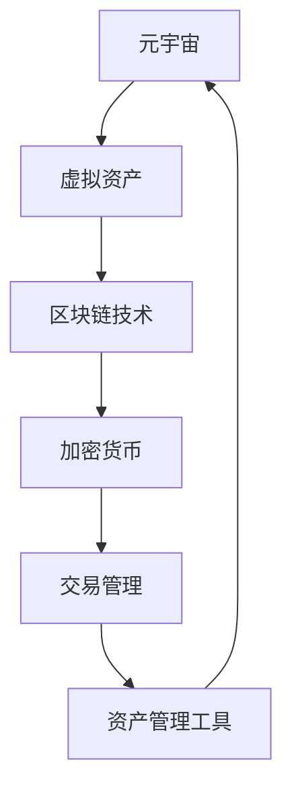

                 

 > **关键词：**元宇宙、虚拟资产、资产管理、区块链、加密货币、创业、商业模式、技术开发

> **摘要：**本文探讨了元宇宙资产管理工具的开发方向，以及其在虚拟经济中的重要作用。通过对元宇宙和虚拟资产的定义，分析了区块链技术如何支持虚拟资产的交易和管理。同时，本文提出了一些创业方向和商业模式，探讨了元宇宙资产管理工具的未来发展趋势和面临的挑战。

## 1. 背景介绍

在数字化的浪潮中，元宇宙（Metaverse）正逐渐成为一个备受关注的概念。元宇宙是一个虚拟的、三维的、持续存在的数字世界，它将现实世界和数字世界无缝连接起来，提供了全新的社交、娱乐、工作、学习等体验。随着技术的进步，尤其是区块链和加密货币的兴起，元宇宙中的虚拟资产开始受到越来越多人的关注。

虚拟资产是指在元宇宙中存在的、具有一定价值的数字资产，如虚拟地产、虚拟物品、虚拟货币等。这些资产通过区块链技术进行记录和管理，确保了其安全性和不可篡改性。随着虚拟资产市场的不断成熟，如何有效管理这些资产成为一个亟待解决的问题。

### 1.1 元宇宙的兴起

元宇宙的概念最早由科幻作家尼尔·斯蒂芬森在1992年的小说《雪崩》中提出。然而，随着互联网、虚拟现实（VR）、增强现实（AR）、游戏技术等领域的快速发展，元宇宙逐渐从科幻走向现实。许多科技公司，如Facebook、谷歌、微软等，都开始积极布局元宇宙，试图在其中占据一席之地。

### 1.2 虚拟资产的重要性

在元宇宙中，虚拟资产不仅具有娱乐价值，还具有重要的经济价值。虚拟资产可以用于交易、投资、游戏、社交等多种场景。例如，虚拟地产可以用于开设在线商店、举办虚拟活动；虚拟物品可以用于装饰虚拟形象、增强游戏体验；虚拟货币可以用于购买商品、支付服务费用等。

### 1.3 虚拟资产管理的挑战

随着虚拟资产市场的快速发展，如何有效管理这些资产成为一个挑战。虚拟资产的管理需要考虑安全性、透明性、流动性等方面。此外，虚拟资产的管理也需要适应不断变化的技术和市场环境。

## 2. 核心概念与联系

在元宇宙资产管理工具的开发中，有几个核心概念和联系是必须明确的。这些概念包括元宇宙、虚拟资产、区块链技术、加密货币等。

### 2.1 元宇宙与虚拟资产

元宇宙是一个虚拟的三维空间，用户可以在其中创建、交互和交易虚拟资产。虚拟资产是元宇宙中的数字资产，如虚拟地产、虚拟物品、虚拟货币等。

### 2.2 区块链技术

区块链技术是元宇宙资产管理的基石。区块链是一种分布式数据库技术，它通过加密算法和共识机制确保数据的不可篡改性和安全性。在元宇宙中，区块链用于记录和管理虚拟资产的所有权和交易历史。

### 2.3 加密货币

加密货币是一种基于区块链技术的数字货币，如比特币、以太坊等。加密货币在元宇宙中用于支付、交易和投资。

### 2.4 Mermaid 流程图

以下是一个简化的Mermaid流程图，展示了元宇宙资产管理的核心概念和联系：



## 3. 核心算法原理 & 具体操作步骤

在元宇宙资产管理工具中，核心算法是确保虚拟资产的安全性和可靠性的关键。以下将详细介绍算法原理和具体操作步骤。

### 3.1 算法原理概述

元宇宙资产管理工具的核心算法是基于区块链技术的智能合约。智能合约是一种自动执行、管理和记录交易的计算机协议。在元宇宙中，智能合约用于管理虚拟资产的所有权和交易。

### 3.2 算法步骤详解

**步骤1：创建虚拟资产**

在元宇宙中，用户可以通过区块链智能合约创建虚拟资产。例如，用户可以创建虚拟地产、虚拟物品等。

**步骤2：注册虚拟资产**

用户需要将虚拟资产注册到区块链上，以便进行管理和交易。注册时，系统会为虚拟资产生成一个唯一的标识符。

**步骤3：管理虚拟资产**

用户可以通过智能合约对虚拟资产进行管理，包括修改所有权、转移所有权等。

**步骤4：交易虚拟资产**

用户可以通过智能合约在区块链上进行虚拟资产的交易。交易过程是自动的，一旦交易确认，虚拟资产的所有权和交易历史就会记录在区块链上。

**步骤5：查询虚拟资产**

用户可以查询虚拟资产的所有权、交易历史等信息。

### 3.3 算法优缺点

**优点：**

- **安全性高**：区块链技术确保了虚拟资产的安全性和不可篡改性。
- **透明性高**：所有交易和资产信息都是公开的，用户可以随时查询。
- **去中心化**：智能合约和区块链技术确保了系统的去中心化，降低了被攻击的风险。

**缺点：**

- **计算成本高**：区块链技术的运行需要大量计算资源，导致计算成本较高。
- **交易效率低**：由于区块链技术的特点，交易确认时间较长，影响了交易效率。

### 3.4 算法应用领域

元宇宙资产管理工具的核心算法可以应用于多种领域，包括虚拟地产管理、虚拟物品交易、加密货币交易等。

## 4. 数学模型和公式 & 详细讲解 & 举例说明

在元宇宙资产管理中，数学模型和公式是确保系统稳定性和安全性的关键。以下将介绍一些关键的数学模型和公式，并对其进行详细讲解。

### 4.1 数学模型构建

元宇宙资产管理工具的数学模型主要包括以下方面：

- **虚拟资产价值模型**：用于估算虚拟资产的价值。
- **交易费用模型**：用于计算交易所需的费用。
- **风险管理模型**：用于评估和管理虚拟资产的风险。

### 4.2 公式推导过程

**虚拟资产价值模型**

虚拟资产的价值可以通过以下公式计算：

\[ V = \frac{E}{D} \]

其中，\( V \) 是虚拟资产的价值，\( E \) 是虚拟资产的预期收益，\( D \) 是虚拟资产的预期寿命。

**交易费用模型**

交易费用可以通过以下公式计算：

\[ F = K \times T \]

其中，\( F \) 是交易费用，\( K \) 是交易费用系数，\( T \) 是交易金额。

**风险管理模型**

风险管理可以通过以下公式计算：

\[ R = \frac{1}{1 + r} \]

其中，\( R \) 是风险管理系数，\( r \) 是风险回报率。

### 4.3 案例分析与讲解

以下是一个简单的案例，用于说明如何使用数学模型和公式进行虚拟资产管理。

**案例：虚拟地产管理**

假设某个元宇宙中的虚拟地产的预期收益为1000元，预期寿命为10年。交易费用系数为0.1，交易金额为1000元。风险回报率为10%。

**计算虚拟资产价值**

\[ V = \frac{E}{D} = \frac{1000}{10} = 100 \]

**计算交易费用**

\[ F = K \times T = 0.1 \times 1000 = 100 \]

**计算风险管理系数**

\[ R = \frac{1}{1 + r} = \frac{1}{1 + 0.1} = 0.909 \]

**计算虚拟资产价值**

\[ V = \frac{E}{D} \times R = \frac{1000}{10} \times 0.909 = 90.9 \]

根据计算结果，该虚拟地产的实际价值为90.9元。

## 5. 项目实践：代码实例和详细解释说明

为了更好地理解元宇宙资产管理工具的开发，以下将提供一个简单的代码实例，并对其进行详细解释。

### 5.1 开发环境搭建

为了实现元宇宙资产管理工具，我们需要搭建以下开发环境：

- **编程语言**：Python
- **开发工具**：PyCharm
- **区块链平台**：Ethereum（以太坊）

### 5.2 源代码详细实现

以下是一个简单的以太坊智能合约，用于管理虚拟资产：

```solidity
// SPDX-License-Identifier: MIT
pragma solidity ^0.8.0;

contract VirtualAsset {
    // 虚拟资产结构体
    struct Asset {
        address owner;
        uint256 value;
    }

    // 虚拟资产映射表
    mapping(uint256 => Asset) public assets;

    // 创建虚拟资产
    function createAsset(uint256 id, uint256 value) public {
        assets[id] = Asset(msg.sender, value);
    }

    // 转移虚拟资产
    function transferAsset(uint256 id, address to) public {
        require(assets[id].owner == msg.sender, "Not the owner");
        assets[id].owner = to;
    }

    // 查询虚拟资产
    function getAsset(uint256 id) public view returns (address owner, uint256 value) {
        Asset memory asset = assets[id];
        return (asset.owner, asset.value);
    }
}
```

### 5.3 代码解读与分析

**1. 虚拟资产结构体（Asset）**

该结构体用于存储虚拟资产的信息，包括所有权地址（owner）和资产价值（value）。

**2. 虚拟资产映射表（assets）**

该映射表用于存储所有虚拟资产的信息，通过资产ID（id）来查询和修改。

**3. 创建虚拟资产（createAsset）**

该函数用于创建虚拟资产。用户需要提供资产ID和资产价值，智能合约会将资产信息存储在映射表中。

**4. 转移虚拟资产（transferAsset）**

该函数用于转移虚拟资产的所有权。只有当前所有者（msg.sender）才能转移所有权。

**5. 查询虚拟资产（getAsset）**

该函数用于查询虚拟资产的信息，包括所有权地址和资产价值。

### 5.4 运行结果展示

在以太坊区块链上部署上述智能合约后，用户可以通过以下方式进行交互：

- **创建虚拟资产**：调用`createAsset`函数，创建一个ID为1、价值为100的虚拟资产。
- **转移虚拟资产**：调用`transferAsset`函数，将ID为1的虚拟资产的所有权转移到另一个地址。
- **查询虚拟资产**：调用`getAsset`函数，查询ID为1的虚拟资产的信息。

## 6. 实际应用场景

元宇宙资产管理工具在实际应用中具有广泛的应用场景。以下列举几个典型应用场景：

### 6.1 虚拟地产管理

虚拟地产是元宇宙中最重要的资产之一。通过元宇宙资产管理工具，用户可以创建、管理和交易虚拟地产。例如，用户可以在元宇宙中购买一块虚拟土地，然后通过智能合约进行出租、出售等操作。

### 6.2 虚拟物品交易

虚拟物品是元宇宙中的另一种重要资产。通过元宇宙资产管理工具，用户可以创建、管理和交易虚拟物品。例如，用户可以在元宇宙中购买一件虚拟服装，然后通过智能合约进行转让、租赁等操作。

### 6.3 加密货币交易

加密货币是元宇宙中的一种重要货币。通过元宇宙资产管理工具，用户可以在元宇宙中进行加密货币的交易。例如，用户可以在元宇宙中购买比特币，然后通过智能合约进行买卖、投资等操作。

### 6.4 社交平台服务

元宇宙资产管理工具还可以应用于社交平台服务。例如，用户可以在元宇宙中创建社交账户，然后通过智能合约进行实名认证、信用评估等操作，为用户提供更安全、可靠的社交体验。

## 7. 未来应用展望

随着元宇宙的不断发展，元宇宙资产管理工具将具有更广泛的应用前景。以下是一些未来应用展望：

### 7.1 新型商业模式

元宇宙资产管理工具将为传统商业模式带来革命性的变化。例如，虚拟地产、虚拟物品、加密货币等虚拟资产将成为新的商业资产，为企业提供更多的商业机会。

### 7.2 新型金融服务

元宇宙资产管理工具将推动新型金融服务的诞生。例如，虚拟资产借贷、虚拟资产保险、虚拟资产投资等金融服务将得到广泛应用。

### 7.3 新型社会治理

元宇宙资产管理工具将有助于提高社会治理的效率。例如，通过智能合约实现公共资源的分配、税收征收等操作，提高政府治理的透明度和效率。

## 8. 工具和资源推荐

### 8.1 学习资源推荐

- **《区块链技术指南》**：深入理解区块链技术的基础知识和应用。
- **《加密货币投资入门》**：了解加密货币的基本概念和投资策略。
- **《元宇宙：概念、技术与应用》**：了解元宇宙的基本概念和技术架构。

### 8.2 开发工具推荐

- **Ethereum Developer Portal**：提供以太坊智能合约的开发和部署工具。
- **Truffle Suite**：提供智能合约开发、测试和部署的集成环境。
- **Hardhat**：提供强大的智能合约开发环境，支持本地链和测试。

### 8.3 相关论文推荐

- **《区块链：一个分布式账本技术》**：详细介绍了区块链技术的工作原理和应用场景。
- **《加密货币：技术、市场与法律》**：探讨了加密货币的发展趋势和法律法规问题。
- **《元宇宙：未来互联网的形态》**：分析了元宇宙的技术架构和发展趋势。

## 9. 总结：未来发展趋势与挑战

### 9.1 研究成果总结

本文总结了元宇宙资产管理工具的开发方向和应用场景，分析了区块链技术和加密货币在元宇宙资产管理中的作用。同时，本文提出了一些未来应用展望，探讨了元宇宙资产管理工具在未来社会和经济中的重要作用。

### 9.2 未来发展趋势

随着元宇宙的不断发展，元宇宙资产管理工具将具有更广泛的应用前景。未来，我们将看到更多创新的商业模式和金融服务在元宇宙中涌现，为用户带来更丰富、更便捷的虚拟经济体验。

### 9.3 面临的挑战

尽管元宇宙资产管理工具具有广阔的应用前景，但仍然面临一些挑战。例如，技术成熟度、安全性能、用户体验等方面仍需不断改进。此外，法律法规、监管政策等方面的不确定性也是未来发展的关键挑战。

### 9.4 研究展望

未来，我们将继续深入研究元宇宙资产管理工具的技术架构和应用场景，探索更高效、更安全的资产管理方案。同时，我们也期待更多领域的技术创新，推动元宇宙和虚拟经济的发展。

## 附录：常见问题与解答

### Q：元宇宙资产管理工具是否安全？

A：元宇宙资产管理工具基于区块链技术，确保了资产的安全性和不可篡改性。但仍然需要关注智能合约的安全性问题，防范潜在的安全漏洞。

### Q：元宇宙资产管理工具如何保证资产流动性？

A：元宇宙资产管理工具通过智能合约和区块链技术确保资产的流动性。用户可以通过智能合约在区块链上进行资产的交易，确保资产可以快速、便捷地进行转移。

### Q：元宇宙资产管理工具是否具有法律效力？

A：元宇宙资产管理工具在法律效力方面仍存在一定的不确定性。目前，各国对区块链技术和加密货币的法律法规仍在不断完善中。用户在使用元宇宙资产管理工具时，需要关注相关法律法规的动态。

---

作者：禅与计算机程序设计艺术 / Zen and the Art of Computer Programming

