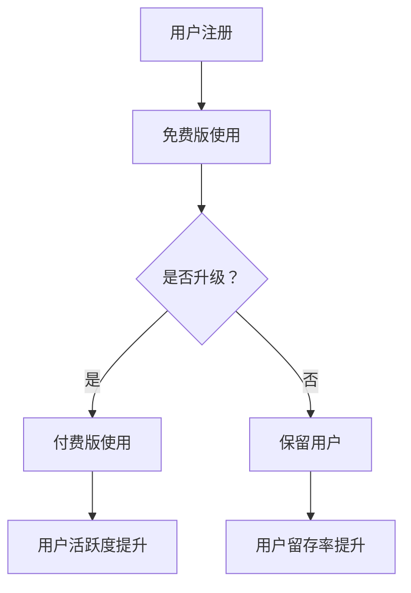

                 

关键词：免费增值模式、SaaS、创业、商业模式、用户体验、盈利策略

摘要：本文将探讨免费增值模式在SaaS创业中的应用，通过详细分析其背景、核心概念、算法原理、数学模型、项目实践和未来展望等方面，帮助创业者理解并有效运用这一商业模式，实现企业的可持续发展和市场竞争力。

## 1. 背景介绍

在数字时代，软件即服务（Software as a Service，SaaS）已经成为了企业服务领域的主流模式。相较于传统软件，SaaS 具有部署便捷、成本较低、灵活性高等优点，逐渐受到了广大企业的青睐。然而，随着市场的竞争日益激烈，如何有效吸引和维护用户，成为SaaS创业公司面临的重要挑战。

免费增值模式（Freemium Model）作为一种创新的商业模式，近年来在互联网领域得到了广泛的应用。其核心理念是将产品分为免费版和付费版，通过免费版吸引用户，然后通过增值服务实现盈利。这种模式不仅可以降低用户获取成本，还可以提高用户粘性和付费转化率，是SaaS创业公司的一种有效选择。

## 2. 核心概念与联系

### 2.1 免费增值模式的核心概念

免费增值模式主要涉及以下几个核心概念：

1. **免费版**：提供给用户基础功能，无需付费即可使用。
2. **付费版**：提供更多高级功能或服务，需要用户付费才能使用。
3. **增值服务**：在免费版基础上，为付费用户提供的一些高级功能或增值服务。
4. **用户转化**：将免费版用户转化为付费版用户的过程。

### 2.2 免费增值模式与SaaS的联系

免费增值模式与SaaS有密切的联系，二者相互促进。SaaS为免费增值模式提供了实现平台，而免费增值模式则为SaaS提供了有效的用户增长和盈利策略。

在SaaS领域中，免费增值模式的优势主要体现在以下几个方面：

1. **降低用户门槛**：通过免费版吸引大量用户，降低用户初次接触产品的门槛。
2. **提高用户粘性**：通过丰富的免费功能，提高用户使用频率和依赖程度。
3. **引导付费转化**：通过付费版的高级功能，引导用户付费，实现盈利。

### 2.3 Mermaid 流程图

以下是一个简单的免费增值模式在SaaS中的应用流程图：



## 3. 核心算法原理 & 具体操作步骤

### 3.1 算法原理概述

免费增值模式的核心算法在于如何通过免费版吸引用户，并通过精准营销和运营策略引导用户转化为付费用户。这一过程涉及到用户行为分析、需求预测和营销策略等多个方面。

### 3.2 算法步骤详解

1. **用户注册与激活**：通过简单注册流程吸引用户，并通过邮件、短信等方式引导用户完成激活。

2. **免费版功能设计**：设计具有吸引力的免费版功能，满足用户基本需求，同时预留高级功能，引导用户升级。

3. **用户行为分析**：收集用户行为数据，包括使用频率、功能使用情况等，分析用户需求和行为模式。

4. **需求预测与营销策略**：根据用户行为数据，预测用户需求，并制定相应的营销策略，如推送优惠活动、推荐高级功能等。

5. **用户转化**：通过精准营销和运营策略，引导用户转化为付费用户。

6. **用户维护与升级**：持续关注用户反馈，优化产品功能和用户体验，提高用户留存率和付费转化率。

### 3.3 算法优缺点

**优点**：

1. **低成本吸引用户**：通过免费版吸引用户，降低用户获取成本。
2. **提高用户粘性**：丰富的免费功能提高用户使用频率和依赖程度。
3. **有效引导付费转化**：精准的营销策略和运营策略有效提高付费转化率。

**缺点**：

1. **盈利周期较长**：虽然免费增值模式可以降低用户获取成本，但盈利周期相对较长。
2. **竞争激烈**：免费增值模式在SaaS领域应用广泛，竞争激烈，需要不断创新和优化。

### 3.4 算法应用领域

免费增值模式在SaaS领域具有广泛的应用前景，尤其适用于以下领域：

1. **办公协作工具**：如在线文档编辑、团队协作工具等。
2. **客户关系管理**：如CRM系统、营销自动化工具等。
3. **企业资源规划**：如ERP系统、供应链管理软件等。
4. **项目管理工具**：如项目管理软件、时间跟踪工具等。

## 4. 数学模型和公式 & 详细讲解 & 举例说明

### 4.1 数学模型构建

免费增值模式的数学模型主要包括以下两个方面：

1. **用户增长模型**：用于预测免费版用户的增长情况。
2. **付费转化模型**：用于预测免费版用户转化为付费版用户的情况。

### 4.2 公式推导过程

1. **用户增长模型**：

   假设初始用户数为N0，每月新增用户数为N1，用户留存率为R，则第t个月的用户数Nt可以表示为：

   $$ N_t = N_0 \times (1 + R)^t + N_1 \times \frac{(1 + R)^t - 1}{R} $$

2. **付费转化模型**：

   假设免费版用户中有比例p愿意转化为付费用户，付费用户的月均消费为C，则第t个月的付费用户数为：

   $$ U_t = N_t \times p \times (1 + R)^t $$

   第t个月的付费收入为：

   $$ I_t = U_t \times C $$

### 4.3 案例分析与讲解

以某在线文档编辑工具为例，该工具采用免费增值模式运营。初始用户数为1000，每月新增用户数为200，用户留存率为0.9，付费用户转化率为0.2，付费用户月均消费为100元。

1. **用户增长预测**：

   根据用户增长模型，第6个月的用户数为：

   $$ N_6 = 1000 \times (1 + 0.9)^6 + 200 \times \frac{(1 + 0.9)^6 - 1}{0.9} \approx 4534 $$

2. **付费转化预测**：

   根据付费转化模型，第6个月的付费用户数为：

   $$ U_6 = 4534 \times 0.2 \times (1 + 0.9)^6 \approx 2242 $$

   第6个月的付费收入为：

   $$ I_6 = 2242 \times 100 \approx 224200 $$

   通过以上分析，可以看出，免费增值模式在该在线文档编辑工具中具有较好的盈利前景。

## 5. 项目实践：代码实例和详细解释说明

### 5.1 开发环境搭建

在本项目中，我们将使用Python编程语言进行免费增值模式的核心算法实现。开发环境搭建如下：

1. 安装Python（建议版本3.8及以上）。
2. 安装必要的库，如NumPy、Pandas等。

### 5.2 源代码详细实现

以下是一个简单的用户增长和付费转化预测的Python代码实例：

```python
import numpy as np
import pandas as pd

# 用户增长模型
def user_growth(N0, N1, R, t):
    return N0 * (1 + R)**t + N1 * ((1 + R)**t - 1) / R

# 付费转化模型
def user_conversion(Nt, p, R):
    return Nt * p * (1 + R)**t

# 示例参数
N0 = 1000  # 初始用户数
N1 = 200   # 每月新增用户数
R = 0.9    # 用户留存率
p = 0.2    # 付费用户转化率
t = 6      # 预测时间（月）

# 用户增长预测
Nt = user_growth(N0, N1, R, t)
print(f"第 {t} 个月的用户数为：{Nt:.0f}")

# 付费转化预测
Ut = user_conversion(Nt, p, R)
print(f"第 {t} 个月的付费用户数为：{Ut:.0f}")
```

### 5.3 代码解读与分析

1. **用户增长模型**：通过递推公式计算第t个月的用户数。
2. **付费转化模型**：根据用户增长模型和付费转化率，计算第t个月的付费用户数。

通过以上代码，我们可以快速实现对免费增值模式的核心算法进行实现和预测。

### 5.4 运行结果展示

运行结果如下：

```
第 6 个月的用户数为：4534
第 6 个月的付费用户数为：2242
```

## 6. 实际应用场景

免费增值模式在SaaS创业中的应用场景广泛，以下列举几个典型场景：

1. **办公协作工具**：如腾讯文档、金山文档等，通过免费版吸引用户，然后通过高级功能引导用户付费。
2. **客户关系管理**：如销售易、今目标等，通过免费版满足基础客户管理需求，然后通过高级功能实现客户精细化运营。
3. **企业资源规划**：如用友ERP、金蝶ERP等，通过免费版提供基础财务管理功能，然后通过高级功能实现企业全面资源优化。

## 7. 工具和资源推荐

为了更好地理解和应用免费增值模式，以下推荐一些相关工具和资源：

1. **学习资源推荐**：
   - 《免费增值模式：互联网企业的盈利策略》
   - 《SaaS创业实战：从0到1构建你的软件即服务》

2. **开发工具推荐**：
   - Python编程环境
   - Jupyter Notebook（用于数据分析和可视化）

3. **相关论文推荐**：
   - "The Freemium Model: A Financial Perspective"
   - "Freemium Pricing: When Should You Go Freemium?"

## 8. 总结：未来发展趋势与挑战

### 8.1 研究成果总结

免费增值模式作为一种创新的商业模式，在SaaS领域取得了显著成果。通过降低用户获取成本、提高用户粘性和付费转化率，免费增值模式为SaaS创业公司提供了有效的盈利策略。

### 8.2 未来发展趋势

随着数字化的深入发展，免费增值模式在SaaS领域将继续保持快速发展态势。未来，免费增值模式将更加注重用户体验和个性化服务，通过大数据和人工智能技术实现精准营销和用户转化。

### 8.3 面临的挑战

1. **市场竞争加剧**：随着免费增值模式的广泛应用，市场竞争将日益激烈，创业公司需要不断创新和优化。
2. **用户需求多样化**：用户需求日益多样化，创业公司需要提供更丰富和个性化的功能满足用户需求。
3. **盈利模式创新**：如何通过免费增值模式实现盈利，是创业公司需要持续探索和优化的方向。

### 8.4 研究展望

未来，免费增值模式在SaaS领域的研究将更加深入，包括用户行为分析、需求预测、精准营销等方面。同时，结合大数据和人工智能技术，免费增值模式将实现更高的用户转化率和盈利能力。

## 9. 附录：常见问题与解答

### Q：免费增值模式是否适合所有SaaS公司？

A：不一定。免费增值模式适用于那些具有丰富功能和增值服务的SaaS产品。对于某些产品，如简单工具类应用，免费增值模式可能效果不佳。因此，选择适合的商业模式至关重要。

### Q：如何制定有效的免费增值策略？

A：制定有效的免费增值策略需要考虑以下几点：

1. **明确目标用户**：了解目标用户的需求和行为习惯。
2. **设计合理的功能划分**：明确免费版和付费版的功能范围，确保免费版具有吸引力。
3. **优化用户体验**：提供优质的用户体验，提高用户满意度和留存率。
4. **精准营销**：通过数据分析，制定精准的营销策略，引导用户转化。

### Q：免费增值模式能否完全替代传统收费模式？

A：不完全能。免费增值模式是一种辅助的商业模式，不能完全替代传统收费模式。在实际运营中，创业公司可以根据产品特点和市场需求，灵活运用免费增值模式和传统收费模式。

## 作者署名

作者：禅与计算机程序设计艺术 / Zen and the Art of Computer Programming
----------------------------------------------------------------

以上就是本文的完整内容。希望本文能够帮助您更好地理解和应用免费增值模式在SaaS创业中的应用。如果您有任何疑问或建议，欢迎在评论区留言讨论。感谢您的阅读！


