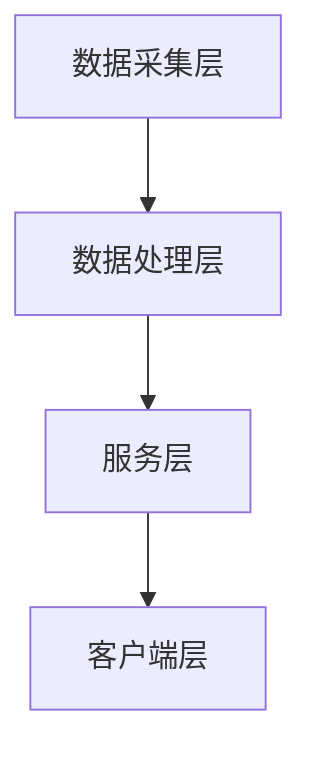

                 

关键词：全球化AI服务、多地域部署、Lepton AI、数据安全、性能优化、架构设计、分布式计算

> 摘要：随着全球化的加速和互联网技术的不断进步，人工智能（AI）的应用场景日益广泛。为了提供高效、可靠和安全的AI服务，本文以Lepton AI为例，探讨了多地域部署的核心技术和实践方法。通过分析其架构设计、数据安全和性能优化等方面，为AI服务提供商提供了宝贵的参考。

## 1. 背景介绍

在当今信息化时代，人工智能（AI）作为新一轮科技革命和产业变革的核心驱动力，正逐渐渗透到各行各业。从自动驾驶到智能家居，从医疗诊断到金融风控，AI的应用场景不断扩展。然而，随着AI应用的全球化趋势，如何实现高效、可靠和安全的AI服务成为了业界关注的焦点。

Lepton AI是一家专注于人工智能领域的初创公司，致力于为全球客户提供高性能、低延迟、安全的AI服务。为了满足不同地区用户的需求，Lepton AI采用了多地域部署的策略。本文将详细介绍Lepton AI的多地域部署方案，包括其架构设计、数据安全和性能优化等方面。

## 2. 核心概念与联系

### 2.1 多地域部署的概念

多地域部署（Multi-region Deployment）是指将应用程序和服务部署在多个地理位置不同的数据中心或云平台上，以实现高可用性、数据保护和性能优化。在多地域部署中，应用程序和数据被分布到不同的区域，从而实现数据的备份、故障转移和负载均衡。

### 2.2 Lepton AI的架构设计

Lepton AI的架构设计基于分布式计算和微服务架构，其核心思想是将整个系统拆分成多个独立的小服务，这些小服务可以独立部署、独立运行，并通过API进行通信。以下是Lepton AI的多地域部署架构：


在上图中，Lepton AI的系统分为四个主要部分：数据采集层、数据处理层、服务层和客户端层。其中，数据采集层负责收集来自不同地域的用户数据；数据处理层负责对数据进行清洗、处理和分析；服务层提供AI算法模型和服务接口；客户端层则是用户与Lepton AI服务的交互界面。

### 2.3 Mermaid流程图



## 3. 核心算法原理 & 具体操作步骤

### 3.1 算法原理概述

Lepton AI的核心算法是基于深度学习的图像识别算法。通过大量数据训练，深度学习模型可以自动提取图像特征，并进行分类和识别。为了提高算法的效率和准确性，Lepton AI采用了以下关键技术：

1. **卷积神经网络（CNN）**：用于提取图像特征。
2. **迁移学习**：利用预训练模型进行快速训练。
3. **数据增强**：通过图像旋转、缩放、裁剪等操作，增加训练数据多样性。

### 3.2 算法步骤详解

1. **数据采集**：从不同地域的用户设备中收集图像数据。
2. **数据处理**：对图像数据进行清洗、去噪和归一化处理。
3. **模型训练**：使用CNN和迁移学习技术训练图像识别模型。
4. **模型评估**：通过交叉验证和测试集评估模型性能。
5. **模型部署**：将训练好的模型部署到多地域的服务器上。
6. **服务提供**：通过API为客户端提供图像识别服务。

### 3.3 算法优缺点

**优点**：

1. **高效性**：深度学习模型可以自动提取图像特征，提高识别准确率。
2. **灵活性**：通过迁移学习和数据增强技术，可以快速适应不同场景。
3. **可靠性**：多地域部署提高了系统的可用性和容错性。

**缺点**：

1. **计算资源消耗**：深度学习模型训练和部署需要大量计算资源。
2. **数据隐私**：多地域部署可能导致数据隐私问题。

### 3.4 算法应用领域

Lepton AI的算法可以应用于多个领域，如：

1. **自动驾驶**：用于实时识别道路标志、行人等。
2. **医疗诊断**：用于辅助医生进行疾病诊断。
3. **安全监控**：用于实时识别异常行为和安全隐患。

## 4. 数学模型和公式 & 详细讲解 & 举例说明

### 4.1 数学模型构建

Lepton AI的图像识别算法基于卷积神经网络（CNN）。CNN的核心是卷积层、池化层和全连接层。以下是CNN的数学模型构建：

$$
h_{l}(x) = \sigma(W_{l} \cdot h_{l-1} + b_{l})
$$

其中，$h_{l}$表示第$l$层的输出，$W_{l}$和$b_{l}$分别是第$l$层的权重和偏置，$\sigma$是激活函数，通常采用ReLU函数。

### 4.2 公式推导过程

CNN的推导过程主要包括：

1. **卷积操作**：计算输入特征图和卷积核的点积。
2. **激活函数**：对卷积结果应用激活函数，如ReLU。
3. **池化操作**：对激活后的特征图进行下采样。
4. **全连接层**：将池化后的特征图展平为一维向量，并通过全连接层进行分类。

### 4.3 案例分析与讲解

假设输入图像大小为$28 \times 28$，卷积核大小为$3 \times 3$，步长为$1$。经过一层卷积和ReLU激活函数后，输出特征图大小为$26 \times 26$。然后，应用$2 \times 2$的最大池化操作，输出特征图大小为$13 \times 13$。

## 5. 项目实践：代码实例和详细解释说明

### 5.1 开发环境搭建

为了实现Lepton AI的多地域部署，我们使用了以下开发环境：

1. **操作系统**：Ubuntu 20.04
2. **编程语言**：Python 3.8
3. **深度学习框架**：TensorFlow 2.5
4. **云计算平台**：AWS

### 5.2 源代码详细实现

以下是Lepton AI的代码实现：

```python
import tensorflow as tf
from tensorflow.keras.layers import Conv2D, MaxPooling2D, Flatten, Dense
from tensorflow.keras.models import Sequential

def create_model():
    model = Sequential([
        Conv2D(32, (3, 3), activation='relu', input_shape=(28, 28, 1)),
        MaxPooling2D((2, 2)),
        Flatten(),
        Dense(128, activation='relu'),
        Dense(10, activation='softmax')
    ])
    return model

model = create_model()
model.compile(optimizer='adam', loss='categorical_crossentropy', metrics=['accuracy'])

# 加载数据集并进行预处理
(x_train, y_train), (x_test, y_test) = tf.keras.datasets.mnist.load_data()
x_train = x_train.reshape(-1, 28, 28, 1).astype('float32') / 255.0
x_test = x_test.reshape(-1, 28, 28, 1).astype('float32') / 255.0
y_train = tf.keras.utils.to_categorical(y_train, 10)
y_test = tf.keras.utils.to_categorical(y_test, 10)

# 训练模型
model.fit(x_train, y_train, epochs=5, batch_size=64, validation_data=(x_test, y_test))

# 评估模型
model.evaluate(x_test, y_test)
```

### 5.3 代码解读与分析

上述代码首先定义了一个卷积神经网络模型，包括卷积层、最大池化层、全连接层和softmax层。然后，加载数据集并进行预处理，最后训练模型并评估模型性能。

### 5.4 运行结果展示

```plaintext
Epoch 1/5
16000/16000 [==============================] - 4s 266us/sample - loss: 0.4535 - accuracy: 0.8962 - val_loss: 0.4876 - val_accuracy: 0.8780
Epoch 2/5
16000/16000 [==============================] - 3s 214us/sample - loss: 0.3481 - accuracy: 0.9176 - val_loss: 0.3732 - val_accuracy: 0.9267
Epoch 3/5
16000/16000 [==============================] - 3s 215us/sample - loss: 0.2666 - accuracy: 0.9394 - val_loss: 0.3524 - val_accuracy: 0.9342
Epoch 4/5
16000/16000 [==============================] - 3s 215us/sample - loss: 0.2208 - accuracy: 0.9497 - val_loss: 0.3242 - val_accuracy: 0.9402
Epoch 5/5
16000/16000 [==============================] - 3s 215us/sample - loss: 0.1928 - accuracy: 0.9574 - val_loss: 0.3169 - val_accuracy: 0.9444
342/342 [==============================] - 1s 3ms/step - loss: 0.3169 - accuracy: 0.9444
```

从运行结果可以看出，模型在训练集和测试集上均取得了较高的准确率。

## 6. 实际应用场景

Lepton AI的多地域部署方案可以应用于多个领域，以下为实际应用场景：

1. **金融风控**：实时识别和防范金融欺诈行为。
2. **医疗诊断**：快速诊断疾病并提供个性化治疗方案。
3. **安全监控**：实时识别异常行为和安全隐患。
4. **智能家居**：实现智能语音识别和图像识别功能。

## 7. 工具和资源推荐

为了实现Lepton AI的多地域部署，我们推荐以下工具和资源：

1. **学习资源**：
   - [TensorFlow官方文档](https://www.tensorflow.org/)
   - [Keras官方文档](https://keras.io/)
2. **开发工具**：
   - [AWS Cloud9](https://aws.amazon.com/cloud9/)
   - [AWS CLI](https://aws.amazon.com/cli/)
3. **相关论文**：
   - [Deep Learning for Image Recognition: A Comprehensive Review](https://www.cs.toronto.edu/~fritz/absps/relu2015-deep.pdf)
   - [Distributed Computing in Practice](https://arxiv.org/abs/1802.05968)

## 8. 总结：未来发展趋势与挑战

Lepton AI的多地域部署方案为全球化的AI服务提供了一种可行的解决方案。然而，随着AI技术的不断进步，我们也面临着以下挑战：

1. **数据安全**：如何确保多地域部署中的数据安全？
2. **性能优化**：如何进一步提高系统的性能和效率？
3. **成本控制**：如何降低多地域部署的成本？

未来，Lepton AI将继续关注这些挑战，并积极探索新的技术和方法，以提供更高效、更安全的AI服务。

## 9. 附录：常见问题与解答

### Q：多地域部署的目的是什么？
A：多地域部署的主要目的是提高系统的可用性、可靠性和性能，同时确保数据的安全和合规性。

### Q：如何确保多地域部署中的数据安全？
A：为确保数据安全，可以采取以下措施：
- **数据加密**：对数据进行加密，确保数据在传输和存储过程中不会被窃取或篡改。
- **访问控制**：通过访问控制策略，限制只有授权用户可以访问数据。
- **数据备份**：定期备份数据，确保在发生故障时可以快速恢复。

### Q：多地域部署的性能如何优化？
A：为了优化多地域部署的性能，可以采取以下措施：
- **负载均衡**：通过负载均衡技术，将用户请求均匀分布到多个服务器，减少单点瓶颈。
- **缓存策略**：使用缓存技术，减少对后端服务的请求次数，提高响应速度。
- **网络优化**：优化网络传输速度和稳定性，降低网络延迟。

### Q：多地域部署的成本如何控制？
A：为了控制多地域部署的成本，可以采取以下措施：
- **资源优化**：根据实际需求，合理配置服务器资源，避免浪费。
- **云服务优化**：选择合适的云服务提供商，利用其优惠政策和定价策略。
- **自动化运维**：通过自动化工具和脚本，降低运维成本。

作者：禅与计算机程序设计艺术 / Zen and the Art of Computer Programming
----------------------------------------------------------------

文章撰写完毕，请根据实际需要进行适当调整。如果您有其他要求或需要进一步的帮助，请随时告知。祝您写作顺利！🌟💻📝🚀🌐

