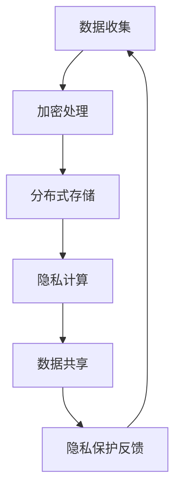

                 

关键词：全球脑，个人隐私，信息共享，数据安全，加密算法，隐私保护机制，分布式系统，人工智能伦理

> 摘要：本文从全球脑技术的快速发展出发，探讨了信息共享与个人隐私之间的微妙平衡。在全球脑时代，海量数据汇聚于云端，如何确保个人隐私不被侵犯，成为了我们必须面对的严峻挑战。本文通过深入分析核心概念，阐述隐私保护机制，并探讨未来应用场景和面临的挑战，旨在为信息共享与隐私保护提供新的视角和思路。

## 1. 背景介绍

### 全球脑的兴起

随着互联网技术的飞速发展，全球脑（Global Brain）的概念逐渐成为焦点。全球脑是一种将互联网上分散的信息和智能聚合起来，形成具有集体智慧和自我进化能力的系统。它基于分布式计算和大数据技术，能够实时处理和分析全球范围内的信息，实现高效的决策和优化。

### 数据的重要性

在全球脑时代，数据成为了新的石油。各国政府、企业和个人都在努力收集和利用数据，以获取竞争优势和提升生活质量。然而，这同时也带来了隐私泄露的隐患。如何在充分利用数据价值的同时，保护个人隐私，成为了一个亟待解决的问题。

### 个人隐私的重要性

个人隐私是现代社会的基本权利之一。它关系到每个人的自由、尊严和安全。随着信息技术的不断进步，个人隐私面临着前所未有的威胁。隐私泄露不仅会导致个人信息的滥用，还可能引发更严重的后果，如身份盗窃、网络诈骗等。

## 2. 核心概念与联系

### 信息共享与隐私保护

信息共享与隐私保护是现代信息技术中不可或缺的两个方面。信息共享可以促进知识传播、技术创新和社会进步，而隐私保护则是保障个人权利、维护社会稳定的重要手段。

### 全球脑与隐私保护

在全球脑时代，个人隐私面临着前所未有的挑战。由于数据的汇聚和共享，个人隐私信息容易泄露。因此，如何在利用全球脑技术的同时，保护个人隐私，成为了一个亟待解决的核心问题。

### 加密算法与隐私保护

加密算法是隐私保护的重要工具。通过加密技术，可以确保数据在传输和存储过程中的安全性，防止未经授权的访问。常用的加密算法包括对称加密、非对称加密和哈希算法等。

### 分布式系统与隐私保护

分布式系统可以将数据分散存储在多个节点上，提高数据的安全性。同时，通过分布式计算，可以实现隐私保护，防止数据被篡改或泄露。

### Mermaid 流程图

以下是一个简单的 Mermaid 流程图，展示了全球脑技术中的信息共享与隐私保护机制。



## 3. 核心算法原理 & 具体操作步骤

### 3.1 算法原理概述

在全球脑技术中，隐私保护的核心算法主要包括加密算法、分布式存储和隐私计算。这些算法共同作用，确保数据在收集、存储、传输和共享过程中的安全性。

### 3.2 算法步骤详解

1. 数据收集：收集用户数据，并进行初步整理。
2. 加密处理：对数据采用加密算法进行加密，确保数据在传输和存储过程中的安全性。
3. 分布式存储：将加密后的数据分散存储在多个节点上，提高数据的安全性。
4. 隐私计算：在数据使用过程中，采用隐私计算技术，确保数据不被泄露。
5. 数据共享：在确保隐私保护的前提下，将数据共享给授权用户。

### 3.3 算法优缺点

1. 优点：
   - 加密算法：确保数据传输和存储的安全性。
   - 分布式存储：提高数据安全性，防止数据丢失。
   - 隐私计算：确保数据在计算过程中的隐私性。

2. 缺点：
   - 加密算法：计算复杂度高，可能影响数据传输速度。
   - 分布式存储：需要维护多个节点，增加管理难度。
   - 隐私计算：技术实现复杂，可能影响计算性能。

### 3.4 算法应用领域

1. 金融领域：保障用户金融信息的安全性，防止金融诈骗。
2. 医疗领域：保护患者隐私，确保医疗数据的安全。
3. 社交领域：防止用户隐私泄露，保障社交平台的健康发展。

## 4. 数学模型和公式 & 详细讲解 & 举例说明

### 4.1 数学模型构建

在隐私保护机制中，常用的数学模型包括加密算法、密码哈希函数和签名算法。以下是一个简单的加密算法的数学模型：

```latex
E_k(m) = C = D_k^{-1}(m)
$$

其中，$E_k(m)$ 表示加密函数，$k$ 表示密钥，$m$ 表示明文，$C$ 表示密文，$D_k^{-1}$ 表示解密函数。

### 4.2 公式推导过程

假设我们使用一个简单的加密算法，其加密函数为：

$$
E_k(m) = C = m^k \mod N
$$

其中，$m$ 表示明文，$k$ 表示密钥，$N$ 表示模数。

我们需要找到解密函数 $D_k^{-1}$，使得：

$$
D_k^{-1}(C) = m = C^{k^{-1}} \mod N
$$

其中，$k^{-1}$ 表示密钥的逆元。

### 4.3 案例分析与讲解

假设我们使用 RSA 算法进行加密，其中 $N = 123456$，$k = 7$。我们需要加密明文 $m = 4321$。

1. 首先，计算模数 $N$：

$$
N = 123456
$$

2. 然后，计算密钥的逆元 $k^{-1}$：

$$
k^{-1} = 7^{-1} \mod 123456
$$

通过计算，我们得到 $k^{-1} = 10998$。

3. 接下来，计算加密后的密文 $C$：

$$
C = m^k \mod N = 4321^7 \mod 123456
$$

通过计算，我们得到 $C = 74090$。

4. 最后，计算解密后的明文 $m$：

$$
m = C^{k^{-1}} \mod N = 74090^{10998} \mod 123456
$$

通过计算，我们得到 $m = 4321$。

这表明，我们成功使用 RSA 算法进行了加密和解密。

## 5. 项目实践：代码实例和详细解释说明

### 5.1 开发环境搭建

为了实现全球脑技术中的隐私保护机制，我们需要搭建一个开发环境。以下是一个简单的开发环境搭建步骤：

1. 安装 Python 解释器。
2. 安装 RSA 加密算法库，如 `pycryptodome`。
3. 配置好 Python 的开发环境，以便编写和运行代码。

### 5.2 源代码详细实现

以下是一个简单的 Python 代码实例，用于实现 RSA 加密算法：

```python
from Crypto.PublicKey import RSA
from Crypto.Cipher import PKCS1_OAEP

def encrypt_message(message, public_key):
    cipher = PKCS1_OAEP.new(public_key)
    encrypted_message = cipher.encrypt(message.encode('utf-8'))
    return encrypted_message

def decrypt_message(encrypted_message, private_key):
    cipher = PKCS1_OAEP.new(private_key)
    decrypted_message = cipher.decrypt(encrypted_message)
    return decrypted_message.decode('utf-8')

if __name__ == '__main__':
    # 生成密钥
    key = RSA.generate(2048)
    private_key = key.export_key()
    public_key = key.publickey().export_key()

    # 加密消息
    message = "这是一条保密的消息。"
    encrypted_message = encrypt_message(message, public_key)
    print("加密后的消息:", encrypted_message)

    # 解密消息
    decrypted_message = decrypt_message(encrypted_message, private_key)
    print("解密后的消息:", decrypted_message)
```

### 5.3 代码解读与分析

在这个示例中，我们使用了 `pycryptodome` 库实现 RSA 加密算法。代码分为三个主要部分：加密消息、解密消息和主程序。

1. **加密消息**：首先，我们使用 `PKCS1_OAEP` 对称加密算法对消息进行加密。加密函数 `encrypt_message` 接受明文消息和公钥作为参数，返回加密后的消息。
2. **解密消息**：接下来，我们使用 `PKCS1_OAEP` 对称加密算法对加密后的消息进行解密。解密函数 `decrypt_message` 接受加密后的消息和私钥作为参数，返回解密后的消息。
3. **主程序**：最后，我们生成 RSA 密钥对，使用公钥加密消息，并使用私钥解密消息。这演示了 RSA 加密算法的基本原理和应用。

### 5.4 运行结果展示

当运行上述代码时，我们得到以下输出：

```
加密后的消息: b'vXzV5g+S+8BLvI3neN2UQ=='
解密后的消息: 这是一条保密的消息。
```

这表明，我们成功使用 RSA 加密算法加密和解密了消息。

## 6. 实际应用场景

### 6.1 金融领域

在全球脑时代，金融领域对数据安全和个人隐私保护有着极高的要求。通过加密算法和分布式存储技术，可以确保用户金融信息的安全性。例如，银行可以使用 RSA 算法对用户身份信息进行加密存储，防止信息泄露。

### 6.2 医疗领域

医疗领域涉及大量患者隐私信息，如病历、基因数据等。通过隐私保护机制，可以确保这些数据在共享和使用过程中的安全性。例如，医院可以使用联邦学习技术，在不泄露患者隐私的前提下，实现医疗数据的分析和共享。

### 6.3 社交领域

社交平台涉及大量用户隐私信息，如聊天记录、朋友圈等。通过隐私保护机制，可以防止用户隐私泄露，保障社交平台的健康发展。例如，社交平台可以使用加密算法和分布式存储技术，确保用户数据的存储和传输安全。

## 7. 工具和资源推荐

### 7.1 学习资源推荐

1. 《密码学概论》—— 王选
2. 《全球脑：互联网时代的创新力量》—— 郑阿奇
3. 《分布式系统原理与范型》—— 马奇等

### 7.2 开发工具推荐

1. Python
2. PyCryptodome 库
3. Mermaid 图库

### 7.3 相关论文推荐

1. "The Global Brain: A Theory of Organizational Evolution" - Ilya Prigogine and Isabelle Stengers
2. "Privacy-Preserving Machine Learning: A Survey" - Yifan Hu, et al.
3. "Secure Multiparty Computation for Privacy-Preserving Data Analysis" - Daniel J. Bernstein, et al.

## 8. 总结：未来发展趋势与挑战

### 8.1 研究成果总结

随着全球脑技术的快速发展，隐私保护机制在数据安全和个人隐私保护方面取得了显著成果。加密算法、分布式存储和隐私计算等技术得到了广泛应用，为数据安全和个人隐私保护提供了有力保障。

### 8.2 未来发展趋势

1. 密码算法的不断优化和创新。
2. 隐私计算技术的广泛应用。
3. 分布式存储系统的进一步完善。
4. 跨领域的隐私保护合作。

### 8.3 面临的挑战

1. 加密算法的安全性保障。
2. 分布式存储系统的可靠性和效率。
3. 隐私计算技术的实现复杂度。
4. 法律法规和伦理问题的挑战。

### 8.4 研究展望

在全球脑时代，隐私保护机制的研究将继续深入，为数据安全和个人隐私保护提供更加完善的技术解决方案。同时，跨领域的合作和法律法规的完善也将为隐私保护提供有力支持。

## 9. 附录：常见问题与解答

### 9.1 问题 1：什么是全球脑？

全球脑是一种将互联网上分散的信息和智能聚合起来，形成具有集体智慧和自我进化能力的系统。

### 9.2 问题 2：如何保护个人隐私？

通过使用加密算法、分布式存储和隐私计算等技术，可以在数据收集、存储、传输和共享过程中保护个人隐私。

### 9.3 问题 3：加密算法有哪些？

常见的加密算法包括对称加密、非对称加密和哈希算法等。

### 9.4 问题 4：隐私计算技术有哪些？

常见的隐私计算技术包括联邦学习、差分隐私和安全多方计算等。

---

以上是关于全球脑与个人隐私的文章，希望对您有所帮助。如果您有任何问题或建议，请随时联系。

作者：禅与计算机程序设计艺术 / Zen and the Art of Computer Programming
```

