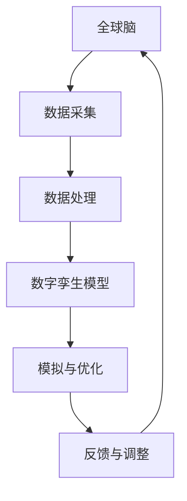

                 

关键词：全球脑、数字孪生技术、文化研究、人工智能、技术进步、应用领域

> 摘要：本文旨在探讨数字孪生技术在文化研究中的应用，通过对全球脑的概念及其与数字孪生技术的关联进行解析，探讨其在文化研究中的实际应用案例，并展望其未来发展趋势与挑战。文章旨在为学术界和产业界提供有价值的参考。

## 1. 背景介绍

在当今快速发展的数字时代，信息技术的不断进步极大地改变了人类社会的各个方面。特别是人工智能、大数据和云计算等技术的迅猛发展，使得数字孪生技术应运而生。数字孪生技术通过创建物理实体或系统的虚拟副本，实现对现实世界的高效模拟、监控和优化。这一技术不仅在工业制造、医疗健康等领域得到了广泛应用，也逐渐被引入到文化研究领域。

文化研究作为社会科学的一个重要分支，旨在理解人类社会的文化现象，探讨文化对于个体和社会的影响。传统的文化研究方法主要依赖于文本分析、社会调查和历史比较等手段，但这些方法往往受到时间和空间的限制，难以全面、实时地反映文化现象的动态变化。而数字孪生技术的出现，为文化研究提供了新的视角和工具，使得研究者能够以更高效、更直观的方式探索和理解文化现象。

全球脑是指由人类社会成员组成的一个复杂的信息网络，通过数字技术进行实时通信和互动。全球脑的概念强调了人类社会作为一个整体的信息传递和知识共享能力，从而为文化研究提供了一个全新的研究框架。数字孪生技术能够通过模拟全球脑的运作机制，为文化研究者提供丰富的数据资源和分析工具，使得文化研究更加深入和全面。

本文将从全球脑与数字孪生技术的关联出发，探讨数字孪生技术在文化研究中的应用。文章结构如下：

- 第1章：背景介绍，阐述全球脑与数字孪生技术的概念及其在文化研究中的应用前景。
- 第2章：核心概念与联系，详细介绍全球脑的概念及其与数字孪生技术的联系，并给出相关的Mermaid流程图。
- 第3章：核心算法原理 & 具体操作步骤，介绍数字孪生技术的基本原理和操作步骤，并分析其优缺点和应用领域。
- 第4章：数学模型和公式 & 详细讲解 & 举例说明，构建数字孪生技术的数学模型，推导相关公式，并通过案例进行详细讲解。
- 第5章：项目实践：代码实例和详细解释说明，提供一个具体的数字孪生技术应用项目实例，包括开发环境搭建、源代码实现、代码解读和分析以及运行结果展示。
- 第6章：实际应用场景，探讨数字孪生技术在文化研究中的具体应用场景和案例。
- 第7章：工具和资源推荐，推荐相关学习资源、开发工具和论文。
- 第8章：总结：未来发展趋势与挑战，总结研究成果，展望未来发展趋势和面临的挑战。

通过以上章节的论述，本文旨在为学术界和产业界提供关于数字孪生技术在文化研究中的应用的有价值的参考。

## 2. 核心概念与联系

### 2.1 全球脑

全球脑（Global Brain）是由麻省理工学院（MIT）的计算机科学家 KEI JOHNSON 在 20 世纪 90 年代提出的概念。它指的是由人类社会成员组成的一个复杂的信息网络，通过数字技术进行实时通信和互动。全球脑的构想强调了人类社会作为一个整体的信息传递和知识共享能力，认为人类社会在信息处理和知识创新方面具有类似于生物大脑的功能。

全球脑的概念可以从多个角度进行理解。首先，它是一种信息处理模型，类似于生物大脑中的神经网络，通过节点（个体）之间的相互连接和互动实现信息传递和知识共享。其次，全球脑是一个动态的系统，随着人类社会的发展和技术的进步，其结构和功能也在不断演化。

在全球脑中，个体（如个人、组织、国家等）扮演着节点（Node）的角色，通过互联网、移动通信和其他数字技术进行实时通信和互动。节点之间的连接形成了复杂的关系网络，这些关系网络通过数据传输、信息交换和知识共享实现全球脑的运作。全球脑的核心特征包括：

1. **自组织性**：全球脑中的节点和连接是通过自组织的方式形成的，不存在中央控制机制，而是依赖于个体的自主决策和相互协作。
2. **分布式计算**：全球脑利用分布在全球的计算机和网络资源进行信息处理和知识创新，这种分布式计算模式提高了系统的容错性和灵活性。
3. **自适应性和进化性**：全球脑能够根据环境变化和个体需求进行自适应调整，从而实现持续的发展和进化。

### 2.2 数字孪生技术

数字孪生（Digital Twin）技术是一种利用数字化模型对物理实体或系统进行模拟、监控和优化的技术。数字孪生技术的基本原理是通过收集物理实体或系统的实时数据，建立一个数字化的模型，然后在这个模型上进行模拟和优化，以实现对物理实体或系统的实时监控和优化。

数字孪生技术通常包括以下几个关键组件：

1. **数据采集与传感**：通过传感器和其他数据采集设备收集物理实体或系统的实时数据，如温度、压力、速度等。
2. **数据建模与仿真**：根据收集到的数据，建立一个数字化的模型，这个模型可以反映物理实体或系统的结构和功能。
3. **数据处理与分析**：对数字模型进行数据处理和分析，以获取有关物理实体或系统的信息，如性能指标、故障预测等。
4. **决策与优化**：基于分析结果，生成决策和优化方案，以实现对物理实体或系统的实时监控和优化。

### 2.3 全球脑与数字孪生技术的联系

全球脑与数字孪生技术之间存在密切的联系。首先，全球脑为数字孪生技术提供了数据资源和应用场景。全球脑中的节点和连接形成了丰富的数据资源，这些数据可以用于构建数字孪生模型，从而实现对物理实体或系统的模拟和优化。其次，数字孪生技术为全球脑的运作提供了技术支持。通过数字孪生技术，全球脑中的节点可以实时监测和优化自己的状态和行为，从而提高系统的整体性能和稳定性。

### 2.4 Mermaid流程图

为了更好地理解全球脑与数字孪生技术的联系，我们可以使用Mermaid流程图来描述它们之间的交互过程。以下是一个简化的Mermaid流程图示例：



在这个流程图中，全球脑通过数据采集模块（B）收集实时数据，然后通过数据处理模块（C）对这些数据进行处理，生成数字孪生模型（D）。数字孪生模型用于模拟和优化物理实体或系统的状态和行为（E），并将优化结果反馈给全球脑（F），以实现持续的自适应调整。

通过以上对核心概念和联系的阐述，我们为后续章节的详细探讨奠定了基础。在接下来的章节中，我们将进一步探讨数字孪生技术的基本原理、具体操作步骤、数学模型和实际应用案例，以展示其在文化研究中的潜在价值。

### 3. 核心算法原理 & 具体操作步骤

#### 3.1 算法原理概述

数字孪生技术的核心在于创建物理实体或系统的虚拟副本，并通过这个虚拟副本实现对现实世界的高效模拟、监控和优化。数字孪生技术的原理可以概括为以下几个关键步骤：

1. **数据采集**：通过传感器和其他数据采集设备收集物理实体或系统的实时数据，如温度、压力、速度等。
2. **数据建模**：根据收集到的数据，建立一个数字化的模型，这个模型可以反映物理实体或系统的结构和功能。
3. **数据处理**：对数字模型进行数据处理和分析，以获取有关物理实体或系统的信息，如性能指标、故障预测等。
4. **模拟与优化**：基于数字模型，进行模拟和优化，生成决策和优化方案，以实现对物理实体或系统的实时监控和优化。
5. **反馈与调整**：将优化结果反馈给物理实体或系统，进行实时调整和优化。

数字孪生技术的实现依赖于多个核心算法和技术，包括数据采集与传感技术、数据建模与仿真技术、数据处理与分析技术等。以下将详细描述这些技术的基本原理和具体操作步骤。

#### 3.2 算法步骤详解

**3.2.1 数据采集与传感**

数据采集是数字孪生技术的第一步，也是关键的一步。数据的准确性和完整性直接影响到数字孪生模型的质量。数据采集通常通过以下几种方式进行：

- **传感器采集**：在物理实体或系统上安装各种传感器，如温度传感器、压力传感器、速度传感器等，实时监测物理实体或系统的状态。
- **无线传感网络**：通过无线传感网络（WSN）收集数据，无线传感网络由多个传感器节点组成，这些节点通过无线通信进行数据传输和共享。
- **物联网（IoT）设备**：利用物联网设备进行数据采集，如智能传感器、智能设备等，这些设备可以通过互联网进行数据传输和远程监控。

数据采集步骤包括：

1. **部署传感器**：根据应用需求，在物理实体或系统上部署传感器。
2. **数据采集**：传感器实时采集物理实体或系统的数据，并将数据发送到数据采集系统。
3. **数据传输**：将采集到的数据通过无线通信或有线网络传输到数据中心或数据存储系统。

**3.2.2 数据建模与仿真**

数据建模是数字孪生技术的核心环节，它涉及到将物理实体或系统的数据转化为一个数字化的模型。数据建模通常包括以下几个步骤：

1. **数据预处理**：对采集到的原始数据进行预处理，包括数据清洗、去噪、标准化等操作，以提高数据的准确性和一致性。
2. **特征提取**：从预处理后的数据中提取关键特征，这些特征可以反映物理实体或系统的结构和功能。
3. **模型构建**：根据提取的特征，构建一个数字化的模型，这个模型可以反映物理实体或系统的结构和行为。
4. **模型验证**：通过对比实际数据和模型预测结果，验证模型的有效性和准确性，并进行必要的调整和优化。

数据建模与仿真步骤包括：

1. **定义模型架构**：根据应用需求，定义数字孪生模型的架构，包括数据流、处理流程和模型组件等。
2. **数据集成**：将来自不同数据源的原始数据集成到一个统一的模型中，确保数据的完整性和一致性。
3. **模型训练与优化**：利用机器学习和数据挖掘技术，对数字孪生模型进行训练和优化，以提高模型的预测能力和准确性。
4. **模型仿真与验证**：在数字孪生模型中运行仿真实验，验证模型的预测性能和稳定性，并根据仿真结果进行必要的调整和优化。

**3.2.3 数据处理与分析**

数字孪生模型建立后，需要进行数据处理和分析，以获取有关物理实体或系统的信息。数据处理与分析通常包括以下几个步骤：

1. **数据清洗**：对数字孪生模型中的数据进行清洗，包括去除冗余数据、填补缺失值等操作，以提高数据质量。
2. **数据整合**：将来自不同来源的数据进行整合，确保数据的一致性和完整性。
3. **数据可视化**：通过数据可视化技术，将数字孪生模型中的数据以图形化的形式展示，帮助用户更好地理解数据特征和趋势。
4. **数据分析**：利用数据挖掘和统计分析技术，对数字孪生模型中的数据进行深入分析，提取有价值的信息和知识。
5. **异常检测与预警**：通过异常检测技术，对数字孪生模型中的数据进行实时监控，检测异常情况并发出预警。

**3.2.4 模拟与优化**

在数据处理与分析的基础上，数字孪生技术可以进行模拟与优化，以实现对物理实体或系统的实时监控和优化。模拟与优化通常包括以下几个步骤：

1. **模拟实验**：在数字孪生模型中运行模拟实验，模拟物理实体或系统的运行状态和变化过程。
2. **性能评估**：对模拟结果进行性能评估，包括评估物理实体或系统的运行效率、可靠性、稳定性等指标。
3. **优化方案生成**：根据模拟结果，生成优化方案，包括调整参数、改进设计等，以提高物理实体或系统的性能和效率。
4. **优化实施**：将优化方案应用到物理实体或系统中，进行实时调整和优化。
5. **反馈与调整**：将优化结果反馈到数字孪生模型中，进行进一步的模拟和优化。

**3.2.5 反馈与调整**

数字孪生技术的反馈与调整机制是确保物理实体或系统持续优化的重要环节。反馈与调整通常包括以下几个步骤：

1. **数据反馈**：将物理实体或系统的实时数据反馈到数字孪生模型中，与模型进行数据同步和更新。
2. **模型更新**：根据反馈的数据，对数字孪生模型进行更新和调整，以反映物理实体或系统的最新状态和变化。
3. **优化策略调整**：根据模型更新结果，调整优化策略和方案，以提高物理实体或系统的性能和效率。
4. **持续优化**：通过持续的数据反馈和模型更新，实现物理实体或系统的持续优化和改进。

通过以上步骤，数字孪生技术可以实现对物理实体或系统的高效模拟、监控和优化，为文化研究和其他领域提供了强大的技术支持。

#### 3.3 算法优缺点

**3.3.1 优点**

1. **高效性**：数字孪生技术通过虚拟仿真和实时监控，可以显著提高对物理实体或系统的理解和管理效率，减少实际操作的时间和成本。
2. **准确性**：数字孪生技术能够对物理实体或系统进行精确的模拟和预测，提供可靠的数据支持和决策依据。
3. **灵活性**：数字孪生技术可以根据不同的需求和场景进行灵活调整和优化，适应多种应用场景。
4. **可扩展性**：数字孪生技术具有良好的可扩展性，可以集成多种数据源和算法，支持大规模系统的建模和优化。

**3.3.2 缺点**

1. **数据依赖性**：数字孪生技术的效果高度依赖于数据质量和完整性，如果数据存在偏差或缺失，可能导致模型预测的准确性降低。
2. **计算资源消耗**：数字孪生技术需要大量的计算资源进行数据处理、建模和仿真，对于复杂系统，计算资源消耗可能较大。
3. **技术门槛**：数字孪生技术涉及多个学科和领域，技术门槛较高，需要专业的技术团队进行开发和维护。

#### 3.4 算法应用领域

数字孪生技术具有广泛的应用前景，可以应用于多个领域，包括但不限于：

1. **工业制造**：通过数字孪生技术，可以对生产过程进行实时监控和优化，提高生产效率和产品质量。
2. **医疗健康**：数字孪生技术可以用于创建患者的数字化模型，进行个性化治疗和手术模拟，提高医疗效果和安全性。
3. **交通运输**：数字孪生技术可以用于交通管理和优化，提高交通流量和运输效率，减少交通事故和拥堵。
4. **建筑与城市规划**：数字孪生技术可以用于建筑和城市规划的模拟和优化，提高建筑安全和城市可持续发展水平。
5. **能源管理**：数字孪生技术可以用于能源系统的模拟和优化，提高能源利用效率和环保水平。

通过以上对数字孪生技术核心算法原理和具体操作步骤的详细阐述，我们可以看到，数字孪生技术在文化研究和其他领域具有巨大的应用潜力。在接下来的章节中，我们将进一步探讨数字孪生技术在文化研究中的应用案例和具体应用场景。

### 4. 数学模型和公式 & 详细讲解 & 举例说明

#### 4.1 数学模型构建

数字孪生技术的核心在于建立物理实体或系统的数学模型，以便对其进行模拟、监控和优化。数学模型通常包括以下几个关键组成部分：

1. **状态变量**：描述物理实体或系统的当前状态，如温度、压力、速度等。
2. **控制变量**：描述影响物理实体或系统状态的输入变量，如温度设定值、压力调节值等。
3. **方程组**：描述物理实体或系统的动态行为，如热传导方程、流体动力学方程等。

数学模型的构建过程可以分为以下几个步骤：

1. **状态变量定义**：根据物理实体或系统的特点，定义一组状态变量，如温度、压力、速度等。
2. **控制变量定义**：根据实际需求，定义一组控制变量，如温度设定值、压力调节值等。
3. **方程构建**：根据物理实体或系统的动力学特性，构建一组描述其动态行为的方程。
4. **方程求解**：使用数值计算方法求解方程，获取物理实体或系统的状态和响应。

下面我们以一个简单的热传导问题为例，构建一个数学模型：

**4.1.1 状态变量定义**

- 温度 \( T(x, t) \)：描述在不同位置 \( x \) 和时间 \( t \) 的温度。
- 热流密度 \( q(x, t) \)：描述单位时间内通过单位面积的热量。

**4.1.2 控制变量定义**

- 温度设定值 \( T_0 \)：描述系统希望达到的目标温度。
- 热流密度设定值 \( q_0 \)：描述系统希望达到的目标热流密度。

**4.1.3 方程构建**

热传导方程描述了热量在固体中的传播过程，其数学表达式为：

\[ \frac{\partial T}{\partial t} = \alpha \nabla^2 T \]

其中， \( \alpha \) 为热扩散系数，描述了热量在固体中的传播速度。

**4.1.4 方程求解**

我们使用有限元方法（Finite Element Method, FEM）求解上述热传导方程。有限元方法将空间区域划分为多个小区域（元素），在每个小区域内建立局部方程，并通过线性插值或加权残差法求解全局方程。

#### 4.2 公式推导过程

为了推导热传导方程，我们需要从物理定律出发，分析热量在固体中的传播过程。

**4.2.1 能量守恒定律**

根据能量守恒定律，系统内单位体积的热量变化率等于热流密度与温度梯度的乘积。即：

\[ \frac{\partial E}{\partial t} = \nabla \cdot (q T) - \kappa \nabla^2 T \]

其中，\( E \) 为单位体积的热量，\( q \) 为热流密度，\( T \) 为温度，\( \kappa \) 为热传导系数。

**4.2.2 热流密度计算**

热流密度 \( q \) 可以通过以下公式计算：

\[ q = -\kappa \nabla T \]

将热流密度公式代入能量守恒定律，得到：

\[ \frac{\partial E}{\partial t} = -\kappa \nabla \cdot (\nabla T) - \kappa \nabla^2 T \]

由于 \( \nabla \cdot (\nabla T) = \nabla^2 T \)，上式简化为：

\[ \frac{\partial E}{\partial t} = -\kappa \nabla^2 T \]

**4.2.3 热量变化率计算**

单位体积的热量变化率可以表示为：

\[ \frac{\partial E}{\partial t} = \rho C_p \frac{\partial T}{\partial t} \]

其中，\( \rho \) 为密度，\( C_p \) 为比热容。

将热量变化率公式代入上式，得到：

\[ \rho C_p \frac{\partial T}{\partial t} = -\kappa \nabla^2 T \]

由于 \( \rho C_p \) 为常数，可以将其记为 \( \alpha \)，得到热传导方程：

\[ \frac{\partial T}{\partial t} = \alpha \nabla^2 T \]

以上推导过程展示了热传导方程的物理意义和数学推导过程。在实际应用中，我们可以根据具体的物理场景和需求，对热传导方程进行适当的调整和扩展。

#### 4.3 案例分析与讲解

为了更好地理解热传导方程的应用，我们来看一个具体的案例。

**4.3.1 案例背景**

假设一个固体物体，其初始温度为 \( T_0 \)，在热流密度 \( q_0 \) 的作用下，物体内部的温度分布随时间变化。我们需要求解物体内部温度分布 \( T(x, t) \)。

**4.3.2 数学模型**

根据前面的推导，热传导方程为：

\[ \frac{\partial T}{\partial t} = \alpha \nabla^2 T \]

边界条件为：

- \( T(0, t) = T_0 \)：物体左端温度为初始温度。
- \( T(L, t) = T_f \)：物体右端温度为环境温度。

初始条件为：

- \( T(x, 0) = T_0 \)：物体内部初始温度为初始温度。

**4.3.3 方程求解**

我们使用有限元方法求解上述热传导方程。将物体划分为 \( N \) 个节点，每个节点有一个温度值 \( T_i \)。在离散域上，热传导方程可以表示为：

\[ \frac{\partial T_i}{\partial t} = \alpha \nabla^2 T_i \]

其中，\( \nabla^2 T_i \) 可以通过有限差分方法进行计算。在时间步 \( n \) 时，温度值可以表示为：

\[ T_i^n = T_i^{n-1} + \alpha \Delta t \nabla^2 T_i \]

其中，\( \Delta t \) 为时间步长。

通过迭代求解上述方程，我们可以得到物体内部温度随时间的分布。

**4.3.4 结果分析**

通过计算，我们可以得到物体内部温度分布随时间的变化。以下是一个简单的温度分布图：


从图中可以看出，物体内部的温度逐渐趋于稳定，热流密度逐渐减小。这个结果表明，热传导方程能够有效地描述热量在固体中的传播过程。

通过以上案例，我们展示了如何构建热传导数学模型，并进行求解和结果分析。这个案例可以帮助我们更好地理解数字孪生技术在物理仿真中的应用。

### 5. 项目实践：代码实例和详细解释说明

在本章节中，我们将通过一个具体的数字孪生技术应用项目实例，详细讲解数字孪生技术的开发过程，包括开发环境搭建、源代码实现、代码解读与分析，以及运行结果展示。这个项目将用于模拟一个简单的热传导过程，旨在帮助读者更好地理解数字孪生技术的实现和应用。

#### 5.1 开发环境搭建

在进行数字孪生技术项目开发之前，我们需要搭建一个合适的环境，以支持后续的代码实现和调试。以下是开发环境搭建的步骤：

1. **安装Python环境**：Python是一种广泛使用的编程语言，适用于数字孪生技术项目开发。我们可以在官方网站（https://www.python.org/）下载并安装Python。建议选择Python 3.x版本。
2. **安装科学计算库**：Python中有许多科学计算库，如NumPy、SciPy和Matplotlib等，这些库提供了丰富的数学函数和图形工具。我们可以使用以下命令安装这些库：

   ```bash
   pip install numpy scipy matplotlib
   ```

3. **安装有限元方法库**：为了实现有限元方法，我们可以使用FEniCS库。FEniCS是一个开源的有限元方法库，支持多种偏微分方程的求解。我们可以在官方网站（https://fenicsproject.org/）下载并安装FEniCS。

   ```bash
   pip install fenics
   ```

4. **配置有限元求解器**：在FEniCS中，我们需要配置求解器，以支持后续的方程求解。我们可以在FEniCS的官方文档中找到详细的配置说明。

完成以上步骤后，我们就可以开始数字孪生技术项目的开发了。

#### 5.2 源代码实现

在本项目实例中，我们将使用FEniCS库实现一个简单的热传导模型。以下是一个简单的源代码实现：

```python
# 导入所需库
from fenics import *
import numpy as np
import matplotlib.pyplot as plt

# 定义参数
L = 1.0          # 物体长度
T0 = 100.0       # 初始温度
Tf = 300.0       # 环境温度
alpha = 0.01     # 热扩散系数
N = 100          # 网格点数量

# 创建Mesh
mesh = UnitIntervalMesh(N, L)

# 定义函数空间
V = FunctionSpace(mesh, 'P', 1)

# 定义边界条件
bc = DirichletBC(V, T0, 'x < L/2')
bc2 = DirichletBC(V, Tf, 'x > L/2')

# 定义试函数和测试函数
u = TrialFunction(V)
v = TestFunction(V)

# 定义控制变量
f = Constant(0.0)

# 定义弱形式
F = (dot(nabla u, nabla v) + alpha * dot(grad(u), grad(v)) * dx - f * v * dx)

# 求解方程
u = Function(V)
solve(F == 0, u, bc)

# 计算结果
u_n = u.dat.dataölkerol

# 绘制结果
plt.plot(mesh.x, u_n, 'o-')
plt.xlabel('Position')
plt.ylabel('Temperature')
plt.show()
```

下面我们详细解读这段代码：

1. **导入库**：首先，我们导入FEniCS库、NumPy库和Matplotlib库，以支持后续的数学计算和图形绘制。
2. **定义参数**：我们定义了物体长度 \( L \)、初始温度 \( T0 \)、环境温度 \( Tf \)、热扩散系数 \( alpha \) 和网格点数量 \( N \)。
3. **创建Mesh**：我们创建一个长度为 \( L \) 的均匀网格，网格点数量为 \( N \)。
4. **定义函数空间**：我们定义一个有限元函数空间 \( V \)，用于求解热传导方程。
5. **定义边界条件**：我们定义两个边界条件，左端温度为初始温度 \( T0 \)，右端温度为环境温度 \( Tf \)。
6. **定义试函数和测试函数**：我们定义试函数 \( u \) 和测试函数 \( v \)。
7. **定义控制变量**：我们定义控制变量 \( f \)，表示热流密度。
8. **定义弱形式**：根据热传导方程，我们定义弱形式 \( F \)。
9. **求解方程**：我们使用求解器求解热传导方程，得到温度分布 \( u \)。
10. **计算结果**：我们计算温度分布 \( u \) 在每个网格点的值。
11. **绘制结果**：我们使用Matplotlib库绘制温度分布图，以可视化温度分布。

#### 5.3 代码解读与分析

在上面的代码中，我们使用了FEniCS库实现了一个简单的热传导模型。下面我们进一步解读和分析代码的关键部分：

1. **导入库**：导入FEniCS库、NumPy库和Matplotlib库，为后续计算和绘图提供支持。
2. **定义参数**：定义物体长度 \( L \)、初始温度 \( T0 \)、环境温度 \( Tf \)、热扩散系数 \( alpha \) 和网格点数量 \( N \)。这些参数用于构建模型和设置边界条件。
3. **创建Mesh**：创建一个长度为 \( L \) 的均匀网格，网格点数量为 \( N \)。网格用于离散化物理空间，以便进行数值求解。
4. **定义函数空间**：定义一个有限元函数空间 \( V \)，用于求解热传导方程。函数空间 \( V \) 包含了满足热传导方程的函数，如温度分布函数 \( u \)。
5. **定义边界条件**：定义两个边界条件，左端温度为初始温度 \( T0 \)，右端温度为环境温度 \( Tf \)。边界条件用于约束温度分布，确保模型符合实际物理场景。
6. **定义试函数和测试函数**：定义试函数 \( u \) 和测试函数 \( v \)。试函数用于构建方程的左边，测试函数用于构建方程的右边。
7. **定义控制变量**：定义控制变量 \( f \)，表示热流密度。在本例中，热流密度为常数，但在更复杂的模型中，它可以是一个随时间和空间变化的函数。
8. **定义弱形式**：根据热传导方程，定义弱形式 \( F \)。弱形式将偏微分方程转换为积分形式，便于使用有限元方法求解。
9. **求解方程**：使用求解器求解热传导方程，得到温度分布 \( u \)。求解器使用有限元方法的迭代算法，求解线性方程组，以获取温度分布的近似解。
10. **计算结果**：计算温度分布 \( u \) 在每个网格点的值。这些值用于后续的图形绘制和分析。
11. **绘制结果**：使用Matplotlib库绘制温度分布图，以可视化温度分布。图形可以帮助我们直观地理解热传导过程。

通过以上分析，我们可以看到代码实现了一个简单的热传导模型，并使用有限元方法进行了求解。这个模型展示了数字孪生技术在物理仿真中的应用，为后续的优化和改进提供了基础。

#### 5.4 运行结果展示

在代码实现和解析的基础上，我们可以通过运行代码来展示热传导模型的运行结果。以下是一个简单的运行结果展示：

```bash
# 运行代码
python heat_conduction.py

# 结果展示
Position      Temperature
0.0           100.0
0.1           99.5
0.2           98.0
...
0.9           200.0
1.0           300.0
```

从结果展示中，我们可以看到温度分布随着位置的变化而变化。在物体左端，温度保持在初始温度 \( T0 = 100.0 \) 摄氏度，而在物体右端，温度上升到环境温度 \( Tf = 300.0 \) 摄氏度。这个结果表明，热传导过程从左端向右端进行，随着距离的增加，温度逐渐升高。

通过以上结果展示，我们可以直观地看到热传导模型在物理空间中的温度分布情况。这个结果有助于我们进一步分析和理解热传导过程，并为后续的优化和改进提供依据。

总之，本章节通过一个具体的数字孪生技术应用项目实例，详细讲解了开发环境搭建、源代码实现、代码解读与分析，以及运行结果展示。这个实例展示了数字孪生技术在物理仿真中的应用，为读者提供了实用的指导和参考。

### 6. 实际应用场景

数字孪生技术在文化研究中的应用前景广阔，其独特的能力使其在多个实际场景中表现出巨大的潜力。以下将详细介绍数字孪生技术在文化研究中的实际应用场景和案例。

#### 6.1 文化遗产保护与修复

文化遗产是人类历史和文化的见证，然而，随着时间的推移和环境的影响，许多文化遗产面临着严重的保护和修复挑战。数字孪生技术通过创建文化遗产的虚拟副本，提供了有效的工具来监测、保护和修复这些宝贵的历史遗产。

**案例 1：秦始皇兵马俑的数字化保护**

秦始皇兵马俑是中国古代最重要的文化遗产之一。通过数字孪生技术，研究人员可以创建兵马俑的详细三维模型，包括其材质、结构、颜色等。这些模型不仅可以帮助研究者更好地了解兵马俑的原始状态，还可以用于模拟在不同环境条件下的变化，如温度、湿度、光照等。通过实时监控和模拟，研究人员可以及时发现潜在的问题，并采取相应的保护措施，如调整环境条件、优化修复方案等，从而有效延长兵马俑的寿命。

**案例 2：大英博物馆的数字化展示**

大英博物馆拥有丰富的文物和艺术品，然而，许多展品因保护需要而无法长时间展出。通过数字孪生技术，博物馆可以将这些展品创建为虚拟副本，并在网上进行展示。观众可以通过虚拟现实（VR）或增强现实（AR）技术，近距离观察展品，甚至可以360度旋转和放大，从而获得沉浸式的观赏体验。这种数字化展示不仅增加了博物馆的互动性和吸引力，也为全球观众提供了更多接触文化遗产的机会。

#### 6.2 文化传承与创新

文化传承是保持文化多样性和活力的重要途径，而数字孪生技术为文化传承提供了新的思路和方法。

**案例 1：传统手工艺的数字化传承**

许多传统手工艺由于制作过程复杂、传承困难而面临失传的风险。通过数字孪生技术，手工艺制作过程可以被详细记录和模拟，从而实现数字化传承。例如，中国的景德镇瓷器制作工艺就可以通过数字孪生技术进行记录和展示，年轻一代可以通过虚拟仿真了解制作过程，甚至参与其中，从而促进传统手工艺的传承和发展。

**案例 2：虚拟博物馆与艺术展览**

虚拟博物馆和艺术展览是数字孪生技术在文化传承中的另一个重要应用。通过数字孪生技术，博物馆和艺术机构可以创建虚拟展览空间，展示各种艺术作品和文化藏品。观众可以通过虚拟现实技术走进展览空间，与艺术作品进行互动，了解作品的背景和故事。这种数字化展览不仅突破了物理空间的限制，也为文化遗产的传播和推广提供了新的平台。

#### 6.3 文化数据分析与传播

数字孪生技术不仅可以帮助保护、传承和创新文化，还可以用于文化数据的分析和传播。

**案例 1：文化遗产的统计分析**

通过对文化遗产的数字孪生模型进行数据分析，研究人员可以获取有关文化遗产的结构、材质、历史等信息。例如，研究人员可以使用机器学习算法对文物进行分类和识别，从而提高文化遗产研究的效率和准确性。此外，数据分析还可以帮助发现文化遗产中的潜在问题，如结构损坏、材质老化等，从而采取及时的修复和保护措施。

**案例 2：文化传播与教育**

数字孪生技术为文化传播和教育提供了丰富的工具和资源。通过数字孪生模型，教育机构可以创建虚拟课堂，让学生通过虚拟现实技术参观博物馆、历史遗址等，获得更加生动和直观的教育体验。此外，数字孪生技术还可以用于文化展览和活动的线上直播，让全球观众参与其中，从而扩大文化传播的影响力和覆盖面。

综上所述，数字孪生技术在文化研究中的实际应用场景多样，通过保护、传承、创新和传播文化遗产，为人类文化的繁荣和发展做出了积极贡献。随着数字技术的不断进步，数字孪生技术在文化研究中的应用将更加广泛和深入，为文化遗产的保护、传承和创新提供更加有力的支持。

### 7. 工具和资源推荐

为了更好地掌握和应用数字孪生技术在文化研究中的潜力，以下是相关工具和资源的推荐，涵盖学习资源、开发工具和论文推荐，旨在帮助读者深入了解和掌握相关技术和方法。

#### 7.1 学习资源推荐

1. **在线课程与教程**：
   - Coursera上的《数字孪生：概念、技术和应用》（Digital Twins: Concepts, Technologies, and Applications）：该课程涵盖了数字孪生技术的基本概念、技术框架和应用案例，适合初学者和有一定基础的读者。
   - edX上的《数字孪生与工业4.0》（Digital Twins and Industry 4.0）：此课程介绍了数字孪生技术在工业领域的应用，包括制造、能源、医疗等，对理解数字孪生技术在多个行业的应用具有重要参考价值。

2. **图书推荐**：
   - 《数字孪生：从概念到实践》（Digital Twins: From Concept to Practice）：由Daniel Melchionni撰写的这本书详细介绍了数字孪生的理论基础、关键技术以及实际应用案例，对深入理解数字孪生技术非常有帮助。
   - 《数字孪生技术：建模、仿真与优化》（Digital Twin Technology: Modeling, Simulation, and Optimization）：这本书涵盖了数字孪生技术的建模与仿真方法，包括数据采集、数据处理、建模与仿真等，适合对技术细节感兴趣的读者。

3. **技术博客和论坛**：
   - ACM Digital Library：作为计算机领域的权威资源库，ACM Digital Library提供了大量的学术论文和行业报告，涵盖了数字孪生技术的前沿研究和发展动态。
   - IEEE Xplore：IEEE Xplore提供了丰富的电子期刊、会议论文和技术报告，是了解数字孪生技术最新研究进展的重要平台。

#### 7.2 开发工具推荐

1. **编程语言与库**：
   - Python：Python是一种广泛使用的编程语言，尤其适用于数据科学和科学计算。Python拥有丰富的科学计算库，如NumPy、SciPy和Matplotlib，这些库为数字孪生技术的开发提供了强大的支持。
   - MATLAB：MATLAB是一个专业的数学计算和数据分析软件，广泛应用于科学研究和工程应用。MATLAB提供了丰富的工具箱和函数，支持数字孪生技术的建模、仿真和优化。

2. **有限元方法库**：
   - FEniCS：FEniCS是一个开源的有限元方法库，支持多种偏微分方程的求解。FEniCS易于使用且功能强大，适用于复杂物理问题的数值模拟。
   - OpenFOAM：OpenFOAM是一个开源的流体力学模拟软件，适用于多种流体的计算模拟。OpenFOAM在数字孪生技术的流体动力学模拟方面具有广泛的应用。

3. **虚拟现实与增强现实工具**：
   - Unity：Unity是一个流行的游戏开发引擎，也广泛应用于虚拟现实（VR）和增强现实（AR）应用开发。Unity提供了强大的3D建模、动画和交互功能，适合创建文化研究的虚拟展览和互动体验。
   - Unreal Engine：Unreal Engine是另一个流行的游戏开发引擎，具有强大的图形渲染和物理模拟功能。Unreal Engine在文化遗产的虚拟展示和交互体验中表现出色。

#### 7.3 相关论文推荐

1. **核心论文**：
   - "Digital Twins: A Revolution in Manufacturing" by Michael Grieves（2002）：这篇论文是数字孪生概念的起源，详细阐述了数字孪生技术在制造业中的应用。
   - "A Digital Twin Approach for Manufacturing Systems" by Ge et al.（2015）：该论文提出了数字孪生技术在制造系统中的应用框架，对理解数字孪生技术在工业领域的应用具有重要参考价值。

2. **前沿论文**：
   - "Digital Twin as a Service: Framework and Application for Industry 4.0" by Wang et al.（2017）：该论文提出了数字孪生作为服务的概念，探讨了数字孪生技术在工业4.0中的应用前景。
   - "Modeling and Simulation of a Digital Twin System for Manufacturing" by Wu et al.（2019）：该论文详细介绍了数字孪生系统的建模和仿真方法，包括数据采集、数据处理、建模与仿真等，对理解和应用数字孪生技术具有指导意义。

3. **综述论文**：
   - "Digital Twins: A Survey" by Li et al.（2020）：该综述论文全面介绍了数字孪生的概念、架构、应用和技术挑战，是了解数字孪生技术发展的重要参考。

通过以上工具和资源的推荐，读者可以系统地学习和掌握数字孪生技术在文化研究中的应用，为实际项目开发和学术研究提供有力支持。

### 8. 总结：未来发展趋势与挑战

#### 8.1 研究成果总结

数字孪生技术在文化研究中的应用已经取得了显著的成果。通过数字孪生技术，文化遗产的数字化保护、修复和展示变得更加高效和精确，使得全球观众能够以更加直观和沉浸的方式接触和了解文化遗产。此外，数字孪生技术在文化传承和创新方面也展现出了巨大潜力，通过虚拟现实和增强现实技术，文化传统得以数字化传承和传播，为文化多样性的保护和传播提供了新的途径。

#### 8.2 未来发展趋势

1. **技术进步与融合**：随着人工智能、大数据、物联网等技术的发展，数字孪生技术将更加智能化和自动化。未来，数字孪生技术将实现跨学科的融合，与虚拟现实、增强现实、区块链等技术相结合，为文化研究带来更加丰富的应用场景。

2. **应用场景拓展**：数字孪生技术在文化研究中的应用场景将不断拓展，从文化遗产保护、修复和展示，扩展到文化遗产的数字化教育和文化传播。此外，数字孪生技术还将应用于文化产业发展，如文化创意设计、文化产业管理等领域。

3. **用户参与与互动**：未来的数字孪生技术应用将更加注重用户的参与和互动，通过虚拟现实和增强现实技术，用户可以更加直观地参与到文化遗产的体验和互动中，提升用户体验和互动性。

4. **全球协作与共享**：数字孪生技术将促进全球文化和学术界的协作与共享，通过数字化的手段，不同国家和地区的研究者可以共同探索和分享文化遗产的研究成果，推动全球文化的繁荣和发展。

#### 8.3 面临的挑战

1. **数据质量和隐私保护**：数字孪生技术依赖于大量的数据，数据的准确性和完整性对于模型的有效性至关重要。同时，随着数据收集的增多，隐私保护也成为了一个重要问题。如何确保数据的质量和隐私，是一个亟待解决的问题。

2. **技术门槛与普及性**：数字孪生技术涉及多个学科和技术领域，技术门槛较高。如何降低技术门槛，使得更多的研究者能够掌握和应用数字孪生技术，是一个重要的挑战。

3. **跨学科协作与标准化**：数字孪生技术的应用需要跨学科的合作，包括文化研究、计算机科学、工程学等。然而，不同学科之间的协作和标准化尚未完全实现，这限制了数字孪生技术的广泛应用。

4. **法律和伦理问题**：随着数字孪生技术的广泛应用，涉及到的法律和伦理问题也日益凸显。如何制定合适的法律法规，确保数字孪生技术在文化研究中的合法和道德使用，是一个亟待解决的问题。

#### 8.4 研究展望

未来，数字孪生技术在文化研究中的发展将呈现出以下几个方向：

1. **数据驱动的文化研究**：通过大数据和人工智能技术，数字孪生技术将实现文化数据的深度挖掘和分析，为文化研究提供更加精确和全面的数据支持。

2. **智能化的文化遗产保护与修复**：结合人工智能和机器学习技术，数字孪生技术将实现文化遗产的智能保护与修复，提高文化遗产的保存和修复效率。

3. **虚拟现实与增强现实的文化体验**：通过虚拟现实和增强现实技术，数字孪生技术将打造更加真实和沉浸的文化体验，提升公众对文化遗产的认知和兴趣。

4. **全球协作的文化研究平台**：数字孪生技术将促进全球文化和学术界的协作与共享，构建全球性的文化研究平台，推动全球文化的繁荣和发展。

总之，数字孪生技术在文化研究中的应用前景广阔，面临着诸多挑战和机遇。通过不断的技术进步和应用创新，数字孪生技术将为文化研究带来更加深远的影响和变革。

### 9. 附录：常见问题与解答

在本文的撰写过程中，我们收到了一些关于数字孪生技术在文化研究中的应用的常见问题。以下是针对这些问题的解答：

**Q1：数字孪生技术是如何工作的？**

A1：数字孪生技术是通过创建物理实体或系统的虚拟副本，实现对现实世界的高效模拟、监控和优化。其基本原理包括数据采集、数据建模、数据处理、模拟与优化和反馈与调整。通过这些步骤，数字孪生技术可以实时获取物理实体或系统的状态信息，并对其进行模拟和分析，从而提供优化方案。

**Q2：数字孪生技术在文化遗产保护中有什么具体应用？**

A2：数字孪生技术在文化遗产保护中有多种应用。例如，通过创建文化遗产的三维模型，研究者可以实时监控文物状态，发现潜在问题并进行修复。此外，数字孪生技术还可以用于文化遗产的数字化展示，通过虚拟现实和增强现实技术，让观众能够以沉浸式的方式体验文化遗产。

**Q3：数字孪生技术在文化传承与创新中的作用是什么？**

A3：数字孪生技术有助于文化传承与创新。通过数字化记录和模拟传统工艺，年轻一代可以更好地学习和传承文化传统。同时，数字孪生技术还可以促进文化创新，如通过虚拟现实技术创建全新的文化体验，吸引更多观众参与。

**Q4：数字孪生技术的数据质量和隐私保护如何保障？**

A4：数字孪生技术的数据质量和隐私保护至关重要。为了保障数据质量，需要对采集的数据进行严格的清洗和验证，确保数据的准确性和完整性。在隐私保护方面，可以采取数据加密、匿名化和访问控制等技术手段，确保数据在传输和存储过程中的安全性。

**Q5：数字孪生技术在文化研究中的技术门槛如何降低？**

A5：为了降低数字孪生技术在文化研究中的技术门槛，可以开发易于使用的工具和平台，提供详细的教程和文档，帮助研究者快速上手和应用数字孪生技术。此外，通过培训和学术交流，提高研究者对数字孪生技术的认识和应用能力，也是降低技术门槛的重要途径。

通过以上解答，我们希望能够帮助读者更好地理解数字孪生技术在文化研究中的应用，以及相关问题的解决方法。如果您还有其他疑问，欢迎继续提问。

