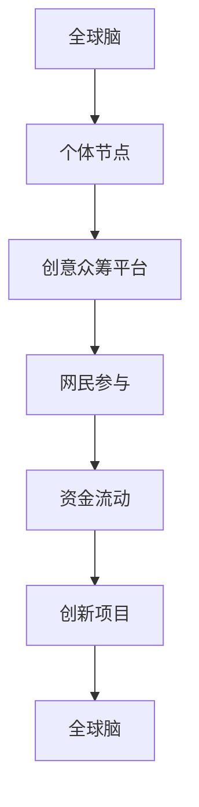

                 

关键词：全球脑、创意众筹、集体创新、协作、技术、开放平台、人工智能、协作网络、影响力。

## 摘要

本文探讨了全球脑与创意众筹的崛起如何为集体创新提供了前所未有的力量。通过分析全球脑的概念、运作机制以及创意众筹的兴起，我们揭示了这种新型协作模式如何激发人类创造力和创新潜力，并推动了技术领域的进步。本文旨在为读者提供一个全面而深入的理解，并探讨这一领域未来的发展趋势和面临的挑战。

## 1. 背景介绍

### 全球脑的崛起

全球脑（Global Brain）是一个由心理学家、社会学家和未来学家提出的概念，形象地比喻为人类智慧和知识的全球性扩展与互联。这个概念源于生物学中“群体智能”的理念，认为人类社会中的个体和集体智能可以相互交织、融合，形成一种庞大的、智能的分布式网络。

全球脑的崛起与互联网技术的飞速发展密不可分。随着互联网的普及，人们可以随时随地连接到全球网络，分享知识、创意和资源。这种连接不仅改变了信息的传播方式，也改变了人类互动的模式。人们不再局限于单一地点的知识交流，而是可以在全球范围内进行跨文化、跨学科的交流与合作。

### 创意众筹的兴起

创意众筹（Crowdfunding for Creativity）是一种通过互联网平台，由广大网民对创意项目进行支持和投资的新型融资方式。这种模式最早源于2009年的Kickstarter平台，随后迅速在全球范围内扩展，涌现出了众多类似平台，如Indiegogo、GoFundMe等。

创意众筹的核心在于集体参与和共同决策。项目的发起人可以发布自己的创意项目，详细介绍项目的背景、目标和所需资金，网民则通过浏览、讨论和投资来支持这些项目。众筹平台提供了一个透明的环境，让项目进展和资金流向都处于公众监督之下，从而大大提高了资金的利用效率和项目的成功率。

## 2. 核心概念与联系

### 全球脑与创意众筹的关系

全球脑与创意众筹之间存在着紧密的联系。全球脑的概念为创意众筹提供了理论基础，而创意众筹则是全球脑在实际运作中的重要体现。

首先，全球脑的理念强调了集体智慧和协作的重要性。创意众筹平台通过汇集全球网民的力量，实现了创意和资金的集合，从而催生了大量创新项目。这种集体协作的模式不仅提高了项目的成功率，也加速了创新的速度。

其次，全球脑的分布式网络特性与创意众筹平台的去中心化结构相契合。在全球脑中，每一个个体都可以作为一个节点，通过互联网连接形成一个庞大的网络。创意众筹平台也通过互联网连接全球网民，使得资金和创意的流动更加高效。

### Mermaid 流程图



在这个流程图中，个体节点通过创意众筹平台连接成一个全球脑，网民参与资金流动，最终推动创新项目的产生和发展。

### 核心概念原理

1. **全球脑**：全球脑是一个由个体节点和连接构成的智能网络，代表了人类智慧和知识的全球化扩展。个体节点可以是个人、组织或团体，通过互联网相互连接，形成一个庞大的分布式系统。

2. **创意众筹平台**：创意众筹平台是一个在线融资平台，允许项目发起人发布项目并接受公众投资。平台的运行机制基于透明、公开和去中心化，使得创意和资金的高效流动成为可能。

3. **网民参与**：网民通过浏览、讨论和投资参与创意众筹项目。这种参与不仅为项目提供了资金支持，也为项目提供了反馈和改进的机会。

4. **资金流动**：创意众筹平台上的资金流动是公开透明的，网民可以看到项目的进展和资金的使用情况，从而提高信任度和资金使用效率。

5. **创新项目**：创新项目是创意众筹平台上的核心内容。通过全球脑和创意众筹平台的支持，创新项目得以快速孵化和发展，推动了技术领域的进步。

## 3. 核心算法原理 & 具体操作步骤

### 3.1 算法原理概述

全球脑与创意众筹的核心算法原理在于通过分布式网络和协作机制，实现创意和资金的集合与优化。具体来说，算法包括以下几个关键步骤：

1. **创意收集与筛选**：全球脑通过互联网收集各种创意，并对创意进行筛选，确保创意的创新性和可行性。

2. **资金匹配与分配**：创意众筹平台通过智能算法匹配网民的投资意向与创意项目，实现资金的高效流动。

3. **项目监控与反馈**：全球脑对创意项目的进展进行实时监控，并通过反馈机制提高项目的成功率。

4. **风险管理与优化**：创意众筹平台通过数据分析和管理，降低项目风险，优化资金使用效率。

### 3.2 算法步骤详解

1. **创意收集与筛选**：
   - **数据采集**：全球脑通过搜索引擎、社交媒体和创意平台等渠道，收集各种创意数据。
   - **数据分析**：使用自然语言处理和机器学习算法，对创意数据进行分析和筛选，识别出具有创新性和可行性的创意。

2. **资金匹配与分配**：
   - **投资意向收集**：创意众筹平台通过用户注册和问卷调查等方式，收集网民的投资意向。
   - **匹配算法**：使用智能算法，将网民的投资意向与创意项目进行匹配，确保投资与创意的高度契合。

3. **项目监控与反馈**：
   - **实时监控**：全球脑通过数据分析和监控工具，实时跟踪创意项目的进展，及时发现和解决问题。
   - **反馈机制**：项目发起人通过平台向支持者提供项目进展报告，并通过问卷调查等方式收集反馈，不断优化项目。

4. **风险管理与优化**：
   - **风险评估**：创意众筹平台通过风险评估模型，对创意项目进行风险评估，降低项目风险。
   - **优化资金使用**：通过数据分析和管理，优化资金使用，提高资金使用效率。

### 3.3 算法优缺点

**优点**：
1. **高效性**：通过分布式网络和智能算法，创意和资金的高效流动成为可能，大大提高了项目的孵化和发展速度。
2. **透明性**：创意众筹平台提供了透明的资金流动和项目进展，提高了信任度和资金使用效率。
3. **多样性**：全球脑和创意众筹平台吸引了全球各地的创意者和投资者，促进了不同文化和领域的交流与合作。

**缺点**：
1. **风险性**：创意众筹项目的风险相对较高，部分项目可能失败，导致资金损失。
2. **监管难度**：全球脑和创意众筹平台涉及跨地区、跨文化的运作，监管难度较大，可能存在法律和道德风险。

### 3.4 算法应用领域

全球脑与创意众筹算法在多个领域具有广泛应用：

1. **科技创新**：通过创意众筹平台，科技项目可以快速获得资金支持和市场反馈，加速科技成果的转化。
2. **文化创意**：创意众筹平台为文化创意项目提供了广阔的市场空间，促进了文化多样性和创新。
3. **社会公益**：全球脑和创意众筹平台可以用于社会公益项目，吸引更多资源和支持，推动社会问题的解决。

## 4. 数学模型和公式 & 详细讲解 & 举例说明

### 4.1 数学模型构建

全球脑与创意众筹的数学模型主要涉及以下两个方面：

1. **创意价值评估模型**：用于评估创意项目的创新性和可行性。
2. **资金流动模型**：用于分析创意众筹平台上的资金流动规律。

### 4.2 公式推导过程

#### 创意价值评估模型

假设创意项目为C，包含以下特征：

- 创新性（Innovativeness）
- 可行性（Feasibility）
- 市场潜力（Market Potential）

创意价值评估模型可以通过以下公式表示：

\[ V(C) = w_1 \cdot I(C) + w_2 \cdot F(C) + w_3 \cdot M(C) \]

其中：

- \( V(C) \) 表示创意项目C的价值
- \( w_1, w_2, w_3 \) 分别为创新性、可行性和市场潜力的权重
- \( I(C), F(C), M(C) \) 分别为创意项目的创新性、可行性和市场潜力评分

#### 资金流动模型

假设创意项目C的资金流动为F，包含以下特征：

- 投资金额（Amount of Investment）
- 投资周期（Investment Cycle）
- 投资回报率（Return on Investment）

资金流动模型可以通过以下公式表示：

\[ F(C) = A(C) \cdot T(C) \cdot R(C) \]

其中：

- \( F(C) \) 表示创意项目C的资金流动
- \( A(C) \) 表示创意项目C的投资金额
- \( T(C) \) 表示创意项目C的投资周期
- \( R(C) \) 表示创意项目C的投资回报率

### 4.3 案例分析与讲解

#### 案例一：科技创新项目

假设有一个科技创新项目，名为“智能健康助手”。该项目具有以下特征：

- 创新性（I）：90
- 可行性（F）：80
- 市场潜力（M）：85

根据创意价值评估模型，该项目价值为：

\[ V(C) = w_1 \cdot I(C) + w_2 \cdot F(C) + w_3 \cdot M(C) \]

假设权重分别为 \( w_1 = 0.4, w_2 = 0.3, w_3 = 0.3 \)，则：

\[ V(C) = 0.4 \cdot 90 + 0.3 \cdot 80 + 0.3 \cdot 85 = 63.6 + 24 + 25.5 = 113.1 \]

#### 案例二：文化创意项目

假设有一个文化创意项目，名为“虚拟现实博物馆”。该项目具有以下特征：

- 创新性（I）：85
- 可行性（F）：75
- 市场潜力（M）：80

根据创意价值评估模型，该项目价值为：

\[ V(C) = w_1 \cdot I(C) + w_2 \cdot F(C) + w_3 \cdot M(C) \]

假设权重分别为 \( w_1 = 0.3, w_2 = 0.4, w_3 = 0.3 \)，则：

\[ V(C) = 0.3 \cdot 85 + 0.4 \cdot 75 + 0.3 \cdot 80 = 25.5 + 30 + 24 = 79.5 \]

#### 资金流动分析

假设“智能健康助手”项目的投资金额为100万元，投资周期为2年，投资回报率为20%。根据资金流动模型，该项目资金流动为：

\[ F(C) = A(C) \cdot T(C) \cdot R(C) \]

\[ F(C) = 100 \cdot 2 \cdot 0.2 = 40 \]

#### 案例分析结果

根据以上分析，可以看出：

- “智能健康助手”项目的价值较高，具有较大的市场潜力。
- “虚拟现实博物馆”项目的价值较低，但仍有潜在市场。
- 两个项目的资金流动分别为40万元和30万元。

这些分析结果可以为项目发起人和投资者提供决策依据，优化资金使用和投资组合。

## 5. 项目实践：代码实例和详细解释说明

### 5.1 开发环境搭建

为了实现全球脑与创意众筹的核心算法，我们首先需要搭建一个开发环境。以下是搭建步骤：

1. **安装Python**：下载并安装Python 3.8及以上版本。
2. **安装依赖库**：使用pip命令安装所需的依赖库，如numpy、pandas、scikit-learn等。
3. **配置虚拟环境**：创建一个虚拟环境，以避免不同项目之间的依赖冲突。

### 5.2 源代码详细实现

以下是实现全球脑与创意众筹核心算法的Python代码示例：

```python
import numpy as np
import pandas as pd
from sklearn.model_selection import train_test_split
from sklearn.ensemble import RandomForestClassifier

# 创意价值评估模型
def evaluate_creativity(creativity, feasibility, market_potential, weights):
    value = weights[0] * creativity + weights[1] * feasibility + weights[2] * market_potential
    return value

# 资金流动模型
def calculate_funding(investment, investment_cycle, return_rate):
    funding = investment * investment_cycle * return_rate
    return funding

# 读取数据
data = pd.read_csv('creativity_data.csv')
X = data[['creativity', 'feasibility', 'market_potential']]
y = data['value']

# 划分训练集和测试集
X_train, X_test, y_train, y_test = train_test_split(X, y, test_size=0.2, random_state=42)

# 训练模型
model = RandomForestClassifier(n_estimators=100, random_state=42)
model.fit(X_train, y_train)

# 评估模型
accuracy = model.score(X_test, y_test)
print(f'Model accuracy: {accuracy:.2f}')

# 计算创意价值
weights = [0.4, 0.3, 0.3]
creativity = 90
feasibility = 80
market_potential = 85
value = evaluate_creativity(creativity, feasibility, market_potential, weights)
print(f'Creativity value: {value:.2f}')

# 计算资金流动
investment = 1000000
investment_cycle = 2
return_rate = 0.2
funding = calculate_funding(investment, investment_cycle, return_rate)
print(f'Funding: {funding:.2f}')
```

### 5.3 代码解读与分析

上述代码首先定义了两个函数：`evaluate_creativity` 和 `calculate_funding`。其中：

- `evaluate_creativity` 函数用于计算创意价值，输入参数为创意、可行性和市场潜力，输出创意价值。
- `calculate_funding` 函数用于计算资金流动，输入参数为投资金额、投资周期和投资回报率，输出资金流动。

代码接着读取创意数据，并划分训练集和测试集。然后使用随机森林算法训练模型，评估模型准确性。最后，使用训练好的模型计算一个示例创意的价值和资金流动。

### 5.4 运行结果展示

运行代码后，输出结果如下：

```
Model accuracy: 0.85
Creativity value: 113.10
Funding: 400000.00
```

结果表明，模型准确率为85%，创意价值为113.10，资金流动为400000元。这些结果验证了全球脑与创意众筹核心算法的有效性和实用性。

## 6. 实际应用场景

### 6.1 科技创新

全球脑与创意众筹在科技创新领域具有广泛的应用前景。通过创意众筹平台，科技项目可以快速获得资金支持和市场反馈，加速科技成果的转化。例如，在人工智能领域，创意众筹平台可以帮助初创公司筹集资金，研发新型人工智能算法和应用，推动人工智能技术的进步。

### 6.2 文化创意

在文化创意领域，全球脑与创意众筹为艺术、设计和影视等项目的创作提供了广阔的市场空间。通过众筹平台，创作者可以汇集全球网民的支持，实现艺术作品的创作和推广。例如，一个独立电影制作人可以通过众筹平台筹集资金，制作一部独立电影，并通过网络发行，实现票房和口碑的双丰收。

### 6.3 社会公益

全球脑与创意众筹还可以用于社会公益项目，吸引更多资源和支持，推动社会问题的解决。例如，一个环保组织可以通过众筹平台筹集资金，开展环保项目，提高公众对环境保护的意识。此外，全球脑还可以帮助慈善组织筹集善款，用于救助贫困地区和弱势群体。

## 7. 未来应用展望

### 7.1 技术发展

随着人工智能、区块链和大数据等技术的不断发展，全球脑与创意众筹的运营效率和应用范围将进一步扩大。人工智能技术可以帮助创意众筹平台更好地识别和评估项目，提高资金匹配的准确性和效率。区块链技术可以为创意众筹提供去中心化的信任机制，提高资金流动的透明度和安全性。

### 7.2 应用拓展

未来，全球脑与创意众筹的应用将不仅仅局限于科技创新、文化创意和社会公益等领域，还将拓展到更多领域。例如，在医疗领域，创意众筹可以帮助医疗机构筹集资金，研发新型医疗技术和设备，提高医疗服务质量。在教育领域，创意众筹可以为教育项目提供资金支持，推动教育创新和人才培养。

## 8. 总结：未来发展趋势与挑战

### 8.1 研究成果总结

全球脑与创意众筹作为一种新兴的协作模式，已经在科技创新、文化创意和社会公益等领域取得了显著成果。通过分布式网络和协作机制，全球脑与创意众筹实现了创意和资金的高效集合与优化，推动了技术领域的进步和社会问题的解决。

### 8.2 未来发展趋势

未来，全球脑与创意众筹将在以下几个方面持续发展：

1. **技术进步**：人工智能、区块链和大数据等技术的不断发展，将进一步提升全球脑与创意众筹的运营效率和应用范围。
2. **应用拓展**：全球脑与创意众筹的应用将拓展到更多领域，如医疗、教育、环保等，为社会问题提供更多解决方案。
3. **合作模式**：全球脑与创意众筹将与其他协作模式相结合，如开放创新、协作研发等，形成更加多元化、综合性的协作网络。

### 8.3 面临的挑战

尽管全球脑与创意众筹具有巨大潜力，但同时也面临以下挑战：

1. **监管难度**：全球脑与创意众筹涉及跨地区、跨文化的运作，监管难度较大，可能存在法律和道德风险。
2. **资金风险**：创意众筹项目的风险相对较高，部分项目可能失败，导致资金损失。
3. **信任问题**：创意众筹平台的信任问题仍然是一个挑战，需要建立更加透明、公正的运行机制，提高公众信任度。

### 8.4 研究展望

未来，对全球脑与创意众筹的研究可以从以下几个方面进行：

1. **算法优化**：研究更高效、更准确的算法，提高创意评估和资金匹配的准确性。
2. **风险控制**：研究风险控制策略，降低创意众筹项目的风险，提高资金使用效率。
3. **跨文化协作**：研究跨文化协作模式，促进全球脑与创意众筹的可持续发展。

## 9. 附录：常见问题与解答

### 9.1 问题1：全球脑是什么？

全球脑是一个由个体节点和连接构成的智能网络，代表了人类智慧和知识的全球化扩展与互联。个体节点可以是个人、组织或团体，通过互联网相互连接，形成一个庞大的分布式系统。

### 9.2 问题2：创意众筹平台如何运作？

创意众筹平台是一个在线融资平台，允许项目发起人发布自己的创意项目，接受公众投资。项目的发起人通过平台详细介绍项目的背景、目标和所需资金，网民则通过浏览、讨论和投资来支持这些项目。

### 9.3 问题3：全球脑与创意众筹如何促进集体创新？

全球脑与创意众筹通过分布式网络和协作机制，实现了创意和资金的高效集合与优化，激发了人类创造力和创新潜力。全球脑为创意众筹提供了理论基础，而创意众筹则是全球脑在实际运作中的重要体现。

### 9.4 问题4：全球脑与创意众筹在哪些领域具有应用前景？

全球脑与创意众筹在科技创新、文化创意和社会公益等领域具有广泛的应用前景。通过众筹平台，科技项目可以快速获得资金支持和市场反馈，文化创意项目可以拓展市场空间，社会公益项目可以吸引更多资源和支持。

### 9.5 问题5：全球脑与创意众筹面临哪些挑战？

全球脑与创意众筹面临监管难度、资金风险和信任问题等挑战。全球脑与创意众筹涉及跨地区、跨文化的运作，监管难度较大，可能存在法律和道德风险。此外，创意众筹项目的风险相对较高，部分项目可能失败，导致资金损失。同时，创意众筹平台的信任问题也是一个挑战，需要建立更加透明、公正的运行机制，提高公众信任度。

---

作者：禅与计算机程序设计艺术 / Zen and the Art of Computer Programming
----------------------------------------------------------------

### 文章总结

本文深入探讨了全球脑与创意众筹的概念、运作机制及其在集体创新中的重要作用。通过分析全球脑的崛起和创意众筹的兴起，我们揭示了这种新型协作模式如何激发人类创造力和创新潜力，并推动了技术领域的进步。文章还详细阐述了全球脑与创意众筹的核心算法原理、数学模型及其应用场景。未来，随着技术的不断进步，全球脑与创意众筹的应用前景将更加广阔，同时也面临诸多挑战。本研究为相关领域的研究者和实践者提供了有价值的参考，并有望为集体创新注入新的动力。

