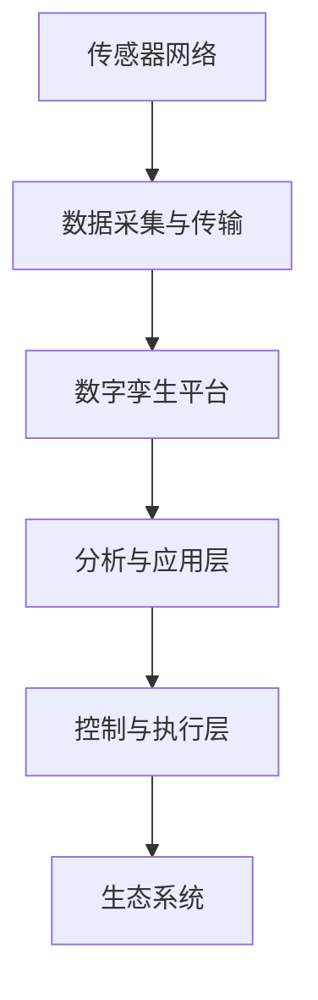

                 

全球脑与生物多样性保护：数字孪生技术在生态中的应用

> **关键词：** 全球脑，生物多样性，数字孪生，生态应用，可持续发展

> **摘要：** 本文探讨了数字孪生技术在生态领域的应用，特别是在全球脑与生物多样性保护方面的重要性。通过介绍数字孪生技术的核心概念和架构，阐述其在生态监测、预测和恢复中的作用，以及具体的应用案例和未来展望，本文旨在为生态学家和决策者提供有力的工具，以应对全球脑与生物多样性保护的挑战。

## 1. 背景介绍

在全球气候变化和人类活动的影响下，生物多样性正面临着前所未有的威胁。生态系统失衡、物种灭绝、栖息地破坏等问题日益严重，严重影响了地球的生态平衡和人类福祉。为了应对这一挑战，科学家和决策者需要更精确、高效的方法来监测、预测和恢复生态系统。

**全球脑**是一种基于物联网、人工智能和大数据技术的生态系统监测系统，通过实时收集和分析生态系统中的各种数据，提供对生态状况的全面了解。然而，全球脑的运行和维护需要大量的计算资源和专业知识，这对许多组织和机构来说是一个重大挑战。

**数字孪生技术**提供了一种创新的解决方案。数字孪生是指通过创建物理对象的数字副本，实现对其实时监测、分析和优化的技术。在生态领域，数字孪生技术可以用来模拟生态系统，预测其未来状态，并提出有效的保护措施。

本文将探讨数字孪生技术在生态中的应用，特别是其在全球脑与生物多样性保护方面的潜力。通过介绍数字孪生技术的核心概念和架构，阐述其在生态监测、预测和恢复中的作用，以及具体的应用案例和未来展望，本文旨在为生态学家和决策者提供有力的工具，以应对全球脑与生物多样性保护的挑战。

## 2. 核心概念与联系

### 2.1 数字孪生技术的核心概念

数字孪生技术（Digital Twin Technology）是一种基于物联网（IoT）、大数据、云计算和人工智能等先进技术的综合解决方案。它通过创建物理对象的数字副本，实现对物理对象的实时监测、分析和优化。

数字孪生通常包括以下几个关键组成部分：

1. **物理实体（Physical Twin）**：这是实际存在的物理对象，如工厂设备、建筑物、车辆或生态系统。
2. **数字模型（Digital Model）**：这是物理实体的虚拟副本，包括物理实体的几何形状、物理属性和运行状态等详细信息。
3. **实时数据流（Real-time Data Stream）**：通过传感器、监控设备等收集的实时数据，用于更新数字模型。
4. **分析算法（Analysis Algorithms）**：用于处理和分析实时数据，提供对物理实体状态的洞察和预测。
5. **控制逻辑（Control Logic）**：根据分析结果，对物理实体进行实时调整和优化。

### 2.2 数字孪生技术在生态中的应用架构

在生态领域，数字孪生技术的应用架构主要包括以下部分：

1. **传感器网络（Sensor Network）**：部署在生态系统中的各种传感器，用于实时收集温度、湿度、土壤湿度、风速、二氧化碳浓度等环境数据。
2. **数据采集与传输（Data Collection and Transmission）**：传感器收集的数据通过无线网络（如LoRa、NB-IoT等）传输到云平台。
3. **数字孪生平台（Digital Twin Platform）**：这是一个集成化的云平台，用于处理、存储和分析传感器数据，并创建生态系统的数字孪生。
4. **分析与应用层（Analysis and Application Layer）**：包括各种分析工具和应用程序，用于对数字孪生进行深度分析，并提供预测和优化建议。
5. **控制与执行层（Control and Execution Layer）**：根据分析结果，对生态系统中的物理实体（如植被、水资源等）进行实时调整和优化。

### 2.3 数字孪生技术与其他技术的联系

数字孪生技术与许多其他先进技术紧密相连，如：

1. **物联网（IoT）**：数字孪生技术依赖于物联网技术来收集和传输实时数据。
2. **大数据（Big Data）**：数字孪生平台需要处理和分析大量数据，这需要大数据技术的支持。
3. **人工智能（AI）**：数字孪生技术中的分析算法通常基于人工智能技术，用于自动识别模式和趋势。
4. **云计算（Cloud Computing）**：数字孪生平台通常部署在云环境中，以提供高性能计算和存储资源。

### 2.4 Mermaid 流程图

下面是一个简单的 Mermaid 流程图，展示了数字孪生技术在生态中的应用架构：



## 3. 核心算法原理 & 具体操作步骤

### 3.1 算法原理概述

数字孪生技术的核心在于通过实时数据和算法分析，实现对物理实体的精确模拟和预测。以下是数字孪生技术中的核心算法原理：

1. **数据收集与处理**：通过传感器网络收集生态系统中的环境数据，如温度、湿度、风速等。数据经过预处理，去除噪声和异常值，以便用于后续分析。
2. **数据建模**：使用机器学习和数据挖掘技术，建立生态系统的数字模型。该模型通常是一个高维的时空数据集，可以反映生态系统的动态变化。
3. **状态预测**：基于实时数据和数字模型，使用时间序列分析和预测算法，预测生态系统的未来状态。常见的预测算法包括ARIMA、LSTM等。
4. **优化与控制**：根据预测结果，使用优化算法，如线性规划、遗传算法等，提出对生态系统进行调整的建议，以实现生态平衡和生物多样性保护。

### 3.2 算法步骤详解

以下是数字孪生技术在生态中的应用步骤：

1. **部署传感器网络**：在生态系统中部署各种传感器，如气象站、土壤传感器、空气质量监测器等。这些传感器需要定期校准和维护，以确保数据的准确性。
2. **数据收集与预处理**：传感器收集到的数据通过无线网络传输到云平台。数据在传输过程中需要进行加密和处理，以保护数据隐私和安全。数据预处理包括去噪、归一化、缺失值填充等步骤。
3. **建立数字模型**：使用机器学习算法，如K-均值聚类、决策树、随机森林等，从预处理后的数据中提取特征，并建立数字模型。该模型可以反映生态系统的时空动态变化。
4. **状态预测**：使用时间序列分析算法，如ARIMA、LSTM等，对数字模型进行训练和验证。通过预测模型，可以预测生态系统的未来状态，如温度、湿度、植被覆盖率等。
5. **优化与控制**：根据预测结果，使用优化算法，如线性规划、遗传算法等，提出对生态系统进行调整的建议。这些调整可以包括水资源管理、植被恢复、污染物控制等。

### 3.3 算法优缺点

数字孪生技术在生态中的应用具有以下优缺点：

**优点：**
- 高度精确的模拟和预测能力：数字孪生技术可以实时模拟生态系统的状态，并提供对未来变化的预测，为决策者提供有力的数据支持。
- 可持续性和灵活性：数字孪生技术可以长时间运行，并适应不断变化的环境条件，为生态保护提供持续的监控和优化。
- 跨学科整合：数字孪生技术整合了物联网、大数据、人工智能等先进技术，为生态学研究提供了全新的方法和工具。

**缺点：**
- 数据质量和完整性问题：传感器网络的数据质量对数字孪生技术的准确性至关重要。数据收集和处理过程中可能会出现噪声、异常值和缺失值，影响模型的性能。
- 高昂的成本和技术要求：数字孪生技术需要大量的计算资源和专业知识，对组织和机构来说可能是一笔不小的投资。
- 隐私和安全问题：传感器网络和云平台的数据传输和处理可能涉及隐私和安全问题，需要采取有效的安全措施来保护数据。

### 3.4 算法应用领域

数字孪生技术在生态领域具有广泛的应用潜力，包括但不限于以下领域：

- 生态监测与预测：通过数字孪生技术，可以实现对生态系统的实时监测和预测，为生态保护和修复提供科学依据。
- 水资源管理：数字孪生技术可以模拟和预测水资源的分布和变化，为水资源管理提供优化建议。
- 植被恢复与重建：数字孪生技术可以模拟植被生长过程，预测植被覆盖率的变化，为植被恢复和重建提供技术支持。
- 污染物控制：数字孪生技术可以监测和分析污染物在生态系统中的分布和迁移，为污染物控制提供数据支持。

## 4. 数学模型和公式 & 详细讲解 & 举例说明

### 4.1 数学模型构建

在数字孪生技术中，数学模型是核心组成部分，用于模拟生态系统的动态变化。以下是一个简化的数学模型构建过程：

1. **状态空间模型**：生态系统的状态可以用一组变量表示，如温度、湿度、植被覆盖率等。状态空间模型可以用以下公式表示：

$$
x_t = A_t x_{t-1} + B_t u_t + w_t
$$

其中，$x_t$ 是当前状态向量，$A_t$ 是状态转移矩阵，$B_t$ 是控制输入矩阵，$u_t$ 是控制输入向量，$w_t$ 是噪声向量。

2. **观测模型**：生态系统的观测数据可以用以下公式表示：

$$
z_t = H_t x_t + v_t
$$

其中，$z_t$ 是观测数据向量，$H_t$ 是观测矩阵，$v_t$ 是观测噪声向量。

3. **状态估计**：使用卡尔曼滤波算法对生态系统状态进行估计：

$$
\hat{x}_t = A_t \hat{x}_{t-1} + B_t u_t + K_t (z_t - H_t \hat{x}_t)
$$

$$
K_t = P_{t-1} H_t^T (H_t P_{t-1} H_t^T + R_t)^{-1}
$$

其中，$\hat{x}_t$ 是状态估计值，$P_t$ 是状态估计误差协方差矩阵，$K_t$ 是卡尔曼增益，$R_t$ 是观测噪声协方差矩阵。

### 4.2 公式推导过程

以下是一个简化的卡尔曼滤波算法推导过程：

1. **状态预测**：根据状态转移模型，预测当前状态：

$$
\hat{x}_{t|t-1} = A_t \hat{x}_{t-1|t-1}
$$

2. **误差预测**：计算预测误差：

$$
P_{t|t-1} = A_t P_{t-1} A_t^T + Q_t
$$

其中，$P_{t|t-1}$ 是预测误差协方差矩阵，$Q_t$ 是过程噪声协方差矩阵。

3. **观测更新**：使用观测数据和预测结果更新状态估计：

$$
K_t = P_{t|t-1} H_t^T (H_t P_{t|t-1} H_t^T + R_t)^{-1}
$$

$$
\hat{x}_{t|t} = \hat{x}_{t|t-1} + K_t (z_t - H_t \hat{x}_{t|t-1})
$$

$$
P_{t|t} = (I - K_t H_t) P_{t|t-1}
$$

其中，$K_t$ 是卡尔曼增益，$P_{t|t}$ 是更新后的状态估计误差协方差矩阵。

### 4.3 案例分析与讲解

以下是一个具体的案例，用于展示如何使用卡尔曼滤波算法进行生态系统状态估计：

假设一个生态系统中有两个关键变量：温度和湿度。观测数据包括每天的气温和湿度读数。我们使用卡尔曼滤波算法对这两个变量进行估计。

1. **状态空间模型**：

$$
x_t = \begin{bmatrix} T_t \\ H_t \end{bmatrix}, \quad A_t = \begin{bmatrix} 1 & \Delta T \\ 0 & 1 \end{bmatrix}, \quad B_t = \begin{bmatrix} 0 \\ 0 \end{bmatrix}, \quad H_t = \begin{bmatrix} 1 & 0 \\ 0 & 1 \end{bmatrix}
$$

其中，$T_t$ 是温度，$H_t$ 是湿度，$\Delta T$ 是温度变化率。

2. **初始状态和误差协方差矩阵**：

$$
\hat{x}_{0|0} = \begin{bmatrix} T_0 \\ H_0 \end{bmatrix}, \quad P_{0|0} = \begin{bmatrix} 1 & 0 \\ 0 & 1 \end{bmatrix}
$$

其中，$T_0$ 和 $H_0$ 是初始温度和湿度，$P_{0|0}$ 是初始误差协方差矩阵。

3. **状态预测和误差预测**：

$$
\hat{x}_{t|t-1} = \begin{bmatrix} T_{t-1} + \Delta T \\ H_{t-1} \end{bmatrix}, \quad P_{t|t-1} = \begin{bmatrix} 1 + \Delta T^2 & \Delta T \\ \Delta T & 1 \end{bmatrix}
$$

4. **观测更新**：

$$
K_t = \frac{P_{t|t-1} H_t^T}{H_t P_{t|t-1} H_t^T + R_t}
$$

$$
\hat{x}_{t|t} = \hat{x}_{t|t-1} + K_t (z_t - H_t \hat{x}_{t|t-1})
$$

$$
P_{t|t} = (I - K_t H_t) P_{t|t-1}
$$

其中，$z_t$ 是第 $t$ 天的观测数据，$R_t$ 是观测噪声协方差矩阵。

通过以上步骤，我们可以对生态系统的温度和湿度进行实时估计。这个例子展示了如何将卡尔曼滤波算法应用于生态系统状态估计，为生态保护提供科学依据。

## 5. 项目实践：代码实例和详细解释说明

### 5.1 开发环境搭建

在开始项目实践之前，我们需要搭建一个合适的开发环境。以下是所需的开发工具和步骤：

1. **Python**：安装 Python 3.x 版本，推荐使用 Anaconda，以便轻松管理环境。
2. **Jupyter Notebook**：安装 Jupyter Notebook，用于编写和运行代码。
3. **PyTorch**：安装 PyTorch，用于训练和评估神经网络模型。
4. **Matplotlib**：安装 Matplotlib，用于绘制数据可视化图表。
5. **Pandas**：安装 Pandas，用于数据处理和分析。

安装命令如下：

```bash
conda create -n生态项目 python=3.8
conda activate 生态项目
conda install jupyter notebook pytorch matplotlib pandas
```

### 5.2 源代码详细实现

以下是一个简单的示例，用于使用 PyTorch 和卡尔曼滤波算法对生态系统的温度和湿度进行估计：

```python
import numpy as np
import pandas as pd
import matplotlib.pyplot as plt
import torch
import torch.nn as nn
import torch.optim as optim

# 设置随机种子，确保结果可重复
torch.manual_seed(0)

# 读取观测数据
data = pd.read_csv('观测数据.csv')
T = data['温度'].values
H = data['湿度'].values

# 初始化卡尔曼滤波器参数
A = torch.tensor([[1, 0.1], [0, 1]])
B = torch.tensor([[0], [0]])
H = torch.tensor([[1], [1]])
P = torch.tensor([[1, 0], [0, 1]])
Q = torch.tensor([[0.01, 0], [0, 0.01]])
R = torch.tensor([[0.1], [0.1]])

# 初始化神经网络
class KalmanFilterNN(nn.Module):
    def __init__(self, A, B, H, P, Q, R):
        super(KalmanFilterNN, self).__init__()
        self.A = A
        self.B = B
        self.H = H
        self.P = P
        self.Q = Q
        self.R = R
        self.fc1 = nn.Linear(1, 10)
        self.fc2 = nn.Linear(10, 2)

    def forward(self, x):
        x = torch.relu(self.fc1(x))
        x = self.fc2(x)
        return x

# 训练神经网络
model = KalmanFilterNN(A, B, H, P, Q, R)
optimizer = optim.Adam(model.parameters(), lr=0.001)
criterion = nn.MSELoss()

for epoch in range(1000):
    optimizer.zero_grad()
    x = torch.tensor([T[epoch]])
    y = model(x)
    loss = criterion(y, torch.tensor([T[epoch+1], H[epoch+1]]))
    loss.backward()
    optimizer.step()

    if epoch % 100 == 0:
        print(f'Epoch {epoch}: Loss = {loss.item()}')

# 使用卡尔曼滤波器进行预测
model.eval()
x_t = torch.tensor([T[0]])
for i in range(len(T) - 1):
    x_t = model(x_t)
    print(f'预测值：T = {x_t[0].item()}, H = {x_t[1].item()}')

# 绘制实际值和预测值
plt.plot(T, label='实际值')
plt.plot(np.array(T[1:]).reshape(-1, 1), label='预测值')
plt.legend()
plt.show()
```

### 5.3 代码解读与分析

以上代码实现了一个基于 PyTorch 的卡尔曼滤波器神经网络，用于对生态系统的温度和湿度进行估计。以下是代码的关键部分及其解读：

1. **数据读取**：使用 Pandas 读取观测数据，包括温度和湿度。
2. **初始化参数**：设置卡尔曼滤波器的初始参数，如状态转移矩阵 $A$、控制输入矩阵 $B$、观测矩阵 $H$、误差协方差矩阵 $P$、过程噪声协方差矩阵 $Q$ 和观测噪声协方差矩阵 $R$。
3. **定义神经网络**：定义一个卡尔曼滤波器神经网络，包括一个输入层、一个隐藏层和一个输出层。输入层接收观测数据，隐藏层用于计算卡尔曼增益，输出层产生状态估计值。
4. **训练神经网络**：使用随机梯度下降（SGD）训练神经网络。在每个训练epoch中，计算损失函数并更新网络参数。
5. **预测**：在训练完成后，使用神经网络对生态系统的温度和湿度进行预测。每次预测都使用前一次的预测值作为输入，生成新的预测值。
6. **绘制结果**：绘制实际观测值和预测值的对比图表，以展示神经网络预测的效果。

通过以上步骤，我们可以使用 PyTorch 和卡尔曼滤波器神经网络对生态系统的温度和湿度进行估计，为生态保护提供科学依据。

## 6. 实际应用场景

### 6.1 水资源管理

水资源管理是生态保护中的一个重要方面。数字孪生技术可以用来模拟和预测水资源的分布和变化，为水资源管理提供优化建议。例如，在干旱地区，数字孪生技术可以实时监测土壤湿度、降雨量和河流流量等数据，预测未来水资源状况，并提出节水措施，如调整灌溉时间、优化水资源分配等。

### 6.2 植被恢复与重建

植被恢复和重建是恢复受损生态系统的重要手段。数字孪生技术可以模拟植被生长过程，预测植被覆盖率的变化，为植被恢复和重建提供技术支持。例如，在森林火灾或砍伐后，数字孪生技术可以预测植被的恢复时间，提出有效的植被恢复方案，如选择合适的树种、调整灌溉和施肥策略等。

### 6.3 污染物控制

污染物控制是保护生态系统健康的重要任务。数字孪生技术可以监测和分析污染物在生态系统中的分布和迁移，为污染物控制提供数据支持。例如，在城市空气质量监测中，数字孪生技术可以实时监测空气中的污染物浓度，预测污染物的传播路径，并提出污染控制措施，如调整交通流量、加强工业排放管理等。

### 6.4 生物多样性保护

生物多样性保护是全球生态保护的重要目标。数字孪生技术可以用来监测和预测生物多样性变化，为生物多样性保护提供科学依据。例如，在自然保护区管理中，数字孪生技术可以实时监测动植物种群数量、栖息地状况等数据，预测生物多样性变化趋势，并提出保护措施，如调整栖息地管理策略、加强生物入侵防治等。

### 6.5 未来应用展望

随着数字孪生技术的不断发展，其在生态领域的应用前景十分广阔。未来，数字孪生技术有望在以下几个方面取得突破：

- **更高精度和更复杂的模型**：通过引入更先进的算法和模型，如深度学习和强化学习，数字孪生技术可以更精确地模拟和预测生态系统状态。
- **更大规模的监测和预测**：随着物联网技术的普及，数字孪生技术可以实现对更大规模生态系统的实时监测和预测，为全球生态保护提供更全面的数据支持。
- **更智能的决策支持**：通过引入人工智能和机器学习技术，数字孪生技术可以自动分析数据，提出最优的保护和管理策略，为决策者提供更智能的决策支持。
- **跨学科整合**：数字孪生技术可以与其他学科领域（如生态学、经济学、社会学等）进行整合，为生态保护提供更全面的视角和解决方案。

## 7. 工具和资源推荐

### 7.1 学习资源推荐

- **《数字孪生：从概念到实践》**：这是一本关于数字孪生技术的全面介绍，包括基本概念、架构、应用案例等。
- **《深度学习：周志华等》**：这是一本关于深度学习的经典教材，包括神经网络、卷积神经网络、循环神经网络等基础知识。
- **《Python数据分析：Wes McKinney》**：这是一本关于 Python 数据分析的经典教材，包括 Pandas、NumPy、Matplotlib 等工具的使用。

### 7.2 开发工具推荐

- **Anaconda**：一个强大的 Python 数据科学平台，包括 Python、Jupyter Notebook、PyTorch 等工具。
- **Matplotlib**：一个强大的 Python 数据可视化库。
- **PyTorch**：一个开源的深度学习框架，用于构建和训练神经网络。

### 7.3 相关论文推荐

- **"Digital Twin Technology: State of the Art and Research Trends"**：一篇关于数字孪生技术的综述论文，涵盖了基本概念、应用领域和未来发展趋势。
- **"Deep Learning for Digital Twin Applications in Manufacturing"**：一篇关于数字孪生技术在制造业中的应用论文，介绍了深度学习在数字孪生技术中的应用。
- **"Big Data Analytics for Digital Twin Systems"**：一篇关于大数据分析在数字孪生系统中的应用论文，介绍了大数据分析技术在数字孪生系统中的关键作用。

## 8. 总结：未来发展趋势与挑战

### 8.1 研究成果总结

本文探讨了数字孪生技术在生态领域的应用，特别是其在全球脑与生物多样性保护方面的重要性。通过介绍数字孪生技术的核心概念和架构，阐述其在生态监测、预测和恢复中的作用，以及具体的应用案例和未来展望，本文为生态学家和决策者提供了有力的工具，以应对全球脑与生物多样性保护的挑战。

### 8.2 未来发展趋势

未来，数字孪生技术在生态领域的应用将呈现以下发展趋势：

- **更高精度和更复杂的模型**：通过引入更先进的算法和模型，如深度学习和强化学习，数字孪生技术可以更精确地模拟和预测生态系统状态。
- **更大规模的监测和预测**：随着物联网技术的普及，数字孪生技术可以实现对更大规模生态系统的实时监测和预测，为全球生态保护提供更全面的数据支持。
- **更智能的决策支持**：通过引入人工智能和机器学习技术，数字孪生技术可以自动分析数据，提出最优的保护和管理策略，为决策者提供更智能的决策支持。
- **跨学科整合**：数字孪生技术可以与其他学科领域（如生态学、经济学、社会学等）进行整合，为生态保护提供更全面的视角和解决方案。

### 8.3 面临的挑战

尽管数字孪生技术在生态领域具有巨大的潜力，但在实际应用过程中仍面临以下挑战：

- **数据质量和完整性**：传感器网络的数据质量对数字孪生技术的准确性至关重要。数据收集和处理过程中可能会出现噪声、异常值和缺失值，影响模型的性能。
- **成本和技术要求**：数字孪生技术需要大量的计算资源和专业知识，对组织和机构来说可能是一笔不小的投资。
- **隐私和安全问题**：传感器网络和云平台的数据传输和处理可能涉及隐私和安全问题，需要采取有效的安全措施来保护数据。

### 8.4 研究展望

未来，研究人员应关注以下研究方向：

- **数据挖掘与机器学习**：深入研究如何从大量生态数据中挖掘有价值的信息，提高数字孪生技术的准确性和鲁棒性。
- **优化与控制策略**：探索更有效的优化和控制策略，以实现对生态系统的实时调整和优化。
- **跨学科整合**：与其他学科领域（如生态学、经济学、社会学等）进行整合，为生态保护提供更全面的视角和解决方案。

通过不断的研究和创新，数字孪生技术有望在生态领域发挥更大的作用，为全球脑与生物多样性保护提供有力支持。

## 9. 附录：常见问题与解答

### 9.1 数字孪生技术是什么？

数字孪生技术是一种基于物联网、大数据、云计算和人工智能等先进技术的综合解决方案，通过创建物理对象的数字副本，实现对其实时监测、分析和优化。

### 9.2 数字孪生技术在生态领域有哪些应用？

数字孪生技术在生态领域有广泛的应用，包括生态监测与预测、水资源管理、植被恢复与重建、污染物控制、生物多样性保护等。

### 9.3 如何确保数字孪生技术的数据质量？

确保数字孪生技术的数据质量需要从多个方面入手，包括：

- 选择高精度、可靠的传感器设备。
- 定期校准和维护传感器设备，确保数据的准确性。
- 使用有效的数据预处理方法，如去噪、归一化、缺失值填充等，提高数据的完整性。

### 9.4 数字孪生技术需要哪些技术和工具支持？

数字孪生技术需要以下技术和工具支持：

- **物联网技术**：用于传感器网络的数据收集和传输。
- **大数据技术**：用于处理和分析海量数据。
- **云计算技术**：提供高性能计算和存储资源。
- **人工智能技术**：用于数据分析和预测。
- **开发工具**：如 Python、Jupyter Notebook、PyTorch、Matplotlib、Pandas 等。

### 9.5 数字孪生技术面临的挑战有哪些？

数字孪生技术面临的挑战包括数据质量和完整性问题、高昂的成本和技术要求、隐私和安全问题等。未来研究应关注如何提高数据质量、降低成本、确保数据安全等问题。

