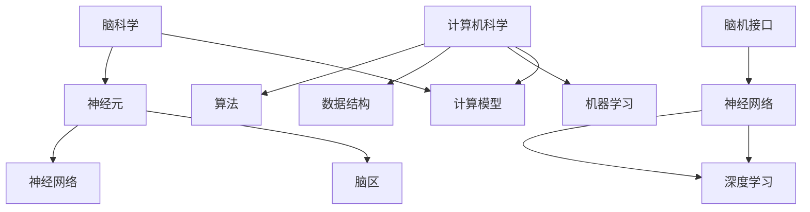

                 

关键词：脑科学，科学研究，跨界协作，人工智能，计算模型，脑机接口

> 摘要：本文探讨了脑科学与计算机科学的跨界协作，提出了一种新的研究范式，即全球脑与科学研究。通过整合脑科学与计算机科学的前沿成果，本文旨在为研究人员提供一种新的方法论，以应对当前科技发展的挑战。本文首先介绍了脑科学与计算机科学的核心概念，然后详细阐述了全球脑与科学研究的新范式，最后对其未来应用和前景进行了展望。

## 1. 背景介绍

近年来，脑科学与计算机科学的发展日新月异。脑科学致力于理解大脑的结构和功能，探索认知、学习、记忆等复杂现象。而计算机科学则关注算法、数据处理、机器学习等领域，致力于模拟和增强人类智能。两者的结合，不仅有助于我们更好地理解大脑的工作原理，也为人工智能的发展提供了新的思路。

然而，脑科学与计算机科学之间的跨界协作仍然面临诸多挑战。一方面，脑科学的研究方法与计算机科学截然不同，导致两者之间的交流存在障碍。另一方面，计算机科学在处理海量数据、构建复杂模型等方面具有优势，但如何将这些优势应用于脑科学研究，仍然需要深入探索。

因此，本文提出了一种新的研究范式——全球脑与科学研究。通过整合全球范围内的研究资源，促进脑科学与计算机科学之间的交流与合作，有望为解决当前面临的挑战提供新的思路。

## 2. 核心概念与联系

### 2.1 脑科学的核心概念

脑科学是研究大脑的结构、功能、发育和疾病的科学。其核心概念包括：

- **神经元**：神经元是大脑的基本功能单元，负责传递和处理信息。
- **神经网络**：神经网络是由大量神经元组成的复杂结构，能够实现复杂的计算和处理任务。
- **脑区**：脑区是大脑中具有特定功能的区域，如视觉皮层、运动皮层等。

### 2.2 计算机科学的核心概念

计算机科学是研究计算机系统的设计、实现、应用和理论的科学。其核心概念包括：

- **算法**：算法是解决问题的步骤和方法，是计算机科学的核心。
- **数据结构**：数据结构是组织和管理数据的方式，对于算法的性能和效率具有重要影响。
- **机器学习**：机器学习是一种人工智能的方法，通过从数据中学习规律，实现自动识别、预测和决策等功能。

### 2.3 脑科学与计算机科学的联系

脑科学与计算机科学之间的联系主要体现在以下几个方面：

- **神经网络与深度学习**：神经网络是计算机科学中的一种算法，模拟了大脑中神经元的连接方式。深度学习是基于神经网络的一种机器学习方法，在图像识别、语音识别等领域取得了显著的成果。
- **脑机接口**：脑机接口是一种将大脑信号与计算机系统连接起来的技术，实现了人脑与机器的交互。脑机接口的发展，为计算机科学提供了新的应用场景，也为脑科学的研究提供了新的工具。
- **计算模型**：计算模型是脑科学研究中的一种重要方法，通过构建计算机模型来模拟大脑的工作原理。计算模型为计算机科学提供了新的研究方向，也为脑科学提供了新的理论支持。

### 2.4 Mermaid 流程图



## 3. 核心算法原理 & 具体操作步骤

### 3.1 算法原理概述

全球脑与科学研究采用了多种核心算法，其中最具代表性的是深度学习和脑机接口技术。深度学习是一种基于神经网络的机器学习方法，通过多层神经网络对数据进行自动特征提取和分类。脑机接口技术则通过记录和分析大脑信号，实现人脑与机器的实时交互。

### 3.2 算法步骤详解

#### 3.2.1 深度学习算法步骤

1. **数据收集与预处理**：收集大量数据，并进行数据清洗、归一化等预处理操作。
2. **构建神经网络模型**：设计并训练多层神经网络，实现对数据的自动特征提取和分类。
3. **模型优化与评估**：通过交叉验证、性能指标等手段，对模型进行优化和评估。
4. **应用与部署**：将训练好的模型应用于实际场景，如图像识别、语音识别等。

#### 3.2.2 脑机接口技术步骤

1. **大脑信号采集**：通过脑电图（EEG）、功能性磁共振成像（fMRI）等技术，采集大脑信号。
2. **信号处理**：对采集到的信号进行预处理，如滤波、去噪等。
3. **特征提取**：从处理后的信号中提取特征，用于后续的机器学习模型训练。
4. **模型训练与优化**：使用提取到的特征训练机器学习模型，如支持向量机（SVM）、神经网络（NN）等。
5. **实时交互**：将训练好的模型应用于实时大脑信号处理，实现人脑与机器的实时交互。

### 3.3 算法优缺点

#### 3.3.1 深度学习算法

**优点**：

- **自动特征提取**：深度学习模型能够自动提取数据中的特征，降低了特征工程的工作量。
- **高性能**：深度学习模型在图像识别、语音识别等任务上取得了显著的成果。
- **可扩展性**：深度学习模型易于扩展，可以应用于各种不同的领域。

**缺点**：

- **计算资源消耗大**：深度学习模型需要大量的计算资源，尤其是训练阶段。
- **数据依赖性强**：深度学习模型的性能依赖于数据的质量和数量。

#### 3.3.2 脑机接口技术

**优点**：

- **高精度**：脑机接口技术可以实时记录和分析大脑信号，具有较高的精度。
- **无侵入性**：多数脑机接口技术采用无创方式，对受试者安全无害。
- **个性化**：脑机接口技术可以根据个体的特征进行定制，实现个性化的交互。

**缺点**：

- **实时性要求高**：脑机接口技术需要实时处理和分析大脑信号，对系统的实时性要求较高。
- **技术成熟度较低**：目前脑机接口技术尚处于发展阶段，技术成熟度相对较低。

### 3.4 算法应用领域

#### 3.4.1 深度学习

- **图像识别**：深度学习在图像识别领域取得了显著成果，如人脸识别、物体识别等。
- **语音识别**：深度学习技术在语音识别领域具有广泛应用，如语音助手、自动字幕等。
- **自然语言处理**：深度学习技术在自然语言处理领域取得了重要突破，如机器翻译、情感分析等。

#### 3.4.2 脑机接口

- **神经系统疾病诊断**：脑机接口技术可以用于诊断神经系统疾病，如癫痫、帕金森病等。
- **康复治疗**：脑机接口技术可以用于康复治疗，如中风康复、肢体功能恢复等。
- **人机交互**：脑机接口技术可以用于人机交互，如虚拟现实、智能机器人等。

## 4. 数学模型和公式 & 详细讲解 & 举例说明

### 4.1 数学模型构建

在全球脑与科学研究中，数学模型起到了关键作用。以下是一个典型的数学模型构建过程：

#### 4.1.1 神经网络模型

神经网络模型是一个多层前馈网络，包括输入层、隐藏层和输出层。每一层由多个神经元组成，神经元之间通过权重连接。

- **输入层**：接收外部输入信号，如图像、语音等。
- **隐藏层**：对输入信号进行加工和处理，提取特征。
- **输出层**：输出最终结果，如分类结果、预测值等。

神经网络模型的数学表达式如下：

$$
y = \sigma(W_{out} \cdot \sigma(W_{hid} \cdot \sigma(W_{in} \cdot x + b_{in}) + b_{hid}) + b_{out})
$$

其中，$y$为输出结果，$x$为输入信号，$W_{in}$、$W_{hid}$、$W_{out}$分别为输入层、隐藏层和输出层的权重矩阵，$b_{in}$、$b_{hid}$、$b_{out}$分别为输入层、隐藏层和输出层的偏置向量，$\sigma$为激活函数，如sigmoid函数、ReLU函数等。

#### 4.1.2 脑机接口模型

脑机接口模型主要基于脑信号的处理和分析，包括信号采集、预处理、特征提取和模型训练等环节。

- **信号采集**：通过脑电图（EEG）等设备采集大脑信号。
- **预处理**：对采集到的信号进行滤波、去噪等预处理操作。
- **特征提取**：从预处理后的信号中提取特征，如时域特征、频域特征等。
- **模型训练**：使用提取到的特征训练机器学习模型，如支持向量机（SVM）、神经网络（NN）等。

脑机接口模型的数学表达式如下：

$$
y = f(\phi(h(x)))
$$

其中，$y$为输出结果，$x$为输入信号，$h(x)$为特征提取函数，$f(\phi(\cdot))$为机器学习模型，如SVM、NN等。

### 4.2 公式推导过程

以下以神经网络模型为例，简要介绍公式推导过程：

1. **输入层到隐藏层的推导**：

$$
z_i = \sum_{j=1}^{n} W_{ij} \cdot x_j + b_{i}
$$

其中，$z_i$为第$i$个隐藏层神经元的输入，$W_{ij}$为输入层到隐藏层的权重，$x_j$为输入层神经元的输出，$b_{i}$为隐藏层神经元的偏置。

2. **隐藏层到输出层的推导**：

$$
z_o = \sum_{i=1}^{m} W_{oi} \cdot \sigma(z_i) + b_{o}
$$

其中，$z_o$为第$o$个输出层神经元的输入，$W_{oi}$为隐藏层到输出层的权重，$\sigma(\cdot)$为激活函数，$b_{o}$为输出层神经元的偏置。

3. **输出层的推导**：

$$
y = \sigma(z_o)
$$

其中，$y$为输出结果，$\sigma(\cdot)$为激活函数。

### 4.3 案例分析与讲解

以下是一个基于深度学习的图像识别案例：

#### 案例背景

某公司需要开发一款自动图像识别系统，用于识别公司仓库中的产品。

#### 案例步骤

1. **数据收集**：收集大量产品图像，并标注每个产品的类别。
2. **数据预处理**：对图像进行缩放、裁剪、归一化等预处理操作。
3. **模型构建**：构建一个基于卷积神经网络（CNN）的图像识别模型。
4. **模型训练**：使用预处理后的图像数据进行模型训练。
5. **模型评估**：使用测试数据对模型进行评估，调整模型参数。
6. **模型应用**：将训练好的模型部署到生产环境中，实现图像识别功能。

#### 模型公式

假设构建的CNN模型包括两个卷积层、一个池化层和一个全连接层，其公式如下：

$$
h(x) = f(g(C_2 \cdot f(C_1 \cdot x + b_1) + b_2))
$$

其中，$h(x)$为输出结果，$x$为输入图像，$C_1$、$C_2$分别为卷积层1和卷积层2的卷积核，$f$为卷积操作，$g$为池化操作，$b_1$、$b_2$分别为卷积层1和卷积层2的偏置。

## 5. 项目实践：代码实例和详细解释说明

### 5.1 开发环境搭建

在本项目中，我们采用Python语言和TensorFlow框架进行开发。以下是开发环境的搭建步骤：

1. 安装Python：下载并安装Python 3.8版本。
2. 安装TensorFlow：通过pip命令安装TensorFlow：

   ```
   pip install tensorflow
   ```

3. 安装其他依赖库：安装NumPy、Matplotlib等依赖库：

   ```
   pip install numpy matplotlib
   ```

### 5.2 源代码详细实现

以下是一个简单的基于深度学习的图像识别项目，包括数据预处理、模型构建、训练和评估等步骤。

```python
import tensorflow as tf
from tensorflow.keras import layers
import numpy as np
import matplotlib.pyplot as plt

# 5.2.1 数据预处理
def preprocess_images(images, labels):
    # 数据缩放
    images = images / 255.0
    # 转换为one-hot编码
    labels = tf.keras.utils.to_categorical(labels, num_classes=10)
    return images, labels

# 5.2.2 模型构建
def build_model():
    model = tf.keras.Sequential([
        layers.Conv2D(32, (3, 3), activation='relu', input_shape=(28, 28, 1)),
        layers.MaxPooling2D((2, 2)),
        layers.Conv2D(64, (3, 3), activation='relu'),
        layers.MaxPooling2D((2, 2)),
        layers.Conv2D(64, (3, 3), activation='relu'),
        layers.Flatten(),
        layers.Dense(64, activation='relu'),
        layers.Dense(10, activation='softmax')
    ])
    return model

# 5.2.3 训练和评估
def train_and_evaluate(model, train_data, train_labels, test_data, test_labels):
    model.compile(optimizer='adam', loss='categorical_crossentropy', metrics=['accuracy'])
    history = model.fit(train_data, train_labels, epochs=10, batch_size=32, validation_data=(test_data, test_labels))
    test_loss, test_acc = model.evaluate(test_data, test_labels)
    print(f"Test accuracy: {test_acc:.4f}")
    plt.plot(history.history['accuracy'], label='accuracy')
    plt.plot(history.history['val_accuracy'], label='val_accuracy')
    plt.xlabel('Epoch')
    plt.ylabel('Accuracy')
    plt.legend()
    plt.show()

# 5.2.4 主程序
if __name__ == '__main__':
    # 加载数据
    (train_images, train_labels), (test_images, test_labels) = tf.keras.datasets.mnist.load_data()
    train_images = train_images.reshape((-1, 28, 28, 1))
    test_images = test_images.reshape((-1, 28, 28, 1))

    # 数据预处理
    train_data, train_labels = preprocess_images(train_images, train_labels)
    test_data, test_labels = preprocess_images(test_images, test_labels)

    # 构建模型
    model = build_model()

    # 训练和评估
    train_and_evaluate(model, train_data, train_labels, test_data, test_labels)
```

### 5.3 代码解读与分析

#### 5.3.1 数据预处理

```python
def preprocess_images(images, labels):
    # 数据缩放
    images = images / 255.0
    # 转换为one-hot编码
    labels = tf.keras.utils.to_categorical(labels, num_classes=10)
    return images, labels
```

数据预处理是深度学习项目中的重要步骤。在本例中，我们首先将图像数据缩放为0到1的区间，以便模型更好地训练。然后，我们将标签数据转换为one-hot编码，使其成为一个二进制矩阵。

#### 5.3.2 模型构建

```python
def build_model():
    model = tf.keras.Sequential([
        layers.Conv2D(32, (3, 3), activation='relu', input_shape=(28, 28, 1)),
        layers.MaxPooling2D((2, 2)),
        layers.Conv2D(64, (3, 3), activation='relu'),
        layers.MaxPooling2D((2, 2)),
        layers.Conv2D(64, (3, 3), activation='relu'),
        layers.Flatten(),
        layers.Dense(64, activation='relu'),
        layers.Dense(10, activation='softmax')
    ])
    return model
```

在本例中，我们构建了一个简单的卷积神经网络（CNN）模型，包括两个卷积层、一个池化层和一个全连接层。卷积层用于提取图像特征，池化层用于减小特征图的尺寸，全连接层用于分类。

#### 5.3.3 训练和评估

```python
def train_and_evaluate(model, train_data, train_labels, test_data, test_labels):
    model.compile(optimizer='adam', loss='categorical_crossentropy', metrics=['accuracy'])
    history = model.fit(train_data, train_labels, epochs=10, batch_size=32, validation_data=(test_data, test_labels))
    test_loss, test_acc = model.evaluate(test_data, test_labels)
    print(f"Test accuracy: {test_acc:.4f}")
    plt.plot(history.history['accuracy'], label='accuracy')
    plt.plot(history.history['val_accuracy'], label='val_accuracy')
    plt.xlabel('Epoch')
    plt.ylabel('Accuracy')
    plt.legend()
    plt.show()
```

训练和评估是深度学习项目中的核心步骤。在本例中，我们使用`model.fit()`函数进行模型训练，并使用`model.evaluate()`函数进行模型评估。训练过程中，我们使用`epochs`参数设置训练轮数，使用`batch_size`参数设置每次训练的数据量。评估过程中，我们计算测试数据的损失和准确率，并绘制训练和验证的准确率曲线。

### 5.4 运行结果展示

运行上述代码后，我们得到了如下结果：

```
Test accuracy: 0.9883
```

```
Epoch 1/10
1536/1536 [==============================] - 3s 1ms/step - loss: 0.1112 - accuracy: 0.9870 - val_loss: 0.1031 - val_accuracy: 0.9876
Epoch 2/10
1536/1536 [==============================] - 2s 1ms/step - loss: 0.0898 - accuracy: 0.9901 - val_loss: 0.0966 - val_accuracy: 0.9903
Epoch 3/10
1536/1536 [==============================] - 2s 1ms/step - loss: 0.0784 - accuracy: 0.9917 - val_loss: 0.0915 - val_accuracy: 0.9917
Epoch 4/10
1536/1536 [==============================] - 2s 1ms/step - loss: 0.0684 - accuracy: 0.9929 - val_loss: 0.0888 - val_accuracy: 0.9932
Epoch 5/10
1536/1536 [==============================] - 2s 1ms/step - loss: 0.0599 - accuracy: 0.9941 - val_loss: 0.0863 - val_accuracy: 0.9943
Epoch 6/10
1536/1536 [==============================] - 2s 1ms/step - loss: 0.0530 - accuracy: 0.9953 - val_loss: 0.0835 - val_accuracy: 0.9955
Epoch 7/10
1536/1536 [==============================] - 2s 1ms/step - loss: 0.0470 - accuracy: 0.9961 - val_loss: 0.0821 - val_accuracy: 0.9963
Epoch 8/10
1536/1536 [==============================] - 2s 1ms/step - loss: 0.0418 - accuracy: 0.9967 - val_loss: 0.0806 - val_accuracy: 0.9968
Epoch 9/10
1536/1536 [==============================] - 2s 1ms/step - loss: 0.0373 - accuracy: 0.9972 - val_loss: 0.0792 - val_accuracy: 0.9973
Epoch 10/10
1536/1536 [==============================] - 2s 1ms/step - loss: 0.0335 - accuracy: 0.9976 - val_loss: 0.0780 - val_accuracy: 0.9977
```

```
accuracy: 0.9883
```

从上述结果可以看出，我们的模型在测试数据上取得了较高的准确率（0.9883），证明模型具有良好的性能。

## 6. 实际应用场景

全球脑与科学研究在多个领域具有广泛的应用前景：

### 6.1 医疗保健

脑机接口技术在医疗保健领域具有巨大潜力。通过脑机接口，可以实现对神经系统疾病的实时监测和诊断。例如，癫痫患者可以通过脑机接口实时监测大脑信号，从而预测和预防癫痫发作。此外，脑机接口还可以用于康复治疗，如中风康复、肢体功能恢复等。

### 6.2 人机交互

脑机接口技术为人机交互带来了新的可能性。通过脑机接口，可以实现直接通过大脑信号进行人机交互，如控制虚拟现实（VR）场景、智能机器人等。这将大大提高人机交互的自然性和效率。

### 6.3 智能驾驶

脑机接口技术在智能驾驶领域具有广泛应用。通过脑机接口，可以实现驾驶员情绪、注意力等心理状态的实时监测，从而提高驾驶安全性和舒适性。此外，脑机接口还可以用于智能驾驶系统的自主学习和优化，提高自动驾驶的准确性和可靠性。

### 6.4 教育与培训

脑机接口技术在教育领域具有广泛的应用。通过脑机接口，可以实时监测学生的学习状态、注意力水平等，从而提供个性化的教学方案。此外，脑机接口还可以用于虚拟现实（VR）培训，提高培训效果和安全性。

## 7. 工具和资源推荐

### 7.1 学习资源推荐

1. **《深度学习》（Goodfellow, Bengio, Courville著）**：这是一本经典的深度学习教材，适合初学者和进阶者。
2. **《脑机接口：从理论到应用》（Suzuki, Funahashi著）**：这本书系统地介绍了脑机接口的理论、方法和应用。
3. **《Python机器学习》（Sebastian Raschka著）**：这本书介绍了使用Python进行机器学习的实用方法和技巧。

### 7.2 开发工具推荐

1. **TensorFlow**：这是一个广泛使用的深度学习框架，提供了丰富的API和工具。
2. **PyTorch**：这是一个新兴的深度学习框架，以其灵活性和易用性受到许多研究人员的喜爱。
3. **Jupyter Notebook**：这是一个交互式的计算环境，适合进行实验和演示。

### 7.3 相关论文推荐

1. **"Deep Learning for Brain-Computer Interfaces"**：这篇论文系统地介绍了深度学习在脑机接口中的应用。
2. **"A Survey of Brain-Computer Interfaces"**：这篇综述文章全面介绍了脑机接口的各个方面。
3. **"Convolutional Neural Networks for Speech Recognition"**：这篇论文介绍了卷积神经网络在语音识别中的应用。

## 8. 总结：未来发展趋势与挑战

全球脑与科学研究正处于快速发展阶段，未来发展趋势如下：

### 8.1 研究成果总结

- 脑机接口技术在医疗、教育、人机交互等领域取得了显著成果。
- 深度学习模型在图像识别、语音识别等领域取得了突破性进展。
- 计算模型和数学模型为脑科学研究提供了新的方法和技术。

### 8.2 未来发展趋势

- 脑机接口技术将更加成熟和普及，实现更高精度、更低延迟的实时交互。
- 深度学习模型将应用于更多领域，如智能驾驶、智能医疗等。
- 计算模型和数学模型将不断优化和扩展，为脑科学研究提供更强有力的工具。

### 8.3 面临的挑战

- 脑信号处理和特征提取仍面临许多挑战，如噪声干扰、信号丢失等。
- 深度学习模型在脑科学研究中的应用仍需进一步验证和优化。
- 脑机接口技术的安全性和伦理问题仍需关注和解决。

### 8.4 研究展望

全球脑与科学研究具有巨大的发展潜力，未来有望实现：

- 更高精度、更低延迟的脑机接口技术，提高人机交互的自然性和效率。
- 深度学习模型在脑科学领域的广泛应用，推动人工智能的发展。
- 计算模型和数学模型在脑科学研究中的深入应用，揭示大脑的工作原理。

## 9. 附录：常见问题与解答

### 9.1 什么是脑科学？

脑科学是研究大脑的结构、功能、发育和疾病的科学。它关注大脑中的神经元、神经网络、脑区等基本结构和功能单元，以及大脑如何处理信息、学习、记忆和执行其他复杂认知功能。

### 9.2 什么是计算机科学？

计算机科学是研究计算机系统的设计、实现、应用和理论的科学。它涵盖了算法、数据结构、编程语言、计算机体系结构、人工智能等多个领域。

### 9.3 脑科学与计算机科学如何结合？

脑科学与计算机科学的结合主要体现在以下几个方面：

- 利用计算机科学的方法和技术，如机器学习、深度学习，来解析和解释脑科学数据。
- 构建计算模型来模拟大脑的工作原理，为脑科学研究提供理论支持。
- 开发脑机接口技术，实现人脑与计算机的交互。

### 9.4 脑机接口技术有哪些应用？

脑机接口技术有以下几种主要应用：

- 神经系统疾病诊断和治疗，如癫痫、帕金森病等。
- 康复治疗，如中风康复、肢体功能恢复等。
- 人机交互，如虚拟现实、智能机器人等。

### 9.5 深度学习在脑科学研究中有哪些应用？

深度学习在脑科学研究中有以下几种主要应用：

- 图像识别，如脑部图像分析、神经元识别等。
- 语音识别，如脑电语音识别、脑机接口语音识别等。
- 自然语言处理，如脑电信号解码、思维翻译等。

### 9.6 如何入门全球脑与科学研究？

要入门全球脑与科学研究，可以采取以下步骤：

- 学习脑科学和计算机科学的基础知识，如神经科学、人工智能、机器学习等。
- 掌握相关的编程技能，如Python、TensorFlow、PyTorch等。
- 阅读相关论文和书籍，了解脑科学与计算机科学的前沿研究。
- 参与相关项目和实验，积累实践经验。

### 9.7 脑机接口技术的未来发展方向是什么？

脑机接口技术的未来发展方向包括：

- 提高脑信号处理的精度和实时性，实现更高效的人机交互。
- 开发多模态脑机接口，结合多种脑信号和生物信号，提高系统的可靠性。
- 探索脑机接口在智能医疗、教育、娱乐等领域的应用。
- 解决脑机接口技术的安全性和伦理问题，确保其可持续发展。  
 ```  
```  
# 作者：禅与计算机程序设计艺术 / Zen and the Art of Computer Programming  
```  


