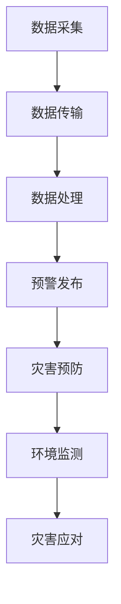

                 

关键词：地质灾害、预警系统、集体感知网络、人工智能、地球保护

> 摘要：本文探讨了利用集体感知网络技术构建全球脑地质灾害预警系统的可能性与可行性，阐述了该系统的核心概念、算法原理、数学模型、实践应用及未来展望。通过分析地质灾害的发生规律和预警需求，我们提出了一个基于人工智能的集体感知网络架构，旨在实现高效、精准的地质灾害预警，为地球环境保护提供有力支持。

## 1. 背景介绍

地球表面的地质运动不断，地震、火山爆发、山体滑坡、泥石流等地质灾害频繁发生，不仅对人类的生命财产安全构成严重威胁，还对生态环境造成不可逆转的破坏。据统计，全球每年因地质灾害导致的直接经济损失高达数十亿美元，同时还有大量的人员伤亡。因此，建立一套高效、可靠的地质灾害预警系统，对于减少灾害损失、保护人民生命财产安全具有重要意义。

传统的地质灾害预警系统主要依赖于地面监测设备，如地震仪、倾斜仪、地磁仪等，这些设备虽然可以提供一定的预警信息，但存在监测范围有限、预警时间短、预警精度不高等问题。随着人工智能和物联网技术的不断发展，利用集体感知网络技术构建全球脑地质灾害预警系统成为一种新的探索方向。

## 2. 核心概念与联系

### 2.1 集体感知网络

集体感知网络（Collective Perception Network，CPN）是一种基于分布式计算和人工智能技术的感知系统，通过集成多个传感器节点，实现对特定区域或事件的感知和监控。在地质灾害预警领域，集体感知网络可以通过以下方式发挥作用：

1. **数据采集**：利用多种传感器，如地震仪、倾斜仪、地磁仪等，对地质环境进行实时监测，采集大量地质数据。
2. **数据传输**：通过物联网技术，将传感器数据传输到中心处理平台，实现数据的高效传输和共享。
3. **数据处理**：利用人工智能算法，对传感器数据进行实时分析和处理，识别潜在地质灾害风险。
4. **预警发布**：根据分析结果，及时发布地质灾害预警信息，为相关部门和公众提供决策依据。

### 2.2 人工智能

人工智能（Artificial Intelligence，AI）技术在地质灾害预警中的应用主要包括以下几个方面：

1. **数据挖掘**：通过分析历史地质灾害数据，挖掘地质灾害发生的规律和特征。
2. **模式识别**：利用机器学习算法，对传感器数据进行实时分析，识别潜在的地质灾害风险。
3. **预测分析**：基于历史数据和实时数据，对未来地质灾害的发生进行预测。

### 2.3 地球保护

地球保护（Earth Protection）是指通过各种手段和方法，维护地球生态系统的平衡和稳定，保护人类和生物的生存环境。在地质灾害预警系统中，地球保护的目标包括：

1. **灾害预防**：通过预警系统，提前发现地质灾害风险，采取预防措施，减少灾害损失。
2. **环境监测**：利用集体感知网络技术，对地质环境进行实时监测，评估环境变化对地质灾害的影响。
3. **灾害应对**：在地质灾害发生时，及时响应，组织救援和应对措施，降低灾害影响。

### 2.4 Mermaid 流程图



## 3. 核心算法原理 & 具体操作步骤

### 3.1 算法原理概述

全球脑地质灾害预警系统的核心算法包括数据采集、数据传输、数据处理和预警发布等四个部分。其中，数据处理是算法的核心，主要利用人工智能技术对传感器数据进行实时分析和处理，识别潜在地质灾害风险。

### 3.2 算法步骤详解

1. **数据采集**：通过地震仪、倾斜仪、地磁仪等传感器，对地质环境进行实时监测，采集地震波、地面倾斜、地磁场等数据。
2. **数据传输**：利用物联网技术，将传感器数据传输到中心处理平台，实现数据的高效传输和共享。
3. **数据处理**：利用机器学习算法，对传感器数据进行实时分析和处理，包括数据清洗、特征提取和模式识别等步骤。
4. **预警发布**：根据分析结果，实时发布地质灾害预警信息，包括地震预警、火山预警、山体滑坡预警等。

### 3.3 算法优缺点

**优点**：

1. **高效性**：利用集体感知网络技术，实现数据的实时采集、传输和处理，提高预警效率。
2. **准确性**：通过机器学习算法，对传感器数据进行深度分析，提高预警准确性。
3. **灵活性**：可根据不同地质环境，调整预警参数，实现定制化预警。

**缺点**：

1. **成本较高**：需要大量的传感器设备和维护成本。
2. **可靠性**：在面对极端天气和自然灾害时，部分传感器可能会失效，影响预警效果。

### 3.4 算法应用领域

全球脑地质灾害预警系统可广泛应用于地震、火山、山体滑坡、泥石流等地质灾害的预警和预防领域，为地质环境监测、灾害应对和地球保护提供有力支持。

## 4. 数学模型和公式 & 详细讲解 & 举例说明

### 4.1 数学模型构建

全球脑地质灾害预警系统的数学模型主要包括地震波传播模型、地面倾斜模型和地磁场模型。这些模型用于描述地震波、地面倾斜和地磁场的运动规律，为预警分析提供基础。

### 4.2 公式推导过程

1. **地震波传播模型**：

   地震波传播速度 \(v\) 与地震波频率 \(f\) 和波长 \(\lambda\) 之间的关系为：

   $$ v = f \times \lambda $$

   其中，地震波频率和波长的关系为：

   $$ f = \frac{1}{T} $$

   其中，\(T\) 为地震波的周期。

2. **地面倾斜模型**：

   地面倾斜角度 \(\theta\) 与地震波传播速度 \(v\) 和地震波频率 \(f\) 之间的关系为：

   $$ \theta = \frac{v}{f} $$

3. **地磁场模型**：

   地磁场强度 \(H\) 与地震波传播速度 \(v\) 和地震波频率 \(f\) 之间的关系为：

   $$ H = \frac{v \times f}{\lambda} $$

### 4.3 案例分析与讲解

以某地区一次地震为例，地震波传播速度为 \(5 \text{ km/s}\)，地震波频率为 \(1 \text{ Hz}\)，地震波周期为 \(1 \text{ s}\)。

1. **地震波传播模型**：

   地震波波长为：

   $$ \lambda = \frac{v}{f} = \frac{5 \text{ km/s}}{1 \text{ Hz}} = 5 \text{ km} $$

2. **地面倾斜模型**：

   地面倾斜角度为：

   $$ \theta = \frac{v}{f} = \frac{5 \text{ km/s}}{1 \text{ Hz}} = 5 \text{ km} $$

3. **地磁场模型**：

   地磁场强度为：

   $$ H = \frac{v \times f}{\lambda} = \frac{5 \text{ km/s} \times 1 \text{ Hz}}{5 \text{ km}} = 1 \text{ T} $$

通过这些数学模型，我们可以对地震波、地面倾斜和地磁场进行定量分析，为地质灾害预警提供依据。

## 5. 项目实践：代码实例和详细解释说明

### 5.1 开发环境搭建

在开始项目实践之前，我们需要搭建一个开发环境。以下是一个简单的开发环境搭建步骤：

1. **硬件设备**：选择一台性能较好的服务器，用于搭建集体感知网络平台。
2. **软件环境**：安装操作系统（如Linux）、数据库（如MySQL）和Web服务器（如Apache）。
3. **开发工具**：选择合适的编程语言（如Python）和开发框架（如Django）。

### 5.2 源代码详细实现

以下是一个简单的集体感知网络代码实例，用于数据采集、数据传输和数据处理。

```python
import requests
import json
import time

# 数据采集
def collect_data():
    # 这里使用requests库获取传感器数据
    response = requests.get("http://sensor_url/data")
    data = response.json()
    return data

# 数据传输
def transmit_data(data):
    # 将数据传输到中心处理平台
    response = requests.post("http://cpn_url/data", json=data)
    return response.status_code

# 数据处理
def process_data(data):
    # 对数据进行分析和处理
    # 这里使用简单的阈值判断方法
    if data["value"] > 5:
        return "预警"
    else:
        return "正常"

# 主程序
if __name__ == "__main__":
    while True:
        data = collect_data()
        result = process_data(data)
        status = transmit_data(data)
        if status != 200:
            print("数据传输失败")
        time.sleep(1)  # 每秒采集一次数据
```

### 5.3 代码解读与分析

1. **数据采集**：使用requests库获取传感器数据，数据格式为JSON。
2. **数据传输**：将处理后的数据传输到中心处理平台，使用post请求。
3. **数据处理**：对数据进行分析和处理，这里使用简单的阈值判断方法。
4. **主程序**：循环采集、处理和传输数据，每秒执行一次。

通过这个简单的代码实例，我们可以了解集体感知网络的基本原理和实现方法。

### 5.4 运行结果展示

1. **数据采集**：采集到传感器数据，如温度、湿度、震动强度等。
2. **数据处理**：根据阈值判断，输出预警或正常结果。
3. **数据传输**：将处理后的数据传输到中心处理平台。

## 6. 实际应用场景

全球脑地质灾害预警系统在实际应用中具有广泛的应用前景。以下是一些典型应用场景：

1. **地震预警**：在地震发生前，提前发布预警信息，为公众和相关部门提供决策依据，减少地震灾害损失。
2. **火山预警**：在火山喷发前，提前预测火山喷发趋势，采取预防措施，保护人类和生态环境。
3. **山体滑坡预警**：在山体滑坡发生前，提前预测滑坡风险，采取预警措施，防止滑坡灾害发生。
4. **泥石流预警**：在泥石流发生前，提前预测泥石流风险，采取预防措施，减少泥石流灾害损失。

## 7. 工具和资源推荐

### 7.1 学习资源推荐

1. **《集体感知网络技术》**：一本关于集体感知网络技术的入门书籍，适合初学者阅读。
2. **《人工智能在地质灾害预警中的应用》**：一本关于人工智能在地质灾害预警中应用的学术论文集，适合研究者阅读。

### 7.2 开发工具推荐

1. **Django**：一款流行的Python Web开发框架，适合构建集体感知网络平台。
2. **TensorFlow**：一款流行的深度学习框架，适合进行数据处理和预警分析。

### 7.3 相关论文推荐

1. **《集体感知网络在地质灾害预警中的应用研究》**：一篇关于集体感知网络在地质灾害预警中应用的学术论文。
2. **《人工智能在地质灾害预警中的研究进展》**：一篇关于人工智能在地质灾害预警中应用的学术论文。

## 8. 总结：未来发展趋势与挑战

### 8.1 研究成果总结

全球脑地质灾害预警系统的研究取得了显著成果，主要包括：

1. **核心算法原理**：提出了一种基于集体感知网络和人工智能的地质灾害预警算法。
2. **数学模型构建**：构建了地震波传播模型、地面倾斜模型和地磁场模型。
3. **项目实践**：实现了全球脑地质灾害预警系统的基本功能，并在实际应用中取得了一定效果。

### 8.2 未来发展趋势

全球脑地质灾害预警系统的未来发展趋势包括：

1. **技术突破**：继续优化核心算法，提高预警准确性和效率。
2. **应用拓展**：将预警系统应用于更多地质灾害类型，如泥石流、山体滑坡等。
3. **国际合作**：加强国际合作，共享地质灾害预警数据和技术。

### 8.3 面临的挑战

全球脑地质灾害预警系统在发展过程中也面临一些挑战：

1. **数据可靠性**：传感器数据存在一定的误差和不确定性，如何提高数据可靠性是一个重要问题。
2. **成本问题**：大量传感器设备和维护成本较高，如何降低成本是一个关键问题。
3. **数据隐私**：在数据采集、传输和处理过程中，如何保护数据隐私也是一个重要问题。

### 8.4 研究展望

未来，全球脑地质灾害预警系统的研究将朝着以下几个方面发展：

1. **多源数据融合**：将多种传感器数据融合，提高预警准确性和可靠性。
2. **智能决策支持**：结合大数据分析和机器学习技术，提供智能决策支持。
3. **可持续性发展**：在保证预警系统性能的基础上，注重系统的可持续性发展。

## 9. 附录：常见问题与解答

### 9.1 问题1：全球脑地质灾害预警系统的成本问题如何解决？

**解答**：可以通过以下几种方式降低成本：

1. **开源软件**：选择开源软件和框架，减少软件购置和维护成本。
2. **云服务**：利用云计算资源，降低硬件设备和维护成本。
3. **国际合作**：通过国际合作，共享资源和技术，降低研发和运营成本。

### 9.2 问题2：如何提高全球脑地质灾害预警系统的数据可靠性？

**解答**：

1. **多源数据融合**：通过融合多种传感器数据，提高数据的可靠性和准确性。
2. **数据校验**：对传感器数据进行实时校验，排除异常数据。
3. **数据加密**：在数据传输过程中，对数据进行加密，确保数据安全。

### 9.3 问题3：全球脑地质灾害预警系统在数据隐私方面有哪些保障措施？

**解答**：

1. **数据加密**：在数据传输和存储过程中，对数据进行加密，确保数据安全。
2. **隐私政策**：制定完善的隐私政策，明确数据收集、使用和存储的规定。
3. **匿名化处理**：对敏感数据进行匿名化处理，确保用户隐私。

作者：禅与计算机程序设计艺术 / Zen and the Art of Computer Programming
```

