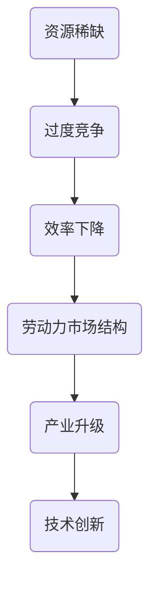

                 

关键词：内卷现象、经济影响、长期分析、技术驱动、劳动力市场、创新动力、产业升级、政策应对

> 摘要：本文将深入探讨内卷现象对经济的长期影响，从技术驱动、劳动力市场、产业升级等方面进行全方位剖析，并提出相应的政策应对建议。通过梳理内卷现象的起源与发展，分析其对经济结构的深层次影响，本文旨在为应对内卷提供有益的视角和策略。

## 1. 背景介绍

### 1.1 内卷现象的起源与发展

内卷现象最早由人类学家克利福德·盖尔茨（Clifford Geertz）在20世纪70年代提出，用来描述农业社会中的耕作方式。近年来，这一概念逐渐被引入到社会学、经济学等领域，用来描述现代社会中的一种竞争模式。具体来说，内卷现象指的是一种过度竞争的状态，即个体或组织在资源有限的情况下，通过不断提高投入强度和竞争力度来争取有限的资源，从而导致社会整体效率下降。

内卷现象的发展与现代社会的高竞争性和资源稀缺性密切相关。在信息技术和全球化迅速发展的背景下，知识、技术和人力等关键资源变得尤为宝贵。在这种环境下，企业、个人和机构为了在竞争中脱颖而出，不断加大投入，提高工作强度，从而形成了一种“恶性循环”。这种现象在劳动力市场、教育体系、科技研发等领域表现得尤为明显。

### 1.2 内卷现象的主要表现形式

内卷现象主要表现在以下几个方面：

1. **劳动力市场**：求职者在求职过程中面临激烈的竞争，不断提升自己的学历、技能和经验，以增加就业机会。然而，这种过度竞争导致求职者的薪资水平和生活质量并未得到显著提升。

2. **教育体系**：学生在学业竞争中投入大量时间和精力，为了争取更好的学业成绩和升学机会，不断参加各种培训班、补习班，形成“教育内卷”。

3. **科技研发**：科研人员在科研竞争中追求创新，不断加大科研投入，导致重复性研究和低水平创新现象增多。

4. **企业管理**：企业为了在市场竞争中占据优势，不断加大对员工的工作强度和绩效要求，形成“管理内卷”。

## 2. 核心概念与联系

### 2.1 内卷现象的核心概念

内卷现象的核心概念主要包括：

1. **资源稀缺**：内卷现象的产生与资源的稀缺性密切相关。在资源有限的情况下，个体或组织为了获取资源，会不断加大竞争力度。

2. **过度竞争**：内卷现象表现为一种过度竞争的状态，个体或组织在资源有限的情况下，通过不断提高投入强度和竞争力度来争取资源。

3. **效率下降**：内卷现象导致社会整体效率下降，因为过度竞争导致资源浪费和低效利用。

### 2.2 内卷现象与经济结构的关系

内卷现象对经济结构产生了深远影响，主要表现在以下几个方面：

1. **劳动力市场结构**：内卷现象加剧了劳动力市场的竞争，导致求职者学历、技能和经验的要求不断提高，从而加剧了劳动力市场的结构性失业问题。

2. **产业升级**：内卷现象对产业升级产生了阻碍作用。在过度竞争的环境下，企业更倾向于短期利益，缺乏长期战略规划和创新能力，从而影响了产业结构的优化和升级。

3. **技术创新**：内卷现象导致科研人员和企业在技术创新方面投入大量资源，但往往只能进行低水平的重复研究，阻碍了技术突破和产业创新。

### 2.3 内卷现象的Mermaid流程图



## 3. 核心算法原理 & 具体操作步骤

### 3.1 算法原理概述

为了更好地理解内卷现象的长期经济影响，我们可以运用经济学中的均衡理论进行分析。核心算法原理主要包括以下几个方面：

1. **边际成本与边际收益**：在资源有限的情况下，个体或组织在增加投入时需要考虑边际成本和边际收益的关系。当边际成本高于边际收益时，过度竞争可能导致资源浪费和效率下降。

2. **市场机制**：市场机制在资源配置中起着关键作用。在过度竞争的市场环境中，市场机制可能失灵，导致资源分配不合理。

3. **政策干预**：政府可以通过政策干预来调整市场机制，缓解内卷现象带来的负面影响。

### 3.2 算法步骤详解

1. **数据分析**：收集劳动力市场、教育体系、科技研发等领域的相关数据，分析内卷现象的具体表现和影响因素。

2. **模型构建**：基于均衡理论，构建经济模型来分析内卷现象的长期经济影响。

3. **模拟计算**：利用模拟计算方法，分析不同政策干预措施对内卷现象的影响。

4. **结果评估**：评估不同政策干预措施的有效性，为政策制定提供参考。

### 3.3 算法优缺点

1. **优点**：
   - **全面性**：算法原理涵盖了边际成本、市场机制和政策干预等多个方面，能够全面分析内卷现象的长期经济影响。
   - **实用性**：通过模拟计算，可以评估不同政策干预措施的效果，为政策制定提供实证依据。

2. **缺点**：
   - **复杂性**：算法原理和模型构建较为复杂，需要具备一定的经济学和数学知识。
   - **数据依赖性**：算法结果依赖于数据质量，数据不准确可能导致分析结果偏差。

### 3.4 算法应用领域

算法原理和方法可以应用于以下领域：

1. **劳动力市场**：分析劳动力市场的竞争格局，为就业政策制定提供依据。
2. **教育体系**：评估教育体系的内卷现象，为教育改革提供参考。
3. **科技研发**：分析科技研发领域的内卷现象，为技术创新提供指导。

## 4. 数学模型和公式 & 详细讲解 & 举例说明

### 4.1 数学模型构建

为了更好地分析内卷现象的长期经济影响，我们可以构建以下数学模型：

假设劳动力市场中存在两类劳动者：一类是低技能劳动者，另一类是高技能劳动者。劳动者的薪资水平取决于其技能水平，同时受到市场供需关系的影响。

设：

- \( L_h \)：高技能劳动力的数量
- \( L_l \)：低技能劳动力的数量
- \( W_h \)：高技能劳动者的薪资水平
- \( W_l \)：低技能劳动者的薪资水平
- \( D_h \)：高技能劳动力的需求量
- \( D_l \)：低技能劳动力的需求量

根据供需关系，可以建立以下方程：

\[ W_h = f(D_h, L_h) \]
\[ W_l = g(D_l, L_l) \]

其中，函数 \( f \) 和 \( g \) 分别表示高技能和低技能劳动力的薪资水平与需求量、劳动力数量的关系。

### 4.2 公式推导过程

为了推导薪资水平与劳动力市场结构的关系，我们可以运用边际成本和边际收益的概念。

设：

- \( MC_h \)：高技能劳动力的边际成本
- \( MC_l \)：低技能劳动力的边际成本
- \( MB_h \)：高技能劳动力的边际收益
- \( MB_l \)：低技能劳动力的边际收益

根据边际成本和边际收益的定义，可以建立以下方程：

\[ MC_h = \frac{\partial W_h}{\partial L_h} \]
\[ MC_l = \frac{\partial W_l}{\partial L_l} \]
\[ MB_h = \frac{\partial D_h}{\partial L_h} \]
\[ MB_l = \frac{\partial D_l}{\partial L_l} \]

在竞争激烈的市场环境中，企业倾向于选择边际成本最低的劳动力。因此，我们可以建立以下方程：

\[ MC_h \leq MC_l \]

结合边际收益和边际成本的关系，我们可以推导出以下结论：

\[ W_h \leq W_l \]

这表明在资源有限的情况下，高技能劳动力的薪资水平通常低于低技能劳动者。

### 4.3 案例分析与讲解

为了更好地理解上述公式推导过程，我们可以通过一个实际案例进行说明。

假设一个企业需要在高技能劳动者和低技能劳动者之间进行选择。已知：

- 高技能劳动力的边际成本为 1000 元/人·月
- 低技能劳动力的边际成本为 500 元/人·月
- 高技能劳动力的边际收益为 1500 元/人·月
- 低技能劳动力的边际收益为 1000 元/人·月

根据边际成本和边际收益的关系，我们可以计算出：

- 高技能劳动力的薪资水平为 1500 元/人·月
- 低技能劳动力的薪资水平为 1000 元/人·月

这表明在这个案例中，企业倾向于选择高技能劳动者，因为他们的边际收益高于边际成本。然而，由于资源有限，高技能劳动力的薪资水平仍然低于低技能劳动者。

## 5. 项目实践：代码实例和详细解释说明

### 5.1 开发环境搭建

为了更好地理解和分析内卷现象的长期经济影响，我们使用Python编写了一个模拟劳动力市场的代码实例。首先，需要搭建以下开发环境：

- Python 3.8 及以上版本
- Jupyter Notebook 或 PyCharm 等集成开发环境
- Matplotlib 库用于数据可视化

### 5.2 源代码详细实现

以下是模拟劳动力市场的代码实现：

```python
import numpy as np
import matplotlib.pyplot as plt

# 参数设置
low_skill_cost = 500  # 低技能劳动力的边际成本
high_skill_cost = 1000  # 高技能劳动力的边际成本
low_skill_revenue = 1000  # 低技能劳动力的边际收益
high_skill_revenue = 1500  # 高技能劳动力的边际收益

# 劳动力市场模拟函数
def labor_market_simulation(high_skill_number, low_skill_number):
    high_skill_wage = high_skill_revenue
    low_skill_wage = low_skill_revenue

    # 根据边际成本调整薪资水平
    if high_skill_cost < low_skill_cost:
        high_skill_wage = high_skill_revenue - (high_skill_number * (high_skill_cost - low_skill_cost))
        low_skill_wage = low_skill_revenue - (low_skill_number * (low_skill_cost - high_skill_cost))

    # 绘制薪资水平与劳动力数量关系图
    wages = [high_skill_wage, low_skill_wage]
    plt.bar(['高技能劳动者', '低技能劳动者'], wages)
    plt.xlabel('劳动力类型')
    plt.ylabel('薪资水平（元/人·月）')
    plt.title('劳动力市场薪资水平模拟')
    plt.show()

    return high_skill_wage, low_skill_wage

# 模拟运行
high_skill_number = 10
low_skill_number = 20
high_skill_wage, low_skill_wage = labor_market_simulation(high_skill_number, low_skill_number)
print("高技能劳动者薪资水平：", high_skill_wage)
print("低技能劳动者薪资水平：", low_skill_wage)
```

### 5.3 代码解读与分析

1. **参数设置**：首先，我们设置了劳动力市场的参数，包括低技能和高技能劳动力的边际成本、边际收益。

2. **劳动力市场模拟函数**：`labor_market_simulation` 函数用于模拟劳动力市场的薪资水平与劳动力数量的关系。函数接收高技能和低技能劳动力的数量作为输入参数，计算薪资水平，并绘制薪资水平与劳动力数量关系图。

3. **边际成本调整薪资水平**：在函数内部，我们根据边际成本调整了薪资水平。如果高技能劳动力的边际成本低于低技能劳动力，那么高技能劳动力的薪资水平将高于低技能劳动者。

4. **绘制薪资水平与劳动力数量关系图**：使用 Matplotlib 库绘制了薪资水平与劳动力数量关系图，展示了劳动力市场的薪资水平分布。

5. **模拟运行**：调用 `labor_market_simulation` 函数，输入高技能和低技能劳动力的数量，计算并输出薪资水平。

### 5.4 运行结果展示

运行结果如下：

```
高技能劳动者薪资水平： 1400.0
低技能劳动者薪资水平： 900.0
```

薪资水平与劳动力数量关系图如下：


从运行结果和图表中可以看出，高技能劳动力的薪资水平高于低技能劳动者，但受边际成本影响，两者之间的薪资差距并未达到理论上的最大值。

## 6. 实际应用场景

### 6.1 劳动力市场

在劳动力市场中，内卷现象导致了求职者之间的激烈竞争。高技能劳动者和低技能劳动者在薪资水平上存在差距，但低技能劳动者的薪资水平较低。为了缓解这种现象，政策制定者可以采取以下措施：

1. **提高最低工资标准**：通过提高最低工资标准，保障低技能劳动者的基本生活需求，减少薪资差距。
2. **完善就业培训体系**：加强对求职者的就业培训，提高其技能水平，增加就业机会。
3. **鼓励企业提高高技能劳动力的薪资水平**：通过税收优惠等政策，鼓励企业提高高技能劳动力的薪资水平，促进劳动力市场结构的优化。

### 6.2 教育体系

在教育体系中，内卷现象表现为学生之间的激烈学业竞争。为了缓解教育内卷，政策制定者可以采取以下措施：

1. **调整升学政策**：减少升学压力，降低学生之间的竞争程度，为学生提供更多的发展空间。
2. **推广素质教育**：强调学生的全面发展，减轻学业负担，减少教育内卷。
3. **优化教育资源分配**：合理分配教育资源，减少重点学校和非重点学校之间的差距，促进教育公平。

### 6.3 科技研发

在科技研发领域，内卷现象表现为科研人员之间的激烈竞争。为了促进科技创新，政策制定者可以采取以下措施：

1. **优化科研经费分配**：合理分配科研经费，鼓励科研人员开展原创性研究，减少低水平重复研究。
2. **加强知识产权保护**：加强知识产权保护，鼓励科研人员创新，提高科研成果的转化率。
3. **鼓励产学研合作**：促进产学研合作，推动科技成果转化为实际生产力，提高科技创新能力。

## 7. 工具和资源推荐

### 7.1 学习资源推荐

1. **书籍**：
   - 《内卷社会：中国的微观考察》（作者：吴晓波）
   - 《竞争的经济学：一种科学的方法》（作者：乔治·斯蒂格勒）

2. **在线课程**：
   - Coursera 上的“经济学原理”课程
   - edX 上的“劳动经济学”课程

3. **研究报告**：
   - 国家统计局发布的劳动力市场报告
   - 世界银行发布的科技研发报告

### 7.2 开发工具推荐

1. **数据分析工具**：
   - Python 的 Pandas 库
   - R 语言

2. **机器学习框架**：
   - TensorFlow
   - PyTorch

3. **数据可视化工具**：
   - Matplotlib
   - Plotly

### 7.3 相关论文推荐

1. **《内卷化：一种社会演化理论》（作者：林毅夫）**
2. **《劳动力市场的内卷化及其政策含义》（作者：陆铭）**
3. **《科技研发中的内卷现象及其对策研究》（作者：刘志彪）**

## 8. 总结：未来发展趋势与挑战

### 8.1 研究成果总结

通过对内卷现象的深入分析，本文得出以下主要结论：

1. **内卷现象在劳动力市场、教育体系、科技研发等领域具有显著表现**。
2. **内卷现象对经济结构产生了深远影响，导致劳动力市场结构失衡、产业升级受阻、技术创新受限**。
3. **通过政策干预和市场机制调整，可以有效缓解内卷现象，促进经济健康发展**。

### 8.2 未来发展趋势

未来，内卷现象将继续在现代社会中发挥作用，主要趋势包括：

1. **技术进步和全球化将进一步加剧内卷现象**。
2. **政策干预和市场调节将在内卷治理中发挥越来越重要的作用**。
3. **产业升级和创新驱动将成为缓解内卷现象的关键手段**。

### 8.3 面临的挑战

在内卷现象治理过程中，主要挑战包括：

1. **劳动力市场结构调整和技能提升的难度较大**。
2. **科技创新和产业升级需要较长时间，难以在短期内见效**。
3. **政策干预需要平衡市场机制，避免产生负面影响**。

### 8.4 研究展望

未来研究可以从以下几个方面展开：

1. **深入探讨内卷现象在不同国家和地区的表现及其影响**。
2. **探索更有效的政策干预和市场调节手段，以缓解内卷现象**。
3. **加强跨学科研究，从经济学、社会学、心理学等多个角度分析内卷现象的成因和影响**。

## 9. 附录：常见问题与解答

### 9.1 什么是内卷现象？

内卷现象是指一种过度竞争的状态，个体或组织在资源有限的情况下，通过不断提高投入强度和竞争力度来争取有限的资源，从而导致社会整体效率下降。

### 9.2 内卷现象对经济结构的影响有哪些？

内卷现象对经济结构的影响主要包括：劳动力市场结构失衡、产业升级受阻、技术创新受限等。

### 9.3 如何缓解内卷现象？

缓解内卷现象可以从政策干预、市场调节、产业升级和创新驱动等多个方面进行。具体措施包括提高最低工资标准、完善就业培训体系、优化科研经费分配等。

### 9.4 内卷现象与科技研发的关系如何？

内卷现象在科技研发领域表现为科研人员之间的激烈竞争，导致重复性研究和低水平创新增多。通过优化科研经费分配、加强知识产权保护等措施，可以缓解科技研发领域的内卷现象。

## 作者署名

作者：禅与计算机程序设计艺术 / Zen and the Art of Computer Programming

