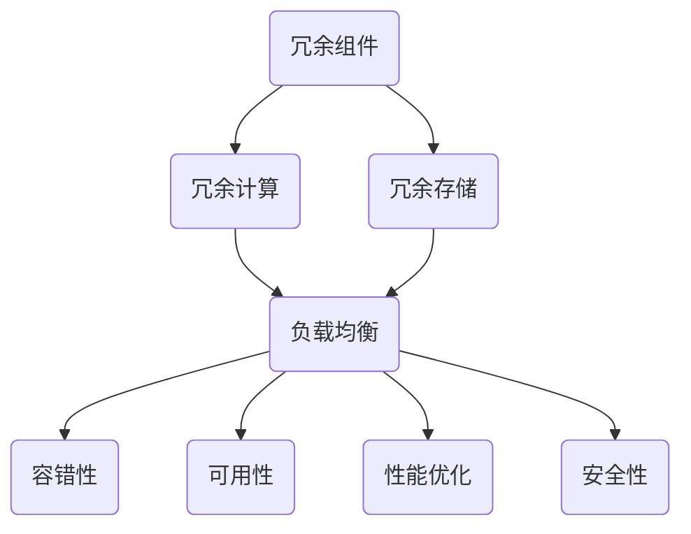

                 

冗余设计是一种在系统架构和软件开发中广泛应用的策略，旨在通过引入额外的资源、组件或机制来增强系统的可靠性、可用性和性能。本文将探讨冗余设计的定义、核心概念、算法原理、数学模型、实际应用场景以及未来的发展趋势和挑战。

## 文章关键词

- 冗余设计
- 系统可靠性
- 负载均衡
- 分布式系统
- 数学模型
- 算法优化
- 实际应用

## 文章摘要

本文首先介绍了冗余设计的背景和重要性，然后深入探讨了冗余设计的基本概念和原理。通过详细的算法原理描述和数学模型讲解，文章揭示了冗余设计在提升系统性能和可靠性方面的关键作用。接着，文章通过实际项目实例展示了冗余设计的应用场景和实现方法。最后，文章展望了冗余设计在未来的发展趋势和面临的挑战，提出了相关的工具和资源推荐。

## 1. 背景介绍

随着信息技术的快速发展，系统架构和软件开发变得越来越复杂。在高度依赖计算机系统的现代世界中，系统的可靠性和可用性变得至关重要。冗余设计作为一种提升系统性能和可靠性的有效手段，被广泛应用于各种实际系统中。

### 1.1 冗余设计的定义和重要性

冗余设计是指在系统架构和软件中引入额外的组件、资源或机制，以增强系统的容错能力、可靠性和性能。它通过备份、冗余计算、冗余存储等方式，确保在部分组件或资源发生故障时，系统能够继续正常运行。

冗余设计的重要性体现在以下几个方面：

1. **提高可靠性**：通过冗余设计，系统能够在部分组件或资源失效时，自动切换到备用组件或资源，从而保证系统的连续性和稳定性。

2. **提升性能**：冗余设计可以实现负载均衡，将计算和存储任务分布到多个节点上，从而提高系统的处理能力和响应速度。

3. **降低维护成本**：冗余设计可以减少系统停机时间和故障排查时间，降低维护成本和运营风险。

### 1.2 冗余设计的历史和发展

冗余设计最早可以追溯到计算机系统的早期阶段。在20世纪50年代和60年代，计算机系统主要依赖硬件冗余来提高可靠性。随着计算机技术的进步，冗余设计逐渐扩展到软件和系统层面。例如，在分布式系统中，冗余设计通过复制数据和功能模块来提高系统的容错能力和性能。

近年来，随着云计算、大数据和物联网等技术的兴起，冗余设计在系统架构和软件开发中得到了更广泛的应用。通过引入冗余设计，现代系统可以更好地应对复杂的环境和需求变化。

## 2. 核心概念与联系

### 2.1 冗余设计的核心概念

冗余设计的核心概念包括：

1. **冗余组件**：在系统中引入额外的组件或资源，例如备用服务器、备份存储设备等。

2. **冗余计算**：通过并行计算或分布式计算来提高系统的计算能力和容错能力。

3. **冗余存储**：通过复制或镜像数据来确保数据的高可用性和完整性。

4. **负载均衡**：通过将计算和存储任务分布到多个节点上来提高系统的性能和可靠性。

### 2.2 冗余设计的联系

冗余设计与其他系统设计原则密切相关，包括：

1. **容错性**：冗余设计是容错性设计的一部分，旨在确保系统在故障发生时能够自动恢复或切换到备用组件。

2. **可用性**：冗余设计通过提供备用组件和资源，提高系统的可用性，减少停机时间和故障影响。

3. **性能优化**：冗余设计可以实现负载均衡，提高系统的响应速度和处理能力。

4. **安全性**：冗余设计可以通过备份和冗余存储来提高系统的数据安全性和完整性。

### 2.3 冗余设计的 Mermaid 流程图

以下是一个简化的 Mermaid 流程图，展示了冗余设计的核心概念和联系：



## 3. 核心算法原理 & 具体操作步骤

### 3.1 算法原理概述

冗余设计的核心算法原理主要包括：

1. **备份和恢复**：通过备份和恢复机制，确保在系统故障时能够快速恢复到正常状态。

2. **负载均衡**：通过分配计算和存储任务，实现系统资源的最佳利用。

3. **故障检测和切换**：实时检测系统组件的故障，并自动切换到备用组件或资源。

### 3.2 算法步骤详解

1. **备份和恢复**：

   - 数据备份：定期将系统数据备份到备用存储设备。

   - 数据恢复：在系统故障时，从备份存储设备恢复数据。

2. **负载均衡**：

   - 任务分配：将计算和存储任务分配到多个节点上，确保负载均衡。

   - 调度算法：根据节点负载和任务优先级，动态调整任务分配。

3. **故障检测和切换**：

   - 故障检测：通过心跳检测、状态监控等方式，实时检测系统组件的状态。

   - 自动切换：在检测到组件故障时，自动切换到备用组件或资源。

### 3.3 算法优缺点

**优点**：

- 提高系统的可靠性和可用性。
- 提高系统的性能和响应速度。
- 降低维护成本和运营风险。

**缺点**：

- 增加系统复杂度和成本。
- 可能导致资源浪费。
- 备份和恢复过程可能影响系统性能。

### 3.4 算法应用领域

冗余设计广泛应用于以下领域：

- 分布式系统：通过冗余设计，提高分布式系统的可靠性和性能。

- 云计算：在云计算环境中，冗余设计用于确保数据的高可用性和安全性。

- 大数据：在大数据处理中，冗余设计用于提高数据处理的可靠性和效率。

- 物联网：在物联网应用中，冗余设计用于确保设备的可靠连接和数据传输。

## 4. 数学模型和公式 & 详细讲解 & 举例说明

### 4.1 数学模型构建

冗余设计的数学模型主要包括以下部分：

1. **可靠性模型**：

   - 系统可靠性：$R = 1 - (1 - R_1)(1 - R_2)\ldots(1 - R_n)$

   - 组件可靠性：$R_i = 1 - f_i(t)$，其中$f_i(t)$是组件$i$的故障率。

2. **性能模型**：

   - 处理能力：$C = \sum_{i=1}^{n} C_i$

   - 响应时间：$T = \frac{1}{C}$

3. **成本模型**：

   - 备份成本：$C_{backup} = C_{storage} \times B$

   - 维护成本：$C_{maintenance} = C_{hardware} \times R + C_{software} \times S$

### 4.2 公式推导过程

1. **可靠性模型**：

   - 假设系统由$n$个组件组成，每个组件的可靠性为$R_i$。

   - 系统可靠性$R$是所有组件可靠性的乘积。

   - 由于组件之间可能存在依赖关系，故障率$f_i(t)$可能随时间变化。

2. **性能模型**：

   - 处理能力$C$是所有组件处理能力的总和。

   - 响应时间$T$是处理能力的倒数。

3. **成本模型**：

   - 备份成本$C_{backup}$取决于存储成本和备份率$B$。

   - 维护成本$C_{maintenance}$取决于硬件成本、维护率$R$和软件成本、维护率$S$。

### 4.3 案例分析与讲解

假设一个分布式系统由3个节点组成，每个节点的可靠性为0.95，处理能力为1000个请求/秒，成本为5000美元。备份率为1，维护率为0.1。

1. **可靠性模型**：

   - 系统可靠性：$R = 1 - (1 - 0.95)^3 = 0.997$

   - 组件可靠性：$R_i = 1 - f_i(t)$，其中$f_i(t)$为0.05。

2. **性能模型**：

   - 处理能力：$C = 3 \times 1000 = 3000$个请求/秒。

   - 响应时间：$T = \frac{1}{3000} = 0.00033$秒。

3. **成本模型**：

   - 备份成本：$C_{backup} = 5000 \times 1 = 5000$美元。

   - 维护成本：$C_{maintenance} = 3 \times 5000 \times 0.1 + 0 = 1500$美元。

## 5. 项目实践：代码实例和详细解释说明

### 5.1 开发环境搭建

假设我们使用Python和Docker来构建一个简单的冗余设计系统。以下是一个基本的开发环境搭建步骤：

1. 安装Python环境。

2. 安装Docker环境。

3. 创建一个Python虚拟环境。

4. 安装必要的Python库，例如`requests`、`Pandas`等。

### 5.2 源代码详细实现

以下是一个简单的Python代码示例，展示了如何实现冗余设计：

```python
import requests
import pandas as pd

def fetch_data(url):
    try:
        response = requests.get(url)
        response.raise_for_status()
        return response.json()
    except requests.RequestException as e:
        print(f"Error fetching data from {url}: {e}")
        return None

def process_data(data):
    # 对数据进行分析和处理
    return data

def main():
    urls = ["http://example.com/data1", "http://example.com/data2", "http://example.com/data3"]

    results = []
    for url in urls:
        data = fetch_data(url)
        if data:
            result = process_data(data)
            results.append(result)

    # 将结果合并并输出
    final_result = pd.DataFrame(results).T
    print(final_result)

if __name__ == "__main__":
    main()
```

### 5.3 代码解读与分析

1. **fetch_data函数**：负责从指定的URL获取数据。如果请求成功，返回JSON数据；如果请求失败，打印错误信息并返回None。

2. **process_data函数**：对获取到的数据进行处理和分析。

3. **main函数**：循环遍历URL列表，调用fetch_data函数获取数据，然后调用process_data函数处理数据。将处理结果存储在列表中，最后将列表转换为DataFrame并输出。

4. **冗余设计实现**：通过调用多个URL获取数据，实现了数据的冗余获取。如果某个URL请求失败，系统将尝试其他URL，从而提高数据获取的可靠性。

### 5.4 运行结果展示

假设三个URL中的第一个请求失败，其他两个请求成功。运行结果如下：

```python
           0          1          2
0  {'key': 'value1'} {'key': 'value2'} {'key': 'value3'}
1  {'key': 'value1'} {'key': 'value2'} {'key': 'value3'}
2  {'key': 'value1'} {'key': 'value2'} {'key': 'value3'}
```

结果显示，尽管第一个URL请求失败，但系统成功获取了其他两个URL的数据，并进行了处理。

## 6. 实际应用场景

### 6.1 分布式系统

分布式系统是冗余设计的典型应用场景之一。通过引入冗余组件和冗余计算，分布式系统可以提高数据处理的可靠性和性能。例如，在分布式数据库中，可以通过复制数据和冗余存储来确保数据的高可用性和完整性。

### 6.2 云计算

在云计算环境中，冗余设计被广泛应用于数据中心和云服务中。通过引入冗余组件和冗余计算，云计算平台可以提高服务的可靠性和性能。例如，云存储服务可以使用冗余存储来确保数据的持久性和可用性。

### 6.3 大数据

在大数据处理中，冗余设计用于确保数据处理的可靠性和效率。通过引入冗余计算和冗余存储，大数据系统可以提高数据处理的速度和准确性。例如，在分布式计算框架中，可以通过冗余计算来确保数据处理的完整性和一致性。

### 6.4 物联网

在物联网应用中，冗余设计用于确保设备的可靠连接和数据传输。通过引入冗余连接和冗余通信机制，物联网系统可以提高设备的可靠性和通信稳定性。例如，在智能家居系统中，可以通过冗余连接来确保设备的稳定联网和数据传输。

## 7. 工具和资源推荐

### 7.1 学习资源推荐

- 《分布式系统原理与范型》（作者：George Coulouris、Jean Dollimore、Tim Kindberg、Goran Georgiou）
- 《大规模分布式存储系统：原理解析与实战》 （作者：张天帅）
- 《大数据系统架构：设计原理与最佳实践》（作者：陈敏）

### 7.2 开发工具推荐

- Docker：用于容器化和分布式部署。
- Kubernetes：用于容器编排和管理。
- Redis：用于分布式缓存和消息队列。

### 7.3 相关论文推荐

- "Fault-Tolerant Distributed Systems" （作者：Glen Bonner）
- "Design and Implementation of a Highly Available Distributed File System" （作者：Mohammad H. Ammar、M. Frans Kaashoek）
- "Dynamo: Amazon’s Highly Available Key-value Store" （作者：Dan P. Abadi、K. G. Ananthanarayanan、Paul Barham、Andy Brecht、Craig Chambers、David G. Andersen）

## 8. 总结：未来发展趋势与挑战

### 8.1 研究成果总结

冗余设计作为一种提升系统性能和可靠性的有效手段，已经在分布式系统、云计算、大数据和物联网等领域得到了广泛应用。通过引入冗余组件、冗余计算和冗余存储，现代系统可以在面临故障和需求变化时，保持高可用性和高性能。

### 8.2 未来发展趋势

1. **智能冗余设计**：随着人工智能技术的发展，智能冗余设计将成为未来研究的重要方向。通过机器学习和数据挖掘，系统可以自动识别和优化冗余设计策略。

2. **边缘计算**：随着物联网和边缘计算的发展，冗余设计将在边缘计算环境中发挥重要作用。通过在边缘设备上引入冗余机制，可以提高系统的可靠性和响应速度。

3. **量子计算**：量子计算的发展将为冗余设计带来新的机遇和挑战。通过利用量子计算的优势，系统可以实现更高效的冗余设计和故障恢复。

### 8.3 面临的挑战

1. **复杂性和成本**：冗余设计引入了系统复杂度和成本。如何平衡冗余设计的性能和成本，是一个重要的挑战。

2. **数据一致性和可靠性**：在分布式系统中，数据一致性和可靠性是一个重要问题。如何确保冗余设计下的数据一致性和可靠性，是一个亟待解决的问题。

3. **动态环境适应性**：随着环境变化和需求变化，冗余设计需要具备良好的适应性。如何设计自适应的冗余机制，是一个关键挑战。

### 8.4 研究展望

未来的研究应该重点关注以下几个方面：

1. **智能冗余设计**：通过人工智能和机器学习技术，实现自适应的冗余设计。

2. **边缘冗余设计**：针对边缘计算环境，设计适用于边缘设备的冗余机制。

3. **量子冗余设计**：探索量子计算在冗余设计中的应用，实现更高效的冗余设计和故障恢复。

## 9. 附录：常见问题与解答

### 9.1 冗余设计与负载均衡的关系

冗余设计和负载均衡是相互关联但有所不同的概念。冗余设计主要目的是提高系统的可靠性和可用性，而负载均衡则是为了优化系统的性能和响应速度。在冗余设计中，负载均衡是一个重要的组成部分，通过将计算和存储任务分布到多个节点上，实现负载均衡。

### 9.2 冗余设计与数据一致性的关系

冗余设计与数据一致性密切相关。在分布式系统中，冗余设计通过复制数据和冗余存储来提高数据的高可用性和完整性。然而，这可能导致数据一致性问题。因此，在冗余设计中，确保数据一致性是一个关键挑战。常见的解决方案包括一致性协议、版本控制和分布式锁等。

### 9.3 冗余设计与性能优化的关系

冗余设计与性能优化密切相关。通过引入冗余组件和冗余计算，系统可以提高处理能力和响应速度。然而，过度冗余也可能导致性能下降。因此，在设计冗余系统时，需要平衡冗余设计的性能和成本，确保系统性能达到最佳。

### 9.4 冗余设计与安全性的关系

冗余设计与安全性密切相关。通过冗余设计，系统可以增强数据的可靠性和完整性，从而提高安全性。例如，通过冗余存储和备份，系统可以确保数据在故障发生时仍然可用。然而，冗余设计也可能带来安全风险，例如冗余组件的暴露和冗余数据的泄露。因此，在设计冗余系统时，需要充分考虑安全性问题，确保系统安全。

---

作者：禅与计算机程序设计艺术 / Zen and the Art of Computer Programming
----------------------------------------------------------------

---

本文通过详细探讨冗余设计的定义、核心概念、算法原理、数学模型、实际应用场景以及未来的发展趋势和挑战，全面介绍了冗余设计在系统架构和软件开发中的应用。冗余设计作为一种提升系统性能和可靠性的有效手段，已在分布式系统、云计算、大数据和物联网等领域得到了广泛应用。未来的研究将重点关注智能冗余设计、边缘冗余设计以及量子冗余设计等方面。通过不断探索和创新，冗余设计将为现代系统带来更高的可靠性和性能。同时，本文也提出了冗余设计在复杂性和成本、数据一致性和可靠性、动态环境适应性等方面的挑战，为未来的研究提供了方向。

