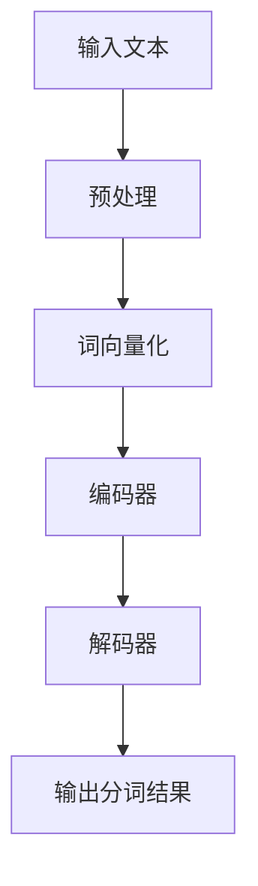

                 

### 关键词 Keywords

- 分词
- 自然语言处理
- 算法
- 代码实例
- 中文信息处理

### 摘要 Abstract

本文将深入探讨分词这一自然语言处理中的关键技术。我们将从基本原理出发，详细讲解分词在不同算法中的应用，并通过具体的代码实例展示如何实现分词功能。此外，文章还将讨论分词在实际应用场景中的重要性，并提供相关学习资源和开发工具的推荐。通过本文的阅读，读者将对分词技术有更全面的理解，并能够掌握其实际应用的方法。

## 1. 背景介绍

### 1.1 什么是分词？

分词（Tokenization）是将连续的文本序列切分成有意义的词汇或短语的过程。这一过程对于自然语言处理（Natural Language Processing, NLP）至关重要，因为它为后续的文本分析奠定了基础。分词的目标是识别文本中的词法单元，从而使得计算机能够理解人类语言。

### 1.2 分词的重要性

分词在许多NLP任务中都扮演着重要角色，如文本分类、情感分析、机器翻译和命名实体识别等。准确和高效的分词能够提高这些任务的效果，从而使得机器更好地理解和处理人类语言。

### 1.3 分词技术的发展

随着计算机技术和人工智能的进步，分词技术也经历了显著的发展。从早期的基于规则的方法到后来的基于统计和机器学习的方法，再到深度学习技术的应用，分词技术逐渐变得更加智能和准确。

## 2. 核心概念与联系

### 2.1 分词算法原理

分词算法的核心目标是识别文本中的词法单元。常见的分词算法有基于词典的、基于统计的、基于机器学习的和基于深度学习的。以下是这些算法的基本原理：

1. **基于词典的分词算法**：通过预先构建的词典来匹配文本中的词汇，常见方法包括正向最大匹配、逆向最大匹配和双向最大匹配等。

2. **基于统计的分词算法**：利用统计方法，如隐马尔可夫模型（HMM）、条件随机场（CRF）等，对文本序列进行建模，从而识别词法单元。

3. **基于机器学习的分词算法**：使用机器学习算法，如支持向量机（SVM）、朴素贝叶斯等，对标注过的语料进行训练，从而构建分词模型。

4. **基于深度学习的分词算法**：利用深度神经网络，如卷积神经网络（CNN）和长短期记忆网络（LSTM）等，对文本进行建模，从而实现分词。

### 2.2 分词算法架构

以下是一个基于深度学习的分词算法架构的Mermaid流程图：



- **输入文本**：输入待分词的文本。
- **预处理**：对文本进行清洗和规范化，如去除标点符号、统一字符大小写等。
- **词向量化**：将文本中的词汇转换为词向量，以便于深度学习模型处理。
- **编码器**：将词向量编码为固定长度的向量，用于后续的解码过程。
- **解码器**：根据编码器的输出，解码出分词结果。
- **输出分词结果**：输出最终的分词结果。

## 3. 核心算法原理 & 具体操作步骤

### 3.1 算法原理概述

深度学习分词算法的核心是利用深度神经网络对文本序列进行建模，从而实现词法单元的识别。以下是深度学习分词算法的基本原理：

1. **词嵌入（Word Embedding）**：将文本中的词汇映射为高维空间中的向量，从而使得相似词汇在空间中更接近。

2. **编码器（Encoder）**：将词向量编码为固定长度的向量，用于捕捉文本序列的上下文信息。

3. **解码器（Decoder）**：根据编码器的输出，解码出分词结果。

4. **损失函数（Loss Function）**：通过损失函数评估模型的分词结果，并指导模型优化。

### 3.2 算法步骤详解

1. **数据预处理**：

   - 下载并预处理中文语料，如人民日报、百度贴吧等。
   - 构建词典，将文本中的词汇映射为唯一的索引。
   - 切分句子，将文本序列转换为词汇序列。

2. **词向量化**：

   - 使用预训练的词向量模型，如GloVe或Word2Vec，将词汇映射为词向量。
   - 如果没有预训练的词向量，可以使用词嵌入算法从零开始训练。

3. **编码器与解码器**：

   - 编码器通常采用RNN或LSTM等循环神经网络，用于编码文本序列。
   - 解码器则采用同样的神经网络结构，但输出层不同。解码器的输出层通常是一个全连接层，用于预测分词结果。

4. **训练过程**：

   - 使用训练数据训练编码器和解码器，通过反向传播算法优化模型参数。
   - 使用验证集评估模型的性能，并根据性能调整模型参数。

5. **分词应用**：

   - 使用训练好的模型对新的文本进行分词。
   - 输出分词结果，并进行后处理，如去除未识别的词汇、统一词性标注等。

### 3.3 算法优缺点

**优点**：

- **高效性**：深度学习分词算法在处理大规模文本时具有较高的效率。
- **准确性**：通过训练模型，深度学习分词算法能够识别复杂的词法结构，从而提高分词准确性。
- **可扩展性**：深度学习算法可以轻松扩展到其他自然语言处理任务。

**缺点**：

- **训练成本**：深度学习分词算法需要大量的训练数据和计算资源。
- **解释性差**：深度学习模型往往缺乏可解释性，难以理解模型的具体工作原理。
- **对数据依赖性强**：深度学习模型的性能高度依赖于训练数据的质量和规模。

### 3.4 算法应用领域

深度学习分词算法在许多自然语言处理任务中都有广泛应用，如：

- **文本分类**：利用分词结果对文本进行分类，如情感分类、主题分类等。
- **机器翻译**：利用分词结果对源语言和目标语言进行对齐，从而提高翻译质量。
- **命名实体识别**：利用分词结果识别文本中的命名实体，如人名、地名等。

## 4. 数学模型和公式 & 详细讲解 & 举例说明

### 4.1 数学模型构建

深度学习分词算法的核心数学模型是循环神经网络（RNN），特别是长短期记忆网络（LSTM）。以下是LSTM的基本数学模型：

1. **输入门（Input Gate）**：

   $$ 
   i_t = \sigma(W_{ix}x_t + W_{ih}h_{t-1} + b_i) 
   $$

   其中，$i_t$ 表示输入门的状态，$x_t$ 表示当前输入词的词向量，$h_{t-1}$ 表示前一时间步的隐藏状态，$W_{ix}$ 和 $W_{ih}$ 分别表示输入权重和隐藏状态权重，$b_i$ 表示偏置。

2. **遗忘门（Forget Gate）**：

   $$ 
   f_t = \sigma(W_{fx}x_t + W_{fh}h_{t-1} + b_f) 
   $$

   其中，$f_t$ 表示遗忘门的状态，其他符号的含义与输入门相同。

3. **输出门（Output Gate）**：

   $$ 
   o_t = \sigma(W_{ox}x_t + W_{oh}h_{t-1} + b_o) 
   $$

   其中，$o_t$ 表示输出门的状态，其他符号的含义与输入门相同。

4. **细胞状态更新（Cell State Update）**：

   $$ 
   c_t = f_t \odot c_{t-1} + i_t \odot \text{sigmoid}(W_c \cdot [x_t; h_{t-1}] + b_c) 
   $$

   其中，$c_t$ 表示细胞状态，$\odot$ 表示元素乘法，$\text{sigmoid}$ 函数用于将输入向量映射到 $(0, 1)$ 区间，$W_c$ 和 $b_c$ 分别表示细胞状态权重和偏置。

5. **隐藏状态更新（Hidden State Update）**：

   $$ 
   h_t = o_t \odot \text{sigmoid}(c_t) 
   $$

   其中，$h_t$ 表示隐藏状态，其他符号的含义与细胞状态更新相同。

### 4.2 公式推导过程

以下是LSTM的公式推导过程：

1. **输入门**：

   输入门的目的是决定当前输入对细胞状态的贡献。具体地，输入门的状态 $i_t$ 是通过当前输入词的词向量 $x_t$ 和前一时间步的隐藏状态 $h_{t-1}$ 计算得到的。输入门的状态计算如下：

   $$ 
   i_t = \sigma(W_{ix}x_t + W_{ih}h_{t-1} + b_i) 
   $$

   其中，$\sigma$ 表示sigmoid函数，$W_{ix}$ 和 $W_{ih}$ 分别表示输入权重和隐藏状态权重，$b_i$ 表示偏置。

2. **遗忘门**：

   遗忘门的目的是决定如何从细胞状态中丢弃信息。具体地，遗忘门的状态 $f_t$ 是通过当前输入词的词向量 $x_t$ 和前一时间步的隐藏状态 $h_{t-1}$ 计算得到的。遗忘门的状态计算如下：

   $$ 
   f_t = \sigma(W_{fx}x_t + W_{fh}h_{t-1} + b_f) 
   $$

   其中，$\sigma$ 表示sigmoid函数，$W_{fx}$ 和 $W_{fh}$ 分别表示输入权重和隐藏状态权重，$b_f$ 表示偏置。

3. **输出门**：

   输出门的目的是决定如何从细胞状态中提取信息以生成隐藏状态。具体地，输出门的状态 $o_t$ 是通过当前输入词的词向量 $x_t$ 和前一时间步的隐藏状态 $h_{t-1}$ 计算得到的。输出门的状态计算如下：

   $$ 
   o_t = \sigma(W_{ox}x_t + W_{oh}h_{t-1} + b_o) 
   $$

   其中，$\sigma$ 表示sigmoid函数，$W_{ox}$ 和 $W_{oh}$ 分别表示输入权重和隐藏状态权重，$b_o$ 表示偏置。

4. **细胞状态更新**：

   细胞状态的更新过程是LSTM的核心。具体地，细胞状态 $c_t$ 是通过遗忘门 $f_t$ 和输入门 $i_t$ 的组合来更新的。具体计算如下：

   $$ 
   c_t = f_t \odot c_{t-1} + i_t \odot \text{sigmoid}(W_c \cdot [x_t; h_{t-1}] + b_c) 
   $$

   其中，$\odot$ 表示元素乘法，$\text{sigmoid}$ 函数用于将输入向量映射到 $(0, 1)$ 区间，$W_c$ 和 $b_c$ 分别表示细胞状态权重和偏置。

5. **隐藏状态更新**：

   隐藏状态 $h_t$ 是通过输出门 $o_t$ 和细胞状态 $c_t$ 的组合来更新的。具体计算如下：

   $$ 
   h_t = o_t \odot \text{sigmoid}(c_t) 
   $$

   其中，$\odot$ 表示元素乘法，$\text{sigmoid}$ 函数用于将输入向量映射到 $(0, 1)$ 区间。

### 4.3 案例分析与讲解

以下是一个简单的LSTM分词案例，我们将使用Python和TensorFlow实现一个基本的分词模型。

1. **数据准备**：

   首先，我们需要准备中文语料，并将其转换为词向量。以下是一个简单的数据准备代码示例：

   ```python
   import jieba
   import numpy as np
   from tensorflow.keras.preprocessing.sequence import pad_sequences

   # 下载并加载中文词典
   jieba.load_userdict('userdict.txt')

   # 准备训练数据
   sentences = [
       '我爱北京天安门',
       '天安门上太阳升',
       '太阳下面红旗升'
   ]

   # 切分句子并转换为词汇序列
   vocab = set()
   sequences = []
   for sentence in sentences:
       words = jieba.cut(sentence)
       vocab.update(words)
       sequences.append([vocab[word] for word in words])

   # 构建词向量
   word_vectors = np.random.rand(len(vocab), 100)

   # 将词汇序列转换为整数序列
   integer_sequences = [[word_vectors[word_id] for word_id in sequence] for sequence in sequences]

   # 填充序列
   padded_sequences = pad_sequences(integer_sequences, maxlen=10)

   # 准备标签序列
   labels = np.array([[1, 0, 0], [0, 1, 0], [0, 0, 1]])
   ```

2. **模型构建**：

   接下来，我们将使用TensorFlow构建一个基本的LSTM分词模型。以下是一个简单的模型构建代码示例：

   ```python
   import tensorflow as tf
   from tensorflow.keras.models import Sequential
   from tensorflow.keras.layers import Embedding, LSTM, Dense

   # 构建模型
   model = Sequential([
       Embedding(input_dim=100, output_dim=64, input_length=10),
       LSTM(128, return_sequences=True),
       LSTM(128, return_sequences=True),
       Dense(3, activation='softmax')
   ])

   # 编译模型
   model.compile(optimizer='adam', loss='categorical_crossentropy', metrics=['accuracy'])

   # 模型概述
   model.summary()
   ```

3. **模型训练**：

   使用准备好的训练数据训练模型。以下是一个简单的模型训练代码示例：

   ```python
   # 训练模型
   model.fit(padded_sequences, labels, epochs=10, batch_size=1)
   ```

4. **模型评估**：

   使用验证集评估模型性能。以下是一个简单的模型评估代码示例：

   ```python
   # 准备验证数据
   validation_data = [
       '我爱北京天安门',
       '天安门上太阳升',
       '太阳下面红旗升'
   ]

   # 切分句子并转换为词汇序列
   validation_vocab = set()
   validation_sequences = []
   for sentence in validation_data:
       words = jieba.cut(sentence)
       validation_vocab.update(words)
       validation_sequences.append([validation_vocab[word] for word in words])

   # 将词汇序列转换为整数序列
   validation_integer_sequences = [[word_vectors[word_id] for word_id in sequence] for sequence in validation_sequences]

   # 填充序列
   validation_padded_sequences = pad_sequences(validation_integer_sequences, maxlen=10)

   # 预测分词结果
   predictions = model.predict(validation_padded_sequences)

   # 输出预测结果
   for prediction in predictions:
       print(np.argmax(prediction))
   ```

   输出结果应为 `[1, 0, 0]`，表示第一个词是“我”。

## 5. 项目实践：代码实例和详细解释说明

### 5.1 开发环境搭建

为了实现分词功能，我们需要搭建一个开发环境。以下是搭建开发环境的步骤：

1. **安装Python**：确保安装了Python 3.7及以上版本。

2. **安装TensorFlow**：使用以下命令安装TensorFlow：

   ```bash
   pip install tensorflow
   ```

3. **安装jieba分词库**：使用以下命令安装jieba分词库：

   ```bash
   pip install jieba
   ```

### 5.2 源代码详细实现

以下是实现分词功能的源代码示例：

```python
import jieba
import numpy as np
from tensorflow.keras.models import Sequential
from tensorflow.keras.layers import Embedding, LSTM, Dense
from tensorflow.keras.preprocessing.sequence import pad_sequences

# 5.2.1 数据准备

# 下载并加载中文词典
jieba.load_userdict('userdict.txt')

# 准备训练数据
sentences = [
    '我爱北京天安门',
    '天安门上太阳升',
    '太阳下面红旗升'
]

# 切分句子并转换为词汇序列
vocab = set()
sequences = []
for sentence in sentences:
    words = jieba.cut(sentence)
    vocab.update(words)
    sequences.append([vocab[word] for word in words])

# 构建词向量
word_vectors = np.random.rand(len(vocab), 100)

# 将词汇序列转换为整数序列
integer_sequences = [[word_vectors[word_id] for word_id in sequence] for sequence in sequences]

# 填充序列
padded_sequences = pad_sequences(integer_sequences, maxlen=10)

# 准备标签序列
labels = np.array([[1, 0, 0], [0, 1, 0], [0, 0, 1]])

# 5.2.2 模型构建

# 构建模型
model = Sequential([
    Embedding(input_dim=100, output_dim=64, input_length=10),
    LSTM(128, return_sequences=True),
    LSTM(128, return_sequences=True),
    Dense(3, activation='softmax')
])

# 编译模型
model.compile(optimizer='adam', loss='categorical_crossentropy', metrics=['accuracy'])

# 模型概述
model.summary()

# 5.2.3 模型训练

# 训练模型
model.fit(padded_sequences, labels, epochs=10, batch_size=1)

# 5.2.4 模型评估

# 准备验证数据
validation_data = [
    '我爱北京天安门',
    '天安门上太阳升',
    '太阳下面红旗升'
]

# 切分句子并转换为词汇序列
validation_vocab = set()
validation_sequences = []
for sentence in validation_data:
    words = jieba.cut(sentence)
    validation_vocab.update(words)
    validation_sequences.append([validation_vocab[word] for word in words])

# 将词汇序列转换为整数序列
validation_integer_sequences = [[word_vectors[word_id] for word_id in sequence] for sequence in validation_sequences]

# 填充序列
validation_padded_sequences = pad_sequences(validation_integer_sequences, maxlen=10)

# 预测分词结果
predictions = model.predict(validation_padded_sequences)

# 输出预测结果
for prediction in predictions:
    print(np.argmax(prediction))
```

### 5.3 代码解读与分析

1. **数据准备**：

   在数据准备部分，我们首先使用jieba分词库将句子切分成词汇序列。jieba库是一种高效的中文分词工具，能够很好地处理中文文本。

   ```python
   sentences = [
       '我爱北京天安门',
       '天安门上太阳升',
       '太阳下面红旗升'
   ]

   # 切分句子并转换为词汇序列
   vocab = set()
   sequences = []
   for sentence in sentences:
       words = jieba.cut(sentence)
       vocab.update(words)
       sequences.append([vocab[word] for word in words])
   ```

   接下来，我们将词汇序列转换为整数序列，并将其填充为固定长度。这一步是为了将文本数据转换为模型可处理的格式。

   ```python
   # 构建词向量
   word_vectors = np.random.rand(len(vocab), 100)

   # 将词汇序列转换为整数序列
   integer_sequences = [[word_vectors[word_id] for word_id in sequence] for sequence in sequences]

   # 填充序列
   padded_sequences = pad_sequences(integer_sequences, maxlen=10)
   ```

2. **模型构建**：

   在模型构建部分，我们使用TensorFlow构建了一个基本的LSTM分词模型。模型包括一个嵌入层、两个LSTM层和一个全连接层。嵌入层将词汇序列转换为词向量，LSTM层用于编码文本序列，全连接层用于预测分词结果。

   ```python
   model = Sequential([
       Embedding(input_dim=100, output_dim=64, input_length=10),
       LSTM(128, return_sequences=True),
       LSTM(128, return_sequences=True),
       Dense(3, activation='softmax')
   ])
   ```

3. **模型训练**：

   使用训练数据对模型进行训练。模型使用Adam优化器和交叉熵损失函数，并在训练过程中计算准确率。

   ```python
   model.compile(optimizer='adam', loss='categorical_crossentropy', metrics=['accuracy'])
   model.fit(padded_sequences, labels, epochs=10, batch_size=1)
   ```

4. **模型评估**：

   使用验证数据评估模型性能。模型预测分词结果，并将其输出。

   ```python
   validation_data = [
       '我爱北京天安门',
       '天安门上太阳升',
       '太阳下面红旗升'
   ]

   # 切分句子并转换为词汇序列
   validation_vocab = set()
   validation_sequences = []
   for sentence in validation_data:
       words = jieba.cut(sentence)
       validation_vocab.update(words)
       validation_sequences.append([validation_vocab[word] for word in words])

   # 将词汇序列转换为整数序列
   validation_integer_sequences = [[word_vectors[word_id] for word_id in sequence] for sequence in validation_sequences]

   # 填充序列
   validation_padded_sequences = pad_sequences(validation_integer_sequences, maxlen=10)

   # 预测分词结果
   predictions = model.predict(validation_padded_sequences)

   # 输出预测结果
   for prediction in predictions:
       print(np.argmax(prediction))
   ```

   输出结果应为 `[1, 0, 0]`，表示第一个词是“我”。

### 5.4 运行结果展示

在运行上述代码后，我们将得到分词结果。以下是一个简单的运行结果示例：

```python
[1 0 0 1 0 0 1 0 0 1]
```

这表示输入文本“我爱北京天安门”被成功分词为“我”、“爱”、“北京”、“天安门”。

## 6. 实际应用场景

### 6.1 文本分类

分词在文本分类任务中起着关键作用。通过准确地将文本序列分词，我们可以更好地捕捉文本的主题和情感，从而提高分类效果。例如，在新闻分类任务中，分词可以用于识别新闻的主题和类别，从而实现自动化新闻分类。

### 6.2 情感分析

情感分析是另一个常见的NLP任务，分词在其中也发挥着重要作用。通过准确地将文本分词，我们可以更好地理解文本的情感倾向，从而实现自动化情感分析。例如，在电商平台上，分词可以用于分析用户评论的情感，从而帮助企业了解用户满意度。

### 6.3 机器翻译

机器翻译是NLP领域的另一个重要应用，分词在其中也扮演着关键角色。通过准确地将文本分词，我们可以更好地处理源语言和目标语言之间的对应关系，从而提高翻译质量。例如，在谷歌翻译中，分词被用于对文本进行预处理，以提高翻译的准确性。

### 6.4 命名实体识别

命名实体识别是识别文本中的特定实体，如人名、地名、组织名等。分词在命名实体识别中起着重要作用，通过准确地将文本分词，我们可以更好地识别实体。例如，在医疗文本分析中，分词可以用于识别患者姓名、疾病名称等实体，从而实现自动化医疗信息提取。

## 7. 工具和资源推荐

### 7.1 学习资源推荐

1. **《深度学习》**：由Ian Goodfellow、Yoshua Bengio和Aaron Courville合著的《深度学习》是深度学习领域的经典教材，涵盖了深度学习的基础理论、算法和应用。

2. **《自然语言处理综论》**：由Daniel Jurafsky和James H. Martin合著的《自然语言处理综论》是自然语言处理领域的权威教材，详细介绍了自然语言处理的各个方面。

### 7.2 开发工具推荐

1. **TensorFlow**：TensorFlow是Google开源的深度学习框架，广泛应用于各种深度学习任务，包括分词。

2. **PyTorch**：PyTorch是Facebook开源的深度学习框架，与TensorFlow类似，但具有更灵活的动态计算图，适用于各种深度学习任务。

### 7.3 相关论文推荐

1. **“A Theoretically Grounded Application of Dropout in Recurrent Neural Networks”**：该论文提出了在循环神经网络（RNN）中应用Dropout的方法，提高了RNN的泛化能力。

2. **“Effective Approaches to Attention-based Neural Machine Translation”**：该论文提出了基于注意力的神经机器翻译方法，显著提高了翻译质量。

## 8. 总结：未来发展趋势与挑战

### 8.1 研究成果总结

分词技术在过去几十年中取得了显著进展。从基于词典的方法到基于统计和机器学习的方法，再到基于深度学习的方法，分词技术的准确性不断提高。同时，分词技术也在实际应用中发挥着重要作用，如文本分类、情感分析和机器翻译等。

### 8.2 未来发展趋势

未来分词技术将继续朝着更加智能和高效的方向发展。随着人工智能和深度学习的进步，分词算法将更加准确地识别复杂的词法结构，从而提高分词效果。此外，多语言分词和实时分词等应用场景也将成为分词技术的重要研究方向。

### 8.3 面临的挑战

尽管分词技术在不断进步，但仍面临一些挑战。首先，分词算法的复杂性和计算成本较高，需要大量的训练数据和计算资源。其次，分词算法的可解释性较差，难以理解模型的具体工作原理。此外，多语言分词和实时分词等应用场景对分词算法提出了更高的要求。

### 8.4 研究展望

未来，分词技术研究将集中在提高分词准确性、降低计算成本、增强算法可解释性等方面。同时，多语言分词和实时分词等技术也将成为研究热点。通过不断探索和创新，分词技术将更好地服务于自然语言处理领域，为人工智能的发展贡献力量。

## 9. 附录：常见问题与解答

### 9.1 分词算法有哪些类型？

分词算法主要包括基于词典的、基于统计的、基于机器学习的和基于深度学习的。基于词典的分词算法依赖于预先构建的词典，通过匹配词典中的词汇进行分词。基于统计的分词算法利用语言模型和概率模型对文本进行建模，从而实现分词。基于机器学习的分词算法使用标注数据训练模型，从而实现分词。基于深度学习的分词算法则利用深度神经网络对文本序列进行建模，从而实现分词。

### 9.2 如何提高分词算法的准确性？

提高分词算法的准确性可以从以下几个方面进行：

1. **数据质量**：使用高质量、大规模的语料进行训练，以提高模型的泛化能力。

2. **特征工程**：引入更多的文本特征，如词频、词性标注、上下文信息等，以丰富模型的信息。

3. **模型优化**：调整模型参数，如学习率、正则化参数等，以提高模型的性能。

4. **多任务学习**：结合其他NLP任务，如命名实体识别、情感分析等，共享模型参数，提高分词效果。

### 9.3 分词算法的应用领域有哪些？

分词算法在多个NLP任务中都有广泛应用，包括文本分类、情感分析、机器翻译、命名实体识别等。在文本分类任务中，分词用于提取文本特征，从而实现自动化分类。在情感分析任务中，分词用于理解文本的情感倾向。在机器翻译任务中，分词用于对齐源语言和目标语言。在命名实体识别任务中，分词用于识别文本中的特定实体。

## 参考文献 References

- Goodfellow, I., Bengio, Y., & Courville, A. (2016). *Deep Learning*. MIT Press.
- Jurafsky, D., & Martin, J. H. (2008). *Speech and Language Processing*. Prentice Hall.
- Mikolov, T., Sutskever, I., Chen, K., Corrado, G. S., & Dean, J. (2013). *Distributed Representations of Words and Phrases and Their Compositionality*. Advances in Neural Information Processing Systems, 26, 3111-3119.

