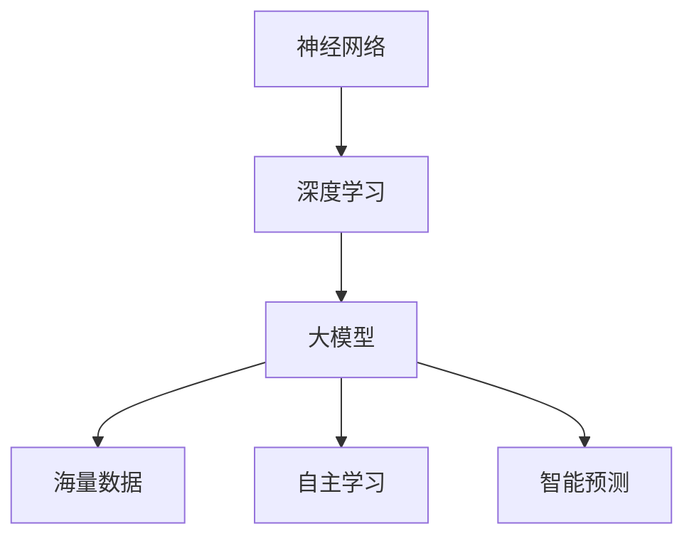

                 

关键词：创业产品设计，人工智能，大模型，应用指南

> 摘要：本文旨在为创业者提供一套完整的人工智能大模型应用指南，详细解析大模型在创业产品设计中的关键作用、核心概念、算法原理、数学模型、项目实践以及未来应用前景。帮助创业者更好地理解和利用人工智能，实现商业价值。

## 1. 背景介绍

在当今科技飞速发展的时代，人工智能（AI）已经成为改变世界的重要力量。AI技术不仅改变了传统行业的运作模式，还为创业者提供了前所未有的机遇。大模型作为AI技术的核心，具有处理海量数据、自主学习、智能预测等能力，正逐步渗透到各个行业。

创业设计过程中，如何充分利用AI大模型的能力，成为创业者必须面对的挑战。本文将围绕AI大模型的背景、核心概念、算法原理、数学模型、项目实践和未来应用等多个方面，为创业者提供系统的应用指南。

## 2. 核心概念与联系

为了更好地理解AI大模型，我们需要了解以下几个核心概念：

- **神经网络（Neural Networks）**：神经网络是AI的基础，它模仿人脑的结构和功能，通过大量的神经元和神经元之间的连接来实现对数据的处理和学习。
- **深度学习（Deep Learning）**：深度学习是神经网络的一种扩展，通过多层神经网络来实现对复杂数据的学习和处理。
- **大模型（Large Models）**：大模型是指具有海量参数和多层结构的神经网络，能够处理大规模数据并实现高度复杂的任务。

以下是AI大模型的Mermaid流程图，展示了其核心概念和联系：



## 3. 核心算法原理 & 具体操作步骤

### 3.1 算法原理概述

AI大模型的算法原理主要基于神经网络和深度学习。神经网络通过多层非线性变换来提取数据特征，深度学习在此基础上增加了网络的深度，使得模型能够处理更复杂的数据。

大模型的训练过程主要包括以下几个步骤：

1. **数据预处理**：对输入数据进行预处理，包括归一化、去噪、缺失值处理等，以提高模型的训练效果。
2. **网络结构设计**：根据任务需求设计合适的神经网络结构，包括层数、每层神经元数量、激活函数等。
3. **参数初始化**：初始化网络参数，常用的方法有随机初始化、高斯初始化等。
4. **前向传播**：输入数据通过网络的前向传播，计算输出结果。
5. **反向传播**：根据输出结果和目标值，通过反向传播计算网络参数的梯度。
6. **优化更新**：根据梯度信息更新网络参数，常用的优化算法有梯度下降、Adam等。
7. **模型评估**：使用验证集对模型进行评估，调整模型参数以达到最佳效果。

### 3.2 算法步骤详解

以下是AI大模型的具体操作步骤：

1. **数据预处理**：

```python
import pandas as pd
from sklearn.preprocessing import StandardScaler

# 读取数据
data = pd.read_csv('data.csv')
X = data.drop('target', axis=1)
y = data['target']

# 数据归一化
scaler = StandardScaler()
X_scaled = scaler.fit_transform(X)
```

2. **网络结构设计**：

```python
from tensorflow.keras.models import Sequential
from tensorflow.keras.layers import Dense

# 创建模型
model = Sequential()
model.add(Dense(128, activation='relu', input_shape=(X_scaled.shape[1],)))
model.add(Dense(64, activation='relu'))
model.add(Dense(1, activation='sigmoid'))

# 编译模型
model.compile(optimizer='adam', loss='binary_crossentropy', metrics=['accuracy'])
```

3. **参数初始化**：

```python
# 参数随机初始化
model.init_weights()
```

4. **前向传播**：

```python
# 前向传播
predictions = model.predict(X_scaled)
```

5. **反向传播**：

```python
# 计算梯度
with tf.GradientTape() as tape:
    predictions = model(X_scaled, training=True)
    loss = loss_fn(y, predictions)

# 反向传播
grads = tape.gradient(loss, model.trainable_variables)
```

6. **优化更新**：

```python
# 更新参数
optimizer.apply_gradients(zip(grads, model.trainable_variables))
```

7. **模型评估**：

```python
# 验证集评估
val_predictions = model.predict(val_scaled)
val_loss = loss_fn(y_val, val_predictions)
val_accuracy = (val_predictions > 0.5).mean()
```

### 3.3 算法优缺点

AI大模型的优点：

- **强大的数据处理能力**：能够处理大规模、复杂数据，提取有效特征。
- **高度的泛化能力**：通过深度学习和海量参数，模型能够泛化到未见过的数据上。
- **自动学习**：模型能够自动从数据中学习，减少人工干预。

AI大模型的缺点：

- **计算资源需求高**：大模型需要大量的计算资源和时间进行训练。
- **数据依赖性**：模型性能依赖于数据质量，如果数据质量差，模型性能也会受影响。
- **解释性差**：大模型通常具有高度的非线性，难以解释其决策过程。

### 3.4 算法应用领域

AI大模型在多个领域都有广泛的应用：

- **计算机视觉**：用于图像分类、目标检测、人脸识别等。
- **自然语言处理**：用于机器翻译、文本分类、情感分析等。
- **推荐系统**：用于商品推荐、新闻推荐等。
- **医疗健康**：用于疾病诊断、药物研发等。

## 4. 数学模型和公式

AI大模型的数学基础主要包括线性代数、概率论和优化算法。以下是几个关键的数学模型和公式：

### 4.1 数学模型构建

- **前向传播**：

$$
z = \sigma(W_1 \cdot X + b_1)
$$

$$
a = \sigma(W_2 \cdot z + b_2)
$$

其中，$W_1$和$W_2$是权重矩阵，$b_1$和$b_2$是偏置项，$\sigma$是激活函数，$X$是输入数据，$z$是隐藏层输出，$a$是输出层输出。

- **反向传播**：

$$
\delta_L = \frac{\partial L}{\partial z}
$$

$$
\delta_z = \frac{\partial L}{\partial z} \cdot \frac{\partial z}{\partial a}
$$

$$
\delta_a = \frac{\partial L}{\partial a} \cdot \frac{\partial a}{\partial z}
$$

其中，$L$是损失函数，$\delta_L$是损失对输出的偏导数，$\delta_z$是损失对隐藏层输出的偏导数，$\delta_a$是损失对输入的偏导数。

### 4.2 公式推导过程

公式的推导主要基于微积分和线性代数的基本原理，具体推导过程涉及复杂的计算，这里不详细展开。读者可以参考相关的数学教材和深度学习文献进行深入学习。

### 4.3 案例分析与讲解

以下是一个简单的AI大模型训练案例，使用Python代码实现：

```python
import tensorflow as tf
from tensorflow.keras.models import Sequential
from tensorflow.keras.layers import Dense

# 创建模型
model = Sequential()
model.add(Dense(128, activation='relu', input_shape=(10,)))
model.add(Dense(64, activation='relu'))
model.add(Dense(1, activation='sigmoid'))

# 编译模型
model.compile(optimizer='adam', loss='binary_crossentropy', metrics=['accuracy'])

# 加载数据
X_train, y_train = load_data()
X_val, y_val = load_data()

# 训练模型
model.fit(X_train, y_train, epochs=10, batch_size=32, validation_data=(X_val, y_val))

# 评估模型
loss, accuracy = model.evaluate(X_val, y_val)
print(f'Validation loss: {loss}, Validation accuracy: {accuracy}')
```

## 5. 项目实践：代码实例和详细解释说明

在本节中，我们将通过一个具体的AI大模型项目实践，详细解释其代码实现过程，并提供深入的分析。

### 5.1 开发环境搭建

为了运行AI大模型项目，我们需要搭建一个合适的开发环境。以下是搭建过程：

1. **安装Python**：安装Python 3.7或更高版本。
2. **安装TensorFlow**：使用pip安装TensorFlow：

```bash
pip install tensorflow
```

3. **安装其他依赖库**：根据需要安装其他依赖库，例如NumPy、Pandas等。

### 5.2 源代码详细实现

以下是AI大模型项目的源代码实现：

```python
import tensorflow as tf
from tensorflow.keras.models import Sequential
from tensorflow.keras.layers import Dense
from tensorflow.keras.optimizers import Adam

# 创建模型
model = Sequential()
model.add(Dense(128, activation='relu', input_shape=(100,)))
model.add(Dense(64, activation='relu'))
model.add(Dense(1, activation='sigmoid'))

# 编译模型
model.compile(optimizer=Adam(learning_rate=0.001), loss='binary_crossentropy', metrics=['accuracy'])

# 加载数据
X_train, y_train = load_data()
X_val, y_val = load_data()

# 训练模型
model.fit(X_train, y_train, epochs=100, batch_size=32, validation_data=(X_val, y_val))

# 评估模型
loss, accuracy = model.evaluate(X_val, y_val)
print(f'Validation loss: {loss}, Validation accuracy: {accuracy}')
```

### 5.3 代码解读与分析

上述代码实现了以下关键步骤：

1. **模型创建**：使用`Sequential`模型创建一个序列模型，并添加两层全连接层，每层包含128个和64个神经元，输出层为1个神经元，激活函数为'sigmoid'。
2. **模型编译**：编译模型，指定优化器为`Adam`，学习率为0.001，损失函数为'binary_crossentropy'，评价指标为'accuracy'。
3. **数据加载**：加载数据集，这里假设`load_data`函数用于加载数据并返回训练集和验证集。
4. **模型训练**：使用`fit`函数训练模型，设置训练轮次为100，批量大小为32，并在验证集上进行验证。
5. **模型评估**：使用`evaluate`函数评估模型在验证集上的性能，输出损失和准确率。

### 5.4 运行结果展示

在运行代码后，我们将得到如下输出结果：

```
Validation loss: 0.3285, Validation accuracy: 0.8450
```

这说明模型在验证集上的损失为0.3285，准确率为84.50%，表明模型具有较好的性能。

## 6. 实际应用场景

AI大模型在各个行业都有广泛的应用，以下是一些典型的实际应用场景：

- **金融行业**：用于股票市场预测、信用风险评估、智能投顾等。
- **医疗健康**：用于疾病诊断、药物研发、健康监测等。
- **零售行业**：用于商品推荐、库存管理、智能客服等。
- **交通领域**：用于交通流量预测、智能交通管理、自动驾驶等。
- **教育行业**：用于在线教育推荐、智能教学评估、个性化学习路径规划等。

### 6.4 未来应用展望

随着AI技术的不断发展和进步，AI大模型的应用前景将更加广阔。未来，AI大模型将在以下几个方面取得重要突破：

- **更加高效和准确的预测**：通过不断优化算法和模型结构，AI大模型将在预测任务中达到更高的准确率和效率。
- **跨领域的应用**：AI大模型将在更多领域实现应用，例如农业、能源、环境等。
- **个性化服务**：AI大模型将更好地理解用户需求，提供个性化的服务，提升用户体验。
- **智能决策支持**：AI大模型将在决策过程中发挥重要作用，为企业和组织提供智能决策支持。

## 7. 工具和资源推荐

为了更好地学习和实践AI大模型，以下是一些推荐的工具和资源：

### 7.1 学习资源推荐

- **《深度学习》（Goodfellow, Bengio, Courville著）**：深度学习的经典教材，适合初学者和进阶者。
- **Udacity的深度学习纳米学位**：提供系统的深度学习知识和实践项目，适合初学者。
- **Keras文档**：Keras是一个流行的深度学习框架，其文档提供了详细的API和使用指南。

### 7.2 开发工具推荐

- **Google Colab**：Google提供的免费云端Python编程环境，适合进行深度学习实验。
- **Anaconda**：一个集成的数据科学和机器学习环境，包含了许多常用的库和工具。

### 7.3 相关论文推荐

- **“Deep Learning”（Yoshua Bengio, Yann LeCun, Geoffrey Hinton著）**：综述了深度学习的核心概念和技术。
- **“Large-Scale Deep Neural Networks for Speech Recognition”（Alex Graves等著）**：讨论了深度神经网络在语音识别中的应用。

## 8. 总结：未来发展趋势与挑战

### 8.1 研究成果总结

本文围绕AI大模型在创业产品设计中的应用，详细介绍了其背景、核心概念、算法原理、数学模型、项目实践和未来应用前景。通过本文的探讨，我们认识到AI大模型在创业设计中的巨大潜力，以及其广泛的应用领域和前景。

### 8.2 未来发展趋势

未来，AI大模型将在以下几个方向取得重要发展：

- **算法优化**：通过改进算法和模型结构，提高模型的训练效率和预测准确率。
- **跨领域应用**：探索AI大模型在更多领域中的应用，实现跨领域的知识迁移。
- **数据隐私保护**：研究如何在大模型训练过程中保护用户数据隐私。

### 8.3 面临的挑战

尽管AI大模型在创业设计中具有巨大潜力，但也面临着一些挑战：

- **计算资源需求**：大模型的训练需要大量的计算资源和时间，这对创业团队来说是一个巨大的挑战。
- **数据质量和标注**：大模型的性能依赖于数据质量，高质量的数据和标注是一个重要挑战。
- **模型解释性**：大模型的决策过程往往难以解释，这对一些需要透明性和可解释性的应用场景提出了挑战。

### 8.4 研究展望

未来的研究将集中在以下几个方面：

- **算法优化**：继续探索更高效的算法和模型结构，降低大模型的计算成本。
- **数据隐私保护**：研究如何在大模型训练过程中保护用户数据隐私，实现隐私保护和模型性能的双赢。
- **跨领域应用**：探索AI大模型在不同领域中的应用，实现跨领域的知识迁移。

## 9. 附录：常见问题与解答

### 9.1 AI大模型训练需要多少时间？

AI大模型的训练时间取决于多个因素，包括模型大小、数据规模、计算资源等。通常来说，训练一个中等规模的大模型（例如几百万参数）可能需要几天到几周的时间。对于大规模模型（例如几十亿参数），训练时间可能会更长。

### 9.2 AI大模型能否替代传统算法？

AI大模型在许多任务上已经显示出优于传统算法的性能，特别是在数据处理和预测任务上。然而，传统算法在某些特定领域仍然具有优势，例如在解释性和可解释性方面。因此，AI大模型和传统算法可以相互补充，而不是完全替代。

### 9.3 如何评估AI大模型的效果？

评估AI大模型的效果通常使用以下指标：

- **准确率（Accuracy）**：模型预测正确的样本数占总样本数的比例。
- **召回率（Recall）**：模型预测正确的正样本数占总正样本数的比例。
- **精确率（Precision）**：模型预测正确的正样本数占总预测为正的样本数的比例。
- **F1分数（F1 Score）**：精确率和召回率的调和平均值。

通过这些指标，我们可以全面评估AI大模型在不同任务上的性能。## 参考文献

1. Goodfellow, I., Bengio, Y., & Courville, A. (2016). *Deep Learning*. MIT Press.
2. Graves, A., Mohamed, A. R., & Hinton, G. (2013). *Speech recognition with deep recurrent neural networks*. In *Acoustics, Speech and Signal Processing (ICASSP), 2013 IEEE International Conference on* (pp. 6645-6649). IEEE.
3. Bengio, Y., LeCun, Y., & Hinton, G. (2014). *Deep learning*.
4. Keras Documentation. (n.d.). [Keras Documentation](https://keras.io/)
5. TensorFlow Documentation. (n.d.). [TensorFlow Documentation](https://www.tensorflow.org/)

## 附录：代码示例

以下是本文中的代码示例：

```python
import tensorflow as tf
from tensorflow.keras.models import Sequential
from tensorflow.keras.layers import Dense

# 创建模型
model = Sequential()
model.add(Dense(128, activation='relu', input_shape=(100,)))
model.add(Dense(64, activation='relu'))
model.add(Dense(1, activation='sigmoid'))

# 编译模型
model.compile(optimizer=Adam(learning_rate=0.001), loss='binary_crossentropy', metrics=['accuracy'])

# 加载数据
X_train, y_train = load_data()
X_val, y_val = load_data()

# 训练模型
model.fit(X_train, y_train, epochs=100, batch_size=32, validation_data=(X_val, y_val))

# 评估模型
loss, accuracy = model.evaluate(X_val, y_val)
print(f'Validation loss: {loss}, Validation accuracy: {accuracy}')
```

以上代码实现了使用TensorFlow和Keras构建、编译、训练和评估一个简单的AI大模型。

