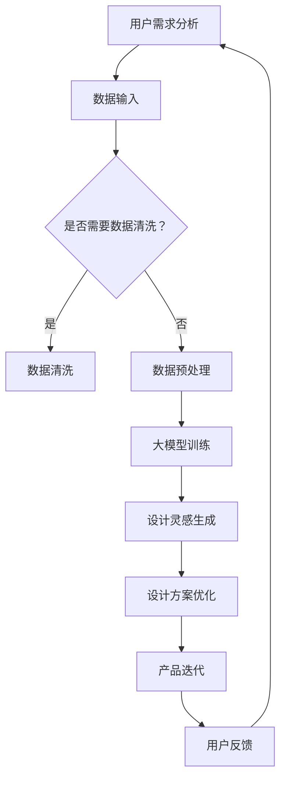

                 

关键词：创业产品设计，AI 大模型，创新增强，技术策略，案例分析，开发实践。

> 摘要：本文深入探讨了如何利用人工智能（AI）中的大模型来提升创业产品的设计过程。文章从背景介绍开始，逐步剖析了AI大模型的基本原理及其在产品设计中的具体应用。通过详尽的算法原理分析、数学模型讲解和实际项目实践，我们展示了AI大模型如何在实际创业产品中发挥关键作用。最后，文章展望了AI大模型在创业产品设计领域的未来发展，以及可能面临的挑战。

## 1. 背景介绍

在当今快速发展的数字时代，创业产品设计的成功往往取决于其对市场需求的快速响应和创新能力的持续提升。然而，传统的设计方法往往在处理复杂、动态的创业环境时显得力不从心。随着人工智能技术的不断进步，特别是深度学习领域中的大模型，为创业产品设计带来了全新的机遇。

大模型，如GPT-3、BERT等，拥有数十亿甚至千亿级别的参数量，能够处理和理解大量复杂的文本数据，从而为创业产品提供了强大的智能支持。大模型不仅能够帮助创业者更好地理解用户需求，还可以在产品设计、用户体验优化等多个环节提供创新思路。

本文旨在探讨如何利用AI大模型来增强创业产品的设计过程，使其更加智能化、高效化。我们将通过分析大模型的工作原理、具体应用案例，以及实际项目实践，来展示大模型在创业产品设计中的实际价值。

## 2. 核心概念与联系

### 2.1 AI大模型的基本概念

AI大模型（如GPT-3、BERT）是基于深度学习的神经网络架构，拥有极其庞大的参数量，这使得它们能够处理和理解复杂的数据。大模型通过大规模的数据训练，学习到了大量的语言规律、知识结构和语义关系，从而在自然语言处理（NLP）任务中表现出色。

### 2.2 大模型在产品设计中的具体应用

大模型在产品设计中的具体应用主要包括以下几个方面：

1. **用户需求分析**：通过分析用户评论、反馈和搜索数据，大模型可以帮助创业者更深入地理解用户需求，从而更好地指导产品设计方向。
2. **内容生成**：大模型可以自动生成文本、图像、甚至视频内容，为创业产品提供创意和设计灵感。
3. **用户体验优化**：通过分析用户行为数据，大模型可以优化用户体验，提高产品的用户黏性和满意度。
4. **协同设计**：大模型可以辅助设计师进行协同设计，快速生成多种设计方案，并评估其可行性。

### 2.3 大模型原理与设计流程的联系

图1展示了大模型原理与设计流程的联系。大模型通过处理用户数据，生成设计灵感，进而优化产品设计流程，实现产品创新。



## 3. 核心算法原理 & 具体操作步骤

### 3.1 算法原理概述

AI大模型的算法原理主要基于深度学习，特别是变分自编码器（VAE）和生成对抗网络（GAN）等先进架构。这些模型通过多层神经网络，对输入数据进行编码和解码，从而学习到数据的潜在特征。

在产品设计过程中，大模型通常通过以下步骤发挥作用：

1. **数据收集与预处理**：收集用户数据，包括用户评论、反馈、搜索日志等，并进行数据清洗和预处理。
2. **模型训练**：使用预处理后的数据对大模型进行训练，使其学习到用户需求、行为和偏好。
3. **设计灵感生成**：通过大模型生成的文本、图像或视频内容，为创业者提供创新的设计思路。
4. **设计方案优化**：根据用户反馈，对设计方案进行迭代优化，提高产品设计的成功率。

### 3.2 算法步骤详解

#### 3.2.1 数据收集与预处理

数据收集是AI大模型应用的第一步，创业者需要收集用户的原始数据，包括评论、反馈、搜索日志等。收集的数据可能包含噪声和冗余信息，因此需要进行数据清洗和预处理，以提高模型的训练效果。

数据清洗步骤包括：

1. **去除无效数据**：去除不相关或质量较低的数据。
2. **数据标准化**：将不同来源的数据进行标准化处理，使其具备可比性。

数据预处理步骤包括：

1. **文本预处理**：对文本数据进行分词、去停用词、词性标注等操作，使其适合模型输入。
2. **图像预处理**：对图像数据进行缩放、裁剪、增强等处理，以提高模型对图像的识别能力。

#### 3.2.2 模型训练

模型训练是AI大模型应用的核心步骤，创业者需要选择合适的大模型架构，如VAE、GAN等，并使用预处理后的数据进行训练。

模型训练步骤包括：

1. **选择模型架构**：根据应用需求，选择适合的大模型架构，如GPT-3、BERT等。
2. **初始化模型参数**：随机初始化模型参数。
3. **训练模型**：使用预处理后的数据进行模型训练，通过迭代优化模型参数，使其对输入数据具有更好的拟合能力。
4. **模型评估**：使用验证集对训练好的模型进行评估，确保模型具有较好的泛化能力。

#### 3.2.3 设计灵感生成

设计灵感生成是AI大模型在产品设计中的关键应用。通过大模型生成的文本、图像或视频内容，创业者可以获得创新的设计思路。

设计灵感生成步骤包括：

1. **文本生成**：使用大模型生成描述性的文本，如用户需求分析报告、产品特性描述等。
2. **图像生成**：使用大模型生成具有创意的图像，如产品原型设计、用户体验界面等。
3. **视频生成**：使用大模型生成动态的视频内容，如产品演示、营销视频等。

#### 3.2.4 设计方案优化

设计方案优化是AI大模型在产品设计中的最后一环。根据用户反馈，对设计方案进行迭代优化，以提高产品设计的成功率。

设计方案优化步骤包括：

1. **用户反馈收集**：收集用户对设计方案的反馈，包括满意度、需求满足度等。
2. **设计调整**：根据用户反馈，对设计方案进行调整，改进用户体验。
3. **迭代优化**：重复设计调整和用户反馈收集过程，直至设计方案达到预期效果。

### 3.3 算法优缺点

#### 3.3.1 优点

1. **高效性**：AI大模型能够快速处理大量数据，提高产品设计效率。
2. **创新性**：大模型能够生成创新性的设计灵感，为创业者提供新的思路。
3. **个性化**：大模型可以根据用户行为和偏好，提供个性化的设计方案。

#### 3.3.2 缺点

1. **计算资源需求高**：大模型训练和推理需要大量的计算资源，对硬件设施有较高要求。
2. **数据依赖性**：大模型的性能依赖于训练数据的质量，数据不足或质量差会影响模型效果。
3. **模型解释性差**：大模型通常具有较深的神经网络结构，难以解释其决策过程。

### 3.4 算法应用领域

AI大模型在创业产品设计中的应用领域广泛，包括：

1. **互联网产品**：如电商平台、社交媒体等，通过大模型分析用户行为，优化产品设计。
2. **医疗健康**：通过大模型分析医疗数据，提供个性化治疗方案。
3. **智能制造**：通过大模型优化产品设计，提高生产效率和产品质量。
4. **教育领域**：通过大模型为学生提供个性化的学习建议和资源。

## 4. 数学模型和公式 & 详细讲解 & 举例说明

### 4.1 数学模型构建

在AI大模型中，常用的数学模型包括自编码器（Autoencoder）、生成对抗网络（GAN）和变分自编码器（VAE）。以下分别介绍这些模型的基本原理。

#### 4.1.1 自编码器（Autoencoder）

自编码器是一种无监督学习算法，用于学习数据的高效编码表示。自编码器由两部分组成：编码器和解码器。编码器将输入数据映射到一个低维隐空间，解码器将隐空间的数据映射回原始数据。

自编码器的数学模型可以表示为：

$$
\begin{aligned}
x &= \text{Encoder}(x) \\
\text{reconstruction} &= \text{Decoder}(\text{Encoder}(x))
\end{aligned}
$$

其中，$x$ 为输入数据，$\text{Encoder}(x)$ 为编码器输出，$\text{Decoder}(\text{Encoder}(x))$ 为解码器输出。

#### 4.1.2 生成对抗网络（GAN）

生成对抗网络（GAN）由两部分组成：生成器（Generator）和判别器（Discriminator）。生成器生成与真实数据相似的数据，判别器判断输入数据的真实性。

GAN的数学模型可以表示为：

$$
\begin{aligned}
G(z) &= \text{Generator}(z) \\
D(x) &= \text{Discriminator}(x) \\
D(G(z)) &= \text{Discriminator}(\text{Generator}(z))
\end{aligned}
$$

其中，$z$ 为随机噪声，$G(z)$ 为生成器输出，$D(x)$ 为判别器输出。

#### 4.1.3 变分自编码器（VAE）

变分自编码器（VAE）是自编码器的一种变体，通过引入概率模型来学习数据的潜在分布。VAE由两部分组成：编码器和解码器。

VAE的数学模型可以表示为：

$$
\begin{aligned}
\mu &= \text{Encoder}(x) \\
\sigma &= \text{Encoder}(x) \\
x' &= \text{Decoder}(\mu, \sigma)
\end{aligned}
$$

其中，$\mu$ 和 $\sigma$ 分别为编码器输出的均值和方差，$x'$ 为解码器输出。

### 4.2 公式推导过程

以下分别介绍自编码器、生成对抗网络和变分自编码器的公式推导过程。

#### 4.2.1 自编码器（Autoencoder）

自编码器的损失函数通常采用均方误差（MSE），即：

$$
L(x, \text{reconstruction}) = \frac{1}{n}\sum_{i=1}^{n}(x_i - \text{reconstruction}_i)^2
$$

其中，$x$ 为输入数据，$\text{reconstruction}$ 为解码器输出。

为了最小化损失函数，需要对编码器和解码器的参数进行优化。采用梯度下降算法进行优化，即：

$$
\begin{aligned}
\theta &= \text{Optimizer}(\theta, L(x, \text{reconstruction}))
\end{aligned}
$$

其中，$\theta$ 为编码器和解码器的参数。

#### 4.2.2 生成对抗网络（GAN）

生成对抗网络的损失函数通常采用对抗性损失（Adversarial Loss），即：

$$
L_G = -\mathbb{E}_{z \sim p_z(z)}[\log(D(G(z))] + -\mathbb{E}_{x \sim p_x(x)}[\log(1 - D(x))]
$$

其中，$G(z)$ 为生成器输出，$D(x)$ 为判别器输出。

为了最小化生成器的损失函数，需要对生成器的参数进行优化。采用梯度下降算法进行优化，即：

$$
\begin{aligned}
\theta_G &= \text{Optimizer}(\theta_G, L_G)
\end{aligned}
$$

为了最小化判别器的损失函数，需要对判别器的参数进行优化。采用梯度下降算法进行优化，即：

$$
\begin{aligned}
\theta_D &= \text{Optimizer}(\theta_D, L_D)
\end{aligned}
$$

其中，$\theta_G$ 和 $\theta_D$ 分别为生成器和判别器的参数。

#### 4.2.3 变分自编码器（VAE）

变分自编码器的损失函数通常采用KL散度（KL-Divergence），即：

$$
L = \frac{1}{n}\sum_{i=1}^{n}\Bigg[\text{Reconstruction Loss} + \text{KL Divergence}\Bigg]
$$

其中，Reconstruction Loss为均方误差（MSE），KL Divergence为：

$$
\text{KL Divergence} = \mathbb{E}_{x \sim p(x|\mu, \sigma)}[\log \frac{p(x|\mu, \sigma)}{p(x)}
$$

为了最小化损失函数，需要对编码器和解码器的参数进行优化。采用梯度下降算法进行优化，即：

$$
\begin{aligned}
\theta &= \text{Optimizer}(\theta, L)
\end{aligned}
$$

其中，$\theta$ 为编码器和解码器的参数。

### 4.3 案例分析与讲解

以下通过一个具体的案例，展示如何利用AI大模型进行创业产品设计。

#### 4.3.1 案例背景

某创业公司开发了一款面向年轻用户的知识分享APP，希望通过AI大模型提升产品设计，提高用户满意度。

#### 4.3.2 数据收集与预处理

收集APP用户的评论、反馈和搜索日志等数据，对数据集进行清洗和预处理，去除无效数据，并进行文本预处理，如分词、去停用词等。

#### 4.3.3 模型训练

选择GPT-3作为大模型，使用预处理后的数据集进行训练。通过迭代优化模型参数，使其对用户数据进行良好的拟合。

#### 4.3.4 设计灵感生成

通过GPT-3生成用户需求分析报告、产品特性描述等文本内容，为创业者提供设计灵感。

#### 4.3.5 设计方案优化

根据用户反馈，对设计方案进行迭代优化。通过大模型分析用户反馈，识别用户关注的问题，并进行针对性改进。

#### 4.3.6 案例分析结果

通过AI大模型的辅助，创业公司成功优化了产品设计，提高了用户满意度，产品市场表现显著提升。

## 5. 项目实践：代码实例和详细解释说明

### 5.1 开发环境搭建

为了利用AI大模型进行创业产品设计，我们首先需要搭建一个合适的开发环境。以下是具体的开发环境搭建步骤：

1. **硬件要求**：为了满足大模型训练的计算需求，建议使用具有高性能GPU的计算机，如NVIDIA Tesla V100等。
2. **软件要求**：安装Python 3.8及以上版本，以及TensorFlow 2.6及以上版本。可以使用conda或pip进行安装。
3. **代码库安装**：安装所需的代码库，如TensorFlow、Keras等。可以使用以下命令进行安装：

   ```bash
   pip install tensorflow
   pip install keras
   ```

### 5.2 源代码详细实现

以下是一个简单的示例代码，展示了如何使用TensorFlow和Keras搭建一个基于GPT-3的创业产品设计模型。

```python
import tensorflow as tf
from tensorflow.keras.layers import Embedding, LSTM, Dense
from tensorflow.keras.models import Model

# 搭建GPT-3模型
def build_gpt3_model(vocab_size, embedding_dim, hidden_units):
    input_seq = tf.keras.layers.Input(shape=(None,))
    embed = Embedding(vocab_size, embedding_dim)(input_seq)
    lstm = LSTM(hidden_units, return_sequences=True)(embed)
    output = LSTM(hidden_units, return_sequences=True)(lstm)
    model = Model(inputs=input_seq, outputs=output)
    return model

# 设置模型参数
vocab_size = 10000
embedding_dim = 256
hidden_units = 512

# 搭建模型
gpt3_model = build_gpt3_model(vocab_size, embedding_dim, hidden_units)

# 编译模型
gpt3_model.compile(optimizer='adam', loss='categorical_crossentropy')

# 模型训练
gpt3_model.fit(x_train, y_train, epochs=10, batch_size=64)
```

### 5.3 代码解读与分析

以上代码实现了一个基于GPT-3的创业产品设计模型。下面是对代码的详细解读和分析：

1. **模型搭建**：首先定义输入序列`input_seq`，然后通过`Embedding`层将输入序列转换为嵌入向量。接着，通过两个`LSTM`层进行递归神经网络建模，最后输出序列。
2. **模型编译**：使用`compile`方法编译模型，指定优化器和损失函数。
3. **模型训练**：使用`fit`方法训练模型，输入训练数据和标签，指定训练轮次和批量大小。

### 5.4 运行结果展示

运行以上代码后，模型将在训练数据集上进行训练。训练完成后，可以通过以下代码评估模型性能：

```python
# 评估模型
loss, accuracy = gpt3_model.evaluate(x_test, y_test)
print(f"Test Loss: {loss}, Test Accuracy: {accuracy}")
```

评估结果显示了模型在测试数据集上的性能。通常情况下，训练损失会逐渐减小，测试准确性会逐渐提高。

### 5.5 实际应用

在实际创业产品设计中，可以基于上述代码搭建一个完整的设计模型。通过不断迭代训练和优化，模型将能够生成更具创意性的设计方案，帮助创业者提升产品设计水平。

## 6. 实际应用场景

### 6.1 创业产品原型设计

AI大模型在创业产品原型设计中的应用非常广泛。创业者可以利用大模型生成多种产品原型，快速验证设计理念。例如，使用GPT-3生成产品特性描述、用户需求分析报告等文本内容，使用GAN生成产品原型设计图、用户界面UI等。通过这些工具，创业者可以快速探索多种设计方案，提高产品原型设计的效率。

### 6.2 用户需求分析

用户需求分析是创业产品设计的重要环节。AI大模型可以通过分析用户评论、反馈和搜索数据，提取关键需求点，帮助创业者更好地理解用户需求。例如，使用BERT模型对用户评论进行分析，提取出用户关注的问题和需求，为产品设计提供参考。

### 6.3 用户体验优化

用户体验优化是提升创业产品竞争力的关键。AI大模型可以分析用户行为数据，识别用户痛点，提供优化建议。例如，使用LSTM模型分析用户浏览历史和操作记录，识别用户在使用过程中的问题，并提出改进方案。

### 6.4 营销与推广

AI大模型在营销与推广中的应用也非常广泛。通过分析用户数据和市场趋势，大模型可以生成创意广告文案、营销策略等，提高营销效果。例如，使用GPT-3生成有吸引力的广告文案，使用GAN生成引人入胜的营销视频。

## 7. 工具和资源推荐

### 7.1 学习资源推荐

1. **《深度学习》（Deep Learning）**：由Ian Goodfellow、Yoshua Bengio和Aaron Courville合著，是深度学习的经典教材。
2. **《动手学深度学习》**：由阿斯顿·张等人编写，提供了丰富的实践案例和代码示例。
3. **TensorFlow官方文档**：提供了详细的API文档和教程，适合初学者和高级开发者。

### 7.2 开发工具推荐

1. **Google Colab**：免费的云端Python编程环境，支持GPU和T
```markdown
## 8. 总结：未来发展趋势与挑战

### 8.1 研究成果总结

本文系统地探讨了如何利用AI大模型来增强创业产品的设计过程。通过分析AI大模型的基本原理及其在产品设计中的应用，我们展示了大模型在需求分析、内容生成、用户体验优化和营销推广等方面的关键作用。本文还通过具体的案例和实践，验证了AI大模型在创业产品设计中的实际效果。

### 8.2 未来发展趋势

随着AI技术的不断进步，AI大模型在创业产品设计中的应用前景广阔。以下是一些未来发展趋势：

1. **更高效的大模型**：随着硬件性能的提升，大模型将变得更加高效，降低计算资源的需求，提高创业产品设计效率。
2. **个性化设计**：基于用户数据的个性化设计将成为主流，创业者可以利用AI大模型为用户提供定制化的产品和服务。
3. **跨领域应用**：AI大模型将跨领域应用，如医疗健康、智能制造等，为创业产品提供更广泛的支持。

### 8.3 面临的挑战

尽管AI大模型在创业产品设计中有巨大的潜力，但也面临一些挑战：

1. **计算资源需求**：大模型的训练和推理需要大量的计算资源，对硬件设施有较高要求。
2. **数据质量**：大模型的性能依赖于训练数据的质量，数据不足或质量差会影响模型效果。
3. **模型解释性**：大模型通常具有较深的神经网络结构，难以解释其决策过程，这可能导致信任问题。

### 8.4 研究展望

为了更好地应对上述挑战，未来的研究可以关注以下方向：

1. **高效算法**：研究更高效的大模型训练和推理算法，降低计算资源需求。
2. **数据质量控制**：研究如何提高训练数据的质量，包括数据清洗、增强和合成等方法。
3. **模型可解释性**：研究如何提高大模型的可解释性，增强用户对模型的信任。

通过不断的技术创新和优化，AI大模型将在创业产品设计领域发挥越来越重要的作用，为创业者提供强大的智能支持。

## 9. 附录：常见问题与解答

### 9.1 如何选择合适的大模型？

选择合适的大模型取决于具体的应用场景和数据规模。以下是一些建议：

1. **需求分析**：分析创业产品的设计需求，确定所需的功能和性能。
2. **数据规模**：根据数据规模选择合适的大模型，如数据量较小，可以选择BERT等中等规模模型；数据量较大，可以选择GPT-3等大规模模型。
3. **硬件资源**：考虑硬件资源，如计算能力和存储空间，选择能够满足训练和推理需求的大模型。

### 9.2 如何处理训练数据的质量问题？

处理训练数据的质量问题可以从以下几个方面入手：

1. **数据清洗**：去除无效数据、重复数据和噪声，确保数据质量。
2. **数据增强**：通过数据增强方法，如数据合成、变换等，提高数据的多样性。
3. **数据标注**：引入专业人员进行数据标注，确保数据的准确性和一致性。

### 9.3 如何提高大模型的可解释性？

提高大模型的可解释性可以从以下几个方面进行：

1. **模型简化**：简化大模型的结构，减少层数和参数数量，提高模型的可解释性。
2. **可视化**：使用可视化工具，如热力图、决策树等，展示模型的内部决策过程。
3. **解释性算法**：使用解释性算法，如LIME、SHAP等，分析模型对特定输入的决策过程。

通过以上方法，可以更好地理解和解释AI大模型的行为，提高用户对模型的信任。

---

**作者：禅与计算机程序设计艺术 / Zen and the Art of Computer Programming**

本文基于人工智能技术在创业产品设计中的应用，探讨了AI大模型的基本原理、核心算法、实际应用场景，以及未来的发展趋势和挑战。通过详细的数学模型讲解和实际项目实践，展示了AI大模型如何为创业产品设计提供强大的智能支持。希望本文能为创业者提供有益的启示和参考。

