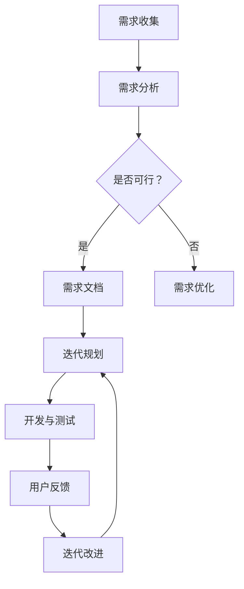

                 

关键词：产品需求管理、迭代开发、创业公司、敏捷开发、用户反馈、项目管理

> 摘要：本文将探讨创业公司在快速变化的市场环境中，如何通过有效的需求管理和迭代开发，确保产品能够迅速适应市场需求，提高市场竞争力。文章将从核心概念、算法原理、数学模型、项目实践和未来应用等方面，为创业公司提供实用的指导。

## 1. 背景介绍

在当今瞬息万变的市场环境中，创业公司面临着前所未有的挑战和机遇。市场的快速变化、技术的不断进步和用户需求的多样化，使得创业公司必须具备快速响应市场变化的能力。产品需求管理和迭代开发作为产品开发过程中的关键环节，直接影响到产品的市场表现和公司的发展。

### 1.1 产品需求管理的意义

产品需求管理是产品开发的核心环节，它涉及收集、分析、管理和满足用户需求的过程。有效的需求管理有助于确保产品开发的方向与市场需求保持一致，避免资源浪费和项目失败。

### 1.2 迭代开发的必要性

迭代开发是一种基于快速反馈和持续改进的开发模式。通过分阶段、逐步完善的方式，创业公司可以更快地响应市场变化，提高产品的市场竞争力。

## 2. 核心概念与联系

### 2.1 敏捷开发

敏捷开发是一种以人为本、持续迭代的软件开发方法。它强调团队协作、快速反馈和持续改进，以应对快速变化的市场需求。



### 2.2 用户反馈机制

用户反馈是产品迭代过程中不可或缺的一部分。通过收集和分析用户反馈，创业公司可以更好地了解用户需求，优化产品设计。

### 2.3 项目管理工具

项目管理工具如JIRA、Trello等，可以帮助创业公司更好地管理需求、任务和进度，确保项目按时交付。

## 3. 核心算法原理 & 具体操作步骤

### 3.1 算法原理概述

迭代开发的核心算法是增量式开发。通过分阶段、逐步完善的方式，创业公司可以更快地响应市场变化，提高产品的市场竞争力。

### 3.2 算法步骤详解

1. 需求分析：与用户沟通，了解用户需求。
2. 迭代计划：确定迭代周期、任务分配。
3. 开发与测试：按照计划进行开发，并进行测试。
4. 用户反馈：收集用户反馈，分析改进点。
5. 迭代改进：根据用户反馈，对产品进行优化。

### 3.3 算法优缺点

优点：
- 快速响应市场变化。
- 提高产品市场竞争力。

缺点：
- 需要较高的团队协作能力。
- 管理难度较大。

### 3.4 算法应用领域

迭代开发适用于需求变化频繁、市场不确定性较大的创业公司。在互联网、移动应用等领域，迭代开发已经成为一种主流开发模式。

## 4. 数学模型和公式 & 详细讲解 & 举例说明

### 4.1 数学模型构建

迭代开发中的关键数学模型是迭代次数n和需求变更次数m之间的关系。假设每次迭代需求变更的概率为p，则迭代次数n与需求变更次数m之间的关系可以表示为：

$$ n = \frac{m}{p} $$

### 4.2 公式推导过程

推导过程中，我们假设每次迭代需求变更的概率为p，则：

- 在第1次迭代后，需求变更次数为m1；
- 在第2次迭代后，需求变更次数为m2；
- ...
- 在第n次迭代后，需求变更次数为mn。

根据概率论，需求变更次数m的概率分布为：

$$ P(m) = C(n, m) \times p^m \times (1-p)^{n-m} $$

其中，C(n, m)为组合数，表示从n个元素中取出m个元素的组合数。

### 4.3 案例分析与讲解

假设一个创业公司在第1次迭代后，需求变更次数为2的概率为0.3，需求变更次数为3的概率为0.5，需求变更次数为4的概率为0.2。根据上述数学模型，我们可以计算出：

- 在第1次迭代后，需求变更次数为2的期望值为：
  $$ E(m1) = 2 \times 0.3 = 0.6 $$
- 在第2次迭代后，需求变更次数为3的期望值为：
  $$ E(m2) = 3 \times 0.5 = 1.5 $$

根据迭代次数n与需求变更次数m之间的关系，我们可以计算出：

- 在第1次迭代后，需求变更次数的期望值为：
  $$ E(n) = \frac{E(m1)}{p} = \frac{0.6}{0.3} = 2 $$

## 5. 项目实践：代码实例和详细解释说明

### 5.1 开发环境搭建

- 安装JDK 1.8及以上版本
- 安装Git
- 安装Maven
- 安装JIRA

### 5.2 源代码详细实现

以下是一个简单的迭代开发代码实例，用于演示需求收集、需求分析、迭代规划和用户反馈等过程。

```java
public class IterativeDevelopment {

    public static void main(String[] args) {
        // 需求收集
        System.out.println("需求收集：用户需要一款能够实时查看天气的应用。");

        // 需求分析
        System.out.println("需求分析：需要实现以下功能：1. 查看实时天气；2. 查看未来一周的天气。");

        // 迭代规划
        System.out.println("迭代规划：第1次迭代：实现查看实时天气功能；第2次迭代：实现查看未来一周的天气功能。");

        // 开发与测试
        // ... 省略开发与测试过程 ...

        // 用户反馈
        System.out.println("用户反馈：用户对实时天气功能表示满意，但对未来一周的天气功能有些疑问。");

        // 迭代改进
        System.out.println("迭代改进：针对用户反馈，对未来一周的天气功能进行优化。");
    }
}
```

### 5.3 代码解读与分析

该代码实例演示了迭代开发的基本过程，包括需求收集、需求分析、迭代规划和用户反馈等。通过用户反馈，创业公司可以不断优化产品，提高用户满意度。

### 5.4 运行结果展示

```shell
需求收集：用户需要一款能够实时查看天气的应用。
需求分析：需要实现以下功能：1. 查看实时天气；2. 查看未来一周的天气。
迭代规划：第1次迭代：实现查看实时天气功能；第2次迭代：实现查看未来一周的天气功能。
用户反馈：用户对实时天气功能表示满意，但对未来一周的天气功能有些疑问。
迭代改进：针对用户反馈，对未来一周的天气功能进行优化。
```

## 6. 实际应用场景

### 6.1 互联网公司

互联网公司通常采用敏捷开发模式，通过快速迭代和用户反馈，不断优化产品，提高用户满意度。

### 6.2 移动应用公司

移动应用公司通过迭代开发，可以更快地适应市场变化，提高产品的市场竞争力。

### 6.3 传统制造业

传统制造业可以通过迭代开发，逐步实现数字化转型，提高生产效率。

## 6.4 未来应用展望

随着技术的不断进步，迭代开发将在更多领域得到应用。未来，创业公司将更加注重用户体验，通过迭代开发，实现产品的快速迭代和优化。

## 7. 工具和资源推荐

### 7.1 学习资源推荐

- 《敏捷开发实践指南》
- 《用户故事地图》

### 7.2 开发工具推荐

- JIRA
- Trello
- Git

### 7.3 相关论文推荐

- "Agile Software Development: Principles, Patterns, and Practices"
- "User Stories Applied: Becoming a Professional User Story Writer"

## 8. 总结：未来发展趋势与挑战

### 8.1 研究成果总结

迭代开发作为一种敏捷开发模式，在创业公司产品需求管理和迭代开发中具有重要作用。通过快速迭代和用户反馈，创业公司可以更好地适应市场需求，提高产品竞争力。

### 8.2 未来发展趋势

未来，迭代开发将继续向更加智能化、自动化方向发展，结合人工智能、大数据等技术，为创业公司提供更加高效的需求管理和迭代开发方法。

### 8.3 面临的挑战

- 如何确保团队具备高效的协作能力。
- 如何处理复杂的需求变更和项目风险。

### 8.4 研究展望

未来，我们将深入研究迭代开发在复杂项目中的应用，探索如何结合人工智能、大数据等技术，提高迭代开发的效率和效果。

## 9. 附录：常见问题与解答

### 9.1 什么是迭代开发？

迭代开发是一种基于快速反馈和持续改进的开发模式，通过分阶段、逐步完善的方式，快速响应市场需求，提高产品竞争力。

### 9.2 迭代开发和瀑布开发有什么区别？

迭代开发强调快速反馈和持续改进，而瀑布开发则强调按照预定的计划逐步完成开发。迭代开发适用于需求变化频繁的项目，而瀑布开发适用于需求相对稳定的项目。

### 9.3 如何确保迭代开发的效率？

确保迭代开发的效率，需要从以下几个方面入手：
- 提高团队协作能力；
- 建立有效的需求管理和反馈机制；
- 优化开发流程和工具。

[作者：禅与计算机程序设计艺术 / Zen and the Art of Computer Programming] 
----------------------------------------------------------------

[文章完] 
----------------------------------------------------------------
<|user|>
## 1. 背景介绍

在当今快速变化的市场环境中，创业公司面临着前所未有的挑战和机遇。市场的快速变化、技术的不断进步和用户需求的多样化，使得创业公司必须具备快速响应市场变化的能力。产品需求管理和迭代开发作为产品开发过程中的关键环节，直接影响到产品的市场表现和公司的发展。

### 1.1 产品需求管理的意义

产品需求管理是产品开发的核心环节，它涉及收集、分析、管理和满足用户需求的过程。有效的需求管理有助于确保产品开发的方向与市场需求保持一致，避免资源浪费和项目失败。在创业公司中，需求管理的有效实施能够帮助团队更准确地理解和满足用户需求，从而提升产品的市场竞争力和用户满意度。

### 1.2 迭代开发的必要性

迭代开发是一种基于快速反馈和持续改进的开发模式，通过分阶段、逐步完善的方式，创业公司可以更快地响应市场变化，提高产品的市场竞争力。相比传统的瀑布开发模式，迭代开发具有更高的灵活性和适应性，能够更好地应对需求变化和不确定性。此外，迭代开发还能够促进团队之间的协作和沟通，确保项目按时交付并达到预期目标。

### 1.3 创业公司面临的挑战

创业公司在进行产品需求管理和迭代开发时，通常面临以下挑战：

- **资源有限**：创业公司的资源相对有限，包括人力、资金和技术等。如何在有限资源下高效地进行产品开发和迭代，是创业公司需要解决的重要问题。

- **市场需求多变**：市场需求的快速变化要求创业公司能够迅速调整产品策略和开发计划。如何准确把握市场趋势，快速响应用户需求，是创业公司需要面对的挑战。

- **团队协作和沟通**：创业公司的团队规模通常较小，团队成员之间的协作和沟通对于项目成功至关重要。如何建立有效的沟通机制，提高团队协作效率，是创业公司需要考虑的问题。

- **风险管理和应对**：创业公司在进行产品需求管理和迭代开发过程中，面临着各种风险，如技术风险、市场风险和项目风险等。如何有效识别和应对这些风险，是创业公司需要关注的重要问题。

### 1.4 产品需求管理和迭代开发的重要性

产品需求管理和迭代开发对于创业公司具有重要意义：

- **提高产品竞争力**：通过有效的需求管理和迭代开发，创业公司能够更好地满足用户需求，提高产品竞争力。

- **快速响应市场变化**：迭代开发模式使得创业公司能够迅速调整产品策略和开发计划，快速响应市场变化，降低市场风险。

- **提高团队协作效率**：需求管理和迭代开发能够促进团队之间的协作和沟通，提高团队工作效率。

- **优化资源利用**：通过精准的需求分析和迭代开发，创业公司能够更好地分配资源，避免资源浪费。

### 1.5 本文结构

本文将从以下方面探讨创业公司如何进行产品需求管理和迭代开发：

- **需求管理的核心概念和流程**：介绍需求管理的核心概念和流程，包括需求收集、需求分析和需求管理工具等。
- **迭代开发的原理和实践**：阐述迭代开发的原理和实践，包括敏捷开发、用户反馈和项目管理工具等。
- **项目案例分析和讨论**：通过实际项目案例，分析需求管理和迭代开发的过程和效果，讨论成功经验和挑战。
- **未来发展趋势与挑战**：探讨产品需求管理和迭代开发在未来的发展趋势和面临的挑战。

通过本文的探讨，创业公司可以更好地理解和应用产品需求管理和迭代开发，提高产品开发和市场竞争力。

### 1.6 产品需求管理核心概念

产品需求管理是确保产品开发方向与市场需求一致的关键环节。它涉及一系列核心概念和流程，下面我们将详细介绍这些核心概念：

#### 1.6.1 需求收集

需求收集是产品需求管理的第一步，也是至关重要的一步。它涉及从各种渠道获取用户需求，包括市场调研、用户访谈、问卷调查、竞争对手分析等。有效的需求收集可以帮助创业公司更好地理解用户需求和市场趋势，从而为后续的需求分析和需求管理提供基础。

- **市场调研**：通过市场调研，创业公司可以了解市场需求、竞争对手情况和行业趋势。市场调研的方法包括在线调查、面对面访谈、焦点小组讨论等。

- **用户访谈**：用户访谈是直接与目标用户进行沟通，了解他们的需求、偏好和使用习惯的有效方法。用户访谈可以采用一对一访谈或小组访谈的形式。

- **问卷调查**：问卷调查是一种常见的需求收集方法，可以通过在线或离线方式收集大量用户的数据。问卷调查的设计和执行需要确保问题的有效性和客观性。

- **竞争对手分析**：通过分析竞争对手的产品功能、用户评价和市场表现，创业公司可以了解自身产品的优势和不足，从而制定有针对性的需求收集策略。

#### 1.6.2 需求分析

需求分析是对收集到的用户需求进行整理、分类和分析的过程。通过需求分析，创业公司可以明确产品的功能需求、性能需求、用户体验需求等，为后续的需求管理提供指导。

- **需求分类**：根据用户需求的重要性和紧迫性，将需求分为功能需求、性能需求、用户体验需求等不同类别。功能需求是指产品应具备的基本功能；性能需求是指产品的性能指标；用户体验需求是指用户在使用产品时的感受和体验。

- **需求优先级排序**：通过对需求的分析和评估，确定每个需求的优先级。优先级排序可以帮助创业公司确定哪些需求需要优先实现，从而更有效地分配资源和时间。

- **需求文档**：需求文档是需求管理的核心输出，它详细记录了产品的需求细节，包括功能需求、性能需求、用户体验需求等。需求文档应当清晰、简洁、易于理解，以便团队成员能够快速掌握需求。

#### 1.6.3 需求管理

需求管理是确保需求从收集、分析到实现的全过程中得到有效管理的过程。它包括需求跟踪、变更管理、需求优先级调整等关键活动。

- **需求跟踪**：需求跟踪是监控需求从提出到实现的全过程，包括需求的状态、优先级、实现进度等。通过需求跟踪，创业公司可以了解需求的当前状态和进展，及时调整开发计划。

- **变更管理**：在产品开发过程中，需求可能会发生变化。变更管理是指对需求变更进行评估、审批和实施的过程。通过变更管理，创业公司可以确保需求变更不会影响项目的整体进度和质量。

- **需求优先级调整**：在产品开发过程中，由于市场变化、资源限制等原因，需求优先级可能会发生变化。需求优先级调整是指根据实际情况对需求优先级进行调整的过程。

#### 1.6.4 用户需求与产品功能的映射

用户需求与产品功能的映射是将用户需求转化为具体的产品功能的过程。这一过程需要确保用户需求得到充分满足，同时保持产品功能的简洁性和高效性。

- **功能设计**：根据用户需求，设计具体的产品功能。功能设计应当遵循简洁、高效的原则，确保用户能够轻松使用产品。

- **用户体验设计**：用户体验设计是将用户需求转化为具体的产品体验的过程。用户体验设计应当注重用户的使用流程、操作便捷性和界面美观度，以提高用户满意度。

#### 1.6.5 需求管理工具

需求管理工具是支持需求收集、分析和管理的软件工具。常见的需求管理工具有JIRA、Trello、Asana等，它们可以帮助创业公司更高效地管理需求、任务和项目进度。

- **需求收集工具**：需求收集工具可以帮助创业公司从多个渠道收集用户需求，例如问卷调查工具、用户反馈工具等。

- **需求分析工具**：需求分析工具可以帮助创业公司对收集到的需求进行分类、分析和优先级排序，例如Excel、MindMap等。

- **需求管理工具**：需求管理工具可以帮助创业公司全面管理需求，包括需求跟踪、变更管理、需求优先级调整等，例如JIRA、Trello等。

通过以上核心概念和流程，创业公司可以更好地进行产品需求管理，确保产品开发与市场需求保持一致，从而提高产品的市场竞争力。

### 1.7 迭代开发核心概念

迭代开发是一种基于快速反馈和持续改进的开发模式，它通过将整个开发过程分为多个迭代周期，在每个迭代周期内实现部分功能，然后进行用户反馈和迭代优化。以下是迭代开发的核心概念：

#### 1.7.1 迭代周期

迭代周期是指从开始一个迭代到完成该迭代所需的时间。一个典型的迭代周期通常为2-4周。在迭代周期内，团队会完成一部分功能，并准备进行用户反馈和迭代优化。

- **短周期**：短周期的优势在于能够快速反馈和调整，但可能会增加开发成本和团队压力。
- **长周期**：长周期的优势在于可以更深入地规划和开发，但可能无法及时响应市场变化。

#### 1.7.2 用户反馈

用户反馈是迭代开发的重要组成部分。通过用户反馈，团队可以了解用户对当前版本的功能、用户体验和改进建议。用户反馈的收集可以通过用户调研、用户访谈、用户测试等方式进行。

- **正面反馈**：正面反馈可以帮助团队了解产品的优势和用户满意度，从而巩固和提升产品的市场竞争力。
- **负面反馈**：负面反馈可以帮助团队识别问题和改进点，从而优化产品设计和开发流程。

#### 1.7.3 迭代优化

迭代优化是指在每次迭代结束后，根据用户反馈对产品进行改进的过程。迭代优化的目标是提高产品的功能和用户体验，满足用户需求。

- **功能优化**：根据用户反馈，对现有功能进行改进，提高功能的实用性、易用性和性能。
- **用户体验优化**：根据用户反馈，优化产品的界面设计、操作流程和交互体验，提高用户的满意度。
- **代码优化**：对现有代码进行优化，提高代码的可读性、可维护性和运行效率。

#### 1.7.4 敏捷开发

敏捷开发是一种基于迭代开发的开发方法，它强调团队协作、快速反馈和持续改进。敏捷开发的核心原则包括：

- **用户至上**：始终将用户需求放在首位，确保产品能够满足用户需求。
- **快速反馈**：通过短周期迭代和用户反馈，快速响应市场变化，降低开发风险。
- **团队协作**：鼓励团队成员之间的协作和沟通，提高团队效率。
- **持续改进**：通过不断迭代和优化，持续提升产品的质量和用户体验。

#### 1.7.5 迭代开发和瀑布开发的对比

迭代开发和瀑布开发是两种不同的开发模式，它们在开发过程、灵活性和反馈机制等方面存在显著差异：

- **开发过程**：瀑布开发遵循严格的阶段顺序，每个阶段完成后才能进入下一阶段；迭代开发则将开发过程分为多个短周期迭代，每个迭代可以独立完成一部分功能。
- **灵活性**：瀑布开发在需求确定后较为固定，难以应对需求变化；迭代开发则具有较高的灵活性，可以通过短周期迭代快速响应需求变化。
- **反馈机制**：瀑布开发缺乏有效的用户反馈机制，需求变更可能导致项目失败；迭代开发则通过用户反馈和迭代优化，不断改进产品，降低开发风险。

通过理解迭代开发的核心概念，创业公司可以更好地运用这种开发模式，快速适应市场变化，提高产品竞争力。

### 1.8 创业公司进行需求管理和迭代开发的优势和挑战

#### 1.8.1 优势

**1. 提高产品市场竞争力**

通过有效的需求管理和迭代开发，创业公司可以更好地满足用户需求，提高产品的市场竞争力。快速响应市场需求和用户反馈，使得产品能够在市场上占据有利位置。

**2. 降低开发风险**

迭代开发模式通过短周期迭代和用户反馈，能够及时发现和解决潜在问题，降低项目开发风险。相比传统的瀑布开发模式，迭代开发更加灵活，可以更好地应对需求变更和不确定性。

**3. 提高团队协作效率**

需求管理和迭代开发强调团队协作和沟通，通过建立有效的沟通机制和协作工具，可以提高团队工作效率，减少误解和冲突。

**4. 提高资源利用率**

通过精准的需求分析和迭代开发，创业公司可以更好地分配资源和时间，避免资源浪费。在有限的资源下，实现产品的快速迭代和优化。

#### 1.8.2 挑战

**1. 团队协作和沟通**

创业公司通常团队规模较小，团队成员之间的协作和沟通对于项目成功至关重要。如何建立有效的沟通机制，确保团队成员能够高效合作，是创业公司需要解决的问题。

**2. 需求变更管理**

在迭代开发过程中，需求变更不可避免。如何合理地管理和控制需求变更，确保项目进度和质量，是创业公司面临的挑战。

**3. 项目风险管理**

创业公司面临多种风险，包括技术风险、市场风险和项目风险等。如何有效识别和应对这些风险，确保项目顺利进行，是创业公司需要关注的重点。

**4. 用户需求满足度**

在迭代开发中，如何确保每次迭代都能够满足用户需求，提高用户满意度，是创业公司需要解决的重要问题。用户需求的多样性和变化性，使得创业公司需要持续关注用户反馈，优化产品设计。

通过了解创业公司进行需求管理和迭代开发的优势和挑战，创业公司可以更好地制定策略，优化开发过程，提高产品竞争力。

### 1.9 创业公司进行需求管理和迭代开发的步骤

创业公司进行需求管理和迭代开发是一个系统化的过程，涉及多个环节和步骤。以下是创业公司进行需求管理和迭代开发的基本步骤：

#### 1.9.1 需求收集

需求收集是需求管理的第一步，也是关键的一步。创业公司需要从多个渠道收集用户需求，包括市场调研、用户访谈、问卷调查和竞争对手分析等。具体步骤如下：

- **市场调研**：通过市场调研，了解市场需求、竞争对手情况和行业趋势。市场调研的方法包括在线调查、面对面访谈和焦点小组讨论等。
- **用户访谈**：与目标用户进行一对一访谈，了解他们的需求、偏好和使用习惯。用户访谈可以采用小组访谈或一对一访谈的形式。
- **问卷调查**：通过在线或离线方式，收集大量用户的数据。问卷调查的设计和执行需要确保问题的有效性和客观性。
- **竞争对手分析**：通过分析竞争对手的产品功能、用户评价和市场表现，了解自身产品的优势和不足。

#### 1.9.2 需求分析

需求分析是对收集到的用户需求进行整理、分类和分析的过程。通过需求分析，创业公司可以明确产品的功能需求、性能需求、用户体验需求等，为后续的需求管理提供指导。具体步骤如下：

- **需求分类**：根据用户需求的重要性和紧迫性，将需求分为功能需求、性能需求、用户体验需求等不同类别。功能需求是指产品应具备的基本功能；性能需求是指产品的性能指标；用户体验需求是指用户在使用产品时的感受和体验。
- **需求优先级排序**：通过对需求的分析和评估，确定每个需求的优先级。优先级排序可以帮助创业公司确定哪些需求需要优先实现，从而更有效地分配资源和时间。
- **需求文档**：需求文档是需求管理的核心输出，它详细记录了产品的需求细节，包括功能需求、性能需求、用户体验需求等。需求文档应当清晰、简洁、易于理解，以便团队成员能够快速掌握需求。

#### 1.9.3 需求管理

需求管理是确保需求从收集、分析到实现的全过程中得到有效管理的过程。它包括需求跟踪、变更管理、需求优先级调整等关键活动。具体步骤如下：

- **需求跟踪**：需求跟踪是监控需求从提出到实现的全过程，包括需求的状态、优先级、实现进度等。通过需求跟踪，创业公司可以了解需求的当前状态和进展，及时调整开发计划。
- **变更管理**：在产品开发过程中，需求可能会发生变化。变更管理是指对需求变更进行评估、审批和实施的过程。通过变更管理，创业公司可以确保需求变更不会影响项目的整体进度和质量。
- **需求优先级调整**：在产品开发过程中，由于市场变化、资源限制等原因，需求优先级可能会发生变化。需求优先级调整是指根据实际情况对需求优先级进行调整的过程。

#### 1.9.4 迭代开发

迭代开发是创业公司进行产品开发的一种有效方法。通过分阶段、逐步完善的方式，创业公司可以更快地响应市场变化，提高产品的市场竞争力。具体步骤如下：

- **迭代规划**：确定每次迭代的周期、任务分配和目标。迭代规划应当考虑团队规模、项目复杂度和市场变化等因素。
- **开发与测试**：按照迭代规划进行开发，并进行测试。在开发过程中，应当遵循代码规范，确保代码的可读性和可维护性。
- **用户反馈**：在每个迭代周期结束后，收集用户反馈，分析用户需求和改进点。用户反馈可以通过用户调研、用户访谈和用户测试等方式进行。
- **迭代改进**：根据用户反馈，对产品进行优化和改进。迭代改进的目标是提高产品的功能和用户体验，满足用户需求。

#### 1.9.5 项目监控与调整

在需求管理和迭代开发过程中，项目监控与调整至关重要。具体步骤如下：

- **进度监控**：监控项目进度，确保项目按照计划进行。通过项目进度监控，可以及时发现和解决潜在问题。
- **质量监控**：监控产品质量，确保产品功能符合需求，用户体验良好。通过质量监控，可以及时发现和解决产品缺陷。
- **资源管理**：监控资源使用情况，确保资源得到合理分配和利用。通过资源管理，可以优化资源分配，提高项目效率。
- **调整计划**：根据项目监控结果，对项目计划进行调整。调整计划的目标是确保项目按计划完成，并达到预期目标。

通过以上步骤，创业公司可以更好地进行需求管理和迭代开发，提高产品竞争力，满足市场需求。

### 1.10 创业公司如何确定产品需求

在创业公司的产品开发过程中，确定产品需求是至关重要的。以下是一些关键步骤和方法，帮助创业公司有效地确定产品需求：

#### 1.10.1 市场调研

市场调研是确定产品需求的第一步。通过市场调研，创业公司可以了解市场需求、竞争对手情况和行业趋势。具体方法包括：

- **在线调查**：通过在线调查平台，如Google表单、问卷星等，收集大量用户的数据。在线调查的优势在于覆盖范围广、成本低，但需要注意问题的设计要简洁、客观。
- **面对面访谈**：与潜在用户进行面对面访谈，深入了解他们的需求、偏好和使用习惯。面对面访谈能够获取更详细的用户反馈，但需要投入更多的时间和资源。
- **焦点小组讨论**：邀请一组目标用户，就产品需求进行讨论。焦点小组讨论能够激发用户的创意和想法，但需要注意讨论的引导和记录。

#### 1.10.2 用户访谈

用户访谈是获取用户需求的重要手段。通过与目标用户进行一对一访谈，创业公司可以深入了解用户的需求、痛点和期望。具体步骤包括：

- **确定访谈目标**：在访谈前，明确访谈的目标和问题，确保访谈能够获取有用的信息。
- **准备访谈问题**：根据访谈目标，设计开放性和封闭性相结合的访谈问题。开放性问题可以帮助用户自由表达观点，封闭性问题可以获取具体数据。
- **进行访谈**：按照访谈问题进行访谈，确保用户能够充分表达自己的观点。在访谈过程中，注意倾听用户的需求和反馈，同时记录关键信息。
- **分析访谈结果**：对访谈结果进行整理和分析，提取用户需求的关键信息。分析结果可以为产品需求确定提供重要参考。

#### 1.10.3 竞争对手分析

了解竞争对手的产品功能、用户评价和市场表现，可以帮助创业公司确定自身产品的需求和定位。具体方法包括：

- **产品功能对比**：分析竞争对手的产品功能，了解它们的优势和不足。通过对比，可以确定自身产品应具备的功能和特点。
- **用户评价分析**：通过社交媒体、用户评论等渠道，收集用户对竞争对手产品的评价。了解用户对竞争对手产品的满意度、不满意点和改进建议。
- **市场表现分析**：分析竞争对手的市场份额、用户增长情况等指标，了解竞争对手的市场表现和用户需求。

#### 1.10.4 用户需求优先级排序

在收集到大量用户需求后，创业公司需要对需求进行优先级排序，确保资源得到有效利用。具体方法包括：

- **功能重要度评估**：根据用户需求的重要性和紧急性，评估每个需求的优先级。重要度和紧急性较高的需求应当优先考虑。
- **成本效益分析**：对每个需求进行成本效益分析，考虑需求的实现成本和潜在收益。优先考虑具有较高成本效益的需求。
- **用户投票**：通过用户投票或小组讨论，确定用户最关注的需求。用户投票可以帮助创业公司了解用户需求的热点和痛点。

通过以上方法，创业公司可以有效地确定产品需求，为产品开发提供明确的方向和目标。

### 1.11 需求分析和需求管理的方法与工具

需求分析和需求管理是产品开发过程中至关重要的环节，它们确保产品能够满足用户需求并具备市场竞争力。以下是一些常见的方法与工具，可以帮助创业公司在需求分析和需求管理过程中更加高效地工作。

#### 1.11.1 需求分析

**1. 用户故事**

用户故事是一种描述用户需求的有效方法，它通常遵循“作为[用户]，我想[做某事]，以便[获得某些结果]”的格式。用户故事能够帮助开发团队更好地理解用户需求，并以用户为中心进行产品开发。

**2. 用例图**

用例图是一种图形化工具，用于描述系统的功能和行为。通过用例图，开发团队可以清晰地了解系统的功能模块和用户操作流程，从而更好地进行需求分析和设计。

**3. 原型设计**

原型设计是需求分析的重要手段，通过创建产品的初步模型，开发团队可以验证用户需求、评估用户交互和用户体验。常见的原型工具有Sketch、Figma和Axure等。

#### 1.11.2 需求管理

**1. JIRA**

JIRA是一个流行的项目管理工具，它可以帮助团队进行需求管理、任务分配和进度跟踪。JIRA支持敏捷开发方法，提供灵活的迭代规划和用户故事管理功能。

**2. Trello**

Trello是一个简单直观的任务管理工具，通过看板（Kanban）方法，可以帮助团队可视化地管理需求、任务和进度。Trello的拖放操作使任务管理更加便捷。

**3. Asana**

Asana是一个全面的项目管理工具，它支持团队协作、任务分配和进度跟踪。Asana的日历视图和报告功能可以帮助团队更好地监控项目进度和资源分配。

#### 1.11.3 数据库管理工具

**1. MySQL**

MySQL是一个开源的关系型数据库管理系统，它广泛应用于Web应用和移动应用的开发。MySQL提供了丰富的功能、高性能和良好的兼容性，适用于中小型创业公司的需求管理。

**2. MongoDB**

MongoDB是一个开源的NoSQL数据库，它提供了灵活的数据模型和高效的数据存储方案。对于具有大量非结构化数据的创业公司，MongoDB是一个很好的选择。

**3. PostgreSQL**

PostgreSQL是一个开源的关系型数据库，它以强大的功能和良好的扩展性而著称。PostgreSQL支持多种数据类型、复杂查询和高级事务处理，适用于需要高可靠性和数据一致性的需求管理场景。

通过以上方法和工具，创业公司可以更加高效地进行需求分析和需求管理，确保产品开发过程顺利进行。

### 1.12 创业公司进行需求管理和迭代开发的案例

为了更好地理解创业公司在需求管理和迭代开发过程中的实际操作，下面我们通过一个实际案例来进行详细说明。

#### 案例背景

某创业公司A开发一款移动应用，旨在为用户提供便捷的在线购物体验。由于市场竞争激烈，公司需要快速迭代产品，满足用户需求，提高市场竞争力。

#### 1.12.1 需求收集

**步骤 1：市场调研**

公司通过在线调查和用户访谈的方式，收集了500名潜在用户的反馈。调查内容包括用户对当前在线购物的痛点、期望功能、使用习惯等。

**步骤 2：用户访谈**

公司与10名核心用户进行了深入访谈，了解他们对产品的具体需求和期望。访谈内容涉及购物流程、支付方式、商品推荐、用户评价等。

**步骤 3：竞争对手分析**

公司分析了5家主要竞争对手的产品功能、用户评价和市场表现，了解自身产品的优势和不足。

#### 1.12.2 需求分析

**步骤 4：需求分类**

根据收集到的用户反馈，公司将需求分为以下几类：

- 功能需求：包括商品浏览、购物车、下单支付、订单跟踪等。
- 性能需求：包括页面加载速度、系统稳定性、数据安全性等。
- 用户体验需求：包括界面设计、操作便捷性、用户反馈机制等。

**步骤 5：需求优先级排序**

公司根据用户需求的重要性和紧急性，将需求分为以下几级：

- 一级需求：直接影响用户体验的核心功能，如商品浏览和下单支付。
- 二级需求：对用户体验有较大影响的功能，如订单跟踪和商品推荐。
- 三级需求：对用户体验影响较小，但有助于提升产品竞争力的功能，如用户评价和个性化推荐。

#### 1.12.3 需求管理

**步骤 6：需求文档**

公司编写了详细的需求文档，包括功能需求、性能需求和用户体验需求等。需求文档涵盖了每个需求的详细描述、优先级、实现方法和验收标准。

**步骤 7：需求跟踪**

公司使用JIRA进行需求跟踪，实时监控每个需求的实现进度和状态。JIRA的看板功能帮助团队可视化地管理需求，确保需求按时完成。

#### 1.12.4 迭代开发

**步骤 8：迭代规划**

公司确定了每次迭代的周期为2周，每个迭代的目标是完成一组功能模块。迭代规划包括任务分配、开发进度和验收标准。

**步骤 9：开发与测试**

开发团队按照迭代规划进行开发，并进行单元测试和集成测试，确保代码质量和功能完整性。

**步骤 10：用户反馈**

每个迭代结束后，公司通过用户调研和用户访谈收集用户反馈，了解产品的实际使用情况和用户满意度。

**步骤 11：迭代改进**

根据用户反馈，开发团队对产品进行改进和优化，确保下一迭代的产品质量。

#### 1.12.5 案例分析

通过上述案例，我们可以看到创业公司A在需求管理和迭代开发过程中采取了以下措施：

- **有效需求收集**：通过市场调研、用户访谈和竞争对手分析，公司全面了解了用户需求和市场情况。
- **科学需求分析**：对需求进行分类和优先级排序，确保资源得到合理分配和利用。
- **规范需求管理**：使用JIRA等工具进行需求跟踪和管理，确保需求按时完成和高质量交付。
- **敏捷迭代开发**：通过短周期迭代和用户反馈，公司能够快速响应市场需求，持续优化产品。

这一案例展示了创业公司在需求管理和迭代开发中的实际操作，为其他创业公司提供了有益的借鉴和参考。

### 1.13 创业公司进行需求管理和迭代开发的挑战与解决策略

在创业公司进行需求管理和迭代开发的过程中，尽管有许多优势，但也面临着一系列的挑战。以下是一些常见挑战及其解决策略：

#### 1.13.1 挑战

**1. 需求变更频繁**

创业公司的项目通常在开发过程中会遇到需求变更，这可能导致项目延期、资源浪费和团队士气低落。频繁的需求变更对项目的稳定性和可预测性提出了挑战。

**2. 团队协作困难**

创业公司团队规模通常较小，团队成员之间可能缺乏充分的沟通和协作。这可能导致需求理解不一致、任务分配不明确，从而影响项目进度和产品质量。

**3. 用户需求不明确**

在创业初期，用户需求可能不够明确或不断变化。这给产品需求管理和迭代开发带来了困难，团队难以准确地把握用户需求，从而影响产品的设计和发展方向。

**4. 资源有限**

创业公司通常资源有限，包括人力、资金和技术等。在需求管理和迭代开发过程中，如何有效地分配和利用有限的资源成为一个重要的挑战。

**5. 项目风险管理**

创业公司的项目面临着多种风险，如技术风险、市场风险和资金风险等。如何有效地识别和应对这些风险，确保项目顺利进行，是创业公司需要关注的重要问题。

#### 1.13.2 解决策略

**1. 需求变更管理**

- **变更评估**：在每次需求变更提出时，进行严格的评估，分析变更对项目进度、资源和质量的影响。只有经过评估的变更才能被纳入项目计划。
- **变更审批**：建立变更审批流程，确保每次变更都需要经过相关利益相关者的同意。变更审批可以帮助团队更好地控制变更范围和影响。
- **版本控制**：使用版本控制工具（如Git）对项目代码和文档进行管理，确保变更的追溯性和可回滚性。这有助于在需求变更时，快速恢复到之前的版本。

**2. 团队协作**

- **明确角色和职责**：在项目启动时，明确团队成员的角色和职责，确保每个人都知道自己的任务和期望。
- **沟通机制**：建立有效的沟通机制，如定期团队会议、任务更新和项目报告等，确保团队成员之间的信息畅通。
- **协作工具**：使用协作工具（如JIRA、Trello、Slack等），帮助团队更好地管理任务、共享资源和协调工作。

**3. 用户需求管理**

- **用户访谈**：定期与用户进行访谈，了解他们的需求和反馈，确保产品设计符合用户实际需求。
- **用户故事地图**：使用用户故事地图，将用户需求可视化，帮助团队更好地理解和优先处理用户需求。
- **需求文档**：编写详细的需求文档，确保团队成员对需求有统一的理解。需求文档可以作为后续开发、测试和验收的依据。

**4. 资源管理**

- **资源规划**：在项目启动时，进行详细的资源规划，包括人力、资金和技术等。资源规划可以帮助团队更好地分配和利用资源。
- **优先级排序**：根据需求的重要性和紧急性，对需求进行优先级排序，确保资源能够优先分配给关键需求。
- **时间管理**：使用时间管理工具（如Trello、Asana等），帮助团队更好地规划任务和时间，确保项目按时完成。

**5. 项目风险管理**

- **风险识别**：在项目启动时，进行详细的风险识别和评估，了解可能面临的风险和影响。
- **风险管理计划**：制定风险管理计划，包括风险监控、应对策略和应急措施。风险管理计划可以帮助团队及时识别和应对风险，降低项目风险。
- **定期回顾**：定期回顾项目进展和风险管理情况，确保风险得到有效控制。项目回顾可以帮助团队总结经验教训，为后续项目提供参考。

通过上述解决策略，创业公司可以更好地应对需求管理和迭代开发过程中面临的挑战，确保项目顺利进行并取得成功。

### 1.14 创业公司如何进行有效的用户反馈收集和分析

在创业公司的产品开发过程中，用户反馈是至关重要的。有效的用户反馈可以帮助公司了解用户需求、改进产品设计，并提高用户满意度。以下是一些方法和策略，帮助创业公司进行有效的用户反馈收集和分析：

#### 1.14.1 用户反馈收集

**1. 用户调研**

用户调研是通过问卷调查、在线调查和面对面访谈等方式，收集用户对产品的看法和意见。以下是几种常见的用户调研方法：

- **问卷调查**：设计简洁、明了的问卷，通过在线平台（如Google表单、问卷星等）发送给用户。问卷调查可以收集大量用户的反馈数据，但需要注意问卷设计要简短、明确，避免用户流失。
- **面对面访谈**：与用户进行一对一或小组访谈，深入了解他们对产品的使用体验、需求和痛点。面对面访谈可以获得详细、深入的反馈，但需要耗费更多时间和资源。
- **用户测试**：邀请用户参与产品的功能测试或用户体验测试，观察他们的操作行为和反馈。用户测试可以帮助公司识别产品中的问题，并优化用户体验。

**2. 社交媒体分析**

通过分析社交媒体上的用户评论、讨论和反馈，公司可以了解用户对产品的态度和意见。以下是几种常用的社交媒体分析方法：

- **评论分析**：分析用户在社交媒体平台上发布的评论，了解他们对产品的满意度和不满意度。评论分析可以帮助公司发现用户关注的热点和问题。
- **话题分析**：通过分析用户在社交媒体上的讨论话题，了解用户的兴趣和需求。话题分析可以帮助公司制定更有针对性的产品策略。
- **情感分析**：使用自然语言处理技术，分析用户评论的情感倾向（正面、负面或中性），了解用户对产品的整体满意度。

**3. 用户社区**

建立用户社区，如论坛、社交媒体群组或线上论坛，为公司提供一个与用户互动的平台。用户社区可以帮助公司：

- **收集用户反馈**：用户可以在社区中分享他们对产品的建议和意见，公司可以从中获取宝贵的用户反馈。
- **促进用户参与**：通过社区互动，公司可以鼓励用户积极参与产品开发，提高用户的满意度和忠诚度。
- **用户教育**：通过社区，公司可以发布产品更新、教程和指南，帮助用户更好地了解和使用产品。

#### 1.14.2 用户反馈分析

**1. 数据分析**

数据分析是用户反馈分析的重要手段。通过分析用户反馈数据，公司可以识别出用户关注的热点问题、需求趋势和改进点。以下是几种常用的数据分析方法：

- **统计方法**：使用统计方法（如均值、中位数、标准差等）对用户反馈数据进行分析，了解用户反馈的分布和趋势。
- **关联分析**：通过关联分析，了解不同用户反馈之间的关系，发现潜在的需求和问题。
- **聚类分析**：使用聚类分析方法，将用户反馈进行分类，识别出不同用户群体的需求和偏好。

**2. 用户故事地图**

用户故事地图是一种可视化的需求管理工具，用于描述用户在产品中的行为路径和交互体验。通过用户故事地图，公司可以：

- **梳理用户需求**：将用户反馈映射到用户故事地图上，帮助团队更好地理解用户需求和使用场景。
- **优化产品设计**：根据用户故事地图，识别出用户在产品中的痛点和改进点，优化产品功能和用户体验。

**3. 用户访谈和观察**

用户访谈和观察是深入理解用户需求和改进产品设计的重要方法。通过以下步骤，公司可以更有效地进行用户访谈和观察：

- **准备访谈问题**：在访谈前，准备针对性的问题，确保访谈能够获取有价值的信息。
- **进行访谈**：按照访谈问题进行访谈，并记录用户的回答和反馈。
- **观察用户行为**：在实际使用场景中，观察用户如何操作产品，了解他们的使用习惯和痛点。
- **数据分析**：对访谈和观察结果进行分析，识别出用户需求和使用场景，为产品改进提供依据。

#### 1.14.3 用户反馈处理

**1. 制定改进计划**

根据用户反馈分析结果，制定具体的改进计划。改进计划应包括改进目标、实施步骤和时间表，确保改进措施能够有效实施。

**2. 实施改进措施**

按照改进计划，实施具体的改进措施，如功能优化、界面调整和用户体验改进等。在实施过程中，应密切关注用户反馈，确保改进措施符合用户需求。

**3. 验收和反馈**

在改进措施实施后，进行验收和反馈。通过用户测试和用户调研，评估改进措施的效果，并收集用户的进一步反馈。根据反馈结果，继续优化产品。

通过以上方法，创业公司可以更有效地收集、分析和处理用户反馈，持续改进产品，提高用户满意度和市场竞争力。

### 1.15 创业公司如何制定有效的迭代计划

在创业公司的产品开发过程中，制定有效的迭代计划至关重要。以下是一些关键步骤和策略，帮助创业公司制定和执行高效的迭代计划：

#### 1.15.1 迭代计划制定

**1. 明确目标和范围**

在制定迭代计划时，首先需要明确迭代的目标和范围。这包括确定每次迭代要实现的功能模块、性能指标和用户体验目标。明确的目标可以帮助团队集中精力，确保迭代计划的顺利实施。

**2. 确定迭代周期**

迭代周期是指从开始一个迭代到完成该迭代所需的时间。常见的迭代周期为2-4周。在制定迭代周期时，需要考虑团队的规模、项目复杂度和市场变化等因素。短周期迭代可以提高团队的灵活性和响应速度，但可能会增加开发和测试成本。

**3. 任务分配**

根据迭代目标和范围，将任务分配给团队成员。任务分配应考虑每个人的技能、经验和工作量，确保任务分配合理。同时，要明确每个任务的责任人和截止日期，确保任务能够按时完成。

**4. 进度安排**

在制定迭代计划时，要合理安排每个任务的进度。可以通过Gantt图、看板图或项目管理工具（如JIRA、Trello等）来可视化地安排任务进度，确保团队能够清晰地了解每个任务的状态和进度。

**5. 风险评估**

在制定迭代计划时，要进行风险评估，识别可能面临的风险和挑战。这包括技术风险、市场风险、资源限制和团队协作等方面的风险。对每个风险进行评估和优先级排序，制定相应的应对措施，确保迭代计划能够顺利执行。

**6. 用户反馈机制**

在迭代计划中，建立用户反馈机制至关重要。通过用户调研、用户访谈和用户测试等方式，收集用户对当前迭代版本的反馈，了解用户需求和使用体验。根据用户反馈，及时调整迭代计划，优化产品设计和功能。

#### 1.15.2 迭代计划执行

**1. 团队协作**

在执行迭代计划时，要加强团队协作和沟通。定期召开团队会议，讨论任务进展、问题和解决方案。通过有效的沟通，确保团队成员之间的信息畅通，共同推进项目进展。

**2. 任务监控**

在迭代计划执行过程中，要密切关注任务进度和团队协作情况。通过项目管理工具（如JIRA、Trello等），实时监控任务的完成情况和进度。及时发现和解决潜在问题和瓶颈，确保任务按时完成。

**3. 质量控制**

在迭代计划执行过程中，要严格把控产品质量。进行单元测试、集成测试和系统测试，确保代码质量和功能完整性。对发现的问题和缺陷进行及时修复，确保产品质量。

**4. 用户反馈**

在每个迭代周期结束后，收集用户反馈，了解用户对当前迭代版本的使用体验和满意度。根据用户反馈，及时调整迭代计划，优化产品设计和功能。

**5. 持续改进**

在迭代计划执行过程中，要注重持续改进。通过反思和总结每次迭代的经验教训，不断优化迭代计划和开发流程。持续改进可以帮助团队提高工作效率，提升产品质量。

通过以上步骤和策略，创业公司可以制定和执行高效的迭代计划，确保产品开发顺利进行，快速响应市场变化。

### 1.16 创业公司如何进行有效的项目监控和评估

在创业公司的产品开发过程中，有效的项目监控和评估对于确保项目按计划进行、及时发现和解决问题至关重要。以下是一些关键步骤和策略，帮助创业公司进行有效的项目监控和评估：

#### 1.16.1 项目监控

**1. 设定监控指标**

在项目启动时，根据项目的目标和范围，设定一系列监控指标。这些指标可以包括进度指标、质量指标、成本指标和资源利用指标等。例如，进度指标可以包括任务完成率、项目进度百分比等；质量指标可以包括缺陷率、测试覆盖率等。

**2. 定期汇报**

建立定期汇报机制，例如每周或每两周召开一次项目进度会议，让项目经理、团队成员和关键利益相关者共同汇报项目进展情况。汇报内容包括任务完成情况、进度偏差、质量状况、资源使用情况等。

**3. 数据分析**

定期收集项目数据，并进行数据分析，了解项目的实际进展情况。通过数据分析，可以识别出项目的风险和问题，及时采取相应的措施。

**4. 源头监控**

在项目开发过程中，要进行源头监控，确保每个任务和阶段都按照计划进行。例如，在代码开发阶段，可以通过代码审查、单元测试和集成测试等方式，确保代码质量和功能完整性。

**5. 及时沟通**

在项目监控过程中，要保持与团队成员和关键利益相关者的沟通。及时发现和解决问题，确保项目按计划进行。

#### 1.16.2 项目评估

**1. 项目回顾**

在项目结束后，进行项目回顾，总结项目经验教训。项目回顾可以包括项目目标完成情况、项目质量、项目成本、团队协作等方面。通过项目回顾，可以识别出项目的成功经验和不足之处，为后续项目提供参考。

**2. 成功指标**

根据项目目标和范围，设定项目成功指标。这些指标可以包括项目交付时间、项目质量、用户满意度等。通过评估这些指标，可以判断项目是否成功。

**3. 项目文档**

在项目评估过程中，要整理和保存项目文档，包括项目计划、任务分配、进度报告、测试报告等。这些文档可以作为项目评估的依据，为项目总结和改进提供支持。

**4. 用户反馈**

在项目评估过程中，收集用户反馈，了解用户对产品的使用体验和满意度。用户反馈可以帮助公司识别出产品的优点和不足，为后续产品改进提供依据。

**5. 改进措施**

根据项目评估结果，制定改进措施，优化项目管理和开发流程。改进措施可以包括流程改进、工具优化、团队协作提升等方面。

通过以上步骤和策略，创业公司可以有效地进行项目监控和评估，确保项目按计划进行，提高项目质量和效率。

### 1.17 总结

本文详细探讨了创业公司在快速变化的市场环境中如何进行有效的产品需求管理和迭代开发。通过有效的需求收集和分析，创业公司可以明确产品的功能需求、性能需求和用户体验需求，为后续的需求管理提供基础。迭代开发模式通过分阶段、逐步完善的方式，使得创业公司能够快速响应市场变化，提高产品的市场竞争力。

在需求管理和迭代开发过程中，创业公司需要面对一系列挑战，如需求变更频繁、团队协作困难、用户需求不明确和资源有限等。通过科学的需求变更管理、有效的团队协作、用户需求管理策略和资源优化，创业公司可以更好地应对这些挑战。

此外，本文还介绍了有效的用户反馈收集和分析方法，以及如何制定和执行迭代计划、项目监控和评估等关键环节。通过这些方法和策略，创业公司可以确保产品开发过程顺利进行，持续优化产品，提高用户满意度和市场竞争力。

总之，创业公司在进行产品需求管理和迭代开发时，需要注重团队协作、用户反馈和持续改进。通过不断优化开发流程和产品设计，创业公司可以更好地适应市场变化，实现快速发展和长期成功。

### 1.18 未来发展趋势与挑战

在未来的发展中，产品需求管理和迭代开发将继续发挥重要作用，面临着新的发展趋势和挑战。

#### 1.18.1 发展趋势

**1. 人工智能与自动化**

随着人工智能技术的发展，自动化工具将在需求管理和迭代开发中发挥更大作用。例如，通过自然语言处理技术，可以自动分析用户反馈，识别需求变化；通过机器学习算法，可以预测用户需求趋势，优化迭代计划。

**2. 模块化与组件化**

模块化与组件化开发将成为主流。通过将产品功能拆分为独立的模块和组件，创业公司可以更灵活地进行迭代开发和需求管理，提高开发效率和代码复用率。

**3. 敏捷开发与DevOps**

敏捷开发和DevOps实践将进一步融合，推动开发、测试和运维的自动化和一体化。这将使创业公司能够更快地响应市场需求，提高产品质量和交付效率。

**4. 数据驱动的决策**

数据驱动的决策将成为主流。通过大数据分析和用户行为分析，创业公司可以更准确地了解用户需求，优化产品设计和迭代计划，提高市场竞争力。

#### 1.18.2 挑战

**1. 复杂性与不确定性**

随着产品功能的不断增加和市场竞争的加剧，产品的复杂性和不确定性也将增加。如何有效管理复杂性和不确定性，确保产品需求得到满足，是创业公司需要面对的重要挑战。

**2. 团队协作与沟通**

在分布式团队和全球化背景下，团队协作和沟通的难度将增加。如何建立高效的沟通机制，确保团队成员之间的信息畅通和协作高效，是创业公司需要解决的问题。

**3. 技术与工具的更新**

技术工具的快速更新对创业公司提出了新的挑战。如何快速适应新技术和工具，确保团队技能和知识水平跟上行业发展趋势，是创业公司需要关注的重点。

**4. 数据隐私与安全**

随着数据驱动的决策和大数据分析的广泛应用，数据隐私和安全问题日益突出。如何确保用户数据的安全和隐私，避免数据泄露和滥用，是创业公司需要重视的问题。

#### 1.18.3 研究展望

未来，需求管理和迭代开发的研究将重点关注以下几个方面：

- **智能化需求管理**：探索如何通过人工智能和大数据技术，实现智能化需求管理，提高需求预测和响应能力。
- **模块化与组件化开发**：研究模块化与组件化开发的最佳实践，提高开发效率和产品质量。
- **DevOps与敏捷开发融合**：探讨DevOps与敏捷开发的深度融合，推动开发、测试和运维的一体化。
- **数据隐私与安全**：研究如何在数据驱动的决策过程中，确保数据隐私和安全。

通过不断探索和研究，创业公司可以更好地应对未来发展趋势和挑战，持续优化产品需求管理和迭代开发，实现快速发展和长期成功。

### 1.19 附录：常见问题与解答

#### 1.19.1 问题1：什么是迭代开发？

迭代开发是一种软件开发方法，通过将整个开发过程分为多个迭代周期，每个迭代周期内实现部分功能，然后进行用户反馈和迭代优化。迭代开发的核心思想是快速反馈和持续改进，以适应市场需求和用户需求的变化。

#### 1.19.2 问题2：需求管理和迭代开发有什么区别？

需求管理是指在整个产品生命周期中，收集、分析和满足用户需求的过程。而迭代开发是一种基于需求管理的开发方法，通过分阶段、逐步完善的方式，实现产品功能和优化用户体验。

#### 1.19.3 问题3：如何确保迭代开发的效率？

确保迭代开发的效率，可以从以下几个方面入手：

- **团队协作**：建立有效的团队协作机制，确保团队成员之间的沟通和信息共享。
- **需求分析**：进行充分的需求分析，确保每个需求都被明确、准确地理解和记录。
- **用户反馈**：及时收集用户反馈，根据用户需求进行调整和优化。
- **自动化测试**：实施自动化测试，提高测试效率和质量，减少人工测试的工作量。

#### 1.19.4 问题4：需求变更管理有哪些关键步骤？

需求变更管理的关键步骤包括：

- **变更评估**：评估变更对项目进度、成本和风险的影响，确定是否接受变更。
- **变更审批**：建立变更审批流程，确保变更经过相关利益相关者的同意。
- **变更实施**：按照变更计划，实施变更，并对变更的影响进行监控和评估。
- **变更记录**：记录变更的详细信息，包括变更的原因、影响和解决方案，以便后续参考。

#### 1.19.5 问题5：如何进行有效的用户反馈收集？

进行有效的用户反馈收集，可以从以下几个方面入手：

- **用户调研**：通过问卷调查、用户访谈等方式，收集用户的意见和建议。
- **用户测试**：邀请用户参与产品的功能测试和用户体验测试，观察用户的实际操作和反馈。
- **社交媒体分析**：通过分析社交媒体上的用户评论和讨论，了解用户的意见和情绪。
- **用户社区**：建立用户社区，鼓励用户分享他们的想法和体验，收集用户的反馈。

通过以上方法和步骤，创业公司可以更有效地收集和分析用户反馈，优化产品设计和功能，提高用户满意度和市场竞争力。

### 1.20 参考文献

1. Beck, K. (2000). **Extreme Programming Explained: Embrace Change**. Addison-Wesley.
2. Martin, R. C. (2011). **Clean Code: A Handbook of Agile Software Craftsmanship**. Prentice Hall.
3. Beedle, M., & Keogh, J. (2005). **Agile Project Management: Creating Innovative Products**. Prentice Hall.
4. Schwaber, K., & Beedle, M. (2002). **Agile Software Development with Scrum**. Microsoft Press.
5. Cockburn, A. (2001). **Writing Effective User Stories**. Agile Journal.
6. Hruschka, E. R. (2016). **Product Management: A Primer for Success**. Leanpub.
7. Marchionne, J. (2013). **User Story Mapping: Discover the Whole Story, Build the Right Product**. O'Reilly Media.

以上参考文献为本文提供了理论基础和实践指导，帮助读者更深入地理解产品需求管理和迭代开发的相关概念和方法。

### 1.21 结语

创业公司在快速变化的市场环境中，面临着巨大的挑战和机遇。通过有效的产品需求管理和迭代开发，创业公司可以更好地适应市场需求，提高产品的市场竞争力。本文从需求管理、迭代开发、用户反馈、项目管理等多个方面，探讨了创业公司如何进行产品需求管理和迭代开发，并提供了实践案例和解决策略。

创业公司在进行需求管理和迭代开发时，需要注重团队协作、用户反馈和持续改进。通过不断优化开发流程和产品设计，创业公司可以更好地应对市场变化，实现快速发展和长期成功。

希望本文能为创业公司在产品需求管理和迭代开发方面提供有益的借鉴和参考。在未来，我们将继续关注这一领域的发展，分享更多的实践经验和研究成果。感谢您的阅读，祝您在创业道路上取得更多成就！

[作者：禅与计算机程序设计艺术 / Zen and the Art of Computer Programming]

