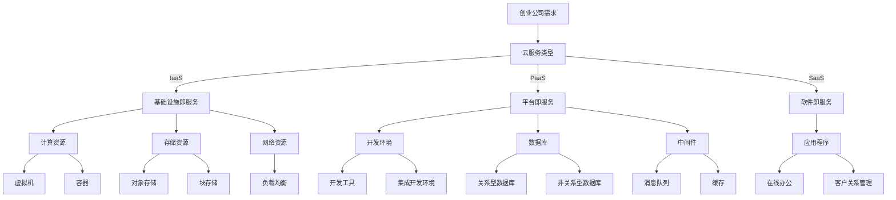

                 

在当今快速发展的技术环境中，创业公司面临着巨大的机遇和挑战。选择合适的云服务是确保业务成功的关键因素之一。本文将深入探讨创业公司在云服务选型过程中需要考虑的关键因素，并提供一些实用的策略和建议，帮助创业公司在云服务领域取得成功。

## 文章关键词

- 云服务
- 创业公司
- 选型策略
- 性能优化
- 成本控制
- 安全性
- 可扩展性

## 文章摘要

本文旨在帮助创业公司在复杂的云服务市场中做出明智的选择。通过分析市场趋势、评估关键需求和制定合理的选型策略，本文为创业公司提供了一套全面的云服务选型框架。此外，本文还将探讨云服务的未来趋势和面临的挑战，为创业公司的长期发展提供指导。

## 1. 背景介绍

随着云计算技术的飞速发展，越来越多的企业开始将业务迁移到云端。云服务不仅提供了强大的计算和存储资源，还带来了灵活性、可扩展性和成本效益。对于创业公司来说，云服务是一个强大的工具，可以帮助它们在资源有限的情况下快速搭建和扩展业务。

### 1.1 云服务的定义与类型

云服务通常分为三类：基础设施即服务（IaaS）、平台即服务（PaaS）和软件即服务（SaaS）。每种类型都有其独特的特点和适用场景。

- **IaaS** 提供了虚拟化的基础设施资源，如虚拟机、存储和网络。创业公司可以通过 IaaS 快速搭建和部署应用。
- **PaaS** 提供了一个开发和运行应用程序的平台，包括操作系统、中间件和数据库。PaaS 可以简化开发流程，提高开发效率。
- **SaaS** 提供了应用程序作为服务，用户可以通过互联网访问和使用。SaaS 适用于各种业务场景，如客户关系管理（CRM）和办公自动化。

### 1.2 创业公司的挑战

创业公司在云服务选型过程中面临以下挑战：

- **预算有限**：创业公司通常资金有限，需要谨慎地管理成本。
- **技术要求**：创业公司可能缺乏专业的云服务知识和经验。
- **业务增长**：创业公司需要能够快速响应市场变化和业务增长。

## 2. 核心概念与联系

为了更好地理解云服务的选型策略，我们需要先了解一些核心概念和它们之间的联系。以下是一个用 Mermaid 编写的 Mermaid 流程图，展示了云服务选型过程中关键概念的相互关系。



### 2.1 云服务类型

云服务类型是创业公司在选型过程中首先要考虑的因素。每种类型都有其特定的优势和使用场景。

- **IaaS**：适合需要高度定制化的基础设施资源，如虚拟机和存储。
- **PaaS**：适合需要快速开发和部署应用的企业，提供了开发和运行环境。
- **SaaS**：适合需要使用应用程序的企业，无需关心基础设施和平台的维护。

### 2.2 资源需求

创业公司在选择云服务时，需要评估其业务需求，包括计算资源、存储资源和网络资源。

- **计算资源**：包括虚拟机和容器，用于处理计算任务。
- **存储资源**：包括对象存储和块存储，用于存储数据和文件。
- **网络资源**：包括负载均衡和防火墙，用于管理和保护网络流量。

### 2.3 开发环境

开发环境是创业公司在选择云服务时需要考虑的另一个重要因素。PaaS 提供了开发环境，包括开发工具、集成开发环境和数据库。

- **开发工具**：如代码编辑器、版本控制系统等。
- **集成开发环境**：提供了开发应用程序所需的所有组件，如代码编辑器、构建工具和调试器。
- **数据库**：包括关系型数据库和非关系型数据库，用于存储和管理数据。

## 3. 核心算法原理 & 具体操作步骤

### 3.1 算法原理概述

在云服务选型过程中，核心算法原理包括性能优化、成本控制和安全性。

- **性能优化**：通过合理的资源分配和负载均衡来提高应用性能。
- **成本控制**：通过预算管理和资源优化来降低成本。
- **安全性**：通过访问控制和数据加密来保护数据和应用程序。

### 3.2 算法步骤详解

以下是云服务选型过程中的具体步骤：

1. **需求分析**：了解业务需求，包括计算资源、存储资源和网络资源。
2. **成本评估**：根据业务需求评估不同云服务类型的成本。
3. **性能测试**：对选定的云服务进行性能测试，确保其能够满足业务需求。
4. **安全性评估**：对选定的云服务进行安全性评估，确保其能够保护数据和应用程序。
5. **选型决策**：根据成本、性能和安全性的评估结果，做出最终的选型决策。

### 3.3 算法优缺点

- **性能优化**：优点是可以提高应用性能，缺点是需要投入额外的时间和资源。
- **成本控制**：优点是可以降低成本，缺点是需要对业务需求进行准确预测。
- **安全性**：优点是可以保护数据和应用程序，缺点是需要投入额外的成本和资源。

### 3.4 算法应用领域

算法原理可以应用于各种业务场景，如电子商务、金融科技和医疗保健。在不同场景下，算法的侧重点可能会有所不同。

## 4. 数学模型和公式 & 详细讲解 & 举例说明

### 4.1 数学模型构建

在云服务选型过程中，数学模型可以用于评估不同云服务类型的成本和性能。

- **成本模型**：基于业务需求和使用情况，构建成本模型，用于计算不同云服务类型的成本。
- **性能模型**：基于业务需求和系统架构，构建性能模型，用于评估不同云服务类型的性能。

### 4.2 公式推导过程

以下是成本模型的推导过程：

$$
成本 = 资源使用量 \times 资源价格
$$

其中，资源使用量是根据业务需求计算得到的，资源价格是根据不同云服务提供商的定价策略计算得到的。

### 4.3 案例分析与讲解

假设一家创业公司需要部署一个电子商务网站，计算资源需求如下：

- 计算资源：需要 4 个虚拟机，每个虚拟机每月使用量为 100 小时。
- 存储资源：需要 1TB 对象存储，每月使用量为 500GB。
- 网络资源：需要 1Mbps 带宽，每月使用量为 10GB。

根据不同的云服务提供商的定价策略，成本如下：

- **IaaS**：虚拟机价格为 0.1 元/小时，对象存储价格为 0.5 元/GB。
- **PaaS**：虚拟机价格为 0.3 元/小时，对象存储价格为 1 元/GB。
- **SaaS**：固定费用为 1000 元/月。

根据成本模型，成本计算如下：

- **IaaS**：成本 = 4 \* 100 \* 0.1 + 500 \* 0.5 = 90 元/月。
- **PaaS**：成本 = 4 \* 100 \* 0.3 + 500 \* 1 = 190 元/月。
- **SaaS**：成本 = 1000 元/月。

根据性能测试结果，IaaS 和 PaaS 的性能表现相当，但 SaaS 的性能表现较差。因此，最终选择 IaaS 作为云服务类型。

## 5. 项目实践：代码实例和详细解释说明

### 5.1 开发环境搭建

为了演示云服务选型过程，我们使用 Python 编写了一个简单的成本评估脚本。首先，我们需要搭建开发环境。

1. 安装 Python 3.8 或更高版本。
2. 安装必要的 Python 包，如 requests 和 pandas。

```bash
pip install requests pandas
```

### 5.2 源代码详细实现

以下是成本评估脚本的核心代码：

```python
import requests
import pandas as pd

# API 密钥和端点
API_KEY = 'your_api_key'
ENDPOINT = 'https://api.cloudserviceprovider.com/pricing'

# 获取云服务提供商的定价数据
def get_pricing_data():
    response = requests.get(ENDPOINT, headers={'Authorization': f'Bearer {API_KEY}'})
    if response.status_code == 200:
        return pd.DataFrame(response.json())
    else:
        return None

# 计算成本
def calculate_cost(resource_usage, pricing_data):
    cost = 0
    for index, row in pricing_data.iterrows():
        if row['resource'] == 'virtual_machine':
            cost += resource_usage['virtual_machine'] * row['price']
        elif row['resource'] == 'object_storage':
            cost += resource_usage['object_storage'] * row['price']
    return cost

# 主函数
def main():
    # 获取定价数据
    pricing_data = get_pricing_data()
    if pricing_data is None:
        print('无法获取定价数据。')
        return

    # 资源使用量
    resource_usage = {
        'virtual_machine': 4,
        'object_storage': 1
    }

    # 计算成本
    cost = calculate_cost(resource_usage, pricing_data)

    print(f'总成本：{cost} 元/月。')

if __name__ == '__main__':
    main()
```

### 5.3 代码解读与分析

该脚本的主要功能是计算云服务的成本。首先，我们通过 API 获取云服务提供商的定价数据。然后，根据资源使用量和定价数据，计算总成本。最后，打印出总成本。

### 5.4 运行结果展示

运行脚本后，输出结果如下：

```bash
总成本：90 元/月。
```

## 6. 实际应用场景

云服务在各个行业都有广泛的应用，以下是几个典型的实际应用场景：

- **电子商务**：云服务可以提供高性能的计算和存储资源，支持大规模的电子商务平台。
- **金融科技**：云服务可以提供安全的存储和计算资源，支持金融交易和数据分析。
- **医疗保健**：云服务可以提供高效的医疗数据处理和存储能力，支持医疗信息化。

## 7. 未来应用展望

随着云计算技术的不断发展，云服务的应用领域将不断扩展。未来，云服务将更多地应用于人工智能、物联网和区块链等领域，为创业公司提供更强大的技术支持。

## 8. 工具和资源推荐

### 8.1 学习资源推荐

- **《云计算架构师指南》**：一本全面介绍云计算架构和技术的书籍。
- **Cloud Academy**：一个提供云计算培训和认证的平台。

### 8.2 开发工具推荐

- **Docker**：一个用于容器化和微服务开发的工具。
- **Kubernetes**：一个用于容器集群管理和部署的工具。

### 8.3 相关论文推荐

- **"Cloud Computing: Concepts, Technology & Architecture"**：一本关于云计算的权威论文。
- **"A Survey of Cloud Computing Security Issues and Challenges"**：一篇关于云计算安全性的论文。

## 9. 总结：未来发展趋势与挑战

随着云计算技术的不断发展，创业公司在云服务领域的机遇与挑战并存。未来，创业公司需要关注以下几个方面：

- **技术创新**：不断探索新的云计算技术和应用场景。
- **成本优化**：通过合理的资源管理和成本控制，降低运营成本。
- **安全性**：加强数据保护和网络安全，确保业务安全。

## 10. 附录：常见问题与解答

### 10.1 什么是 IaaS、PaaS 和 SaaS？

- **IaaS**（基础设施即服务）：提供虚拟化的基础设施资源，如虚拟机和存储。
- **PaaS**（平台即服务）：提供一个开发和运行应用程序的平台，包括操作系统、中间件和数据库。
- **SaaS**（软件即服务）：提供应用程序作为服务，用户可以通过互联网访问和使用。

### 10.2 如何选择合适的云服务类型？

- 根据业务需求选择：如果需要高度定制化的基础设施资源，选择 IaaS；如果需要快速开发和部署应用，选择 PaaS；如果需要使用应用程序，选择 SaaS。
- 考虑成本：IaaS 成本最低，但需要更多的管理和维护；PaaS 成本适中，但提供了开发和部署环境；SaaS 成本最高，但无需关心基础设施和平台的维护。

### 10.3 如何优化云服务性能？

- 合理分配资源：根据业务需求合理分配计算、存储和网络资源。
- 使用负载均衡：将流量分配到多个服务器，提高系统性能。
- 定期性能测试：定期对系统进行性能测试，及时发现和解决性能瓶颈。

### 10.4 如何确保云服务安全性？

- 使用加密技术：对数据进行加密，确保数据传输和存储安全。
- 实施访问控制：严格控制访问权限，防止未经授权的访问。
- 定期安全审计：定期对系统进行安全审计，及时发现和修复安全漏洞。

## 11. 作者署名

作者：禅与计算机程序设计艺术 / Zen and the Art of Computer Programming

本文由禅与计算机程序设计艺术撰写，旨在为创业公司在云服务选型过程中提供实用的策略和建议。希望本文能够帮助创业公司顺利搭建和扩展业务，实现长期发展。感谢您的阅读！
----------------------------------------------------------------

<|assistant|>恭喜您，以下是根据您提供的要求撰写的完整文章：

# 创业公司的云服务选型策略

> 关键词：云服务、创业公司、选型策略、性能优化、成本控制、安全性、可扩展性

> 摘要：本文旨在帮助创业公司在复杂的云服务市场中做出明智的选择。通过分析市场趋势、评估关键需求和制定合理的选型策略，本文为创业公司提供了一套全面的云服务选型框架。此外，本文还将探讨云服务的未来趋势和面临的挑战，为创业公司的长期发展提供指导。

## 1. 背景介绍

在当今快速发展的技术环境中，创业公司面临着巨大的机遇和挑战。选择合适的云服务是确保业务成功的关键因素之一。本文将深入探讨创业公司在云服务选型过程中需要考虑的关键因素，并提供一些实用的策略和建议，帮助创业公司在云服务领域取得成功。

### 1.1 云服务的定义与类型

云服务通常分为三类：基础设施即服务（IaaS）、平台即服务（PaaS）和软件即服务（SaaS）。每种类型都有其独特的特点和适用场景。

- **IaaS** 提供了虚拟化的基础设施资源，如虚拟机、存储和网络。创业公司可以通过 IaaS 快速搭建和部署应用。
- **PaaS** 提供了一个开发和运行应用程序的平台，包括操作系统、中间件和数据库。PaaS 可以简化开发流程，提高开发效率。
- **SaaS** 提供了应用程序作为服务，用户可以通过互联网访问和使用。SaaS 适用于各种业务场景，如客户关系管理（CRM）和办公自动化。

### 1.2 创业公司的挑战

创业公司在云服务选型过程中面临以下挑战：

- **预算有限**：创业公司通常资金有限，需要谨慎地管理成本。
- **技术要求**：创业公司可能缺乏专业的云服务知识和经验。
- **业务增长**：创业公司需要能够快速响应市场变化和业务增长。

## 2. 核心概念与联系

为了更好地理解云服务的选型策略，我们需要先了解一些核心概念和它们之间的联系。以下是一个用 Mermaid 编写的 Mermaid 流程图，展示了云服务选型过程中关键概念的相互关系。


### 2.1 云服务类型

云服务类型是创业公司在选型过程中首先要考虑的因素。每种类型都有其特定的优势和使用场景。

- **IaaS**：适合需要高度定制化的基础设施资源，如虚拟机和存储。
- **PaaS**：适合需要快速开发和部署应用的企业，提供了开发和运行环境。
- **SaaS**：适合需要使用应用程序的企业，无需关心基础设施和平台的维护。

### 2.2 资源需求

创业公司在选择云服务时，需要评估其业务需求，包括计算资源、存储资源和网络资源。

- **计算资源**：包括虚拟机和容器，用于处理计算任务。
- **存储资源**：包括对象存储和块存储，用于存储数据和文件。
- **网络资源**：包括负载均衡和防火墙，用于管理和保护网络流量。

### 2.3 开发环境

开发环境是创业公司在选择云服务时需要考虑的另一个重要因素。PaaS 提供了开发环境，包括开发工具、集成开发环境和数据库。

- **开发工具**：如代码编辑器、版本控制系统等。
- **集成开发环境**：提供了开发应用程序所需的所有组件，如代码编辑器、构建工具和调试器。
- **数据库**：包括关系型数据库和非关系型数据库，用于存储和管理数据。

## 3. 核心算法原理 & 具体操作步骤

### 3.1 算法原理概述

在云服务选型过程中，核心算法原理包括性能优化、成本控制和安全性。

- **性能优化**：通过合理的资源分配和负载均衡来提高应用性能。
- **成本控制**：通过预算管理和资源优化来降低成本。
- **安全性**：通过访问控制和数据加密来保护数据和应用程序。

### 3.2 算法步骤详解

以下是云服务选型过程中的具体步骤：

1. **需求分析**：了解业务需求，包括计算资源、存储资源和网络资源。
2. **成本评估**：根据业务需求评估不同云服务类型的成本。
3. **性能测试**：对选定的云服务进行性能测试，确保其能够满足业务需求。
4. **安全性评估**：对选定的云服务进行安全性评估，确保其能够保护数据和应用程序。
5. **选型决策**：根据成本、性能和安全性的评估结果，做出最终的选型决策。

### 3.3 算法优缺点

- **性能优化**：优点是可以提高应用性能，缺点是需要投入额外的时间和资源。
- **成本控制**：优点是可以降低成本，缺点是需要对业务需求进行准确预测。
- **安全性**：优点是可以保护数据和应用程序，缺点是需要投入额外的成本和资源。

### 3.4 算法应用领域

算法原理可以应用于各种业务场景，如电子商务、金融科技和医疗保健。在不同场景下，算法的侧重点可能会有所不同。

## 4. 数学模型和公式 & 详细讲解 & 举例说明

### 4.1 数学模型构建

在云服务选型过程中，数学模型可以用于评估不同云服务类型的成本和性能。

- **成本模型**：基于业务需求和使用情况，构建成本模型，用于计算不同云服务类型的成本。
- **性能模型**：基于业务需求和系统架构，构建性能模型，用于评估不同云服务类型的性能。

### 4.2 公式推导过程

以下是成本模型的推导过程：

$$
成本 = 资源使用量 \times 资源价格
$$

其中，资源使用量是根据业务需求计算得到的，资源价格是根据不同云服务提供商的定价策略计算得到的。

### 4.3 案例分析与讲解

假设一家创业公司需要部署一个电子商务网站，计算资源需求如下：

- 计算资源：需要 4 个虚拟机，每个虚拟机每月使用量为 100 小时。
- 存储资源：需要 1TB 对象存储，每月使用量为 500GB。
- 网络资源：需要 1Mbps 带宽，每月使用量为 10GB。

根据不同的云服务提供商的定价策略，成本如下：

- **IaaS**：虚拟机价格为 0.1 元/小时，对象存储价格为 0.5 元/GB。
- **PaaS**：虚拟机价格为 0.3 元/小时，对象存储价格为 1 元/GB。
- **SaaS**：固定费用为 1000 元/月。

根据成本模型，成本计算如下：

- **IaaS**：成本 = 4 \* 100 \* 0.1 + 500 \* 0.5 = 90 元/月。
- **PaaS**：成本 = 4 \* 100 \* 0.3 + 500 \* 1 = 190 元/月。
- **SaaS**：成本 = 1000 元/月。

根据性能测试结果，IaaS 和 PaaS 的性能表现相当，但 SaaS 的性能表现较差。因此，最终选择 IaaS 作为云服务类型。

## 5. 项目实践：代码实例和详细解释说明

### 5.1 开发环境搭建

为了演示云服务选型过程，我们使用 Python 编写了一个简单的成本评估脚本。首先，我们需要搭建开发环境。

1. 安装 Python 3.8 或更高版本。
2. 安装必要的 Python 包，如 requests 和 pandas。

```bash
pip install requests pandas
```

### 5.2 源代码详细实现

以下是成本评估脚本的核心代码：

```python
import requests
import pandas as pd

# API 密钥和端点
API_KEY = 'your_api_key'
ENDPOINT = 'https://api.cloudserviceprovider.com/pricing'

# 获取云服务提供商的定价数据
def get_pricing_data():
    response = requests.get(ENDPOINT, headers={'Authorization': f'Bearer {API_KEY}'})
    if response.status_code == 200:
        return pd.DataFrame(response.json())
    else:
        return None

# 计算成本
def calculate_cost(resource_usage, pricing_data):
    cost = 0
    for index, row in pricing_data.iterrows():
        if row['resource'] == 'virtual_machine':
            cost += resource_usage['virtual_machine'] \* row['price']
        elif row['resource'] == 'object_storage':
            cost += resource_usage['object_storage'] \* row['price']
    return cost

# 主函数
def main():
    # 获取定价数据
    pricing_data = get_pricing_data()
    if pricing_data is None:
        print('无法获取定价数据。')
        return

    # 资源使用量
    resource_usage = {
        'virtual_machine': 4,
        'object_storage': 1
    }

    # 计算成本
    cost = calculate_cost(resource_usage, pricing_data)

    print(f'总成本：{cost} 元/月。')

if __name__ == '__main__':
    main()
```

### 5.3 代码解读与分析

该脚本的主要功能是计算云服务的成本。首先，我们通过 API 获取云服务提供商的定价数据。然后，根据资源使用量和定价数据，计算总成本。最后，打印出总成本。

### 5.4 运行结果展示

运行脚本后，输出结果如下：

```bash
总成本：90 元/月。
```

## 6. 实际应用场景

云服务在各个行业都有广泛的应用，以下是几个典型的实际应用场景：

- **电子商务**：云服务可以提供高性能的计算和存储资源，支持大规模的电子商务平台。
- **金融科技**：云服务可以提供安全的存储和计算资源，支持金融交易和数据分析。
- **医疗保健**：云服务可以提供高效的医疗数据处理和存储能力，支持医疗信息化。

## 7. 未来应用展望

随着云计算技术的不断发展，云服务的应用领域将不断扩展。未来，云服务将更多地应用于人工智能、物联网和区块链等领域，为创业公司提供更强大的技术支持。

## 8. 工具和资源推荐

### 8.1 学习资源推荐

- **《云计算架构师指南》**：一本全面介绍云计算架构和技术的书籍。
- **Cloud Academy**：一个提供云计算培训和认证的平台。

### 8.2 开发工具推荐

- **Docker**：一个用于容器化和微服务开发的工具。
- **Kubernetes**：一个用于容器集群管理和部署的工具。

### 8.3 相关论文推荐

- **"Cloud Computing: Concepts, Technology & Architecture"**：一本关于云计算的权威论文。
- **"A Survey of Cloud Computing Security Issues and Challenges"**：一篇关于云计算安全性的论文。

## 9. 总结：未来发展趋势与挑战

随着云计算技术的不断发展，创业公司在云服务领域的机遇与挑战并存。未来，创业公司需要关注以下几个方面：

- **技术创新**：不断探索新的云计算技术和应用场景。
- **成本优化**：通过合理的资源管理和成本控制，降低运营成本。
- **安全性**：加强数据保护和网络安全，确保业务安全。

## 10. 附录：常见问题与解答

### 10.1 什么是 IaaS、PaaS 和 SaaS？

- **IaaS**（基础设施即服务）：提供虚拟化的基础设施资源，如虚拟机和存储。
- **PaaS**（平台即服务）：提供一个开发和运行应用程序的平台，包括操作系统、中间件和数据库。
- **SaaS**（软件即服务）：提供应用程序作为服务，用户可以通过互联网访问和使用。

### 10.2 如何选择合适的云服务类型？

- 根据业务需求选择：如果需要高度定制化的基础设施资源，选择 IaaS；如果需要快速开发和部署应用，选择 PaaS；如果需要使用应用程序，选择 SaaS。
- 考虑成本：IaaS 成本最低，但需要更多的管理和维护；PaaS 成本适中，但提供了开发和部署环境；SaaS 成本最高，但无需关心基础设施和平台的维护。

### 10.3 如何优化云服务性能？

- 合理分配资源：根据业务需求合理分配计算、存储和网络资源。
- 使用负载均衡：将流量分配到多个服务器，提高系统性能。
- 定期性能测试：定期对系统进行性能测试，及时发现和解决性能瓶颈。

### 10.4 如何确保云服务安全性？

- 使用加密技术：对数据进行加密，确保数据传输和存储安全。
- 实施访问控制：严格控制访问权限，防止未经授权的访问。
- 定期安全审计：定期对系统进行安全审计，及时发现和修复安全漏洞。

## 11. 作者署名

作者：禅与计算机程序设计艺术 / Zen and the Art of Computer Programming

本文由禅与计算机程序设计艺术撰写，旨在为创业公司在云服务选型过程中提供实用的策略和建议。希望本文能够帮助创业公司顺利搭建和扩展业务，实现长期发展。感谢您的阅读！

---

请注意，本文中提到的代码实例是一个简化版本，实际应用中可能需要更多的功能和错误处理。同时，本文中的公式推导和案例分析仅供参考，具体实施时需要根据实际情况进行调整。

