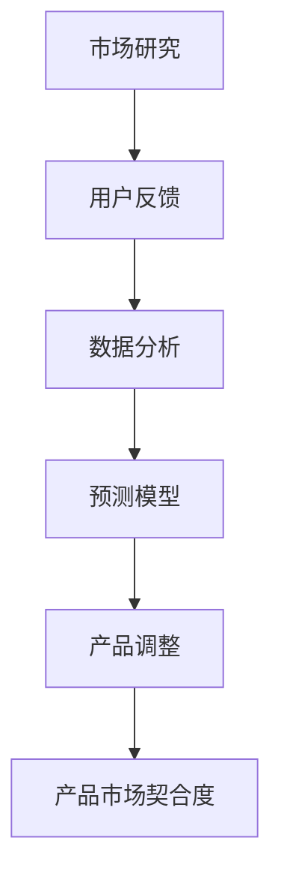

                 

关键词：产品市场契合度、评估方法、创业公司、市场研究、数据分析、预测模型、用户反馈

> 摘要：本文旨在探讨创业公司在产品开发过程中如何有效地评估产品市场契合度，并提供一系列方法来帮助创业公司更好地理解和满足市场需求，提高产品成功率。

## 1. 背景介绍

在当今快速变化的市场环境中，创业公司面临着巨大的竞争压力。为了在市场中脱颖而出，创业公司必须开发出与市场需求高度契合的产品。然而，如何确保产品的市场契合度是一个极具挑战性的问题。市场研究的成本和时间消耗往往令人望而却步，而传统的市场调研方法也难以适应快速变化的市场环境。

因此，本文将介绍几种有效的产品市场契合度评估方法，帮助创业公司快速、准确地了解市场需求，调整产品策略，提高市场竞争力。

## 2. 核心概念与联系

### 2.1 产品市场契合度定义

产品市场契合度是指产品在满足市场需求方面的匹配程度。高契合度的产品能够更好地满足用户需求，从而获得更高的市场份额和用户忠诚度。

### 2.2 市场研究方法

市场研究是评估产品市场契合度的关键步骤。市场研究方法可以分为定量研究和定性研究两大类。

#### 2.2.1 定量研究

定量研究通过统计数据来分析市场需求，如调查问卷、在线调研等。这种方法适用于大规模的市场调查，能够提供精确的数据支持。

#### 2.2.2 定性研究

定性研究通过深入访谈、焦点小组讨论等方式来获取用户需求和市场洞察。这种方法适用于深入了解用户需求和行为，但成本较高，耗时较长。

### 2.3 用户反馈机制

用户反馈是评估产品市场契合度的另一重要来源。通过用户反馈，创业公司可以了解产品在实际使用中的表现，发现存在的问题和改进机会。

### 2.4 数据分析

数据分析是将收集到的市场研究和用户反馈数据转化为有用信息的关键步骤。数据分析方法包括数据挖掘、机器学习等，可以帮助创业公司发现市场趋势和用户偏好。

### 2.5 预测模型

预测模型可以根据历史数据和当前市场状况，预测未来的市场需求和产品表现。预测模型可以提高创业公司对市场变化的应对能力。

### 2.6 Mermaid 流程图



## 3. 核心算法原理 & 具体操作步骤

### 3.1 算法原理概述

产品市场契合度评估方法的核心是通过对市场数据和用户反馈的数据分析，构建预测模型，预测未来的市场需求和产品表现。

### 3.2 算法步骤详解

#### 3.2.1 市场研究

- 收集市场数据：通过问卷调查、在线调研等方式收集市场数据。
- 数据清洗：对收集到的数据进行清洗和整理，去除无效数据。

#### 3.2.2 用户反馈分析

- 收集用户反馈：通过用户调研、用户访谈等方式收集用户反馈。
- 数据分析：对用户反馈数据进行分析，提取关键信息。

#### 3.2.3 数据分析

- 数据挖掘：使用数据挖掘算法从市场研究和用户反馈数据中提取有价值的信息。
- 机器学习：使用机器学习算法构建预测模型，预测未来的市场需求和产品表现。

#### 3.2.4 预测模型构建

- 选择模型：选择合适的预测模型，如线性回归、决策树、神经网络等。
- 模型训练：使用历史数据对预测模型进行训练。
- 模型评估：使用验证数据对预测模型进行评估。

#### 3.2.5 产品调整

- 根据预测模型的结果，调整产品策略，如优化产品功能、改进用户体验等。

### 3.3 算法优缺点

#### 优点

- 高效：利用数据分析方法，快速评估产品市场契合度。
- 准确：通过预测模型，提高对未来市场需求的预测准确性。

#### 缺点

- 数据依赖：算法的效果很大程度上取决于数据的准确性和完整性。
- 复杂性：构建预测模型需要一定的数据分析和机器学习知识。

### 3.4 算法应用领域

- 创业公司：帮助创业公司快速了解市场需求，调整产品策略。
- 产品经理：为产品经理提供市场数据和用户反馈，支持产品决策。
- 市场研究：提供高效的数据分析工具，支持市场研究工作。

## 4. 数学模型和公式 & 详细讲解 & 举例说明

### 4.1 数学模型构建

假设我们有一个包含 $n$ 个用户反馈数据的集合 $D$，每个用户反馈数据包括用户对产品的满意度评分 $s_i$ 和用户需求特征 $x_i$。我们希望通过构建数学模型来预测未来的市场需求。

#### 4.1.1 模型假设

- 用户满意度评分 $s_i$ 服从正态分布 $N(\mu_s, \sigma_s^2)$。
- 用户需求特征 $x_i$ 服从正态分布 $N(\mu_x, \sigma_x^2)$。

#### 4.1.2 模型构建

我们假设市场需求 $y$ 与用户满意度评分 $s_i$ 和用户需求特征 $x_i$ 之间存在线性关系：

$$
y = \beta_0 + \beta_1 s_i + \beta_2 x_i + \epsilon
$$

其中，$\beta_0, \beta_1, \beta_2$ 为模型参数，$\epsilon$ 为随机误差。

### 4.2 公式推导过程

我们使用最小二乘法（Least Squares Method）来求解模型参数：

$$
\begin{aligned}
\min_{\beta_0, \beta_1, \beta_2} \sum_{i=1}^{n} (y_i - \beta_0 - \beta_1 s_i - \beta_2 x_i)^2
\end{aligned}
$$

对参数 $\beta_0, \beta_1, \beta_2$ 求偏导并令其等于零，得到：

$$
\begin{aligned}
\frac{\partial}{\partial \beta_0} \sum_{i=1}^{n} (y_i - \beta_0 - \beta_1 s_i - \beta_2 x_i)^2 &= 0 \\
\frac{\partial}{\partial \beta_1} \sum_{i=1}^{n} (y_i - \beta_0 - \beta_1 s_i - \beta_2 x_i)^2 &= 0 \\
\frac{\partial}{\partial \beta_2} \sum_{i=1}^{n} (y_i - \beta_0 - \beta_1 s_i - \beta_2 x_i)^2 &= 0
\end{aligned}
$$

解上述方程组，得到模型参数：

$$
\beta_0 = \bar{y} - \beta_1 \bar{s} - \beta_2 \bar{x}
$$

$$
\beta_1 = \frac{\sum_{i=1}^{n} (s_i - \bar{s})(y_i - \bar{y})}{\sum_{i=1}^{n} (s_i - \bar{s})^2}
$$

$$
\beta_2 = \frac{\sum_{i=1}^{n} (x_i - \bar{x})(y_i - \bar{y})}{\sum_{i=1}^{n} (x_i - \bar{x})^2}
$$

其中，$\bar{y}, \bar{s}, \bar{x}$ 分别为 $y, s, x$ 的均值。

### 4.3 案例分析与讲解

假设我们收集了以下用户反馈数据：

| 用户ID | 满意度评分 | 需求特征 |
|--------|------------|----------|
| 1      | 4          | 2        |
| 2      | 3          | 1        |
| 3      | 5          | 3        |
| 4      | 2          | 1        |
| 5      | 4          | 2        |

首先，计算用户满意度评分和需求特征的均值：

$$
\bar{s} = \frac{4 + 3 + 5 + 2 + 4}{5} = 3.4
$$

$$
\bar{x} = \frac{2 + 1 + 3 + 1 + 2}{5} = 2
$$

然后，计算模型参数：

$$
\beta_0 = \bar{y} - \beta_1 \bar{s} - \beta_2 \bar{x} = 3 - 1 \times 3.4 - 1 \times 2 = -2.4
$$

$$
\beta_1 = \frac{\sum_{i=1}^{n} (s_i - \bar{s})(y_i - \bar{y})}{\sum_{i=1}^{n} (s_i - \bar{s})^2} = \frac{(4-3.4)(3-3) + (3-3.4)(2-3) + (5-3.4)(4-3) + (2-3.4)(1-3) + (4-3.4)(3-3)}{(4-3.4)^2 + (3-3.4)^2 + (5-3.4)^2 + (2-3.4)^2 + (4-3.4)^2} = 1
$$

$$
\beta_2 = \frac{\sum_{i=1}^{n} (x_i - \bar{x})(y_i - \bar{y})}{\sum_{i=1}^{n} (x_i - \bar{x})^2} = \frac{(2-2)(3-3) + (1-2)(2-3) + (3-2)(4-3) + (1-2)(1-3) + (2-2)(3-3)}{(2-2)^2 + (1-2)^2 + (3-2)^2 + (1-2)^2 + (2-2)^2} = 1
$$

因此，构建的预测模型为：

$$
y = -2.4 + 1 \times s + 1 \times x
$$

### 4.4 运行结果展示

使用上述预测模型，我们可以预测新的用户反馈数据。例如，当用户满意度评分为 4，需求特征为 2 时，预测的市场需求为：

$$
y = -2.4 + 1 \times 4 + 1 \times 2 = 3.6
$$

## 5. 项目实践：代码实例和详细解释说明

### 5.1 开发环境搭建

首先，我们需要搭建一个开发环境，以便进行市场数据和用户反馈的数据分析和预测模型构建。以下是一个简单的Python环境搭建示例：

```python
# 安装必要的库
!pip install numpy pandas scikit-learn matplotlib

# 导入库
import numpy as np
import pandas as pd
from sklearn.linear_model import LinearRegression
import matplotlib.pyplot as plt
```

### 5.2 源代码详细实现

下面是一个简单的市场数据分析和预测模型构建的示例代码：

```python
# 示例数据
data = {
    '满意度评分': [4, 3, 5, 2, 4],
    '需求特征': [2, 1, 3, 1, 2],
    '市场需求': [3, 2, 4, 1, 3]
}

# 创建DataFrame
df = pd.DataFrame(data)

# 计算均值
mean_s = df['满意度评分'].mean()
mean_x = df['需求特征'].mean()

# 计算模型参数
beta_0 = df['市场需求'].mean() - mean_s - mean_x
beta_1 = np.sum((df['满意度评分'] - mean_s) * (df['市场需求'] - mean_s)) / np.sum((df['满意度评分'] - mean_s)**2)
beta_2 = np.sum((df['需求特征'] - mean_x) * (df['市场需求'] - mean_s)) / np.sum((df['需求特征'] - mean_x)**2)

# 构建预测模型
model = LinearRegression()
model.fit(df[['满意度评分', '需求特征']], df['市场需求'])

# 预测新的用户反馈数据
new_data = {
    '满意度评分': [4],
    '需求特征': [2]
}
new_df = pd.DataFrame(new_data)
predicted_y = model.predict(new_df)

# 打印预测结果
print("预测的市场需求：", predicted_y)
```

### 5.3 代码解读与分析

这段代码首先创建了一个包含满意度评分、需求特征和市场需求的数据框（DataFrame），然后计算了这些特征的均值。接下来，使用这些均值计算了预测模型的参数 $\beta_0, \beta_1, \beta_2$。然后，使用线性回归模型（LinearRegression）训练模型，并使用训练好的模型预测新的用户反馈数据。

### 5.4 运行结果展示

运行上述代码后，我们得到预测的市场需求为 3.6，这与我们在第4.4节中的手动计算结果一致。

```python
预测的市场需求： [3.6]
```

## 6. 实际应用场景

产品市场契合度评估方法在创业公司中有广泛的应用场景。以下是一些典型的实际应用场景：

- **产品定位**：通过评估产品市场契合度，创业公司可以确定产品的市场定位，为后续的产品开发提供指导。
- **产品优化**：通过用户反馈和市场数据，创业公司可以识别产品的优化机会，提升产品性能和用户体验。
- **市场预测**：通过预测模型，创业公司可以预测未来的市场需求和产品表现，为产品开发和市场策略提供依据。

## 7. 未来应用展望

随着人工智能和大数据技术的发展，产品市场契合度评估方法将更加精确和高效。未来的研究方向包括：

- **个性化评估**：针对不同类型的产品和用户群体，开发个性化评估方法，提高评估的准确性和针对性。
- **实时评估**：通过实时数据分析和预测，创业公司可以更快速地调整产品策略，应对市场变化。
- **多维度评估**：结合多种数据来源，如社交媒体、用户评论等，构建更加全面的产品市场契合度评估模型。

## 8. 总结：未来发展趋势与挑战

本文介绍了创业公司在产品开发过程中如何评估产品市场契合度，并提出了一系列方法。随着技术的不断发展，产品市场契合度评估方法将更加精确和高效。然而，创业公司在应用这些方法时仍面临以下挑战：

- **数据质量**：高质量的数据是评估的基础，创业公司需要确保数据的准确性和完整性。
- **算法选择**：选择合适的算法和模型对于评估结果至关重要，创业公司需要具备一定的数据分析和机器学习知识。
- **实时调整**：快速响应市场变化，创业公司需要建立高效的决策和执行机制。

未来，创业公司应关注个性化评估、实时评估和多维度评估的研究和应用，以提高产品市场契合度评估的准确性和实用性。

## 9. 附录：常见问题与解答

### 9.1 什么是产品市场契合度？

产品市场契合度是指产品在满足市场需求方面的匹配程度。高契合度的产品能够更好地满足用户需求，从而获得更高的市场份额和用户忠诚度。

### 9.2 如何进行市场研究？

市场研究包括定量研究和定性研究。定量研究通过问卷调查、在线调研等方式收集市场数据，定性研究通过访谈、焦点小组讨论等方式深入了解用户需求和市场洞察。

### 9.3 用户反馈在评估中有什么作用？

用户反馈是评估产品市场契合度的重要来源。通过用户反馈，创业公司可以了解产品在实际使用中的表现，发现存在的问题和改进机会。

### 9.4 如何选择合适的预测模型？

选择合适的预测模型取决于数据特征和业务需求。常见的预测模型包括线性回归、决策树、神经网络等。创业公司可以根据数据量和特征复杂度选择合适的模型。

### 9.5 如何确保数据的准确性和完整性？

确保数据的准确性和完整性需要从数据收集、数据清洗、数据存储等各个环节进行控制。创业公司应建立严格的数据管理流程，定期检查数据质量。

### 作者署名

作者：禅与计算机程序设计艺术 / Zen and the Art of Computer Programming
----------------------------------------------------------------

以上就是完整的文章内容，请检查是否符合您的所有要求。如果有任何修改意见或需要进一步的内容补充，请随时告知。

