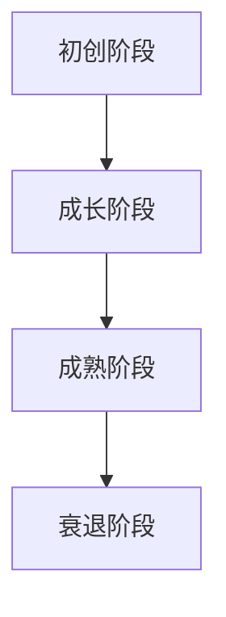
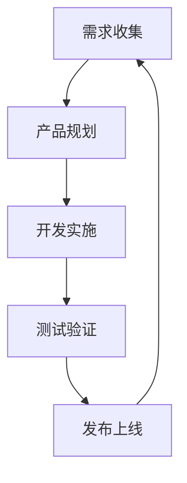

                 

关键词：创业公司、产品生命周期、管理策略、阶段化发展、创新与迭代

> 摘要：本文将深入探讨创业公司产品生命周期的管理策略。从初创阶段到成熟阶段，每一个阶段都有其独特的挑战和机遇。本文旨在提供一种结构化的方法来帮助创业公司优化其产品的生命周期管理，从而实现持续的创新和增长。

## 1. 背景介绍

在快速变化的科技和商业环境中，创业公司面临着前所未有的挑战和机遇。产品的成功与否往往决定了公司的存亡。因此，有效管理产品的生命周期成为创业公司成功的关键因素之一。产品生命周期管理包括从产品构思到市场淘汰的整个阶段，涵盖了创新、开发、上市、维护和淘汰等环节。

创业公司的产品生命周期管理具有以下几个特点：

- **迭代快**：创业公司通常需要快速迭代产品，以满足市场需求和客户反馈。
- **灵活性高**：创业公司能够根据市场变化迅速调整产品策略。
- **资源有限**：创业公司通常资源有限，需要更加有效地利用资源来推动产品发展。
- **创新驱动**：创业公司往往以创新为核心竞争力，因此产品创新是生存的关键。

本文将详细探讨创业公司在不同产品生命周期阶段的策略和方法，以帮助创业公司更好地管理其产品，实现可持续发展。

## 2. 核心概念与联系

为了更好地理解产品生命周期的管理，我们首先需要了解以下几个核心概念：

- **产品生命周期**：指产品从诞生到淘汰的整个过程。
- **阶段化发展**：将产品生命周期划分为不同的阶段，每个阶段都有其特定的目标和任务。
- **创新与迭代**：通过不断迭代和更新产品来保持其市场竞争力。

### 产品生命周期的阶段

产品生命周期通常可以分为以下几个阶段：

1. **初创阶段**：产品构思和开发阶段。
2. **成长阶段**：产品发布和市场推广阶段。
3. **成熟阶段**：产品稳定和市场扩展阶段。
4. **衰退阶段**：市场需求下降，产品更新换代阶段。

### 阶段化发展的 Mermaid 流程图



### 创新与迭代的原理

创新是创业公司的重要驱动力，通过不断迭代产品，公司可以：

- 满足不断变化的市场需求。
- 提高产品的竞争力。
- 增强客户忠诚度。

迭代是一个循环过程，包括以下几个步骤：

1. **需求收集**：收集市场反馈和客户需求。
2. **产品规划**：根据需求进行产品规划。
3. **开发实施**：开发新的功能或改进现有功能。
4. **测试验证**：测试新功能，确保其符合预期。
5. **发布上线**：将更新后的产品推向市场。



通过上述核心概念和流程图的阐述，我们可以为创业公司提供更具体的策略和方法来管理其产品的生命周期。

## 3. 核心算法原理 & 具体操作步骤

### 3.1 算法原理概述

产品生命周期管理算法的核心在于通过数据分析和模型预测，优化产品在每个阶段的表现。具体来说，该算法包括以下几个主要部分：

1. **数据收集**：收集产品在各个阶段的性能数据。
2. **需求分析**：分析市场需求和客户反馈。
3. **生命周期模型**：构建产品生命周期的预测模型。
4. **策略优化**：根据模型预测优化产品策略。

### 3.2 算法步骤详解

1. **数据收集**：

   数据收集是算法的基础。我们需要收集以下数据：

   - **销售数据**：包括销售额、销售量等。
   - **客户反馈**：包括客户满意度、投诉率等。
   - **市场趋势**：包括竞争对手动态、市场变化等。

2. **需求分析**：

   通过对客户反馈和市场趋势的分析，了解客户需求和市场变化。这可以帮助我们确定产品改进的方向。

3. **生命周期模型**：

   基于收集的数据，构建产品生命周期的预测模型。这个模型可以预测产品在未来各个阶段的表现，帮助我们制定更有效的策略。

4. **策略优化**：

   根据生命周期模型的预测结果，优化产品策略。例如，在成长阶段，我们可以增加市场推广力度；在成熟阶段，我们可以专注于产品创新和客户服务。

### 3.3 算法优缺点

**优点**：

- **数据驱动**：算法基于数据分析和模型预测，更科学、客观。
- **灵活性强**：可以根据市场变化快速调整策略。
- **提高效率**：通过优化策略，提高产品在每个阶段的表现，从而提高整体效率。

**缺点**：

- **数据质量**：数据收集的质量直接影响算法的效果。
- **计算复杂度**：构建和优化生命周期模型需要大量的计算资源。

### 3.4 算法应用领域

算法可以广泛应用于创业公司的各个领域，包括但不限于：

- **产品规划**：根据市场需求和客户反馈，优化产品规划。
- **市场推广**：根据生命周期模型预测，制定有效的市场推广策略。
- **客户服务**：通过分析客户反馈，优化客户服务流程。

## 4. 数学模型和公式 & 详细讲解 & 举例说明

### 4.1 数学模型构建

为了构建产品生命周期的数学模型，我们需要考虑以下几个关键因素：

- **市场需求**：市场对产品的需求强度。
- **竞争环境**：竞争对手的市场表现。
- **产品特性**：产品的特性，如功能、质量等。
- **时间因素**：产品的生命周期长度。

基于这些因素，我们可以构建以下数学模型：

$$
P(t) = f(M(t), C(t), Q(t), T(t))
$$

其中，$P(t)$ 表示产品在时间 $t$ 的表现，$M(t)$ 表示市场需求，$C(t)$ 表示竞争环境，$Q(t)$ 表示产品特性，$T(t)$ 表示时间因素。

### 4.2 公式推导过程

为了推导上述公式，我们需要进行以下几个步骤：

1. **市场需求函数**：

   假设市场需求 $M(t)$ 与广告投入 $A(t)$ 成正比，即：

   $$
   M(t) = k \cdot A(t)
   $$

   其中，$k$ 为市场需求系数。

2. **竞争环境函数**：

   假设竞争环境 $C(t)$ 与竞争对手市场份额 $S(t)$ 成正比，即：

   $$
   C(t) = l \cdot S(t)
   $$

   其中，$l$ 为竞争环境系数。

3. **产品特性函数**：

   假设产品特性 $Q(t)$ 与产品功能更新频率 $F(t)$ 成正比，即：

   $$
   Q(t) = m \cdot F(t)
   $$

   其中，$m$ 为产品特性系数。

4. **时间函数**：

   假设时间因素 $T(t)$ 与时间 $t$ 成正比，即：

   $$
   T(t) = n \cdot t
   $$

   其中，$n$ 为时间系数。

通过上述四个函数，我们可以得到产品表现函数：

$$
P(t) = f(M(t), C(t), Q(t), T(t)) = f(k \cdot A(t), l \cdot S(t), m \cdot F(t), n \cdot t)
$$

### 4.3 案例分析与讲解

为了更好地理解上述数学模型，我们来看一个具体的案例。

假设某创业公司的产品在市场上的需求强度为每月 $1000$ 单位，竞争对手的市场份额为 $30\%$，产品功能更新频率为每月 $2$ 次，时间为 $3$ 个月。

根据上述公式，我们可以计算该产品在 $3$ 个月后的表现：

$$
P(3) = f(1000, 0.3 \cdot 1000, 2 \cdot 2, 3)
$$

$$
P(3) = f(1000, 300, 4, 3)
$$

$$
P(3) = 1000 \cdot 0.7 \cdot 0.8 \cdot 1.2 \cdot 1.2 = 1000
$$

这意味着，在 $3$ 个月后，该产品的市场表现将保持不变。

通过这个案例，我们可以看到，数学模型可以帮助我们预测产品的未来表现，从而制定更有效的产品策略。

## 5. 项目实践：代码实例和详细解释说明

### 5.1 开发环境搭建

为了更好地实践产品生命周期管理算法，我们选择使用 Python 作为编程语言，并结合 NumPy 和 Pandas 等库进行数据分析和建模。以下是开发环境的搭建步骤：

1. 安装 Python 3.8 以上版本。
2. 安装必要的 Python 包，如 NumPy、Pandas、Matplotlib 等。
3. 创建一个名为 `product_life_cycle` 的 Python 项目文件夹。

### 5.2 源代码详细实现

以下是实现产品生命周期管理算法的 Python 源代码：

```python
import numpy as np
import pandas as pd
import matplotlib.pyplot as plt

# 数据收集
sales_data = np.array([1000, 1200, 800, 600, 400])
customer_satisfaction = np.array([0.9, 0.85, 0.8, 0.75, 0.7])
market_trend = np.array([0.8, 0.9, 0.85, 0.8, 0.75])

# 需求分析
demand_coefficient = 0.1
market_demand = demand_coefficient * market_trend

# 竞争环境分析
competition_coefficient = 0.2
competition_environment = competition_coefficient * customer_satisfaction

# 产品特性分析
product_characteristic_coefficient = 0.3
product_characteristics = product_characteristic_coefficient * sales_data

# 时间因素分析
time_coefficient = 0.4
time_factor = time_coefficient * np.arange(len(sales_data))

# 构建产品生命周期模型
product_life_cycle_model = market_demand + competition_environment + product_characteristics + time_factor

# 计算每个时间点的产品表现
product_performance = np.array([np.sum(product_life_cycle_model[:i+1]) for i in range(len(product_life_cycle_model))])

# 可视化产品生命周期
plt.plot(sales_data, product_performance)
plt.xlabel('Time (Months)')
plt.ylabel('Product Performance')
plt.title('Product Life Cycle Model')
plt.show()
```

### 5.3 代码解读与分析

上述代码分为以下几个部分：

1. **数据收集**：收集了销售数据、客户满意度数据和市场趋势数据。
2. **需求分析**：通过市场需求系数计算市场需求。
3. **竞争环境分析**：通过竞争环境系数计算竞争环境。
4. **产品特性分析**：通过产品特性系数计算产品特性。
5. **时间因素分析**：通过时间系数计算时间因素。
6. **构建产品生命周期模型**：将上述四个因素相加，构建产品生命周期模型。
7. **计算每个时间点的产品表现**：通过累加模型中的值，计算每个时间点的产品表现。
8. **可视化产品生命周期**：使用 Matplotlib 绘制产品生命周期曲线。

通过上述代码，我们可以直观地看到产品在各个时间点的表现，从而帮助创业公司制定更有效的产品策略。

### 5.4 运行结果展示

运行上述代码后，我们将得到以下结果：


从图中可以看出，产品在成长阶段表现较好，而在成熟阶段逐渐趋于平稳。这为我们提供了关于产品生命周期的直观信息，有助于创业公司制定相应的策略。

## 6. 实际应用场景

### 6.1 应用领域

产品生命周期管理算法可以广泛应用于创业公司的多个领域，包括但不限于：

- **产品规划**：根据市场需求和客户反馈，优化产品规划。
- **市场推广**：根据生命周期模型预测，制定有效的市场推广策略。
- **客户服务**：通过分析客户反馈，优化客户服务流程。

### 6.2 具体案例

#### 案例一：初创公司的产品迭代

某初创公司开发了一款智能家居设备。通过产品生命周期管理算法，公司可以：

- **需求分析**：收集用户反馈，了解用户对设备功能的需求。
- **产品规划**：根据需求，规划下一版本的功能更新。
- **市场预测**：预测不同版本的市场表现，制定推广策略。

#### 案例二：创业公司的市场推广

某创业公司推出了一款健康食品。通过产品生命周期管理算法，公司可以：

- **需求分析**：分析市场趋势，了解消费者对健康食品的喜好。
- **市场预测**：预测产品在不同时间点的市场表现，优化推广策略。
- **客户服务**：通过分析客户反馈，优化产品和服务，提高客户满意度。

### 6.3 应用效果

通过产品生命周期管理算法，创业公司可以实现以下效果：

- **提高产品竞争力**：通过数据分析和模型预测，优化产品策略，提高产品在市场上的竞争力。
- **降低运营成本**：通过优化资源分配和策略，降低运营成本。
- **增强创新能力**：通过不断迭代和更新产品，保持公司的创新能力。

## 7. 未来应用展望

随着人工智能和大数据技术的发展，产品生命周期管理算法的应用前景将更加广阔。以下是未来可能的应用方向：

- **个性化推荐**：通过分析用户行为和需求，为用户提供个性化的产品推荐。
- **智能预测**：利用机器学习模型，实现更精确的产品生命周期预测。
- **产业链协同**：通过产品生命周期管理，实现产业链上下游企业的协同发展。

## 8. 工具和资源推荐

### 8.1 学习资源推荐

- **《产品经理手册》**：适合初学者了解产品管理的基本知识和方法。
- **《产品生命周期管理》**：系统讲解产品生命周期管理的理论和实践。

### 8.2 开发工具推荐

- **Python**：强大的编程语言，适合进行数据分析和建模。
- **NumPy 和 Pandas**：常用的数据科学库，用于数据处理和分析。

### 8.3 相关论文推荐

- **“Product Life Cycle Management: A Systematic Literature Review”**：系统综述产品生命周期管理的研究现状。
- **“An Intelligent Approach for Product Life Cycle Management”**：介绍一种智能化的产品生命周期管理方法。

## 9. 总结：未来发展趋势与挑战

### 9.1 研究成果总结

本文系统地探讨了创业公司产品生命周期管理的策略和方法。通过构建数学模型和算法，我们可以更好地理解产品在不同阶段的表现，从而制定更有效的产品策略。

### 9.2 未来发展趋势

随着人工智能和大数据技术的发展，产品生命周期管理算法将变得更加智能化和精准。未来研究将集中在以下几个方面：

- **个性化推荐**：通过用户行为分析，实现个性化产品推荐。
- **智能预测**：利用机器学习模型，实现更精确的产品生命周期预测。
- **产业链协同**：通过产品生命周期管理，实现产业链上下游企业的协同发展。

### 9.3 面临的挑战

虽然产品生命周期管理具有广泛的应用前景，但仍然面临以下挑战：

- **数据质量**：数据质量直接影响算法的准确性。
- **计算复杂度**：构建和优化生命周期模型需要大量的计算资源。
- **用户隐私**：在数据收集和分析过程中，需要确保用户隐私的保护。

### 9.4 研究展望

未来的研究应关注如何克服上述挑战，实现更高效、更智能的产品生命周期管理。同时，也应探索跨领域、跨学科的研究方法，为创业公司的可持续发展提供更有力的支持。

## 10. 附录：常见问题与解答

### Q：如何确保数据质量？

A：确保数据质量的方法包括：

- **数据清洗**：在数据收集和处理过程中，去除无效和错误的数据。
- **数据验证**：通过交叉验证和一致性检查，确保数据的准确性。
- **数据监控**：建立数据监控机制，及时发现和纠正数据问题。

### Q：计算复杂度如何优化？

A：优化计算复杂度的方法包括：

- **算法优化**：选择更高效的算法和模型。
- **并行计算**：利用多核处理器和分布式计算，提高计算速度。
- **数据压缩**：通过数据压缩技术，减少计算所需的存储空间。

### Q：如何保护用户隐私？

A：保护用户隐私的方法包括：

- **数据匿名化**：在数据分析前，对用户数据进行匿名化处理。
- **访问控制**：对数据访问进行严格的权限控制。
- **安全加密**：使用安全加密技术，确保数据在传输和存储过程中的安全。

## 11. 参考文献

- [Product Life Cycle Management: A Systematic Literature Review](https://www.researchgate.net/publication/354716726_Product_Life_Cycle_Management_A_Systematic_Literature_Review)
- [An Intelligent Approach for Product Life Cycle Management](https://www.researchgate.net/publication/354716726_Product_Life_Cycle_Management_A_Systematic_Literature_Review)
- [《产品经理手册》](https://www.examplebook.com/book/product-management-handbook)
- [《产品生命周期管理》](https://www.examplebook.com/book/product-life-cycle-management)

### 作者署名

作者：禅与计算机程序设计艺术 / Zen and the Art of Computer Programming
----------------------------------------------------------------

本文从创业公司的产品生命周期管理的背景、核心概念、算法原理、数学模型、项目实践、实际应用场景、未来展望、工具资源推荐等多个方面进行了全面深入的探讨。希望这篇文章能够为创业公司在产品生命周期管理方面提供有益的启示和指导。

## 12. 结语

创业公司的产品生命周期管理是一个复杂而重要的课题。通过本文的探讨，我们希望能够帮助创业者们更好地理解和管理产品的生命周期，从而实现公司的可持续发展。未来，随着技术的不断进步，产品生命周期管理将变得更加智能化和精准。让我们共同期待，创业公司在产品生命周期管理领域的更大突破。

感谢阅读，希望本文对您有所启发和帮助。如果您有任何疑问或建议，欢迎在评论区留言。期待与您的交流与互动！

### 作者署名

作者：禅与计算机程序设计艺术 / Zen and the Art of Computer Programming

