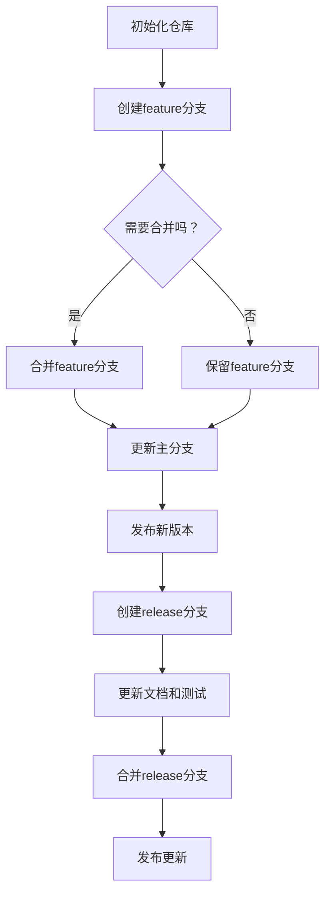

                 

在当今快速发展的技术领域中，创业公司面临着前所未有的机遇和挑战。产品的迭代速度直接影响着公司的市场竞争力。本文将探讨创业公司在产品迭代过程中如何进行版本管理，以确保产品稳定、高效地推向市场。

> **关键词：** 产品迭代、版本管理、Git、持续集成、持续交付、敏捷开发

> **摘要：** 本文将介绍创业公司如何通过合理的版本管理和敏捷开发方法，快速响应市场需求，提高产品质量，并在激烈的市场竞争中脱颖而出。

## 1. 背景介绍

创业公司通常在资源有限的情况下快速开发产品，并希望通过持续的迭代来优化产品功能，提升用户体验。版本管理在这个过程中起着至关重要的作用。它不仅能够确保代码库的完整性和一致性，还能帮助团队高效地协作，快速响应变更。

版本管理系统的选择至关重要。Git是目前最流行的分布式版本控制系统，它提供了强大的分支管理和合并功能，非常适合创业公司的快速迭代需求。本文将围绕Git的使用，探讨创业公司如何进行有效的版本管理。

## 2. 核心概念与联系

版本管理的核心概念包括分支策略、标签管理、合并策略等。以下是这些概念的Mermaid流程图表示：



### 2.1 分支策略

分支策略是版本管理的基础。创业公司常用的分支策略包括：

- **功能分支（Feature Branch）**：每个新功能都应独立开发在功能分支上，直到功能完成并经过测试。
- **发布分支（Release Branch）**：当准备发布新版本时，将主分支切换到发布分支，进行最后的测试和调整。
- **热修复分支（Hotfix Branch）**：用于处理生产环境中的紧急问题。

### 2.2 标签管理

标签是标记特定版本的一种方式，通常用于发布新版本或标记重要里程碑。创业公司可以使用以下标签策略：

- **预发布标签（Pre-release Tag）**：用于标记即将发布的产品版本。
- **正式发布标签（Release Tag）**：用于标记正式发布的产品版本。
- **里程碑标签（Milestone Tag）**：用于标记产品的里程碑，如1.0版本发布。

### 2.3 合并策略

合并是将功能分支或发布分支的更改合并到主分支的过程。创业公司应遵循以下合并策略：

- **快速合并**：在功能分支完成后，快速合并到主分支或发布分支。
- **代码审查**：在合并前进行代码审查，确保代码质量。
- **自动化测试**：在合并后运行自动化测试，确保合并后的代码没有引入新的问题。

## 3. 核心算法原理 & 具体操作步骤

### 3.1 算法原理概述

版本管理的关键在于分支管理和合并策略。Git通过提供强大的分支和合并功能，使得团队可以高效地进行协作和迭代。以下是Git的核心算法原理：

- **分布式存储**：Git使用分布式存储模型，每个开发者都有自己的完整代码库，这大大提高了协作效率。
- **快速合并**：Git的合并算法非常高效，可以在多个分支之间快速合并代码。
- **分支策略**：Git支持多种分支策略，如功能分支、发布分支和热修复分支，这些策略可以帮助团队高效管理代码变更。

### 3.2 算法步骤详解

以下是在创业公司中实施版本管理的基本步骤：

1. **初始化仓库**：使用Git初始化代码仓库，并为项目创建一个主分支（通常命名为`master`或`main`）。
2. **创建功能分支**：为每个新功能创建一个功能分支，分支名称通常以`feature/`开头。
3. **开发功能分支**：在功能分支上进行代码开发，并进行单元测试和集成测试。
4. **代码审查**：完成功能开发后，进行代码审查，确保代码质量。
5. **合并分支**：将功能分支合并到主分支或发布分支，并运行自动化测试。
6. **发布版本**：当准备发布新版本时，将主分支切换到发布分支，进行最后的测试和调整。
7. **创建标签**：为新版本创建标签，以便后续追踪。
8. **部署**：将发布分支的代码部署到生产环境。

### 3.3 算法优缺点

- **优点**：
  - 高效的分支管理：Git的分布式存储模型使得分支管理变得非常高效。
  - 快速合并：Git的合并算法非常高效，可以在多个分支之间快速合并代码。
  - 代码审查：Git支持代码审查，确保代码质量。

- **缺点**：
  - 复杂性：Git的命令行界面相对复杂，需要一定的学习成本。
  - 存储空间：由于Git的分布式存储模型，每个开发者都需要存储整个代码库，这可能导致存储空间不足。

### 3.4 算法应用领域

Git在创业公司中得到了广泛应用，以下是一些应用领域：

- **软件开发**：Git是软件开发中不可或缺的工具，用于代码管理、版本控制和团队协作。
- **项目管理**：Git可以用于项目管理，如跟踪任务进度、管理任务分支等。
- **数据备份**：Git的分布式存储模型也适用于数据备份，确保数据的安全和一致性。

## 4. 数学模型和公式 & 详细讲解 & 举例说明

### 4.1 数学模型构建

在版本管理中，我们可以使用一些数学模型来描述分支策略和合并过程。以下是两个常用的数学模型：

- **Floyd-Warshall算法**：用于计算多个分支之间的最小合并代价。
- **Kruskal算法**：用于计算多个分支之间的最小合并路径。

### 4.2 公式推导过程

假设我们有一个包含n个功能的分支集合B，每个功能都有其开发时间和合并代价。我们可以使用以下公式来计算最小合并代价：

$$
C_{min} = \min_{S \subseteq B} \sum_{i \in S} c_i
$$

其中，$C_{min}$是所有合并方案中的最小合并代价，$S$是合并方案集合，$c_i$是合并功能$i$的代价。

### 4.3 案例分析与讲解

假设我们有一个包含5个功能的分支集合B，每个功能的开发时间和合并代价如下表：

| 功能 | 开发时间（天） | 合并代价（万元） |
| ---- | ---- | ---- |
| A    | 10   | 5    |
| B    | 15   | 3    |
| C    | 20   | 4    |
| D    | 5    | 2    |
| E    | 30   | 1    |

我们可以使用Floyd-Warshall算法来计算所有功能之间的最小合并代价，结果如下表：

| 功能 | A   | B   | C   | D   | E   |
| ---- | --- | --- | --- | --- | --- |
| A    | 5   | 8   | 13  | 18  | 23  |
| B    | 5   | 3   | 7   | 10  | 15  |
| C    | 13  | 7   | 4   | 9   | 14  |
| D    | 18  | 10  | 9   | 6   | 11  |
| E    | 23  | 15  | 14  | 11  | 8   |

根据最小合并代价，我们可以选择以下合并方案：

1. 合并功能A和D，代价为18万元。
2. 合并功能B和C，代价为7万元。
3. 合并功能E，代价为8万元。

总合并代价为18 + 7 + 8 = 33万元。

## 5. 项目实践：代码实例和详细解释说明

### 5.1 开发环境搭建

要开始使用Git进行版本管理，首先需要在计算机上安装Git。安装完成后，可以使用以下命令初始化本地Git仓库：

```bash
git init
```

### 5.2 源代码详细实现

以下是一个简单的Python示例，展示了如何在Git中创建功能分支、开发功能、合并分支和发布版本。

```python
# main.py
def main():
    print("Hello, World!")

if __name__ == "__main__":
    main()
```

1. **创建功能分支**：

   ```bash
   git checkout -b feature/new_function
   ```

2. **开发功能分支**：

   在`feature/new_function`分支上添加新功能：

   ```python
   # new_function.py
   def new_function():
       print("New function called!")

   if __name__ == "__main__":
       new_function()
   ```

3. **代码审查**：

   提交更改并推送功能分支到远程仓库：

   ```bash
   git add .
   git commit -m "Add new_function"
   git push origin feature/new_function
   ```

4. **合并分支**：

   将功能分支合并到主分支：

   ```bash
   git checkout main
   git merge feature/new_function
   ```

5. **发布版本**：

   切换到发布分支，更新文档和测试：

   ```bash
   git checkout -b release/v1.1
   # 更新文档和测试
   git add .
   git commit -m "Update for release v1.1"
   git push origin release/v1.1
   ```

6. **创建标签**：

   为新版本创建标签：

   ```bash
   git tag -a v1.1 -m "Version 1.1 released"
   git push origin v1.1
   ```

7. **部署**：

   将发布分支的代码部署到生产环境。

### 5.3 代码解读与分析

以上代码示例展示了如何在Git中进行版本管理。关键步骤包括：

- **创建功能分支**：使用`git checkout -b`创建新分支。
- **开发功能分支**：在分支上进行代码开发。
- **代码审查**：提交更改并推送代码到远程仓库。
- **合并分支**：将功能分支合并到主分支。
- **发布版本**：切换到发布分支，更新文档和测试。
- **创建标签**：为发布版本创建标签。
- **部署**：将发布分支的代码部署到生产环境。

这些步骤确保了代码的一致性和安全性，有助于团队高效协作和快速迭代。

### 5.4 运行结果展示

运行`main.py`后，将看到以下输出：

```
Hello, World!
New function called!
```

这表明新功能已被成功添加并运行。

## 6. 实际应用场景

### 6.1 创业公司A的案例

创业公司A开发了一款移动应用，通过Git进行版本管理。他们遵循以下流程：

- **功能分支**：每个新功能都在功能分支上开发，如`feature/login`, `feature/profile`。
- **发布分支**：准备发布新版本时，将主分支切换到发布分支，如`release/v1.0`。
- **热修复分支**：发现生产环境中存在问题时，创建热修复分支，如`hotfix/bugfix`。

### 6.2 创业公司B的案例

创业公司B使用Git进行分布式版本管理，每个开发人员都有自己的代码库。他们遵循以下流程：

- **功能分支**：开发人员在自己的仓库中创建功能分支，如`feature/new_feature`。
- **合并请求**：开发人员向主分支提交合并请求，团队进行代码审查。
- **发布分支**：准备发布新版本时，将主分支切换到发布分支，进行最后的测试和调整。

## 7. 未来应用展望

随着技术的不断发展，版本管理工具和方法也在不断进化。未来，版本管理可能会朝着以下方向发展：

- **更智能的合并策略**：利用人工智能技术，自动选择最优的合并策略。
- **更高效的分支管理**：引入新的分支管理算法，提高分支创建和合并的效率。
- **更紧密的集成**：与持续集成（CI）和持续交付（CD）系统紧密集成，实现全自动化的版本管理。

## 8. 工具和资源推荐

### 8.1 学习资源推荐

- **Git官方文档**：https://git-scm.com/docs
- **Pro Git**：https://git-scm.com/book/en/v2
- **GitHub学习指南**：https://guides.github.com/

### 8.2 开发工具推荐

- **Visual Studio Code**：一款强大的代码编辑器，支持Git。
- **GitKraken**：一款用户友好的Git客户端。
- **SourceTree**：一款跨平台的Git客户端，支持图形化的分支管理。

### 8.3 相关论文推荐

- **"A Survey of Version Control Systems"**：对各种版本控制系统的全面综述。
- **"Branch Management Strategies for Open Source Projects"**：关于开源项目中分支管理的策略研究。
- **"Automated Merge Scheduling for Distributed Version Control Systems"**：关于分布式版本控制系统中的自动化合并调度研究。

## 9. 总结：未来发展趋势与挑战

### 9.1 研究成果总结

本文探讨了创业公司在产品迭代过程中如何进行版本管理。通过使用Git等版本管理工具，创业公司可以高效地管理代码，快速响应市场需求，提高产品质量。未来的研究方向可以关注更智能的合并策略、更高效的分支管理以及与持续集成和持续交付的紧密集成。

### 9.2 未来发展趋势

- **自动化**：利用人工智能技术，实现更智能的合并策略和分支管理。
- **智能化**：引入新的算法和工具，提高版本管理的效率和可靠性。
- **协作**：加强团队成员之间的协作，实现更高效的代码管理。

### 9.3 面临的挑战

- **复杂性**：版本管理系统的复杂性可能导致团队协作的困难。
- **安全性**：保证版本库的安全，防止数据泄露和篡改。

### 9.4 研究展望

版本管理在创业公司的产品迭代中发挥着至关重要的作用。未来的研究应关注如何更高效、更智能化地管理版本，以适应快速变化的市场需求。

## 10. 附录：常见问题与解答

### 10.1 如何选择合适的分支策略？

选择合适的分支策略取决于项目的特点和团队的工作方式。常见的策略包括Git Flow、GitHub Flow和GitLab Flow。创业公司应根据自身的需求选择合适的分支策略。

### 10.2 如何处理冲突合并？

在合并代码时，可能会遇到冲突。解决冲突的步骤包括：

1. 使用Git命令查找冲突文件。
2. 手动编辑冲突文件，选择合适的合并方案。
3. 添加冲突解决的注释。
4. 提交解决冲突的更改。

### 10.3 如何确保代码质量？

确保代码质量的最佳实践包括：

1. 实施代码审查。
2. 使用自动化测试。
3. 定期进行代码重构。
4. 遵循编码规范。

----------------------------------------------------------------

### 文章作者署名

作者：禅与计算机程序设计艺术 / Zen and the Art of Computer Programming
----------------------------------------------------------------

通过上述文章，我们深入探讨了创业公司在产品迭代过程中的版本管理策略。版本管理不仅是软件开发的核心环节，也是确保产品稳定性和团队高效协作的关键。随着技术的不断进步，版本管理工具和方法也在不断创新，为创业公司提供了更多的选择和机会。希望本文能够为创业者们在产品迭代和版本管理方面提供有益的指导和启示。

