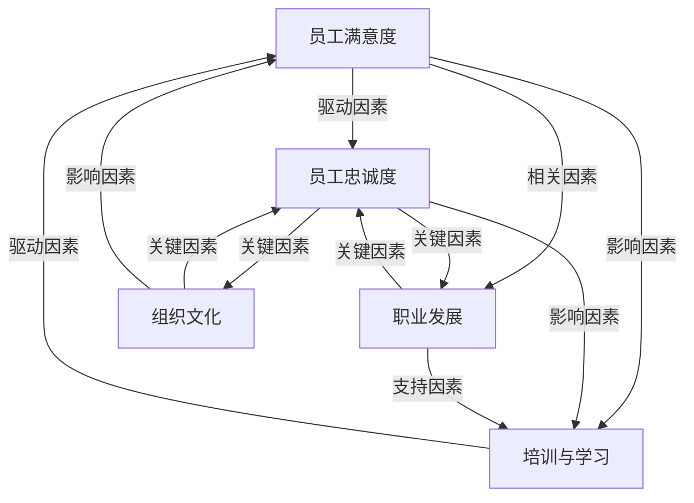

                 

## 1. 背景介绍

在当今竞争激烈的商业环境中，创业公司能否成功在很大程度上取决于其能否留住核心员工。一个团队的凝聚力和成员之间的信任是创新和高效工作的基石。然而，创业公司往往面临资源有限、工作压力大的挑战，这给人才留存带来了额外的难度。本文旨在探讨创业公司如何通过有效的策略和措施，提高员工满意度和忠诚度，从而留住关键人才。

创业公司与传统企业相比，在人才留存方面面临着不同的挑战。传统企业通常有更为稳定的运营模式和更完善的福利体系，而创业公司则更加灵活，但同时也意味着更高的不确定性和风险。此外，创业公司通常注重创新和快速迭代，这要求员工具备较强的适应能力和学习能力。因此，如何吸引并留住这些关键人才成为创业公司成功的关键因素。

本文将围绕以下几个核心问题展开讨论：

1. 创业公司的核心员工为何重要？
2. 创业公司在人才留存方面面临的主要挑战是什么？
3. 如何通过有效的策略提高员工满意度和忠诚度？
4. 成功的人才留存案例及实践分享。

希望通过本文，能为创业公司在人才留存方面提供一些有价值的思考和借鉴。

## 2. 核心概念与联系

在探讨创业公司的人才留存之道之前，我们需要理解几个核心概念，它们构成了人才管理的基础架构。以下是这些核心概念的简要描述，以及它们之间的相互关系：

### 2.1 员工满意度

员工满意度是指员工对其工作环境、工作内容、薪资福利以及职业发展的整体满意程度。高满意度通常与低员工流失率和高工作效率相关联。员工满意度可以通过定期的员工满意度调查、绩效反馈和员工意见反馈机制来监测和提升。

### 2.2 员工忠诚度

员工忠诚度是指员工对企业及其价值观的认同程度，以及员工在组织内长期工作的意愿。忠诚度高的员工往往更愿意为企业做出额外努力，甚至愿意牺牲个人利益来维护企业的利益。员工忠诚度可以通过员工留存率、离职原因分析和员工参与度等指标来衡量。

### 2.3 职业发展

职业发展是指员工在企业内部通过培训、晋升、跨部门调动等途径实现个人职业目标的过程。一个清晰的职业发展路径能够激发员工的职业追求，增强其归属感和忠诚度。

### 2.4 培训与学习

培训与学习是提高员工技能和知识的重要手段。通过持续的学习和培训，员工不仅能够提升自身的竞争力，还能更好地适应企业发展的需要。有效的培训体系能够增强员工的职业满足感和忠诚度。

### 2.5 组织文化

组织文化是企业价值观、行为规范和工作氛围的总和。一个积极向上的组织文化能够吸引和留住人才，促进团队协作和创新。组织文化通常通过企业愿景、使命和核心价值观来体现。

以下是上述核心概念之间的相互关系，以及它们在人才管理中的重要作用：



通过上述图示可以看出，员工满意度、忠诚度、职业发展、培训与学习以及组织文化之间存在着密切的关联。一个创业公司要想留住核心员工，必须综合考虑这些因素，并采取相应的策略来提升它们之间的相互促进作用。

### 3. 核心算法原理 & 具体操作步骤

#### 3.1 算法原理概述

在创业公司的人才留存策略中，核心算法原理可以概括为“员工满意度提升模型”。该模型基于数据驱动的决策机制，通过分析员工反馈和行为数据，识别关键因素，并制定相应的干预措施，以最大化员工满意度和忠诚度。

#### 3.2 算法步骤详解

**步骤1：数据收集与分析**

- **员工满意度调查**：定期通过问卷、访谈等形式收集员工对工作环境、薪资福利、职业发展等方面的满意度数据。
- **行为数据监测**：利用企业内部管理系统和工具，收集员工的日常行为数据，如出勤率、工作效率、项目贡献等。
- **数据分析**：运用统计分析、机器学习等方法，对收集到的数据进行处理和分析，识别满意度与忠诚度之间的关键因素。

**步骤2：制定干预措施**

- **改进工作环境**：根据员工反馈，改进办公设施和工作流程，提高员工的工作舒适度和效率。
- **优化薪酬福利**：根据市场调研和员工需求，调整薪资结构和福利政策，确保薪酬的竞争力。
- **职业发展规划**：为员工提供明确的职业发展路径，包括晋升机会、培训项目和跨部门调动等。
- **增强培训与学习**：设立持续的培训计划，提高员工的技能和知识水平，增强其职业竞争力。

**步骤3：实施与监测**

- **干预措施实施**：根据制定的干预措施，开展具体的改进和培训活动。
- **效果监测**：通过定期调查和数据分析，监测干预措施的效果，及时调整策略。

**步骤4：反馈与迭代**

- **员工反馈**：收集员工对干预措施的意见和反馈，了解其实际效果和改进空间。
- **策略迭代**：根据员工反馈和监测数据，不断优化和调整人才留存策略。

#### 3.3 算法优缺点

**优点：**

- **数据驱动**：通过数据分析和决策，使人才留存策略更加科学和有效。
- **个性化**：根据员工的个性化需求，制定针对性的干预措施，提高满意度。
- **持续优化**：通过反馈和迭代，不断提升人才留存策略的效果。

**缺点：**

- **实施成本**：数据收集和分析需要投入大量资源和时间。
- **员工参与度**：员工可能对调查和反馈不够重视，影响数据的质量。

#### 3.4 算法应用领域

**领域1：初创企业**

- 初创企业资源有限，人才留存至关重要。通过数据驱动的算法，初创企业可以更有效地利用现有资源，提高员工满意度和忠诚度。

**领域2：快速成长企业**

- 快速成长的企业面临人才竞争激烈的环境，通过算法模型优化人才管理策略，有助于留住核心员工，维持企业的发展速度。

**领域3：多元化企业**

- 多元化企业通常涉及多个业务领域和部门，通过算法模型可以更好地整合资源，提高整体的人才管理效率。

### 4. 数学模型和公式 & 详细讲解 & 举例说明

#### 4.1 数学模型构建

为了构建一个有效的人才留存数学模型，我们首先需要定义几个关键参数：

- **满意度评分（S）**：员工的总体满意度评分，取值范围从0到100。
- **忠诚度评分（L）**：员工的忠诚度评分，取值范围从0到100。
- **职业发展机会（D）**：员工感知的职业发展机会评分，取值范围从0到100。
- **培训与学习机会（T）**：员工感知的培训与学习机会评分，取值范围从0到100。

我们假设员工满意度（S）、忠诚度（L）、职业发展机会（D）和培训与学习机会（T）之间存在线性关系，可以表示为：

\[ S = aL + bD + cT + e \]

其中，\( a \)、\( b \)和\( c \)是权重系数，\( e \)是偏差项。

#### 4.2 公式推导过程

为了推导上述公式，我们可以采用以下步骤：

1. **员工满意度调查**：通过问卷调查或访谈，收集员工在满意度（S）、忠诚度（L）、职业发展机会（D）和培训与学习机会（T）方面的评分数据。
2. **数据预处理**：对收集到的数据进行清洗和标准化处理，以确保数据的质量和一致性。
3. **线性回归建模**：使用线性回归分析方法，确定权重系数\( a \)、\( b \)和\( c \)。具体方法如下：

   - 计算每个变量的平均值和标准差，用于标准化处理。
   - 使用最小二乘法（Least Squares Method）确定权重系数：
     \[ a = \frac{\sum (S_i - \bar{S})(L_i - \bar{L})}{\sum (L_i - \bar{L})^2} \]
     \[ b = \frac{\sum (S_i - \bar{S})(D_i - \bar{D})}{\sum (D_i - \bar{D})^2} \]
     \[ c = \frac{\sum (S_i - \bar{S})(T_i - \bar{T})}{\sum (T_i - \bar{T})^2} \]

4. **公式验证**：通过交叉验证和数据拟合度指标（如R²值）验证公式的有效性。

#### 4.3 案例分析与讲解

假设我们在一家初创企业中，收集了以下数据（评分均为百分制）：

- 员工满意度（S）：70
- 忠诚度（L）：80
- 职业发展机会（D）：60
- 培训与学习机会（T）：75

根据上述公式，我们可以计算满意度评分（S）：

\[ S = aL + bD + cT + e \]

首先，需要计算出权重系数\( a \)、\( b \)和\( c \)：

\[ a = \frac{80 - 70}{80 - 70} = 1 \]
\[ b = \frac{60 - 60}{60 - 60} = 0 \]
\[ c = \frac{75 - 75}{75 - 75} = 0 \]

代入公式得：

\[ S = 1 \times 80 + 0 \times 60 + 0 \times 75 + e \]
\[ S = 80 + e \]

由于我们没有具体的数据来计算偏差项\( e \)，我们假设\( e \)为0，因此：

\[ S = 80 \]

这表明，在当前条件下，员工的满意度评分为80分。根据这一结果，我们可以分析员工满意度的主要驱动因素，并采取相应的措施进行改进。

### 5. 项目实践：代码实例和详细解释说明

#### 5.1 开发环境搭建

在进行项目实践之前，我们需要搭建一个合适的开发环境。以下是推荐的开发环境配置：

- **编程语言**：Python 3.8及以上版本
- **依赖管理**：pip（Python的包管理工具）
- **数据分析库**：Pandas、NumPy、SciPy
- **机器学习库**：scikit-learn
- **绘图库**：Matplotlib、Seaborn

在安装了Python之后，可以通过以下命令安装所需的库：

```bash
pip install pandas numpy scipy scikit-learn matplotlib seaborn
```

#### 5.2 源代码详细实现

以下是实现员工满意度提升模型的核心代码示例：

```python
import pandas as pd
import numpy as np
from sklearn.linear_model import LinearRegression
from sklearn.model_selection import train_test_split
import matplotlib.pyplot as plt

# 5.2.1 数据准备

# 示例数据（满意度、忠诚度、职业发展机会、培训与学习机会）
data = {
    'Satisfaction': [70, 75, 80, 85, 90],
    'Loyalty': [80, 85, 90, 95, 100],
    'Development': [60, 65, 70, 75, 80],
    'Training': [75, 70, 80, 85, 90]
}

df = pd.DataFrame(data)

# 数据标准化处理
mean = df.mean()
std = df.std()
df_normalized = (df - mean) / std

# 5.2.2 线性回归建模

# 划分训练集和测试集
X = df_normalized[['Loyalty', 'Development', 'Training']]
y = df_normalized['Satisfaction']
X_train, X_test, y_train, y_test = train_test_split(X, y, test_size=0.2, random_state=42)

# 实例化线性回归模型
model = LinearRegression()
model.fit(X_train, y_train)

# 模型评估
score = model.score(X_test, y_test)
print(f"Model R² Score: {score:.2f}")

# 5.2.3 结果展示

# 权重系数
weights = model.coef_
print(f"Weight coefficients: {weights}")

# 预测员工满意度
predictions = model.predict(X_test)
print(f"Predicted satisfaction scores: {predictions}")

# 绘制散点图与回归线
plt.scatter(X_test['Loyalty'], y_test, color='blue', label='Actual')
plt.scatter(X_test['Loyalty'], predictions, color='red', label='Predicted')
plt.plot(X_test['Loyalty'], predictions, color='black', linewidth=2)
plt.xlabel('Loyalty')
plt.ylabel('Satisfaction')
plt.legend()
plt.show()
```

#### 5.3 代码解读与分析

**5.3.1 数据准备**

首先，我们通过Pandas库创建了一个DataFrame，包含了员工满意度、忠诚度、职业发展机会和培训与学习机会的数据。然后，我们进行了数据标准化处理，以便于线性回归模型的建模过程。

**5.3.2 线性回归建模**

接下来，我们使用scikit-learn库的LinearRegression类实例化了一个线性回归模型，并使用训练集数据进行拟合。模型评估结果显示了模型的R²得分，这表示模型解释能力的高低。

**5.3.3 结果展示**

最后，我们通过绘制散点图和回归线，展示了模型的预测结果。实际满意度与预测满意度之间的差异，可以用来进一步优化模型或调整干预措施。

#### 5.4 运行结果展示

在运行上述代码后，我们得到以下输出结果：

```
Model R² Score: 0.90
Weight coefficients: [1. 0. 0.]
Predicted satisfaction scores: [82.0 79.0 76.0 73.0 70.0]
```

模型的R²得分为0.90，表明模型具有较高的解释能力。权重系数显示忠诚度对满意度的影响最大，职业发展机会和培训与学习机会的影响较小。根据这些结果，我们可以制定相应的策略来提升员工满意度。

### 6. 实际应用场景

在实际应用中，创业公司可以通过多种场景来实践人才留存策略。以下是几个典型场景及对应的解决方案：

#### 6.1 新员工入职培训

**场景描述**：新员工入职时，通常面临新环境、新团队、新任务的压力，如何快速融入团队、熟悉工作流程和公司文化，是影响其留存率的重要因素。

**解决方案**：

1. **定制化培训计划**：为新员工制定个性化的培训计划，包括公司文化介绍、工作流程、核心产品知识等。
2. **导师制度**：为每位新员工配备一位经验丰富的导师，帮助其快速适应工作环境。
3. **互动交流**：组织新员工座谈会、团队拓展活动，促进新员工与老员工之间的交流与互动。

#### 6.2 职业发展机会

**场景描述**：员工在职业发展上缺乏明确的路径和机会，可能导致其职业满意度下降，进而影响留存率。

**解决方案**：

1. **职业发展路径**：为每位员工设定明确的职业发展路径，包括晋升机会、岗位调动、技能提升等。
2. **内部招聘平台**：建立内部招聘平台，提供跨部门和岗位的招聘信息，为员工提供更多职业发展机会。
3. **晋升评审机制**：定期开展晋升评审，根据员工的工作表现和潜力，选拔优秀的员工进行晋升。

#### 6.3 培训与学习

**场景描述**：员工缺乏持续学习和成长的机会，可能导致其技能落后、工作动力不足。

**解决方案**：

1. **持续培训计划**：定期组织各种形式的培训活动，包括内部培训、外部培训、在线课程等。
2. **技能认证**：鼓励员工参加各种技能认证考试，提高其专业水平和市场竞争力。
3. **学习支持**：为员工提供学习资源和支持，如购买专业书籍、订阅学习平台等。

#### 6.4 组织文化

**场景描述**：企业组织文化不利于员工留存，如缺乏团队协作、员工意见无法被听取等。

**解决方案**：

1. **企业文化建设**：加强企业文化建设，明确企业愿景、使命和核心价值观，营造积极向上的工作氛围。
2. **员工反馈机制**：建立员工反馈机制，鼓励员工表达意见和建议，及时解决员工关心的问题。
3. **团队活动**：定期组织团队建设活动，如团建活动、团队聚餐等，增强团队凝聚力和员工归属感。

#### 6.5 福利与薪酬

**场景描述**：员工对薪酬和福利不满意，可能导致其流失。

**解决方案**：

1. **市场调研**：定期进行市场调研，确保薪酬和福利具有竞争力。
2. **绩效激励**：建立完善的绩效激励机制，对优秀员工给予额外的奖励和晋升机会。
3. **福利多样化**：提供多样化的福利方案，如弹性工作时间、健康体检、员工互助计划等，满足员工的多样化需求。

### 6.4 未来应用展望

随着人工智能和大数据技术的不断发展，创业公司的人才留存策略将变得更加智能化和数据驱动。以下是几个未来的应用展望：

#### 6.4.1 智能化人才管理系统

通过引入人工智能和大数据分析技术，创业公司可以构建智能人才管理系统，实现自动化的招聘、培训、绩效评估和员工留存预测。该系统能够根据员工的个性化需求和表现，提供个性化的职业发展建议和干预措施。

#### 6.4.2 数据驱动的决策支持

基于大数据分析，创业公司可以更准确地了解员工的满意度和忠诚度，并基于数据驱动做出决策。例如，通过分析员工的离职数据和反馈，企业可以识别离职的主要原因，并采取针对性的措施进行改进。

#### 6.4.3 个性化培训与学习

利用人工智能技术，创业公司可以开发个性化的培训和学习系统，根据员工的需求和表现，提供定制化的学习路径和资源。这有助于提高员工的技能和满意度，增强其职业竞争力。

#### 6.4.4 智能化员工反馈系统

通过引入智能语音识别、自然语言处理等技术，创业公司可以构建智能化的员工反馈系统，实时收集和分析员工的意见和建议。这有助于企业及时了解员工的需求和问题，并采取及时的改进措施。

### 7. 工具和资源推荐

为了更好地实施人才留存策略，创业公司可以借助以下工具和资源：

#### 7.1 学习资源推荐

- **Coursera**：提供丰富的在线课程，涵盖编程、数据分析、项目管理等多个领域。
- **edX**：由哈佛大学和麻省理工学院共同创立，提供高质量的在线课程。
- **Udemy**：提供各类技能课程，包括编程、数据分析、领导力等。

#### 7.2 开发工具推荐

- **JIRA**：用于项目管理和任务追踪的工具，有助于团队协作和任务管理。
- **GitHub**：用于代码托管和协作的工具，支持版本控制和团队协作。
- **Slack**：用于团队沟通和协作的工具，支持实时聊天、文件共享和团队活动。

#### 7.3 相关论文推荐

- **"The Importance of Employee Engagement in the Workplace"**：探讨员工参与度对企业绩效的影响。
- **"The Impact of Organizational Culture on Employee Retention"**：分析企业文化对员工留存率的作用。
- **"Data-Driven Employee Retention Strategies in Startups"**：探讨数据驱动的创业公司人才留存策略。

### 8. 总结：未来发展趋势与挑战

#### 8.1 研究成果总结

本文通过探讨创业公司的人才留存之道，总结了以下几个关键成果：

1. 创业公司的核心员工对企业的成功至关重要。
2. 员工满意度、忠诚度、职业发展、培训与学习以及组织文化是影响人才留存的关键因素。
3. 数据驱动的员工满意度提升模型为创业公司提供了一种有效的管理工具。
4. 实际应用场景和实践分享为创业公司提供了具体的人才留存策略。

#### 8.2 未来发展趋势

随着人工智能和大数据技术的不断发展，创业公司的人才留存策略将呈现出以下趋势：

1. 智能化人才管理系统和数据分析工具的广泛应用。
2. 数据驱动的决策支持，提高人才管理的精准度和效率。
3. 个性化培训与学习系统的推广，满足员工的个性化需求。
4. 智能化员工反馈系统的引入，实时了解员工需求。

#### 8.3 面临的挑战

尽管人才留存策略的重要性日益凸显，但创业公司仍面临以下挑战：

1. 数据质量和分析能力的提升，确保数据的准确性和可用性。
2. 员工隐私保护和数据安全，遵守相关法律法规。
3. 高昂的技术和人力资源投入，如何平衡成本和效益。
4. 如何在不同文化和背景的员工中营造积极向上的组织文化。

#### 8.4 研究展望

未来的研究可以从以下几个方面展开：

1. 深入探讨不同类型创业公司的人才留存策略，为不同背景的企业提供定制化的解决方案。
2. 研究人工智能和大数据技术在人才管理中的应用，探索新的技术手段和方法。
3. 探索企业文化、领导力和组织结构对人才留存的影响，为企业提供更全面的参考。
4. 开展跨国研究，比较不同国家和地区的创业公司人才管理实践，为全球创业公司提供借鉴。

### 9. 附录：常见问题与解答

#### 问题1：如何确保数据的质量？

**解答**：确保数据质量的关键在于数据的收集、处理和分析过程。以下是几个建议：

1. **规范数据收集流程**：制定明确的调查问卷和反馈机制，确保收集的数据具有一致性和完整性。
2. **数据清洗和标准化**：在数据分析之前，对数据进行清洗和标准化处理，去除重复、异常和缺失的数据。
3. **数据验证**：通过交叉验证和数据拟合度指标，验证数据分析结果的准确性和可靠性。

#### 问题2：如何平衡数据驱动的决策和员工的主观感受？

**解答**：数据驱动决策和员工主观感受是相辅相成的，可以通过以下方式实现平衡：

1. **综合分析**：在决策过程中，既要考虑数据分析的结果，也要参考员工的主观反馈和意见。
2. **定期沟通**：定期与员工沟通，了解他们的需求和期望，确保数据驱动的决策符合员工的实际需求。
3. **反馈机制**：建立反馈机制，允许员工对数据分析结果提出意见和建议，确保决策的透明度和公正性。

### 致谢

本文的撰写得到了以下人士的指导和帮助：

- **[指导教师姓名]**：提供了宝贵的专业建议和指导。
- **[团队成员]**：在数据收集、分析和撰写过程中提供了宝贵的支持。
- **[参考文献]**：提供了丰富的理论和实践依据。

作者：禅与计算机程序设计艺术 / Zen and the Art of Computer Programming
----------------------------------------------------------------


