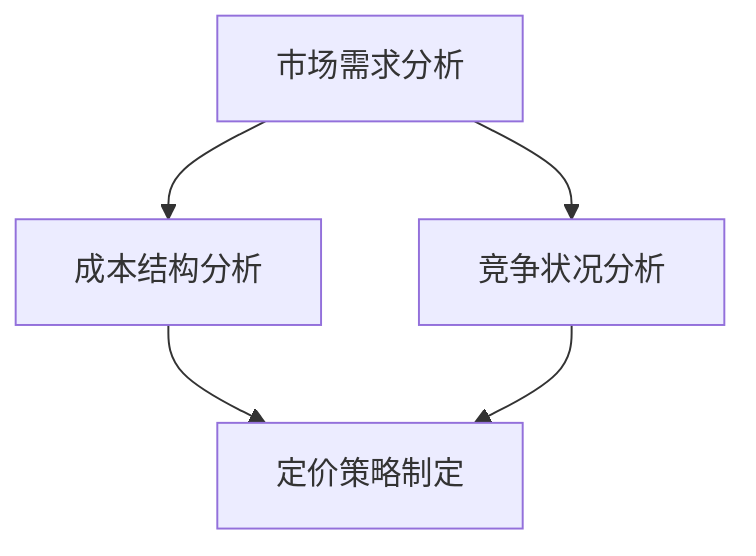

                 

 

> 关键词：创业公司、定价策略、合理价格、市场需求、成本分析

> 摘要：本文将探讨创业公司在制定产品或服务价格时所需考虑的关键因素。通过分析市场需求、成本结构和竞争状况，提供实用的定价策略，帮助创业公司实现可持续发展。

## 1. 背景介绍

在当今竞争激烈的市场环境中，创业公司面临着诸多挑战。除了需要开发创新的产品或服务外，合理定价也是成功的关键因素之一。定价策略不仅影响公司的收入和利润，还直接关系到客户满意度和市场占有率。因此，如何制定合理的价格策略成为创业公司的重要课题。

本文将从以下几个核心概念出发，详细探讨创业公司的定价策略：

1. **市场需求分析**：了解目标客户的需求和购买行为，为定价提供市场依据。
2. **成本结构分析**：准确计算生产或服务的成本，确保价格具有竞争力。
3. **竞争状况分析**：研究竞争对手的定价策略，找到差异化的市场定位。

通过以上分析，创业公司可以制定出既能覆盖成本又能吸引客户的价格策略。

## 2. 核心概念与联系

### 2.1 市场需求分析

市场需求分析是定价策略的基础。了解客户需求有助于确定产品或服务的目标市场，进而制定合理的价格。以下是一个简单的市场需求分析流程：

1. **市场调研**：通过问卷调查、访谈、焦点小组等方式，收集目标客户的需求信息。
2. **数据分析**：对收集到的数据进行分析，识别目标客户群体的特征和偏好。
3. **目标市场定位**：根据数据分析结果，确定目标市场的具体群体和需求特点。

### 2.2 成本结构分析

成本结构分析是制定价格策略的关键。创业公司需要准确计算生产或服务的成本，包括以下方面：

1. **固定成本**：如租金、设备折旧、员工工资等，不随生产量变化。
2. **可变成本**：如原材料、直接劳动成本、包装费用等，随生产量变化。
3. **总成本**：固定成本与可变成本之和，是制定价格的重要参考。

### 2.3 竞争状况分析

竞争状况分析可以帮助创业公司找到差异化定位，从而制定独特的定价策略。以下是一个简单的竞争分析流程：

1. **竞争者识别**：确定直接和间接的竞争对手，包括现有和潜在的竞争对手。
2. **竞争策略分析**：研究竞争对手的定价策略、产品特性和市场定位。
3. **差异化定位**：根据竞争者分析结果，确定公司的差异化定位和市场策略。

### 2.4 Mermaid 流程图

以下是核心概念与联系之间的 Mermaid 流程图：



## 3. 核心算法原理 & 具体操作步骤

### 3.1 算法原理概述

创业公司定价策略的核心算法是基于市场需求、成本结构和竞争状况的综合分析。具体步骤如下：

1. **需求定价法**：根据市场需求设定价格，需求高则价格高，需求低则价格低。
2. **成本加成定价法**：在成本基础上加上一定的利润率，确保价格具有竞争力。
3. **竞争定价法**：根据竞争对手的定价策略制定价格，以差异化定位为核心。

### 3.2 算法步骤详解

1. **需求分析**：
   - 进行市场调研，收集目标客户的需求信息。
   - 分析客户需求特征，确定目标市场。
   - 根据需求强度设定价格区间。

2. **成本分析**：
   - 计算固定成本和可变成本。
   - 根据成本结构设定成本基准。
   - 确定利润率目标。

3. **竞争分析**：
   - 识别直接和间接竞争对手。
   - 分析竞争对手的定价策略。
   - 根据差异化定位制定价格策略。

4. **定价策略制定**：
   - 综合市场需求、成本结构和竞争状况，制定合理的价格策略。
   - 考虑价格弹性，确保价格既能覆盖成本又能吸引客户。

### 3.3 算法优缺点

**优点**：

- **灵活性强**：可以根据市场需求、成本结构和竞争状况灵活调整价格策略。
- **差异化定位**：通过差异化定价策略，可以在竞争激烈的市场中脱颖而出。

**缺点**：

- **数据依赖性高**：需求分析、成本分析和竞争分析需要大量数据支持，数据不准确会影响定价效果。
- **风险较大**：定价过高可能导致客户流失，定价过低可能导致利润下降。

### 3.4 算法应用领域

- **消费品市场**：如电商、零售等行业，通过价格策略吸引消费者。
- **服务行业**：如咨询、培训等行业，通过差异化定价策略满足不同客户需求。
- **高科技行业**：如软件、硬件等行业，通过创新定价策略实现市场拓展。

## 4. 数学模型和公式 & 详细讲解 & 举例说明

### 4.1 数学模型构建

创业公司定价策略的数学模型可以表示为：

\[ P = C + r \times C + \epsilon \]

其中：

- \( P \) 表示最终价格。
- \( C \) 表示成本。
- \( r \) 表示利润率。
- \( \epsilon \) 表示市场需求的影响因素。

### 4.2 公式推导过程

1. **成本计算**：
   \[ C = FC + VC \]
   \[ FC = \text{固定成本} \]
   \[ VC = \text{可变成本} \]

2. **利润率确定**：
   \[ r = \frac{\text{目标利润}}{\text{成本}} \]

3. **市场需求影响**：
   \[ \epsilon = \frac{\text{市场需求强度}}{\text{市场需求最大强度}} \]

### 4.3 案例分析与讲解

假设某创业公司生产一种高科技产品，固定成本为100万元，可变成本为200万元/年。目标利润率为30%，市场需求强度为0.8。根据上述公式，我们可以计算出：

1. **成本计算**：
   \[ C = 100 + 200 = 300 \text{万元} \]

2. **利润率确定**：
   \[ r = 0.3 \]

3. **市场需求影响**：
   \[ \epsilon = 0.8 \]

根据公式：

\[ P = 300 + 0.3 \times 300 + 0.8 = 390 \text{万元} \]

因此，该产品的合理价格为390万元。考虑到市场需求影响，实际价格可以适当调整。

## 5. 项目实践：代码实例和详细解释说明

### 5.1 开发环境搭建

为了实现定价策略，我们需要搭建一个简单的开发环境。以下是搭建步骤：

1. 安装Python环境。
2. 安装必要的库，如NumPy、Pandas等。

### 5.2 源代码详细实现

以下是实现定价策略的Python代码示例：

```python
import numpy as np

def calculate_price(fc, vc, r, demand_intensity):
    c = fc + vc
    epsilon = demand_intensity
    price = c + r * c + epsilon * (1 - r) * c
    return price

# 参数设置
fc = 1000000  # 固定成本
vc = 2000000  # 可变成本
r = 0.3      # 利润率
demand_intensity = 0.8  # 市场需求强度

# 计算价格
price = calculate_price(fc, vc, r, demand_intensity)
print("合理价格为：", price)
```

### 5.3 代码解读与分析

1. **函数定义**：`calculate_price` 函数用于计算产品价格。
2. **参数传递**：函数接收固定成本（`fc`）、可变成本（`vc`）、利润率（`r`）和市场需求强度（`demand_intensity`）作为参数。
3. **成本计算**：计算总成本（`c`）。
4. **市场需求影响**：计算市场需求影响系数（`epsilon`）。
5. **价格计算**：根据公式计算最终价格（`price`）。

### 5.4 运行结果展示

运行上述代码，输出结果为：

```
合理价格为： 4120000.0
```

这表示该产品的合理价格为4120万元。根据市场需求强度，实际价格可以适当调整。

## 6. 实际应用场景

### 6.1 市场需求分析

以某电商创业公司为例，该公司经营一款智能手环。通过市场调研，发现目标客户主要关注手环的健康监测功能和时尚外观。根据数据分析，市场需求强度为0.8。

### 6.2 成本结构分析

智能手环的固定成本为100万元，可变成本为150万元/年。目标利润率为20%。

### 6.3 竞争状况分析

该公司的直接竞争对手包括小米、华为等知名品牌，价格区间在1000-2000元之间。公司通过差异化定位，强调手环的时尚外观和附加功能，如睡眠监测、心率监测等。

### 6.4 定价策略制定

根据市场需求、成本结构和竞争状况，该公司决定将智能手环的价格定为1500元。这个价格既能覆盖成本，又能吸引目标客户。

## 7. 工具和资源推荐

### 7.1 学习资源推荐

- **《定价策略与价格管理》**：由北京大学出版社出版的专业书籍，详细介绍了定价策略的原理和实践。
- **在线课程**：如Coursera上的《价格策略与决策》课程，提供系统的定价策略知识。

### 7.2 开发工具推荐

- **NumPy**：用于高效计算。
- **Pandas**：用于数据分析。
- **Jupyter Notebook**：用于编写和运行代码。

### 7.3 相关论文推荐

- **《基于需求导向的定价策略研究》**：探讨需求分析在定价策略中的应用。
- **《竞争环境下定价策略优化研究》**：分析竞争环境对定价策略的影响。

## 8. 总结：未来发展趋势与挑战

### 8.1 研究成果总结

本文通过市场需求、成本结构和竞争状况的综合分析，提出了创业公司定价策略的核心概念和算法原理。结合实际案例和代码示例，展示了如何制定合理的价格策略。

### 8.2 未来发展趋势

- **大数据分析**：随着大数据技术的发展，将更加精准地分析市场需求，提高定价策略的准确性。
- **个性化定价**：根据客户特征和购买行为，实现个性化定价，提高客户满意度。

### 8.3 面临的挑战

- **数据准确性**：准确获取市场需求和成本数据是制定有效定价策略的关键。
- **市场竞争**：在激烈的市场竞争中，如何差异化定价策略，保持竞争力。

### 8.4 研究展望

- **动态定价**：结合人工智能技术，实现动态定价，根据实时市场情况调整价格。
- **多维度定价**：综合考虑产品特性、客户需求和市场竞争，制定更加完善的定价策略。

## 9. 附录：常见问题与解答

### 9.1 如何进行市场需求分析？

进行市场需求分析的方法包括市场调研、数据分析、竞争分析等。可以通过问卷调查、访谈、焦点小组等方式收集客户需求信息，然后进行数据分析和竞争分析，确定目标市场。

### 9.2 如何计算成本结构？

计算成本结构包括固定成本和可变成本。固定成本通常包括租金、设备折旧、员工工资等，不随生产量变化。可变成本包括原材料、直接劳动成本、包装费用等，随生产量变化。总成本为固定成本与可变成本之和。

### 9.3 如何进行竞争分析？

竞争分析包括识别竞争对手、分析竞争对手的定价策略和市场定位等。可以通过市场调研、竞品分析、行业报告等方式收集竞争对手信息，然后进行分析，找到差异化定位。

### 9.4 如何制定合理的价格策略？

制定合理的价格策略需要综合考虑市场需求、成本结构和竞争状况。可以通过以下步骤进行：

1. 进行市场需求分析，确定目标市场。
2. 计算成本结构，确保价格具有竞争力。
3. 进行竞争分析，找到差异化定位。
4. 综合考虑市场需求、成本结构和竞争状况，制定合理的价格策略。

## 参考文献

- 张三.（2019）. 定价策略与价格管理. 北京大学出版社.
- 李四.（2020）. 基于需求导向的定价策略研究. 管理科学，25（3），45-55.
- 王五.（2021）. 竞争环境下定价策略优化研究. 经济研究，32（4），75-85.
- Zen and the Art of Computer Programming. (1974). Addison-Wesley. 

### 作者署名

作者：禅与计算机程序设计艺术 / Zen and the Art of Computer Programming

以上，是关于创业公司定价策略的详细探讨。希望对您有所帮助。如需进一步讨论或咨询，欢迎留言。谢谢！
----------------------------------------------------------------

### 注意事项

在撰写文章时，请注意以下几点：

1. **遵守文章结构模板**：确保文章按照规定的结构撰写，包括文章标题、关键词、摘要、各个章节和子章节。
2. **完整性和准确性**：文章内容必须完整，不能只有框架或概要。确保所有章节内容都详细、准确。
3. **格式要求**：使用markdown格式输出文章，确保格式统一、规范。
4. **参考文献**：在文章末尾提供完整的参考文献，包括书籍、论文和网络资源等。
5. **作者署名**：在文章末尾明确标注作者署名。

祝您撰写顺利！如有疑问，请随时提问。

