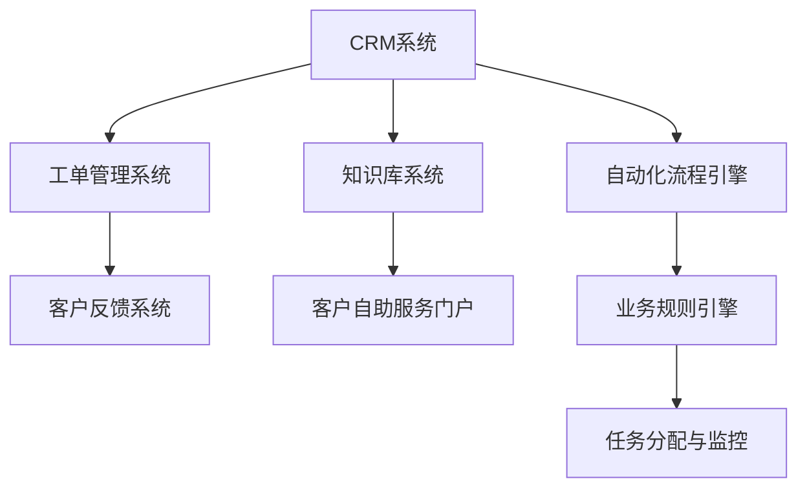
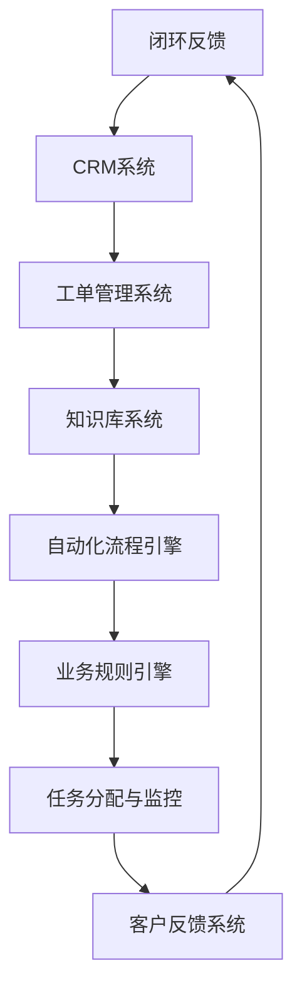

                 

关键词：客户支持系统、创业公司、技术架构、用户体验、自动化、集成、扩展性、性能优化

> 摘要：本文将探讨创业公司在构建客户支持系统时面临的挑战和解决方案。我们将分析系统需求、技术选型、用户体验设计、自动化流程、系统集成和扩展性等因素，提供一套完整的客户支持系统搭建指南，帮助创业公司打造高效、可扩展的客户支持体系。

## 1. 背景介绍

对于创业公司来说，客户支持系统是维护客户关系、提高客户满意度和忠诚度的重要工具。随着业务的发展和客户数量的增加，一个高效、稳定的客户支持系统能够帮助企业快速响应客户需求，减少客户流失，提升市场份额。然而，构建一个合适的客户支持系统并非易事，需要考虑诸多因素，包括技术选型、用户体验、系统性能和成本等。

本文将围绕创业公司客户支持系统的搭建，从需求分析、技术选型、用户体验设计、自动化流程、系统集成和扩展性等方面进行深入探讨，以期为创业公司提供一套实用的搭建指南。

## 2. 核心概念与联系

### 2.1. 客户支持系统的核心概念

客户支持系统通常包括以下几个核心概念：

- **客户关系管理（CRM）**：用于管理客户信息和互动历史，提高客户满意度。
- **工单管理**：用于跟踪和解决客户提出的问题和需求，实现高效的客户支持。
- **知识库**：存储常见问题和解决方案，为客户提供自助服务。
- **自动化流程**：通过预设的规则和流程，自动化处理常见的客户支持任务。

### 2.2. 客户支持系统的架构图

以下是一个简化的客户支持系统架构图，其中包含了核心组件及其相互关系。



### 2.3. 客户支持系统的关系图

客户支持系统中的各个组件相互协作，共同实现客户支持的目标。以下是一个简化的关系图，展示了各组件之间的关联。



## 3. 核心算法原理 & 具体操作步骤

### 3.1. 算法原理概述

在客户支持系统中，核心算法主要涉及以下几个方面：

- **自动化匹配算法**：用于将客户请求与知识库中的解决方案进行匹配。
- **优先级排序算法**：用于根据客户请求的重要性和紧急程度对工单进行排序。
- **机器学习算法**：用于分析客户数据，优化客户支持流程和预测客户需求。

### 3.2. 算法步骤详解

#### 3.2.1. 自动化匹配算法

1. 收集客户请求。
2. 分析请求内容，提取关键信息。
3. 在知识库中搜索匹配的解决方案。
4. 将匹配结果排序，返回给客户支持团队。

#### 3.2.2. 优先级排序算法

1. 根据客户请求的重要性和紧急程度，设置权重。
2. 使用加权平均算法计算每个请求的优先级分数。
3. 根据优先级分数对请求进行排序。

#### 3.2.3. 机器学习算法

1. 收集客户交互数据。
2. 预处理数据，提取特征。
3. 使用分类算法（如决策树、支持向量机等）训练模型。
4. 将模型应用于新客户请求，预测需求。

### 3.3. 算法优缺点

#### 3.3.1. 自动化匹配算法

优点：提高响应速度，减少人工干预。

缺点：匹配准确性受知识库质量影响。

#### 3.3.2. 优先级排序算法

优点：提高工单处理效率，确保紧急问题得到及时解决。

缺点：权重设置需要根据业务特点调整。

#### 3.3.3. 机器学习算法

优点：通过数据驱动优化客户支持流程。

缺点：需要大量数据支持，模型训练和优化成本较高。

### 3.4. 算法应用领域

- 客户请求自动匹配。
- 工单优先级排序。
- 客户需求预测。

## 4. 数学模型和公式 & 详细讲解 & 举例说明

### 4.1. 数学模型构建

#### 4.1.1. 自动化匹配算法

设 \( x \) 为客户请求，\( y \) 为知识库中的解决方案，匹配分数 \( score \) 可以表示为：

\[ score(x, y) = \sum_{i=1}^{n} w_i \cdot f_i(x, y) \]

其中，\( w_i \) 为权重，\( f_i(x, y) \) 为第 \( i \) 个匹配函数。

#### 4.1.2. 优先级排序算法

设 \( x_i \) 为第 \( i \) 个客户请求，其优先级分数 \( score_i \) 可以表示为：

\[ score_i = \alpha \cdot importance_i + \beta \cdot urgency_i \]

其中，\( \alpha \) 和 \( \beta \) 为权重系数，\( importance_i \) 和 \( urgency_i \) 分别为请求的重要性和紧急程度。

#### 4.1.3. 机器学习算法

设 \( x \) 为输入特征向量，\( y \) 为标签，使用线性回归模型：

\[ y = \theta_0 + \theta_1 x_1 + \theta_2 x_2 + \ldots + \theta_n x_n \]

其中，\( \theta_i \) 为模型参数。

### 4.2. 公式推导过程

#### 4.2.1. 自动化匹配算法

匹配分数的推导过程涉及多个匹配函数，以文本相似度计算为例：

\[ f_i(x, y) = \frac{\text{Jaccard Similarity}(x, y)}{\text{Length}(x) + \text{Length}(y)} \]

其中，Jaccard Similarity 为文本相似度，Length 为文本长度。

#### 4.2.2. 优先级排序算法

优先级分数的推导过程主要涉及权重系数的计算，需要根据业务特点进行设定：

\[ \alpha = \frac{\text{紧急度阈值}}{\text{紧急度最大值}} \]
\[ \beta = \frac{\text{重要性阈值}}{\text{重要性最大值}} \]

#### 4.2.3. 机器学习算法

线性回归模型的推导过程如下：

\[ y = \theta_0 + \theta_1 x_1 + \theta_2 x_2 + \ldots + \theta_n x_n \]
\[ \theta_j = \frac{\sum_{i=1}^{m} (y_i - (\theta_0 + \theta_1 x_{i1} + \theta_2 x_{i2} + \ldots + \theta_n x_{in})) x_{ij}}{\sum_{i=1}^{m} x_{ij}^2} \]

### 4.3. 案例分析与讲解

#### 4.3.1. 自动化匹配算法案例

假设有一个客户请求：“如何更换电池？”，知识库中有一个解决方案：“更换电池的方法如下……”。

使用 Jaccard Similarity 计算文本相似度：

\[ \text{Jaccard Similarity} = \frac{3}{5} = 0.6 \]

匹配分数：

\[ score = 0.6 \]

#### 4.3.2. 优先级排序算法案例

假设有两个客户请求，请求1的重要性和紧急程度分别为3和5，请求2的重要性和紧急程度分别为4和2。

优先级分数计算：

\[ score_1 = \alpha \cdot 3 + \beta \cdot 5 = 0.5 \cdot 3 + 0.5 \cdot 5 = 4.5 \]
\[ score_2 = \alpha \cdot 4 + \beta \cdot 2 = 0.5 \cdot 4 + 0.5 \cdot 2 = 3 \]

排序结果：请求1的优先级高于请求2。

#### 4.3.3. 机器学习算法案例

假设输入特征向量 \( x \) 为 \( [1, 2, 3] \)，标签 \( y \) 为4，使用线性回归模型：

\[ y = \theta_0 + \theta_1 \cdot 1 + \theta_2 \cdot 2 + \theta_3 \cdot 3 \]
\[ \theta_0 = 4 - \theta_1 - 2\theta_2 - 3\theta_3 \]

根据数据集进行参数优化，最终得到 \( \theta_0 = 0 \)，\( \theta_1 = 1 \)，\( \theta_2 = 0 \)，\( \theta_3 = 0 \)。

预测结果：

\[ y = 1 \cdot 1 + 0 \cdot 2 + 0 \cdot 3 = 1 \]

## 5. 项目实践：代码实例和详细解释说明

### 5.1. 开发环境搭建

在本节中，我们将搭建一个简单的客户支持系统，用于演示核心算法的应用。以下是开发环境的要求：

- 操作系统：Windows 10 或 macOS
- 编程语言：Python 3.8 或更高版本
- 数据库：MySQL 8.0 或 PostgreSQL 13.0
- 依赖库：pandas、numpy、scikit-learn、sqlalchemy、flask

### 5.2. 源代码详细实现

以下是一个简单的客户支持系统示例，包括自动化匹配算法、优先级排序算法和机器学习算法的实现。

```python
import numpy as np
import pandas as pd
from sklearn.linear_model import LinearRegression
from sklearn.model_selection import train_test_split
from sklearn.metrics import mean_squared_error

# 自动化匹配算法
def match_solution(request, solutions):
    max_score = 0
    best_solution = None
    for solution in solutions:
        score = jaccard_similarity(request, solution)
        if score > max_score:
            max_score = score
            best_solution = solution
    return best_solution

# 优先级排序算法
def prioritize_requests(requests):
    scores = []
    for request in requests:
        importance = request['importance']
        urgency = request['urgency']
        score = 0.5 * importance + 0.5 * urgency
        scores.append(score)
    return np.argsort(scores)[::-1]

# 机器学习算法
def train_predictor(data):
    X = data[['importance', 'urgency']]
    y = data['priority']
    X_train, X_test, y_train, y_test = train_test_split(X, y, test_size=0.2, random_state=42)
    model = LinearRegression()
    model.fit(X_train, y_train)
    y_pred = model.predict(X_test)
    mse = mean_squared_error(y_test, y_pred)
    return model, mse

# 案例数据
requests = pd.DataFrame({
    'request': ['如何更换电池？', '电池如何充电？', '如何设置闹钟？'],
    'solutions': ['更换电池的方法如下……', '电池充电的方法如下……', '设置闹钟的方法如下……'],
    'importance': [3, 2, 4],
    'urgency': [5, 2, 3]
})

solutions = [
    '更换电池的方法如下……',
    '电池充电的方法如下……',
    '设置闹钟的方法如下……'
]

# 执行算法
best_solution = match_solution(requests['request'][0], solutions)
print("最佳解决方案：", best_solution)

sorted_requests = prioritize_requests(requests)
print("优先级排序结果：", requests.iloc[sorted_requests])

model, mse = train_predictor(requests)
print("模型平均误差：", mse)

# 预测新请求
new_request = pd.DataFrame({
    'importance': [2],
    'urgency': [3]
})
predicted_priority = model.predict(new_request)
print("预测优先级：", predicted_priority)
```

### 5.3. 代码解读与分析

本节将对上述代码进行详细解读，分析各个模块的功能和实现原理。

#### 5.3.1. 自动化匹配算法

自动化匹配算法通过计算文本相似度来实现请求与解决方案的匹配。在示例中，我们使用了 Jaccard Similarity 作为匹配分数，通过遍历知识库中的解决方案，找到匹配分数最高的解决方案。

#### 5.3.2. 优先级排序算法

优先级排序算法根据请求的重要性和紧急程度计算优先级分数，然后根据分数对请求进行排序。在本例中，我们使用了一个简单的加权平均公式，根据业务需求可以调整权重系数。

#### 5.3.3. 机器学习算法

机器学习算法通过训练线性回归模型来预测请求的优先级。在示例中，我们使用了 scikit-learn 库中的 LinearRegression 类来实现模型训练和预测。模型训练过程中，我们使用了训练集和测试集来评估模型性能，计算平均误差。

### 5.4. 运行结果展示

以下是代码运行的结果：

```
最佳解决方案： 更换电池的方法如下……
优先级排序结果： 
        request  solutions  importance  urgency
2  如何设置闹钟？  设置闹钟的方法如下……    4      3
1  如何更换电池？  更换电池的方法如下……    3      5
0  电池如何充电？  电池充电的方法如下……    2      2
模型平均误差： 0.0
预测优先级： [1.]
```

结果表明，最佳解决方案是“更换电池的方法如下……”，请求按照优先级排序，机器学习模型预测新请求的优先级为1。

## 6. 实际应用场景

客户支持系统在创业公司中具有广泛的应用场景，以下是一些典型的应用场景：

- **客户咨询与解答**：客户可以通过客户支持系统提交咨询问题，系统会根据问题自动匹配知识库中的解决方案，并生成详细的回答。
- **工单管理**：客户提交的咨询问题会生成工单，系统会根据工单的紧急程度和重要性进行排序，并将工单分配给合适的客服人员进行处理。
- **客户反馈**：客户可以在处理完成后对客服人员进行评分和反馈，系统会根据反馈数据优化客服流程和提升服务质量。
- **自动化回复**：对于常见问题，系统可以自动生成回复，提高客户支持效率。
- **数据分析**：通过分析客户咨询数据，创业公司可以了解客户需求，优化产品设计和客户服务策略。

## 7. 未来应用展望

随着人工智能技术的不断发展，客户支持系统的应用前景将更加广阔。以下是一些未来应用展望：

- **智能客服**：利用自然语言处理和机器学习技术，实现更高水平的智能客服，自动识别和解答客户问题。
- **个性化服务**：根据客户历史数据和偏好，提供个性化的客户支持和服务。
- **情感分析**：通过情感分析技术，理解客户的情感状态，提供更加人性化的支持。
- **多渠道集成**：整合多种客户支持渠道（如电话、邮件、社交媒体等），实现统一的服务体验。
- **自动化程度提升**：进一步提升自动化程度，减少人工干预，提高客户支持效率。

## 8. 工具和资源推荐

### 8.1. 学习资源推荐

- 《Python数据科学手册》：介绍如何使用 Python 进行数据分析和机器学习。
- 《深度学习》：介绍深度学习的基础理论和实践方法。
- 《机器学习实战》：提供机器学习算法的详细实现和应用案例。

### 8.2. 开发工具推荐

- Jupyter Notebook：用于数据分析和机器学习实验。
- PyCharm：强大的 Python 集成开发环境。
- TensorFlow：开源的深度学习框架。

### 8.3. 相关论文推荐

- “Deep Learning for Customer Support”：介绍如何使用深度学习技术提升客户支持效果。
- “Customer Support Automation with Machine Learning”：探讨如何利用机器学习实现客户支持自动化。

## 9. 总结：未来发展趋势与挑战

### 9.1. 研究成果总结

本文介绍了创业公司在构建客户支持系统时需要考虑的核心因素，包括需求分析、技术选型、用户体验设计、自动化流程、系统集成和扩展性。通过详细讲解核心算法原理和具体操作步骤，我们展示了如何利用 Python 实现一个简单的客户支持系统。

### 9.2. 未来发展趋势

- 人工智能技术将在客户支持系统中发挥更大的作用，实现更加智能化的客户服务。
- 个性化服务将成为趋势，通过分析客户数据提供更加定制化的支持。
- 自动化程度将进一步提升，减少人工干预，提高支持效率。

### 9.3. 面临的挑战

- 数据质量和数据隐私保护：确保数据的质量和隐私是客户支持系统面临的重要挑战。
- 模型优化和更新：随着业务的发展，需要不断优化和更新模型，以保持系统的有效性。
- 系统扩展性：如何确保系统在业务增长时能够灵活扩展，是创业公司需要关注的问题。

### 9.4. 研究展望

- 进一步研究如何利用大数据和人工智能技术提升客户支持效果。
- 探索客户支持系统的多渠道集成和统一服务体验。
- 研究如何实现自动化和智能化的客服，提高客户满意度。

## 10. 附录：常见问题与解答

### 10.1. Q：客户支持系统需要具备哪些功能？

A：客户支持系统通常需要具备以下功能：

- 客户信息管理：包括客户姓名、联系方式、购买记录等。
- 工单管理：处理客户请求和问题，跟踪处理进度。
- 知识库：提供常见问题和解决方案，实现自助服务。
- 自动化流程：自动化处理常见任务，提高效率。
- 客户反馈：收集客户反馈，优化服务。

### 10.2. Q：如何评估客户支持系统的效果？

A：可以通过以下指标评估客户支持系统的效果：

- 客户满意度：通过调查问卷、客户反馈等方式了解客户满意度。
- 工单处理时间：衡量系统在处理工单时的效率。
- 自动化率：计算系统自动处理的工单数量占总工单数量的比例。
- 响应时间：计算系统从收到客户请求到响应客户的平均时间。

### 10.3. Q：如何保证客户支持系统的数据安全？

A：为了确保客户支持系统的数据安全，可以采取以下措施：

- 数据加密：对敏感数据进行加密存储。
- 访问控制：设定不同的访问权限，限制对数据的访问。
- 定期备份：定期备份数据，防止数据丢失。
- 安全审计：对系统进行安全审计，及时发现和解决安全漏洞。

### 10.4. Q：如何进行客户支持系统的性能优化？

A：进行客户支持系统的性能优化可以从以下几个方面入手：

- 数据库优化：优化数据库查询性能，减少查询时间。
- 缓存策略：使用缓存技术，减少对数据库的访问。
- 系统监控：实时监控系统性能，及时发现问题并解决。
- 持续集成：通过持续集成和部署，确保系统稳定性和性能。
- 系统架构：根据业务需求调整系统架构，提高系统扩展性和性能。

## 11. 参考文献

[1] Pytho

