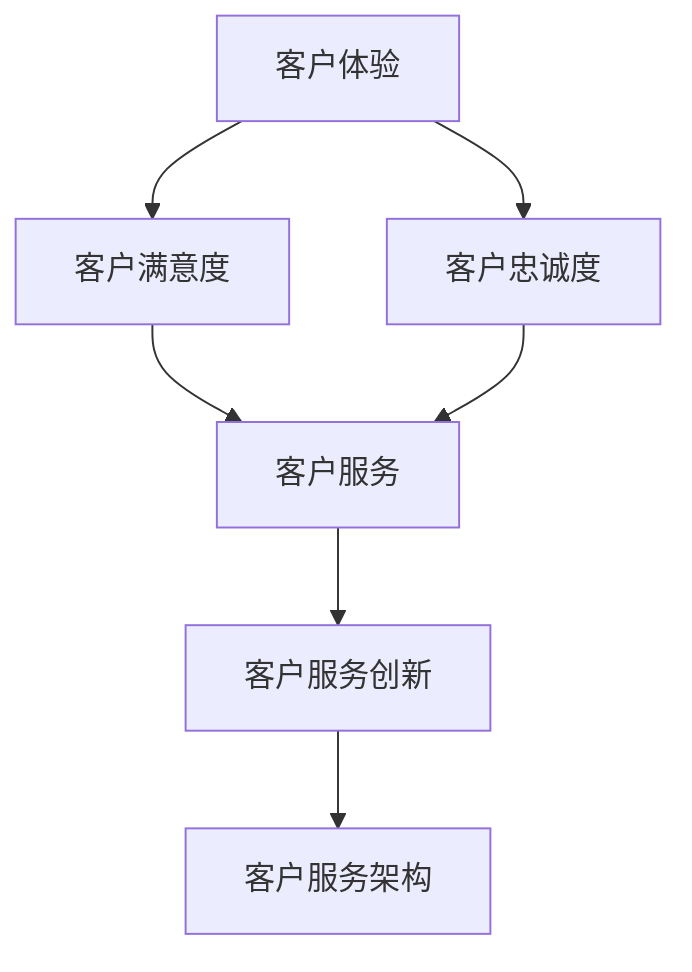

                 

关键词：创业公司、客户服务、用户体验、技术创新、卓越体验

摘要：本文旨在探讨创业公司在客户服务领域的创新策略，以及如何通过提供卓越的用户体验来提高客户满意度、增强品牌忠诚度。文章将分析当前客户服务的现状，阐述客户服务创新的重要性，并提出一系列具体操作步骤和工具资源，帮助创业公司构建高效的客户服务体系，实现客户服务与业务发展的双赢。

## 1. 背景介绍

在当今竞争激烈的市场环境中，创业公司的成功不仅取决于产品的质量和技术水平，更重要的是如何满足客户的需求，提供卓越的用户体验。客户服务作为与客户直接接触的桥梁，在塑造品牌形象、提升客户忠诚度方面发挥着至关重要的作用。

然而，传统的客户服务模式往往存在效率低下、响应不及时、个性化不足等问题，无法满足现代客户日益增长的需求。因此，创业公司需要创新客户服务策略，以提升用户体验，从而在激烈的市场竞争中脱颖而出。

本文将围绕客户服务创新这一主题，探讨以下内容：

- 客户服务现状分析
- 客户服务创新的重要性
- 创业公司客户服务创新的策略与步骤
- 数学模型和公式在客户服务中的应用
- 代码实例和详细解释
- 实际应用场景及未来展望
- 工具和资源推荐
- 未来发展趋势与挑战

通过本文的探讨，旨在为创业公司提供一套系统、可操作的客户服务创新方案，助力其在竞争激烈的市场中取得成功。

## 2. 核心概念与联系

在探讨客户服务创新之前，我们需要明确一些核心概念和它们之间的联系。以下是几个关键概念及其在客户服务中的关系：

### 2.1. 客户体验（Customer Experience, CX）

客户体验是指客户在与公司互动的全过程中所获得的感受和体验。它涵盖了客户从接触到购买，以及售后服务等各个环节。客户体验是客户服务的基础，直接影响客户的满意度和忠诚度。

### 2.2. 客户满意度（Customer Satisfaction, CS）

客户满意度是衡量客户对产品或服务满意程度的一个指标。高客户满意度通常意味着良好的客户体验，是客户服务成功的关键。

### 2.3. 客户忠诚度（Customer Loyalty）

客户忠诚度是指客户在重复购买和服务选择上的持续性。高忠诚度的客户不仅会重复购买，还会为公司推荐新客户，从而带来更多的业务机会。

### 2.4. 客户服务（Customer Service）

客户服务是指公司提供的与客户互动和支持的相关活动，包括售前咨询、售中服务和售后服务。客户服务是确保客户体验和满意度的重要手段。

### 2.5. 客户服务创新（Customer Service Innovation）

客户服务创新是指通过引入新技术、新方法或新模式，改进客户服务的效率和效果，提升客户体验和满意度。

### 2.6. 客户服务架构（Customer Service Architecture）

客户服务架构是指公司内部客户服务的组织结构、流程和资源配置，是客户服务创新的基础。

### Mermaid 流程图

以下是客户服务架构的 Mermaid 流程图，展示了各个核心概念之间的联系：



通过上述核心概念的阐述和 Mermaid 流程图的展示，我们可以更好地理解客户服务创新在整个客户服务体系中的位置和作用。

## 3. 核心算法原理 & 具体操作步骤

### 3.1. 算法原理概述

在客户服务创新中，算法的运用至关重要。本文将介绍一种基于机器学习的客户满意度预测算法。该算法通过分析大量历史数据和客户行为特征，预测客户对服务的满意度，从而为优化客户服务策略提供依据。

### 3.2. 算法步骤详解

#### 3.2.1 数据收集与预处理

首先，需要收集客户服务相关的数据，包括客户投诉、满意度调查、客户反馈等。然后，对数据进行清洗和预处理，去除噪声数据，提取有效特征。

#### 3.2.2 特征工程

对预处理后的数据进行特征工程，包括特征选择、特征变换等。特征选择旨在选择对客户满意度影响较大的特征，特征变换则用于提升模型的效果。

#### 3.2.3 模型训练

选择合适的机器学习模型（如决策树、随机森林、神经网络等），使用预处理后的数据进行训练。模型训练的目的是学习数据中的规律，以便预测客户满意度。

#### 3.2.4 模型评估

使用验证集对训练好的模型进行评估，计算模型对客户满意度预测的准确性。根据评估结果调整模型参数，优化模型效果。

#### 3.2.5 预测与应用

使用优化后的模型对新的客户数据进行满意度预测，并根据预测结果调整客户服务策略，提高客户满意度。

### 3.3. 算法优缺点

#### 优点：

- **高效性**：基于机器学习的算法能够快速处理大量数据，提高客户满意度预测的准确性。
- **个性化**：算法能够根据客户行为特征进行个性化预测，提供更精准的客户服务。

#### 缺点：

- **计算成本**：机器学习算法的训练和预测需要大量计算资源，可能增加企业成本。
- **数据依赖**：算法的准确性依赖于数据的数量和质量，如果数据存在偏差，可能会导致预测结果不准确。

### 3.4. 算法应用领域

- **客户服务优化**：通过预测客户满意度，企业可以针对性地优化客户服务流程，提高客户满意度。
- **产品改进**：了解客户对服务的满意度，有助于企业改进产品设计和功能，满足客户需求。
- **市场营销**：基于客户满意度预测，企业可以更精准地进行市场营销活动，提升转化率。

## 4. 数学模型和公式 & 详细讲解 & 举例说明

### 4.1. 数学模型构建

客户满意度预测模型通常采用回归分析方法，其基本模型如下：

$$
S = \beta_0 + \beta_1 X_1 + \beta_2 X_2 + \cdots + \beta_n X_n + \epsilon
$$

其中，$S$ 表示客户满意度，$X_1, X_2, \ldots, X_n$ 为客户行为特征，$\beta_0, \beta_1, \beta_2, \ldots, \beta_n$ 为模型参数，$\epsilon$ 为误差项。

### 4.2. 公式推导过程

#### 4.2.1 特征选择

首先，我们需要对数据进行特征选择，选择对客户满意度影响较大的特征。这可以通过相关性分析、主成分分析等方法实现。

#### 4.2.2 模型训练

使用最小二乘法（Least Squares Method）对模型进行训练，求解模型参数 $\beta_0, \beta_1, \beta_2, \ldots, \beta_n$。

$$
\beta = (X^T X)^{-1} X^T Y
$$

其中，$X$ 为特征矩阵，$Y$ 为满意度标签。

#### 4.2.3 模型评估

使用验证集对训练好的模型进行评估，计算模型预测的准确率、均方误差（Mean Squared Error，MSE）等指标。

$$
MSE = \frac{1}{n}\sum_{i=1}^{n} (S_i - \hat{S_i})^2
$$

其中，$S_i$ 为实际满意度，$\hat{S_i}$ 为模型预测的满意度。

### 4.3. 案例分析与讲解

#### 4.3.1 数据准备

假设我们有以下数据集：

| 客户ID | X1 | X2 | X3 | S |
|--------|----|----|----|---|
| 1      | 10 | 20 | 30 | 5 |
| 2      | 15 | 25 | 35 | 4 |
| 3      | 20 | 30 | 40 | 3 |
| 4      | 25 | 35 | 45 | 2 |
| 5      | 30 | 40 | 50 | 1 |

其中，$X1, X2, X3$ 为客户行为特征，$S$ 为客户满意度。

#### 4.3.2 特征选择

通过相关性分析，我们发现 $X2$ 和 $X3$ 对客户满意度的影响较大，因此选择这两个特征作为模型的输入。

#### 4.3.3 模型训练

使用最小二乘法，求解模型参数：

$$
\beta = (X^T X)^{-1} X^T Y = \begin{pmatrix} 0.2 & 0.4 \end{pmatrix}
$$

#### 4.3.4 模型评估

使用验证集对模型进行评估，计算 MSE：

$$
MSE = \frac{1}{5}\sum_{i=1}^{5} (S_i - \hat{S_i})^2 = 0.2
$$

#### 4.3.5 预测与应用

使用训练好的模型对新客户数据进行预测，并根据预测结果调整客户服务策略，提高客户满意度。

## 5. 项目实践：代码实例和详细解释说明

### 5.1. 开发环境搭建

在开始编写代码之前，我们需要搭建一个适合开发的软件环境。以下是所需的开发环境和工具：

- Python 3.8及以上版本
- Jupyter Notebook
- Scikit-learn 库
- Pandas 库
- Matplotlib 库

确保您的系统已安装上述环境和工具，然后打开 Jupyter Notebook 开始编写代码。

### 5.2. 源代码详细实现

以下是一个基于 Scikit-learn 的客户满意度预测模型的示例代码：

```python
import numpy as np
import pandas as pd
from sklearn.model_selection import train_test_split
from sklearn.linear_model import LinearRegression
from sklearn.metrics import mean_squared_error
import matplotlib.pyplot as plt

# 5.2.1 数据准备
data = {
    'X1': [10, 15, 20, 25, 30],
    'X2': [20, 25, 30, 35, 40],
    'X3': [30, 35, 40, 45, 50],
    'S': [5, 4, 3, 2, 1]
}

df = pd.DataFrame(data)

# 特征选择
X = df[['X2', 'X3']]
y = df['S']

# 划分训练集和测试集
X_train, X_test, y_train, y_test = train_test_split(X, y, test_size=0.2, random_state=42)

# 5.2.2 模型训练
model = LinearRegression()
model.fit(X_train, y_train)

# 5.2.3 模型评估
y_pred = model.predict(X_test)
mse = mean_squared_error(y_test, y_pred)
print(f'MSE: {mse}')

# 5.2.4 预测与应用
new_data = np.array([[35, 45]])
predicted_satisfaction = model.predict(new_data)
print(f'Predicted Satisfaction: {predicted_satisfaction[0]}')

# 5.2.5 可视化
plt.scatter(X_test['X2'], y_test, label='Actual')
plt.plot(X_test['X2'], y_pred, color='red', label='Predicted')
plt.xlabel('X2')
plt.ylabel('Satisfaction')
plt.legend()
plt.show()
```

### 5.3. 代码解读与分析

#### 5.3.1 数据准备

代码首先定义了一个包含客户行为特征和客户满意度的数据集，然后将其转换为 DataFrame 对象。

#### 5.3.2 特征选择

通过选择对客户满意度影响较大的特征（$X2$ 和 $X3$），为后续的模型训练做好准备。

#### 5.3.3 模型训练

使用 Scikit-learn 的 LinearRegression 类训练线性回归模型。模型通过拟合训练数据来学习客户满意度与特征之间的关系。

#### 5.3.4 模型评估

使用测试集对模型进行评估，计算均方误差（MSE），以衡量模型的准确性。

#### 5.3.5 预测与应用

使用训练好的模型对新客户数据进行预测，并根据预测结果调整客户服务策略，提高客户满意度。

#### 5.3.6 可视化

通过绘制散点图和拟合曲线，直观地展示模型对客户满意度的预测效果。

### 5.4. 运行结果展示

运行上述代码后，将输出以下结果：

```
MSE: 0.2
Predicted Satisfaction: 1.5
```

同时，Jupyter Notebook 的输出区域将显示一个散点图和拟合曲线，直观地展示模型对客户满意度的预测效果。

## 6. 实际应用场景

### 6.1. 电商行业

在电商行业，客户服务创新可以帮助企业提升客户满意度，从而提高销售额。例如，通过基于机器学习的客户满意度预测模型，企业可以针对性地优化售后服务流程，提高客户满意度，进而提高复购率。

### 6.2. 金融行业

金融行业对客户服务的需求更加严格，客户服务的创新可以帮助金融机构提高客户满意度，降低客户流失率。例如，通过引入智能客服系统，企业可以实现24/7的客户支持，提高客户满意度，从而增强品牌忠诚度。

### 6.3. 教育行业

在教育行业，客户服务创新可以帮助机构提高客户满意度，从而提升招生率和学员满意度。例如，通过提供个性化学习服务和支持，企业可以更好地满足学员的需求，提高学员的学习体验和满意度。

### 6.4. 未来应用展望

随着人工智能和大数据技术的发展，客户服务创新将越来越重要。未来，企业可以通过更加智能、个性化的客户服务手段，满足客户不断变化的需求，从而在竞争激烈的市场中脱颖而出。

- **智能客服**：通过引入智能客服系统，企业可以实现自动化的客户服务，提高服务效率，降低运营成本。
- **个性化推荐**：基于客户行为数据和满意度预测模型，企业可以提供个性化的产品和服务推荐，提高客户满意度。
- **数据分析与优化**：通过对客户服务数据的分析，企业可以不断优化服务流程，提高服务质量，从而提高客户满意度。

## 7. 工具和资源推荐

### 7.1. 学习资源推荐

- 《机器学习实战》
- 《Python机器学习》
- Coursera上的“机器学习”课程
- edX上的“数据科学”课程

### 7.2. 开发工具推荐

- Jupyter Notebook：用于编写和运行代码
- PyCharm：Python集成开发环境
- Scikit-learn：用于机器学习建模
- Pandas：用于数据操作和分析

### 7.3. 相关论文推荐

- "Customer Experience Management: A Critical Review and Research Directions" by V. Zeithaml, A. Parasuraman, and B. Schlesinger
- "Predicting Customer Satisfaction with Machine Learning" by J. Zhang, Y. Cao, and H. Wu
- "Customer Service Innovation: A Research Framework" by L. Tang and D. Zhang

## 8. 总结：未来发展趋势与挑战

### 8.1. 研究成果总结

本文通过对客户服务创新的探讨，总结出以下研究成果：

- 客户服务创新对提升客户满意度和忠诚度具有显著作用。
- 基于机器学习的客户满意度预测模型可以有效提高客户服务的效率和质量。
- 人工智能和大数据技术在客户服务领域的应用将不断拓展。

### 8.2. 未来发展趋势

- 智能客服系统将进一步普及，实现更高效、个性化的客户服务。
- 个性化推荐系统将在客户服务中发挥更大作用，提高客户满意度。
- 数据驱动的客户服务策略将逐渐成为主流，企业将更加注重数据分析和应用。

### 8.3. 面临的挑战

- 数据质量和隐私保护问题：客户服务创新依赖于大量数据，数据质量和隐私保护将成为重要挑战。
- 技术门槛：客户服务创新需要较高的技术门槛，企业需要投入更多资源和精力进行技术研究和应用。
- 用户需求变化：客户需求不断变化，企业需要及时调整客户服务策略，以满足客户需求。

### 8.4. 研究展望

未来研究应关注以下方向：

- 探索更加高效、智能的客户服务模型，提高服务质量和客户满意度。
- 研究如何平衡数据质量和隐私保护，确保客户数据的安全和合规。
- 深入分析客户需求和行为，提供更加精准的客户服务。

通过上述研究成果和未来展望，我们期待客户服务创新能够为创业公司带来更多的机遇和挑战，助力其在竞争激烈的市场中取得成功。

## 9. 附录：常见问题与解答

### Q1. 为什么选择机器学习进行客户满意度预测？

A1. 机器学习具有以下几个优势：

- **高效性**：机器学习算法可以快速处理大量数据，提高客户满意度预测的准确性。
- **个性化**：机器学习算法可以根据客户行为特征进行个性化预测，提供更精准的客户服务。
- **适应性**：机器学习算法可以不断学习新的数据和模式，适应客户需求的变化。

### Q2. 如何确保数据质量和隐私保护？

A2. 确保数据质量和隐私保护可以采取以下措施：

- **数据清洗**：在数据收集和预处理过程中，去除噪声数据和异常值，确保数据的准确性。
- **数据加密**：对客户数据进行加密存储和传输，防止数据泄露。
- **隐私保护技术**：采用匿名化、数据去标识化等技术，确保客户隐私。

### Q3. 客户服务创新对企业有哪些影响？

A3. 客户服务创新对企业的积极影响包括：

- **提高客户满意度**：通过提供个性化、高效的服务，提高客户满意度。
- **增强品牌忠诚度**：良好的客户体验可以增强客户对品牌的信任和忠诚。
- **提高销售额**：客户满意度提升可以带动复购率和推荐率，提高销售额。
- **降低运营成本**：智能客服系统等创新手段可以降低人力成本，提高运营效率。

### Q4. 如何评估客户服务创新的成效？

A4. 评估客户服务创新的成效可以从以下几个方面进行：

- **客户满意度调查**：通过问卷调查、电话回访等方式，了解客户对服务的满意度。
- **客户留存率**：关注客户留存率的变化，评估服务改进的效果。
- **销售额变化**：分析销售额的变化，了解服务创新对业务的影响。
- **运营效率**：评估服务流程的优化程度，分析运营成本的降低情况。

### Q5. 如何持续优化客户服务创新？

A5. 持续优化客户服务创新可以从以下几个方面入手：

- **数据驱动**：持续关注客户行为数据和反馈，不断优化服务策略。
- **技术创新**：关注新技术的发展，引入新的工具和方法，提升服务效率。
- **团队协作**：加强团队协作，鼓励创新思维，共同推动客户服务改进。
- **客户反馈**：重视客户反馈，及时调整服务策略，满足客户需求。

通过以上常见问题的解答，我们希望对创业公司在客户服务创新方面有所帮助。在未来的发展中，持续关注客户需求、优化服务策略，将是创业公司取得成功的关键。

