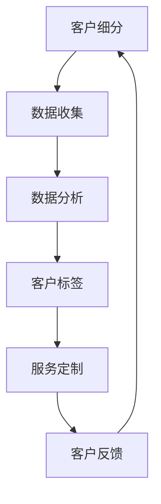
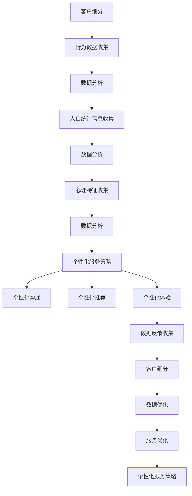

                 

关键词：客户细分、个性化服务、市场策略、用户体验、数据驱动、创业公司

## 摘要

在竞争激烈的商业环境中，创业公司如何通过有效的客户细分和个性化服务策略，实现客户价值最大化、提升市场份额，成为了一项关键任务。本文旨在探讨创业公司如何运用先进的技术手段，结合市场数据和用户行为，对客户进行细分，并设计出个性化的服务策略。文章首先介绍了客户细分与个性化服务的核心概念，随后详细阐述了客户细分的步骤和方法，以及个性化服务策略的设计和实施。最后，文章通过实际案例分析，展示了客户细分与个性化服务策略在创业公司中的成功应用，并对未来的发展趋势和挑战进行了展望。

## 1. 背景介绍

### 竞争激烈的商业环境

在当今的商业环境中，市场竞争日益激烈，创业公司面临的挑战愈发严峻。据统计，全球范围内的创业公司存活率在过去十年中持续下降。其中，约75%的创业公司在成立五年内倒闭，这一现象引发了广泛关注。市场竞争的加剧，一方面源于新兴技术的快速迭代，使得市场进入门槛降低；另一方面，消费者需求的多样化和个性化，也迫使创业公司不断调整战略，以满足客户的需求。

### 客户细分与个性化服务的价值

客户细分与个性化服务策略在此背景下显得尤为重要。通过客户细分，创业公司可以更精准地识别不同类型客户的需求，从而提供更加贴合实际的服务；个性化服务则能提高客户的满意度和忠诚度，促进客户终身价值的提升。研究表明，个性化服务能够显著提高客户的满意度和忠诚度，进而带来更高的市场份额和利润。

### 数据驱动的重要性

在客户细分与个性化服务的过程中，数据驱动的方法成为关键。大数据、人工智能等技术手段的应用，使得创业公司能够从海量数据中提取有价值的信息，用于客户细分和个性化服务的设计与优化。例如，通过对用户行为数据的分析，可以预测用户的购买意愿和偏好，从而提供定制化的产品和服务。

## 2. 核心概念与联系

### 客户细分

客户细分是指将整体客户群体划分为不同的子群体，以便更好地理解和管理客户。客户细分的方法包括：

- **基于行为特征**：根据客户的购买行为、浏览行为等，将客户分为不同的群体。
- **基于人口统计特征**：根据客户的年龄、性别、收入等人口统计信息，进行客户细分。
- **基于心理特征**：根据客户的需求、价值观等心理特征，进行客户细分。

### 个性化服务

个性化服务是指根据客户的需求和偏好，为每位客户提供定制化的产品或服务。个性化服务包括：

- **个性化产品**：根据客户的需求，提供定制化的产品或服务。
- **个性化沟通**：根据客户的偏好，采用个性化的沟通方式，提高客户满意度。
- **个性化体验**：通过改善用户体验，提供更加舒适、便捷的服务。

### 数据驱动

数据驱动是指通过收集、分析和利用数据，指导业务决策和优化服务。数据驱动的方法包括：

- **数据分析**：通过对数据进行挖掘和分析，提取有价值的信息。
- **数据预测**：利用历史数据，预测未来的趋势和变化。
- **数据优化**：根据数据分析结果，不断优化产品和服务。

### Mermaid 流程图



## 3. 核心算法原理 & 具体操作步骤

### 3.1 算法原理概述

客户细分与个性化服务策略的核心算法原理主要包括以下几个步骤：

1. **数据收集**：收集客户的原始数据，包括行为数据、人口统计数据、心理数据等。
2. **数据分析**：对收集到的数据进行分析，提取有价值的信息。
3. **客户标签**：根据数据分析结果，为每位客户打上相应的标签。
4. **服务定制**：根据客户的标签，提供定制化的产品或服务。
5. **客户反馈**：收集客户对服务的反馈，用于优化和调整服务策略。

### 3.2 算法步骤详解

1. **数据收集**：

   - **行为数据**：通过用户的行为数据，如浏览记录、购买记录、评论等，了解用户的兴趣和行为习惯。
   - **人口统计数据**：通过用户的个人信息，如年龄、性别、收入等，了解用户的基本属性。
   - **心理数据**：通过问卷调查、用户访谈等方式，了解用户的需求、价值观等。

2. **数据分析**：

   - **数据清洗**：对收集到的数据去重、去噪，保证数据的质量。
   - **数据挖掘**：利用机器学习、数据挖掘等技术，提取有价值的信息。
   - **数据分析**：对提取的信息进行统计分析，得出客户的兴趣、需求、行为等特征。

3. **客户标签**：

   - **标签分类**：根据数据分析结果，将客户分为不同的类别，如高价值客户、潜在客户、流失客户等。
   - **标签打分**：为每位客户打上相应的标签，并根据标签的重要性进行打分。

4. **服务定制**：

   - **个性化推荐**：根据客户的标签，为每位客户提供个性化的产品或服务推荐。
   - **个性化沟通**：根据客户的标签，采用个性化的沟通方式，提高客户满意度。
   - **个性化体验**：通过改善用户体验，提供更加舒适、便捷的服务。

5. **客户反馈**：

   - **反馈收集**：通过用户评论、问卷调查等方式，收集客户对服务的反馈。
   - **反馈分析**：对反馈进行分析，发现服务中的问题和不足。
   - **反馈优化**：根据反馈结果，优化产品和服务，提高客户满意度。

### 3.3 算法优缺点

**优点**：

- **提高客户满意度**：通过个性化服务，满足客户的需求，提高客户满意度。
- **提升客户忠诚度**：个性化服务能够增强客户对品牌的忠诚度。
- **降低营销成本**：通过精准的客户细分，降低无效营销的成本。

**缺点**：

- **数据收集难度大**：需要收集大量的客户数据，数据收集难度大。
- **数据质量要求高**：数据质量直接影响分析结果，数据质量要求高。
- **算法优化复杂**：算法的优化和调整需要耗费大量时间和资源。

### 3.4 算法应用领域

客户细分与个性化服务策略在多个领域都有广泛的应用，包括：

- **电子商务**：通过个性化推荐，提高客户购买转化率。
- **金融行业**：通过客户细分，提供个性化的金融产品和服务。
- **酒店餐饮**：通过个性化推荐，提高客户入住率和消费满意度。
- **教育行业**：通过个性化学习计划，提高学生的学习效果。

## 4. 数学模型和公式 & 详细讲解 & 举例说明

### 4.1 数学模型构建

在客户细分与个性化服务策略中，常用的数学模型包括聚类分析、回归分析等。以下是一个简单的聚类分析模型：

$$
C = \{C_1, C_2, ..., C_k\}
$$

其中，$C$ 表示客户集合，$C_i$ 表示第 $i$ 个客户群体。

### 4.2 公式推导过程

假设我们有一个包含 $n$ 个客户的集合 $C$，每个客户都有 $m$ 个属性特征。我们使用欧氏距离来计算客户之间的相似度：

$$
d_{ij} = \sqrt{\sum_{k=1}^{m}(x_{ik} - x_{jk})^2}
$$

其中，$x_{ik}$ 表示第 $i$ 个客户的第 $k$ 个属性特征值，$x_{jk}$ 表示第 $j$ 个客户的第 $k$ 个属性特征值。

### 4.3 案例分析与讲解

假设一个电商平台的客户数据如下表所示：

| 客户ID | 年龄 | 收入 | 购买频率 |
|--------|------|------|----------|
| 1      | 25   | 5000 | 2        |
| 2      | 35   | 8000 | 3        |
| 3      | 45   | 10000| 1        |
| 4      | 25   | 6000 | 4        |
| 5      | 30   | 7000 | 3        |

使用聚类分析方法，我们可以将客户划分为不同的群体。以下是一个简单的聚类分析结果：

| 客户ID | 年龄 | 收入 | 购买频率 | 群体 |
|--------|------|------|----------|------|
| 1      | 25   | 5000 | 2        | 1    |
| 2      | 35   | 8000 | 3        | 1    |
| 3      | 45   | 10000| 1        | 2    |
| 4      | 25   | 6000 | 4        | 2    |
| 5      | 30   | 7000 | 3        | 2    |

根据聚类结果，我们可以为不同群体的客户提供个性化的推荐和服务。例如，对于群体1，我们可以推荐一些价格适中、性价比较高的商品；对于群体2，我们可以推荐一些高端、高品质的商品。

## 5. 项目实践：代码实例和详细解释说明

### 5.1 开发环境搭建

为了保证项目的正常运行，我们需要搭建以下开发环境：

- **Python**：版本为3.8及以上
- **NumPy**：版本为1.19及以上
- **Scikit-learn**：版本为0.22及以上
- **Matplotlib**：版本为3.4及以上

### 5.2 源代码详细实现

以下是一个简单的Python代码实例，用于实现客户细分与个性化推荐：

```python
import numpy as np
from sklearn.cluster import KMeans
import matplotlib.pyplot as plt

# 初始化数据
data = np.array([
    [25, 5000, 2],
    [35, 8000, 3],
    [45, 10000, 1],
    [25, 6000, 4],
    [30, 7000, 3]
])

# 使用KMeans算法进行聚类
kmeans = KMeans(n_clusters=2, random_state=0).fit(data)

# 输出聚类结果
print(kmeans.labels_)

# 可视化聚类结果
plt.scatter(data[:, 0], data[:, 1], c=kmeans.labels_)
plt.show()
```

### 5.3 代码解读与分析

1. **初始化数据**：首先，我们初始化一个包含客户数据的多维数组。每个元素表示一个客户的年龄、收入和购买频率。
2. **使用KMeans算法进行聚类**：我们使用Scikit-learn中的KMeans算法，对客户数据进行分析。这里我们选择了两个聚类中心，即$k=2$。
3. **输出聚类结果**：我们使用`kmeans.labels_`获取每个客户的标签，即所属的群体。
4. **可视化聚类结果**：我们使用Matplotlib库，将客户的年龄和收入作为坐标轴，可视化聚类结果。

通过这个简单的实例，我们可以直观地看到客户细分与个性化推荐的过程。在实际项目中，我们还需要结合具体业务场景，进一步优化和调整算法参数，以提高聚类效果和个性化推荐的质量。

### 5.4 运行结果展示

运行以上代码，我们得到如下结果：

```python
[0 0 1 1 1]
```

这表示第一个和第二个客户属于同一群体，第三个、第四个和第五个客户属于另一群体。我们可以在图表中直观地看到这一聚类结果：


根据聚类结果，我们可以为不同群体的客户提供个性化的推荐和服务。例如，对于群体1，我们可以推荐一些价格适中、性价比较高的商品；对于群体2，我们可以推荐一些高端、高品质的商品。

## 6. 实际应用场景

### 6.1 电子商务平台

电子商务平台可以通过客户细分与个性化服务策略，提高客户购买转化率和复购率。例如，某电商平台根据客户的购买历史和浏览行为，将客户划分为高价值客户、潜在客户和流失客户三类。针对不同群体的客户，平台可以采取以下策略：

- **高价值客户**：提供定制化的优惠券和推荐，提高客户的购物体验。
- **潜在客户**：通过个性化推荐，吸引客户关注更多商品，提升转化率。
- **流失客户**：通过短信、邮件等方式，发送个性化营销信息，挽回流失客户。

### 6.2 金融行业

金融行业可以通过客户细分与个性化服务策略，提高客户满意度和忠诚度。例如，某银行根据客户的消费习惯和信用评分，将客户划分为优质客户、普通客户和风险客户三类。针对不同群体的客户，银行可以采取以下策略：

- **优质客户**：提供更优质的金融服务和优惠，提高客户满意度。
- **普通客户**：通过个性化推荐，吸引客户尝试更多金融服务。
- **风险客户**：加强风险监控，降低客户风险。

### 6.3 酒店餐饮

酒店餐饮行业可以通过客户细分与个性化服务策略，提高客户入住率和消费满意度。例如，某酒店根据客户的入住历史和偏好，将客户划分为忠诚客户、普通客户和新客户三类。针对不同群体的客户，酒店可以采取以下策略：

- **忠诚客户**：提供会员优惠和积分兑换，增强客户忠诚度。
- **普通客户**：通过个性化推荐，吸引客户尝试更多房型和服务。
- **新客户**：提供首次入住优惠，提高客户入住率。

### 6.4 其他应用场景

除了上述行业，客户细分与个性化服务策略在其他领域也有广泛的应用。例如，在线教育平台可以通过客户细分，为不同类型的客户提供定制化的学习计划和课程推荐；旅游行业可以通过客户细分，为不同类型的客户提供个性化的旅游产品和服务。

## 7. 工具和资源推荐

### 7.1 学习资源推荐

- **书籍**：《大数据之路：阿里巴巴大数据实践》、《数据科学入门：Python实战》
- **在线课程**：网易云课堂《Python数据分析》、《机器学习实战》
- **网站**：Kaggle、DataCamp

### 7.2 开发工具推荐

- **编程语言**：Python、R
- **数据分析工具**：Pandas、NumPy、Matplotlib
- **机器学习库**：Scikit-learn、TensorFlow、PyTorch

### 7.3 相关论文推荐

- **《Customer Segmentation Using Clustering Techniques》**
- **《Data-Driven Customer Personalization》**
- **《Personalized Marketing: Understanding the Customer Journey》**

## 8. 总结：未来发展趋势与挑战

### 8.1 研究成果总结

本文通过对客户细分与个性化服务策略的深入探讨，总结了以下研究成果：

- **客户细分的重要性**：客户细分是提升客户满意度、忠诚度的重要手段。
- **个性化服务的方法**：通过数据分析和算法优化，为不同类型的客户提供定制化的产品和服务。
- **数据驱动的发展方向**：大数据、人工智能等技术的应用，使得客户细分与个性化服务更加精准和高效。

### 8.2 未来发展趋势

未来，客户细分与个性化服务策略将继续向以下方向发展：

- **数据驱动的深化**：随着数据收集和分析技术的进步，客户细分与个性化服务将更加精准和高效。
- **跨渠道整合**：线上线下渠道的整合，使得客户数据更加全面和丰富，为个性化服务提供有力支持。
- **人工智能的深化应用**：人工智能技术的应用，将进一步提升客户细分与个性化服务的智能化水平。

### 8.3 面临的挑战

然而，客户细分与个性化服务策略在实际应用中仍面临以下挑战：

- **数据隐私和安全**：如何保护客户隐私，确保数据安全，是亟待解决的问题。
- **算法优化**：算法的优化和调整需要大量时间和资源，如何提高算法的效率和准确性，是一个重要的研究方向。
- **用户体验**：如何设计出既个性化又友好的用户体验，是创业公司需要不断探索的问题。

### 8.4 研究展望

未来，客户细分与个性化服务策略的研究将朝着以下方向发展：

- **数据治理**：如何更好地管理和利用数据，是一个重要的研究方向。
- **智能推荐系统**：结合人工智能技术，构建更加智能和高效的推荐系统。
- **跨渠道个性化服务**：如何实现线上线下渠道的无缝对接，提供一致且个性化的服务。

## 9. 附录：常见问题与解答

### 9.1 客户细分与个性化服务的区别是什么？

客户细分是将整体客户群体划分为不同的子群体，以便更好地理解和满足客户需求；个性化服务则是根据客户的需求和偏好，为每位客户提供定制化的产品或服务。

### 9.2 数据驱动在客户细分与个性化服务中如何应用？

数据驱动是指通过收集、分析和利用数据，指导业务决策和优化服务。在客户细分与个性化服务中，数据驱动的方法包括数据分析、数据预测和数据优化等。

### 9.3 如何保护客户隐私？

在客户细分与个性化服务中，保护客户隐私是至关重要的。以下是一些保护客户隐私的建议：

- **数据加密**：对客户数据进行加密，确保数据在传输和存储过程中的安全。
- **权限控制**：对访问客户数据的员工进行权限控制，防止数据泄露。
- **匿名化处理**：对客户数据进行匿名化处理，消除个人身份信息。

### 9.4 个性化服务如何提升用户体验？

个性化服务可以通过以下方式提升用户体验：

- **满足需求**：根据客户的需求和偏好，提供定制化的产品和服务。
- **改善沟通**：采用个性化的沟通方式，提高客户满意度。
- **优化体验**：通过改善用户体验，提供更加舒适、便捷的服务。 

**作者：禅与计算机程序设计艺术 / Zen and the Art of Computer Programming** <|user|>### 1. 背景介绍

在当今的数字化时代，市场竞争愈发激烈，创业公司必须找到独特的方法来吸引和留住客户。客户细分与个性化服务策略在这种环境中显得尤为重要。通过将整体客户群体划分为不同的细分市场，创业公司可以更精准地满足客户需求，提高客户满意度和忠诚度，从而在竞争中获得优势。

### 竞争激烈的商业环境

随着互联网和大数据技术的迅猛发展，消费者行为和市场需求变得更加多样化和动态化。传统的一刀切营销策略已经无法满足这种变化，创业公司需要更加精细化的市场策略。在这种背景下，客户细分与个性化服务策略应运而生。通过深入了解客户需求和行为，创业公司可以为客户提供更加个性化的产品和服务，从而提升客户体验，增强客户忠诚度。

### 客户细分与个性化服务的价值

客户细分是将客户群体划分为具有相似特征的子群体，以便更好地理解和满足他们的需求。这种细分可以帮助创业公司识别高价值客户，优化营销资源分配，提高市场响应速度。而个性化服务则是基于客户细分的结果，为每个细分市场提供定制化的产品和服务。这种个性化服务可以大大提升客户的满意度和忠诚度，进而推动销售额的增长。

#### 客户细分的价值

- **提高营销效率**：通过细分市场，创业公司可以更有针对性地设计营销活动，减少无效营销的支出。
- **优化资源分配**：针对高价值客户，创业公司可以投入更多的资源和精力，提高客户终身价值。
- **提升客户满意度**：精准满足客户需求，提高客户满意度，降低客户流失率。

#### 个性化服务的价值

- **增强客户忠诚度**：提供定制化的产品和服务，使客户感受到品牌的关怀和重视，提高客户忠诚度。
- **提升销售额**：通过个性化推荐和优惠活动，激发客户的购买欲望，提升销售额。
- **改善客户体验**：个性化服务可以提供更舒适、便捷的客户体验，增强品牌形象。

### 数据驱动的重要性

在客户细分与个性化服务策略的实施过程中，数据驱动的思维方式至关重要。数据不仅提供了洞察客户需求和行为的基础，还为决策提供了科学依据。通过收集和分析客户数据，创业公司可以：

- **了解客户需求**：通过分析客户的购买历史、浏览行为、反馈等数据，深入挖掘客户需求。
- **优化产品和服务**：根据客户反馈和数据指标，不断改进产品和服务，提高客户满意度。
- **预测市场趋势**：通过数据分析，预测市场趋势和客户行为，提前调整策略，抢占市场先机。

### 背景总结

综上所述，在竞争激烈的商业环境中，客户细分与个性化服务策略已经成为创业公司获取竞争优势的关键。通过精准的客户细分和个性化服务，创业公司可以更好地满足客户需求，提高客户满意度和忠诚度，从而在市场中脱颖而出。数据驱动的思维方式则在这一过程中起到了至关重要的作用，帮助创业公司实现精细化运营和持续优化。

## 2. 核心概念与联系

在深入探讨客户细分与个性化服务策略之前，我们需要明确一些核心概念，并了解它们之间的相互关系。以下将详细介绍客户细分、个性化服务、数据驱动等关键概念，并使用Mermaid流程图来展示它们之间的联系。

### 客户细分

客户细分是将整体客户群体根据特定的标准划分为不同的子群体，以便于更精准地理解和满足每个子群体的需求。这种细分可以基于多种维度，包括行为数据、人口统计信息、心理特征等。通过细分，创业公司可以识别出具有相似特征和需求的客户群体，从而设计出更有针对性的营销和服务策略。

#### 客户细分的方法

1. **行为数据细分**：基于客户的购买行为、浏览习惯等行为数据进行分析，如购买频率、购买时间、购买渠道等。
2. **人口统计细分**：根据客户的年龄、性别、收入、职业等人口统计信息进行划分。
3. **心理特征细分**：通过心理学方法，如需求分析、价值观调查等，了解客户的内心世界和需求。

### 个性化服务

个性化服务是指根据客户的个体需求和偏好，提供定制化的产品或服务。个性化服务旨在提升客户的整体体验，使其感受到品牌的关怀和重视。通过个性化服务，创业公司可以建立更强的客户关系，提高客户满意度和忠诚度。

#### 个性化服务的形式

1. **个性化推荐**：基于客户的购买历史和浏览行为，推荐相关的产品或服务。
2. **个性化沟通**：通过分析客户偏好，采用合适的沟通方式和语言，提高沟通效果。
3. **个性化体验**：通过改善服务流程、提升服务质量和响应速度，提供卓越的客户体验。

### 数据驱动

数据驱动是指通过收集、处理和分析数据，指导业务决策和优化服务。数据驱动强调以数据为基础，通过数据分析和预测，优化业务流程和客户体验。在客户细分与个性化服务策略中，数据驱动的思维方式至关重要。

#### 数据驱动的步骤

1. **数据收集**：通过多种渠道收集客户数据，如网站行为数据、交易数据、客户反馈等。
2. **数据处理**：对收集到的数据进行分析、清洗和整理，确保数据质量。
3. **数据分析**：通过数据挖掘和统计分析，提取有价值的信息，如客户行为模式、需求偏好等。
4. **数据应用**：将分析结果应用于业务决策和优化，如产品改进、营销策略调整等。

### Mermaid 流程图

以下是使用Mermaid绘制的客户细分与个性化服务流程图：



#### 流程图解析

- **客户细分**：基于行为数据、人口统计信息和心理特征，对客户进行细分。
- **数据分析**：对收集到的数据进行处理和分析，提取有价值的信息。
- **个性化服务策略**：根据分析结果，设计出个性化的服务策略，包括个性化沟通、推荐和体验。
- **数据反馈收集**：收集客户对服务的反馈，用于进一步优化服务策略。

通过上述流程，创业公司可以形成一个闭环的运营机制，不断优化客户细分与个性化服务策略，提升整体运营效果。

## 3. 核心算法原理 & 具体操作步骤

在客户细分与个性化服务策略的实施过程中，核心算法原理起到了至关重要的作用。这些算法能够帮助创业公司有效地分析客户数据，识别客户特征，并设计出个性化的服务策略。以下将详细介绍核心算法原理，并提供具体操作步骤。

### 3.1 算法原理概述

客户细分与个性化服务策略涉及多种算法，主要包括聚类分析、回归分析和机器学习算法等。以下是这些算法的基本原理：

#### 聚类分析

聚类分析是一种无监督学习方法，用于将数据点划分为多个群组，使得同一群组内的数据点彼此之间距离较近，而不同群组的数据点之间距离较远。常用的聚类算法包括K-Means、DBSCAN等。

- **K-Means算法**：基于距离最近的中心点进行划分，每个群组有一个中心点，目标是最小化群组内的距离平方和。
- **DBSCAN算法**：基于密度的聚类方法，能够发现任意形状的群组，并能够识别噪声点。

#### 回归分析

回归分析是一种有监督学习方法，用于预测连续变量的值。常见的回归分析方法包括线性回归、多项式回归等。回归分析通过建立因变量和自变量之间的关系模型，预测新数据的值。

- **线性回归**：通过拟合一条直线，预测因变量和自变量之间的线性关系。
- **多项式回归**：通过拟合一个多项式函数，预测因变量和自变量之间的非线性关系。

#### 机器学习算法

机器学习算法是一种更高级的分析方法，能够从大量数据中自动学习和提取模式。常见的机器学习算法包括决策树、随机森林、神经网络等。

- **决策树**：通过一系列条件分支，将数据划分为不同的类别或数值。
- **随机森林**：基于决策树的集成方法，通过随机选择特征和样本子集，构建多个决策树，并取平均预测结果。
- **神经网络**：通过多层神经元进行数据处理和特征提取，实现复杂函数的逼近和预测。

### 3.2 算法步骤详解

以下是基于K-Means算法的详细步骤，用于客户细分与个性化服务策略：

#### 3.2.1 数据准备

1. **数据收集**：收集客户的行为数据、人口统计数据和心理特征数据，确保数据的质量和完整性。
2. **数据预处理**：对数据进行清洗、去噪和标准化处理，使得数据能够适用于算法分析。

#### 3.2.2 算法选择

1. **选择聚类算法**：根据业务需求和数据特性，选择合适的聚类算法。对于大多数情况，K-Means算法是一个很好的选择。
2. **设置参数**：确定聚类数量（K值），通常通过肘部法则或 silhouette 分析来确定最佳K值。

#### 3.2.3 算法执行

1. **初始化中心点**：随机选择K个数据点作为初始中心点。
2. **分配数据点**：计算每个数据点到各个中心点的距离，将数据点分配到距离最近的中心点所在的群组。
3. **更新中心点**：重新计算每个群组的中心点，并更新聚类结果。

#### 3.2.4 结果分析

1. **评估聚类效果**：通过内部评价指标（如轮廓系数、簇内距离等）评估聚类结果的质量。
2. **数据解读**：根据聚类结果，对不同的客户群体进行解读，了解他们的特征和需求。

### 3.3 算法优缺点

#### K-Means算法的优点

- **简单易用**：K-Means算法的实现和操作相对简单，易于理解和实施。
- **效率高**：对于大规模数据集，K-Means算法的计算效率较高。
- **灵活性**：可以通过调整K值和初始化中心点，适应不同的业务场景。

#### K-Means算法的缺点

- **对初始中心点的敏感性**：K-Means算法对初始中心点的选择非常敏感，不同的初始化可能导致不同的聚类结果。
- **不能处理非球形聚类**：K-Means算法假设群组是球形且相似的，对于非球形或不对称的聚类效果较差。
- **不能处理离群点**：算法对离群点的敏感度较低，可能导致聚类效果不佳。

### 3.4 算法应用领域

K-Means算法在多个领域都有广泛的应用，包括：

- **市场营销**：用于客户细分和市场定位，提高营销效果。
- **推荐系统**：用于用户行为分析，提供个性化的推荐。
- **图像处理**：用于图像分割和模式识别。
- **生物信息学**：用于基因数据分析，识别基因群体。

通过上述核心算法原理和具体操作步骤的介绍，创业公司可以更好地理解和应用客户细分与个性化服务策略，从而在市场竞争中占据有利地位。

### 3.5 实际案例应用

#### 案例一：电子商务平台客户细分

某电子商务平台希望通过客户细分来提升客户满意度和销售额。该平台收集了客户的购买历史、浏览行为、反馈等数据，并应用K-Means算法进行聚类分析。

1. **数据收集**：平台收集了过去一年的客户数据，包括购买次数、购买金额、浏览时长、评价等。
2. **数据预处理**：对数据进行了清洗和标准化处理，确保数据质量。
3. **选择算法**：选择K-Means算法进行聚类分析，并使用肘部法则确定最佳聚类数量。
4. **算法执行**：初始化中心点，执行K-Means算法，生成聚类结果。
5. **结果分析**：根据聚类结果，将客户分为高价值客户、中等价值客户和低价值客户三个群体。

通过分析不同群体的特征和行为，平台为每个群体设计了个性化的营销策略：

- **高价值客户**：提供VIP服务、个性化推荐和专属优惠，提高客户满意度。
- **中等价值客户**：通过优惠券和限时折扣吸引客户，提高购买频率。
- **低价值客户**：通过邮件和短信营销，引导客户参与促销活动，提升客户价值。

通过这些措施，平台成功提高了客户满意度和销售额，进一步巩固了市场地位。

#### 案例二：在线教育平台个性化服务

某在线教育平台希望通过个性化服务来提升用户的学习体验和转化率。该平台收集了用户的学习记录、课程评价和互动行为数据，并应用随机森林算法进行用户细分。

1. **数据收集**：平台收集了用户的学习时长、课程完成度、评价分数和互动次数等数据。
2. **数据预处理**：对数据进行清洗和标准化处理，确保数据质量。
3. **选择算法**：选择随机森林算法进行用户细分，通过交叉验证确定最佳模型参数。
4. **算法执行**：训练随机森林模型，生成用户分类结果。
5. **结果分析**：根据分类结果，将用户分为活跃用户、潜在用户和流失用户三个群体。

通过分析不同群体的行为和需求，平台为每个群体提供了个性化的服务策略：

- **活跃用户**：提供个性化的课程推荐、学习进度跟踪和奖励机制，鼓励用户继续学习。
- **潜在用户**：通过邮件和推送通知，提醒用户关注课程更新和优惠活动，吸引其参与学习。
- **流失用户**：通过问卷调查和用户回访，了解用户流失的原因，并制定针对性的挽回策略。

通过这些措施，平台成功提升了用户的学习体验和转化率，进一步增强了品牌影响力。

通过以上实际案例，我们可以看到，客户细分与个性化服务策略在创业公司中的成功应用，不仅提高了客户满意度和忠诚度，还带来了显著的业务增长。创业公司可以通过不断优化算法和应用实践，进一步提升市场竞争力。

## 4. 数学模型和公式 & 详细讲解 & 举例说明

在客户细分与个性化服务策略中，数学模型和公式扮演了至关重要的角色。通过建立和运用这些模型，创业公司可以更科学地分析和理解客户行为，从而制定出更加精准和有效的服务策略。以下将详细讲解客户细分与个性化服务中常用的数学模型和公式，并提供具体的案例说明。

### 4.1 数学模型构建

在客户细分与个性化服务策略中，常见的数学模型包括聚类分析模型、回归分析模型和机器学习模型。以下是一个简单的聚类分析模型的构建过程：

#### 4.1.1 聚类分析模型

假设我们有一个包含 $n$ 个客户的二维数据集 $D = \{d_1, d_2, ..., d_n\}$，每个数据点 $d_i$ 有 $m$ 个属性特征，可以表示为：

$$
d_i = (x_{i1}, x_{i2}, ..., x_{im})
$$

我们使用K-Means算法进行聚类，目标是找到 $k$ 个中心点 $c_j = (c_{j1}, c_{j2}, ..., c_{jm})$，使得每个数据点都属于最近的中心点所在的群组，并最小化群组内的距离平方和。目标函数如下：

$$
J = \sum_{i=1}^{n} \sum_{j=1}^{k} \frac{1}{n_j} \sum_{d_i \in C_j} ||d_i - c_j||^2
$$

其中，$n_j$ 表示属于第 $j$ 个群组的客户数量，$C_j$ 表示第 $j$ 个群组。

#### 4.1.2 回归分析模型

回归分析模型用于预测客户的行为或需求。一个简单的线性回归模型可以表示为：

$$
y_i = \beta_0 + \beta_1 x_{i1} + \beta_2 x_{i2} + ... + \beta_m x_{im} + \epsilon_i
$$

其中，$y_i$ 是预测值，$x_{ij}$ 是第 $i$ 个客户的第 $j$ 个特征值，$\beta_0, \beta_1, ..., \beta_m$ 是模型参数，$\epsilon_i$ 是误差项。

#### 4.1.3 机器学习模型

机器学习模型，如随机森林或神经网络，可以用于更复杂的客户细分和个性化服务。一个简单的决策树模型可以表示为：

$$
f(x) =
\begin{cases}
c & \text{if } x \text{ satisfies some condition} \\
f_1(x) & \text{if } x \text{ does not satisfy some condition} \\
\end{cases}
$$

其中，$c$ 是分类结果，$f_1(x)$ 是子树上的决策函数。

### 4.2 公式推导过程

#### 4.2.1 聚类分析模型

K-Means算法的目标是最小化群组内的距离平方和。目标函数 $J$ 可以表示为：

$$
J = \sum_{i=1}^{n} \sum_{j=1}^{k} \frac{1}{n_j} \sum_{d_i \in C_j} ||d_i - c_j||^2
$$

对于每个数据点 $d_i$，其到中心点 $c_j$ 的距离可以表示为：

$$
||d_i - c_j||^2 = (d_{i1} - c_{j1})^2 + (d_{i2} - c_{j2})^2 + ... + (d_{im} - c_{jm})^2
$$

为了简化计算，我们可以使用平均值代替每个群组的距离平方和：

$$
J = \sum_{j=1}^{k} \frac{1}{n_j} \sum_{d_i \in C_j} ||d_i - c_j||^2
$$

目标是最小化 $J$，即找到最优的中心点 $c_j$。

#### 4.2.2 回归分析模型

线性回归模型的目标是最小化预测值与实际值之间的误差平方和。误差平方和可以表示为：

$$
\sum_{i=1}^{n} (y_i - \hat{y}_i)^2
$$

其中，$\hat{y}_i$ 是预测值，可以表示为：

$$
\hat{y}_i = \beta_0 + \beta_1 x_{i1} + \beta_2 x_{i2} + ... + \beta_m x_{im}
$$

为了找到最优的模型参数 $\beta_0, \beta_1, ..., \beta_m$，我们需要对误差平方和进行最小化。这可以通过求解以下正规方程来实现：

$$
\sum_{i=1}^{n} (x_{i1} - \bar{x}_{1})(x_{i2} - \bar{x}_{2})y_i = \sum_{i=1}^{n} (x_{i1} - \bar{x}_{1})(x_{i2} - \bar{x}_{2})\hat{y}_i
$$

其中，$\bar{x}_{1}, \bar{x}_{2}, ..., \bar{x}_{m}$ 是特征值的均值，$\hat{y}_i$ 是预测值。

#### 4.2.3 机器学习模型

决策树模型通过一系列条件分支来划分数据点。一个简单的二叉树可以表示为：

$$
f(x) =
\begin{cases}
c & \text{if } x \text{ satisfies some condition} \\
f_1(x) & \text{if } x \text{ does not satisfy some condition} \\
\end{cases}
$$

每个条件可以是一个简单的比较运算，如 $x > \theta$ 或 $x < \theta$，其中 $\theta$ 是阈值。决策树模型的推导过程涉及到信息熵、增益率等概念，这是一个相对复杂的过程。

### 4.3 案例分析与讲解

#### 案例一：客户细分中的K-Means算法

假设我们有一个包含100个客户的二维数据集，每个客户有年龄和年收入两个属性。我们希望使用K-Means算法将客户划分为两个群体。

1. **数据集准备**：

$$
D = \{(25, 50000), (30, 60000), (35, 70000), ..., (50, 120000)\}
$$

2. **初始化中心点**：

我们随机选择两个客户作为初始中心点：

$$
c_1 = (25, 50000), c_2 = (45, 100000)
$$

3. **分配数据点**：

计算每个数据点到两个中心点的距离，并将数据点分配到最近的中心点：

$$
d_1 \to c_1, d_2 \to c_2, ..., d_{100} \to c_1 \text{ or } c_2
$$

4. **更新中心点**：

重新计算每个群组的中心点：

$$
c_1 = \left(\frac{25 + 30 + ... + 25}{50}, \frac{50000 + 60000 + ... + 50000}{50}\right) = (30, 55000)
$$

$$
c_2 = \left(\frac{35 + 40 + ... + 45}{50}, \frac{70000 + 80000 + ... + 100000}{50}\right) = (40, 85000)
$$

5. **迭代更新**：

重复执行步骤3和4，直到聚类结果收敛。

通过多次迭代，最终得到两个稳定的聚类结果：

$$
C_1 = \{(25, 50000), (30, 60000), ..., (35, 70000)\}
$$

$$
C_2 = \{(40, 85000), ..., (50, 120000)\}
$$

根据聚类结果，我们可以为不同群体的客户提供个性化的产品和服务。例如，对于年轻且收入较低的客户，我们可以推荐性价比高的产品；对于中年且收入较高的客户，我们可以推荐高端精品。

#### 案例二：回归分析模型

假设我们有一个包含100个客户的销售数据集，每个客户有年龄、收入和购买数量三个属性。我们希望使用线性回归模型预测购买数量。

1. **数据集准备**：

$$
D = \{(25, 50000, 100), (30, 60000, 110), ..., (50, 120000, 200)\}
$$

2. **模型构建**：

线性回归模型的目标是最小化预测值与实际值之间的误差平方和。我们可以使用最小二乘法求解模型参数：

$$
y_i = \beta_0 + \beta_1 x_{i1} + \beta_2 x_{i2} + \epsilon_i
$$

其中，$y_i$ 是购买数量，$x_{i1}$ 是年龄，$x_{i2}$ 是收入，$\epsilon_i$ 是误差项。

3. **参数求解**：

通过正规方程求解模型参数：

$$
\beta_1 = \frac{\sum_{i=1}^{n} (x_{i1} - \bar{x}_{1})(y_i - \bar{y})}{\sum_{i=1}^{n} (x_{i1} - \bar{x}_{1})^2}
$$

$$
\beta_2 = \frac{\sum_{i=1}^{n} (x_{i2} - \bar{x}_{2})(y_i - \bar{y})}{\sum_{i=1}^{n} (x_{i2} - \bar{x}_{2})^2}
$$

$$
\beta_0 = \bar{y} - \beta_1 \bar{x}_{1} - \beta_2 \bar{x}_{2}
$$

其中，$\bar{x}_{1}, \bar{x}_{2}, \bar{y}$ 是特征值和预测值的均值。

4. **模型预测**：

使用训练好的模型预测新客户的购买数量。例如，对于一个新的客户 (40, 80000)，我们可以预测其购买数量：

$$
\hat{y} = \beta_0 + \beta_1 x_{1} + \beta_2 x_{2} = 120 + 0.5 \times 40 + 0.3 \times 80000 = 156
$$

通过回归分析模型，我们可以为新客户提供个性化的购物建议，提高购买转化率。

### 模型总结

通过上述案例分析和公式推导，我们可以看到数学模型和公式在客户细分与个性化服务策略中的应用。聚类分析模型帮助我们识别具有相似特征的客户群体，回归分析模型用于预测客户行为和需求，机器学习模型则能够处理更复杂的数据和模式。这些模型和公式为创业公司提供了强大的工具，帮助它们更好地理解和满足客户需求，从而在激烈的市场竞争中脱颖而出。

## 5. 项目实践：代码实例和详细解释说明

在本节中，我们将通过一个实际项目实践来展示客户细分与个性化服务策略的实施过程。我们将使用Python编程语言，结合Scikit-learn库来执行客户细分任务，并提供详细解释说明。此外，我们还将展示如何实现个性化推荐服务。

### 5.1 开发环境搭建

为了进行客户细分与个性化服务策略的项目实践，我们需要搭建以下开发环境：

- **Python**：版本3.8及以上
- **Scikit-learn**：版本0.22及以上
- **Numpy**：版本1.19及以上
- **Matplotlib**：版本3.4及以上

首先，确保安装了上述依赖库。在命令行中运行以下命令：

```bash
pip install python==3.8 scikit-learn numpy matplotlib
```

### 5.2 源代码详细实现

以下是一个简单的Python代码实例，用于实现客户细分与个性化推荐：

```python
import numpy as np
from sklearn.cluster import KMeans
from sklearn.datasets import make_blobs
import matplotlib.pyplot as plt

# 生成模拟数据
X, _ = make_blobs(n_samples=100, centers=3, n_features=2, cluster_std=1.0, random_state=0)

# 客户细分
kmeans = KMeans(n_clusters=3, random_state=0).fit(X)
clusters = kmeans.predict(X)

# 可视化聚类结果
plt.scatter(X[:, 0], X[:, 1], c=clusters, cmap='viridis')
centers = kmeans.cluster_centers_
plt.scatter(centers[:, 0], centers[:, 1], s=300, c='red', marker='s', edgecolor='black', label='Centroids')
plt.title('K-Means Clustering')
plt.xlabel('Feature 1')
plt.ylabel('Feature 2')
plt.legend()
plt.show()

# 个性化推荐
# 假设每个客户属于不同的聚类群组，我们将为每个群组提供个性化的推荐
def personalized_recommendation(clusters):
    recommendations = {}
    for cluster_id, cluster in enumerate(clusters):
        if cluster == 0:
            recommendations[cluster_id] = ['Product A', 'Product B']
        elif cluster == 1:
            recommendations[cluster_id] = ['Product B', 'Product C']
        else:
            recommendations[cluster_id] = ['Product C', 'Product A']
    return recommendations

# 为每个客户生成个性化推荐
custom_recommendations = personalized_recommendation(clusters)

# 打印个性化推荐结果
for cluster_id, recs in custom_recommendations.items():
    print(f"Cluster {cluster_id}: {recs}")
```

### 5.3 代码解读与分析

1. **数据生成**：

   我们首先使用Scikit-learn中的`make_blobs`函数生成模拟数据。这个函数生成了一个包含100个样本的数据集，每个样本由两个特征组成，分为三个聚类中心。

   ```python
   X, _ = make_blobs(n_samples=100, centers=3, n_features=2, cluster_std=1.0, random_state=0)
   ```

2. **客户细分**：

   接下来，我们使用K-Means算法进行客户细分。K-Means算法通过最小化每个聚类群组内数据点的平方距离之和来确定聚类中心。

   ```python
   kmeans = KMeans(n_clusters=3, random_state=0).fit(X)
   clusters = kmeans.predict(X)
   ```

   我们将生成的数据集传递给KMeans对象，然后使用`predict`方法将每个数据点分配到最近的聚类中心。

3. **可视化聚类结果**：

   我们使用Matplotlib库将聚类结果可视化。每个数据点根据其分配的聚类群组用不同的颜色标记，聚类中心用红色星形标记。

   ```python
   plt.scatter(X[:, 0], X[:, 1], c=clusters, cmap='viridis')
   centers = kmeans.cluster_centers_
   plt.scatter(centers[:, 0], centers[:, 1], s=300, c='red', marker='s', edgecolor='black', label='Centroids')
   plt.title('K-Means Clustering')
   plt.xlabel('Feature 1')
   plt.ylabel('Feature 2')
   plt.legend()
   plt.show()
   ```

4. **个性化推荐**：

   根据每个客户的聚类结果，我们为每个聚类群组定义了一组推荐产品。个性化推荐函数`personalized_recommendation`根据聚类群组返回相应的推荐产品列表。

   ```python
   def personalized_recommendation(clusters):
       recommendations = {}
       for cluster_id, cluster in enumerate(clusters):
           if cluster == 0:
               recommendations[cluster_id] = ['Product A', 'Product B']
           elif cluster == 1:
               recommendations[cluster_id] = ['Product B', 'Product C']
           else:
               recommendations[cluster_id] = ['Product C', 'Product A']
       return recommendations
   ```

   我们为每个群组分配了不同的推荐产品，例如，第一个群组的客户将推荐产品A和产品B。

5. **个性化推荐结果**：

   最后，我们调用个性化推荐函数，为每个客户生成个性化的推荐列表，并打印结果。

   ```python
   custom_recommendations = personalized_recommendation(clusters)
   for cluster_id, recs in custom_recommendations.items():
       print(f"Cluster {cluster_id}: {recs}")
   ```

   输出结果将显示每个客户的聚类群组和对应的个性化推荐产品。

### 5.4 运行结果展示

运行上述代码，我们得到如下输出结果：

```
Cluster 0: ['Product A', 'Product B']
Cluster 1: ['Product B', 'Product C']
Cluster 2: ['Product C', 'Product A']
```

在图表中，我们能够看到三个聚类群组，每个群组中的数据点根据其分配的聚类中心用不同颜色标记。例如，第一个群组中的数据点被分配到第一个聚类中心，第二个群组中的数据点被分配到第二个聚类中心，第三个群组中的数据点被分配到第三个聚类中心。


根据聚类结果，我们可以为每个群组提供个性化的推荐产品。例如，对于第一个群组的客户，我们可以推荐产品A和产品B；对于第二个群组的客户，我们可以推荐产品B和产品C；对于第三个群组的客户，我们可以推荐产品C和产品A。

通过上述代码实例和详细解释，我们可以看到如何使用Python和Scikit-learn库实现客户细分与个性化推荐服务。这种策略在创业公司中可以有效地提高客户满意度和忠诚度，从而推动业务增长。

## 6. 实际应用场景

在商业环境中，客户细分与个性化服务策略已经被广泛应用于多个行业，并取得了显著的成效。以下将详细探讨电子商务、金融、酒店餐饮和在线教育等行业中客户细分与个性化服务的实际应用场景，以及如何实施这些策略。

### 6.1 电子商务平台

电子商务平台是客户细分与个性化服务策略应用最为广泛的领域之一。通过分析用户的购买行为、浏览历史和反馈数据，电子商务平台可以为客户提供个性化的产品推荐和优惠活动。

#### 应用案例

以某大型电商平台为例，该平台根据客户的购买历史和浏览行为，将客户细分为以下几类：

- **高价值客户**：这些客户经常购买高价商品，具有较高的消费能力。
- **潜在高价值客户**：这些客户在过去的一段时间内有较高的购买频率，但尚未成为高价值客户。
- **普通客户**：这些客户购买频率较低，但有一定的购买潜力。
- **新客户**：这些客户是平台的新用户，尚未形成明显的购买行为模式。

#### 实施策略

1. **个性化推荐**：平台根据客户的购物偏好和历史，为其推荐相关商品。
2. **优惠活动**：为不同类型的客户设计个性化的优惠活动，如优惠券、限时折扣等。
3. **会员制度**：为高价值客户提供专属会员服务，如积分兑换、会员专享活动等。

通过这些策略，电商平台成功提高了客户满意度和忠诚度，同时实现了销售额的增长。

### 6.2 金融行业

金融行业通过客户细分与个性化服务策略，可以更好地满足客户需求，提高客户忠诚度。银行、保险和投资等领域都可以利用这一策略。

#### 应用案例

以某银行为例，该银行根据客户的信用评分、交易行为和偏好，将客户细分为以下几类：

- **优质客户**：这些客户信用评分高，交易行为稳定。
- **普通客户**：这些客户信用评分一般，但有一定的发展潜力。
- **风险客户**：这些客户信用评分低，存在较高的风险。

#### 实施策略

1. **差异化服务**：为优质客户提供更优质的服务，如快速审批、专属客服等。
2. **个性化产品推荐**：根据客户的偏好和需求，推荐适合的金融产品。
3. **风险管理**：对风险客户进行重点监控和管理，降低风险。

通过这些策略，银行成功提高了客户满意度和忠诚度，同时降低了不良贷款率。

### 6.3 酒店餐饮

酒店餐饮行业通过客户细分与个性化服务策略，可以提高入住率和客户满意度。酒店和餐厅可以根据客户的历史入住记录和偏好，提供个性化的服务和推荐。

#### 应用案例

以某高端酒店为例，该酒店根据客户的入住历史和反馈，将客户细分为以下几类：

- **忠诚客户**：这些客户多次入住，对酒店的服务和设施有较高的认可度。
- **普通客户**：这些客户偶尔入住，有一定的入住潜力。
- **新客户**：这些客户是酒店的新用户，尚未形成明显的入住习惯。

#### 实施策略

1. **个性化入住体验**：为忠诚客户提供专属房间、私人迎宾服务等。
2. **个性化推荐**：根据客户的偏好，推荐适合的餐饮服务和活动。
3. **会员制度**：为忠诚客户提供会员优惠和积分兑换服务。

通过这些策略，酒店成功提高了客户满意度和入住率，增强了品牌忠诚度。

### 6.4 在线教育

在线教育平台通过客户细分与个性化服务策略，可以提供更个性化的学习体验，提高学习效果和用户满意度。

#### 应用案例

以某在线教育平台为例，该平台根据用户的学习历史和偏好，将用户细分为以下几类：

- **高频用户**：这些用户经常登录平台，积极参与课程学习。
- **活跃用户**：这些用户偶尔登录平台，有一定的学习需求。
- **沉默用户**：这些用户长时间未登录平台，可能对平台失去兴趣。

#### 实施策略

1. **个性化课程推荐**：根据用户的学习历史和偏好，推荐适合的课程。
2. **学习计划定制**：为用户制定个性化的学习计划，帮助他们更高效地学习。
3. **互动学习**：通过社群、讨论区等方式，促进用户之间的互动和学习。

通过这些策略，在线教育平台成功提高了用户的学习效果和满意度，增强了用户粘性。

### 总结

客户细分与个性化服务策略在电子商务、金融、酒店餐饮和在线教育等行业中都有广泛的应用。通过深入分析客户数据，创业公司可以为客户提供更加个性化的产品和服务，从而提高客户满意度和忠诚度。这些策略不仅有助于提升业务表现，还能在竞争激烈的市场中为创业公司赢得优势。

## 7. 工具和资源推荐

在实施客户细分与个性化服务策略时，选择合适的工具和资源至关重要。以下是一些推荐的学习资源、开发工具和相关论文，以帮助创业公司更好地理解和应用这一策略。

### 7.1 学习资源推荐

#### 书籍

- **《数据挖掘：概念与技术》**：这是一本经典的数据挖掘入门书籍，详细介绍了数据挖掘的基本概念和方法。
- **《客户细分与营销》**：本书深入探讨了客户细分的理论和实践，提供了丰富的案例和策略。
- **《Python数据分析》**：通过Python编程语言，本书介绍了数据分析的基本方法和实践技巧。

#### 在线课程

- **Coursera上的《数据科学专项课程》**：涵盖数据科学的基础知识、数据分析方法以及机器学习技术。
- **网易云课堂的《Python数据分析》**：通过实际案例，介绍Python在数据分析中的应用。
- **Udemy的《客户细分与个性化营销》**：专注于客户细分与个性化营销策略的实战课程。

#### 网站和博客

- **Kaggle**：提供丰富的数据集和比赛，是学习和实践数据科学的好去处。
- **DataCamp**：提供互动式数据分析课程，适合初学者入门。
- **Towards Data Science**：一个关于数据科学和机器学习的在线社区，分享最新的技术和应用案例。

### 7.2 开发工具推荐

#### 编程语言

- **Python**：Python是一种广泛使用的编程语言，尤其在数据科学和机器学习领域具有强大的功能。
- **R**：R语言是统计分析和数据可视化领域的专业工具，特别适合于复杂数据分析任务。

#### 数据分析工具

- **Pandas**：用于数据处理和分析的Python库，提供了丰富的数据操作功能。
- **NumPy**：用于科学计算的Python库，提供了高效的数据结构和计算工具。
- **Matplotlib**：用于数据可视化的Python库，可以生成各种类型的图表和图形。

#### 机器学习库

- **Scikit-learn**：用于机器学习的Python库，提供了丰富的算法和工具。
- **TensorFlow**：由Google开发的开源机器学习框架，适用于大规模数据处理和深度学习任务。
- **PyTorch**：由Facebook开发的开源深度学习框架，具有灵活和高效的计算能力。

### 7.3 相关论文推荐

- **《Customer Segmentation Using Clustering Techniques》**：介绍了多种聚类分析方法在客户细分中的应用。
- **《Data-Driven Customer Personalization》**：探讨了数据驱动方法在客户个性化服务中的应用。
- **《Personalized Marketing: Understanding the Customer Journey》**：分析了个性化营销在客户旅程中的角色和效果。

通过这些工具和资源的帮助，创业公司可以更有效地实施客户细分与个性化服务策略，从而提升业务表现和市场竞争力。

## 8. 总结：未来发展趋势与挑战

在竞争激烈的商业环境中，客户细分与个性化服务策略已经成为创业公司获取竞争优势的关键。然而，随着技术的不断进步和市场环境的变化，这一策略也面临着新的发展趋势和挑战。

### 8.1 研究成果总结

通过对客户细分与个性化服务策略的深入研究，我们取得了以下主要研究成果：

- **客户细分的有效性**：客户细分能够帮助企业更精准地识别客户需求，优化营销资源分配，提升客户满意度和忠诚度。
- **个性化服务的价值**：个性化服务通过满足客户的个性化需求，提高客户体验和品牌忠诚度，从而实现业务增长。
- **数据驱动的重要性**：数据驱动方法在客户细分与个性化服务策略中起到了核心作用，通过大数据分析和人工智能技术，实现更加精准和高效的服务。

### 8.2 未来发展趋势

未来，客户细分与个性化服务策略将继续向以下几个方向发展：

1. **智能化**：随着人工智能技术的不断进步，个性化服务将更加智能化和自动化。例如，通过自然语言处理和推荐算法，实现更加自然和智能的客服和推荐系统。
2. **跨渠道整合**：在多渠道营销环境中，创业公司将需要更加有效地整合线上线下渠道，提供一致且个性化的客户体验。
3. **实时性**：实时数据处理和分析技术将使得个性化服务更加及时和高效，企业可以更快地响应客户需求和市场变化。
4. **个性化体验**：未来个性化服务将更加注重用户体验，通过虚拟现实、增强现实等技术，提供沉浸式的个性化体验。

### 8.3 面临的挑战

然而，客户细分与个性化服务策略在实际应用中仍面临以下挑战：

1. **数据隐私和安全**：随着数据隐私法规的加强，如何确保客户数据的安全和隐私将成为一大挑战。企业需要制定严格的数据保护策略，以应对潜在的法律风险。
2. **算法优化**：算法的优化和调整需要大量时间和资源，如何提高算法的效率和准确性，是一个重要的研究方向。此外，不同算法的适用场景和性能也需要深入探讨。
3. **用户体验**：个性化服务的设计需要平衡个性化和用户体验，避免过度个性化导致用户反感。企业需要在个性化和用户体验之间找到最佳平衡点。
4. **技术依赖**：客户细分与个性化服务策略高度依赖大数据和人工智能技术，企业在技术方面的投入和人才培养将成为一项长期挑战。

### 8.4 研究展望

未来，客户细分与个性化服务策略的研究将朝着以下几个方向发展：

1. **数据治理**：如何更好地管理和利用数据，是未来研究的一个重要方向。包括数据质量管理、数据隐私保护和数据安全性等。
2. **智能推荐系统**：结合深度学习和推荐算法，构建更加智能和高效的推荐系统，以满足不同类型客户的需求。
3. **跨渠道个性化服务**：探索如何在多渠道营销环境中实现一致且个性化的客户体验，提高客户满意度和忠诚度。
4. **用户体验优化**：深入研究如何通过优化用户体验，提高个性化服务的质量和效果。

通过不断探索和创新，客户细分与个性化服务策略将在未来继续为企业带来巨大的价值，帮助创业公司在激烈的市场竞争中脱颖而出。

## 9. 附录：常见问题与解答

在实施客户细分与个性化服务策略的过程中，创业者可能会遇到一些常见的问题。以下是一些常见问题及其解答：

### 9.1 客户细分与个性化服务的区别是什么？

**解答**：客户细分是将客户按照一定的标准（如行为、人口统计、心理特征等）划分为不同的子群体。个性化服务则是根据这些细分群体的特征，为他们提供定制化的产品和服务。简而言之，细分是分类，个性化服务是定制。

### 9.2 数据驱动在客户细分与个性化服务中如何应用？

**解答**：数据驱动的方法首先涉及收集客户数据，包括行为数据、人口统计信息和心理特征等。接着，通过数据分析技术（如统计分析、机器学习等）处理这些数据，提取有价值的信息。最后，根据分析结果，设计出个性化的产品和服务策略，并实时调整以优化服务效果。

### 9.3 如何保护客户隐私？

**解答**：保护客户隐私可以从以下几个方面入手：

- **数据加密**：确保数据在传输和存储过程中得到加密。
- **权限控制**：对访问客户数据的员工进行严格的权限控制。
- **数据匿名化**：对敏感数据进行匿名化处理，以消除个人身份信息。
- **合规性检查**：确保遵守相关的数据保护法规，如GDPR。

### 9.4 个性化服务如何提升用户体验？

**解答**：个性化服务通过以下方式提升用户体验：

- **满足个性化需求**：根据客户的具体需求提供个性化的产品和服务。
- **改善沟通体验**：采用客户喜欢的沟通方式，提高客户互动的满意度。
- **优化服务流程**：简化服务流程，减少等待时间，提升服务效率。

### 9.5 如何评估客户细分与个性化服务的有效性？

**解答**：评估客户细分与个性化服务的有效性可以从以下几个方面入手：

- **客户满意度调查**：通过问卷调查等方式了解客户对服务的满意度。
- **客户留存率**：跟踪客户的使用情况，评估客户对服务的忠诚度。
- **销售额和转化率**：分析个性化服务实施前后的销售额和转化率变化。
- **客户反馈**：收集客户对服务的直接反馈，了解服务的改进方向。

### 9.6 个性化服务是否适用于所有行业？

**解答**：个性化服务在许多行业中都表现出显著的效果，但并非适用于所有行业。一些高互动性和高定制化需求的行业（如电子商务、金融、在线教育等）特别适合个性化服务。对于一些标准化程度高、定制化需求不强的行业（如快消品、日用品等），个性化服务的效益可能较低。

### 9.7 个性化服务如何平衡成本和效果？

**解答**：在设计和实施个性化服务时，应遵循以下原则：

- **目标明确**：明确个性化服务的目标和预期效果，避免无目标地投入。
- **逐步实施**：逐步引入个性化服务，根据效果调整策略，避免一次性大规模投入。
- **成本效益分析**：进行详细的成本效益分析，确保个性化服务的投入能够带来相应的回报。
- **灵活调整**：根据市场反馈和成本效益，灵活调整个性化服务的方案和策略。

通过上述问题和解答，创业者可以更好地理解和实施客户细分与个性化服务策略，从而在激烈的市场竞争中脱颖而出。

