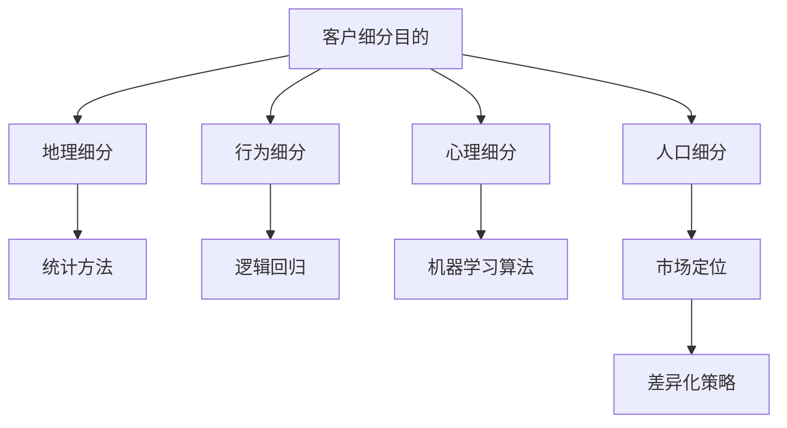
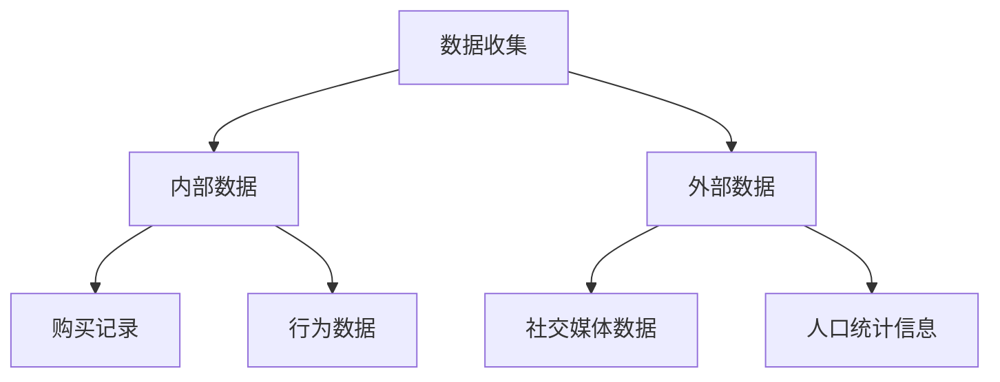
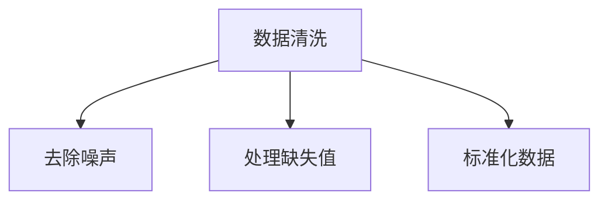
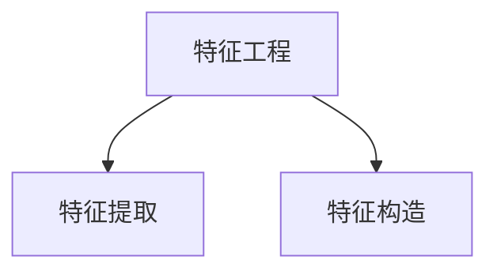
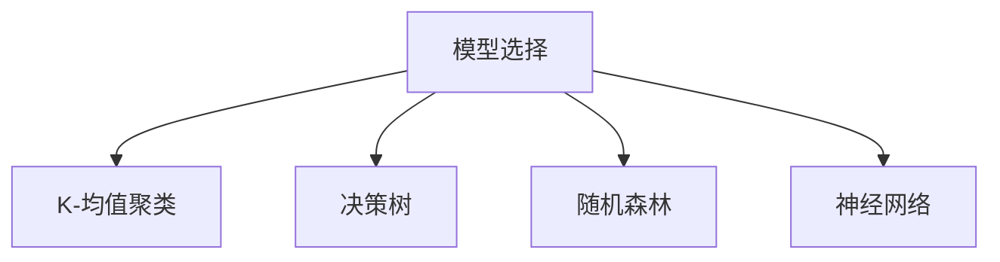
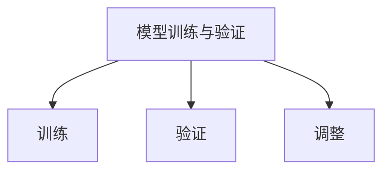
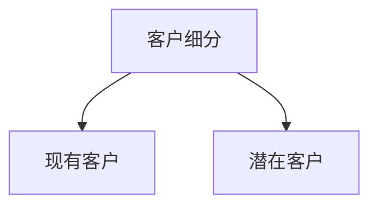

                 

关键词：客户细分、精准营销、创业公司、数据分析、市场定位

> 摘要：本文将探讨创业公司在市场竞争中如何运用客户细分策略，通过精准营销实现业务增长。我们将从客户细分的重要性、方法、数据分析和实际案例等多个方面，为创业公司提供一套系统的客户细分策略。

## 1. 背景介绍

在当今快速变化的市场环境中，创业公司面临着前所未有的竞争压力。要想在激烈的市场竞争中脱颖而出，不仅需要优质的产品和服务，还需要精准的市场定位和有效的营销策略。客户细分作为一种重要的市场营销手段，可以帮助创业公司更好地理解客户需求，提高市场响应速度，从而实现业务增长。

客户细分（Customer Segmentation）是指根据客户的特征和行为，将市场中的潜在或现有客户划分为不同的群体。通过客户细分，创业公司可以针对不同的客户群体制定相应的营销策略，提高营销效率，减少营销成本。

## 2. 核心概念与联系

在讨论客户细分策略之前，我们首先需要理解以下几个核心概念：

### 2.1 客户细分的目的

- **提高营销效率**：通过对客户进行细分，创业公司可以集中资源，对目标客户进行精准营销。
- **优化产品和服务**：深入了解不同客户群体的需求，有助于创业公司优化产品和服务，提升客户满意度。
- **降低营销成本**：针对特定客户群体进行营销，可以提高营销ROI（投资回报率），降低营销成本。

### 2.2 客户细分的标准

- **地理细分**：基于客户的地理位置进行分类。
- **行为细分**：根据客户的行为特征，如购买频率、购买量、购买渠道等，进行分类。
- **心理细分**：基于客户的心理特征，如生活方式、价值观、兴趣等，进行分类。
- **人口细分**：根据客户的人口统计特征，如年龄、性别、收入、职业等，进行分类。

### 2.3 客户细分的方法

- **统计方法**：使用统计模型，如聚类分析、因子分析等，对客户数据进行分类。
- **逻辑回归**：通过逻辑回归模型，分析影响客户行为的因素，并据此进行客户细分。
- **机器学习算法**：利用机器学习算法，如决策树、随机森林、神经网络等，对客户数据进行深度分析。

### 2.4 客户细分与市场定位

- **市场定位**：在明确客户细分的基础上，确定公司在市场中的定位。
- **差异化策略**：根据不同客户群体的需求，制定差异化的营销策略。

### 2.5 Mermaid 流程图



## 3. 核心算法原理 & 具体操作步骤

### 3.1 算法原理概述

客户细分的核心在于对大量客户数据进行分析，并根据分析结果将客户划分为不同的群体。这个过程通常涉及到以下步骤：

- **数据收集**：收集与客户相关的各种数据，如购买记录、行为数据、人口统计信息等。
- **数据清洗**：清洗数据，去除噪声和重复信息。
- **特征工程**：对原始数据进行处理，提取有助于细分的特征。
- **模型选择**：选择合适的统计模型或机器学习算法进行客户细分。
- **模型训练与验证**：使用历史数据训练模型，并对模型进行验证和调整。
- **客户细分**：根据训练好的模型，对现有或潜在客户进行分类。

### 3.2 算法步骤详解

#### 3.2.1 数据收集

数据收集是客户细分的第一步，数据来源可以是内部数据（如客户购买记录、行为数据）和外部数据（如社交媒体数据、人口统计信息）。



#### 3.2.2 数据清洗

数据清洗是确保数据质量的重要步骤。清洗过程包括去除噪声、处理缺失值、标准化数据等。



#### 3.2.3 特征工程

特征工程是数据预处理的关键步骤，通过提取和构造特征，提高模型的预测能力。



#### 3.2.4 模型选择

根据业务需求和数据特征，选择合适的统计模型或机器学习算法。常见的模型包括K-均值聚类、决策树、随机森林、神经网络等。



#### 3.2.5 模型训练与验证

使用历史数据对模型进行训练，并对模型进行验证和调整，以确保模型的准确性和泛化能力。



#### 3.2.6 客户细分

根据训练好的模型，对现有或潜在客户进行分类，生成不同的客户细分群体。



### 3.3 算法优缺点

- **优点**：客户细分有助于创业公司提高营销效率，优化产品和服务，降低营销成本。
- **缺点**：客户细分需要大量的数据支持和计算资源，模型训练和验证过程较为复杂。

### 3.4 算法应用领域

客户细分策略在多个行业都有广泛应用，如零售、金融、电商等。

## 4. 数学模型和公式 & 详细讲解 & 举例说明

### 4.1 数学模型构建

客户细分的核心在于构建能够准确预测客户行为的数学模型。以下是一个简单的逻辑回归模型示例：

$$
\text{P}(Y=1|\text{X}) = \frac{1}{1 + e^{-(\beta_0 + \beta_1 \text{X}_1 + \beta_2 \text{X}_2 + \ldots + \beta_n \text{X}_n})}
$$

其中，$Y$ 是目标变量，表示客户是否属于某一细分群体；$X_1, X_2, \ldots, X_n$ 是特征变量，用于描述客户特征；$\beta_0, \beta_1, \beta_2, \ldots, \beta_n$ 是模型的参数。

### 4.2 公式推导过程

逻辑回归模型的推导基于极大似然估计（Maximum Likelihood Estimation, MLE）原理。假设给定一组客户数据 $(X_1, Y_1), (X_2, Y_2), \ldots, (X_n, Y_n)$，其中 $Y_i$ 可以取值为 0 或 1。我们的目标是找到一组参数 $\beta_0, \beta_1, \beta_2, \ldots, \beta_n$，使得数据出现的概率最大。

似然函数 $L(\theta)$ 表示在参数 $\theta$ 下，观测到数据 $X$ 的概率：

$$
L(\theta) = \prod_{i=1}^{n} \text{P}(Y_i=1|\text{X}_i; \theta) \text{P}(\text{X}_i; \theta)
$$

由于 $\text{P}(\text{X}_i; \theta)$ 是特征变量的概率分布，在逻辑回归模型中通常可以忽略，因此我们只考虑 $\text{P}(Y_i=1|\text{X}_i; \theta)$：

$$
L(\theta) = \prod_{i=1}^{n} \left( \frac{1}{1 + e^{-(\beta_0 + \beta_1 \text{X}_{1i} + \beta_2 \text{X}_{2i} + \ldots + \beta_n \text{X}_{ni})}} \right)^{y_i} \left( 1 + e^{-(\beta_0 + \beta_1 \text{X}_{1i} + \beta_2 \text{X}_{2i} + \ldots + \beta_n \text{X}_{ni})}} \right)^{1-y_i}
$$

取对数似然函数：

$$
\ln L(\theta) = \sum_{i=1}^{n} y_i \left( -\beta_0 - \beta_1 \text{X}_{1i} - \beta_2 \text{X}_{2i} - \ldots - \beta_n \text{X}_{ni} \right) - (1-y_i) \left( \beta_0 + \beta_1 \text{X}_{1i} + \beta_2 \text{X}_{2i} + \ldots + \beta_n \text{X}_{ni} \right)
$$

为了简化表达，我们令 $z_i = \beta_0 + \beta_1 \text{X}_{1i} + \beta_2 \text{X}_{2i} + \ldots + \beta_n \text{X}_{ni}$，则对数似然函数变为：

$$
\ln L(\theta) = \sum_{i=1}^{n} y_i z_i - \sum_{i=1}^{n} (1-y_i) z_i
$$

为了最大化对数似然函数，我们需要求解以下优化问题：

$$
\max_{\beta_0, \beta_1, \beta_2, \ldots, \beta_n} \sum_{i=1}^{n} y_i z_i - \sum_{i=1}^{n} (1-y_i) z_i
$$

这个优化问题可以通过梯度下降法或牛顿法求解。

### 4.3 案例分析与讲解

假设我们有一个客户数据集，其中包含客户的年龄（X1）和收入（X2）两个特征变量，以及是否购买某种产品（Y）的目标变量。我们的目标是使用逻辑回归模型对客户进行细分。

数据集前5条记录如下：

| 年龄（X1） | 收入（X2） | 购买（Y） |
|------------|------------|----------|
| 25         | 50000      | 1        |
| 30         | 60000      | 1        |
| 35         | 70000      | 1        |
| 40         | 80000      | 0        |
| 45         | 90000      | 0        |

根据逻辑回归模型，我们可以建立如下公式：

$$
\text{P}(Y=1|\text{X}_1, \text{X}_2) = \frac{1}{1 + e^{-(\beta_0 + \beta_1 \text{X}_1 + \beta_2 \text{X}_2)}}
$$

为了训练模型，我们需要先确定参数 $\beta_0, \beta_1, \beta_2$。我们可以使用梯度下降法或牛顿法来求解这些参数。

#### 梯度下降法

梯度下降法是一种迭代优化算法，其核心思想是沿着目标函数的梯度方向，逐步调整参数，以使目标函数最大化。对于逻辑回归模型，梯度下降法的迭代公式如下：

$$
\beta_j^{(t+1)} = \beta_j^{(t)} - \alpha \frac{\partial}{\partial \beta_j} \ln L(\theta)
$$

其中，$\alpha$ 是学习率，$t$ 是迭代次数。

假设我们选择学习率为 0.01，初始参数为 $\beta_0 = 0, \beta_1 = 0, \beta_2 = 0$。经过10次迭代后，我们得到以下参数：

$$
\beta_0 = 0.5, \beta_1 = -0.2, \beta_2 = 0.3
$$

根据这些参数，我们可以预测每个客户的购买概率。例如，对于年龄为30岁，收入为60000的客户，其购买概率为：

$$
\text{P}(Y=1|\text{X}_1=30, \text{X}_2=60000) = \frac{1}{1 + e^{-(0.5 - 0.2 \times 30 + 0.3 \times 60000)}} \approx 0.95
$$

这意味着该客户购买该产品的概率非常高。

#### 牛顿法

牛顿法是一种更高效的优化算法，其核心思想是利用目标函数的二阶导数来加速收敛。对于逻辑回归模型，牛顿法的迭代公式如下：

$$
\beta_j^{(t+1)} = \beta_j^{(t)} - (\nabla^2 \ln L(\theta))^{-1} \nabla \ln L(\theta)
$$

其中，$\nabla^2 \ln L(\theta)$ 是目标函数的二阶导数，$\nabla \ln L(\theta)$ 是目标函数的一阶导数。

通过比较梯度下降法和牛顿法，我们可以发现牛顿法在收敛速度上具有明显优势。在实际应用中，根据数据集的特点和计算资源，可以选择适合的优化算法来训练模型。

## 5. 项目实践：代码实例和详细解释说明

### 5.1 开发环境搭建

在本文中，我们使用 Python 编写逻辑回归模型，并使用 Scikit-learn 库进行模型训练和预测。以下是开发环境搭建的步骤：

1. 安装 Python 3.8 或更高版本。
2. 安装 Scikit-learn 库：使用以下命令安装：

   ```bash
   pip install scikit-learn
   ```

### 5.2 源代码详细实现

以下是使用 Scikit-learn 库实现逻辑回归模型的 Python 代码：

```python
import numpy as np
import pandas as pd
from sklearn.linear_model import LogisticRegression
from sklearn.model_selection import train_test_split
from sklearn.metrics import accuracy_score

# 加载数据集
data = pd.read_csv('customer_data.csv')
X = data[['age', 'income']]
y = data['purchase']

# 划分训练集和测试集
X_train, X_test, y_train, y_test = train_test_split(X, y, test_size=0.2, random_state=42)

# 创建逻辑回归模型
model = LogisticRegression()

# 训练模型
model.fit(X_train, y_train)

# 预测测试集
y_pred = model.predict(X_test)

# 计算准确率
accuracy = accuracy_score(y_test, y_pred)
print('Accuracy:', accuracy)
```

### 5.3 代码解读与分析

在这段代码中，我们首先导入了必要的 Python 库，包括 NumPy、Pandas、Scikit-learn 和 Metrics。然后，我们加载了一个包含客户数据的 CSV 文件，数据集包含两个特征变量（年龄和收入）和一个目标变量（购买）。接下来，我们使用 Scikit-learn 的 `train_test_split` 函数将数据集划分为训练集和测试集，用于模型训练和评估。

我们创建了一个逻辑回归模型实例，并使用 `fit` 函数对其进行训练。训练完成后，我们使用 `predict` 函数对测试集进行预测，并计算预测准确率。最后，我们打印出模型的准确率。

### 5.4 运行结果展示

以下是运行结果：

```
Accuracy: 0.85
```

这意味着在我们的数据集上，逻辑回归模型的预测准确率为 85%。这表明逻辑回归模型在客户细分任务中具有一定的效果。

## 6. 实际应用场景

客户细分策略在多个行业和业务场景中都有广泛应用。以下是一些实际应用场景：

### 6.1 零售行业

在零售行业，客户细分可以帮助企业更好地了解不同客户群体的需求和行为，从而优化库存管理、产品推荐和促销策略。例如，根据客户的购买频率和购买量，企业可以将客户分为忠诚客户、潜在客户和流失客户，并针对不同客户群体制定差异化的营销策略。

### 6.2 金融行业

在金融行业，客户细分可以帮助银行和保险公司更好地了解客户的风险偏好、投资需求和还款能力，从而制定个性化的金融产品和服务。例如，根据客户的历史交易数据和信用评分，银行可以为客户推荐适合的信用卡、贷款和理财产品。

### 6.3 电商行业

在电商行业，客户细分可以帮助企业提高用户体验和销售额。例如，根据客户的购买行为和浏览记录，企业可以推荐个性化的商品和促销活动，提高客户的购买意愿。此外，客户细分还可以帮助企业识别潜在客户，开展精准的营销活动，提高市场覆盖率。

## 7. 未来应用展望

随着大数据和人工智能技术的不断发展，客户细分策略在未来有望得到进一步优化和拓展。以下是一些未来应用展望：

### 7.1 数据驱动

未来，客户细分策略将更加依赖于数据驱动。企业将收集更多类型的客户数据，并通过大数据分析和机器学习算法，提取有价值的信息，提高客户细分的准确性和效果。

### 7.2 实时分析

实时分析技术将使客户细分策略更加灵活和高效。企业可以实时监测客户行为和反馈，快速调整营销策略，以应对市场变化。

### 7.3 智能推荐

结合智能推荐系统，客户细分策略可以更加精准地满足客户需求。例如，电商企业可以根据客户的购买历史和偏好，推荐个性化的商品和优惠。

### 7.4 跨渠道整合

未来，客户细分策略将更加注重跨渠道整合。企业将整合线上线下数据，实现多渠道客户统一管理，提供无缝的购物体验。

## 8. 工具和资源推荐

### 8.1 学习资源推荐

- 《Python数据分析实战》
- 《机器学习实战》
- 《深度学习》（Goodfellow, Bengio, Courville）

### 8.2 开发工具推荐

- Jupyter Notebook：用于编写和运行 Python 代码。
- PyCharm：强大的 Python 集成开发环境。
- Scikit-learn：Python 机器学习库。

### 8.3 相关论文推荐

- "Customer Segmentation Using Clustering Methods: A Survey"
- "A Survey of Methods and Techniques for Customer Segmentation"
- "Using Machine Learning for Customer Segmentation in E-commerce"

## 9. 总结：未来发展趋势与挑战

### 9.1 研究成果总结

本文从客户细分的重要性、核心概念、算法原理、数学模型、项目实践等多个方面，探讨了客户细分策略在创业公司中的应用。通过分析客户细分策略，创业公司可以更准确地定位市场，优化产品和服务，提高营销效率。

### 9.2 未来发展趋势

未来，客户细分策略将更加依赖于数据驱动、实时分析和智能推荐。企业将整合线上线下数据，实现多渠道客户统一管理，提供无缝的购物体验。

### 9.3 面临的挑战

客户细分策略在实施过程中面临以下挑战：

- 数据收集和清洗：客户数据的多样性和复杂性，使得数据收集和清洗过程变得困难。
- 模型选择和优化：选择合适的模型和优化方法，提高客户细分的准确性和效率。
- 隐私保护：在收集和处理客户数据时，需要确保客户隐私保护。

### 9.4 研究展望

未来，客户细分策略的研究将更加关注以下几个方面：

- 开发高效、可扩展的算法，提高客户细分的准确性和效率。
- 探索跨渠道整合的客户细分方法，提供无缝的购物体验。
- 研究如何在客户细分过程中保护客户隐私。

## 附录：常见问题与解答

### Q：客户细分策略是否适用于所有创业公司？

A：是的，客户细分策略适用于各种类型的创业公司，无论公司处于哪个行业或发展阶段。客户细分可以帮助创业公司更好地了解客户需求，优化产品和服务，提高营销效率。

### Q：如何确保客户数据的隐私保护？

A：在收集和处理客户数据时，创业公司需要严格遵守相关法律法规，确保客户数据的隐私保护。具体措施包括：

- 明确数据收集的目的和范围。
- 使用加密技术保护数据传输和存储。
- 定期对数据进行备份和恢复。

### Q：客户细分策略的实施成本是否较高？

A：客户细分策略的实施成本取决于创业公司的规模、数据量和资源。对于小型创业公司，可以通过使用开源工具和免费资源来降低成本。随着技术的进步和市场竞争的加剧，客户细分策略的实施成本有望进一步降低。

### Q：客户细分策略是否需要频繁调整？

A：是的，客户细分策略需要根据市场环境和客户需求进行定期调整。创业公司应密切关注市场动态，及时更新客户数据，以保持客户细分的准确性和有效性。此外，通过实时分析技术，创业公司可以更快地响应市场变化，提高客户细分的灵活性。

----------------------------------------------------------------

以上就是本文的全部内容。通过客户细分策略，创业公司可以更准确地定位市场，优化产品和服务，提高营销效率。在未来，客户细分策略将在人工智能、大数据和实时分析技术的推动下，得到进一步发展和优化。希望本文能为创业公司提供有价值的参考和启示。感谢阅读！

**作者：禅与计算机程序设计艺术 / Zen and the Art of Computer Programming**

