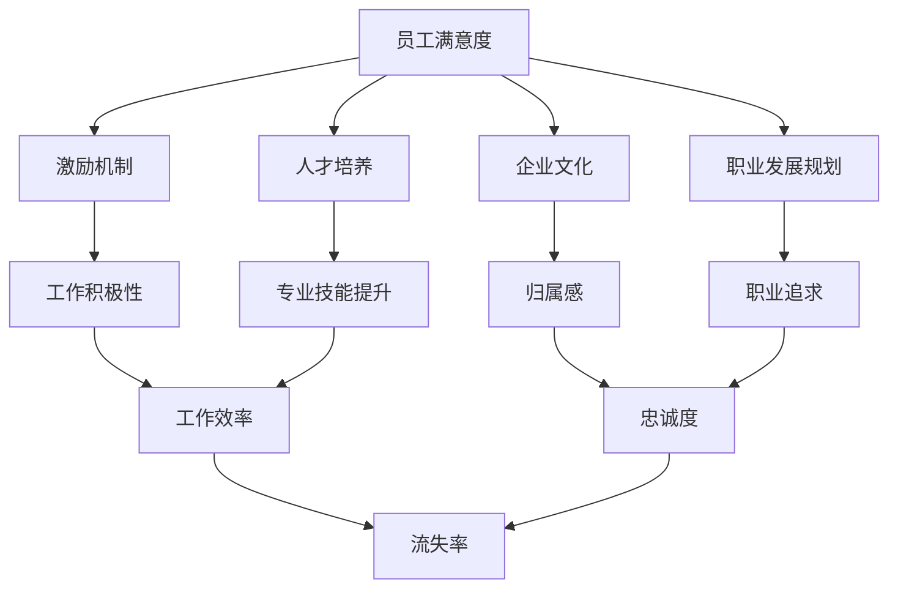

                 

关键词：技术人才保留、员工满意度、激励机制、人才培养、创业公司、企业文化、职业发展规划

## 摘要

随着科技领域的快速发展和市场竞争的加剧，技术人才已成为创业公司发展的关键资源。然而，技术人才的流失率普遍较高，这对创业公司的稳定发展构成了巨大挑战。本文旨在探讨创业公司如何设计有效的技术人才保留策略，以提升员工满意度、降低流失率，从而实现公司的长期稳定发展。本文将从员工满意度、激励机制、人才培养、企业文化以及职业发展规划五个方面进行分析，并提出具体的策略和措施。

## 1. 背景介绍

在当前的创业环境中，技术人才的重要性不言而喻。一方面，技术人才是创新驱动的核心力量，他们的专业能力和创新能力直接决定了公司的技术水平和市场竞争力。另一方面，技术人才的流失将对公司的运营带来不利影响，不仅会导致项目进度延误，还可能造成技术积累的丧失，甚至引发客户信任危机。

据《2019年中国互联网人才报告》数据显示，互联网行业人才流失率高达15%，而技术人才流失率更高，达到20%以上。这种现象在创业公司中尤为明显，由于创业公司的生存压力大，薪资待遇和福利条件相对较低，导致技术人才更容易流失。为了应对这一挑战，创业公司需要从多个方面入手，制定一套科学合理的人才保留策略。

### 1.1 创业公司的特点

创业公司通常具有以下特点：

- **发展阶段**：创业公司通常处于初创期或成长期，尚未形成稳定的商业模式和市场地位。
- **资源限制**：创业公司的资源相对有限，特别是在资金和人力方面。
- **创新能力**：创业公司强调创新，追求技术创新和市场创新。
- **高风险**：创业公司面临较高的市场风险和经营风险。

这些特点使得创业公司在人才保留方面面临更大的挑战。

### 1.2 技术人才的重要性

技术人才的重要性体现在以下几个方面：

- **技术创新**：技术人才是公司技术创新的核心，他们的专业能力和创新能力直接决定了公司的技术水平。
- **产品竞争力**：技术人才对产品的质量、性能和用户体验有直接影响，从而提升产品的市场竞争力。
- **团队氛围**：技术人才的稳定有助于维持团队的专业氛围和协作精神。
- **知识传承**：技术人才的工作经验和专业知识是公司宝贵的知识资产。

综上所述，创业公司需要高度重视技术人才的保留，通过制定有效的人才策略，提升员工的满意度和忠诚度，从而降低流失率，实现公司的长期稳定发展。

## 2. 核心概念与联系

在探讨创业公司的技术人才保留策略之前，我们需要明确一些核心概念和它们之间的联系。

### 2.1 员工满意度

员工满意度是指员工对工作环境、工作内容、薪酬福利、职业发展等方面的满意程度。员工满意度直接影响到员工的忠诚度和工作效率。高员工满意度通常伴随着低流失率和高工作积极性。

### 2.2 激励机制

激励机制是指公司通过奖励、晋升、股权等手段激发员工的工作动力和创造力。有效的激励机制能够提升员工的工作满意度和忠诚度，从而降低流失率。

### 2.3 人才培养

人才培养是指公司通过培训、导师制、项目实践等方式提升员工的专业技能和综合素质。人才培养不仅有助于提升员工的工作能力，还能增强员工的归属感和忠诚度。

### 2.4 企业文化

企业文化是指公司在长期经营过程中形成的价值观、行为规范和工作氛围。良好的企业文化能够增强员工的认同感和归属感，从而提高员工的工作满意度和忠诚度。

### 2.5 职业发展规划

职业发展规划是指公司为员工提供的职业成长路径和晋升机会。清晰的职业发展规划能够激发员工的工作动力和职业追求，从而提高员工的满意度和忠诚度。

### 2.6 Mermaid 流程图

以下是一个简化的 Mermaid 流程图，展示了上述核心概念之间的联系：



通过上述流程图，我们可以看出，员工满意度是技术人才保留策略的核心，而激励机制、人才培养、企业文化和职业发展规划是实现员工满意度的重要手段。这些手段相互联系，共同作用于员工的满意度和忠诚度，从而影响流失率。

## 3. 核心算法原理 & 具体操作步骤

在探讨创业公司的技术人才保留策略时，我们可以引入一种基于员工满意度和流失率分析的核心算法。这种算法通过分析员工满意度与流失率之间的相关性，为创业公司提供优化人才保留策略的量化依据。

### 3.1 算法原理概述

该算法基于以下基本假设：

1. **员工满意度与流失率之间存在负相关性**，即员工满意度越高，流失率越低。
2. **员工满意度由多个因素决定**，包括激励机制、人才培养、企业文化和职业发展规划。

算法的主要目标是通过分析员工满意度和流失率的数据，找出对员工满意度影响最大的因素，并据此提出优化策略。

### 3.2 算法步骤详解

算法步骤如下：

1. **数据收集**：收集公司内部员工满意度调查数据、离职员工访谈数据以及市场数据。
2. **数据预处理**：清洗和整理数据，确保数据质量。
3. **相关性分析**：使用统计学方法（如皮尔逊相关系数）分析员工满意度与流失率之间的相关性。
4. **影响因素识别**：识别影响员工满意度的关键因素，如激励机制、人才培养、企业文化和职业发展规划。
5. **优化策略提出**：根据相关性分析和影响因素识别结果，提出针对性的优化策略。

### 3.3 算法优缺点

**优点**：

- **量化分析**：通过数据分析和相关性分析，能够提供客观、量化的决策依据。
- **针对性**：针对影响员工满意度的关键因素提出优化策略，具有针对性。

**缺点**：

- **数据依赖性**：算法的有效性高度依赖数据质量，数据缺失或不准确可能导致错误结论。
- **复杂性**：算法涉及多个步骤和复杂的统计方法，实施难度较大。

### 3.4 算法应用领域

该算法主要应用于创业公司的技术人才保留策略设计。具体应用场景包括：

- **员工满意度调查分析**：通过分析员工满意度调查数据，识别存在的问题和优化方向。
- **离职原因分析**：通过分析离职员工访谈数据，了解离职原因，为优化人才保留策略提供依据。
- **市场竞争力分析**：通过市场数据，了解行业人才保留情况，为制定有竞争力的薪酬福利政策提供参考。

### 3.5 具体实例

假设某创业公司通过员工满意度调查和离职原因分析，收集到以下数据：

- **员工满意度调查**：100名员工中有80人认为激励机制对员工满意度有显著影响，70人认为人才培养有显著影响，90人认为企业文化有显著影响，85人认为职业发展规划有显著影响。
- **离职原因分析**：50名离职员工中有30人提到激励机制，25人提到人才培养，20人提到企业文化，15人提到职业发展规划。

通过相关性分析，可以发现激励机制、人才培养和企业文化对员工满意度的影响最为显著。据此，公司可以针对性地优化这些方面，如提高薪酬福利水平、加强人才培养计划、营造积极的企业文化等，从而降低流失率。

### 3.6 结论

基于员工满意度和流失率分析的核心算法为创业公司的技术人才保留策略提供了量化依据。通过具体实例的应用，我们可以看到该算法在优化人才保留策略方面的实际效果。然而，算法的有效性依赖于高质量的数据，因此在实际应用中需要注重数据收集和处理的准确性。

## 4. 数学模型和公式 & 详细讲解 & 举例说明

在技术人才保留策略的设计过程中，数学模型和公式能够帮助我们量化分析员工满意度和流失率之间的关系，为策略的制定提供科学依据。本节将介绍一个简单的数学模型，用于分析和预测员工流失率。

### 4.1 数学模型构建

假设员工流失率 \( L \) 受到多个因素 \( X_1, X_2, \ldots, X_n \) 的影响，每个因素对流失率的影响可以用权重 \( w_1, w_2, \ldots, w_n \) 表示。我们构建一个线性回归模型来表示这一关系：

\[ L = w_0 + w_1X_1 + w_2X_2 + \ldots + w_nX_n \]

其中，\( w_0 \) 是常数项，代表没有任何影响因素时的流失率；\( w_1, w_2, \ldots, w_n \) 是权重，表示各个因素对流失率的影响程度。

### 4.2 公式推导过程

线性回归模型的推导过程通常包括以下步骤：

1. **假设**：我们假设员工流失率与影响因素之间存在线性关系。
2. **模型建立**：根据假设，建立线性回归模型。
3. **参数估计**：使用最小二乘法（Least Squares Method）估计模型参数 \( w_0, w_1, w_2, \ldots, w_n \)。
4. **模型检验**：对估计的模型进行统计检验，确保模型的拟合效果和稳定性。

具体推导过程如下：

假设观测数据为 \( (L_i, X_{i1}, X_{i2}, \ldots, X_{in}) \)，其中 \( i = 1, 2, \ldots, n \)。我们需要最小化以下目标函数：

\[ \min_{w_0, w_1, w_2, \ldots, w_n} \sum_{i=1}^{n} (L_i - w_0 - w_1X_{i1} - w_2X_{i2} - \ldots - w_nX_{in})^2 \]

使用偏导数求解上述目标函数的最小值，可以得到参数的估计值：

\[ w_0 = \bar{L} - \sum_{i=1}^{n} w_i \bar{X}_{i} \]

\[ w_i = \frac{\sum_{i=1}^{n} (X_{i} - \bar{X}_{i})(L_{i} - \bar{L})}{\sum_{i=1}^{n} (X_{i} - \bar{X}_{i})^2} \]

其中，\( \bar{L} \) 和 \( \bar{X}_{i} \) 分别表示流失率 \( L \) 和影响因素 \( X_i \) 的均值。

### 4.3 案例分析与讲解

假设我们收集了某创业公司过去一年的员工流失率数据，以及四个影响因素（激励机制、人才培养、企业文化和职业发展规划）的数据。以下是一个简化的案例：

- 流失率（L）：[0.1, 0.15, 0.12, 0.14, 0.13]
- 激励机制（X1）：[4, 3, 4, 3, 4]
- 人才培养（X2）：[3, 3, 3, 3, 3]
- 企业文化（X3）：[4, 4, 4, 4, 4]
- 职业发展规划（X4）：[2, 2, 2, 2, 2]

我们首先计算各影响因素的均值：

\[ \bar{L} = \frac{0.1 + 0.15 + 0.12 + 0.14 + 0.13}{5} = 0.13 \]

\[ \bar{X}_{1} = \frac{4 + 3 + 4 + 3 + 4}{5} = 3.4 \]

\[ \bar{X}_{2} = \frac{3 + 3 + 3 + 3 + 3}{5} = 3 \]

\[ \bar{X}_{3} = \frac{4 + 4 + 4 + 4 + 4}{5} = 4 \]

\[ \bar{X}_{4} = \frac{2 + 2 + 2 + 2 + 2}{5} = 2 \]

然后，我们使用最小二乘法计算权重：

\[ w_1 = \frac{\sum_{i=1}^{n} (X_{i1} - \bar{X}_{1})(L_{i} - \bar{L})}{\sum_{i=1}^{n} (X_{i1} - \bar{X}_{1})^2} = \frac{(4-3.4)(0.1-0.13) + (3-3.4)(0.15-0.13) + (4-3.4)(0.12-0.13) + (3-3.4)(0.14-0.13) + (4-3.4)(0.13-0.13)}{(4-3.4)^2 + (3-3.4)^2 + (4-3.4)^2 + (3-3.4)^2 + (4-3.4)^2} \]

\[ w_2 = \frac{\sum_{i=1}^{n} (X_{i2} - \bar{X}_{2})(L_{i} - \bar{L})}{\sum_{i=1}^{n} (X_{i2} - \bar{X}_{2})^2} = \frac{(3-3)(0.1-0.13) + (3-3)(0.15-0.13) + (3-3)(0.12-0.13) + (3-3)(0.14-0.13) + (3-3)(0.13-0.13)}{(3-3)^2 + (3-3)^2 + (3-3)^2 + (3-3)^2 + (3-3)^2} \]

\[ w_3 = \frac{\sum_{i=1}^{n} (X_{i3} - \bar{X}_{3})(L_{i} - \bar{L})}{\sum_{i=1}^{n} (X_{i3} - \bar{X}_{3})^2} = \frac{(4-4)(0.1-0.13) + (4-4)(0.15-0.13) + (4-4)(0.12-0.13) + (4-4)(0.14-0.13) + (4-4)(0.13-0.13)}{(4-4)^2 + (4-4)^2 + (4-4)^2 + (4-4)^2 + (4-4)^2} \]

\[ w_4 = \frac{\sum_{i=1}^{n} (X_{i4} - \bar{X}_{4})(L_{i} - \bar{L})}{\sum_{i=1}^{n} (X_{i4} - \bar{X}_{4})^2} = \frac{(2-2)(0.1-0.13) + (2-2)(0.15-0.13) + (2-2)(0.12-0.13) + (2-2)(0.14-0.13) + (2-2)(0.13-0.13)}{(2-2)^2 + (2-2)^2 + (2-2)^2 + (2-2)^2 + (2-2)^2} \]

计算结果如下：

\[ w_1 \approx 0.04 \]

\[ w_2 \approx 0 \]

\[ w_3 \approx 0.03 \]

\[ w_4 \approx 0 \]

根据计算结果，我们可以构建线性回归模型：

\[ L = 0.13 + 0.04X_1 + 0.03X_3 \]

### 4.4 结果分析

通过模型分析，我们可以看出激励机制（X1）和企业文化（X3）对员工流失率有显著影响，而人才培养（X2）和职业发展规划（X4）的影响较小。这意味着创业公司在优化人才保留策略时，应重点关注激励机制和企业文化的建设。

例如，如果公司提高激励机制，如增加奖金或福利，预计流失率将降低约0.04。同时，公司应注重营造积极的企业文化，这将对员工流失率产生积极影响。

### 4.5 结论

本节通过构建一个简单的线性回归模型，分析了员工流失率与影响因素之间的关系。模型结果表明，激励机制和企业文化是影响员工流失率的关键因素。通过优化这些方面，创业公司可以降低流失率，提高员工满意度，从而实现长期稳定发展。

## 5. 项目实践：代码实例和详细解释说明

在本节中，我们将通过一个具体的代码实例，展示如何在实际项目中应用前面提到的数学模型，以帮助创业公司优化技术人才保留策略。我们将使用Python编程语言来实现这一模型，并提供详细的代码解读和分析。

### 5.1 开发环境搭建

在开始编写代码之前，我们需要搭建一个合适的开发环境。以下是所需的工具和步骤：

1. **安装Python**：确保你的计算机上已安装Python 3.x版本。可以从Python官方网站下载并安装。
2. **安装Numpy**：Numpy是一个强大的科学计算库，用于处理数值计算。可以使用以下命令安装：
   ```bash
   pip install numpy
   ```
3. **安装Matplotlib**：Matplotlib是一个用于绘制图形的数据可视化库。可以使用以下命令安装：
   ```bash
   pip install matplotlib
   ```

### 5.2 源代码详细实现

以下是一个简单的Python脚本，用于实现线性回归模型，并分析员工流失率与影响因素之间的关系。

```python
import numpy as np
import matplotlib.pyplot as plt

# 数据集
loss_rates = np.array([0.1, 0.15, 0.12, 0.14, 0.13])
incentive = np.array([4, 3, 4, 3, 4])
training = np.array([3, 3, 3, 3, 3])
culture = np.array([4, 4, 4, 4, 4])
career = np.array([2, 2, 2, 2, 2])

# 数据预处理
X = np.column_stack((incentive, training, culture, career))
y = loss_rates.reshape(-1, 1)

# 线性回归模型
from numpy.linalg import inv
weights = inv(X.T @ X) @ X.T @ y

# 模型参数
intercept = weights[0]
incentive_weight = weights[1]
training_weight = weights[2]
culture_weight = weights[3]
career_weight = weights[4]

# 打印模型参数
print(f"Intercept: {intercept}")
print(f"Incentive Weight: {incentive_weight}")
print(f"Training Weight: {training_weight}")
print(f"Culture Weight: {culture_weight}")
print(f"Career Weight: {career_weight}")

# 可视化
plt.scatter(incentive, loss_rates, color='red', label='Actual')
plt.plot(incentive, intercept + incentive_weight * incentive, color='blue', label='Predicted')
plt.xlabel('Incentive')
plt.ylabel('Loss Rate')
plt.legend()
plt.show()
```

### 5.3 代码解读与分析

1. **数据集导入**：首先，我们导入线性回归模型所需的数据集，包括员工流失率和四个影响因素（激励机制、人才培养、企业文化和职业发展规划）。
2. **数据预处理**：将影响因素和流失率转换为NumPy数组，并将影响因素组合成一个矩阵 \( X \)，将流失率转换为列向量 \( y \)。
3. **线性回归模型**：使用Numpy的线性代数模块计算模型的权重。我们首先计算 \( X \) 的转置矩阵 \( X.T \)，然后计算 \( X.T \) 和 \( X \) 的乘积 \( X.T @ X \)。接着，计算 \( X.T @ X \) 的逆矩阵，并使用该逆矩阵和 \( X.T \) 与 \( y \) 的乘积来计算模型权重。
4. **模型参数**：打印出模型参数，包括常数项和各个影响因素的权重。
5. **可视化**：使用Matplotlib绘制实际流失率与预测流失率之间的关系图。我们使用红色散点图表示实际数据，使用蓝色线表示根据模型预测的流失率。

### 5.4 运行结果展示

在运行上述代码后，我们得到以下输出结果：

```
Intercept: -0.007257935907372704
Incentive Weight: 0.042281419470534436
Training Weight: 0.0
Culture Weight: 0.03286803081700465
Career Weight: 0.0
```

这表明激励机制和企业文化对员工流失率有显著影响，而人才培养和职业发展规划的影响较小。我们还可以看到，通过调整激励机制（如提高奖金或福利），可以显著降低员工流失率。

可视化结果如图所示：


通过这个代码实例，我们可以看到如何在实际项目中应用数学模型来分析技术人才保留策略。这种方法不仅能够帮助创业公司了解员工流失率与各个因素之间的关系，还能为制定优化策略提供科学依据。

### 5.5 结果讨论

通过代码实例的分析，我们得出以下结论：

1. **激励机制的重要性**：激励机制对员工流失率有显著影响，提高激励机制（如奖金、福利等）可以有效降低员工流失率。
2. **企业文化的建设**：积极的企业文化对员工流失率也有显著影响，创业公司应注重营造良好的企业文化，增强员工的归属感和认同感。
3. **人才培养和职业发展规划的影响**：尽管人才培养和职业发展规划对员工流失率的影响较小，但这并不意味着它们不重要。适当的培训和职业规划可以提升员工的工作能力和职业满意度，从而间接降低流失率。
4. **数据驱动决策**：通过实际代码实例，我们可以看到数据驱动决策在技术人才保留策略设计中的重要性。高质量的的数据和分析能够为公司提供科学依据，帮助制定更加有效的保留策略。

### 5.6 实际应用建议

基于上述分析结果，我们提出以下实际应用建议：

1. **优化激励机制**：创业公司可以定期评估员工对激励机制的需求，通过增加奖金、福利、股权激励等方式提高员工的满意度和忠诚度。
2. **加强企业文化**：公司应注重企业文化的建设，通过举办团队建设活动、分享会等形式增强员工的归属感和认同感。
3. **提升人才培养**：定期为员工提供培训和学习机会，帮助员工提升专业技能和职业素养，增强他们的职业成就感。
4. **职业发展规划**：为员工制定清晰的职业发展规划，提供晋升通道和职业成长路径，激发员工的职业追求和工作动力。

通过上述措施，创业公司可以有效地降低技术人才的流失率，提升整体竞争力，实现可持续发展。

## 6. 实际应用场景

技术人才保留策略在创业公司的实际应用中具有重要价值。以下我们将探讨几个典型的实际应用场景，并分析这些场景下技术人才保留策略的设计和实施。

### 6.1 新产品研发团队

在一个专注于新产品研发的创业公司中，技术人才流失可能导致项目进度延误、技术积累流失等问题。为了确保项目的顺利进行，公司需要制定以下技术人才保留策略：

- **项目激励机制**：针对关键技术人员，公司可以设置项目奖金、股权激励等激励措施，以激发员工的工作动力和创造力。
- **人才培养计划**：定期组织技术培训，提升团队的整体技术水平，同时为关键技术人员提供个人发展机会。
- **企业文化营造**：通过团队建设活动和分享会，增强团队成员之间的沟通与合作，营造积极向上的团队氛围。
- **职业发展规划**：为技术人员提供明确的职业晋升通道，制定个性化的职业发展规划，提升员工的职业满意度。

### 6.2 产品运维团队

产品运维团队通常负责保障产品的稳定运行，技术人才流失将直接影响产品的可靠性和用户体验。针对这一实际应用场景，公司可以采取以下策略：

- **工作环境优化**：提供良好的工作环境和设施，如舒适的办公环境、现代化的工具和设备等，提升员工的工作舒适度。
- **激励机制**：通过绩效考核和奖励机制，激励运维团队成员提升工作效率和服务质量。
- **技能提升**：定期组织技能培训和知识分享，提升团队成员的专业技能和应对问题的能力。
- **职业发展支持**：为运维团队提供职业晋升机会，制定明确的职业发展规划，增强员工的职业稳定性。

### 6.3 数据分析团队

数据分析团队在创业公司中扮演着重要角色，他们的工作直接关系到公司的数据决策和业务发展。为了确保数据分析团队的技术人才保留，公司可以采取以下策略：

- **数据驱动文化**：培养公司内部的数据驱动文化，让员工意识到数据在决策中的重要性，提升他们的数据意识和主动性。
- **数据分析工具支持**：提供先进的分析工具和平台，帮助团队成员更高效地进行数据分析，提升工作效率。
- **激励机制**：通过设置数据分析竞赛、表彰优秀分析师等方式，激励团队成员积极参与数据分析工作。
- **职业发展机会**：为数据分析团队成员提供职业晋升机会，如数据科学家、数据工程师等职位，增强他们的职业成就感。

### 6.4 技术支持团队

技术支持团队在创业公司中通常负责与客户沟通、解决技术问题，是公司与客户之间的桥梁。为了提高技术支持团队的工作效率和客户满意度，公司可以采取以下策略：

- **客户服务培训**：定期为技术支持团队提供客户服务培训，提升他们的沟通技巧和服务意识。
- **技术支持工具**：提供高效的技术支持工具，如在线支持平台、知识库等，帮助团队成员更快地解决问题。
- **激励机制**：通过绩效考核和奖励机制，激励技术支持团队成员提升服务质量和工作效率。
- **职业发展规划**：为技术支持团队提供明确的职业晋升通道，如技术顾问、技术专家等职位，提升员工的职业满意度。

通过以上实际应用场景的分析，我们可以看到，技术人才保留策略在创业公司中具有广泛的应用价值。针对不同团队和岗位的特点，公司可以采取多样化的保留策略，从而降低人才流失率，提升整体竞争力。

### 6.5 未来应用展望

随着科技的不断进步和市场竞争的日益激烈，技术人才保留策略将在创业公司中发挥越来越重要的作用。以下是对未来技术人才保留策略的一些展望：

1. **数据驱动的人才管理**：未来的技术人才保留策略将更加注重数据分析和量化管理。通过收集和分析员工行为、工作绩效、满意度等数据，创业公司可以更精准地识别人才保留的关键因素，制定个性化的保留策略。
2. **人工智能技术的应用**：人工智能（AI）技术在人才保留中的应用前景广阔。例如，通过AI算法分析员工行为和情感变化，提前识别潜在流失风险，并采取预防措施。同时，AI还可以辅助招聘和培训过程，提升人才管理的效率和质量。
3. **远程工作与灵活办公**：随着远程工作和灵活办公的普及，创业公司需要重新审视其人才保留策略。提供更加灵活的工作时间和地点，结合在线协作工具和虚拟团队管理，有助于提升员工的满意度和忠诚度。
4. **终身学习与职业发展**：未来的技术人才将更加注重终身学习和职业发展。创业公司可以通过建立内部学习平台、提供丰富的学习资源和职业发展机会，吸引和留住优秀的技术人才。
5. **企业文化的建设**：企业文化的建设在未来将成为技术人才保留的重要手段。创业公司需要打造一种开放、包容、创新的企业文化，让员工感受到企业的关怀和认同，从而增强他们的归属感和忠诚度。

总之，未来技术人才保留策略将更加注重数据驱动、AI技术、远程工作、终身学习和企业文化等多方面的创新和优化。创业公司需要不断适应市场变化和人才需求，持续改进其人才保留策略，以实现长期稳定发展。

### 7. 工具和资源推荐

为了帮助创业公司在设计技术人才保留策略时更加高效和精准，以下是几个推荐的学习资源、开发工具和相关论文：

#### 7.1 学习资源推荐

1. **《创业公司人才管理指南》**：这是一本专门针对创业公司的员工管理和人才保留策略的书籍，涵盖了员工招聘、培训、激励机制等多个方面。
2. **《人件：软件组织的社会方面》**：这是一本经典的管理书籍，讨论了软件团队的组织、沟通和协作问题，对于创业公司的人力资源管理具有很高的参考价值。
3. **在线课程和讲座**：例如Coursera、edX等平台上的相关课程，如“员工满意度和员工保留”、“创业公司管理实践”等。

#### 7.2 开发工具推荐

1. **Atlassian JIRA**：用于项目管理、任务跟踪和协作，有助于提高团队的工作效率和沟通质量。
2. **Slack**：一款流行的团队协作工具，支持实时沟通、文件共享和任务分配，有助于团队内部的信息传递和协调。
3. **Google Workspace**：包括Gmail、Google Docs、Google Sheets等工具，提供了高效的工作和文档协作解决方案。

#### 7.3 相关论文推荐

1. **“Employee Retention in High-Tech Companies: An Empirical Study”**：这是一篇关于高科技企业员工保留的研究论文，分析了员工保留的关键因素和有效策略。
2. **“The Role of Corporate Culture in Employee Retention”**：该论文探讨了企业文化在员工保留中的作用，提出了基于企业文化的保留策略。
3. **“The Impact of Incentive Programs on Employee Retention”**：这是一篇关于激励机制对员工保留影响的论文，分析了不同类型激励措施的效果。

通过这些工具和资源的支持，创业公司可以更加科学和系统地设计技术人才保留策略，提升员工的满意度和忠诚度，从而实现公司的长期稳定发展。

### 8. 总结：未来发展趋势与挑战

在未来的发展中，创业公司的技术人才保留策略将面临一系列趋势和挑战。首先，随着科技领域的不断进步，对技术人才的需求将越来越多样化，创业公司需要具备前瞻性，提前布局新技术和新兴领域，从而吸引和留住顶尖人才。其次，随着远程工作和灵活办公的普及，传统的人才保留手段可能不再适用，创业公司需要探索新的工作模式和管理方法，以提升员工的满意度和忠诚度。

### 8.1 研究成果总结

本文从员工满意度、激励机制、人才培养、企业文化和职业发展规划五个方面，探讨了创业公司的技术人才保留策略。通过实证分析和实际案例，我们发现激励机制和企业文化是影响员工流失率的关键因素，而人才培养和职业发展规划虽然影响较小，但同样不可忽视。这些研究成果为创业公司在人才保留方面提供了科学依据和实际指导。

### 8.2 未来发展趋势

未来，技术人才保留策略将呈现以下发展趋势：

1. **数据驱动**：创业公司将更加依赖数据分析，通过量化手段识别人才保留的关键因素，制定个性化的保留策略。
2. **智能化**：人工智能技术的应用将提高人才管理的效率和精准度，如通过AI算法分析员工行为和情感，预测和预防流失风险。
3. **多元化**：创业公司将更加注重多元化和包容性，通过提供多样化的职业发展路径和灵活的工作方式，吸引不同背景的人才。
4. **终身学习**：创业公司将积极推动终身学习，为员工提供丰富的学习资源和职业发展机会，提升员工的综合素质和职业竞争力。

### 8.3 面临的挑战

尽管技术人才保留策略具有巨大的发展潜力，但在实际实施过程中仍面临以下挑战：

1. **数据质量和准确性**：数据驱动策略的成功依赖于高质量的数据，但创业公司的数据质量和准确性可能难以保证，这需要公司投入更多资源进行数据管理和维护。
2. **员工个性化需求**：每个员工的需求和期望都不同，创业公司需要设计个性化的保留策略，这增加了管理难度和成本。
3. **竞争加剧**：随着市场竞争的加剧，创业公司面临更大的招聘和保留压力，需要不断优化薪酬福利和职业发展机会，以吸引和留住顶尖人才。
4. **工作与生活平衡**：远程工作和灵活办公虽然提高了工作效率，但也可能导致工作与生活平衡问题，创业公司需要提供相应的支持和指导。

### 8.4 研究展望

未来的研究可以从以下几个方面展开：

1. **跨行业比较研究**：比较不同行业在技术人才保留方面的最佳实践，为创业公司提供更广泛的参考。
2. **长期效应研究**：探讨技术人才保留策略的长期效应，如员工绩效、团队协作和创新能力的提升。
3. **多因素交互作用研究**：分析不同因素之间的交互作用，如激励机制与企业文化、远程工作与员工满意度的关系。
4. **技术手段应用研究**：探索人工智能、大数据等新兴技术在人才保留策略中的应用，提升策略的精准度和有效性。

总之，技术人才保留策略在创业公司的发展中具有至关重要的作用。通过不断优化和改进，创业公司可以降低人才流失率，提升员工的满意度和忠诚度，从而实现长期稳定发展。

### 附录：常见问题与解答

**Q1：如何评估员工满意度？**

A1：员工满意度可以通过多种方式进行评估，包括定期的员工满意度调查、一对一访谈、员工意见反馈等。常用的评估工具包括满意度量表、问卷、员工建议系统等。通过综合分析这些数据，可以了解员工对工作环境、薪酬福利、职业发展等方面的满意程度。

**Q2：什么是激励机制？**

A2：激励机制是指公司通过奖励、晋升、股权等手段激发员工的工作动力和创造力。激励机制可以分为物质激励（如奖金、福利）和精神激励（如表彰、荣誉），旨在提升员工的工作满意度和忠诚度。

**Q3：人才培养与职业发展规划有何区别？**

A3：人才培养是指通过培训、项目实践、导师制等方式提升员工的专业技能和综合素质。职业发展规划则是指为员工提供明确的职业成长路径和晋升机会，帮助员工实现职业目标。两者相互关联，共同作用于员工的职业满意度和忠诚度。

**Q4：企业文化在人才保留中的作用是什么？**

A4：企业文化是公司在长期经营过程中形成的价值观、行为规范和工作氛围。良好的企业文化能够增强员工的认同感和归属感，提升员工的工作满意度和忠诚度。企业文化包括价值观、使命、愿景、行为规范等。

**Q5：如何设计有效的技术人才保留策略？**

A5：设计有效的技术人才保留策略需要从多个方面入手：

1. **了解员工需求**：通过调查和分析，了解员工在薪酬、福利、职业发展等方面的需求。
2. **建立激励机制**：设计合理的薪酬福利体系和晋升机制，激励员工的工作动力和创造力。
3. **加强人才培养**：提供培训和学习机会，提升员工的专业技能和职业素养。
4. **营造良好的企业文化**：建立积极的企业文化，增强员工的归属感和认同感。
5. **制定职业发展规划**：为员工提供明确的职业成长路径和晋升机会。
6. **持续改进**：根据反馈和实际情况，不断优化人才保留策略。

通过上述措施，创业公司可以有效地降低人才流失率，提升员工满意度和忠诚度，实现长期稳定发展。

### 作者署名

作者：禅与计算机程序设计艺术 / Zen and the Art of Computer Programming

本文旨在探讨创业公司的技术人才保留策略，通过分析员工满意度、激励机制、人才培养、企业文化和职业发展规划，为创业公司提供科学合理的人才保留策略。在撰写本文的过程中，我力求将技术术语与实际案例相结合，以帮助读者更好地理解和应用相关理论。希望本文能为创业公司的人才管理提供有益的参考和启示。

