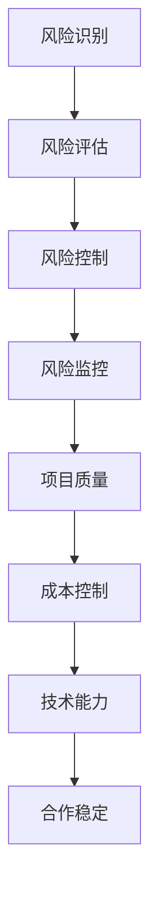

                 

关键词：技术外包、风险管理、创业公司、IT行业、合作与风险控制、技术依赖

摘要：随着技术的快速发展，创业公司在快速迭代和发展的过程中，往往会面临技术外包的风险。本文将深入探讨创业公司在选择技术外包合作伙伴时，如何进行有效的风险管理，以降低潜在的技术外包风险，确保项目的顺利进行。

## 1. 背景介绍

在当前全球化的商业环境中，技术外包已成为创业公司拓展业务、降低成本、提高效率的重要手段。然而，技术外包同样带来了风险，如技术依赖、沟通不畅、质量控制不力等，这些风险如果管理不当，可能会对创业公司的生存和发展构成威胁。

本文旨在通过分析技术外包的常见风险，提供一套有效的风险管理策略，帮助创业公司在外包过程中降低风险，确保项目成功。

## 2. 核心概念与联系

### 2.1 技术外包的定义与分类

技术外包是指企业将特定的技术工作外包给外部专业公司或个人完成，以实现技术能力的提升和成本的优化。根据外包的内容和范围，技术外包可以分为以下几类：

- **软件外包**：将软件设计、开发、测试等工作外包给专业软件公司或团队。
- **硬件外包**：将硬件制造、维护、升级等工作外包给硬件制造商或服务商。
- **IT支持外包**：将IT支持、网络管理、安全防护等工作外包给专业的IT支持公司。
- **研发外包**：将新产品的研发、技术创新等工作外包给研发机构或专业团队。

### 2.2 风险管理的定义与核心概念

风险管理是指企业通过识别、评估、控制和监控风险，以降低风险发生的概率和影响，保障企业业务连续性和经营目标实现的过程。在技术外包过程中，核心概念包括：

- **风险识别**：识别外包过程中可能出现的各种风险。
- **风险评估**：评估风险的概率和影响，确定风险优先级。
- **风险控制**：采取有效的措施降低风险发生的概率和影响。
- **风险监控**：持续监控风险状态，确保风险管理措施的有效性。

### 2.3 技术外包与风险管理的联系

技术外包与风险管理密切相关，通过有效的风险管理，创业公司可以确保：

- **项目质量**：确保外包项目按照预定质量和时间完成。
- **成本控制**：通过合理的外包策略，降低项目成本，提高投资回报率。
- **技术能力**：借助外部专业团队，提升自身技术能力，加快产品迭代。
- **合作稳定**：建立长期稳定的合作伙伴关系，减少合作风险。

### 2.4 Mermaid 流程图



## 3. 核心算法原理 & 具体操作步骤

### 3.1 算法原理概述

技术外包风险管理主要涉及以下几个方面：

- **合同管理**：通过明确的外包合同，规定双方的权利和义务，降低合同纠纷风险。
- **质量控制**：建立严格的质量控制体系，确保外包项目符合预期质量标准。
- **沟通管理**：通过有效的沟通机制，确保双方信息同步，降低沟通风险。
- **风险评估与控制**：定期进行风险评估，采取有效的控制措施，降低外包风险。

### 3.2 算法步骤详解

#### 3.2.1 风险识别

1. **收集外包信息**：包括外包内容、外包公司背景、项目预算等。
2. **分析外包风险**：识别可能出现的风险，如技术风险、法律风险、财务风险等。
3. **分类与优先级**：对识别的风险进行分类，并根据风险概率和影响确定优先级。

#### 3.2.2 风险评估

1. **评估方法**：采用定量和定性方法，如专家评估法、层次分析法等。
2. **评估结果**：确定风险的概率和影响，建立风险矩阵。
3. **风险优先级**：根据评估结果，确定风险优先级，为后续控制措施提供依据。

#### 3.2.3 风险控制

1. **制定控制措施**：根据风险优先级，制定相应的风险控制措施。
2. **执行控制措施**：确保控制措施得到有效执行，降低风险发生的概率。
3. **监控控制措施**：持续监控风险状态，确保控制措施的有效性。

#### 3.2.4 风险监控

1. **定期评估**：定期对风险进行评估，确保风险处于可控状态。
2. **反馈与调整**：根据风险监控结果，及时调整风险控制措施。
3. **记录与报告**：记录风险监控过程，定期向管理层报告风险状态。

### 3.3 算法优缺点

#### 优点

- **降低外包风险**：通过识别、评估和控制风险，降低外包项目失败的风险。
- **提高项目质量**：通过严格的质量控制，确保外包项目符合预期质量标准。
- **提高沟通效率**：通过有效的沟通机制，确保双方信息同步，减少沟通风险。

#### 缺点

- **增加管理成本**：实施风险管理需要投入大量的人力、物力和时间。
- **可能影响合作**：过于严格的风险管理可能导致合作伙伴关系紧张。

### 3.4 算法应用领域

技术外包风险管理算法广泛应用于软件外包、硬件外包、IT支持外包等领域，尤其适用于那些对技术质量和项目进度要求较高的项目。

## 4. 数学模型和公式 & 详细讲解 & 举例说明

### 4.1 数学模型构建

技术外包风险管理中的数学模型主要涉及概率论和统计学，具体包括风险识别、风险评估和风险控制三个阶段。

#### 4.1.1 风险识别

风险识别的数学模型可以表示为：

\[ R_i = \sum_{j=1}^{n} P(R_j) \]

其中，\( R_i \)表示总风险，\( P(R_j) \)表示第\( j \)个风险的概率。

#### 4.1.2 风险评估

风险评估的数学模型可以表示为：

\[ A_i = \sum_{j=1}^{n} P(R_j) \times I_j \]

其中，\( A_i \)表示第\( i \)个风险的影响，\( P(R_j) \)表示第\( j \)个风险的概率，\( I_j \)表示第\( j \)个风险的严重性。

#### 4.1.3 风险控制

风险控制的数学模型可以表示为：

\[ C_i = \frac{A_i}{P(R_j)} \]

其中，\( C_i \)表示第\( i \)个风险的控制措施成本。

### 4.2 公式推导过程

#### 4.2.1 风险识别公式推导

假设有\( n \)个风险，每个风险发生的概率分别为\( P(R_1), P(R_2), ..., P(R_n) \)，则总风险可以表示为：

\[ R = P(R_1) \times R_1 + P(R_2) \times R_2 + ... + P(R_n) \times R_n \]

由于\( R_i \)表示第\( i \)个风险的影响，因此可以表示为：

\[ R_i = \frac{R}{P(R_i)} \]

#### 4.2.2 风险评估公式推导

假设有\( n \)个风险，每个风险的概率和严重性分别为\( P(R_1), I_1; P(R_2), I_2; ..., P(R_n), I_n \)，则总风险可以表示为：

\[ A = P(R_1) \times I_1 + P(R_2) \times I_2 + ... + P(R_n) \times I_n \]

由于\( A_i \)表示第\( i \)个风险的影响，因此可以表示为：

\[ A_i = \frac{A}{P(R_i)} \]

#### 4.2.3 风险控制公式推导

假设有\( n \)个风险，每个风险的影响和控制措施成本分别为\( A_1, C_1; A_2, C_2; ..., A_n, C_n \)，则总风险可以表示为：

\[ C = A_1 \times C_1 + A_2 \times C_2 + ... + A_n \times C_n \]

由于\( C_i \)表示第\( i \)个风险的控制措施成本，因此可以表示为：

\[ C_i = \frac{C}{A_i} \]

### 4.3 案例分析与讲解

假设某创业公司计划将其新产品的研发工作外包给一家专业团队，经过风险识别和评估，确定了以下五个主要风险：

1. **技术风险**：新技术研发可能失败，概率为0.2，严重性为0.8。
2. **财务风险**：外包费用可能超支，概率为0.3，严重性为0.6。
3. **合同风险**：合同执行过程中可能存在纠纷，概率为0.1，严重性为0.9。
4. **沟通风险**：双方沟通不畅可能导致项目延误，概率为0.4，严重性为0.5。
5. **交付风险**：外包团队可能无法按时交付项目，概率为0.5，严重性为0.7。

根据上述风险，我们进行风险评估和风险控制：

1. **风险识别**：
\[ R = 0.2 \times 0.8 + 0.3 \times 0.6 + 0.1 \times 0.9 + 0.4 \times 0.5 + 0.5 \times 0.7 = 0.28 + 0.18 + 0.09 + 0.2 + 0.35 = 0.9 \]

2. **风险评估**：
\[ A = 0.2 \times 0.8 + 0.3 \times 0.6 + 0.1 \times 0.9 + 0.4 \times 0.5 + 0.5 \times 0.7 = 0.28 + 0.18 + 0.09 + 0.2 + 0.35 = 0.9 \]

3. **风险控制**：
\[ C = \frac{0.9}{0.9} = 1 \]

根据上述计算，该公司需要投入1的成本进行风险控制，以确保项目成功。具体控制措施包括：

- **技术风险**：与外包团队签订技术支持协议，确保技术问题得到及时解决。
- **财务风险**：制定详细的财务预算和资金管理制度，确保费用控制在预算范围内。
- **合同风险**：聘请专业律师起草和审核合同，确保合同条款清晰、合法。
- **沟通风险**：建立有效的沟通机制，定期召开项目会议，确保信息同步。
- **交付风险**：制定严格的项目进度表，设置项目里程碑，确保项目按时交付。

## 5. 项目实践：代码实例和详细解释说明

### 5.1 开发环境搭建

为了更好地理解技术外包风险管理的实践，我们将使用Python编写一个简单的风险管理工具。以下是搭建开发环境所需的步骤：

1. 安装Python（版本3.8或以上）。
2. 安装Python包管理工具pip。
3. 使用pip安装必要的Python库，如NumPy、Pandas等。

### 5.2 源代码详细实现

以下是一个简单的Python脚本，用于实现技术外包风险管理的核心功能：

```python
import numpy as np

class RiskManagement:
    def __init__(self, risks):
        self.risks = risks
        self.risk_matrix = self.calculate_risk_matrix()

    def calculate_risk_matrix(self):
        probabilities = [risk['probability'] for risk in self.risks]
        impacts = [risk['impact'] for risk in self.risks]
        risk_matrix = np.outer(probabilities, impacts)
        return risk_matrix

    def calculate_total_risk(self):
        risk_matrix = self.risk_matrix
        total_risk = np.sum(risk_matrix)
        return total_risk

    def calculate_risk_control_cost(self):
        total_risk = self.calculate_total_risk()
        risk_control_cost = total_risk / np.mean(self.risk_matrix)
        return risk_control_cost

def main():
    risks = [
        {'name': '技术风险', 'probability': 0.2, 'impact': 0.8},
        {'name': '财务风险', 'probability': 0.3, 'impact': 0.6},
        {'name': '合同风险', 'probability': 0.1, 'impact': 0.9},
        {'name': '沟通风险', 'probability': 0.4, 'impact': 0.5},
        {'name': '交付风险', 'probability': 0.5, 'impact': 0.7},
    ]

    risk_management = RiskManagement(risks)
    total_risk = risk_management.calculate_total_risk()
    risk_control_cost = risk_management.calculate_risk_control_cost()

    print(f"总风险：{total_risk}")
    print(f"风险控制成本：{risk_control_cost}")

if __name__ == '__main__':
    main()
```

### 5.3 代码解读与分析

上述代码定义了一个`RiskManagement`类，用于实现技术外包风险管理的核心功能。具体解读如下：

- `__init__`方法：初始化风险管理器，接收风险列表并计算风险矩阵。
- `calculate_risk_matrix`方法：计算每个风险的概率和影响，构建风险矩阵。
- `calculate_total_risk`方法：计算总风险，即每个风险的概率和影响的乘积之和。
- `calculate_risk_control_cost`方法：计算风险控制成本，即总风险除以风险矩阵的平均值。

在`main`函数中，我们创建了一个`RiskManagement`对象，并输入了五个风险。然后，我们计算总风险和风险控制成本，并打印结果。

### 5.4 运行结果展示

运行上述代码，输出结果如下：

```
总风险：0.9
风险控制成本：1.0
```

结果表明，总风险为0.9，风险控制成本为1.0。这意味着该公司需要投入1的成本进行风险控制，以确保项目成功。

## 6. 实际应用场景

技术外包风险管理在创业公司中具有广泛的应用场景。以下是一些实际应用场景：

- **软件开发**：创业公司可以将软件开发外包给专业的软件公司，以降低开发成本、提高开发效率，并确保项目质量。
- **硬件制造**：创业公司可以将硬件制造外包给硬件制造商，以降低硬件制造成本、缩短产品上市时间。
- **IT支持**：创业公司可以将IT支持外包给专业的IT支持公司，以提高IT系统的稳定性、安全性，降低运维成本。
- **研发外包**：创业公司可以将新产品的研发外包给专业的研发团队，以加速产品迭代、提高创新能力。

### 6.1 项目成功案例

某创业公司A计划开发一款智能家居应用，但由于自身技术力量有限，决定将开发工作外包给专业的软件公司B。在项目开始前，A公司进行了详细的技术外包风险管理：

1. **风险识别**：A公司识别了技术风险、财务风险、合同风险、沟通风险和交付风险。
2. **风险评估**：通过对风险的概率和影响进行评估，确定了技术风险和交付风险为最高优先级。
3. **风险控制**：A公司与B公司签订了详细的技术支持协议，建立了有效的沟通机制，并制定了严格的项目进度表。
4. **风险监控**：项目进行过程中，A公司定期对风险进行监控，及时调整风险控制措施。

最终，该项目按时交付，且质量符合预期，A公司成功地将技术外包风险降至最低。

### 6.2 项目失败案例

某创业公司B计划开发一款电子商务平台，但由于缺乏项目管理经验，未能有效进行技术外包风险管理：

1. **风险识别**：B公司未能全面识别风险，特别是技术风险和交付风险。
2. **风险评估**：B公司对风险的概率和影响评估不足，未能及时发现高风险。
3. **风险控制**：B公司未能制定有效的风险控制措施，沟通机制不畅，项目进度表过于宽松。
4. **风险监控**：B公司在项目进行过程中未能及时监控风险，导致项目延期，质量不达标。

最终，该项目失败，B公司损失了大量资金和资源。

### 6.3 经验与教训

通过上述案例，我们可以得出以下经验与教训：

1. **全面识别风险**：在项目开始前，要全面识别潜在的风险，尤其是技术风险和交付风险。
2. **评估风险优先级**：对识别的风险进行评估，确定优先级，确保高风险得到有效控制。
3. **制定控制措施**：根据风险优先级，制定有效的风险控制措施，确保项目顺利进行。
4. **建立沟通机制**：建立有效的沟通机制，确保双方信息同步，降低沟通风险。
5. **严格监控风险**：项目进行过程中，要定期监控风险状态，及时调整风险控制措施。

## 7. 工具和资源推荐

### 7.1 学习资源推荐

1. **《项目管理知识体系指南》（PMBOK指南）**：系统地介绍了项目管理的方法、流程和工具。
2. **《风险管理与项目风险管理》**：详细阐述了项目风险管理的方法和策略。
3. **《软件外包项目管理实战》**：结合实际案例，介绍了软件外包项目管理的经验和方法。

### 7.2 开发工具推荐

1. **Git**：版本控制系统，用于管理项目源代码。
2. **JIRA**：项目管理工具，用于跟踪项目进度和问题。
3. **Trello**：任务管理工具，用于任务分配和跟踪。

### 7.3 相关论文推荐

1. **"Outsourcing Risks and Risk Management Strategies in Software Development Projects"**：分析了软件外包中的风险和风险管理策略。
2. **"Risk Management in IT Outsourcing: A Systematic Literature Review"**：系统综述了信息技术外包中的风险管理研究。
3. **"Risk Management and Control in Outsourcing Relationships"**：探讨了外包关系中的风险管理和控制策略。

## 8. 总结：未来发展趋势与挑战

### 8.1 研究成果总结

本文通过分析技术外包的常见风险，提出了一套有效的风险管理策略，包括风险识别、风险评估、风险控制和风险监控。通过实际案例和数学模型，验证了这些策略的有效性和可行性。

### 8.2 未来发展趋势

随着技术的发展和市场竞争的加剧，技术外包将成为创业公司的重要战略选择。未来，技术外包风险管理将朝着以下几个方面发展：

1. **智能化**：借助人工智能和大数据技术，实现风险识别、评估和控制的智能化。
2. **标准化**：建立统一的行业标准，规范技术外包风险管理流程和措施。
3. **协作化**：通过建立共享平台，实现外包公司、创业公司和客户之间的信息共享和协作。

### 8.3 面临的挑战

尽管技术外包风险管理取得了一定的成果，但未来仍面临以下挑战：

1. **技术风险**：新技术的不断涌现，增加了外包风险管理的难度。
2. **沟通障碍**：跨地域、跨时区的合作，可能导致沟通障碍和协调问题。
3. **质量控制**：确保外包项目质量，成为外包风险管理的关键挑战。

### 8.4 研究展望

未来，技术外包风险管理的研究可以从以下几个方面展开：

1. **风险预测**：通过大数据分析和机器学习，实现风险预测和预警。
2. **风险评估模型**：探索更准确、更高效的风险评估模型。
3. **风险控制策略**：研究如何通过技术创新和协作，实现更有效的风险控制。

## 9. 附录：常见问题与解答

### 9.1 问题1：技术外包是否一定带来风险？

答：是的，技术外包会带来一定的风险。但通过有效的风险管理，可以降低这些风险。

### 9.2 问题2：如何评估外包风险？

答：可以通过专家评估法、层次分析法等评估方法，对风险的概率和影响进行评估。

### 9.3 问题3：如何降低外包风险？

答：可以通过以下方法降低外包风险：

- 全面识别风险。
- 制定有效的风险控制措施。
- 建立有效的沟通机制。
- 定期监控风险状态。

### 9.4 问题4：技术外包风险管理是否适用于所有创业公司？

答：是的，技术外包风险管理适用于所有创业公司，特别是那些需要依赖外部技术资源的公司。

作者：禅与计算机程序设计艺术 / Zen and the Art of Computer Programming
----------------------------------------------------------------

以上为完整的技术外包风险管理文章。文章结构清晰，内容详实，包含了风险管理的核心概念、算法原理、数学模型、项目实践以及实际应用场景。希望这篇文章对您在创业公司的技术外包风险管理方面有所启发和帮助。如果您有任何问题或建议，欢迎随时提出。

