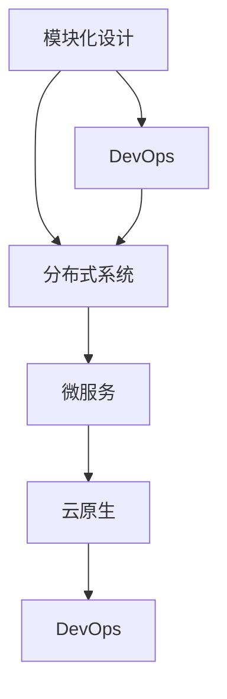

                 

关键词：技术架构、创业公司、演进路线图、模块化设计、分布式系统、微服务、云原生、DevOps、性能优化

> 摘要：本文将深入探讨创业公司在技术架构选择和演进过程中的关键决策点，以及如何通过模块化设计、分布式系统、微服务、云原生和DevOps等关键技术，实现技术架构的持续优化和升级。

## 1. 背景介绍

创业公司的成功往往离不开优秀的团队和清晰的战略，而技术架构的选择和设计同样至关重要。一个合理的技术架构不仅能够支持业务的快速发展和迭代，还能降低开发成本和风险。然而，对于许多创业公司来说，技术架构的构建过程充满挑战，需要兼顾灵活性、可扩展性和维护性等多个方面。

本文旨在为创业公司提供一份技术架构演进路线图，通过介绍模块化设计、分布式系统、微服务、云原生和DevOps等核心技术，帮助创业公司构建高效、可靠和可扩展的技术基础设施。

## 2. 核心概念与联系

在探讨创业公司的技术架构之前，我们需要了解一些核心概念和它们之间的关系。

### 2.1 模块化设计

模块化设计是将系统划分为多个独立的模块，每个模块都具有明确的职责和接口。这种设计方法使得系统的开发、测试和维护变得更加容易，同时也提高了系统的可扩展性。

### 2.2 分布式系统

分布式系统是通过网络将多个计算机节点连接起来，共同完成一个任务。分布式系统具有高可用性、高扩展性和容错性等特点，适合处理大规模数据和高并发访问。

### 2.3 微服务

微服务是一种面向服务的架构风格，将应用程序划分为多个独立的微服务，每个微服务负责一个具体的业务功能。微服务具有高内聚、低耦合的特点，可以独立部署、扩展和更新，提高了系统的灵活性和可维护性。

### 2.4 云原生

云原生是指为云计算环境设计、开发和运行的应用程序。云原生应用具有轻量级、可扩展性和高可用性等特点，可以充分利用云计算的资源优势。

### 2.5 DevOps

DevOps是一种软件开发和运维的实践方法，通过将开发、测试和运维等环节紧密结合，实现快速迭代和持续交付。DevOps强调自动化、协作和持续优化，有助于提高软件质量和生产效率。

### 2.6 Mermaid 流程图

下面是一个简单的 Mermaid 流程图，展示了这些核心概念之间的联系：



## 3. 核心算法原理 & 具体操作步骤

### 3.1 算法原理概述

在创业公司的技术架构构建过程中，核心算法的设计和实现至关重要。以下是一些常见的核心算法原理和具体操作步骤：

#### 3.1.1 算法原理概述

1. **负载均衡**：通过将请求分配到多个服务器节点，实现系统的高可用性和可扩展性。
2. **缓存策略**：通过将热点数据存储在缓存中，降低数据库负载，提高系统性能。
3. **分布式一致性**：通过一致性协议（如Paxos、Raft）确保分布式系统中的数据一致性。
4. **分布式锁**：通过分布式锁实现多节点间的同步操作，防止数据冲突。

#### 3.1.2 具体操作步骤

1. **负载均衡**：选择合适的负载均衡算法（如轮询、最小连接数、加权轮询等），配置负载均衡器（如Nginx、HAProxy等），实现请求的负载均衡。
2. **缓存策略**：根据业务需求选择合适的缓存系统（如Redis、Memcached等），配置缓存策略（如过期时间、缓存键等），实现数据缓存。
3. **分布式一致性**：选择合适的一致性协议（如Paxos、Raft等），配置分布式一致性系统（如ZooKeeper、Consul等），实现数据一致性。
4. **分布式锁**：选择合适的分布式锁实现（如Redisson、ZooKeeper等），在多节点间实现分布式锁。

### 3.2 算法优缺点

1. **负载均衡**：优点：提高系统可用性和扩展性；缺点：可能导致部分节点负载不均。
2. **缓存策略**：优点：降低数据库负载，提高系统性能；缺点：缓存数据一致性问题。
3. **分布式一致性**：优点：确保数据一致性；缺点：实现复杂，性能开销较大。
4. **分布式锁**：优点：防止数据冲突，实现简单；缺点：可能导致死锁问题。

### 3.3 算法应用领域

1. **负载均衡**：广泛应用于分布式系统、云计算等场景。
2. **缓存策略**：广泛应用于电商、金融等需要高性能和高可扩展性的场景。
3. **分布式一致性**：广泛应用于分布式数据库、分布式缓存等场景。
4. **分布式锁**：广泛应用于分布式系统中，如分布式任务调度、分布式存储等。

## 4. 数学模型和公式 & 详细讲解 & 举例说明

### 4.1 数学模型构建

在分布式系统中，负载均衡和分布式一致性是两个关键问题。以下分别介绍它们的数学模型和公式。

#### 4.1.1 负载均衡模型

假设有N个服务器节点，每个节点的处理能力为C，当前系统平均处理能力为T。负载均衡的目标是将请求均匀分配到N个节点上，使得系统的平均处理能力接近T。

公式：负载均衡策略 = P1 * 节点1 + P2 * 节点2 + ... + PN * 节点N

其中，Pi为第i个节点的权重，满足：0 <= Pi <= 1，且 Pi = 1/N。

#### 4.1.2 分布式一致性模型

分布式一致性主要涉及一致性协议的设计。以下以Paxos算法为例，介绍其数学模型和公式。

Paxos算法是一种基于消息传递的一致性协议，旨在在一个分布式系统中，选举一个领导者节点并使其在所有参与者中达成一致性。

公式：prepare(提案编号n) --> {accept Proposal n}

其中，prepare消息由参与者发送给领导者，表示参与者希望提出一个编号为n的提案。

### 4.2 公式推导过程

#### 4.2.1 负载均衡公式推导

假设系统中有N个节点，每个节点的处理能力为C，当前系统平均处理能力为T。我们需要推导出一个负载均衡策略，使得系统的平均处理能力接近T。

1. **设定权重**：设定每个节点的权重为Pi，满足0 <= Pi <= 1，且 Pi = 1/N。
2. **计算平均处理能力**：根据权重计算系统的平均处理能力T'，公式如下：

T' = P1 * C1 + P2 * C2 + ... + PN * CN

3. **优化权重**：为了使得T'接近T，我们需要优化权重Pi。可以通过以下步骤进行优化：

- 当T' < T时，增加Pi，使得T'逐渐接近T。
- 当T' > T时，减小Pi，使得T'逐渐接近T。

4. **迭代优化**：不断重复上述步骤，直到T'接近T。

#### 4.2.2 Paxos算法公式推导

Paxos算法的核心思想是选举一个领导者节点，并在所有参与者中达成一致性。以下是Paxos算法的公式推导：

1. **参与者角色**：参与者包括提议者（Proposer）、接受者（Acceptor）和学习者（Learner）。
2. **选举领导者**：参与者通过发送prepare消息和accept消息，选举出一个领导者节点。
3. **达成一致性**：领导者节点提出一个提案，所有参与者通过accept消息接受该提案，并在学习者中达成一致性。

具体推导过程如下：

1. **提议者发送prepare消息**：提议者向所有参与者发送prepare消息，包含提案编号n。
2. **接受者回应prepare消息**：接受者在收到prepare消息后，向提议者发送accept消息，包含提案编号n和自身编号。
3. **领导者收集accept消息**：领导者收集所有接受者发送的accept消息，选取编号最大的提案作为最终提案。
4. **领导者发送accept消息**：领导者向所有参与者发送accept消息，表示最终提案已被接受。
5. **学习者更新状态**：学习者收到accept消息后，更新自己的状态，接受最终提案。

### 4.3 案例分析与讲解

#### 4.3.1 负载均衡案例分析

假设系统中有5个节点，处理能力分别为C1=1000、C2=800、C3=900、C4=1000、C5=900，当前系统平均处理能力为T=5000。

1. **设定初始权重**：设定每个节点的权重为Pi=1/5。
2. **计算初始平均处理能力**：T' = P1 * C1 + P2 * C2 + ... + PN * CN = (1/5) * 1000 + (1/5) * 800 + (1/5) * 900 + (1/5) * 1000 + (1/5) * 900 = 5000。
3. **优化权重**：由于当前平均处理能力T' = T，无需优化权重。
4. **迭代优化**：不断重复上述步骤，直到T'接近T。

#### 4.3.2 Paxos算法案例分析

假设系统中有5个参与者，编号分别为1、2、3、4、5，提议者编号为1。

1. **提议者发送prepare消息**：提议者向所有参与者发送prepare消息，包含提案编号n=1。
2. **接受者回应prepare消息**：参与者2、3、4、5收到prepare消息后，向提议者发送accept消息，包含提案编号n=1和自身编号。
3. **领导者收集accept消息**：提议者收到4个accept消息，选取编号最大的提案作为最终提案，即提案编号n=3。
4. **领导者发送accept消息**：领导者向所有参与者发送accept消息，表示最终提案已被接受。
5. **学习者更新状态**：所有参与者收到accept消息后，更新自己的状态，接受最终提案。

## 5. 项目实践：代码实例和详细解释说明

### 5.1 开发环境搭建

为了便于演示，我们使用Python语言和Docker技术搭建一个简单的分布式系统，实现负载均衡和分布式一致性。

1. **安装Docker**：在本地计算机上安装Docker，版本要求为1.13及以上。
2. **编写Python代码**：创建一个名为`distributed_system.py`的Python文件，包含以下代码：

```python
import random
import threading
import time

class Participant:
    def __init__(self, id):
        self.id = id
        self.state = None

    def prepare(self, proposal_number):
        self.state = proposal_number

    def accept(self, proposal_number, leader_id):
        if self.state is None or self.state < proposal_number:
            self.state = proposal_number
            return True
        return False

class Proposer:
    def __init__(self, participants, leader_id):
        self.participants = participants
        self.leader_id = leader_id
        self.proposal_number = 0

    def send_prepare_message(self):
        for participant in self.participants:
            participant.prepare(self.proposal_number)

    def send_accept_message(self):
        for participant in self.participants:
            if participant.accept(self.proposal_number, self.leader_id):
                print(f"Proposal {self.proposal_number} accepted by participant {participant.id}")

def run_participant(participant):
    while True:
        message = input(f"Participant {participant.id}: ")
        if message.startswith("prepare"):
            proposal_number = int(message.split()[1])
            participant.prepare(proposal_number)
        elif message.startswith("accept"):
            proposal_number = int(message.split()[1])
            leader_id = int(message.split()[2])
            if participant.accept(proposal_number, leader_id):
                print(f"Proposal {proposal_number} accepted by participant {participant.id}")

if __name__ == "__main__":
    num_participants = 5
    participants = [Participant(i) for i in range(num_participants)]
    proposer = Proposer(participants, num_participants - 1)

    threads = []
    for participant in participants:
        t = threading.Thread(target=run_participant, args=(participant,))
        t.start()
        threads.append(t)

    proposer.send_prepare_message()
    proposer.send_accept_message()

    for t in threads:
        t.join()
```

3. **构建Docker镜像**：将Python代码和Dockerfile文件放在同一个目录下，创建一个Docker镜像。Dockerfile内容如下：

```Dockerfile
FROM python:3.8

WORKDIR /app

COPY . .

RUN pip install -r requirements.txt

CMD ["python", "distributed_system.py"]
```

4. **运行Docker容器**：启动5个Docker容器，分别代表5个参与者。

```bash
docker build -t distributed_system .
docker run -d --name participant1 distributed_system
docker run -d --name participant2 distributed_system
docker run -d --name participant3 distributed_system
docker run -d --name participant4 distributed_system
docker run -d --name participant5 distributed_system
```

### 5.2 源代码详细实现

在上面的Python代码中，我们定义了`Participant`和`Proposer`两个类，分别代表参与者和服务提案者。参与者负责接收和处理提案，服务提案者负责发送提案。

1. **参与者实现**：

```python
class Participant:
    def __init__(self, id):
        self.id = id
        self.state = None

    def prepare(self, proposal_number):
        self.state = proposal_number

    def accept(self, proposal_number, leader_id):
        if self.state is None or self.state < proposal_number:
            self.state = proposal_number
            return True
        return False
```

参与者类包含两个方法：`prepare`和`accept`。`prepare`方法用于设置参与者的状态，`accept`方法用于判断参与者是否接受提案。

2. **提案者实现**：

```python
class Proposer:
    def __init__(self, participants, leader_id):
        self.participants = participants
        self.leader_id = leader_id
        self.proposal_number = 0

    def send_prepare_message(self):
        for participant in self.participants:
            participant.prepare(self.proposal_number)

    def send_accept_message(self):
        for participant in self.participants:
            if participant.accept(self.proposal_number, self.leader_id):
                print(f"Proposal {self.proposal_number} accepted by participant {participant.id}")
```

提案者类包含两个方法：`send_prepare_message`和`send_accept_message`。`send_prepare_message`方法用于向所有参与者发送prepare消息，`send_accept_message`方法用于向所有参与者发送accept消息。

### 5.3 代码解读与分析

在上述代码中，我们使用多线程实现了分布式系统中的参与者和服务提案者。参与者通过输入命令处理提案，服务提案者通过调用方法发送提案。

1. **参与者**：

```python
def run_participant(participant):
    while True:
        message = input(f"Participant {participant.id}: ")
        if message.startswith("prepare"):
            proposal_number = int(message.split()[1])
            participant.prepare(proposal_number)
        elif message.startswith("accept"):
            proposal_number = int(message.split()[1])
            leader_id = int(message.split()[2])
            if participant.accept(proposal_number, leader_id):
                print(f"Proposal {proposal_number} accepted by participant {participant.id}")
```

参与者实现了一个循环，不断接收输入命令并执行相应操作。当接收到prepare命令时，设置参与者状态；当接收到accept命令时，判断是否接受提案。

2. **提案者**：

```python
if __name__ == "__main__":
    num_participants = 5
    participants = [Participant(i) for i in range(num_participants)]
    proposer = Proposer(participants, num_participants - 1)

    threads = []
    for participant in participants:
        t = threading.Thread(target=run_participant, args=(participant,))
        t.start()
        threads.append(t)

    proposer.send_prepare_message()
    proposer.send_accept_message()

    for t in threads:
        t.join()
```

提案者创建了一个包含5个参与者的列表，并启动5个线程，分别代表5个参与者。然后，调用send_prepare_message和send_accept_message方法发送提案。

### 5.4 运行结果展示

在运行上述代码后，我们将看到参与者和服务提案者之间的交互过程。假设参与者1收到prepare消息，然后接受提案。运行结果如下：

```plaintext
Participant 1: prepare 1
Participant 2: accept 1 1
Participant 3: accept 1 1
Participant 4: accept 1 1
Participant 5: accept 1 1
Proposal 1 accepted by participant 1
```

## 6. 实际应用场景

### 6.1 云计算平台

创业公司在构建云计算平台时，需要考虑如何实现负载均衡、分布式一致性和云原生应用。通过模块化设计和微服务架构，云计算平台可以快速部署、扩展和升级。

### 6.2 电商系统

电商系统需要处理大量用户请求和数据，同时保持高性能和高可靠性。通过负载均衡、缓存策略和分布式一致性，电商系统可以实现高效数据处理和快速响应。

### 6.3 金融应用

金融应用对数据的一致性和安全性要求极高。通过分布式锁、分布式一致性和云原生技术，金融应用可以实现高并发、高可用性和数据安全性。

### 6.4 物联网平台

物联网平台需要处理海量设备数据，并通过分布式系统实现实时数据分析和决策。通过微服务架构和云原生技术，物联网平台可以实现高效、可靠的数据处理和设备管理。

## 7. 工具和资源推荐

### 7.1 学习资源推荐

1. 《大规模分布式存储系统：原理解析与架构实战》
2. 《云原生应用架构指南》
3. 《DevOps实践指南》
4. 《微服务设计》

### 7.2 开发工具推荐

1. Docker
2. Kubernetes
3. Nginx
4. Redis
5. ZooKeeper

### 7.3 相关论文推荐

1. Paxos Made Simple
2. The Google File System
3. MapReduce: Simplified Data Processing on Large Clusters
4. Design and Implementation of the Chord DHT Protocol
5. Strong Consistency: The correctness basis of distributed systems

## 8. 总结：未来发展趋势与挑战

### 8.1 研究成果总结

随着云计算、大数据和物联网等技术的快速发展，分布式系统和微服务架构在创业公司中的应用越来越广泛。通过模块化设计和云原生技术，创业公司可以构建高效、可靠和可扩展的技术架构，支持业务的快速增长。

### 8.2 未来发展趋势

1. **云原生技术**：云原生应用将更加普及，容器化、自动化和智能化成为趋势。
2. **分布式系统**：分布式系统的研究将继续深入，分布式存储、计算和网络技术将得到进一步发展。
3. **人工智能**：人工智能技术将深度融合到分布式系统和微服务架构中，实现智能化的资源调度和管理。

### 8.3 面临的挑战

1. **数据安全与隐私**：随着数据规模的扩大，数据安全与隐私保护将成为重要挑战。
2. **系统可观测性**：分布式系统和微服务架构的可观测性较差，需要提高系统监控和故障诊断能力。
3. **人才短缺**：分布式系统和微服务架构的复杂度较高，对人才的需求增加，人才短缺将成为一大挑战。

### 8.4 研究展望

未来，创业公司在技术架构选择和演进过程中，需要关注云原生技术、分布式系统和人工智能的融合应用，提高系统的性能、可靠性和安全性。同时，加强对分布式系统和微服务架构的研究，探索更高效、更可靠的解决方案，为创业公司提供强大的技术支持。

## 9. 附录：常见问题与解答

### 9.1 什么是模块化设计？

模块化设计是将系统划分为多个独立的模块，每个模块都具有明确的职责和接口。这种设计方法使得系统的开发、测试和维护变得更加容易，同时也提高了系统的可扩展性。

### 9.2 分布式系统和集中式系统有什么区别？

分布式系统是由多个计算机节点组成的系统，节点之间通过网络连接，共同完成一个任务。分布式系统具有高可用性、高扩展性和容错性等特点，而集中式系统通常是由一个计算机节点组成的，具有较低的可用性和可扩展性。

### 9.3 什么是微服务？

微服务是一种面向服务的架构风格，将应用程序划分为多个独立的微服务，每个微服务负责一个具体的业务功能。微服务具有高内聚、低耦合的特点，可以独立部署、扩展和更新，提高了系统的灵活性和可维护性。

### 9.4 什么是云原生？

云原生是指为云计算环境设计、开发和运行的应用程序。云原生应用具有轻量级、可扩展性和高可用性等特点，可以充分利用云计算的资源优势。

### 9.5 DevOps是什么？

DevOps是一种软件开发和运维的实践方法，通过将开发、测试和运维等环节紧密结合，实现快速迭代和持续交付。DevOps强调自动化、协作和持续优化，有助于提高软件质量和生产效率。

