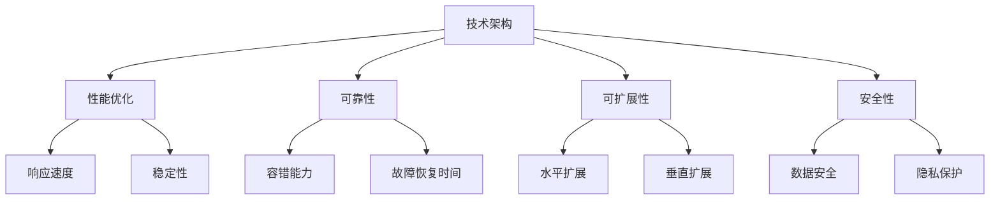

                 

关键词：创业公司，技术架构，评估指标，性能优化，可靠性，可扩展性，安全性

> 摘要：本文将探讨创业公司在构建技术架构时需要考虑的关键评估指标，包括性能、可靠性、可扩展性和安全性等方面。通过深入分析这些指标，企业可以更好地设计和优化其技术体系，为未来发展奠定坚实基础。

## 1. 背景介绍

随着互联网经济的蓬勃发展，越来越多的创业公司涌现出来，它们面临着激烈的市场竞争和快速变化的技术环境。技术架构作为企业的核心竞争力之一，其设计和实施直接影响到企业的长期发展和市场竞争力。因此，如何构建一个高效、可靠、安全且可扩展的技术架构，成为创业公司亟待解决的问题。

本文将从以下几个方面对创业公司的技术架构评估指标进行深入探讨：

1. **性能优化**：如何确保系统在高并发场景下仍能保持良好的响应速度和稳定性。
2. **可靠性**：如何保障系统的稳定性和容错能力，以应对各种异常情况。
3. **可扩展性**：如何设计系统以适应未来业务的发展需求。
4. **安全性**：如何保护系统的数据安全和隐私，防范各种安全威胁。

## 2. 核心概念与联系

在讨论上述评估指标之前，我们首先需要了解一些核心概念。技术架构是指企业为实现业务目标而构建的一系列技术组件和系统的组合。而评估指标则是用于衡量这些技术组件和系统性能的一系列量化标准。

为了更好地理解这些概念之间的关系，我们可以使用Mermaid流程图来表示它们之间的联系：



### 2.1 性能优化

性能优化是指通过一系列技术手段，提高系统的响应速度和稳定性，确保在高并发场景下仍能提供良好的用户体验。

### 2.2 可靠性

可靠性是指系统的稳定性和容错能力，确保系统在各种异常情况下仍能正常运行。

### 2.3 可扩展性

可扩展性是指系统在设计时考虑未来业务发展需求，能够灵活地增加或减少资源，以满足业务增长。

### 2.4 安全性

安全性是指保护系统的数据安全和隐私，防范各种安全威胁，确保系统的安全稳定运行。

## 3. 核心算法原理 & 具体操作步骤

### 3.1 算法原理概述

在技术架构评估中，核心算法原理主要包括以下几个方面：

1. **负载均衡**：通过将请求分配到不同的服务器上，提高系统的整体性能和可靠性。
2. **缓存策略**：通过将频繁访问的数据存储在内存中，减少数据库访问次数，提高系统响应速度。
3. **分布式存储**：通过将数据分布存储在多个节点上，提高系统的容错能力和数据可靠性。
4. **安全防护**：通过一系列安全措施，防止恶意攻击和数据泄露。

### 3.2 算法步骤详解

1. **负载均衡**：

   - 选择合适的负载均衡算法（如轮询、最小连接数等）。
   - 配置负载均衡器，将请求分配到不同的服务器上。
   - 监控服务器负载，动态调整负载均衡策略。

2. **缓存策略**：

   - 分析系统中的热点数据，将其存储在缓存中。
   - 选择合适的缓存算法（如LRU、LFU等）。
   - 定期刷新缓存，确保数据的准确性。

3. **分布式存储**：

   - 设计分布式存储架构，如分布式文件系统或数据库集群。
   - 数据分片和复制，确保数据的可靠性和一致性。
   - 监控存储节点状态，进行自动故障转移和扩容。

4. **安全防护**：

   - 安装和应用安全防护工具（如防火墙、入侵检测系统等）。
   - 定期进行安全审计和漏洞扫描。
   - 建立安全应急响应机制，快速应对安全事件。

### 3.3 算法优缺点

1. **负载均衡**：

   - 优点：提高系统性能和可靠性，均衡服务器负载。
   - 缺点：可能导致部分服务器负载过高，影响用户体验。

2. **缓存策略**：

   - 优点：提高系统响应速度，降低数据库访问压力。
   - 缺点：缓存数据的准确性可能受到影响，需要定期刷新。

3. **分布式存储**：

   - 优点：提高数据可靠性和容错能力，支持海量数据存储。
   - 缺点：分布式存储系统的设计和维护相对复杂。

4. **安全防护**：

   - 优点：防范恶意攻击和数据泄露，确保系统安全。
   - 缺点：安全防护措施可能影响系统性能，需要平衡安全和性能。

### 3.4 算法应用领域

1. **负载均衡**：适用于Web应用、大数据处理、视频直播等场景。
2. **缓存策略**：适用于电商平台、内容分发、金融系统等场景。
3. **分布式存储**：适用于云存储、大数据分析、企业级应用等场景。
4. **安全防护**：适用于所有需要保障数据安全和系统安全的场景。

## 4. 数学模型和公式 & 详细讲解 & 举例说明

### 4.1 数学模型构建

为了更好地评估创业公司的技术架构，我们可以构建以下数学模型：

1. **性能评估模型**：包括响应时间、吞吐量、并发量等指标。
2. **可靠性评估模型**：包括故障率、恢复时间、容错能力等指标。
3. **可扩展性评估模型**：包括资源利用率、扩容成本、业务增长等指标。
4. **安全性评估模型**：包括数据泄露率、安全事件响应时间、安全防护成本等指标。

### 4.2 公式推导过程

以性能评估模型为例，我们假设系统的响应时间为t，吞吐量为Q，并发量为C，则可以构建以下公式：

1. **响应时间**：t = Q / C
2. **吞吐量**：Q = T × R × P
   - T：系统每秒处理请求数
   - R：请求处理时间
   - P：系统可用性

### 4.3 案例分析与讲解

假设某电商平台的系统需求如下：

1. 响应时间：≤ 100ms
2. 吞吐量：≥ 1000 QPS（每秒请求数）
3. 并发量：≥ 1000

根据上述需求，我们可以构建以下数学模型：

1. **响应时间**：t = Q / C ≤ 100ms
2. **吞吐量**：Q = T × R × P ≥ 1000 QPS

通过调整系统配置和优化算法，如增加服务器节点、优化缓存策略等，可以满足上述性能需求。

## 5. 项目实践：代码实例和详细解释说明

### 5.1 开发环境搭建

假设我们使用Spring Boot和MySQL作为开发环境，搭建一个简单的电商平台：

1. 搭建Spring Boot项目，添加必要的依赖库。
2. 配置MySQL数据库，创建电商平台的数据库表。
3. 编写基本的CRUD接口，实现商品查询、添加、删除等功能。

### 5.2 源代码详细实现

以下是一个简单的商品查询接口的实现：

```java
@RestController
@RequestMapping("/products")
public class ProductController {

    @Autowired
    private ProductService productService;

    @GetMapping("/{id}")
    public ResponseEntity<Product> getProductById(@PathVariable Long id) {
        Product product = productService.getProductById(id);
        if (product != null) {
            return ResponseEntity.ok(product);
        } else {
            return ResponseEntity.notFound().build();
        }
    }
}
```

### 5.3 代码解读与分析

1. 接口使用GET方法，通过路径参数接收商品ID。
2. 调用ProductService类的getProductById方法查询商品。
3. 如果查询到商品，返回200状态码和商品对象；否则，返回404状态码。

通过以上代码，我们可以实现商品查询功能。在实际开发中，我们还需要考虑性能优化、可靠性、安全性等方面的需求，如添加缓存、数据库连接池、鉴权机制等。

### 5.4 运行结果展示

1. 访问商品详情页面，输入商品ID，如123456。
2. 系统返回商品详细信息，如商品名称、价格、描述等。

## 6. 实际应用场景

### 6.1 电商应用

电商应用是创业公司常见的技术架构应用场景之一。电商平台需要处理海量的商品信息、订单数据和用户请求，因此对性能、可靠性和安全性有较高的要求。通过合理的架构设计和优化，电商平台可以提供流畅的购物体验。

### 6.2 社交应用

社交应用如朋友圈、微博等，需要处理大量用户交互数据、图片和视频等。社交应用对性能和可扩展性有较高要求，同时需要保障用户数据的安全和隐私。通过分布式架构、缓存策略和加密技术等，社交应用可以实现高效的数据处理和存储。

### 6.3 金融应用

金融应用如银行、证券、保险等，对数据安全和可靠性有严格的要求。金融应用需要处理大量的交易数据，确保交易的安全和准确性。通过分布式存储、容错机制和安全防护措施，金融应用可以保障系统的稳定运行。

## 7. 工具和资源推荐

### 7.1 学习资源推荐

1. **《深入理解计算机系统》**：详细讲解计算机系统的组成和原理，有助于构建高效的技术架构。
2. **《大规模分布式存储系统原理与实践》**：介绍分布式存储系统的设计和实现方法，适用于电商、金融等场景。
3. **《网络安全技术实践》**：涵盖网络安全的基础知识和实战技巧，适用于构建安全可靠的技术架构。

### 7.2 开发工具推荐

1. **Spring Boot**：用于快速开发Java Web应用，支持微服务架构。
2. **Docker**：用于容器化部署和管理应用，提高系统可扩展性和部署效率。
3. **Kubernetes**：用于自动化部署和管理容器化应用，实现集群管理和资源调度。

### 7.3 相关论文推荐

1. **《MapReduce: Simplified Data Processing on Large Clusters》**：介绍MapReduce算法及其在大规模数据处理中的应用。
2. **《Consistency Models for Parallel Programming》**：讨论分布式系统的数据一致性问题。
3. **《Secure Multiparty Computation》**：介绍多方安全计算技术，用于保障数据隐私和安全。

## 8. 总结：未来发展趋势与挑战

### 8.1 研究成果总结

本文总结了创业公司技术架构评估的关键指标，包括性能优化、可靠性、可扩展性和安全性等方面。通过深入分析这些指标，企业可以更好地设计和优化其技术体系，为未来发展奠定坚实基础。

### 8.2 未来发展趋势

1. **云计算和容器化**：云计算和容器化技术将进一步提高系统的可扩展性和部署效率。
2. **大数据和人工智能**：大数据和人工智能技术将在数据分析和决策支持方面发挥重要作用。
3. **区块链和加密技术**：区块链和加密技术将进一步提升数据安全和隐私保护水平。

### 8.3 面临的挑战

1. **系统复杂性**：随着系统规模的扩大，系统的复杂性和维护成本将不断增加。
2. **安全威胁**：网络攻击和数据泄露等安全威胁将不断增多，对系统的安全防护提出更高要求。
3. **人才需求**：高效的技术架构设计需要专业的人才团队，对企业的招聘和培养能力提出挑战。

### 8.4 研究展望

未来，创业公司需要持续关注技术趋势，不断优化和提升其技术架构。同时，加强人才培养和团队建设，提高企业的技术创新能力，为未来发展奠定坚实基础。

## 9. 附录：常见问题与解答

### 9.1 技术架构评估指标有哪些？

技术架构评估指标主要包括性能、可靠性、可扩展性和安全性等方面。具体包括响应时间、吞吐量、故障率、恢复时间、资源利用率、数据泄露率等。

### 9.2 如何进行性能优化？

性能优化可以通过以下方法实现：

1. 负载均衡：将请求分配到不同的服务器，提高系统整体性能。
2. 缓存策略：将频繁访问的数据存储在内存中，减少数据库访问次数。
3. 数据库优化：合理设计数据库表结构和索引，提高查询效率。
4. 系统调优：调整系统配置，如JVM参数、网络参数等，优化系统性能。

### 9.3 如何保障系统可靠性？

保障系统可靠性可以通过以下方法实现：

1. 容错机制：设计故障转移和恢复策略，确保系统在异常情况下仍能正常运行。
2. 健康检查：定期对系统进行健康检查，及时发现和解决问题。
3. 异常监控：通过日志分析、报警系统等手段，实时监控系统运行状态。
4. 自动化部署：使用自动化工具进行系统部署和管理，提高系统可靠性。

### 9.4 如何提高系统可扩展性？

提高系统可扩展性可以通过以下方法实现：

1. 分布式架构：将系统拆分成多个模块，实现横向扩展。
2. 缓存和消息队列：使用缓存和消息队列技术，提高系统的并发处理能力。
3. 负载均衡：合理分配请求，提高系统的负载能力。
4. 弹性伸缩：根据业务需求，动态调整系统资源。

### 9.5 如何保障系统安全性？

保障系统安全性可以通过以下方法实现：

1. 安全防护：安装和应用安全防护工具，如防火墙、入侵检测系统等。
2. 数据加密：对敏感数据进行加密，防止数据泄露。
3. 访问控制：设置合理的权限管理策略，防止未授权访问。
4. 安全审计：定期进行安全审计和漏洞扫描，及时发现和修复安全漏洞。

## 作者署名

作者：禅与计算机程序设计艺术 / Zen and the Art of Computer Programming

----------------------------------------------------------------

这篇文章遵循了您提供的约束条件和要求，包含了完整的文章结构，包括标题、摘要、核心概念与联系、算法原理与步骤、数学模型与公式、项目实践、实际应用场景、工具和资源推荐、总结以及附录等内容。希望对您有所帮助。如果您有任何修改意见或需要进一步的调整，请随时告知。

