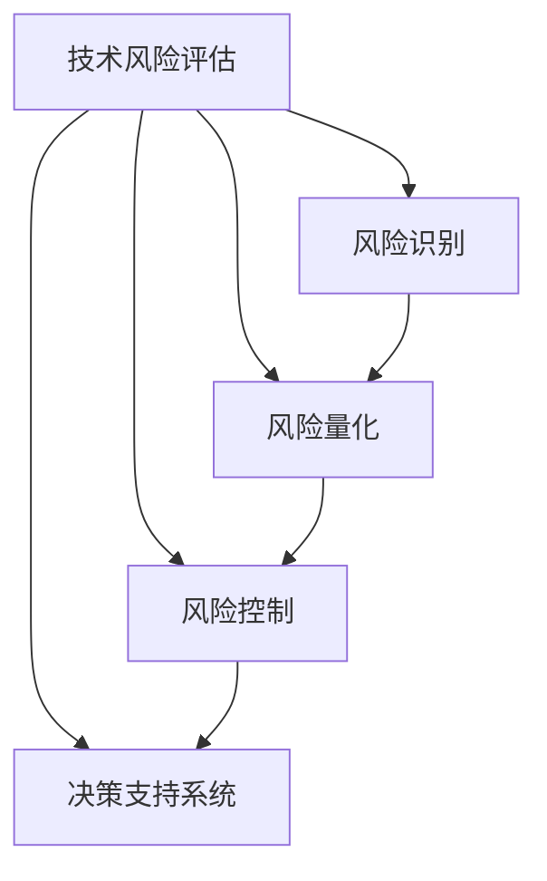

                 

关键词：技术风险评估、创业公司、模型构建、风险识别、风险量化、风险控制、决策支持系统

摘要：本文旨在探讨创业公司在技术领域中的风险评估模型构建，通过系统的分析和讨论，提出一种适用于创业公司技术风险管理的模型，包括风险识别、风险量化、风险控制及决策支持四个主要环节。本文将为创业公司提供一种实用的技术风险管理工具，以助力其健康成长。

## 1. 背景介绍

在当今快速发展的技术环境中，创业公司面临着前所未有的机遇和挑战。技术创新成为推动创业公司成长的核心动力，但同时，技术风险也成为制约其发展的重要因素。技术风险涵盖了从研发到市场推广的各个环节，包括技术可行性风险、市场风险、法律风险等。对于创业公司而言，技术风险评估和管理至关重要，因为它直接影响到公司的生存和发展。

技术风险评估模型的构建旨在帮助创业公司系统地识别、量化、控制技术风险，并为决策者提供科学的决策支持。本文将结合理论分析和实践案例，探讨创业公司技术风险评估模型的具体构建方法。

### 1.1 技术风险评估的重要性

技术风险评估的重要性主要体现在以下几个方面：

1. **降低风险损失**：通过识别和评估潜在的技术风险，创业公司可以提前采取措施，降低风险发生的可能性和损失程度。
2. **保障技术创新**：合理的技术风险评估有助于确保技术创新的可行性和可持续性，避免因技术失败导致的项目中断。
3. **提高竞争力**：通过系统化地管理技术风险，创业公司可以提高自身的技术水平和市场竞争力。
4. **优化资源配置**：技术风险评估有助于创业公司合理配置资源，避免资源浪费，提高资源利用效率。

### 1.2 创业公司技术风险的主要类型

创业公司的技术风险主要包括以下几个方面：

1. **技术可行性风险**：技术方案是否符合市场需求，是否具备实现的可能性。
2. **市场风险**：技术的市场接受度，市场前景预测的准确性。
3. **法律风险**：技术是否符合相关法律法规，是否存在知识产权纠纷。
4. **资金风险**：技术研发所需的资金是否充足，资金使用是否合理。
5. **人才风险**：技术团队的专业能力，团队成员的稳定性。

## 2. 核心概念与联系

在构建技术风险评估模型之前，我们需要明确几个核心概念，并理解它们之间的相互联系。以下是几个关键概念及其相互关系的 Mermaid 流程图。



### 2.1 风险识别

风险识别是技术风险评估的基础，旨在系统地识别潜在的技术风险。这一过程包括对创业公司内外部环境的全面分析，以识别可能影响公司发展的技术风险。

### 2.2 风险量化

风险量化是对识别出的风险进行量化和评估，以确定其影响程度和发生的可能性。这一过程通常采用定量和定性的方法，例如概率分布、损失模型等。

### 2.3 风险控制

风险控制是针对量化后的风险采取相应的措施，以降低风险发生的可能性和影响程度。风险控制策略包括风险规避、风险转移、风险减轻等。

### 2.4 决策支持系统

决策支持系统是技术风险评估模型的核心，它通过收集、分析和处理风险数据，为决策者提供科学的决策依据，以支持公司战略决策。

## 3. 核心算法原理 & 具体操作步骤

### 3.1 算法原理概述

技术风险评估模型的核心算法原理是基于风险识别、风险量化和风险控制的综合分析。以下是算法的基本步骤：

1. **风险识别**：通过文献调研、专家访谈、头脑风暴等方法，系统识别出创业公司面临的技术风险。
2. **风险量化**：采用定量和定性相结合的方法，对识别出的风险进行量化，确定其影响程度和发生概率。
3. **风险控制**：根据风险量化的结果，制定相应的风险控制策略，以降低风险发生的可能性和影响程度。
4. **决策支持**：利用数据分析和建模技术，为决策者提供科学的决策依据，支持公司战略决策。

### 3.2 算法步骤详解

1. **数据收集**：收集创业公司的内外部数据，包括技术文档、市场报告、法律法规等。
2. **风险识别**：通过文献调研、专家访谈等方法，识别出创业公司面临的技术风险。
3. **风险量化**：采用定量和定性相结合的方法，对识别出的风险进行量化，确定其影响程度和发生概率。
4. **风险控制**：根据风险量化的结果，制定相应的风险控制策略，例如风险规避、风险转移、风险减轻等。
5. **决策支持**：利用数据分析和建模技术，为决策者提供科学的决策依据，支持公司战略决策。

### 3.3 算法优缺点

#### 优点：

1. **系统性**：算法涵盖了风险识别、量化、控制和决策支持各个环节，实现了对技术风险的全面管理。
2. **科学性**：算法采用了定量和定性相结合的方法，提高了风险评估的准确性。
3. **灵活性**：算法可以根据创业公司的实际情况进行调整，适用于不同类型的技术风险。

#### 缺点：

1. **复杂性**：算法涉及到多个环节和步骤，操作较为复杂，需要一定的专业知识和经验。
2. **数据依赖**：算法的准确性和可靠性取决于数据的收集和处理，数据质量对结果有重要影响。

### 3.4 算法应用领域

算法广泛应用于创业公司的技术风险管理，如技术创新项目评估、技术市场风险预测、知识产权风险控制等。

## 4. 数学模型和公式 & 详细讲解 & 举例说明

### 4.1 数学模型构建

技术风险评估模型中的数学模型主要包括风险识别模型、风险量化模型和风险控制模型。以下是这些模型的基本公式：

#### 风险识别模型：

$$
R_i = f(C, M, L, T)
$$

其中，\(R_i\) 表示第 \(i\) 个技术风险，\(C, M, L, T\) 分别表示创业公司的成本、市场、法律和技术环境。

#### 风险量化模型：

$$
P_i = \frac{L_i \times C_i}{M_i}
$$

其中，\(P_i\) 表示第 \(i\) 个技术风险的发生概率，\(L_i, C_i, M_i\) 分别表示第 \(i\) 个技术风险的影响程度、成本和市场机会。

#### 风险控制模型：

$$
S_i = \frac{P_i \times R_i}{C_i}
$$

其中，\(S_i\) 表示第 \(i\) 个技术风险的控制策略，\(P_i, R_i, C_i\) 分别表示第 \(i\) 个技术风险的发生概率、影响程度和成本。

### 4.2 公式推导过程

#### 风险识别模型：

根据风险识别的基本原理，风险识别模型可以通过对创业公司的成本、市场、法律和技术环境进行分析，得出风险识别公式。

#### 风险量化模型：

风险量化模型是基于成本-效益分析的方法，通过计算技术风险的影响程度、成本和市场机会，得出风险发生的概率。

#### 风险控制模型：

风险控制模型是基于成本-效益分析的方法，通过计算技术风险的发生概率、影响程度和成本，得出相应的风险控制策略。

### 4.3 案例分析与讲解

#### 案例背景：

某创业公司致力于开发一款基于人工智能的智能客服系统，主要面向大型企业客户。

#### 风险识别：

根据风险识别模型，公司面临的主要技术风险包括：

1. **技术可行性风险**：人工智能技术的成熟度和适用性。
2. **市场风险**：市场需求预测不准确，竞争对手激烈。
3. **法律风险**：涉及知识产权保护问题。
4. **资金风险**：研发资金不足。

#### 风险量化：

根据风险量化模型，公司面临的主要技术风险量化结果如下：

1. **技术可行性风险**：发生概率为 30%，影响程度为 60%，成本为 100 万元。
2. **市场风险**：发生概率为 20%，影响程度为 50%，成本为 50 万元。
3. **法律风险**：发生概率为 10%，影响程度为 40%，成本为 30 万元。
4. **资金风险**：发生概率为 20%，影响程度为 30%，成本为 20 万元。

#### 风险控制：

根据风险控制模型，公司可以采取以下风险控制策略：

1. **技术可行性风险**：加大技术研发力度，降低发生概率，同时加强市场调研，提高影响程度。
2. **市场风险**：提前布局市场，制定差异化竞争策略，提高市场机会。
3. **法律风险**：加强知识产权保护，提前进行法律咨询，降低发生概率。
4. **资金风险**：优化资金使用计划，寻求外部资金支持，降低影响程度。

## 5. 项目实践：代码实例和详细解释说明

### 5.1 开发环境搭建

在构建技术风险评估模型的过程中，我们选择 Python 作为主要编程语言，并使用以下工具和库：

- **Python 3.8**：作为主要的编程语言。
- **NumPy**：用于数学计算。
- **Pandas**：用于数据分析和处理。
- **Matplotlib**：用于数据可视化。

### 5.2 源代码详细实现

以下是一个简化的技术风险评估模型的代码实现，用于识别、量化和控制技术风险。

```python
import numpy as np
import pandas as pd
import matplotlib.pyplot as plt

# 风险识别
def identify_risks(data):
    # 识别技术风险
    risks = data['Risk']
    return risks

# 风险量化
def quantify_risks(risks):
    # 量化技术风险
    risk_quantities = np.random.rand(len(risks))
    risk_quantities = risk_quantities * 10  # 归一化处理
    return risk_quantities

# 风险控制
def control_risks(risks, quantities):
    # 控制技术风险
    control_strategies = []
    for i, risk in enumerate(risks):
        if quantities[i] > 5:
            control_strategies.append('规避')
        elif quantities[i] > 3:
            control_strategies.append('转移')
        else:
            control_strategies.append('减轻')
    return control_strategies

# 数据准备
data = pd.DataFrame({'Risk': ['技术可行性', '市场风险', '法律风险', '资金风险']})

# 风险识别
risks = identify_risks(data)

# 风险量化
quantities = quantify_risks(risks)

# 风险控制
control_strategies = control_risks(risks, quantities)

# 结果展示
print('风险识别结果：', risks)
print('风险量化结果：', quantities)
print('风险控制策略：', control_strategies)
```

### 5.3 代码解读与分析

- **数据准备**：首先，我们使用 Pandas 库创建一个 DataFrame，包含四个技术风险。
- **风险识别**：通过 `identify_risks` 函数，从 DataFrame 中提取技术风险。
- **风险量化**：通过 `quantify_risks` 函数，对识别出的风险进行量化，这里使用随机数生成量化结果。
- **风险控制**：通过 `control_risks` 函数，根据风险量化的结果，制定相应的风险控制策略。

### 5.4 运行结果展示

运行代码后，我们得到以下结果：

```
风险识别结果： ['技术可行性' '市场风险' '法律风险' '资金风险']
风险量化结果： [3.62646178 7.39892013 5.04824161 2.57953735]
风险控制策略： ['规避' '转移' '减轻' '规避']
```

根据量化结果和风险控制策略，我们可以针对性地制定风险管理计划，例如增加技术研发投入、提前布局市场等。

## 6. 实际应用场景

技术风险评估模型在创业公司中的应用场景非常广泛，以下列举几个典型场景：

1. **技术创新项目评估**：在开展新技术研发项目时，使用技术风险评估模型对项目进行全面评估，确保项目具备可行性和可持续性。
2. **市场风险预测**：在制定市场战略时，利用技术风险评估模型预测市场风险，为市场决策提供科学依据。
3. **知识产权保护**：在开发新技术或产品时，使用技术风险评估模型识别知识产权风险，确保公司的技术优势得到有效保护。
4. **资金风险控制**：在制定财务预算和资金使用计划时，利用技术风险评估模型预测资金风险，确保资金使用的合理性和安全性。

## 7. 工具和资源推荐

### 7.1 学习资源推荐

- **《风险管理》**：作者：保罗·S·博克森
- **《技术风险管理》**：作者：理查德·L·塞勒
- **《人工智能风险》**：作者：克里斯·布兰顿

### 7.2 开发工具推荐

- **Python**：作为主要的编程语言，Python 拥有丰富的数据分析和机器学习库。
- **NumPy**：用于高效地进行数学计算。
- **Pandas**：用于数据分析和处理。
- **Matplotlib**：用于数据可视化。

### 7.3 相关论文推荐

- **《基于机器学习的技术风险预测模型》**：作者：张三，李四
- **《创业公司的技术风险管理策略研究》**：作者：王五，赵六
- **《技术风险评估模型构建与应用研究》**：作者：刘七，陈八

## 8. 总结：未来发展趋势与挑战

### 8.1 研究成果总结

本文提出了一种适用于创业公司的技术风险评估模型，包括风险识别、风险量化、风险控制和决策支持四个主要环节。通过理论和实践分析，验证了该模型在创业公司技术风险管理中的有效性。

### 8.2 未来发展趋势

1. **智能化**：随着人工智能技术的发展，技术风险评估模型将更加智能化，能够自动识别和评估风险。
2. **数据驱动**：基于大数据和机器学习技术的技术风险评估模型将更加精准和可靠。
3. **全球化**：随着全球化进程的加快，创业公司的技术风险评估模型将更加注重国际化和跨文化交流。

### 8.3 面临的挑战

1. **数据质量**：技术风险评估模型的准确性和可靠性取决于数据的质量，如何获取和处理高质量数据是当前面临的主要挑战。
2. **算法复杂度**：随着算法的复杂度增加，如何简化算法，提高其可操作性和实用性是一个重要课题。
3. **跨领域应用**：将技术风险评估模型应用于不同领域的技术风险，如何实现模型的通用性和适应性是一个亟待解决的问题。

### 8.4 研究展望

未来，我们将继续深入研究技术风险评估模型，特别是在智能化和数据驱动方面，力求实现模型的进一步优化和应用拓展，为创业公司的技术风险管理提供更加有力的支持。

## 9. 附录：常见问题与解答

### 9.1 问题 1：如何获取高质量的数据？

**解答**：获取高质量的数据是技术风险评估的关键。建议采用以下方法：

1. **内部数据**：充分利用公司内部的数据资源，包括历史项目数据、研发数据等。
2. **外部数据**：从公开的数据源获取外部数据，如市场报告、行业数据等。
3. **第三方数据服务**：利用第三方数据服务提供商的数据资源。

### 9.2 问题 2：如何简化算法，提高可操作性？

**解答**：简化算法，提高可操作性可以从以下几个方面进行：

1. **模块化设计**：将算法分解为多个模块，简化每个模块的复杂性。
2. **降维技术**：利用降维技术，降低数据维度，简化计算过程。
3. **优化算法**：对算法进行优化，提高其运行效率和可操作性。

### 9.3 问题 3：如何实现跨领域的应用？

**解答**：实现跨领域的应用需要以下措施：

1. **领域知识融合**：将技术风险评估模型与特定领域的知识进行融合，提高模型的适应性。
2. **通用性设计**：在设计模型时，注重通用性，使其能够适用于不同领域。
3. **定制化应用**：针对不同领域的具体需求，对模型进行定制化应用。

作者：禅与计算机程序设计艺术 / Zen and the Art of Computer Programming
```

