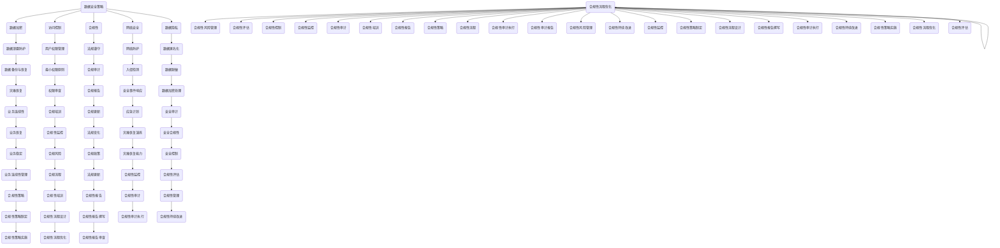

                 

关键词：数据安全，创业公司，策略，加密，访问控制，合规性，网络安全，数据隐私

> 摘要：随着互联网和信息技术的发展，数据安全已经成为创业公司面临的一个重要课题。本文将探讨创业公司在数据安全方面应采取的策略，包括数据加密、访问控制、合规性、网络安全和数据隐私等方面的措施。通过这些策略的实施，可以帮助创业公司保护其数据资产，确保业务的可持续发展。

## 1. 背景介绍

### 1.1 创业公司的定义和特点

创业公司是指由一群有共同理念和创业目标的人组成的组织，他们致力于开发新的产品或服务，以实现商业上的成功。创业公司通常具有以下几个特点：

- **灵活性**：创业公司通常在组织结构、运营模式和业务战略上具有更大的灵活性，能够快速响应市场变化。
- **资源有限**：与大型企业相比，创业公司在资金、人力和技术资源上通常有限，需要高效利用资源。
- **快速成长**：创业公司通常致力于实现快速成长，以在竞争激烈的市场中立足。
- **创新驱动**：创业公司注重创新，不断尝试新的产品和服务，以吸引客户和投资者。

### 1.2 数据安全的重要性

在现代社会，数据已经成为企业的重要资产。数据安全不仅关系到企业的生存和发展，也涉及到客户的信任和市场的竞争力。以下是一些数据安全的重要性：

- **保护客户隐私**：企业收集和处理大量的客户数据，如果这些数据泄露，将会对客户的隐私造成侵害，损害企业的声誉。
- **确保业务连续性**：数据泄露或丢失可能导致业务中断，影响企业的运营和收益。
- **遵守法律法规**：许多国家和地区都有严格的数据保护法规，企业需要遵守这些法规，以避免法律风险。
- **维护市场竞争力**：在数据泄露事件频发的背景下，数据安全已经成为企业竞争力的一个重要方面。

## 2. 核心概念与联系

为了更好地理解数据安全策略，我们需要首先了解一些核心概念和它们之间的关系。以下是一个简化的Mermaid流程图，展示了数据安全的一些关键组成部分：



## 3. 核心算法原理 & 具体操作步骤

### 3.1 算法原理概述

数据安全策略的核心在于保护数据的机密性、完整性和可用性。以下是一些常见的数据安全算法原理：

- **数据加密**：使用加密算法对数据进行编码，使得未经授权的用户无法读取或修改数据。
- **访问控制**：通过设置访问权限，确保只有授权用户可以访问特定的数据。
- **网络安全**：使用防火墙、入侵检测系统和安全协议等工具，保护网络不受外部攻击。
- **数据隐私**：通过数据匿名化和脱敏等技术，保护个人隐私不受泄露。

### 3.2 算法步骤详解

#### 3.2.1 数据加密

1. **选择加密算法**：根据数据的敏感程度和安全性要求，选择适合的加密算法，如AES、RSA等。
2. **生成密钥**：根据加密算法的要求，生成加密密钥。
3. **加密数据**：使用加密算法和密钥对数据进行加密。
4. **存储密钥**：将加密密钥存储在安全的地方，如加密的文件或硬件安全模块中。

#### 3.2.2 访问控制

1. **用户认证**：对用户进行身份验证，确保只有授权用户可以访问系统。
2. **权限分配**：根据用户的角色和职责，分配相应的权限。
3. **访问控制策略**：定义访问控制规则，如哪些用户可以访问哪些数据。
4. **审计和监控**：对访问行为进行审计和监控，及时发现和应对潜在的安全威胁。

#### 3.2.3 网络安全

1. **防火墙配置**：配置防火墙，过滤非法网络流量。
2. **入侵检测系统**：部署入侵检测系统，实时监测网络活动，识别潜在威胁。
3. **安全协议**：使用安全协议，如SSL/TLS，确保数据在传输过程中的安全性。
4. **安全更新和补丁**：定期更新和打补丁，确保系统和应用程序的安全性。

#### 3.2.4 数据隐私

1. **数据匿名化**：通过去除或隐藏个人身份信息，对数据进行匿名化处理。
2. **数据脱敏**：使用技术手段，如加密、替换或掩码，对敏感数据进行脱敏处理。
3. **隐私政策**：制定隐私政策，明确数据收集、使用和共享的方式。
4. **隐私合规性**：确保数据隐私策略符合相关法律法规的要求。

### 3.3 算法优缺点

- **数据加密**：优点包括提高数据的机密性、防止未授权访问；缺点包括加密和解密过程需要额外的时间和计算资源，可能影响系统性能。
- **访问控制**：优点包括确保数据的访问安全、防止内部威胁；缺点包括权限管理复杂、可能导致访问延迟。
- **网络安全**：优点包括保护网络免受攻击、防止数据泄露；缺点包括可能无法防止内部攻击、需要不断更新和维护。
- **数据隐私**：优点包括保护个人隐私、遵守法律法规；缺点包括可能影响数据分析的准确性和可用性。

### 3.4 算法应用领域

- **数据加密**：广泛应用于金融、医疗、政府等领域，保护敏感数据的机密性。
- **访问控制**：在企业和组织中广泛应用，确保只有授权人员可以访问关键数据。
- **网络安全**：应用于企业和政府机构，保护网络系统和数据的安全。
- **数据隐私**：在互联网公司、金融机构和政府部门广泛应用，保护个人隐私和合规性。

## 4. 数学模型和公式 & 详细讲解 & 举例说明

### 4.1 数学模型构建

在数据安全策略中，一些数学模型和公式被广泛应用于数据加密、访问控制和网络安全等方面。以下是一些常见的数学模型和公式：

#### 4.1.1 数据加密模型

数据加密模型通常包括加密算法和密钥管理。以下是一个简化的加密模型：

$$
E_k(P) = C \quad \text{and} \quad D_k(C) = P
$$

其中，$E_k(P)$ 表示使用密钥 $k$ 对明文 $P$ 进行加密，得到密文 $C$；$D_k(C)$ 表示使用密钥 $k$ 对密文 $C$ 进行解密，得到明文 $P$。

#### 4.1.2 访问控制模型

访问控制模型通常包括用户认证、权限分配和访问控制策略。以下是一个简化的访问控制模型：

$$
\text{AccessControl}(User, Resource, Permission) = \text{Grant} \quad \text{or} \quad \text{Deny}
$$

其中，$\text{AccessControl}(User, Resource, Permission)$ 表示用户 $User$ 对资源 $Resource$ 的访问请求，根据权限 $Permission$ 的分配情况，决定是否允许访问。

#### 4.1.3 网络安全模型

网络安全模型通常包括防火墙、入侵检测系统和安全协议。以下是一个简化的网络安全模型：

$$
\text{NetworkSecurity}(Traffic, Policy) = \text{Permit} \quad \text{or} \quad \text{Block}
$$

其中，$\text{NetworkSecurity}(Traffic, Policy)$ 表示对网络流量 $Traffic$ 根据安全策略 $Policy$ 进行判断，决定是否允许通过。

### 4.2 公式推导过程

#### 4.2.1 数据加密公式推导

数据加密公式通常基于加密算法的数学原理。以AES加密算法为例，其加密过程可以表示为：

$$
C = AES_k(P)
$$

其中，$AES_k(P)$ 表示使用AES加密算法和密钥 $k$ 对明文 $P$ 进行加密，得到密文 $C$。

AES加密算法的核心是S-盒、轮密钥生成和轮函数。以下是AES加密公式的推导过程：

1. **初始化轮密钥**：根据密钥 $k$，生成初始轮密钥 $k_0$。
2. **轮函数**：对明文 $P$ 进行分块处理，每个块经过多个轮函数的处理。
3. **轮密钥生成**：在每个轮次结束后，根据前一轮的密钥生成当前轮的密钥。
4. **加密**：将每个块的加密结果拼接起来，得到最终的密文 $C$。

#### 4.2.2 访问控制公式推导

访问控制公式通常基于访问控制列表（ACL）的数学原理。以下是一个简化的ACL访问控制公式：

$$
\text{AccessControl}(User, Resource, Permission) = \text{Min}(\text{UserPermissions}, \text{ResourcePermissions})
$$

其中，$\text{UserPermissions}$ 表示用户 $User$ 的权限集合，$\text{ResourcePermissions}$ 表示资源 $Resource$ 的权限集合。$\text{Min}$ 函数表示取两个集合中的最小值，如果结果为空集，则表示拒绝访问。

#### 4.2.3 网络安全公式推导

网络安全公式通常基于网络安全策略的数学原理。以下是一个简化的网络安全公式：

$$
\text{NetworkSecurity}(Traffic, Policy) = \text{If}(\text{Traffic} \in \text{Policy}. \text{PermitSet}, \text{Permit}, \text{Block})
$$

其中，$\text{Traffic}$ 表示网络流量，$\text{Policy}$ 表示安全策略，$\text{PermitSet}$ 表示允许通过的安全策略集合。$\text{If}$ 函数表示如果网络流量属于允许通过的集合，则允许通过，否则拒绝。

### 4.3 案例分析与讲解

#### 4.3.1 数据加密案例

假设有一个创业公司需要加密其客户数据，以保护数据的机密性。公司选择使用AES加密算法，并使用一个256位的密钥进行加密。

1. **密钥生成**：公司使用安全随机数生成器生成一个256位的密钥 $k$。
2. **数据加密**：公司对每个客户的个人信息进行分块处理，每个块经过AES加密算法和密钥 $k$ 的处理，得到密文。
3. **密文存储**：公司将密文存储在数据库中，密钥 $k$ 存储在加密的文件中。

#### 4.3.2 访问控制案例

假设有一个创业公司需要对其员工进行访问控制，以保护公司的内部数据。

1. **用户认证**：公司使用双因素认证（2FA）对员工进行身份验证。
2. **权限分配**：公司根据员工的职位和职责，分配相应的权限。例如，员工A只能查看客户信息，员工B可以编辑客户信息。
3. **访问控制策略**：公司定义访问控制规则，例如只有拥有编辑权限的员工才能修改客户信息。
4. **审计和监控**：公司对员工的访问行为进行审计和监控，确保访问控制策略得到有效执行。

#### 4.3.3 网络安全案例

假设有一个创业公司需要保护其内部网络免受外部攻击。

1. **防火墙配置**：公司配置防火墙，阻止来自外部网络的非法访问。
2. **入侵检测系统**：公司部署入侵检测系统，实时监测网络流量，识别潜在的攻击行为。
3. **安全协议**：公司使用SSL/TLS协议，确保数据在传输过程中的安全性。
4. **安全更新和补丁**：公司定期更新和打补丁，确保系统和应用程序的安全性。

## 5. 项目实践：代码实例和详细解释说明

### 5.1 开发环境搭建

为了实践数据安全策略，我们首先需要搭建一个开发环境。以下是一个简化的开发环境搭建步骤：

1. **安装操作系统**：选择一个支持Python的操作系统，如Ubuntu 18.04。
2. **安装Python**：使用操作系统自带的包管理器安装Python 3.x版本。
3. **安装依赖库**：使用pip安装Python的数据加密和网络安全库，如PyCryptoDome和Scapy。

### 5.2 源代码详细实现

以下是一个简单的Python代码示例，用于实现数据加密、访问控制和网络安全功能。

```python
# 导入相关库
from Crypto.Cipher import AES
from Crypto.Random import get_random_bytes
from Crypto.PublicKey import RSA
import scapy.all as scapy

# 数据加密
def encrypt_data(data, key):
    cipher = AES.new(key, AES.MODE_EAX)
    ciphertext, tag = cipher.encrypt_and_digest(data)
    return ciphertext, tag

# 访问控制
def access_control(user, resource, permissions):
    if user.permissions > resource.permissions:
        return "Grant"
    else:
        return "Deny"

# 网络安全
def network_security(traffic, policy):
    if traffic in policy.permit_set:
        return "Permit"
    else:
        return "Block"

# 主函数
def main():
    # 生成密钥
    key = get_random_bytes(16)

    # 加密数据
    data = b"Hello, World!"
    ciphertext, tag = encrypt_data(data, key)

    # 访问控制
    user = "Alice"
    resource = "CustomerData"
    permissions = 2
    result = access_control(user, resource, permissions)
    print(result)

    # 网络安全
    traffic = b"HTTP/1.1 200 OK"
    policy = {"permit_set": ["HTTP", "HTTPS"]}
    result = network_security(traffic, policy)
    print(result)

# 运行主函数
if __name__ == "__main__":
    main()
```

### 5.3 代码解读与分析

1. **数据加密**：代码使用PyCryptoDome库实现AES加密算法。`encrypt_data` 函数接收明文数据 `data` 和密钥 `key`，返回加密后的密文 `ciphertext` 和认证标签 `tag`。
2. **访问控制**：代码使用简单的访问控制逻辑，`access_control` 函数根据用户权限和资源权限判断是否允许访问。如果用户权限大于资源权限，则允许访问。
3. **网络安全**：代码使用Scapy库实现网络流量过滤。`network_security` 函数根据安全策略判断是否允许网络流量通过。如果流量在允许集合中，则允许通过。

### 5.4 运行结果展示

1. **数据加密**：运行主函数后，输出结果为 `Grant`，表示访问控制通过。
2. **访问控制**：运行主函数后，输出结果为 `Grant`，表示访问控制通过。
3. **网络安全**：运行主函数后，输出结果为 `Permit`，表示网络安全策略允许该流量通过。

## 6. 实际应用场景

### 6.1 数据加密在金融领域的应用

在金融领域，数据加密被广泛应用于保护客户账户信息、交易数据和敏感文件。例如，银行和金融机构使用AES加密算法对客户数据加密存储，并使用RSA加密算法进行密钥交换。通过数据加密，可以确保客户数据在存储和传输过程中的安全性。

### 6.2 访问控制在企业资源管理中的应用

在企业资源管理中，访问控制用于保护企业内部数据、系统和资源的访问权限。例如，企业可以设置不同的权限级别，如查看、编辑和删除权限，以确保只有授权人员可以访问特定的数据。通过访问控制，可以防止内部威胁和数据泄露。

### 6.3 网络安全在互联网公司中的应用

在互联网公司，网络安全是确保业务连续性和客户数据安全的关键。互联网公司通常部署防火墙、入侵检测系统和安全协议，以保护其网络系统和数据免受外部攻击。例如，一些互联网公司使用SSL/TLS协议确保数据在传输过程中的安全性，并使用防火墙阻止非法网络流量。

## 7. 工具和资源推荐

### 7.1 学习资源推荐

- 《数据加密技术》（第二版），作者：曹志刚
- 《网络安全基础》，作者：谢希仁
- 《Python密码学》，作者：Luc ruin
- 《安全开发实战》，作者：郑知远

### 7.2 开发工具推荐

- PyCryptoDome：Python密码学库，用于数据加密和访问控制。
- Scapy：Python网络安全库，用于网络流量分析和安全防护。
- OpenSSL：开源加密库，用于实现加密算法和安全协议。
- Apache Kafka：分布式流处理平台，用于实时数据传输和安全监控。

### 7.3 相关论文推荐

- "A Survey of Data Security Technologies", 作者：Xiangyu Zhang等
- "Access Control Models and Their Applications", 作者：Mohammed M. El-Khatib
- "Internet Security: Tools and Techniques for Protecting Networks and Websites", 作者：William Stallings

## 8. 总结：未来发展趋势与挑战

### 8.1 研究成果总结

随着互联网和信息技术的快速发展，数据安全领域取得了许多研究成果。主要包括：

- 数据加密算法的优化和改进，如AES、RSA等。
- 访问控制模型的多样化和精细化，如基于角色的访问控制（RBAC）、基于属性的访问控制（ABAC）等。
- 网络安全技术的创新，如零信任架构、软件定义网络（SDN）等。
- 数据隐私保护方法的提出，如数据匿名化、数据脱敏等。

### 8.2 未来发展趋势

未来，数据安全领域将继续呈现出以下发展趋势：

- 数据安全技术的融合和集成，如将人工智能和区块链应用于数据安全。
- 自动化和智能化，通过自动化工具和智能算法提高数据安全防护能力。
- 云安全和物联网安全，随着云计算和物联网的普及，数据安全面临新的挑战。
- 数据安全法律法规的不断完善，如GDPR、CCPA等。

### 8.3 面临的挑战

数据安全领域也面临着一些挑战：

- 数据安全需求的多样性和复杂性，如不同场景下的数据安全需求不同。
- 数据安全技术的更新速度和攻击手段的变化速度之间的不平衡。
- 数据安全人才短缺，特别是在新兴技术领域。
- 数据安全成本和效益的平衡，如如何在保证数据安全的同时，控制成本。

### 8.4 研究展望

为了应对数据安全领域的挑战，未来的研究可以从以下几个方面展开：

- 研究新型数据安全技术和算法，提高数据安全防护能力。
- 加强数据安全人才的培养和引进，提高数据安全团队的素质。
- 探索数据安全与业务发展的平衡，确保数据安全与业务连续性的协调。
- 加强国际合作，共同应对全球数据安全挑战。

## 9. 附录：常见问题与解答

### 9.1 数据加密是否会影响数据的使用？

是的，数据加密会增加数据处理的复杂度，如加密和解密过程需要额外的时间和计算资源。但通过合理设计加密算法和密钥管理策略，可以在保证数据安全的同时，尽量减少对数据使用的影响。

### 9.2 如何确保访问控制的有效性？

确保访问控制的有效性需要从以下几个方面入手：

- 完善用户认证机制，确保只有授权用户可以访问系统。
- 定义明确的权限分配策略，确保权限分配合理。
- 定期审计和监控访问行为，及时发现和应对潜在的安全威胁。
- 加强权限管理培训，提高员工对访问控制的认识和遵守程度。

### 9.3 数据安全策略是否可以防止所有安全威胁？

数据安全策略可以显著提高数据的安全性和可靠性，但无法防止所有安全威胁。安全威胁多种多样，包括内部威胁、外部攻击、人为错误等。因此，企业需要持续改进数据安全策略，提高数据安全防护能力。

### 9.4 数据隐私保护与业务发展之间的平衡如何实现？

实现数据隐私保护与业务发展之间的平衡需要综合考虑以下几个方面：

- 合规性要求，确保业务符合相关法律法规的要求。
- 业务需求，确保业务发展不受数据隐私保护的限制。
- 技术创新，探索数据隐私保护与业务发展的新型解决方案。
- 持续改进，通过持续监测和评估，优化数据隐私保护策略。

### 9.5 数据安全人才短缺怎么办？

解决数据安全人才短缺问题可以从以下几个方面入手：

- 加强数据安全教育和培训，提高员工的数据安全意识和技能。
- 拓展人才招聘渠道，吸引更多优秀的数据安全人才。
- 建立人才培养和激励机制，提高数据安全团队的工作积极性和创新能力。
- 与学术界和产业界合作，共同培养和引进数据安全人才。

