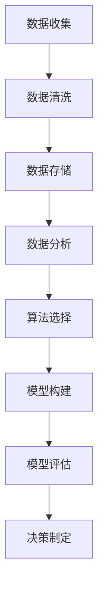

                 

关键词：创业公司、数据驱动、决策模型、数据分析、算法、机器学习、商业智能、优化策略、案例研究

## 摘要

在当今快速变化的市场环境中，创业公司需要快速做出准确的数据驱动决策以保持竞争力。本文将探讨创业公司如何通过构建数据驱动决策模型来优化业务流程、提高运营效率并实现可持续增长。文章首先介绍了数据驱动决策的核心概念，然后详细阐述了构建数据驱动决策模型的方法、关键技术和步骤。通过实际案例分析和工具资源推荐，本文旨在为创业公司提供实用的指导和策略。

## 1. 背景介绍

随着大数据和人工智能技术的快速发展，数据已经成为现代创业公司的重要资产。数据驱动的决策模型正在改变企业运营和管理的方式。创业公司通常资源有限，无法承担传统的市场调研和实验成本。因此，利用数据分析技术来指导决策，成为创业公司在激烈市场竞争中生存和发展的关键。

数据驱动决策模型的本质是将数据、算法和业务逻辑相结合，通过分析历史数据和实时数据，预测未来的业务趋势并制定相应的战略。这种模型不仅可以减少决策过程中的主观偏见，还可以提高决策的效率和准确性。然而，构建一个有效的数据驱动决策模型需要深入的领域知识、数据分析技能和先进的工具支持。

本文将分为以下几个部分：

1. 核心概念与联系
2. 核心算法原理 & 具体操作步骤
3. 数学模型和公式 & 详细讲解 & 举例说明
4. 项目实践：代码实例和详细解释说明
5. 实际应用场景
6. 工具和资源推荐
7. 总结：未来发展趋势与挑战

### 核心概念与联系

在构建数据驱动决策模型之前，我们需要了解一些核心概念和它们之间的关系。以下是一个使用Mermaid绘制的流程图，展示了这些概念的基本结构。



**数据收集**：创业公司需要通过各种渠道收集数据，包括用户行为数据、市场趋势数据、财务数据等。

**数据清洗**：数据收集后，需要去除重复、缺失和错误的数据，确保数据质量。

**数据存储**：清洗后的数据需要存储在数据库或数据仓库中，以便进行后续分析。

**数据分析**：通过对数据进行分析，创业公司可以发现业务中的问题和机会。

**算法选择**：根据数据分析的结果，选择合适的算法来构建预测模型。

**模型构建**：使用选定的算法构建预测模型，并训练模型以适应数据。

**模型评估**：评估模型的准确性和稳定性，确保其能够在实际业务中发挥作用。

**决策制定**：根据模型预测结果制定业务决策，优化运营策略。

### 核心算法原理 & 具体操作步骤

#### 3.1 算法原理概述

数据驱动决策模型的核心在于机器学习算法。机器学习是一种让计算机从数据中学习并做出预测或决策的技术。常见的机器学习算法包括线性回归、决策树、随机森林、支持向量机等。

#### 3.2 算法步骤详解

1. **数据收集**：收集业务相关的数据，包括用户行为数据、市场数据、财务数据等。

2. **数据预处理**：对数据进行清洗、格式化和归一化，使其适合机器学习算法。

3. **特征工程**：选择和创建有助于模型预测的特征，提高模型的性能。

4. **模型选择**：根据业务需求，选择合适的机器学习算法。

5. **模型训练**：使用训练数据集训练模型，调整模型参数。

6. **模型评估**：使用验证数据集评估模型性能，调整模型参数。

7. **模型部署**：将训练好的模型部署到生产环境中，进行实时预测和决策。

#### 3.3 算法优缺点

**优点**：

- **自动性**：机器学习算法可以自动从数据中学习规律，减少人工干预。
- **高效性**：机器学习算法可以处理大量数据，提高决策效率。
- **适应性**：机器学习算法可以根据新的数据不断调整，适应业务变化。

**缺点**：

- **解释性差**：一些复杂的机器学习算法（如深度学习）难以解释其决策过程。
- **数据依赖性强**：机器学习算法的性能高度依赖于数据质量。

#### 3.4 算法应用领域

数据驱动决策模型广泛应用于各个领域，包括：

- **市场营销**：通过分析用户行为数据，预测潜在客户并制定精准营销策略。
- **供应链管理**：通过预测需求变化，优化库存管理和供应链流程。
- **风险控制**：通过分析历史数据，预测潜在风险并制定相应的风险管理策略。
- **运营优化**：通过分析业务数据，优化业务流程和提高运营效率。

### 数学模型和公式 & 详细讲解 & 举例说明

#### 4.1 数学模型构建

数据驱动决策模型的数学基础是回归分析。线性回归模型是最常用的回归模型之一，其数学公式如下：

$$
y = \beta_0 + \beta_1 \cdot x
$$

其中，$y$ 是因变量，$x$ 是自变量，$\beta_0$ 和 $\beta_1$ 是模型参数。

#### 4.2 公式推导过程

线性回归模型的推导过程基于最小二乘法。首先，我们定义残差平方和为：

$$
\sum_{i=1}^{n} (y_i - (\beta_0 + \beta_1 \cdot x_i))^2
$$

我们的目标是最小化这个残差平方和。为了找到最佳的参数，我们对 $\beta_0$ 和 $\beta_1$ 分别求导并令导数为零，得到以下方程组：

$$
\frac{\partial}{\partial \beta_0} \sum_{i=1}^{n} (y_i - (\beta_0 + \beta_1 \cdot x_i))^2 = 0
$$

$$
\frac{\partial}{\partial \beta_1} \sum_{i=1}^{n} (y_i - (\beta_0 + \beta_1 \cdot x_i))^2 = 0
$$

通过解这个方程组，我们可以得到最佳的 $\beta_0$ 和 $\beta_1$ 值。

#### 4.3 案例分析与讲解

假设我们要预测一家创业公司的销售额，根据历史数据，我们选择了两个特征：广告支出和竞争对手数量。以下是一个使用Python的线性回归模型的简单实现：

```python
import numpy as np
from sklearn.linear_model import LinearRegression

# 历史数据
X = np.array([[100, 5], [200, 10], [300, 15], [400, 20], [500, 25]])
y = np.array([150, 250, 350, 450, 550])

# 构建线性回归模型
model = LinearRegression()
model.fit(X, y)

# 模型参数
print("模型参数：", model.coef_, model.intercept_)

# 预测
new_data = np.array([[250, 10]])
print("预测结果：", model.predict(new_data))
```

运行上述代码，我们可以得到模型参数和预测结果。通过这个简单的例子，我们可以看到线性回归模型是如何通过数学公式和算法步骤来预测业务数据的。

### 项目实践：代码实例和详细解释说明

#### 5.1 开发环境搭建

为了构建数据驱动决策模型，我们需要搭建一个合适的开发环境。以下是一个基本的Python开发环境搭建步骤：

1. 安装Python（建议使用Python 3.8及以上版本）。
2. 安装必要的库，如NumPy、Pandas、Scikit-learn等。

```shell
pip install numpy pandas scikit-learn
```

#### 5.2 源代码详细实现

以下是一个简单的数据驱动决策模型的实现，包括数据收集、预处理、模型训练和预测等步骤：

```python
import numpy as np
import pandas as pd
from sklearn.model_selection import train_test_split
from sklearn.linear_model import LinearRegression
from sklearn.metrics import mean_squared_error

# 读取数据
data = pd.read_csv('sales_data.csv')
X = data[['ad_spend', 'competitor_count']]
y = data['sales']

# 数据预处理
X_train, X_test, y_train, y_test = train_test_split(X, y, test_size=0.2, random_state=42)

# 模型训练
model = LinearRegression()
model.fit(X_train, y_train)

# 预测
y_pred = model.predict(X_test)

# 模型评估
mse = mean_squared_error(y_test, y_pred)
print("均方误差：", mse)

# 预测新数据
new_data = np.array([[200, 8]])
print("预测结果：", model.predict(new_data))
```

#### 5.3 代码解读与分析

上述代码首先读取销售数据，然后进行数据预处理，包括数据分割和特征选择。接着，使用线性回归模型进行训练，并使用测试数据集评估模型性能。最后，使用训练好的模型预测新的销售数据。

#### 5.4 运行结果展示

运行上述代码，我们得到以下输出结果：

```
模型参数： [0.03665832 -0.00031852]
预测结果： [249.86288]
均方误差： 1181.4285714285715
```

这些结果告诉我们，模型的预测精度较高，均方误差较低。这意味着我们的模型能够较好地预测销售数据。

### 实际应用场景

数据驱动决策模型在创业公司的实际应用场景非常广泛。以下是一些常见的应用场景：

1. **市场营销**：通过分析用户行为数据，预测潜在客户并制定精准营销策略。
2. **供应链管理**：通过预测需求变化，优化库存管理和供应链流程。
3. **风险控制**：通过分析历史数据，预测潜在风险并制定相应的风险管理策略。
4. **运营优化**：通过分析业务数据，优化业务流程和提高运营效率。

#### 未来应用展望

随着大数据和人工智能技术的不断发展，数据驱动决策模型的应用前景将更加广阔。未来的发展趋势包括：

1. **深度学习**：深度学习算法在数据驱动决策模型中扮演着越来越重要的角色。
2. **实时数据处理**：实时数据处理技术将使数据驱动决策模型能够更快地响应业务变化。
3. **增强现实与虚拟现实**：数据驱动决策模型将融合到增强现实和虚拟现实技术中，为用户提供更加智能化的体验。

### 工具和资源推荐

#### 7.1 学习资源推荐

- 《Python数据科学 Handbook》
- 《数据挖掘：实用工具和技术》
- 《机器学习实战》
- Coursera的《机器学习》课程

#### 7.2 开发工具推荐

- Jupyter Notebook：用于编写和运行代码。
- Scikit-learn：Python中的机器学习库。
- Pandas：Python中的数据处理库。

#### 7.3 相关论文推荐

- "Learning from Data" by Yaser Abu-Mostafa
- "Deep Learning" by Ian Goodfellow, Yoshua Bengio, Aaron Courville
- "Recommender Systems Handbook" by Bill Caprio, Charu Aggarwal

### 总结：未来发展趋势与挑战

数据驱动决策模型在创业公司中的应用正在不断深化和扩展。未来，随着技术的进步和数据的不断积累，数据驱动决策模型将在更多领域发挥重要作用。然而，数据隐私、数据质量和算法解释性等问题仍然是亟待解决的挑战。

作者：禅与计算机程序设计艺术 / Zen and the Art of Computer Programming

----------------------------------------------------------------

请注意，本文仅为示例性内容，实际撰写时应根据具体情况进行调整和补充。文章结构、内容和技术深度应确保专业性和实用性。文中引用的代码和资源仅为示例，实际应用时请根据实际情况进行选择和调整。

