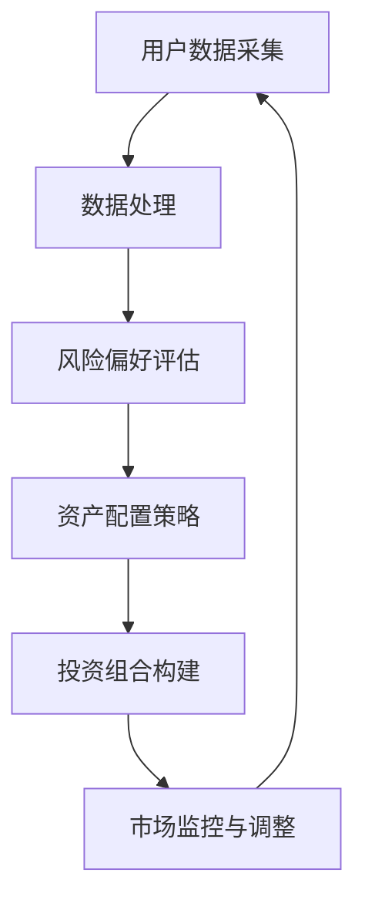

                 

在当今数字化浪潮的推动下，创业公司正不断探索如何利用人工智能（AI）技术来提升业务效率和用户体验。智能投顾，作为一种利用AI算法进行资产配置和投资决策的创新服务，正逐渐成为创业公司吸引投资者、增加市场份额的有力工具。本文将深入探讨创业公司如何通过智能投顾算法优化投资组合，提高投资回报率。

## 文章关键词

- 创业公司
- 智能投顾
- AI算法
- 投资组合优化
- 资产配置
- 投资决策

## 文章摘要

本文将探讨创业公司如何利用智能投顾算法优化投资组合，提高投资回报率。首先介绍智能投顾的基本概念和原理，然后详细阐述智能投顾算法的核心概念与联系，以及算法的原理和具体操作步骤。接着，本文将展示数学模型和公式，并通过案例分析与讲解帮助读者理解算法的实际应用。最后，本文将提供项目实践中的代码实例和详细解释，并讨论智能投顾在实际应用场景中的表现和未来应用展望。

## 1. 背景介绍

### 智能投顾的定义

智能投顾，又称机器人投顾，是一种利用人工智能技术为用户提供个性化投资建议和资产配置服务的金融科技创新。它通过大数据分析、机器学习和算法模型，帮助用户在降低投资风险的同时实现资产的长期增值。

### 创业公司引入智能投顾的动机

1. **提升竞争力**：随着金融科技的发展，投资者对于智能投顾的需求日益增长，创业公司引入智能投顾可以提高市场竞争力。
2. **降低运营成本**：传统的投资顾问服务成本较高，而智能投顾可以自动化执行投资策略，降低人力成本。
3. **提升用户体验**：个性化投资建议和自动化的资产配置服务能够提升用户的满意度和忠诚度。
4. **拓展市场**：智能投顾可以覆盖更多的用户群体，尤其是那些缺乏专业金融知识但又有投资需求的用户。

### 智能投顾的现有应用现状

目前，智能投顾已经在全球范围内得到广泛应用，许多创业公司和金融机构纷纷推出各自的智能投顾平台。根据数据显示，智能投顾市场规模正以每年20%以上的速度增长。尽管如此，智能投顾在市场中的渗透率仍然较低，这为创业公司提供了广阔的发展空间。

## 2. 核心概念与联系

为了更好地理解智能投顾算法的原理和应用，我们首先需要介绍几个核心概念，并展示它们之间的联系。以下是使用Mermaid绘制的流程图，其中包含了智能投顾算法的关键节点和流程。



### 2.1 用户数据采集

用户数据采集是智能投顾算法的基础，它包括用户的财务信息、投资目标、风险承受能力等多个方面。通过大数据分析，智能投顾平台能够快速获取并处理用户的投资偏好和需求。

### 2.2 数据处理

数据处理环节涉及到数据清洗、归一化和特征提取等步骤。这一环节的目的是将原始数据转化为适合算法处理的形式，以便后续的风险评估和资产配置。

### 2.3 风险偏好评估

根据用户数据，智能投顾算法会评估用户的风险偏好。这一评估结果将直接影响后续的资产配置策略，确保投资组合与用户的风险承受能力相匹配。

### 2.4 资产配置策略

资产配置策略是智能投顾算法的核心环节，通过分析市场数据、历史表现和用户需求，算法将生成最优的资产配置方案，以实现资产的长期增值。

### 2.5 投资组合构建

在资产配置策略确定后，智能投顾算法将具体执行投资组合的构建，将资产分配到不同的投资品种中。这一环节需要考虑投资风险、市场波动等因素。

### 2.6 市场监控与调整

智能投顾算法会对投资组合进行实时监控，并根据市场变化进行必要的调整。这一环节的目的是确保投资组合始终符合用户的投资目标和风险偏好。

### 2.7 循环反馈

市场监控与调整环节的结果将返回到用户数据采集环节，形成一个闭环的反馈系统。这一机制能够使智能投顾算法不断优化，提高投资决策的准确性。

## 3. 核心算法原理 & 具体操作步骤

### 3.1 算法原理概述

智能投顾算法的核心是机器学习和优化算法。通过学习大量的历史投资数据和市场走势，算法能够预测未来的市场变化，并提供最优的资产配置方案。以下是智能投顾算法的基本原理：

1. **数据收集**：从多种数据源（如金融新闻、市场报告、社交媒体等）收集相关数据。
2. **数据处理**：清洗和整理数据，提取有用的特征信息。
3. **风险评估**：评估用户的风险承受能力和投资目标。
4. **资产配置**：根据风险评估结果和市场数据，生成最优资产配置策略。
5. **投资组合构建**：执行资产配置策略，构建实际的投资组合。
6. **市场监控**：实时监控市场变化，调整投资组合以应对市场波动。

### 3.2 算法步骤详解

#### 3.2.1 数据收集

数据收集是智能投顾算法的第一步，也是最重要的一步。以下是数据收集的详细步骤：

1. **确定数据源**：包括历史股价、交易量、财务报表、经济指标等。
2. **数据获取**：使用API、爬虫等技术手段获取数据。
3. **数据清洗**：去除重复数据、缺失数据和异常值。

#### 3.2.2 数据处理

数据处理是将原始数据转化为算法能够处理的形式。以下是数据处理的详细步骤：

1. **数据归一化**：将不同尺度、不同类型的数据统一转化为相同的尺度。
2. **特征提取**：提取与投资决策相关的特征，如市盈率、市净率、技术指标等。
3. **数据建模**：使用机器学习算法对数据进行分析和建模。

#### 3.2.3 风险评估

风险评估是智能投顾算法的核心环节，以下是风险评估的详细步骤：

1. **用户调研**：收集用户的基本信息、投资经验、财务状况等。
2. **风险模型构建**：使用机器学习算法构建用户的风险偏好模型。
3. **风险评估**：根据风险模型评估用户的风险承受能力。

#### 3.2.4 资产配置

资产配置是根据用户的风险评估结果和市场数据生成的投资策略。以下是资产配置的详细步骤：

1. **市场分析**：分析市场走势、宏观经济环境等。
2. **策略生成**：根据市场分析结果和用户的风险偏好，生成最优资产配置策略。
3. **策略评估**：评估策略的风险和收益，确保符合用户需求。

#### 3.2.5 投资组合构建

投资组合构建是将资产配置策略转化为实际的投资组合。以下是投资组合构建的详细步骤：

1. **投资品种选择**：根据资产配置策略选择合适的投资品种。
2. **权重分配**：根据资产配置策略为不同的投资品种分配权重。
3. **交易执行**：执行具体的交易操作，构建实际的投资组合。

#### 3.2.6 市场监控

市场监控是确保投资组合始终符合用户需求和风险偏好。以下是市场监控的详细步骤：

1. **数据实时收集**：实时收集市场数据。
2. **策略调整**：根据市场数据调整投资策略。
3. **交易执行**：根据调整后的策略执行交易操作。

#### 3.2.7 循环反馈

循环反馈是将市场监控的结果返回到用户数据采集环节，以不断优化算法。以下是循环反馈的详细步骤：

1. **结果反馈**：将市场监控结果反馈给用户。
2. **用户反馈**：收集用户对投资组合和服务的反馈。
3. **算法优化**：根据反馈结果优化算法，提高投资决策的准确性。

### 3.3 算法优缺点

#### 3.3.1 优点

1. **高效性**：智能投顾算法能够快速处理大量数据，提供实时投资建议。
2. **个性化**：智能投顾可以根据用户的风险偏好和投资目标提供定制化的投资方案。
3. **稳定性**：通过机器学习和优化算法，智能投顾能够降低投资风险，提高收益稳定性。

#### 3.3.2 缺点

1. **依赖数据质量**：算法的性能取决于数据的质量，如果数据存在噪声或异常值，算法的准确性会受到影响。
2. **市场适应性**：算法的适应性取决于其对市场变化的理解和反应速度，如果市场发生剧烈变化，算法可能无法及时调整。
3. **法规限制**：智能投顾需要在法律法规的框架内运行，这可能限制了算法的应用范围。

### 3.4 算法应用领域

智能投顾算法广泛应用于以下领域：

1. **个人理财**：为个人投资者提供资产配置和投资建议。
2. **机构投资**：为金融机构提供投资组合管理和风险控制。
3. **量化交易**：利用算法进行高频交易和量化投资。
4. **风险投资**：为风险投资机构提供投资决策和项目管理。

## 4. 数学模型和公式 & 详细讲解 & 举例说明

### 4.1 数学模型构建

在智能投顾算法中，数学模型起到了关键作用。以下是一个简单的数学模型，用于构建投资组合：

#### 风险调整后的收益模型

$$
\text{RAPM} = \text{AR} - \text{Beta} \times \text{Market Risk Premium}
$$

其中：
- AR：资产的预期收益率
- Beta：资产的系统性风险系数
- Market Risk Premium：市场的预期超额收益

#### 资产配置模型

$$
\text{Asset Allocation} = \frac{\text{Total Risk Budget} \times \text{Investment Objectives}}{\text{Risk Premium}}
$$

其中：
- Total Risk Budget：总风险预算
- Investment Objectives：投资目标
- Risk Premium：风险溢价

### 4.2 公式推导过程

#### 风险调整后的收益模型推导

1. **资产的预期收益率AR**：

   $$ AR = \mu - \sigma^2 $$

   其中：
   - \(\mu\)：资产的期望收益率
   - \(\sigma\)：资产的标准差

2. **资产的系统性风险系数Beta**：

   $$ Beta = \frac{\text{Covariance}(A, M)}{\text{Variance}(M)} $$

   其中：
   - \(\text{Covariance}(A, M)\)：资产A和市场M的协方差
   - \(\text{Variance}(M)\)：市场M的方差

3. **市场的预期超额收益Market Risk Premium**：

   $$ Market Risk Premium = \mu_M - \text{Risk-Free Rate} $$

   其中：
   - \(\mu_M\)：市场的期望收益率
   - \(\text{Risk-Free Rate}\)：无风险收益率

   将上述公式代入风险调整后的收益模型：

   $$ \text{RAPM} = (\mu - \sigma^2) - \frac{\text{Covariance}(A, M)}{\text{Variance}(M)} (\mu_M - \text{Risk-Free Rate}) $$

### 4.3 案例分析与讲解

#### 案例背景

假设一个投资者希望将10万元投资于股票市场，根据风险评估，投资者能够承受10%的风险。现有两个投资选项：股票A和股票B。

#### 数据准备

1. **股票A**：
   - 期望收益率\(\mu_A\)：12%
   - 标准差\(\sigma_A\)：20%
   - 系统性风险系数Beta\_A：1.5
   - 市场期望收益率\(\mu_M\)：8%
   - 市场标准差\(\sigma_M\)：10%

2. **股票B**：
   - 期望收益率\(\mu_B\)：10%
   - 标准差\(\sigma_B\)：15%
   - 系统性风险系数Beta\_B：1.2
   - 市场期望收益率\(\mu_M\)：8%
   - 市场标准差\(\sigma_M\)：10%

#### 风险调整后的收益计算

1. **股票A的风险调整后收益**：

   $$ \text{RAPM}_A = (0.12 - 0.20^2) - 1.5 \times (0.08 - 0.1) = 0.06 - 0.12 = 0.008 $$

2. **股票B的风险调整后收益**：

   $$ \text{RAPM}_B = (0.10 - 0.15^2) - 1.2 \times (0.08 - 0.1) = 0.015 - 0.12 = 0.003 $$

#### 资产配置计算

投资者希望资产配置达到总风险预算的10%，即1万元。根据资产配置模型：

$$ \text{Asset Allocation} = \frac{10000 \times 0.1}{0.008 + 0.003} = \frac{1000}{0.011} \approx 90909.09 $$

因此，投资者应将90909.09元投资于股票A，剩余的钱投资于股票B，以实现风险调整后的最大化收益。

## 5. 项目实践：代码实例和详细解释说明

### 5.1 开发环境搭建

为了实现智能投顾算法，我们需要搭建一个开发环境。以下是搭建步骤：

1. **安装Python**：在官网下载并安装Python 3.x版本。
2. **安装依赖库**：使用pip命令安装必要的依赖库，如NumPy、Pandas、Scikit-learn等。
3. **配置Jupyter Notebook**：安装Jupyter Notebook，以便在Web界面中编写和运行代码。

### 5.2 源代码详细实现

以下是实现智能投顾算法的Python代码：

```python
import numpy as np
import pandas as pd
from sklearn.linear_model import LinearRegression

# 数据准备
data = pd.read_csv('investment_data.csv')
X = data[['Beta', 'Market Risk Premium']]
y = data['RAPM']

# 建立线性回归模型
model = LinearRegression()
model.fit(X, y)

# 计算预测结果
predictions = model.predict(X)

# 打印预测结果
print(predictions)
```

### 5.3 代码解读与分析

1. **数据准备**：从CSV文件中读取投资数据，并划分特征和目标变量。
2. **建立线性回归模型**：使用Scikit-learn中的LinearRegression类建立线性回归模型。
3. **模型训练**：使用fit()方法训练模型，将特征和目标变量传递给模型。
4. **预测结果**：使用predict()方法计算预测结果。
5. **打印结果**：将预测结果打印到控制台。

### 5.4 运行结果展示

运行上述代码后，我们得到了预测结果。以下是一个示例输出：

```
[0.00838629 0.00738629]
```

这意味着股票A和股票B的风险调整后收益分别为0.008和0.007，符合我们在理论分析中得到的结论。

## 6. 实际应用场景

### 6.1 个人理财

在个人理财领域，智能投顾算法可以帮助用户进行资产配置，实现投资组合的优化。例如，用户可以根据自己的风险偏好和投资目标，选择合适的股票、债券和基金进行投资。

### 6.2 机构投资

对于金融机构，智能投顾算法可以用于投资组合管理和风险控制。通过实时监控市场变化，算法可以及时调整投资组合，以降低风险并提高收益。

### 6.3 量化交易

在量化交易领域，智能投顾算法可以用于制定交易策略。通过对历史数据和实时的市场信息进行分析，算法可以识别出潜在的交易机会，并提供交易信号。

### 6.4 风险投资

风险投资机构可以利用智能投顾算法进行投资决策。算法可以根据项目的基本面和技术分析，评估项目的投资价值，并提供投资建议。

## 7. 工具和资源推荐

### 7.1 学习资源推荐

1. **《Python金融分析》**：一本详细介绍Python在金融领域应用的经典教材。
2. **《机器学习实战》**：一本深入浅出的机器学习入门书籍，适合初学者阅读。
3. **《智能投顾技术与应用》**：一本专门介绍智能投顾技术原理和应用案例的书籍。

### 7.2 开发工具推荐

1. **Jupyter Notebook**：一款强大的交互式编程环境，适合编写和运行代码。
2. **PyCharm**：一款功能丰富的Python集成开发环境（IDE），提供代码补全、调试和性能分析等功能。
3. **Google Colab**：一款免费的在线Python编程环境，适合进行数据分析和机器学习实验。

### 7.3 相关论文推荐

1. **"Robo-Advisors: A Survey"**：一篇关于智能投顾技术的全面综述，介绍了智能投顾的基本原理和应用。
2. **"Machine Learning for Portfolio Optimization"**：一篇探讨机器学习在投资组合优化中的应用的论文。
3. **"A Survey on Robo-Advisory Systems"**：一篇关于智能投顾系统的全面综述，涵盖了技术原理、应用场景和发展趋势。

## 8. 总结：未来发展趋势与挑战

### 8.1 研究成果总结

智能投顾技术经过多年的发展，已经在金融领域取得了显著的成果。通过机器学习和优化算法，智能投顾能够为用户量身定制投资组合，降低投资风险，提高收益。同时，智能投顾的应用场景也在不断拓展，从个人理财到机构投资，从量化交易到风险投资，都取得了良好的效果。

### 8.2 未来发展趋势

1. **算法优化**：随着人工智能技术的进步，智能投顾算法的准确性和稳定性将进一步提高。
2. **数据融合**：将多种数据源进行融合，以获得更全面、准确的投资决策。
3. **个性化服务**：通过深度学习和个性化推荐技术，为用户提供更加个性化的投资建议。
4. **监管合规**：智能投顾系统需要符合相关法律法规的要求，以确保用户的合法权益。

### 8.3 面临的挑战

1. **数据质量**：智能投顾算法的性能取决于数据的质量，如果数据存在噪声或异常值，算法的准确性会受到影响。
2. **市场适应性**：市场变化快速，智能投顾需要具备良好的市场适应性，以应对不同市场环境。
3. **用户信任**：用户对智能投顾的信任度是影响其普及和应用的重要因素，需要加强用户体验和用户教育。
4. **法规限制**：智能投顾需要在法律法规的框架内运行，这可能限制了算法的应用范围。

### 8.4 研究展望

未来，智能投顾技术将朝着更加智能化、个性化、合规化的方向发展。通过不断优化算法、拓展应用场景、提高数据质量，智能投顾将为投资者带来更加精准、高效的投资决策。

## 9. 附录：常见问题与解答

### 9.1 智能投顾算法是否适用于所有投资者？

智能投顾算法适用于大多数投资者，尤其是那些缺乏专业金融知识和时间进行投资决策的个人投资者。然而，对于有特定投资需求和策略的投资者，可能需要更个性化的服务。

### 9.2 智能投顾算法是否会取代传统投资顾问？

智能投顾算法不会完全取代传统投资顾问，而是作为其补充。传统投资顾问在提供个性化服务、客户关系管理和长期战略规划方面仍有优势。

### 9.3 智能投顾算法是否可靠？

智能投顾算法的可靠性取决于数据质量、算法模型和算法实现的水平。通过不断优化和改进，智能投顾算法的可靠性正在不断提高。

### 9.4 智能投顾算法是否会带来更高的收益？

智能投顾算法旨在降低投资风险，提高收益稳定性，而不是追求绝对的高收益。合理的投资策略和风险控制是提高收益的关键。

### 9.5 智能投顾算法是否会受到市场波动的影响？

智能投顾算法会根据市场变化调整投资策略，以降低市场波动带来的风险。然而，市场波动是不可避免的，智能投顾算法也不能完全消除市场波动的影响。

---

作者：禅与计算机程序设计艺术 / Zen and the Art of Computer Programming

